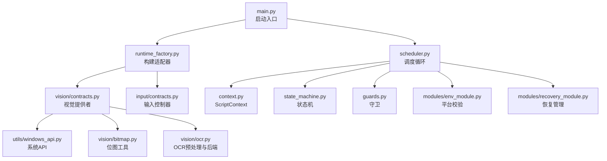
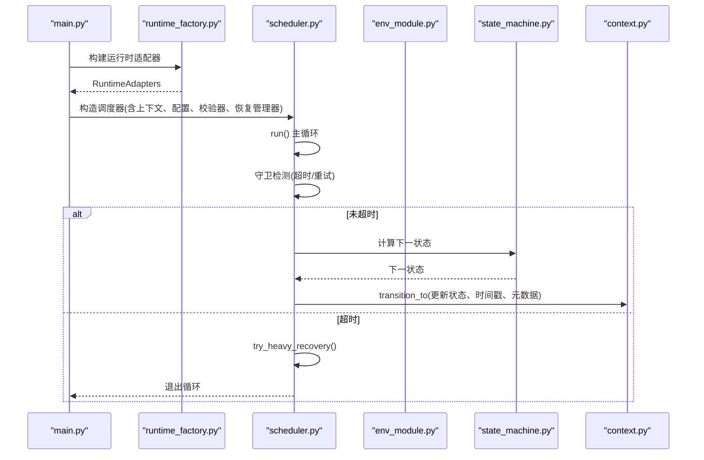
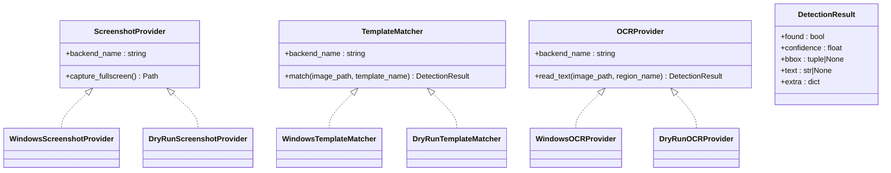
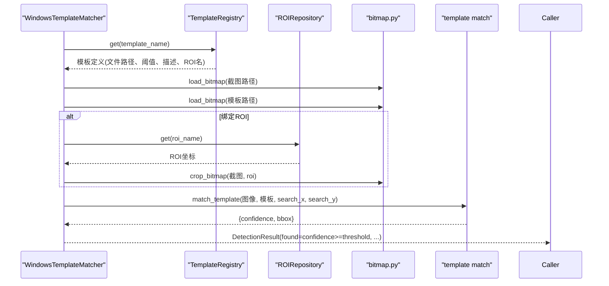
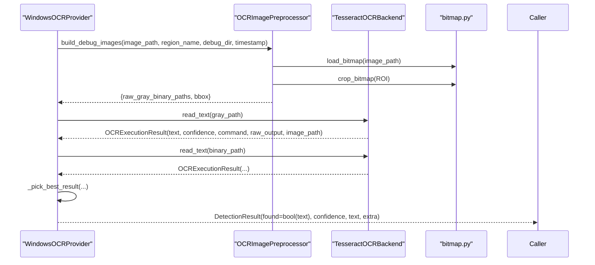
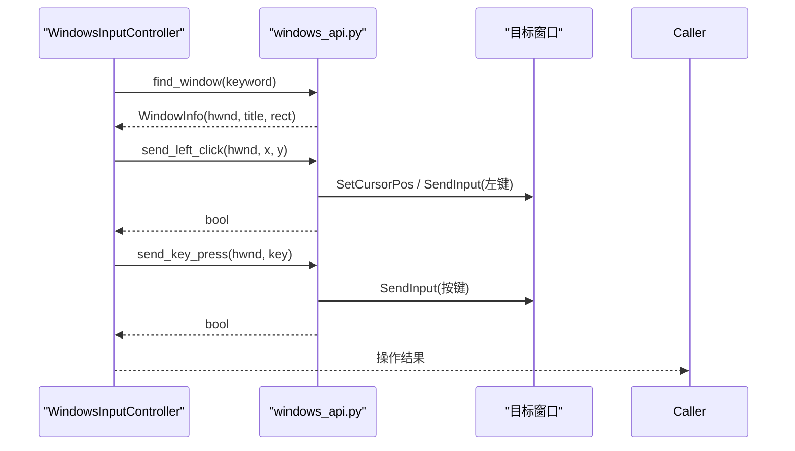
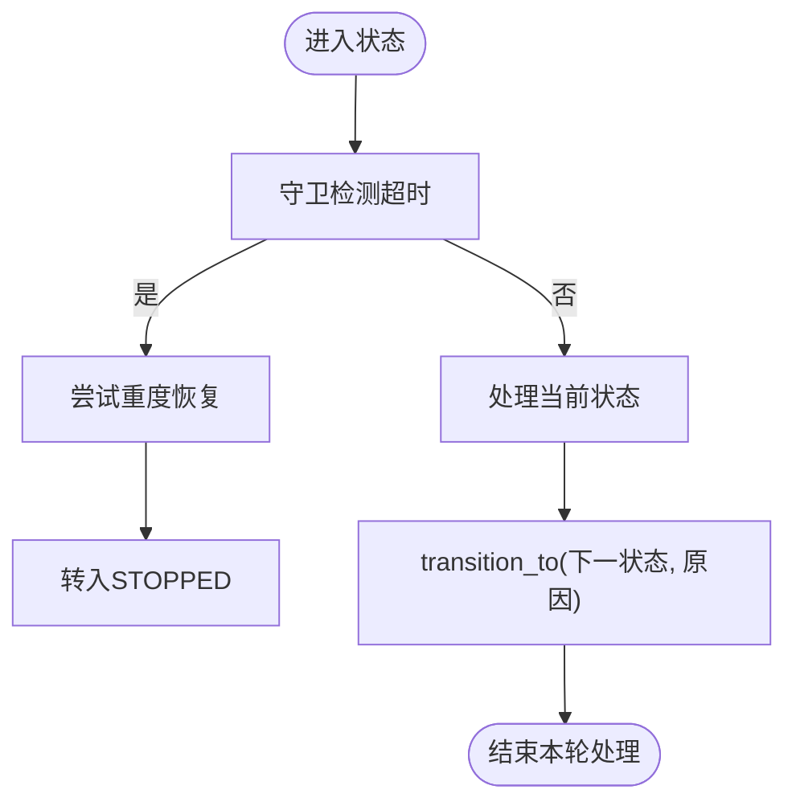
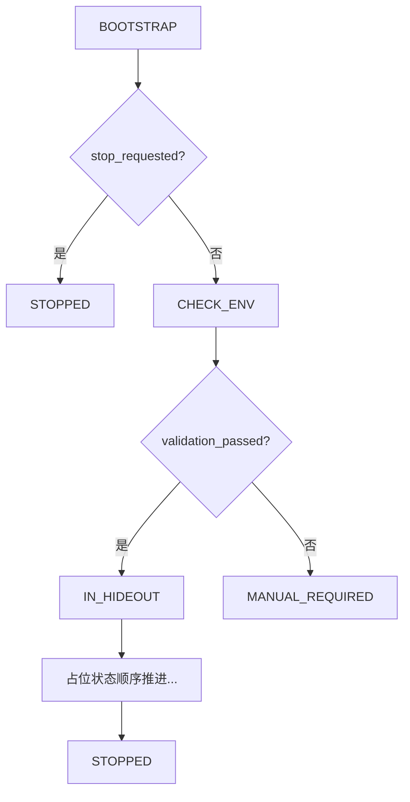
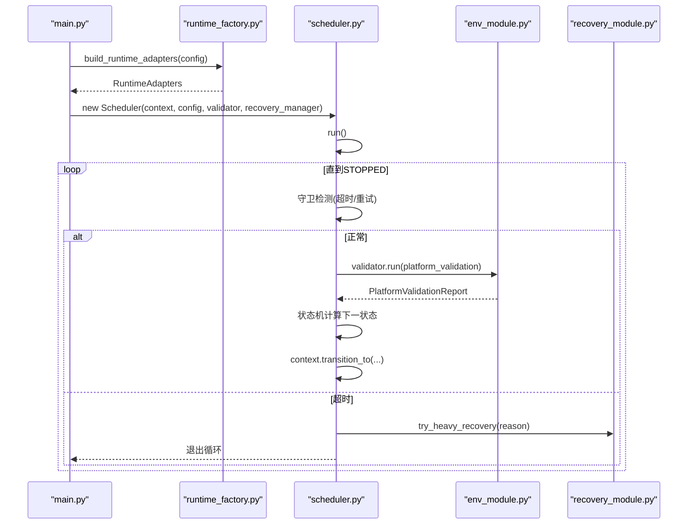
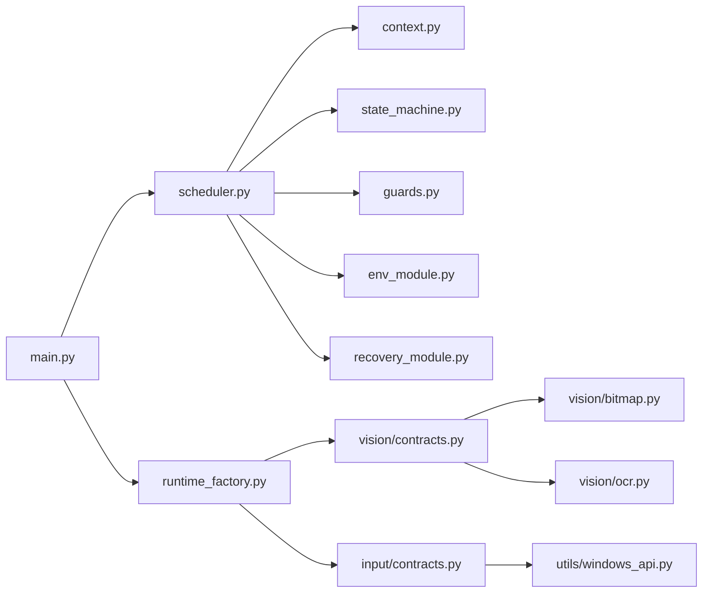

# API参考文档

<cite>
**本文引用的文件**   
- [src/main.py](file://src/main.py)
- [src/core/context.py](file://src/core/context.py)
- [src/core/state_machine.py](file://src/core/state_machine.py)
- [src/core/scheduler.py](file://src/core/scheduler.py)
- [src/core/runtime_factory.py](file://src/core/runtime_factory.py)
- [src/core/guards.py](file://src/core/guards.py)
- [src/vision/contracts.py](file://src/vision/contracts.py)
- [src/vision/bitmap.py](file://src/vision/bitmap.py)
- [src/vision/ocr.py](file://src/vision/ocr.py)
- [src/input/contracts.py](file://src/input/contracts.py)
- [src/utils/windows_api.py](file://src/utils/windows_api.py)
- [src/modules/env_module.py](file://src/modules/env_module.py)
- [src/modules/recovery_module.py](file://src/modules/recovery_module.py)
- [config/app.config.json](file://config/app.config.json)
</cite>

## 目录
1. [简介](#简介)
2. [项目结构](#项目结构)
3. [核心组件](#核心组件)
4. [架构总览](#架构总览)
5. [详细组件分析](#详细组件分析)
6. [依赖关系分析](#依赖关系分析)
7. [性能与稳定性建议](#性能与稳定性建议)
8. [故障排查指南](#故障排查指南)
9. [结论](#结论)
10. [附录：配置项说明](#附录：配置项说明)

## 简介
本API参考文档面向二次开发者，系统化梳理项目的公共接口与扩展点，覆盖以下能力：
- Vision Providers：截图、模板匹配、OCR识别的调用方式与返回数据结构。
- Input Controllers：鼠标点击、键盘按键的标准化调用。
- ScriptContext：状态访问、元数据管理、上下文信息传递。
- State Machine：状态定义、转换规则与扩展方法。
- 运行时装配：通过工厂将不同后端（DryRun/Windows）注入到调度器中。
- 错误处理与异常恢复：超时、重试、人工接管等策略。

## 项目结构
本项目采用分层与按功能域组织的方式：
- core：脚本上下文、状态机、调度器、守卫、运行时装配。
- vision：截图、模板匹配、OCR及位图处理。
- input：输入控制器抽象与实现。
- modules：平台校验、恢复管理。
- utils：Windows API封装。
- config：运行配置。

图表来源
- [src/main.py:22-50](file://src/main.py#L22-L50)
- [src/core/runtime_factory.py:30-77](file://src/core/runtime_factory.py#L30-L77)
- [src/core/scheduler.py:13-47](file://src/core/scheduler.py#L13-L47)
- [src/vision/contracts.py:25-185](file://src/vision/contracts.py#L25-L185)
- [src/input/contracts.py:10-65](file://src/input/contracts.py#L10-L65)
- [src/utils/windows_api.py:121-377](file://src/utils/windows_api.py#L121-L377)
- [src/vision/bitmap.py:17-201](file://src/vision/bitmap.py#L17-L201)
- [src/vision/ocr.py:23-142](file://src/vision/ocr.py#L23-L142)

章节来源
- [src/main.py:22-50](file://src/main.py#L22-L50)
- [src/core/runtime_factory.py:30-77](file://src/core/runtime_factory.py#L30-L77)

## 核心组件
- ScriptContext：维护当前状态、上一状态、轮次计数、重试次数、置信度、截图路径、业务标记、元数据字典、状态计时等。
- StateMachine：提供状态转换逻辑，包括引导后、环境检查后、占位状态的顺序推进。
- Scheduler：主循环驱动，负责超时检测、状态处理、日志记录、进入人工接管或停止。
- RuntimeAdapters：统一装配截图、模板匹配、OCR、输入控制器以及下一步建议。
- PlatformValidator：对截图、模板匹配、OCR、输入进行链路验证并输出报告。
- RecoveryManager：轻量/中等/重度恢复，重度恢复会触发人工接管。
- GuardManager：限制最大重试次数与状态超时。

章节来源
- [src/core/context.py:10-62](file://src/core/context.py#L10-L62)
- [src/core/state_machine.py:6-42](file://src/core/state_machine.py#L6-L42)
- [src/core/scheduler.py:13-83](file://src/core/scheduler.py#L13-L83)
- [src/core/runtime_factory.py:21-77](file://src/core/runtime_factory.py#L21-L77)
- [src/modules/env_module.py:11-88](file://src/modules/env_module.py#L11-L88)
- [src/modules/recovery_module.py:6-20](file://src/modules/recovery_module.py#L6-L20)
- [src/core/guards.py:6-16](file://src/core/guards.py#L6-L16)

## 架构总览
下图展示了从启动到执行主循环的关键交互：main 装配运行时适配器，创建调度器；调度器在循环中根据守卫条件判断是否超时，调用状态机决定下一状态，并通过平台校验模块验证环境。

图表来源
- [src/main.py:22-50](file://src/main.py#L22-L50)
- [src/core/runtime_factory.py:30-77](file://src/core/runtime_factory.py#L30-L77)
- [src/core/scheduler.py:32-47](file://src/core/scheduler.py#L32-L47)
- [src/core/state_machine.py:6-42](file://src/core/state_machine.py#L6-L42)
- [src/core/context.py:47-58](file://src/core/context.py#L47-L58)

## 详细组件分析

### Vision Providers 接口
- ScreenshotProvider
  - 目的：截取目标窗口客户区图像，返回图片路径。
  - 关键方法：capture_fullscreen() -> Path
  - 实现：
    - WindowsScreenshotProvider：基于Windows API捕获客户区BMP，文件名带时间戳。
    - DryRunScreenshotProvider：写入占位文本，便于开发调试。
- TemplateMatcher
  - 目的：在截图中匹配模板，返回检测结果。
  - 关键方法：match(image_path, template_name) -> DetectionResult
  - 实现：
    - WindowsTemplateMatcher：加载模板与ROI，裁剪搜索区域，执行模板匹配，依据阈值判定命中。
    - DryRunTemplateMatcher：直接返回成功结果。
- OCRProvider
  - 目的：对指定区域进行OCR识别，返回文本与置信度。
  - 关键方法：read_text(image_path, region_name) -> DetectionResult
  - 实现：
    - WindowsOCRProvider：使用OCRImagePreprocessor生成灰度与二值化调试图，调用TesseractOCRBackend解析TSV，选择最佳结果。
    - DryRunOCRProvider：返回模拟结果。
- DetectionResult
  - 字段：found(bool)、confidence(float)、bbox(tuple|None)、text(str|None)、extra(dict)
  - 用途：统一表达视觉识别结果，供上层决策。

图表来源
- [src/vision/contracts.py:16-185](file://src/vision/contracts.py#L16-L185)
- [src/vision/contracts.py:188-251](file://src/vision/contracts.py#L188-L251)

调用序列示例（模板匹配）

图表来源
- [src/vision/contracts.py:119-185](file://src/vision/contracts.py#L119-L185)
- [src/vision/bitmap.py:118-165](file://src/vision/bitmap.py#L118-L165)

调用序列示例（OCR识别）

图表来源
- [src/vision/contracts.py:188-251](file://src/vision/contracts.py#L188-L251)
- [src/vision/ocr.py:73-142](file://src/vision/ocr.py#L73-L142)
- [src/vision/ocr.py:23-70](file://src/vision/ocr.py#L23-L70)

章节来源
- [src/vision/contracts.py:25-185](file://src/vision/contracts.py#L25-L185)
- [src/vision/contracts.py:188-251](file://src/vision/contracts.py#L188-L251)
- [src/vision/bitmap.py:17-201](file://src/vision/bitmap.py#L17-L201)
- [src/vision/ocr.py:23-142](file://src/vision/ocr.py#L23-L142)

### Input Controllers 接口
- InputController
  - 目的：标准化鼠标与键盘操作。
  - 关键方法：
    - click(x, y) -> bool：在目标窗口客户区坐标点击。
    - press_key(key) -> bool：发送按键事件。
  - 实现：
    - WindowsInputController：查找目标窗口，调用底层SendInput发送点击与按键，并记录调试日志。
    - DryRunInputController：返回成功，不实际操作系统。
- Windows API封装
  - find_window(title_keyword)：枚举可见窗口，按标题关键词匹配或回退前台窗口。
  - capture_window_client_area(hwnd, output_path)：捕获客户区为BMP。
  - send_left_click(hwnd, x, y)：移动光标并发送左键按下/抬起。
  - send_key_press(hwnd, key)：发送按键按下/抬起，支持常见键与F1-F24。

图表来源
- [src/input/contracts.py:10-65](file://src/input/contracts.py#L10-L65)
- [src/utils/windows_api.py:121-377](file://src/utils/windows_api.py#L121-L377)

章节来源
- [src/input/contracts.py:10-65](file://src/input/contracts.py#L10-L65)
- [src/utils/windows_api.py:121-377](file://src/utils/windows_api.py#L121-L377)

### ScriptContext 接口
- 作用：承载脚本运行期的状态与元数据，供调度器、状态机、恢复模块共享。
- 关键字段：
  - current_state、previous_state：当前与上一状态。
  - round_index、state_retry_count、round_failure_count：轮次与重试计数。
  - scene_confidence：场景置信度。
  - screenshot_path：最近一次截图路径。
  - map_entered、altar_interacted、manual_required、stop_requested：业务标记。
  - state_started_at：状态开始时间。
  - metadata：任意键值对，用于记录上下文信息（如last_transition_reason、recovery_reason）。
- 关键方法：
  - transition_to(next_state, reason)：切换状态并记录原因。
  - mark_retry()：增加状态重试计数。
  - state_elapsed_seconds()：计算当前状态已耗时。
  - bind_screenshot(path)：绑定截图路径。

图表来源
- [src/core/context.py:31-62](file://src/core/context.py#L31-L62)
- [src/core/scheduler.py:32-47](file://src/core/scheduler.py#L32-L47)
- [src/core/guards.py:6-16](file://src/core/guards.py#L6-L16)

章节来源
- [src/core/context.py:10-62](file://src/core/context.py#L10-L62)

### State Machine 扩展方法
- 现有转换：
  - next_after_bootstrap(context)：若请求停止则转STOPPED，否则CHECK_ENV。
  - next_after_check_env(validation_passed)：通过则IN_HIDEOUT，否则MANUAL_REQUIRED。
  - next_placeholder_state(current_state, dry_run_mode)：在非dry_run模式下进入MANUAL_REQUIRED；在dry_run模式下按固定顺序推进至STOPPED。
- 扩展建议：
  - 新增业务状态时，在ScriptState枚举中添加新状态。
  - 在StateMachine中新增对应next_*方法，或在next_placeholder_state中扩展顺序列表。
  - 在Scheduler._handle_current_state中增加分支处理新状态的业务逻辑。
  - 结合GuardManager设置合理的重试与超时策略。

图表来源
- [src/core/state_machine.py:6-42](file://src/core/state_machine.py#L6-L42)
- [src/core/context.py:10-29](file://src/core/context.py#L10-L29)

章节来源
- [src/core/state_machine.py:6-42](file://src/core/state_machine.py#L6-L42)
- [src/core/context.py:10-29](file://src/core/context.py#L10-L29)

### 运行时装配与调度流程
- main函数读取配置，获取日志器，构建运行时适配器，创建PlatformValidator与RecoveryManager，组装Scheduler并运行。
- runtime_factory根据runtime_mode选择Windows或DryRun后端，注入截图、模板匹配、OCR、输入控制器与下一步建议。
- scheduler主循环持续检测超时与状态，调用状态机与平台校验，必要时进入人工接管或停止。

图表来源
- [src/main.py:22-50](file://src/main.py#L22-L50)
- [src/core/runtime_factory.py:30-77](file://src/core/runtime_factory.py#L30-L77)
- [src/core/scheduler.py:32-83](file://src/core/scheduler.py#L32-L83)
- [src/modules/env_module.py:38-88](file://src/modules/env_module.py#L38-L88)
- [src/modules/recovery_module.py:6-20](file://src/modules/recovery_module.py#L6-L20)

章节来源
- [src/main.py:22-50](file://src/main.py#L22-L50)
- [src/core/runtime_factory.py:30-77](file://src/core/runtime_factory.py#L30-L77)
- [src/core/scheduler.py:32-83](file://src/core/scheduler.py#L32-L83)

## 依赖关系分析
- 高层耦合：
  - main依赖runtime_factory、scheduler、validator、recovery_manager。
  - scheduler依赖context、state_machine、guards、validator、recovery_manager。
  - vision.contracts依赖bitmap、ocr、roi、windows_api。
  - input.contracts依赖windows_api。
- 外部依赖：
  - Tesseract OCR可执行文件（可通过配置指定命令）。
  - Windows用户态API（user32、gdi32）。

图表来源
- [src/main.py:22-50](file://src/main.py#L22-L50)
- [src/core/runtime_factory.py:30-77](file://src/core/runtime_factory.py#L30-L77)
- [src/core/scheduler.py:13-83](file://src/core/scheduler.py#L13-L83)
- [src/vision/contracts.py:25-185](file://src/vision/contracts.py#L25-L185)
- [src/input/contracts.py:10-65](file://src/input/contracts.py#L10-L65)

章节来源
- [src/main.py:22-50](file://src/main.py#L22-L50)
- [src/core/runtime_factory.py:30-77](file://src/core/runtime_factory.py#L30-L77)
- [src/core/scheduler.py:13-83](file://src/core/scheduler.py#L13-L83)

## 性能与稳定性建议
- 模板匹配性能：
  - 务必配合ROI裁剪减少搜索区域，避免全图暴力扫描导致性能下降。
  - 合理设置模板阈值，避免误报或漏报。
- OCR性能与准确性：
  - 使用灰度与二值化预处理，调整PSM与语言参数以适配游戏文本。
  - 保存调试图便于定位问题。
- 输入稳定性：
  - 确保目标窗口有效且可见，避免焦点丢失导致输入无效。
  - 对点击与按键结果进行校验，失败时重试或降级。
- 状态机与守卫：
  - 合理配置max_state_retry与state_timeout_sec，防止无限重试与长时间卡死。
  - 低置信度识别不应驱动危险动作，优先停机或人工接管。

[本节为通用指导，不直接分析具体文件]

## 故障排查指南
- 截图链路失败：
  - 检查窗口标题关键词是否正确，确认目标窗口可见且尺寸有效。
  - 查看截图目录是否可写，BMP格式是否被正确生成。
- 模板匹配失败：
  - 检查模板文件是否存在、ROI标定是否与分辨率一致。
  - 调整模板阈值，观察extra中的template_threshold与roi_name。
- OCR链路失败：
  - 确认Tesseract可执行文件可用，语言与PSM配置正确。
  - 查看debug目录下的原始、灰度、二值化图，核对region_name与bbox。
- 输入链路失败：
  - 检查find_window是否找到目标窗口，send_left_click/send_key_press返回值。
  - 关注调试日志中的title、key、result字段。
- 状态超时与恢复：
  - 若频繁超时，检查业务逻辑是否阻塞或识别不稳定。
  - 重度恢复会触发人工接管，需结合metadata中的recovery_reason定位问题。

章节来源
- [src/modules/env_module.py:38-88](file://src/modules/env_module.py#L38-L88)
- [src/modules/recovery_module.py:6-20](file://src/modules/recovery_module.py#L6-L20)
- [src/utils/windows_api.py:121-377](file://src/utils/windows_api.py#L121-L377)
- [src/vision/contracts.py:119-185](file://src/vision/contracts.py#L119-L185)
- [src/vision/ocr.py:23-142](file://src/vision/ocr.py#L23-L142)

## 结论
本项目通过清晰的抽象层（Vision Providers、Input Controllers）、统一的上下文（ScriptContext）与可控的状态机（StateMachine），实现了可扩展、可验证、可恢复的自动化脚本框架。二次开发应遵循以下原则：
- 所有视觉与输入操作均通过抽象接口调用，便于替换后端与测试。
- 状态转换集中管理，新增状态需同步更新枚举、状态机与调度器。
- 严格配置阈值与守卫参数，保证稳定性与安全性。
- 充分利用调试输出与元数据，快速定位问题。

[本节为总结性内容，不直接分析具体文件]

## 附录：配置项说明
- runtime_mode：运行模式（windows/dry_run）。
- dry_run_mode：是否启用干跑模式。
- max_state_retry：单状态最大重试次数。
- state_timeout_sec：单状态超时秒数。
- log_dir、screenshot_dir、debug_dir：日志、截图、调试输出目录。
- window_title_keyword：目标窗口标题关键词。
- ocr_language、ocr_psm、ocr_tesseract_cmd：OCR语言、页面分割模式、可执行命令。
- template_root、template_config_path、roi_config_path：模板根目录、模板配置、ROI配置路径。
- platform_validation：平台校验阈值与参数（截图次数、模板匹配阈值、OCR置信度阈值、输入成功率阈值）。

章节来源
- [config/app.config.json:1-23](file://config/app.config.json#L1-L23)