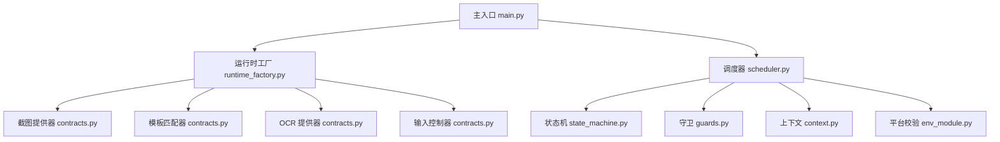
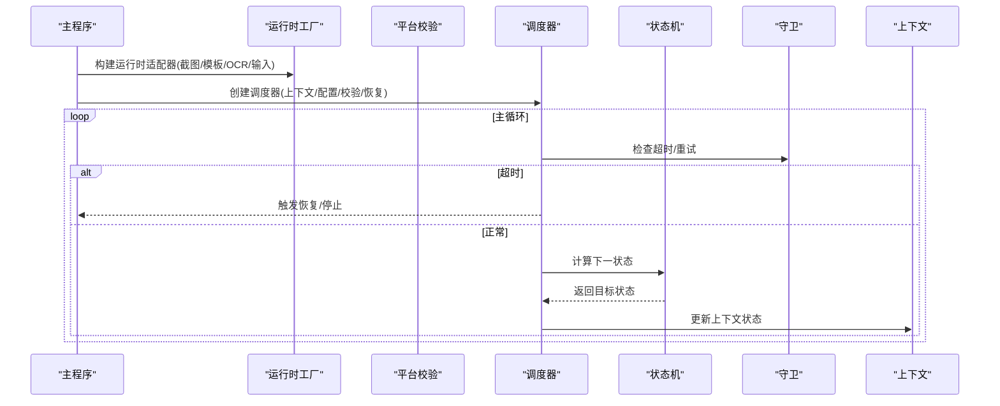
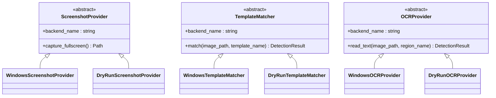
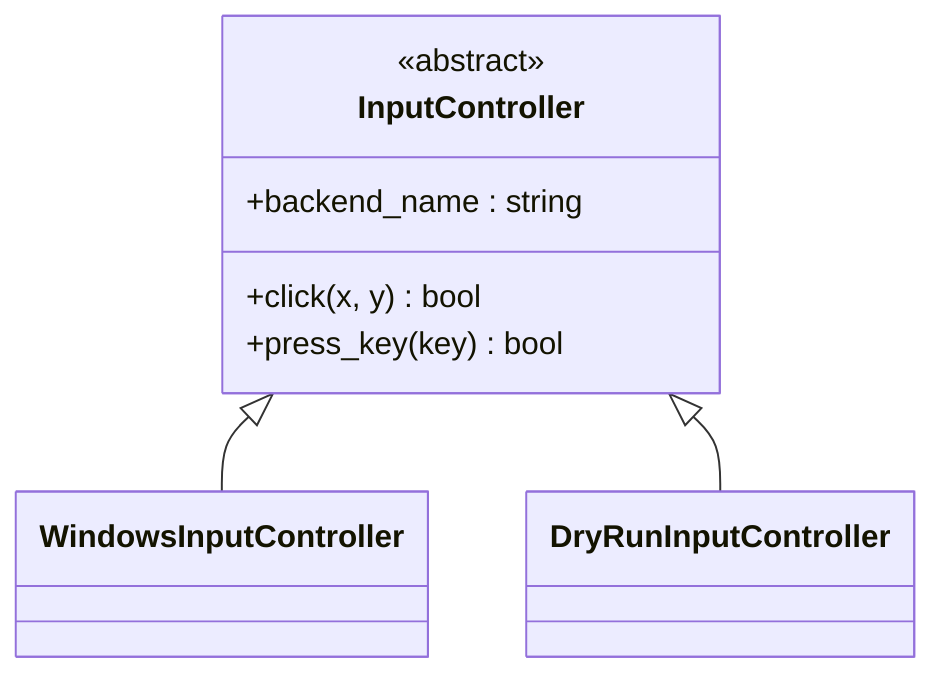
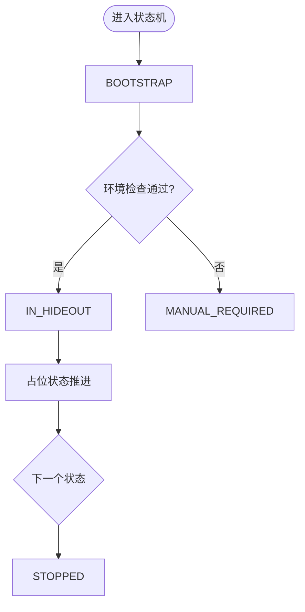
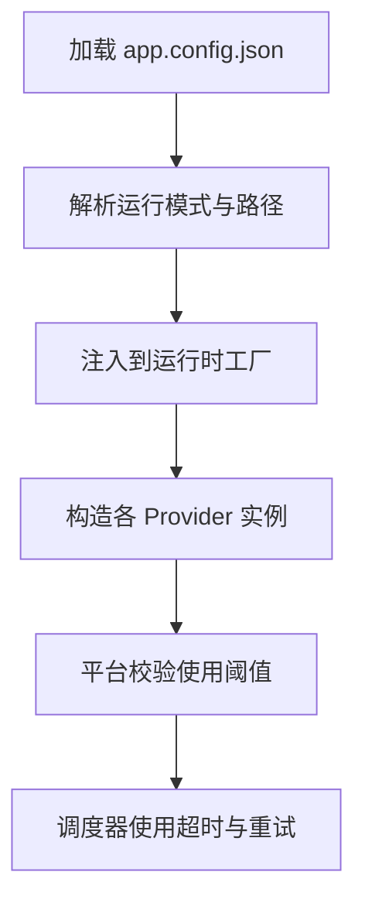
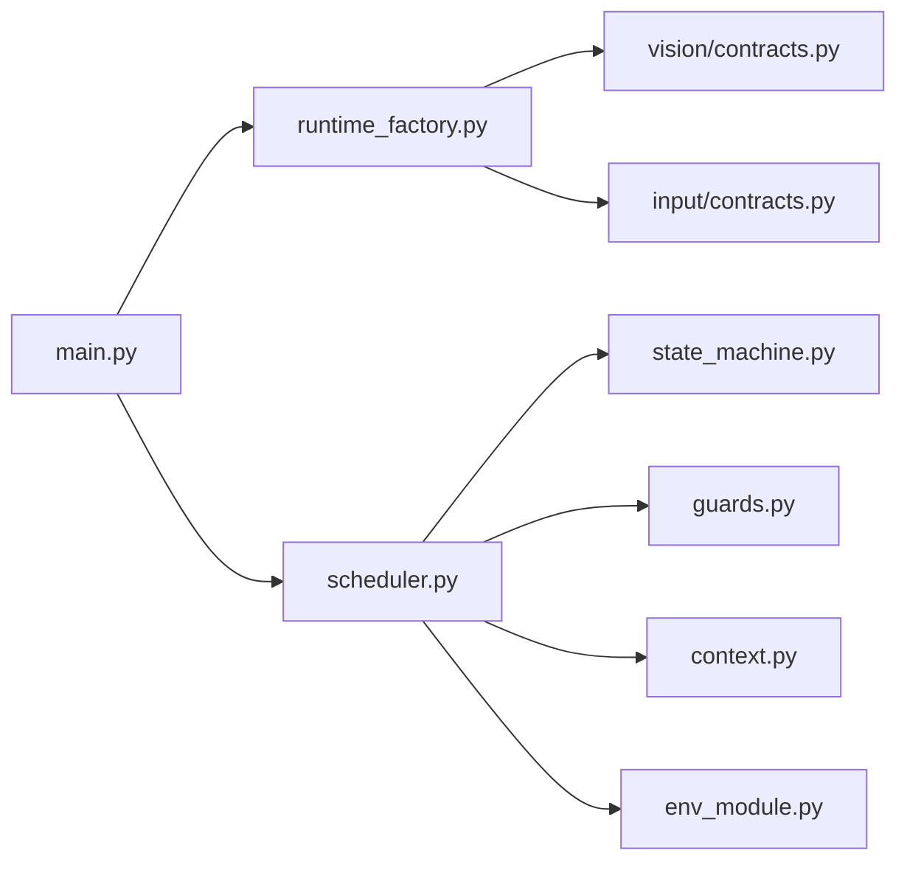

# 扩展开发指南

<cite>
**本文引用的文件**
- [src/main.py](file://src/main.py)
- [src/core/context.py](file://src/core/context.py)
- [src/core/state_machine.py](file://src/core/state_machine.py)
- [src/core/scheduler.py](file://src/core/scheduler.py)
- [src/core/guards.py](file://src/core/guards.py)
- [src/core/runtime_factory.py](file://src/core/runtime_factory.py)
- [src/vision/contracts.py](file://src/vision/contracts.py)
- [src/input/contracts.py](file://src/input/contracts.py)
- [config/app.config.json](file://config/app.config.json)
- [config/templates.config.json](file://config/templates.config.json)
- [config/roi.config.json](file://config/roi.config.json)
- [README.md](file://README.md)
</cite>

## 目录
1. [简介](#简介)
2. [项目结构](#项目结构)
3. [核心组件](#核心组件)
4. [架构总览](#架构总览)
5. [详细组件分析](#详细组件分析)
6. [依赖关系分析](#依赖关系分析)
7. [性能考虑](#性能考虑)
8. [故障排查指南](#故障排查指南)
9. [结论](#结论)
10. [附录](#附录)

## 简介
本指南面向希望扩展该脚本系统的开发者，目标是提供一套可操作的“插件化”扩展方法。你将学会：
- 如何新增自定义 Vision Provider（截图、模板匹配、OCR）并注册到系统
- 如何扩展 Input Controller，支持新输入设备或协议适配
- 如何在状态机中添加新的游戏状态，包括定义、转换条件与执行逻辑
- 如何扩展配置系统，添加新配置项与验证规则
- 如何编写完整的插件示例，从项目结构到代码实现
- 测试策略、调试技巧与部署方法
- 如何与现有系统集成并进行兼容性测试

## 项目结构
系统采用分层与契约驱动设计：
- 入口与装配：main 负责加载配置、构建运行时适配器、组装调度器
- 运行时装配：runtime_factory 根据配置选择 dry_run 或 windows 后端
- 视觉层：vision.contracts 定义 ScreenshotProvider、TemplateMatcher、OCRProvider 抽象及 Windows/DryRun 实现
- 输入层：input.contracts 定义 InputController 抽象及 DryRun/Windows 实现
- 核心流程：scheduler 驱动状态机，结合 guards 做超时与重试保护
- 上下文与状态：context 定义 ScriptState 枚举和 ScriptContext 数据容器
- 配置：app.config.json、templates.config.json、roi.config.json 管理运行参数、模板与 ROI

图表来源
- [src/main.py:22-50](file://src/main.py#L22-L50)
- [src/core/runtime_factory.py:30-76](file://src/core/runtime_factory.py#L30-L76)
- [src/vision/contracts.py:25-55](file://src/vision/contracts.py#L25-L55)
- [src/input/contracts.py:10-22](file://src/input/contracts.py#L10-L22)
- [src/core/scheduler.py:13-47](file://src/core/scheduler.py#L13-L47)

章节来源
- [src/main.py:22-50](file://src/main.py#L22-L50)
- [src/core/runtime_factory.py:30-76](file://src/core/runtime_factory.py#L30-L76)
- [config/app.config.json:1-23](file://config/app.config.json#L1-L23)

## 核心组件
- 运行时适配器：统一封装截图、模板匹配、OCR、输入等能力，按模式切换后端
- 平台校验：串联截图、模板匹配、OCR、输入链路，输出通过与否与建议
- 状态机：定义状态流转策略，占位状态下顺序推进业务状态
- 调度器：主循环驱动状态处理，集成超时与恢复机制
- 上下文：承载当前状态、重试计数、截图路径、场景置信度等运行时信息

章节来源
- [src/core/runtime_factory.py:21-76](file://src/core/runtime_factory.py#L21-L76)
- [src/modules/env_module.py:11-88](file://src/modules/env_module.py#L11-L88)
- [src/core/state_machine.py:6-42](file://src/core/state_machine.py#L6-L42)
- [src/core/scheduler.py:13-83](file://src/core/scheduler.py#L13-L83)
- [src/core/context.py:10-62](file://src/core/context.py#L10-L62)

## 架构总览
系统以“契约 + 工厂 + 调度”为核心：
- 契约层定义抽象接口，屏蔽平台差异
- 工厂层依据配置注入具体实现
- 调度层编排业务流程，保证健壮性

图表来源
- [src/core/scheduler.py:32-83](file://src/core/scheduler.py#L32-L83)
- [src/core/state_machine.py:6-42](file://src/core/state_machine.py#L6-L42)
- [src/core/guards.py:6-16](file://src/core/guards.py#L6-L16)
- [src/core/context.py:31-62](file://src/core/context.py#L31-L62)

## 详细组件分析

### 扩展自定义 Vision Provider
Vision 层包含三类抽象：
- ScreenshotProvider：负责截取全屏图像
- TemplateMatcher：基于模板进行画面元素匹配
- OCRProvider：对指定区域进行文本识别

每个抽象都要求实现 backend_name 属性，便于日志与诊断。

图表来源
- [src/vision/contracts.py:25-55](file://src/vision/contracts.py#L25-L55)
- [src/vision/contracts.py:58-99](file://src/vision/contracts.py#L58-L99)
- [src/vision/contracts.py:101-185](file://src/vision/contracts.py#L101-L185)
- [src/vision/contracts.py:188-251](file://src/vision/contracts.py#L188-L251)

实现步骤
- 新建类继承对应抽象基类，实现 backend_name 与核心方法
- 在运行时工厂中按配置注入你的实现
- 使用平台校验模块验证新 Provider 的可用性

关键参考
- 抽象定义与默认实现位置：[src/vision/contracts.py:25-251](file://src/vision/contracts.py#L25-L251)
- 运行时装配入口：[src/core/runtime_factory.py:30-76](file://src/core/runtime_factory.py#L30-L76)

章节来源
- [src/vision/contracts.py:25-251](file://src/vision/contracts.py#L25-L251)
- [src/core/runtime_factory.py:30-76](file://src/core/runtime_factory.py#L30-L76)

### 扩展 Input Controller
InputController 抽象定义了点击与按键两个核心动作，并提供 backend_name 用于标识后端。

图表来源
- [src/input/contracts.py:10-65](file://src/input/contracts.py#L10-L65)

实现步骤
- 新建类继承 InputController，实现 click 与 press_key
- 在运行时工厂中按配置注入你的实现
- 通过平台校验模块验证输入链路是否可用

关键参考
- 抽象与默认实现位置：[src/input/contracts.py:10-65](file://src/input/contracts.py#L10-L65)
- 运行时装配入口：[src/core/runtime_factory.py:30-76](file://src/core/runtime_factory.py#L30-L76)

章节来源
- [src/input/contracts.py:10-65](file://src/input/contracts.py#L10-L65)
- [src/core/runtime_factory.py:30-76](file://src/core/runtime_factory.py#L30-L76)

### 添加新的游戏状态到状态机
状态机目前提供三种转换：
- 启动后进入环境检查
- 环境检查通过后进入藏身处状态，否则进入人工接管
- 占位状态下按固定顺序推进后续状态

图表来源
- [src/core/state_machine.py:6-42](file://src/core/state_machine.py#L6-L42)
- [src/core/scheduler.py:49-83](file://src/core/scheduler.py#L49-L83)

实现步骤
- 在上下文中确认新状态已定义（如尚未定义需先添加）
- 在状态机中新增转换逻辑（例如：在某条件下跳转到新状态）
- 在调度器中为新状态添加处理分支（读取配置、调用视觉/输入、更新上下文）
- 为状态增加超时与重试保护（guards）

关键参考
- 状态枚举定义：[src/core/context.py:10-29](file://src/core/context.py#L10-L29)
- 状态机转换：[src/core/state_machine.py:6-42](file://src/core/state_machine.py#L6-L42)
- 调度器状态处理：[src/core/scheduler.py:49-83](file://src/core/scheduler.py#L49-L83)

章节来源
- [src/core/context.py:10-29](file://src/core/context.py#L10-L29)
- [src/core/state_machine.py:6-42](file://src/core/state_machine.py#L6-L42)
- [src/core/scheduler.py:49-83](file://src/core/scheduler.py#L49-L83)

### 配置系统的扩展机制
配置项集中在 app.config.json，涵盖运行模式、阈值、路径、窗口关键词、OCR 参数、模板与 ROI 路径等。

图表来源
- [config/app.config.json:1-23](file://config/app.config.json#L1-L23)
- [src/core/runtime_factory.py:30-76](file://src/core/runtime_factory.py#L30-L76)
- [src/core/scheduler.py:13-31](file://src/core/scheduler.py#L13-L31)

扩展步骤
- 在 app.config.json 中添加新字段（例如：feature_flag、custom_thresholds）
- 在运行时工厂中读取新字段并传递给相应模块
- 在平台校验或状态处理中使用新配置
- 如需验证规则，可在校验模块中增加断言或阈值检查

关键参考
- 配置项定义：[config/app.config.json:1-23](file://config/app.config.json#L1-L23)
- 配置读取与装配：[src/core/runtime_factory.py:30-76](file://src/core/runtime_factory.py#L30-L76)
- 校验阈值使用：[src/modules/env_module.py:38-88](file://src/modules/env_module.py#L38-L88)

章节来源
- [config/app.config.json:1-23](file://config/app.config.json#L1-L23)
- [src/core/runtime_factory.py:30-76](file://src/core/runtime_factory.py#L30-L76)
- [src/modules/env_module.py:38-88](file://src/modules/env_module.py#L38-L88)

### 完整插件开发示例
以下是一个从零开始的插件开发流程示例，展示如何新增一个“自定义截图后端”：

- 项目结构建议
  - src/vision/custom_provider.py：实现自定义 ScreenshotProvider
  - config/app.config.json：新增 custom_backend 开关与参数
  - src/core/runtime_factory.py：根据配置注入自定义后端
  - tools/test_custom_screenshot.py：独立测试脚本

- 代码实现要点
  - 自定义类继承 ScreenshotProvider，实现 backend_name 与 capture_fullscreen
  - 在运行时工厂中按配置选择自定义后端
  - 在平台校验中验证新后端可用性
  - 编写单元测试覆盖异常路径（找不到窗口、写入失败等）

- 集成与兼容性测试
  - 在 dry_run 模式下验证接口契约
  - 切换到 windows 模式验证真实截图
  - 调整分辨率与 ROI，确保兼容不同屏幕设置
  - 记录日志与调试图，定位问题

关键参考
- 抽象契约与默认实现：[src/vision/contracts.py:25-99](file://src/vision/contracts.py#L25-L99)
- 运行时装配：[src/core/runtime_factory.py:30-76](file://src/core/runtime_factory.py#L30-L76)
- 平台校验：[src/modules/env_module.py:38-88](file://src/modules/env_module.py#L38-L88)

章节来源
- [src/vision/contracts.py:25-99](file://src/vision/contracts.py#L25-L99)
- [src/core/runtime_factory.py:30-76](file://src/core/runtime_factory.py#L30-L76)
- [src/modules/env_module.py:38-88](file://src/modules/env_module.py#L38-L88)

## 依赖关系分析
- 主入口依赖运行时工厂、调度器、平台校验与恢复管理器
- 运行时工厂依赖视觉与输入契约的具体实现
- 调度器依赖状态机、守卫、上下文与平台校验
- 平台校验依赖截图、模板匹配、OCR、输入契约

图表来源
- [src/main.py:22-50](file://src/main.py#L22-L50)
- [src/core/runtime_factory.py:30-76](file://src/core/runtime_factory.py#L30-L76)
- [src/core/scheduler.py:13-83](file://src/core/scheduler.py#L13-L83)

章节来源
- [src/main.py:22-50](file://src/main.py#L22-L50)
- [src/core/runtime_factory.py:30-76](file://src/core/runtime_factory.py#L30-L76)
- [src/core/scheduler.py:13-83](file://src/core/scheduler.py#L13-L83)

## 性能考虑
- 模板匹配当前为纯 Python 实现，适合小 ROI 与小模板；在大图上可能较慢
- 建议在 ROI 范围内进行匹配以减少搜索空间
- 对于大规模模板或多帧识别，可考虑引入更高效算法（如 OpenCV）
- 合理设置 OCR 预处理与语言参数，提升识别效率与准确率
- 避免频繁截图与重复 IO，必要时缓存中间结果

## 故障排查指南
- 截图链路失败：检查窗口标题关键词是否正确、截图目录权限、Win32 API 调用
- 模板匹配失败：核对模板路径、ROI 标定、阈值设置
- OCR 失败：确认 Tesseract 安装、语言包、PSM 设置，查看调试图
- 输入失败：确认窗口焦点、坐标体系（客户区 vs 全局）、按键映射
- 状态超时：检查状态处理逻辑是否阻塞、重试次数与超时时间是否合理

章节来源
- [src/modules/env_module.py:38-88](file://src/modules/env_module.py#L38-L88)
- [src/core/scheduler.py:32-47](file://src/core/scheduler.py#L32-L47)
- [src/core/guards.py:6-16](file://src/core/guards.py#L6-L16)

## 结论
本指南提供了扩展 Vision Provider、Input Controller、状态机与配置系统的完整方法。通过契约与工厂模式，系统具备良好的可扩展性与可替换性。建议按阶段逐步接入真实后端，持续完善状态处理与校验机制，确保系统在稳定环境中可靠运行。

## 附录
- 前置可行性验证与验收标准请参考项目说明文档
- 模板与 ROI 配置分别位于 templates.config.json 与 roi.config.json
- 运行模式与阈值在 app.config.json 中集中管理

章节来源
- [README.md:92-124](file://README.md#L92-L124)
- [config/templates.config.json:1-9](file://config/templates.config.json#L1-L9)
- [config/roi.config.json:1-31](file://config/roi.config.json#L1-L31)
- [config/app.config.json:1-23](file://config/app.config.json#L1-L23)