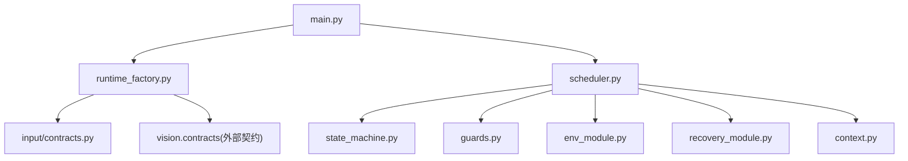
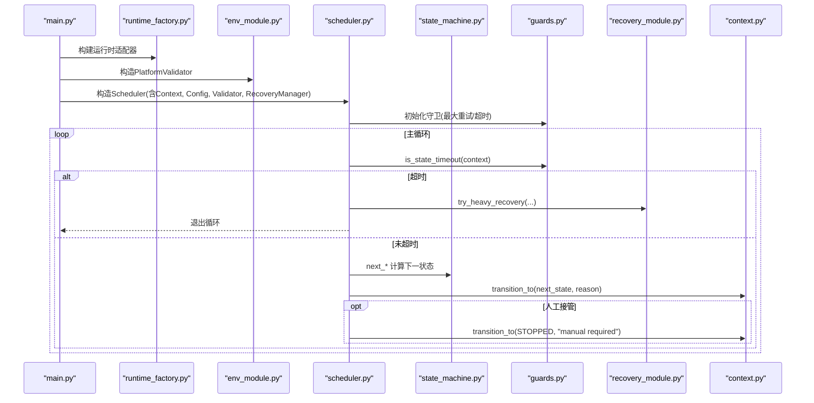
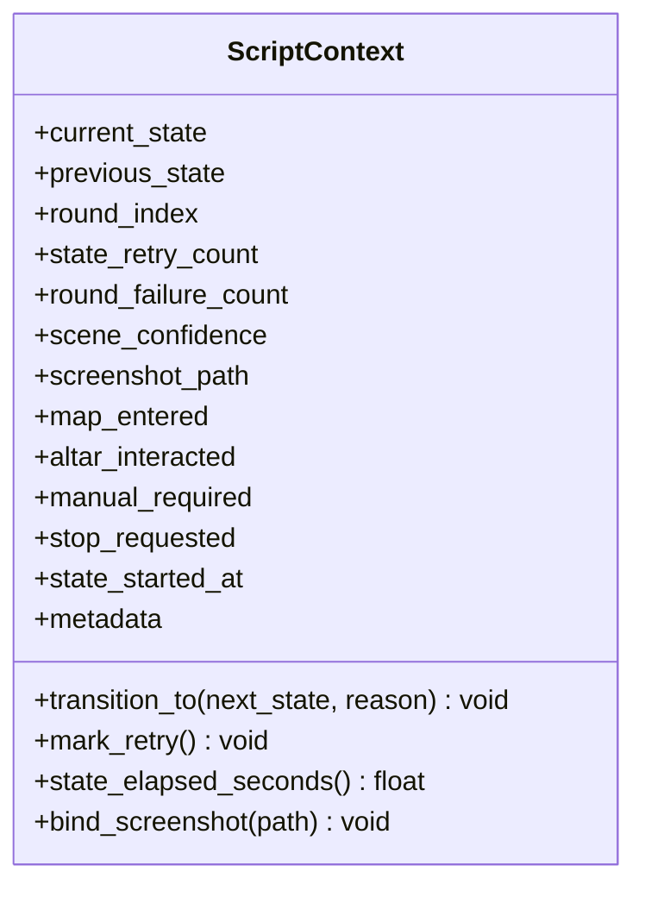
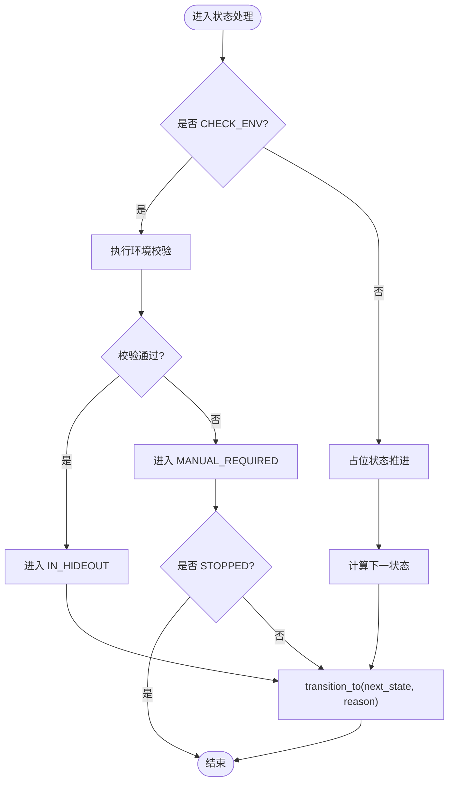
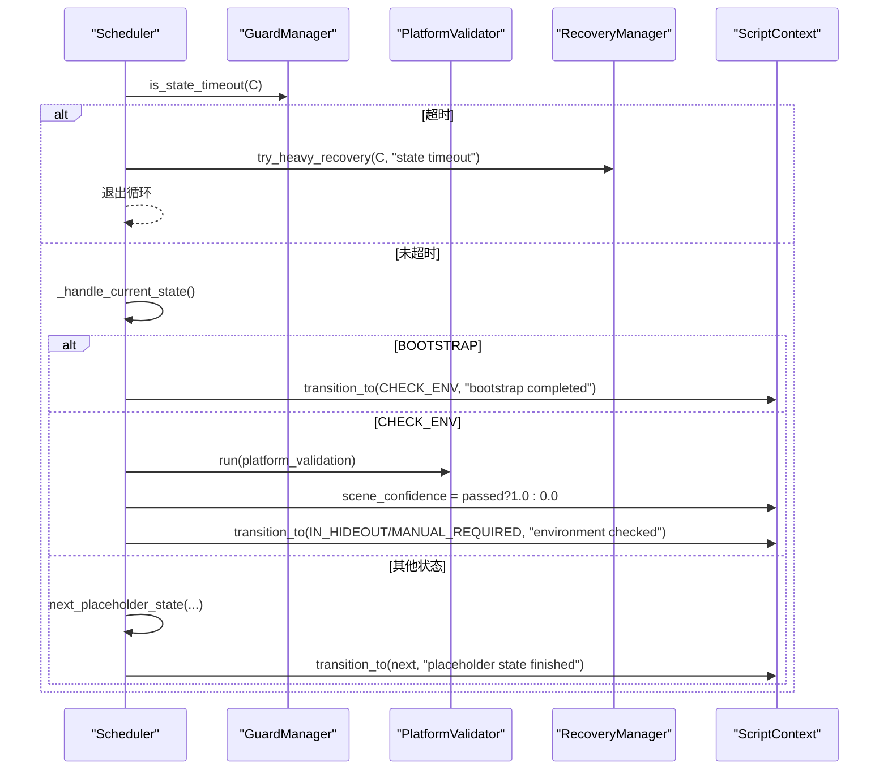
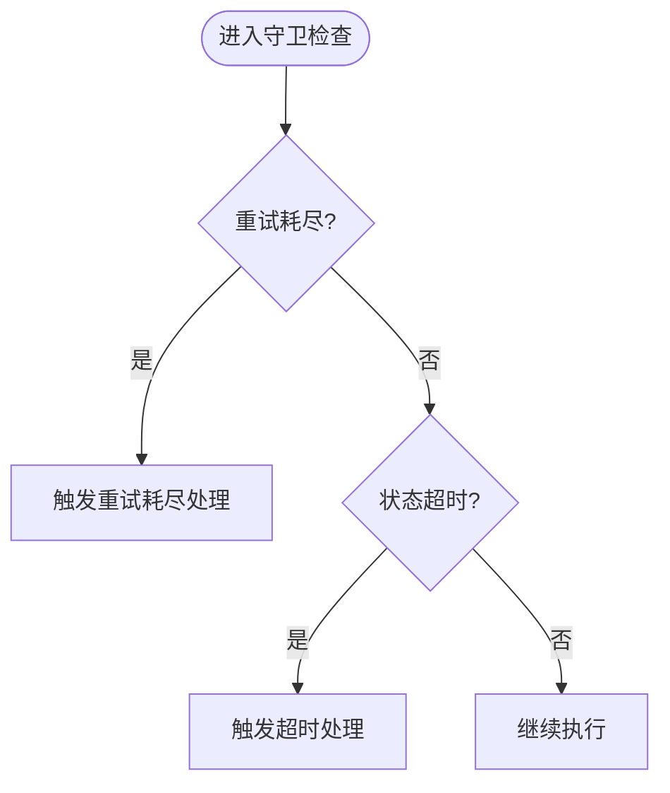
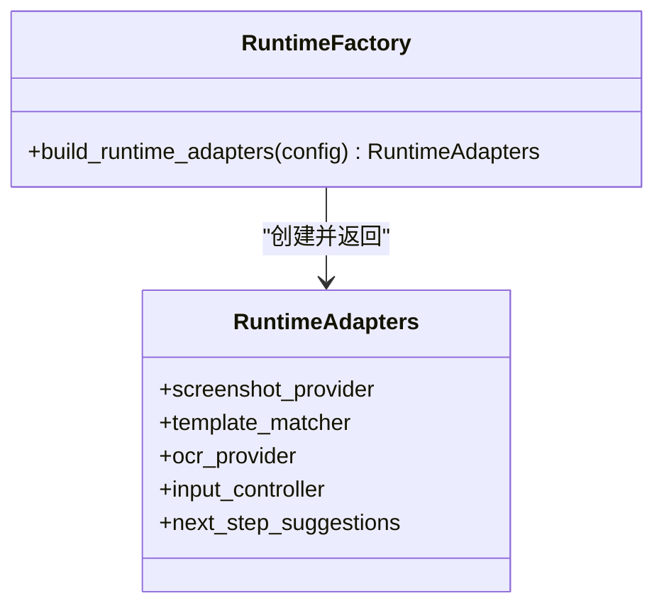
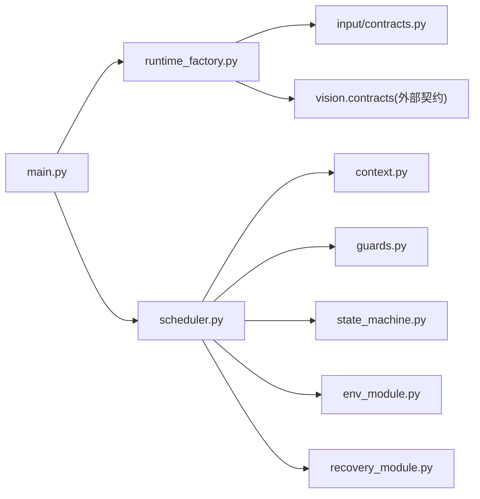

# 核心框架API

<cite>
**本文引用的文件**
- [src/core/context.py](file://src/core/context.py)
- [src/core/state_machine.py](file://src/core/state_machine.py)
- [src/core/scheduler.py](file://src/core/scheduler.py)
- [src/core/guards.py](file://src/core/guards.py)
- [src/core/runtime_factory.py](file://src/core/runtime_factory.py)
- [src/modules/env_module.py](file://src/modules/env_module.py)
- [src/modules/recovery_module.py](file://src/modules/recovery_module.py)
- [src/input/contracts.py](file://src/input/contracts.py)
- [config/app.config.json](file://config/app.config.json)
- [src/main.py](file://src/main.py)
</cite>

## 目录
1. [简介](#简介)
2. [项目结构](#项目结构)
3. [核心组件](#核心组件)
4. [架构总览](#架构总览)
5. [详细组件分析](#详细组件分析)
6. [依赖关系分析](#依赖关系分析)
7. [性能考虑](#性能考虑)
8. [故障排查指南](#故障排查指南)
9. [结论](#结论)
10. [附录：集成示例与最佳实践](#附录集成示例与最佳实践)

## 简介
本文档为核心框架的API参考，聚焦以下关键能力：
- ScriptContext：脚本运行时的状态、元数据、上下文信息传递与生命周期管理。
- State Machine：状态机接口与扩展方法，包括新状态注册、转换规则添加与执行流程控制。
- Scheduler：调度器，负责任务调度、并发控制（当前为单线程顺序执行）与执行监控。
- GuardManager：守卫机制，提供条件检查、前置验证与后置处理钩子。
- RuntimeFactory：工厂模式，用于创建运行时适配器并集中配置管理。
同时提供完整集成示例、最佳实践与常见陷阱避免方法。

## 项目结构
核心代码位于 src/core，配合 modules、input、utils、vision 等模块，通过 main.py 启动装配。配置文件位于 config/app.config.json，定义运行模式、阈值、路径等。

图表来源
- [src/main.py:22-50](file://src/main.py#L22-L50)
- [src/core/runtime_factory.py:30-77](file://src/core/runtime_factory.py#L30-L77)
- [src/core/scheduler.py:13-83](file://src/core/scheduler.py#L13-L83)
- [src/core/state_machine.py:6-42](file://src/core/state_machine.py#L6-L42)
- [src/core/guards.py:6-16](file://src/core/guards.py#L6-L16)
- [src/modules/env_module.py:23-88](file://src/modules/env_module.py#L23-L88)
- [src/modules/recovery_module.py:6-20](file://src/modules/recovery_module.py#L6-L20)
- [src/core/context.py:10-62](file://src/core/context.py#L10-L62)

章节来源
- [src/main.py:22-50](file://src/main.py#L22-L50)
- [config/app.config.json:1-23](file://config/app.config.json#L1-L23)

## 核心组件
- ScriptContext：封装脚本运行期状态、重试计数、场景置信度、截图路径、人工接管标志、停止请求以及时间戳和元数据字典；提供状态迁移、重试标记、耗时查询与截图绑定方法。
- StateMachine：定义状态流转策略，包含引导后、环境检查后与占位状态的默认流转逻辑。
- Scheduler：主循环驱动，结合GuardManager进行超时与重试判断，调用StateMachin e决定下一状态，并协调PlatformValidator与RecoveryManager。
- GuardManager：基于最大重试次数与状态超时阈值的守卫判定。
- RuntimeFactory：根据配置构建不同平台或DryRun模式的运行时适配器集合，统一注入到Validator与Scheduler。

章节来源
- [src/core/context.py:10-62](file://src/core/context.py#L10-L62)
- [src/core/state_machine.py:6-42](file://src/core/state_machine.py#L6-L42)
- [src/core/scheduler.py:13-83](file://src/core/scheduler.py#L13-L83)
- [src/core/guards.py:6-16](file://src/core/guards.py#L6-L16)
- [src/core/runtime_factory.py:21-77](file://src/core/runtime_factory.py#L21-L77)

## 架构总览
整体采用“装配-调度-守卫-状态机”的分层设计：
- 入口 main.py 加载配置，使用RuntimeFactory构建运行时适配器，组装PlatformValidator与RecoveryManager，创建Scheduler并启动run循环。
- Scheduler维护ScriptContext，按GuardManager约束进入状态处理分支，调用StateMachine确定下一状态，必要时触发RecoveryManager恢复。
- PlatformValidator在CHECK_ENV阶段对截图、模板匹配、OCR、输入链路进行校验，输出报告供调度决策。
- GuardManager提供重试耗尽与状态超时的判定，保障鲁棒性。
- RuntimeFactory屏蔽平台差异，支持Windows与DryRun两种后端。

图表来源
- [src/main.py:22-50](file://src/main.py#L22-L50)
- [src/core/runtime_factory.py:30-77](file://src/core/runtime_factory.py#L30-L77)
- [src/modules/env_module.py:38-88](file://src/modules/env_module.py#L38-L88)
- [src/core/scheduler.py:32-83](file://src/core/scheduler.py#L32-L83)
- [src/core/state_machine.py:7-42](file://src/core/state_machine.py#L7-L42)
- [src/core/guards.py:11-16](file://src/core/guards.py#L11-L16)
- [src/modules/recovery_module.py:6-20](file://src/modules/recovery_module.py#L6-L20)
- [src/core/context.py:31-62](file://src/core/context.py#L31-L62)

## 详细组件分析

### ScriptContext：状态访问、元数据管理与生命周期
- 状态字段：当前状态、上一状态、轮次索引、状态重试计数、轮次失败计数、场景置信度、截图路径、地图/祭坛交互标志、人工接管标志、停止请求标志。
- 生命周期：
  - 状态迁移：transition_to 更新当前/上一状态、重置重试计数、记录开始时间与迁移原因。
  - 重试标记：mark_retry 递增重试计数。
  - 耗时统计：state_elapsed_seconds 返回自状态开始以来的秒数。
  - 截图绑定：bind_screenshot 记录截图路径。
- 元数据：metadata 字典用于跨阶段传递任意上下文信息（如恢复原因、中间结果）。

图表来源
- [src/core/context.py:10-62](file://src/core/context.py#L10-L62)

章节来源
- [src/core/context.py:10-62](file://src/core/context.py#L10-L62)

### State Machine：扩展方法与执行流程控制
- 内置转换：
  - next_after_bootstrap：根据 stop_requested 决定是否进入 STOPPED 或 CHECK_ENV。
  - next_after_check_env：根据环境检查结果进入 IN_HIDEOUT 或 MANUAL_REQUIRED。
  - next_placeholder_state：在非干跑模式下进入 MANUAL_REQUIRED；在干跑模式下按固定顺序推进占位状态，直至结束并进入 STOPPED。
- 扩展建议：
  - 新增状态：在 ScriptState 枚举中增加状态值。
  - 新增转换规则：在 StateMachine 中添加 next_after_xxx 方法，并在 Scheduler._handle_current_state 中增加对应分支。
  - 占位状态序列：可在 next_placeholder_state 中调整顺序或插入新步骤。

图表来源
- [src/core/state_machine.py:7-42](file://src/core/state_machine.py#L7-L42)
- [src/core/scheduler.py:49-83](file://src/core/scheduler.py#L49-L83)

章节来源
- [src/core/state_machine.py:6-42](file://src/core/state_machine.py#L6-L42)
- [src/core/scheduler.py:49-83](file://src/core/scheduler.py#L49-L83)

### Scheduler：任务调度、并发控制与执行监控
- 职责：
  - 主循环：持续运行直到 STOPPED。
  - 超时保护：每轮检查状态是否超时，若超时则尝试重度恢复并退出。
  - 状态处理：BOOTSTRAP -> CHECK_ENV -> 占位状态推进。
  - 日志与监控：记录进入状态、环境检查结果与建议、错误信息。
- 并发控制：当前实现为单线程顺序执行，无并发任务队列。
- 监控指标：可通过 context.scene_confidence、context.state_elapsed_seconds、context.metadata 获取执行过程信息。

图表来源
- [src/core/scheduler.py:32-83](file://src/core/scheduler.py#L32-L83)
- [src/modules/env_module.py:38-88](file://src/modules/env_module.py#L38-L88)
- [src/core/guards.py:11-16](file://src/core/guards.py#L11-L16)
- [src/modules/recovery_module.py:6-20](file://src/modules/recovery_module.py#L6-L20)
- [src/core/context.py:31-62](file://src/core/context.py#L31-L62)

章节来源
- [src/core/scheduler.py:13-83](file://src/core/scheduler.py#L13-L83)

### GuardManager：条件检查、前置验证与后置处理
- 功能：
  - is_retry_exhausted：当 context.state_retry_count >= max_retry 时认为重试耗尽。
  - is_state_timeout：当 context.state_elapsed_seconds() >= state_timeout_sec 时认为状态超时。
- 扩展点：
  - 可在此处加入前置验证（例如在进入某状态前检查必要资源）与后置处理（例如记录状态耗时、上报指标）。
  - 可与 RecoveryManager 联动，在耗尽或超时时触发恢复流程。

图表来源
- [src/core/guards.py:6-16](file://src/core/guards.py#L6-L16)
- [src/core/scheduler.py:32-47](file://src/core/scheduler.py#L32-L47)

章节来源
- [src/core/guards.py:6-16](file://src/core/guards.py#L6-L16)

### RuntimeFactory：工厂模式与配置管理
- 职责：
  - 根据 runtime_mode 选择 Windows 或 DryRun 适配器组合。
  - 解析配置项（截图目录、调试目录、窗口标题关键词、OCR语言/PSM/Tesseract命令、模板根与配置路径、ROI配置路径）。
  - 返回统一的 RuntimeAdapters 对象，包含截图、模板匹配、OCR、输入控制器与下一步建议。
- 配置来源：app.config.json 中的各项键值。

图表来源
- [src/core/runtime_factory.py:21-77](file://src/core/runtime_factory.py#L21-L77)
- [config/app.config.json:1-23](file://config/app.config.json#L1-L23)

章节来源
- [src/core/runtime_factory.py:21-77](file://src/core/runtime_factory.py#L21-L77)
- [config/app.config.json:1-23](file://config/app.config.json#L1-L23)

## 依赖关系分析
- main.py 依赖：
  - runtime_factory：构建运行时适配器。
  - scheduler：调度主循环。
  - env_module：平台校验。
  - recovery_module：恢复管理。
  - utils.logger：日志。
- scheduler.py 依赖：
  - context：状态上下文。
  - guards：守卫判定。
  - state_machine：状态流转。
  - env_module：环境校验。
  - recovery_module：恢复。
  - utils.logger：日志。
- runtime_factory.py 依赖：
  - input.contracts：输入控制器抽象与实现。
  - vision.contracts：截图、模板匹配、OCR抽象与实现。
  - core.pathing：路径解析。

图表来源
- [src/main.py:22-50](file://src/main.py#L22-L50)
- [src/core/scheduler.py:13-31](file://src/core/scheduler.py#L13-L31)
- [src/core/runtime_factory.py:30-77](file://src/core/runtime_factory.py#L30-L77)

章节来源
- [src/main.py:22-50](file://src/main.py#L22-L50)
- [src/core/scheduler.py:13-31](file://src/core/scheduler.py#L13-L31)
- [src/core/runtime_factory.py:30-77](file://src/core/runtime_factory.py#L30-L77)

## 性能考虑
- 单线程顺序执行：当前 Scheduler 为单线程，避免并发竞争，但无法并行处理多个任务。如需并发，可在后续引入任务队列与线程池。
- 状态超时与重试：通过 GuardManager 限制单次状态执行时长与重试次数，防止卡死。
- 日志与监控：利用 logger 记录关键节点与环境检查结果，便于定位瓶颈。
- 配置阈值：合理设置 state_timeout_sec、max_state_retry、模板匹配阈值与OCR置信度阈值，平衡稳定性与效率。

[本节为通用指导，不直接分析具体文件]

## 故障排查指南
- 环境检查失败：
  - 查看 PlatformValidator 输出的 errors 与 next_step_suggestions，优先修复截图、模板匹配、OCR、输入链路。
  - 确认 app.config.json 中 platform_validation 的阈值与路径配置正确。
- 状态超时：
  - 检查 state_timeout_sec 是否过小；关注 Scheduler 日志中的“状态超时”提示。
  - 使用 RecoveryManager.try_heavy_recovery 触发重度恢复，必要时转入 MANUAL_REQUIRED。
- 人工接管：
  - 当进入 MANUAL_REQUIRED，流程将停止自动执行，需人工介入后重启。
- 截图与调试：
  - 确保 screenshot_dir、debug_dir 存在且可写；WindowsInputController 会写入调试日志以便回溯点击与按键操作。

章节来源
- [src/modules/env_module.py:38-88](file://src/modules/env_module.py#L38-L88)
- [src/core/scheduler.py:32-47](file://src/core/scheduler.py#L32-L47)
- [src/modules/recovery_module.py:6-20](file://src/modules/recovery_module.py#L6-L20)
- [src/input/contracts.py:37-65](file://src/input/contracts.py#L37-L65)
- [config/app.config.json:1-23](file://config/app.config.json#L1-L23)

## 结论
该框架以清晰的职责分层实现了脚本自动化流程的核心能力：
- ScriptContext 提供统一的状态与元数据载体。
- StateMachine 明确状态流转策略，易于扩展。
- Scheduler 作为中枢协调各模块，具备超时与恢复机制。
- GuardManager 提供轻量守卫判定。
- RuntimeFactory 屏蔽平台差异，便于开发与测试。
建议在后续迭代中逐步完善真实业务状态的处理逻辑，并引入并发与更丰富的监控指标。

[本节为总结，不直接分析具体文件]

## 附录：集成示例与最佳实践

### 集成示例：从配置到运行
- 加载配置：读取 app.config.json，获取运行模式、路径与阈值。
- 构建适配器：调用 build_runtime_adapters 生成截图、模板匹配、OCR、输入控制器。
- 组装校验器：用适配器构造 PlatformValidator，传入平台校验阈值。
- 启动调度：创建 Scheduler，传入 ScriptContext、配置、校验器与恢复管理器，调用 run 启动主循环。

章节来源
- [src/main.py:22-50](file://src/main.py#L22-L50)
- [config/app.config.json:1-23](file://config/app.config.json#L1-L23)

### 最佳实践
- 状态设计：
  - 每个状态应有明确的进入条件、处理逻辑与退出条件；在 StateMachine 中显式声明转换规则。
  - 使用 ScriptContext.transition_to 记录迁移原因，便于追踪。
- 超时与重试：
  - 合理设置 state_timeout_sec 与 max_state_retry，避免过快失败或长时间卡住。
  - 在 GuardManager 中可扩展前置验证（如资源可用性）与后置处理（如指标上报）。
- 平台适配：
  - 通过 RuntimeFactory 切换 Windows/DryRun 模式，开发阶段优先使用 DryRun 快速验证逻辑。
  - 真实模式需确保 OCR、模板匹配与输入控制器稳定可用。
- 日志与调试：
  - 充分利用 logger 记录关键节点与环境检查结果。
  - 使用 debug_dir 下的输入动作日志辅助定位问题。
- 元数据使用：
  - 通过 context.metadata 传递跨阶段信息（如恢复原因、中间结果），减少全局变量。

[本节为通用指导，不直接分析具体文件]

### 常见陷阱与避免方法
- 忘记更新状态：
  - 每次状态处理完成后必须调用 transition_to，否则主循环不会推进。
- 阈值设置不当：
  - 模板匹配阈值过高可能导致误判；OCR置信度过低可能引入噪声。应根据实际场景调优。
- 路径与权限：
  - 截图与调试目录不存在或无写入权限会导致异常；确保目录存在且可写。
- 人工接管未处理：
  - 进入 MANUAL_REQUIRED 后流程停止，需在业务层提供人工干预入口或自动恢复策略。
- 并发扩展误区：
  - 当前为单线程，不要假设并发安全；如需并发，应在 Scheduler 中引入任务队列与锁机制。

[本节为通用指导，不直接分析具体文件]