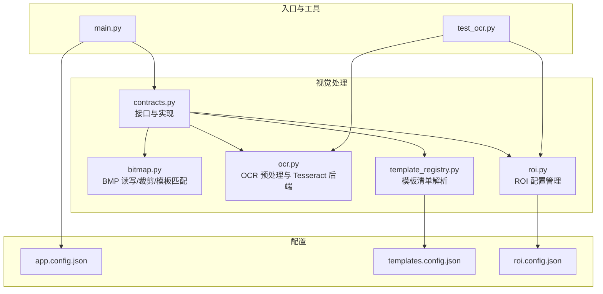
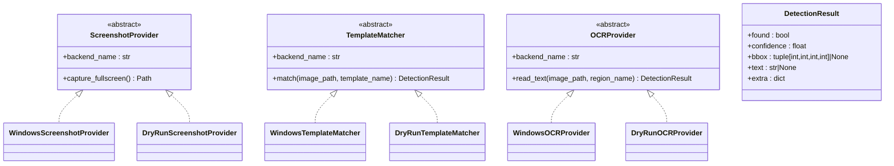
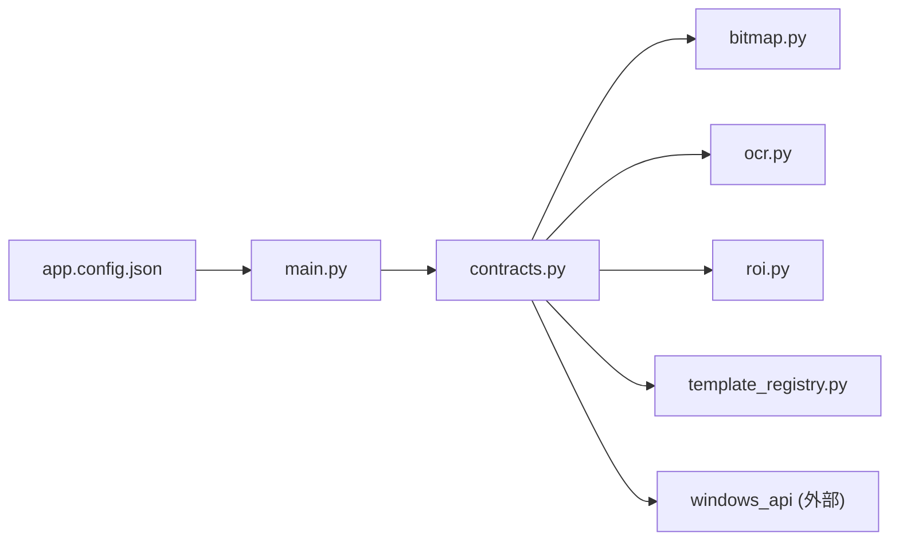

# 视觉处理API

<cite>
**本文引用的文件**
- [contracts.py](file://src/vision/contracts.py)
- [bitmap.py](file://src/vision/bitmap.py)
- [ocr.py](file://src/vision/ocr.py)
- [template_registry.py](file://src/vision/template_registry.py)
- [roi.py](file://src/vision/roi.py)
- [main.py](file://src/main.py)
- [app.config.json](file://config/app.config.json)
- [templates.config.json](file://config/templates.config.json)
- [roi.config.json](file://config/roi.config.json)
- [test_ocr.py](file://tools/test_ocr.py)
</cite>

## 目录
1. [简介](#简介)
2. [项目结构](#项目结构)
3. [核心组件](#核心组件)
4. [架构总览](#架构总览)
5. [详细组件分析](#详细组件分析)
6. [依赖关系分析](#依赖关系分析)
7. [性能考虑](#性能考虑)
8. [故障排查指南](#故障排查指南)
9. [结论](#结论)
10. [附录：使用示例与最佳实践](#附录使用示例与最佳实践)

## 简介
本文件为视觉处理系统的 API 文档，聚焦以下能力：
- 截图捕获：通过 ScreenshotProvider 抽象出不同后端（Windows、DryRun）的截屏方式。
- 模板匹配：通过 TemplateMatcher 抽象模板匹配流程，支持 ROI 裁剪与阈值判定。
- OCR 识别：通过 OCRProvider 抽象文字识别流程，包含预处理、Tesseract 调用与结果选择。
- 数据结构：统一使用 DetectionResult 表达检测结果，包括是否命中、置信度、边界框、文本和扩展信息。

该文档面向需要集成或二次开发的用户，既提供高层概念说明，也给出代码级接口定义、数据流与错误处理策略。

## 项目结构
仓库采用分层组织：
- src/vision：视觉处理核心模块，包含截图、模板匹配、OCR、ROI、模板注册等。
- config：运行时配置，如应用配置、分辨率、ROI、模板清单。
- tools：辅助工具脚本，例如独立测试 OCR 流程。
- src/core、src/modules、src/utils：运行时上下文、调度、平台校验、日志与 Windows API 封装等支撑模块。

图表来源
- [contracts.py:25-186](file://src/vision/contracts.py#L25-L186)
- [bitmap.py:17-165](file://src/vision/bitmap.py#L17-L165)
- [ocr.py:23-107](file://src/vision/ocr.py#L23-L107)
- [template_registry.py:17-44](file://src/vision/template_registry.py#L17-L44)
- [roi.py:21-68](file://src/vision/roi.py#L21-L68)
- [main.py:22-50](file://src/main.py#L22-L50)
- [app.config.json:1-23](file://config/app.config.json#L1-L23)
- [templates.config.json:1-9](file://config/templates.config.json#L1-L9)
- [roi.config.json:1-31](file://config/roi.config.json#L1-L31)

章节来源
- [main.py:22-50](file://src/main.py#L22-L50)
- [app.config.json:1-23](file://config/app.config.json#L1-L23)

## 核心组件
- ScreenshotProvider：定义截图后端接口，提供 backend_name 与 capture_fullscreen。
- TemplateMatcher：定义模板匹配后端接口，提供 match(image_path, template_name) -> DetectionResult。
- OCRProvider：定义 OCR 后端接口，提供 read_text(image_path, region_name) -> DetectionResult。
- DetectionResult：统一的结果数据结构，包含 found、confidence、bbox、text、extra。

关键实现类：
- DryRunScreenshotProvider / WindowsScreenshotProvider
- DryRunTemplateMatcher / WindowsTemplateMatcher
- DryRunOCRProvider / WindowsOCRProvider

章节来源
- [contracts.py:16-56](file://src/vision/contracts.py#L16-L56)
- [contracts.py:58-186](file://src/vision/contracts.py#L58-L186)

## 架构总览
系统以“接口 + 多实现”的方式组织视觉能力，便于在真实环境与调试环境之间切换。

图表来源
- [contracts.py:16-56](file://src/vision/contracts.py#L16-L56)
- [contracts.py:58-186](file://src/vision/contracts.py#L58-L186)

## 详细组件分析

### ScreenshotProvider 与实现
- 目标：屏蔽不同平台的截图差异，向上暴露统一的 capture_fullscreen 方法。
- Windows 实现：
  - 根据窗口标题关键词查找窗口，截取客户区并保存为 BMP。
  - 文件名带时间戳，避免覆盖。
- DryRun 实现：
  - 不真正截图，仅写入占位文件，用于无头或离线验证。

参数与返回
- capture_fullscreen：无参，返回截图路径（Path）。
- Windows 额外配置：构造时传入 screenshot_dir 与可选 window_title_keyword。

错误处理
- 若未找到窗口或底层 API 失败，将抛出异常（由上层捕获）。

章节来源
- [contracts.py:25-35](file://src/vision/contracts.py#L25-L35)
- [contracts.py:101-117](file://src/vision/contracts.py#L101-L117)
- [contracts.py:58-71](file://src/vision/contracts.py#L58-L71)

### TemplateMatcher 与实现
- 目标：在图像中按模板名称进行匹配，返回统一结果。
- Windows 实现流程：
  1) 从模板注册表加载模板定义（含路径、ROI、阈值、描述）。
  2) 加载原图与模板图为 BitmapImage。
  3) 若模板绑定 ROI，则裁剪搜索区域，记录偏移坐标。
  4) 执行模板匹配，得到相似度与最佳位置。
  5) 根据阈值决定是否命中，填充 DetectionResult。
- DryRun 实现：直接返回成功与固定置信度，便于链路联调。

参数与返回
- match(image_path, template_name) -> DetectionResult
  - image_path：待匹配的原始截图路径。
  - template_name：模板清单中的键名。
- 返回字段：
  - found：是否达到阈值。
  - confidence：相似度分数。
  - bbox：命中时的左上角坐标与宽高（相对于原图）。
  - text：模板名称。
  - extra：模板路径、阈值、描述、ROI 名称等元信息。

ROI 越界处理
- 当 ROI 超出图像范围时，返回未命中结果，并在 extra 中标记错误原因，避免中断流程。

章节来源
- [contracts.py:36-45](file://src/vision/contracts.py#L36-L45)
- [contracts.py:119-186](file://src/vision/contracts.py#L119-L186)
- [template_registry.py:17-44](file://src/vision/template_registry.py#L17-L44)
- [roi.py:21-46](file://src/vision/roi.py#L21-L46)

### OCRProvider 与实现
- 目标：对指定区域的图像进行文字识别，返回统一结果。
- Windows 实现流程：
  1) 使用 OCRImagePreprocessor 基于 ROI 生成调试图（原图、灰度图、二值图），并返回对应路径与 bbox。
  2) 分别对灰度图与二值图调用 TesseractOCRBackend.read_text。
  3) 选择更优结果（优先有内容、再比较置信度与长度）。
  4) 组装 DetectionResult，包含文本、置信度、bbox 与丰富的 extra。
- DryRun 实现：返回模拟文本与置信度，便于端到端验证。

参数与返回
- read_text(image_path, region_name) -> DetectionResult
  - image_path：输入截图路径。
  - region_name：ROI 名称，需在 roi.config.json 中定义。
- 返回字段：
  - found：文本非空即认为命中。
  - confidence：识别置信度。
  - bbox：ROI 在原图中的边界框。
  - text：识别出的文本（去除首尾空白后为空则为 None）。
  - extra：包含区域名、各中间图路径、OCR 后端语言与 PSM、命令、使用的图像路径等。

预处理细节
- 灰度化：归一化对比度，提升可读性。
- 二值化：Otsu 阈值自动计算，并根据暗像素比例自适应反转前景背景。
- 缩放：默认放大 3 倍，提高小字识别率。

章节来源
- [contracts.py:47-56](file://src/vision/contracts.py#L47-L56)
- [contracts.py:188-251](file://src/vision/contracts.py#L188-L251)
- [ocr.py:23-71](file://src/vision/ocr.py#L23-L71)
- [ocr.py:73-107](file://src/vision/ocr.py#L73-L107)
- [ocr.py:110-142](file://src/vision/ocr.py#L110-L142)
- [ocr.py:144-280](file://src/vision/ocr.py#L144-L280)

### DetectionResult 数据结构
- found：bool，表示是否满足判定条件（模板匹配阈值或 OCR 文本非空）。
- confidence：float，[0,1] 区间，表示相似度或识别置信度。
- bbox：tuple[int,int,int,int] | None，(x, y, width, height)，相对原图坐标；未命中时为 None。
- text：str | None，识别到的文本；未命中或为空时为 None。
- extra：dict[str, Any]，扩展信息，如模板路径、阈值、ROI 名称、OCR 语言/PSM、命令、中间图路径等。

章节来源
- [contracts.py:16-23](file://src/vision/contracts.py#L16-L23)
- [contracts.py:174-185](file://src/vision/contracts.py#L174-L185)
- [contracts.py:224-240](file://src/vision/contracts.py#L224-L240)

## 依赖关系分析
- contracts.py 依赖 bitmap、ocr、roi、template_registry 与 windows_api。
- WindowsTemplateMatcher 依赖 TemplateRegistry 与 ROIRepository。
- WindowsOCRProvider 依赖 OCRImagePreprocessor 与 TesseractOCRBackend。
- 配置驱动：app.config.json 提供运行模式、目录、窗口关键词、OCR 语言/PSM、模板根目录与配置文件路径。

图表来源
- [contracts.py:1-14](file://src/vision/contracts.py#L1-L14)
- [main.py:22-50](file://src/main.py#L22-L50)
- [app.config.json:1-23](file://config/app.config.json#L1-L23)

章节来源
- [contracts.py:1-14](file://src/vision/contracts.py#L1-L14)
- [main.py:22-50](file://src/main.py#L22-L50)
- [app.config.json:1-23](file://config/app.config.json#L1-L23)

## 性能考虑
- 模板匹配复杂度：纯 Python 逐像素相似度计算，时间复杂度约为 O(W*H*w*h)，其中 W,H 为搜索图尺寸，w,h 为模板尺寸。务必配合 ROI 缩小搜索区域，避免全图扫描。
- ROI 裁剪：提前裁剪可显著降低匹配开销，同时减少内存占用。
- OCR 预处理：
  - 灰度化与二值化均为线性操作，成本可控。
  - 缩放放大 3 倍有助于提高小字识别率，但会增加后续处理成本，可按需调整。
  - Otsu 阈值计算为线性扫描，适合实时场景。
- 批处理建议：
  - 复用 BitmapImage 对象，避免重复加载。
  - 批量 OCR 时合并输出目录与临时文件管理。
- 资源释放：确保图片文件及时清理，避免磁盘增长。

[本节为通用性能建议，不直接分析具体文件]

## 故障排查指南
常见错误与定位方法：
- 模板匹配阶段
  - ROI 越界：返回未命中，并在 extra.match_error 中提示 roi_out_of_bounds。检查 roi.config.json 与实际截图分辨率是否一致。
  - 模板尺寸大于搜索图：抛出异常，需确认模板与截图分辨率匹配。
  - 像素格式不一致：抛出异常，确保模板与原图同为 24/32 位 BMP。
- OCR 阶段
  - 输入图像不存在：抛出 FileNotFoundError，检查路径与截图生成。
  - Tesseract 未安装或不可用：抛出 RuntimeError，检查环境变量或 app.config.json 中的 tesseract_cmd。
  - 识别结果为空：检查 ROI 是否正确、预处理图质量、语言与 PSM 设置。
- 配置问题
  - 模板配置缺失或模板文件不存在：抛出 KeyError/FileNotFoundError，核对 templates.config.json 与 assets 路径。
  - ROI 配置缺失：抛出 KeyError，核对 roi.config.json。

章节来源
- [contracts.py:143-163](file://src/vision/contracts.py#L143-L163)
- [bitmap.py:17-39](file://src/vision/bitmap.py#L17-L39)
- [bitmap.py:118-128](file://src/vision/bitmap.py#L118-L128)
- [ocr.py:29-70](file://src/vision/ocr.py#L29-L70)
- [template_registry.py:22-36](file://src/vision/template_registry.py#L22-L36)
- [roi.py:42-46](file://src/vision/roi.py#L42-L46)

## 结论
本视觉处理系统通过清晰的接口抽象与模块化实现，提供了跨环境的截图、模板匹配与 OCR 能力。DetectionResult 统一了结果表达，便于上层编排与决策。结合 ROI 与配置驱动，可在保证性能的同时快速适配不同 UI 与分辨率。建议在真实场景中优先启用 ROI 裁剪与合理的阈值/PSM 配置，以获得稳定高效的识别效果。

[本节为总结性内容，不直接分析具体文件]

## 附录：使用示例与最佳实践

### 使用示例概览
以下为典型使用流程的代码片段路径指引（不包含具体代码内容）：
- 初始化并调用截图：
  - 参考：[contracts.py:101-117](file://src/vision/contracts.py#L101-L117)
- 模板匹配：
  - 参考：[contracts.py:119-186](file://src/vision/contracts.py#L119-L186)
  - 模板配置：[templates.config.json:1-9](file://config/templates.config.json#L1-L9)
  - ROI 配置：[roi.config.json:1-31](file://config/roi.config.json#L1-L31)
- OCR 识别：
  - 参考：[contracts.py:188-251](file://src/vision/contracts.py#L188-L251)
  - 预处理与后端：[ocr.py:23-107](file://src/vision/ocr.py#L23-L107)
- 独立测试 OCR：
  - 参考：[test_ocr.py:26-181](file://tools/test_ocr.py#L26-L181)

### 推荐工作流
- 启动与装配：
  - 读取 app.config.json，构建适配器与调度器。
  - 参考：[main.py:22-50](file://src/main.py#L22-L50)
- 截图：
  - 使用 WindowsScreenshotProvider 截取窗口客户区，保存到 runtime/screenshots。
  - 参考：[contracts.py:101-117](file://src/vision/contracts.py#L101-L117)
- 模板匹配：
  - 调用 WindowsTemplateMatcher.match，传入截图路径与模板名称。
  - 根据 DetectionResult.found 与 confidence 做分支逻辑。
  - 参考：[contracts.py:119-186](file://src/vision/contracts.py#L119-L186)
- OCR 识别：
  - 调用 WindowsOCRProvider.read_text，传入截图路径与 ROI 名称。
  - 根据 DetectionResult.text 与 confidence 判断识别结果。
  - 参考：[contracts.py:188-251](file://src/vision/contracts.py#L188-L251)

### 错误处理策略
- 模板匹配：
  - ROI 越界：返回未命中，记录错误原因到 extra，避免中断。
  - 模板/图像格式不匹配：抛出明确异常，提示修复配置或素材。
- OCR：
  - 输入不存在或 Tesseract 不可用：抛出明确异常，提示安装或配置。
  - 识别结果为空：结合阈值与重试策略，必要时回退到另一张预处理图。
- 配置：
  - 模板/ROI 配置缺失：抛出明确异常，列出可用项以便修正。

章节来源
- [contracts.py:143-163](file://src/vision/contracts.py#L143-L163)
- [ocr.py:29-70](file://src/vision/ocr.py#L29-L70)
- [template_registry.py:22-36](file://src/vision/template_registry.py#L22-L36)
- [roi.py:42-46](file://src/vision/roi.py#L42-L46)

### 性能优化建议
- 始终使用 ROI 裁剪进行模板匹配，避免全图扫描。
- 合理设置模板阈值与 OCR 的 PSM/语言，平衡准确率与速度。
- 批量处理时复用 BitmapImage，减少重复 IO。
- 定期清理调试图与截图，控制磁盘占用。

[本节为通用优化建议，不直接分析具体文件]