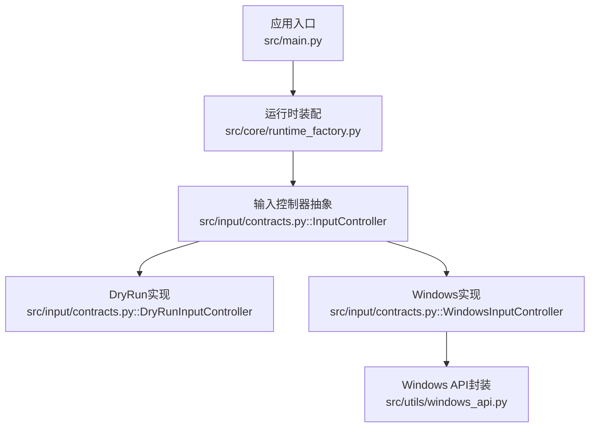
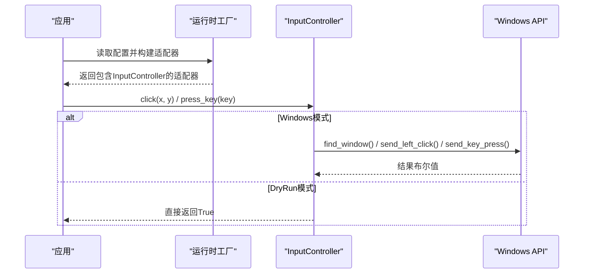
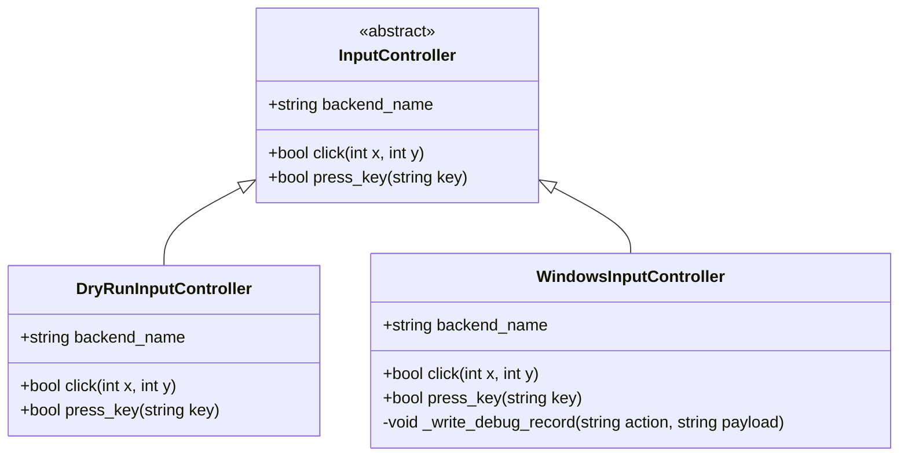
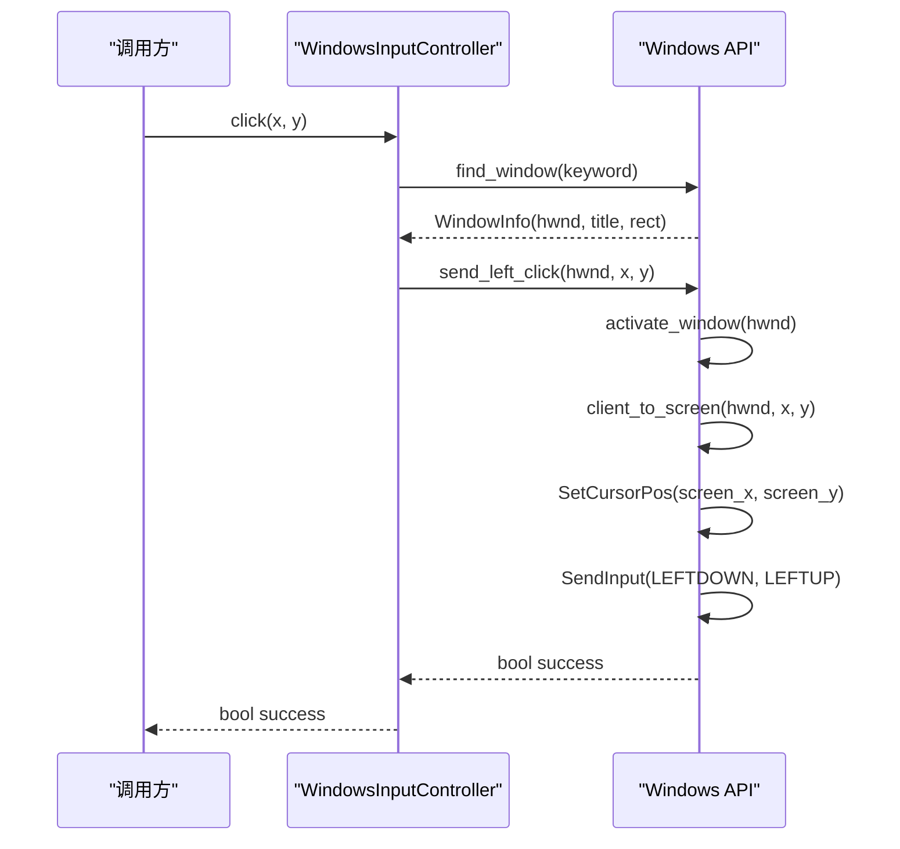
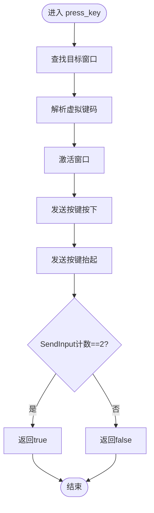
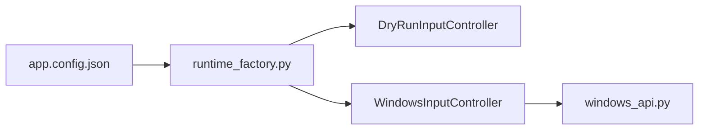

# 输入控制API

<cite>
**本文引用的文件**
- [contracts.py](file://src/input/contracts.py)
- [windows_api.py](file://src/utils/windows_api.py)
- [runtime_factory.py](file://src/core/runtime_factory.py)
- [main.py](file://src/main.py)
- [app.config.json](file://config/app.config.json)
- [development.status.md](file://development.status.md)
</cite>

## 目录
1. [简介](#简介)
2. [项目结构](#项目结构)
3. [核心组件](#核心组件)
4. [架构总览](#架构总览)
5. [详细组件分析](#详细组件分析)
6. [依赖关系分析](#依赖关系分析)
7. [性能与稳定性考虑](#性能与稳定性考虑)
8. [故障排查指南](#故障排查指南)
9. [结论](#结论)
10. [附录：扩展与自定义](#附录：扩展与自定义)

## 简介
本文件为输入控制系统的完整API文档，聚焦于InputController抽象接口的设计与扩展机制，记录鼠标与键盘操作API的调用方式、参数规范、事件时序与同步机制，并给出Windows原生实现与DryRun模式的差异说明。同时提供错误处理、异常恢复与调试技巧，以及自定义输入控制器以支持新设备或协议的实践建议。

## 项目结构
输入控制系统位于src/input与src/utils两个层次：
- src/input/contracts.py：定义输入控制器抽象接口及两种具体实现（DryRun与Windows）。
- src/utils/windows_api.py：封装Windows平台底层API（窗口查找、坐标转换、鼠标点击、键盘按键等）。
- src/core/runtime_factory.py：根据配置装配运行时适配器，注入具体的输入控制器实例。
- src/main.py：应用启动入口，通过工厂装配后交由调度器使用。
- config/app.config.json：运行模式、目标窗口关键词、日志与截图路径等配置项。

图表来源
- [main.py:22-50](file://src/main.py#L22-L50)
- [runtime_factory.py:30-76](file://src/core/runtime_factory.py#L30-L76)
- [contracts.py:10-64](file://src/input/contracts.py#L10-L64)
- [windows_api.py:121-376](file://src/utils/windows_api.py#L121-L376)

章节来源
- [main.py:22-50](file://src/main.py#L22-L50)
- [runtime_factory.py:30-76](file://src/core/runtime_factory.py#L30-L76)
- [contracts.py:10-64](file://src/input/contracts.py#L10-L64)
- [windows_api.py:121-376](file://src/utils/windows_api.py#L121-L376)
- [app.config.json:1-23](file://config/app.config.json#L1-L23)

## 核心组件
- InputController抽象接口：统一暴露后端名称、点击、按键三个能力，屏蔽平台差异。
- DryRunInputController：DryRun模式下的占位实现，所有操作返回成功，便于无真实环境联调。
- WindowsInputController：基于Windows API的真实输入实现，负责定位目标窗口、坐标转换与发送输入事件，并输出调试日志。
- Windows API层：提供窗口枚举、客户区坐标获取、鼠标左键点击、键盘按键发送、虚拟键码解析等能力。

章节来源
- [contracts.py:10-64](file://src/input/contracts.py#L10-L64)
- [windows_api.py:121-376](file://src/utils/windows_api.py#L121-L376)

## 架构总览
输入控制采用“抽象接口 + 多后端实现”的适配模式，由运行时工厂按配置注入具体实现。上层业务仅依赖InputController，无需感知底层是DryRun还是Windows。

图表来源
- [runtime_factory.py:30-76](file://src/core/runtime_factory.py#L30-L76)
- [contracts.py:10-64](file://src/input/contracts.py#L10-L64)
- [windows_api.py:121-376](file://src/utils/windows_api.py#L121-L376)

## 详细组件分析

### InputController抽象接口设计
- 设计理念
  - 单一职责：每个实现只关注一种平台的输入行为。
  - 可替换性：通过抽象接口在运行时切换DryRun与Windows实现。
  - 可观测性：Windows实现将动作写入调试日志，便于问题定位。
- 扩展机制
  - 新增平台只需继承InputController并实现backend_name、click、press_key。
  - 在运行时工厂中按配置注入新实现，不改动上层调用方。

章节来源
- [contracts.py:10-22](file://src/input/contracts.py#L10-L22)

### DryRunInputController
- 作用：在无真实环境的开发阶段提供“零副作用”的输入模拟，所有方法返回成功。
- 适用场景：单元测试、流程联调、模板匹配与OCR验证。
- 限制：不会真正改变系统状态，无法用于端到端验证。

章节来源
- [contracts.py:25-34](file://src/input/contracts.py#L25-L34)

### WindowsInputController
- 作用：面向Windows平台的真实输入实现，支持点击与按键。
- 关键行为
  - 点击：默认使用客户区相对坐标，先定位目标窗口，再转换为屏幕坐标并发送左键按下/抬起。
  - 按键：激活目标窗口，解析虚拟键码，发送按下与抬起事件。
  - 调试：每次输入动作生成带时间戳的日志文件，记录标题、坐标/按键与结果。
- 坐标系约定：click(x, y)中的x、y为客户区坐标，与截图和模板匹配保持一致。

章节来源
- [contracts.py:37-64](file://src/input/contracts.py#L37-L64)

### Windows API层
- 窗口查找：枚举可见窗口，按标题关键词过滤；若未命中则回退到前台窗口。
- 坐标转换：将客户区坐标转换为屏幕坐标，供SetCursorPos使用。
- 鼠标点击：激活窗口、移动光标、发送左键按下与抬起，统计成功发送数量。
- 键盘按键：激活窗口、解析虚拟键码、发送按下与抬起，统计成功发送数量。
- 键码解析：支持常见功能键、方向键、F1-F24、单字符键；不支持的键抛出异常。

章节来源
- [windows_api.py:121-196](file://src/utils/windows_api.py#L121-L196)
- [windows_api.py:199-225](file://src/utils/windows_api.py#L199-L225)
- [windows_api.py:315-342](file://src/utils/windows_api.py#L315-L342)
- [windows_api.py:345-376](file://src/utils/windows_api.py#L345-L376)

### 类图：输入控制器体系

图表来源
- [contracts.py:10-64](file://src/input/contracts.py#L10-L64)

### 序列图：点击流程（Windows）

图表来源
- [contracts.py:47-52](file://src/input/contracts.py#L47-L52)
- [windows_api.py:315-328](file://src/utils/windows_api.py#L315-L328)
- [windows_api.py:216-225](file://src/utils/windows_api.py#L216-L225)
- [windows_api.py:121-196](file://src/utils/windows_api.py#L121-L196)

### 流程图：按键流程（Windows）

图表来源
- [contracts.py:54-58](file://src/input/contracts.py#L54-L58)
- [windows_api.py:331-342](file://src/utils/windows_api.py#L331-L342)
- [windows_api.py:345-376](file://src/utils/windows_api.py#L345-L376)

## 依赖关系分析
- 运行时装配依赖配置：
  - runtime_mode决定注入DryRun或Windows输入控制器。
  - window_title_keyword用于定位目标窗口。
  - debug_dir/screenshot_dir用于保存调试与截图数据。
- 模块耦合：
  - main仅依赖运行时工厂，不感知具体实现。
  - WindowsInputController依赖windows_api进行底层交互。
  - DryRunInputController无外部依赖，适合测试。

图表来源
- [app.config.json:1-23](file://config/app.config.json#L1-L23)
- [runtime_factory.py:30-76](file://src/core/runtime_factory.py#L30-L76)
- [contracts.py:10-64](file://src/input/contracts.py#L10-L64)
- [windows_api.py:121-376](file://src/utils/windows_api.py#L121-L376)

章节来源
- [runtime_factory.py:30-76](file://src/core/runtime_factory.py#L30-L76)
- [app.config.json:1-23](file://config/app.config.json#L1-L23)

## 性能与稳定性考虑
- 窗口查找开销：每次输入前都会查找窗口，频繁调用可能带来性能损耗。建议在长任务中缓存窗口句柄或在同一会话内复用。
- 输入事件原子性：鼠标点击与按键均通过一次SendInput批量提交，减少上下文切换，提高可靠性。
- 坐标转换成本：客户区到屏幕坐标转换仅在必要时执行，避免重复计算。
- 日志I/O：调试日志为顺序追加写入，高频调用时注意磁盘IO压力，可考虑异步或批写策略。

[本节为通用指导，不直接分析具体文件]

## 故障排查指南
- 找不到目标窗口
  - 现象：抛出未找到包含指定标题的可见窗口或当前没有可用前台窗口的异常。
  - 排查：检查window_title_keyword是否正确；确认目标窗口可见且未被最小化；确认前台窗口是否符合预期。
  - 参考位置：窗口查找逻辑与异常抛出。
- 点击无效
  - 现象：send_left_click返回失败或目标未响应。
  - 排查：确认传入的是客户区坐标；确认窗口已激活；检查SetCursorPos是否成功；查看调试日志中的title、x、y与result。
- 按键无效
  - 现象：send_key_press返回失败或目标未响应。
  - 排查：确认key字符串是否在支持的集合内；检查resolve_virtual_key是否抛出异常；查看调试日志中的key与result。
- DryRun模式误用
  - 现象：流程看似成功但实际未产生任何系统输入。
  - 排查：确认runtime_mode是否为windows；检查运行时装配是否注入WindowsInputController。

章节来源
- [windows_api.py:121-196](file://src/utils/windows_api.py#L121-L196)
- [windows_api.py:315-342](file://src/utils/windows_api.py#L315-L342)
- [windows_api.py:345-376](file://src/utils/windows_api.py#L345-L376)
- [contracts.py:47-58](file://src/input/contracts.py#L47-L58)
- [runtime_factory.py:30-76](file://src/core/runtime_factory.py#L30-L76)

## 结论
输入控制系统通过抽象接口与运行时装配实现了平台无关的输入能力。当前版本提供DryRun与Windows两种实现，覆盖点击与按键基础能力，具备调试日志与错误提示。后续可在该抽象基础上扩展更多输入类型与平台适配。

[本节为总结性内容，不直接分析具体文件]

## 附录：扩展与自定义

### 如何扩展新的输入设备或协议
- 步骤
  1. 新建类继承InputController，实现backend_name、click、press_key。
  2. 在运行时工厂中增加分支，按配置注入新实现。
  3. 如需平台特定能力，新增对应工具模块（类似windows_api.py）。
  4. 补充单元测试，覆盖正常与异常路径。
- 注意事项
  - 保持坐标约定一致（如click使用客户区坐标）。
  - 保证异常信息明确，便于上层捕获与恢复。
  - 输出结构化调试信息，便于问题回溯。

章节来源
- [contracts.py:10-22](file://src/input/contracts.py#L10-L22)
- [runtime_factory.py:30-76](file://src/core/runtime_factory.py#L30-L76)

### 鼠标操作API说明
- 点击
  - 方法：click(x, y)
  - 参数：x、y为整数，表示目标窗口的客户区坐标。
  - 返回值：布尔值，表示是否成功发送点击事件。
  - 行为：激活窗口、移动光标、发送左键按下与抬起。
- 移动与拖拽
  - 当前未实现。可通过扩展InputController新增move(x, y)、drag(start_x, start_y, end_x, end_y)等方法，并在Windows实现中调用SetCursorPos与SendInput组合完成。
- 双击
  - 当前未实现。可通过两次连续点击或组合事件实现，需考虑节流与抖动。

章节来源
- [contracts.py:16-18](file://src/input/contracts.py#L16-L18)
- [windows_api.py:315-328](file://src/utils/windows_api.py#L315-L328)

### 键盘操作API说明
- 按键模拟
  - 方法：press_key(key)
  - 参数：key为字符串，支持空格、回车、ESC、TAB、SHIFT、CTRL、ALT、方向键、F1-F24、单字符键。
  - 返回值：布尔值，表示是否成功发送按键事件。
  - 行为：激活窗口、解析虚拟键码、发送按下与抬起。
- 组合键处理
  - 当前未提供组合键API。可通过多次press_key调用组合实现（例如先按下CTRL，再按下C），但需注意按键释放顺序与状态保持。
- 特殊键支持
  - 当前不支持的键会抛出异常。扩展时可添加更多映射或动态查询。

章节来源
- [contracts.py:20-22](file://src/input/contracts.py#L20-L22)
- [windows_api.py:331-376](file://src/utils/windows_api.py#L331-L376)

### 输入事件的时序控制与同步机制
- 窗口激活与焦点：每次输入前尝试激活目标窗口，确保输入到达正确进程。
- 坐标同步：点击前将客户区坐标转换为屏幕坐标，保证光标位置准确。
- 事件原子性：鼠标与按键事件通过单次SendInput批量提交，降低丢事件风险。
- 同步语义：API返回布尔值表示发送是否成功，上层应据此进行重试或降级。

章节来源
- [windows_api.py:216-225](file://src/utils/windows_api.py#L216-L225)
- [windows_api.py:315-342](file://src/utils/windows_api.py#L315-L342)

### 不同平台适配器的实现示例与差异
- DryRun模式
  - 特点：无副作用，所有操作返回成功，适合开发与测试。
  - 适用：单元测试、流程联调、模板与OCR验证。
- Windows模式
  - 特点：真实系统输入，依赖用户态API，需要目标窗口存在且可见。
  - 适用：端到端验证与生产运行。
- 差异对比
  - 行为：DryRun不改变系统状态；Windows会改变系统状态。
  - 可观测性：Windows输出调试日志；DryRun无日志。
  - 错误处理：Windows在失败时抛出异常或返回失败；DryRun始终成功。

章节来源
- [runtime_factory.py:30-76](file://src/core/runtime_factory.py#L30-L76)
- [contracts.py:25-64](file://src/input/contracts.py#L25-L64)

### 错误处理、异常恢复与调试技巧
- 错误分类
  - 窗口相关：未找到窗口、前台窗口不可用。
  - 坐标相关：客户区尺寸无效、坐标转换失败。
  - 输入相关：SendInput计数不足、键码解析失败。
- 恢复策略
  - 重试：对瞬时失败（如窗口未就绪）进行有限重试。
  - 降级：切换到DryRun模式继续流程（仅适用于非关键路径）。
  - 停机：当连续失败超过阈值时停止，等待人工介入。
- 调试技巧
  - 检查debug_dir下的输入日志，核对title、坐标/按键与结果。
  - 使用截图工具验证目标区域与坐标是否匹配。
  - 逐步缩小范围：先验证窗口查找，再验证坐标转换，最后验证输入发送。

章节来源
- [contracts.py:60-64](file://src/input/contracts.py#L60-L64)
- [windows_api.py:117-118](file://src/utils/windows_api.py#L117-L118)
- [windows_api.py:121-196](file://src/utils/windows_api.py#L121-L196)
- [development.status.md:111-126](file://development.status.md#L111-L126)