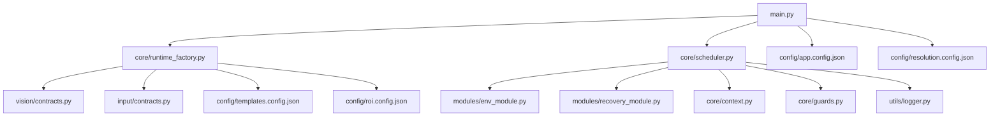
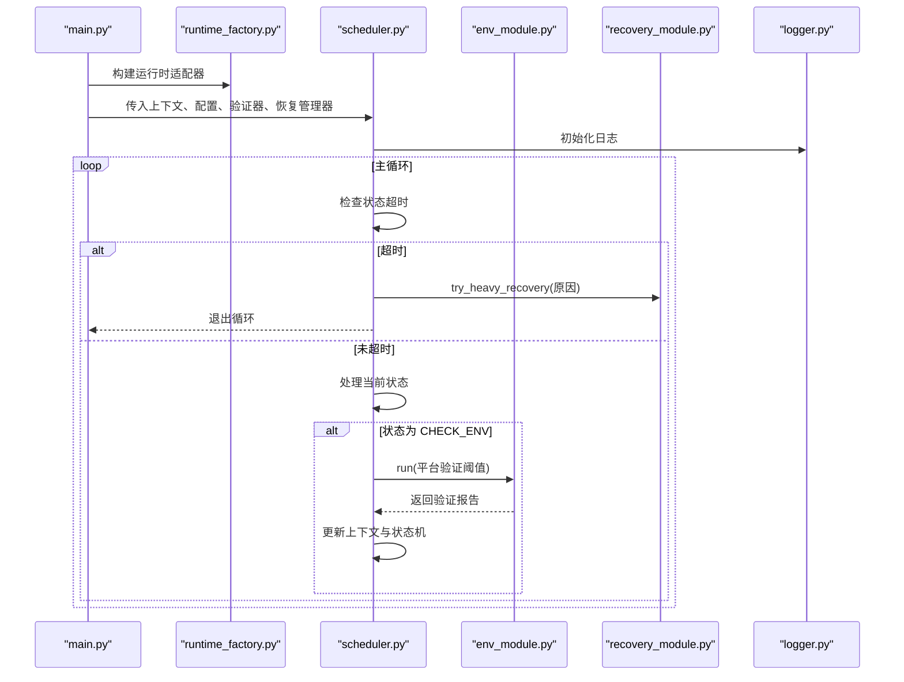
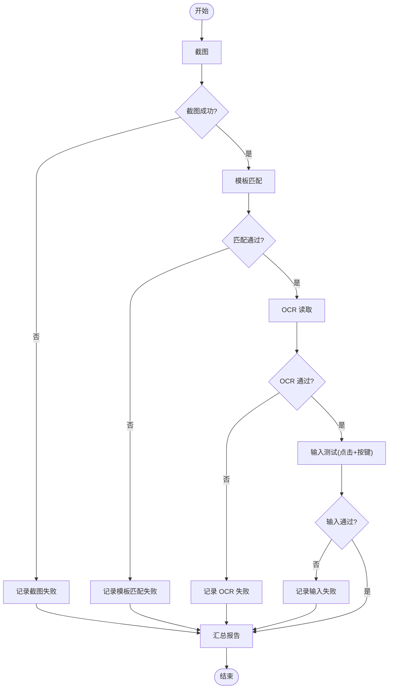
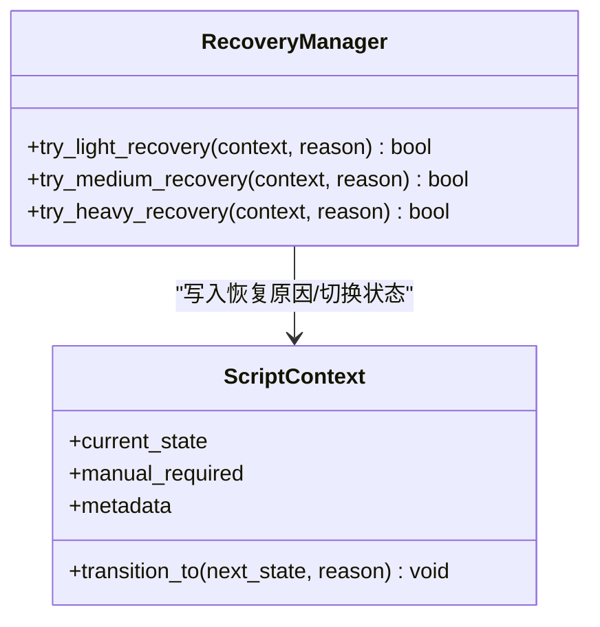
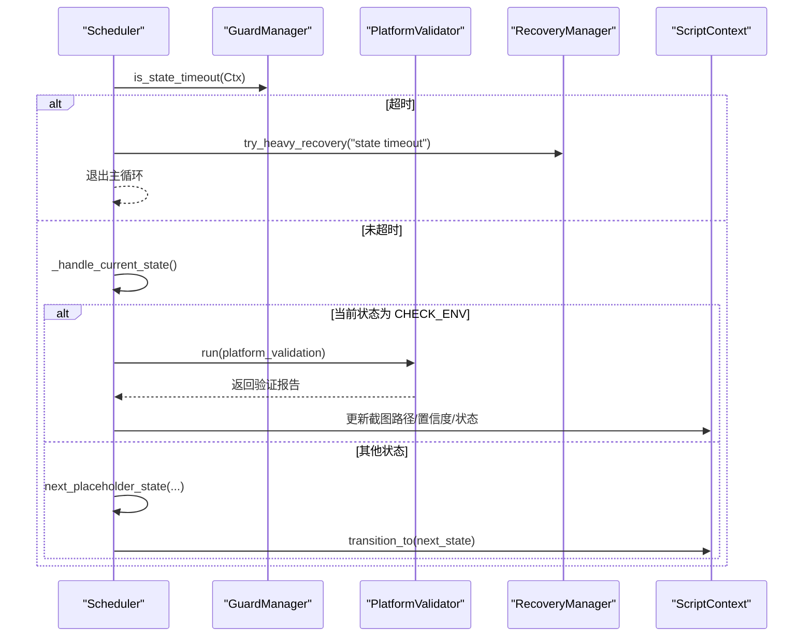
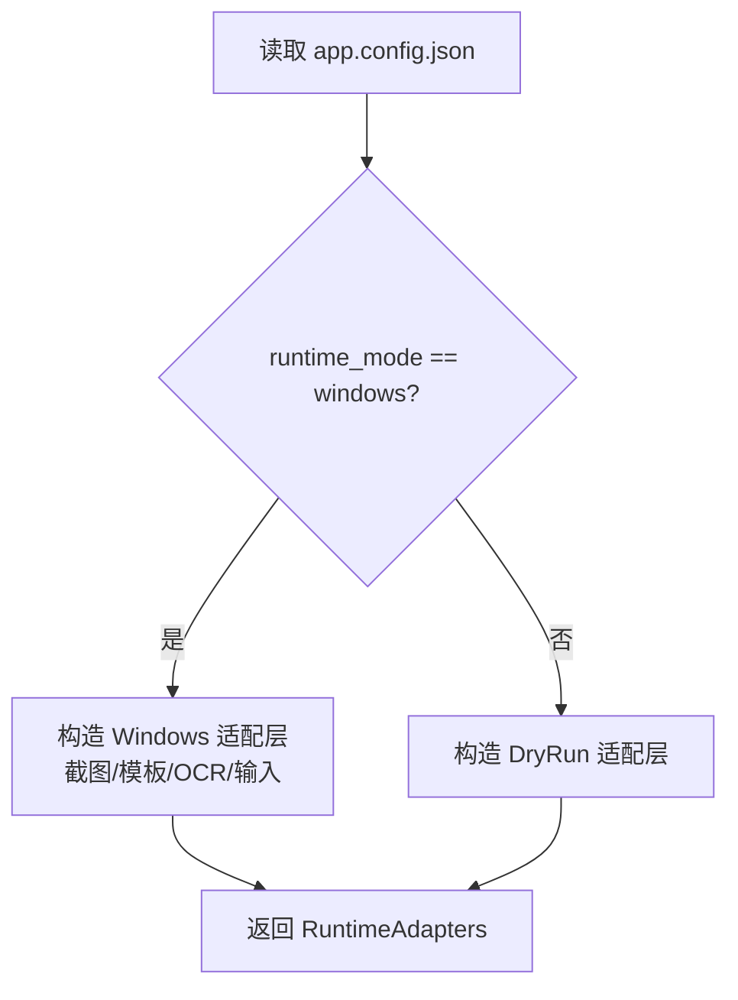
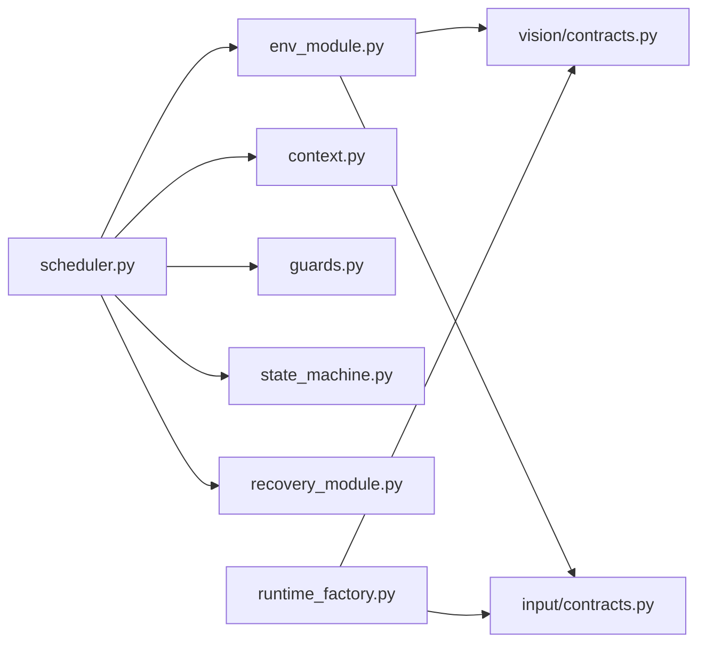

# 业务模块

<cite>
**本文引用的文件**
- [src/modules/env_module.py](file://src/modules/env_module.py)
- [src/modules/recovery_module.py](file://src/modules/recovery_module.py)
- [src/core/context.py](file://src/core/context.py)
- [src/core/scheduler.py](file://src/core/scheduler.py)
- [src/core/guards.py](file://src/core/guards.py)
- [src/core/runtime_factory.py](file://src/core/runtime_factory.py)
- [src/main.py](file://src/main.py)
- [config/app.config.json](file://config/app.config.json)
- [config/resolution.config.json](file://config/resolution.config.json)
- [config/templates.config.json](file://config/templates.config.json)
- [config/roi.config.json](file://config/roi.config.json)
- [src/utils/logger.py](file://src/utils/logger.py)
- [README.md](file://README.md)
</cite>

## 目录
1. [简介](#简介)
2. [项目结构](#项目结构)
3. [核心组件](#核心组件)
4. [架构总览](#架构总览)
5. [详细组件分析](#详细组件分析)
6. [依赖关系分析](#依赖关系分析)
7. [性能与稳定性考虑](#性能与稳定性考虑)
8. [故障排查指南](#故障排查指南)
9. [结论](#结论)
10. [附录：配置与使用示例](#附录配置与使用示例)

## 简介
本文件面向“业务模块”的功能文档，重点解释环境验证模块与故障恢复模块的实现、协作方式以及与核心框架的集成。内容覆盖系统要求检查、游戏进程检测、资源可用性验证、异常检测、恢复策略、重试机制与安全停机逻辑；并提供配置选项说明、实际使用场景与排障指南，帮助开发者在不同环境下正确配置和使用这些模块。

## 项目结构
本项目采用分层与模块化组织：
- 入口与装配：main.py 负责加载配置、构建运行时适配器、组装调度器与业务模块。
- 核心框架：context（状态与上下文）、scheduler（主循环与状态流转）、guards（超时与重试守卫）、runtime_factory（按运行模式装配截图、模板匹配、OCR、输入等适配层）。
- 业务模块：env_module（平台与环境验证）、recovery_module（轻量/中量/重度恢复）。
- 视觉与输入契约：vision.contracts、input.contracts 定义抽象接口，由 Windows/DryRun 实现提供具体能力。
- 配置：app.config.json、resolution.config.json、templates.config.json、roi.config.json 集中管理阈值、路径、ROI 区域等。
- 工具与日志：utils.logger 提供统一日志输出。

图表来源
- [src/main.py:22-50](file://src/main.py#L22-L50)
- [src/core/runtime_factory.py:30-77](file://src/core/runtime_factory.py#L30-L77)
- [src/core/scheduler.py:13-83](file://src/core/scheduler.py#L13-L83)
- [config/app.config.json:1-23](file://config/app.config.json#L1-L23)
- [config/resolution.config.json:1-8](file://config/resolution.config.json#L1-L8)
- [config/templates.config.json:1-9](file://config/templates.config.json#L1-L9)
- [config/roi.config.json:1-31](file://config/roi.config.json#L1-L31)

章节来源
- [src/main.py:22-50](file://src/main.py#L22-L50)
- [config/app.config.json:1-23](file://config/app.config.json#L1-L23)

## 核心组件
- 环境验证模块（PlatformValidator）：对截图链路、模板匹配、OCR、输入链路进行逐项校验，汇总通过情况、错误与建议，供调度器在 CHECK_ENV 阶段使用。
- 故障恢复模块（RecoveryManager）：提供轻/中/重三级恢复能力，重度恢复会标记需要人工介入并转入安全停机流程。
- 调度器（Scheduler）：维护脚本状态机、超时与重试守卫，驱动环境验证与后续占位状态执行，并在异常或超时时触发恢复。
- 运行时装配（RuntimeAdapters）：根据运行模式（Windows/DryRun）注入具体的截图、模板匹配、OCR、输入实现，并附带下一步建议。
- 上下文（ScriptContext）：承载当前状态、重试计数、置信度、截图路径、是否需人工介入等关键信息。

章节来源
- [src/modules/env_module.py:11-88](file://src/modules/env_module.py#L11-L88)
- [src/modules/recovery_module.py:6-19](file://src/modules/recovery_module.py#L6-L19)
- [src/core/scheduler.py:13-83](file://src/core/scheduler.py#L13-L83)
- [src/core/runtime_factory.py:21-77](file://src/core/runtime_factory.py#L21-L77)
- [src/core/context.py:10-62](file://src/core/context.py#L10-L62)

## 架构总览
整体运行流程：
- main 启动后加载应用与分辨率配置，初始化日志，构建运行时适配器，创建 PlatformValidator 与 RecoveryManager，并将它们注入 Scheduler。
- Scheduler 进入主循环，先处理 BOOTSTRAP，再进入 CHECK_ENV 调用 PlatformValidator 进行环境验证，依据结果推进状态机；若状态超时则触发重度恢复并停止。
- 其他业务状态目前为占位实现，便于后续扩展地图装置、祭坛交互等流程。

图表来源
- [src/main.py:22-50](file://src/main.py#L22-L50)
- [src/core/scheduler.py:32-83](file://src/core/scheduler.py#L32-L83)
- [src/modules/env_module.py:38-88](file://src/modules/env_module.py#L38-L88)
- [src/modules/recovery_module.py:6-19](file://src/modules/recovery_module.py#L6-L19)
- [src/utils/logger.py:11-39](file://src/utils/logger.py#L11-L39)

## 详细组件分析

### 环境验证模块（PlatformValidator）
职责
- 截图链路：尝试全屏截图，记录截图路径与是否存在。
- 模板匹配：使用固定模板名（如 hideout_anchor）在当前截图中进行匹配，并与阈值比较判断是否通过。
- OCR 链路：在指定 ROI（如 debug_label）读取文本，基于置信度阈值判断是否通过。
- 输入链路：执行一次点击与一次按键，综合判定输入链路是否可用。
- 建议与错误：收集各链路异常信息，生成下一步建议（例如优先修复失败链路再继续开发）。

数据流与复杂度
- 单次 run 包含一次截图、一次模板匹配、一次 OCR、两次输入操作，时间复杂度近似 O(1)，主要开销来自截图与识别。
- 错误捕获粒度细，避免单点失败影响整体评估。

图表来源
- [src/modules/env_module.py:38-88](file://src/modules/env_module.py#L38-L88)

章节来源
- [src/modules/env_module.py:11-88](file://src/modules/env_module.py#L11-L88)
- [config/app.config.json:16-21](file://config/app.config.json#L16-L21)
- [config/templates.config.json:1-9](file://config/templates.config.json#L1-L9)
- [config/roi.config.json:1-31](file://config/roi.config.json#L1-L31)

### 故障恢复模块（RecoveryManager）
职责
- 轻量恢复：记录恢复原因，不改变状态，适用于可自愈的小问题。
- 中量恢复：记录恢复原因，用于中等严重性异常。
- 重度恢复：标记需要人工介入，切换到 MANUAL_REQUIRED 状态，并返回失败信号，由上层决定终止或等待人工处理。

与调度器的协作
- 当状态超过超时阈值时，调度器直接调用重度恢复，随后退出主循环，确保不会无限重试或误操作。

图表来源
- [src/modules/recovery_module.py:6-19](file://src/modules/recovery_module.py#L6-L19)
- [src/core/context.py:31-62](file://src/core/context.py#L31-L62)

章节来源
- [src/modules/recovery_module.py:6-19](file://src/modules/recovery_module.py#L6-L19)
- [src/core/context.py:31-62](file://src/core/context.py#L31-L62)

### 调度器与状态机（Scheduler）
职责
- 维护主循环，持续检查状态超时。
- 处理 BOOTSTRAP 与 CHECK_ENV 两个关键状态：前者推进到下一阶段；后者调用环境验证并根据结果推进状态机。
- 其他状态目前为占位实现，便于后续接入地图装置、祭坛交互等业务逻辑。
- 结合 GuardManager 的超时与重试限制，保证流程可控。

图表来源
- [src/core/scheduler.py:32-83](file://src/core/scheduler.py#L32-L83)
- [src/core/guards.py:6-15](file://src/core/guards.py#L6-L15)
- [src/modules/env_module.py:38-88](file://src/modules/env_module.py#L38-L88)

章节来源
- [src/core/scheduler.py:13-83](file://src/core/scheduler.py#L13-L83)
- [src/core/guards.py:6-15](file://src/core/guards.py#L6-L15)

### 运行时装配（RuntimeAdapters）
职责
- 根据 app.config.json 中的 runtime_mode 选择 Windows 真实适配层或 DryRun 模拟适配层。
- 注入截图、模板匹配、OCR、输入控制器，并附带下一步建议，便于开发期提示。
- 解析模板根路径、模板配置、ROI 配置路径，确保后续模块能正确定位资源。

图表来源
- [src/core/runtime_factory.py:30-77](file://src/core/runtime_factory.py#L30-L77)
- [config/app.config.json:1-23](file://config/app.config.json#L1-L23)

章节来源
- [src/core/runtime_factory.py:21-77](file://src/core/runtime_factory.py#L21-L77)
- [config/app.config.json:1-23](file://config/app.config.json#L1-L23)

### 上下文与状态（ScriptContext）
职责
- 维护当前状态、上一状态、轮次索引、重试次数、失败次数、场景置信度、截图路径、是否需人工介入、是否请求停止、状态起始时间与元数据。
- 提供状态迁移方法，自动重置重试计数与起始时间，并记录迁移原因。

章节来源
- [src/core/context.py:10-62](file://src/core/context.py#L10-L62)

## 依赖关系分析
- env_module 依赖 vision 与 input 契约，解耦具体实现，便于替换为 Windows 或 DryRun 版本。
- scheduler 依赖 context、guards、state_machine、env_module、recovery_module 与 logger，形成稳定的编排中心。
- runtime_factory 依赖 pathing 与各类契约，屏蔽平台差异。
- 配置文件集中管理阈值、路径、ROI 等参数，便于不同环境快速切换。

图表来源
- [src/modules/env_module.py:1-88](file://src/modules/env_module.py#L1-L88)
- [src/core/scheduler.py:1-83](file://src/core/scheduler.py#L1-L83)
- [src/core/runtime_factory.py:1-77](file://src/core/runtime_factory.py#L1-L77)

章节来源
- [src/modules/env_module.py:1-88](file://src/modules/env_module.py#L1-L88)
- [src/core/scheduler.py:1-83](file://src/core/scheduler.py#L1-L83)
- [src/core/runtime_factory.py:1-77](file://src/core/runtime_factory.py#L1-L77)

## 性能与稳定性考虑
- 环境验证将截图、模板匹配、OCR、输入四项独立评估，任何一项失败都会记录并影响最终 passed 标志，有助于快速定位瓶颈。
- 调度器在主循环中严格检查状态超时，防止长时间卡死；配合最大重试次数，避免无限重试导致资源耗尽。
- 重度恢复会强制进入 MANUAL_REQUIRED 并停止自动流程，符合需求文档中“未知状态下优先停机”的安全约束。
- 日志统一输出到 runtime/logs，便于离线分析与问题回溯。

[本节为通用指导，不直接分析具体代码文件]

## 故障排查指南
常见问题与定位步骤
- 截图链路失败
  - 现象：环境验证报告中 screenshot_ok 为 false，errors 包含截图相关异常。
  - 排查：确认窗口标题关键词是否正确命中目标游戏窗口；检查截图目录权限；在 Windows 模式下验证截图实现是否可用。
  - 参考：[src/modules/env_module.py:45-49](file://src/modules/env_module.py#L45-L49)、[src/core/runtime_factory.py:42-57](file://src/core/runtime_factory.py#L42-L57)

- 模板匹配失败
  - 现象：template_ok 为 false，errors 包含模板匹配异常或置信度低于阈值。
  - 排查：核对模板名称与配置是否一致；检查模板文件是否存在；调整模板阈值或重新采集模板；确认 ROI 区域是否覆盖目标 UI。
  - 参考：[src/modules/env_module.py:51-57](file://src/modules/env_module.py#L51-L57)、[config/templates.config.json:1-9](file://config/templates.config.json#L1-L9)、[config/roi.config.json:9-15](file://config/roi.config.json#L9-L15)

- OCR 链路失败
  - 现象：ocr_ok 为 false，errors 包含 OCR 异常或置信度低于阈值。
  - 排查：确认 OCR 语言与 PSM 设置；检查 tesseract 命令是否可用；调整 ROI 区域以聚焦稳定文本；必要时更换语言包或预处理策略。
  - 参考：[src/modules/env_module.py:59-63](file://src/modules/env_module.py#L59-L63)、[config/app.config.json:10-12](file://config/app.config.json#L10-L12)、[config/roi.config.json:2-8](file://config/roi.config.json#L2-L8)

- 输入链路失败
  - 现象：input_ok 为 false，errors 包含输入异常。
  - 排查：确认点击坐标是否在可见范围内；检查窗口焦点与权限；在 Windows 模式下验证输入实现；必要时加入随机偏移与节流。
  - 参考：[src/modules/env_module.py:65-70](file://src/modules/env_module.py#L65-L70)

- 状态超时与恢复
  - 现象：调度器记录“状态超时”，并触发重度恢复，进入 MANUAL_REQUIRED。
  - 排查：检查当前状态是否长时间无进展；查看日志中的 last_transition_reason；适当增大 state_timeout_sec 或优化状态处理逻辑。
  - 参考：[src/core/scheduler.py:32-47](file://src/core/scheduler.py#L32-L47)、[src/core/guards.py:6-15](file://src/core/guards.py#L6-L15)、[src/modules/recovery_module.py:15-19](file://src/modules/recovery_module.py#L15-L19)

- 日志与调试
  - 所有关键流程均输出到 runtime/logs/automation.log；环境验证的错误与建议也会记录，便于快速定位。
  - 参考：[src/utils/logger.py:11-39](file://src/utils/logger.py#L11-L39)

章节来源
- [src/modules/env_module.py:45-88](file://src/modules/env_module.py#L45-L88)
- [src/core/scheduler.py:32-83](file://src/core/scheduler.py#L32-L83)
- [src/core/guards.py:6-15](file://src/core/guards.py#L6-L15)
- [src/modules/recovery_module.py:6-19](file://src/modules/recovery_module.py#L6-L19)
- [src/utils/logger.py:11-39](file://src/utils/logger.py#L11-L39)

## 结论
环境验证模块提供了稳健的前置可行性检查，确保截图、模板匹配、OCR、输入四大链路在正式业务前处于可信状态；故障恢复模块通过分级恢复与重度停机的组合，保障系统在异常情况下能够及时止损并交由人工处理。调度器作为编排中心，结合状态机与守卫机制，使整个流程具备可观测、可控制、可扩展的特性。配合集中式配置与统一日志，可在不同环境下快速部署与调优。

[本节为总结性内容，不直接分析具体代码文件]

## 附录：配置与使用示例
- 基本启动
  - 修改 config/app.config.json 中的 runtime_mode、log_dir、screenshot_dir、debug_dir、window_title_keyword、OCR 相关参数。
  - 修改 config/resolution.config.json 中的 width、height、window_mode、ui_scale、language，以匹配运行环境。
  - 运行入口：python src/main.py，观察控制台与 runtime/logs/automation.log 的输出。

- 平台验证阈值调优
  - platform_validation.template_match_threshold：模板匹配置信度阈值，过高可能导致误判，过低可能引入噪声。
  - platform_validation.ocr_confidence_threshold：OCR 置信度阈值，需结合 ROI 与语言设置调整。
  - platform_validation.input_success_threshold：输入成功率阈值（当前实现以布尔结果为主，可作为未来扩展指标）。
  - 参考：[config/app.config.json:16-21](file://config/app.config.json#L16-L21)

- 模板与 ROI 配置
  - templates.config.json 中定义模板名、路径、ROI、阈值与描述；确保模板文件存在于 assets/templates 下。
  - roi.config.json 中定义 debug_label、hideout_anchor、map_device_panel 等区域坐标，用于 OCR 与模板匹配。
  - 参考：[config/templates.config.json:1-9](file://config/templates.config.json#L1-L9)、[config/roi.config.json:1-31](file://config/roi.config.json#L1-L31)

- 运行模式切换
  - dry_run_mode=false 且 runtime_mode=windows 时，使用 Windows 真实适配层；否则使用 DryRun 模拟适配层。
  - 参考：[src/core/runtime_factory.py:30-77](file://src/core/runtime_factory.py#L30-L77)、[config/app.config.json:1-5](file://config/app.config.json#L1-L5)

- 常见使用场景
  - 开发期：使用 DryRun 模式快速验证状态机与调度逻辑，逐步替换为 Windows 真实适配层。
  - 测试期：固定分辨率与窗口模式，采集高质量模板与 ROI，调整阈值至稳定通过。
  - 生产期：开启严格超时与重试限制，确保异常时立即停机并记录完整日志。

章节来源
- [config/app.config.json:1-23](file://config/app.config.json#L1-L23)
- [config/resolution.config.json:1-8](file://config/resolution.config.json#L1-L8)
- [config/templates.config.json:1-9](file://config/templates.config.json#L1-L9)
- [config/roi.config.json:1-31](file://config/roi.config.json#L1-L31)
- [src/core/runtime_factory.py:30-77](file://src/core/runtime_factory.py#L30-L77)
- [src/main.py:22-50](file://src/main.py#L22-L50)