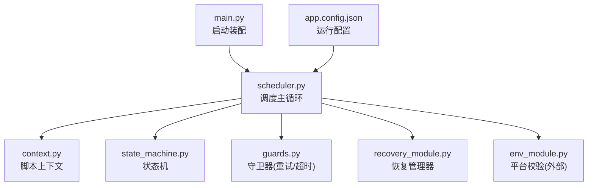
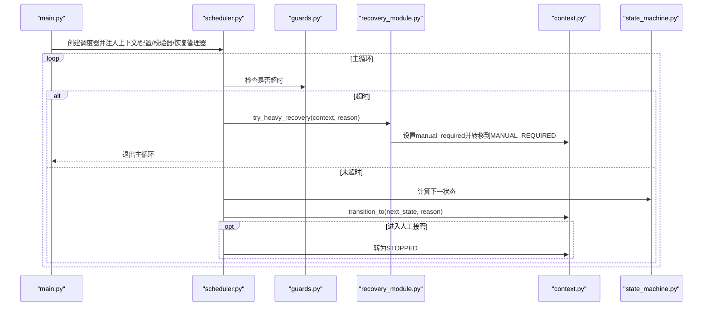
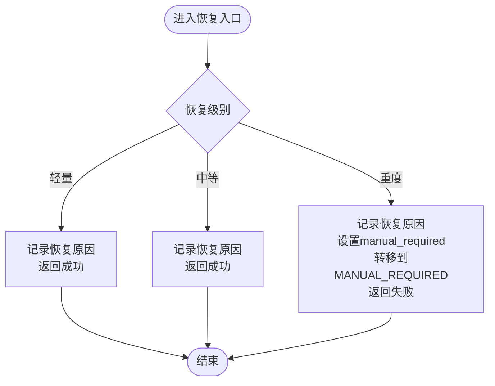
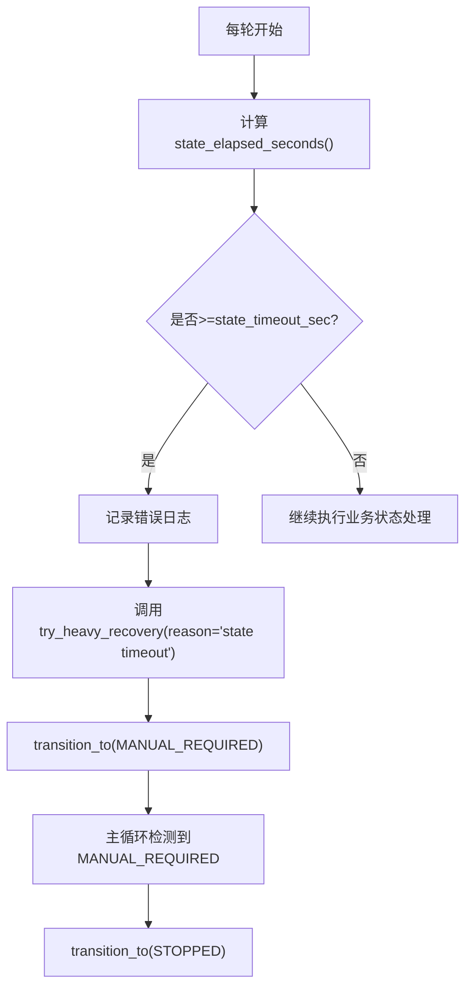
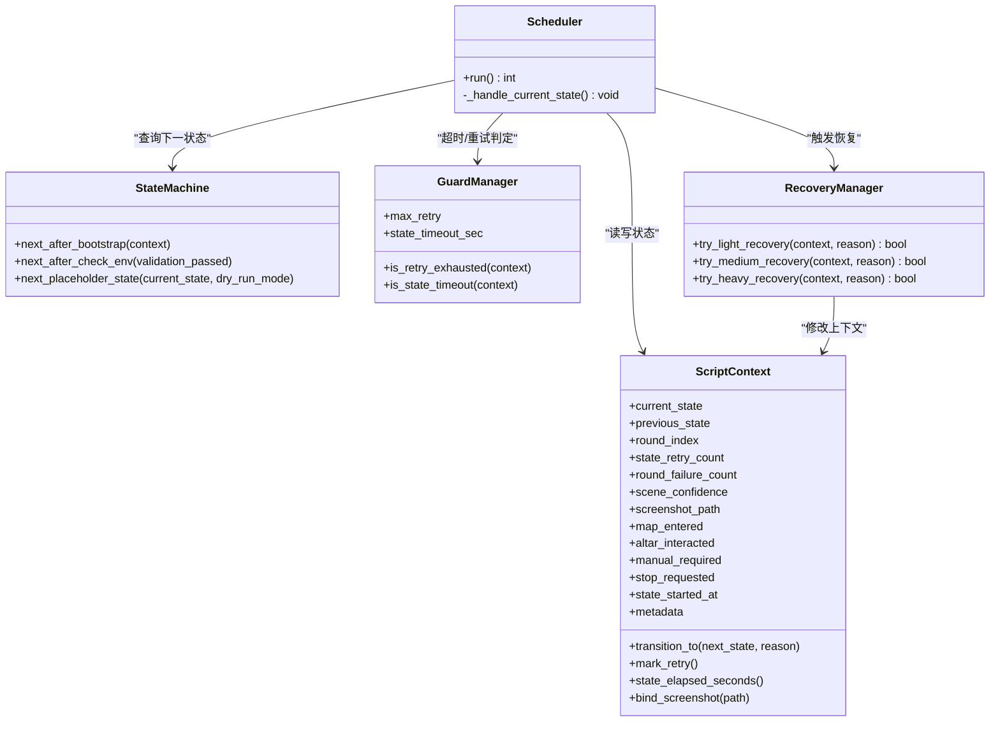
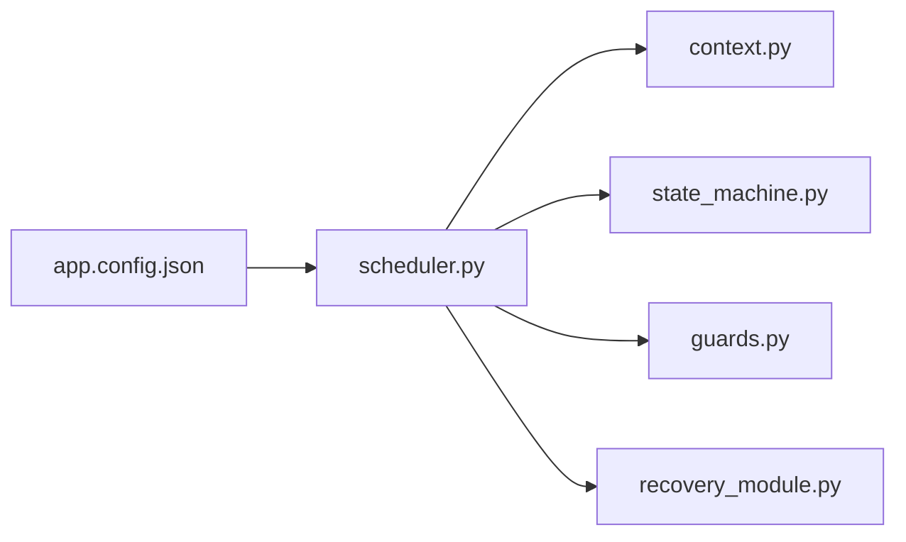

# 故障恢复模块

<cite>
**本文引用的文件**
- [recovery_module.py](file://src/modules/recovery_module.py)
- [scheduler.py](file://src/core/scheduler.py)
- [context.py](file://src/core/context.py)
- [state_machine.py](file://src/core/state_machine.py)
- [guards.py](file://src/core/guards.py)
- [app.config.json](file://config/app.config.json)
- [main.py](file://src/main.py)
</cite>

## 目录
1. [简介](#简介)
2. [项目结构](#项目结构)
3. [核心组件](#核心组件)
4. [架构总览](#架构总览)
5. [详细组件分析](#详细组件分析)
6. [依赖关系分析](#依赖关系分析)
7. [性能与可观测性](#性能与可观测性)
8. [配置与参数调优](#配置与参数调优)
9. [使用场景与示例](#使用场景与示例)
10. [故障排查与调试指南](#故障排查与调试指南)
11. [结论](#结论)

## 简介
本技术文档聚焦“故障恢复模块”，围绕 RecoveryManager 的实现架构，系统阐述异常检测机制、恢复策略选择与执行流程；说明重试、超时、资源清理与安全停机等关键逻辑；解释与核心框架（状态机、上下文、守卫器）的集成方式；提供恢复策略的配置项与调优建议；并给出典型使用场景、配置示例以及故障排查方法。

## 项目结构
本项目采用分层模块化设计：
- 核心层：状态机、上下文、守卫器，负责流程控制、状态流转与边界保护
- 调度层：Scheduler 驱动主循环，协调各模块协作
- 模块层：RecoveryManager 实现恢复策略入口，EnvModule 等承载平台能力
- 工具层：日志、Windows API 等通用能力
- 配置层：应用配置集中管理



图表来源
- [main.py:22-50](file://src/main.py#L22-L50)
- [scheduler.py:13-47](file://src/core/scheduler.py#L13-L47)
- [context.py:10-62](file://src/core/context.py#L10-L62)
- [state_machine.py:6-42](file://src/core/state_machine.py#L6-L42)
- [guards.py:6-16](file://src/core/guards.py#L6-L16)
- [app.config.json:1-23](file://config/app.config.json#L1-L23)

章节来源
- [main.py:22-50](file://src/main.py#L22-L50)
- [scheduler.py:13-47](file://src/core/scheduler.py#L13-L47)
- [context.py:10-62](file://src/core/context.py#L10-L62)
- [state_machine.py:6-42](file://src/core/state_machine.py#L6-L42)
- [guards.py:6-16](file://src/core/guards.py#L6-L16)
- [app.config.json:1-23](file://config/app.config.json#L1-L23)

## 核心组件
- RecoveryManager：定义轻量、中等、重度三类恢复入口，记录恢复原因，重度恢复触发人工接管与停机
- Scheduler：主循环驱动，检查超时，调用恢复管理器，处理状态流转
- ScriptContext：保存当前/上一状态、重试计数、耗时、截图路径、元数据等
- StateMachine：根据当前状态决定下一状态，支持占位状态推进
- GuardManager：基于上下文的超时与重试上限判断

章节来源
- [recovery_module.py:6-19](file://src/modules/recovery_module.py#L6-L19)
- [scheduler.py:13-47](file://src/core/scheduler.py#L13-L47)
- [context.py:10-62](file://src/core/context.py#L10-L62)
- [state_machine.py:6-42](file://src/core/state_machine.py#L6-L42)
- [guards.py:6-16](file://src/core/guards.py#L6-L16)

## 架构总览
下图展示从启动到恢复执行的端到端流程，突出异常检测、恢复策略选择与执行路径。



图表来源
- [main.py:22-50](file://src/main.py#L22-L50)
- [scheduler.py:32-47](file://src/core/scheduler.py#L32-L47)
- [guards.py:11-15](file://src/core/guards.py#L11-L15)
- [recovery_module.py:15-19](file://src/modules/recovery_module.py#L15-L19)
- [context.py:47-52](file://src/core/context.py#L47-L52)
- [state_machine.py:7-41](file://src/core/state_machine.py#L7-L41)

## 详细组件分析

### RecoveryManager 恢复策略
- 轻量恢复 try_light_recovery：用于可自愈的小问题，当前实现记录恢复原因并返回成功
- 中等恢复 try_medium_recovery：用于需要一定干预但仍可自动化的问题，当前实现记录恢复原因并返回成功
- 重度恢复 try_heavy_recovery：用于严重异常或不可恢复错误，设置人工接管标志并转入 MANUAL_REQUIRED，随后由调度器停止自动流程



图表来源
- [recovery_module.py:7-19](file://src/modules/recovery_module.py#L7-L19)

章节来源
- [recovery_module.py:6-19](file://src/modules/recovery_module.py#L6-L19)

### 异常检测机制
- 超时检测：GuardManager 基于 ScriptContext.state_elapsed_seconds() 与配置的 state_timeout_sec 判断是否超时
- 重试上限：GuardManager 基于 context.state_retry_count 与 max_state_retry 判断是否耗尽重试次数（当前主循环已内置超时分支，重试上限可用于后续扩展）
- 人工接管：当重度恢复被触发后，ScriptContext.manual_required 置为真，并由调度器将状态转为 STOPPED，终止自动流程



图表来源
- [scheduler.py:32-47](file://src/core/scheduler.py#L32-L47)
- [guards.py:14-15](file://src/core/guards.py#L14-L15)
- [context.py:57-58](file://src/core/context.py#L57-L58)
- [recovery_module.py:15-19](file://src/modules/recovery_module.py#L15-L19)

章节来源
- [scheduler.py:32-47](file://src/core/scheduler.py#L32-L47)
- [guards.py:6-16](file://src/core/guards.py#L6-L16)
- [context.py:47-62](file://src/core/context.py#L47-L62)
- [recovery_module.py:15-19](file://src/modules/recovery_module.py#L15-L19)

### 恢复策略选择与执行流程
- 选择依据：当前处于的状态、是否超时、是否达到重试上限、业务校验结果（例如环境检查失败）
- 执行流程：
  - 若超时：直接触发重度恢复，进入人工接管并停止
  - 若业务校验失败：进入人工接管（由状态机决策）
  - 其他可恢复错误：可扩展为轻量/中等恢复，并在成功后继续推进状态

```mermaid
sequenceDiagram
participant S as "scheduler.py"
participant G as "guards.py"
participant R as "recovery_module.py"
participant C as "context.py"
participant SM as "state_machine.py"
S->>G : is_state_timeout(context)
alt 超时
S->>R : try_heavy_recovery("state timeout")
R->>C : manual_required=true; transition_to(MANUAL_REQUIRED)
S->>C : transition_to(STOPPED)
else 未超时
S->>SM : next_* 计算下一状态
S->>C : transition_to(next_state)
end
```

图表来源
- [scheduler.py:32-83](file://src/core/scheduler.py#L32-L83)
- [guards.py:14-15](file://src/core/guards.py#L14-L15)
- [recovery_module.py:15-19](file://src/modules/recovery_module.py#L15-L19)
- [context.py:47-52](file://src/core/context.py#L47-L52)
- [state_machine.py:7-41](file://src/core/state_machine.py#L7-L41)

章节来源
- [scheduler.py:32-83](file://src/core/scheduler.py#L32-L83)
- [state_machine.py:7-41](file://src/core/state_machine.py#L7-L41)

### 与核心框架的集成
- 状态机交互：通过 StateMachine.next_* 方法决定下一状态；在 CHECK_ENV 失败时进入 MANUAL_REQUIRED
- 上下文管理：ScriptContext 维护状态、重试计数、耗时、截图路径、元数据；transition_to 统一更新状态与时间戳
- 事件通知：通过日志输出关键事件（进入状态、超时、错误、下一步建议），便于追踪与排障



图表来源
- [context.py:10-62](file://src/core/context.py#L10-L62)
- [state_machine.py:6-42](file://src/core/state_machine.py#L6-L42)
- [guards.py:6-16](file://src/core/guards.py#L6-L16)
- [recovery_module.py:6-19](file://src/modules/recovery_module.py#L6-L19)
- [scheduler.py:13-83](file://src/core/scheduler.py#L13-L83)

章节来源
- [context.py:10-62](file://src/core/context.py#L10-L62)
- [state_machine.py:6-42](file://src/core/state_machine.py#L6-L42)
- [guards.py:6-16](file://src/core/guards.py#L6-L16)
- [recovery_module.py:6-19](file://src/modules/recovery_module.py#L6-L19)
- [scheduler.py:13-83](file://src/core/scheduler.py#L13-L83)

## 依赖关系分析
- 松耦合：RecoveryManager 仅依赖 ScriptContext，不感知具体业务状态，便于扩展不同恢复策略
- 高内聚：Scheduler 聚合了状态机、守卫器、恢复管理器，形成统一的执行与恢复入口
- 配置驱动：GuardManager 的重试与超时阈值来自 app.config.json，便于运行时调优
- 外部依赖：PlatformValidator 作为平台能力提供者，其失败会间接影响恢复路径（如进入人工接管）



图表来源
- [app.config.json:1-23](file://config/app.config.json#L1-L23)
- [scheduler.py:13-47](file://src/core/scheduler.py#L13-L47)
- [context.py:10-62](file://src/core/context.py#L10-L62)
- [state_machine.py:6-42](file://src/core/state_machine.py#L6-L42)
- [guards.py:6-16](file://src/core/guards.py#L6-L16)
- [recovery_module.py:6-19](file://src/modules/recovery_module.py#L6-L19)

章节来源
- [scheduler.py:13-47](file://src/core/scheduler.py#L13-L47)
- [app.config.json:1-23](file://config/app.config.json#L1-L23)

## 性能与可观测性
- 性能特征
  - 主循环每次迭代进行轻量检查（超时、状态推进），开销低
  - 超时阈值与重试上限可调，避免长时间卡死
- 可观测性
  - 关键节点均有日志输出：进入状态、超时、错误、下一步建议
  - 上下文 metadata 记录恢复原因与最近转移原因，便于事后分析
  - 截图路径绑定可用于失败回溯

章节来源
- [scheduler.py:32-83](file://src/core/scheduler.py#L32-L83)
- [context.py:47-62](file://src/core/context.py#L47-L62)

## 配置与参数调优
- 关键配置项（位于 app.config.json）
  - runtime_mode：运行模式（如 windows）
  - dry_run_mode：是否干跑模式（影响占位状态推进）
  - max_state_retry：单状态最大重试次数（当前守卫器已暴露接口，可在后续扩展中结合使用）
  - state_timeout_sec：单状态超时秒数（当前主循环已启用）
  - log_dir：日志目录
  - screenshot_dir：截图目录
  - debug_dir：调试目录
  - window_title_keyword：目标窗口标题关键字
  - ocr_language / ocr_psm / ocr_tesseract_cmd：OCR 相关
  - template_root / template_config_path / roi_config_path：模板与 ROI 配置
  - platform_validation：平台校验阈值（截图次数、模板匹配阈值、OCR 置信度、输入成功率）
- 调优建议
  - 首次上线建议设置较短的 state_timeout_sec（如 10-20 秒），快速发现卡住
  - 逐步增大 state_timeout_sec，并结合业务步骤的实际耗时调整
  - max_state_retry 可根据业务稳定性逐步放开，但需配合严格的结果校验
  - 对 OCR/模板匹配阈值，建议在稳定环境下微调，避免误判导致频繁恢复
  - 开启 dry_run_mode 进行无风险验证，确认状态推进顺序正确后再关闭

章节来源
- [app.config.json:1-23](file://config/app.config.json#L1-L23)
- [scheduler.py:26-30](file://src/core/scheduler.py#L26-L30)

## 使用场景与示例
- 场景一：状态超时
  - 现象：某状态长时间无进展
  - 行为：调度器检测到超时，触发重度恢复，进入人工接管并停止
  - 处置：检查该状态对应的业务逻辑与外部依赖，必要时调整超时或修复上游问题
- 场景二：环境校验失败
  - 现象：截图/模板/OCR/输入任一环节失败
  - 行为：进入 MANUAL_REQUIRED，等待人工介入
  - 处置：查看截图与日志，修正分辨率、ROI、模板或输入映射
- 场景三：可恢复的瞬时错误
  - 建议：在后续扩展中于对应状态处理分支调用 try_light_recovery 或 try_medium_recovery，并在成功后继续推进
  - 注意：所有动作必须带结果校验与节流，避免连续误操作

章节来源
- [scheduler.py:32-83](file://src/core/scheduler.py#L32-L83)
- [recovery_module.py:7-19](file://src/modules/recovery_module.py#L7-L19)

## 故障排查与调试指南
- 定位要点
  - 查看日志：进入状态、超时、错误信息、下一步建议
  - 查看截图：context.screenshot_path 指向失败时的画面，辅助定位界面差异
  - 查看上下文：metadata.last_transition_reason 与 recovery_reason 帮助理解转移与恢复原因
- 常见问题
  - 频繁超时：检查业务步骤耗时、外部依赖响应、OCR/模板阈值
  - 频繁进入人工接管：检查环境校验失败原因，修正分辨率/ROI/模板
  - 无法推进状态：确认状态机顺序与条件是否正确
- 调试步骤
  - 开启 dry_run_mode 验证状态推进顺序
  - 降低 OCR/模板阈值，观察识别变化
  - 适当增加 state_timeout_sec，排除误报
  - 收集截图与日志，对比不同环境下的差异

章节来源
- [scheduler.py:32-83](file://src/core/scheduler.py#L32-L83)
- [context.py:47-62](file://src/core/context.py#L47-L62)
- [state_machine.py:7-41](file://src/core/state_machine.py#L7-L41)

## 结论
当前恢复模块以“超时即重度恢复”为核心策略，确保在异常情况下安全停机并交由人工处理。通过上下文、状态机与守卫器的协同，实现了清晰的异常检测与恢复入口。后续可在各业务状态中接入轻量/中等恢复，完善重试与资源清理逻辑，进一步提升自动化鲁棒性与可用性。