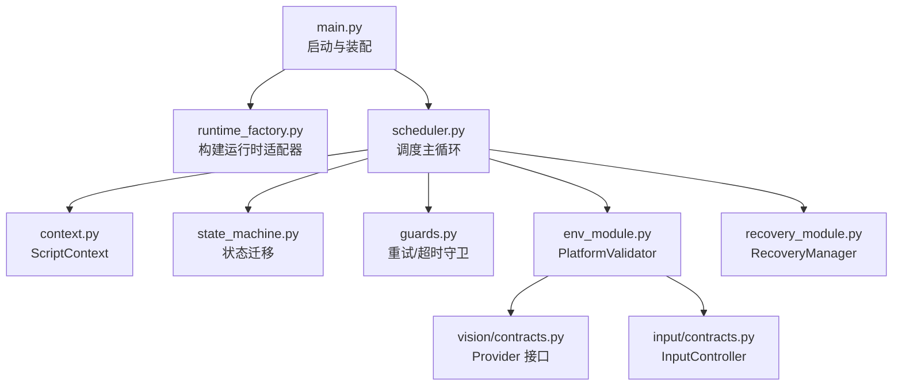
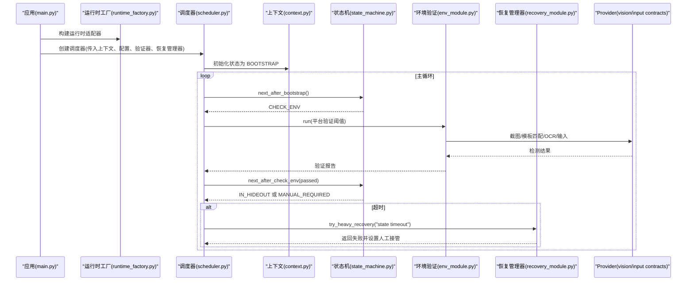
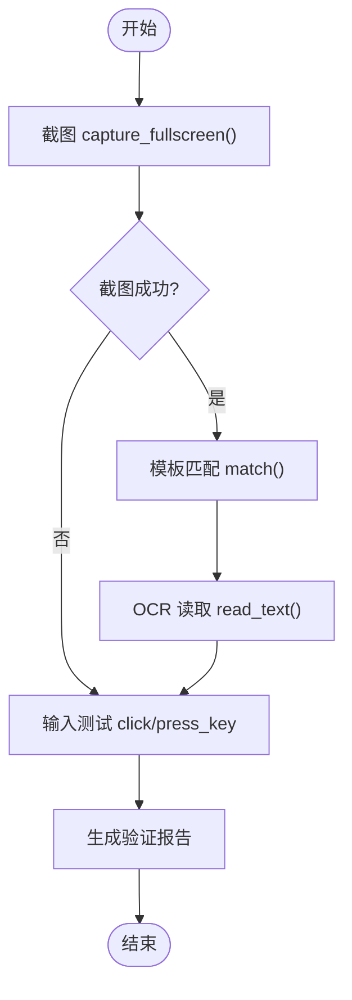
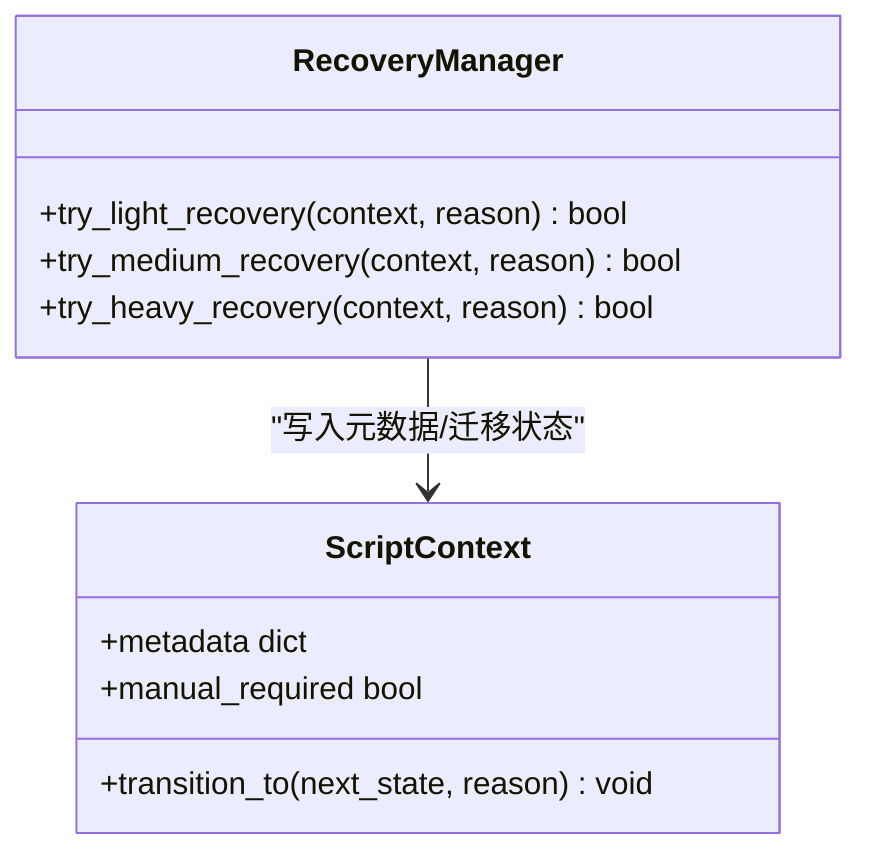
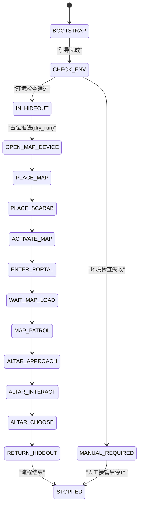
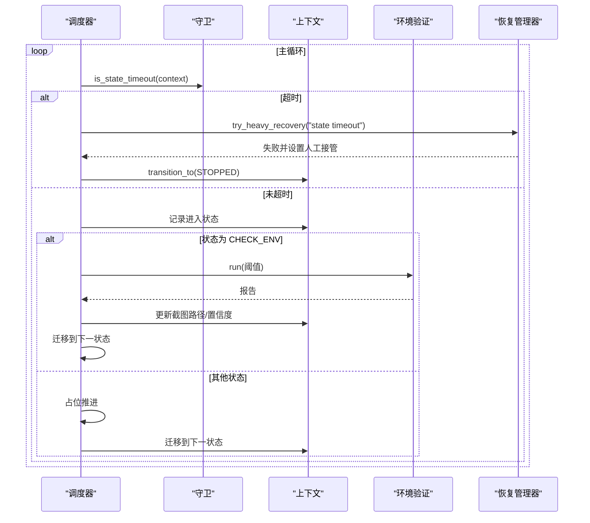
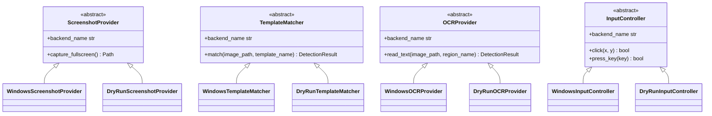

# 模块集成指南

<cite>
**本文引用的文件**
- [src/main.py](file://src/main.py)
- [src/core/context.py](file://src/core/context.py)
- [src/core/state_machine.py](file://src/core/state_machine.py)
- [src/core/scheduler.py](file://src/core/scheduler.py)
- [src/core/guards.py](file://src/core/guards.py)
- [src/core/runtime_factory.py](file://src/core/runtime_factory.py)
- [src/modules/env_module.py](file://src/modules/env_module.py)
- [src/modules/recovery_module.py](file://src/modules/recovery_module.py)
- [src/vision/contracts.py](file://src/vision/contracts.py)
- [src/input/contracts.py](file://src/input/contracts.py)
- [config/app.config.json](file://config/app.config.json)
- [README.md](file://README.md)
</cite>

## 目录
1. [简介](#简介)
2. [项目结构](#项目结构)
3. [核心组件](#核心组件)
4. [架构总览](#架构总览)
5. [详细组件分析](#详细组件分析)
6. [依赖关系与数据流](#依赖关系与数据流)
7. [性能考虑](#性能考虑)
8. [故障排查指南](#故障排查指南)
9. [结论](#结论)
10. [附录：集成示例与扩展机制](#附录：集成示例与扩展机制)

## 简介
本指南面向业务模块集成，重点说明环境验证模块（PlatformValidator）与故障恢复模块（RecoveryManager）如何与核心框架组件（状态机 StateMachine、调度器 Scheduler、上下文 ScriptContext）协同工作。文档涵盖 Provider 接口的注入方式与生命周期管理、模块间依赖和数据流转、完整集成示例、扩展机制以及最佳实践和常见问题解决方案。

## 项目结构
本项目采用分层与模块化设计：
- 入口与装配：main.py 负责加载配置、构建运行时适配器并组装调度器与业务模块。
- 核心框架：context.py 定义脚本状态与上下文；state_machine.py 定义状态迁移规则；scheduler.py 驱动主循环、守卫与状态处理；guards.py 提供重试与超时守卫；runtime_factory.py 根据运行模式装配截图、模板匹配、OCR、输入等适配层。
- 业务模块：env_module.py 实现平台环境验证；recovery_module.py 实现轻量/中等/重度恢复策略。
- 外部能力契约：vision/contracts.py 与 input/contracts.py 定义截图、模板匹配、OCR、输入的统一接口，并提供 DryRun 与 Windows 两套实现。
- 配置：config/app.config.json 提供运行模式、阈值、路径等参数。

图表来源
- [src/main.py:22-50](file://src/main.py#L22-L50)
- [src/core/runtime_factory.py:30-77](file://src/core/runtime_factory.py#L30-L77)
- [src/core/scheduler.py:13-47](file://src/core/scheduler.py#L13-L47)
- [src/core/context.py:10-62](file://src/core/context.py#L10-L62)
- [src/core/state_machine.py:6-42](file://src/core/state_machine.py#L6-L42)
- [src/core/guards.py:6-16](file://src/core/guards.py#L6-L16)
- [src/modules/env_module.py:23-88](file://src/modules/env_module.py#L23-L88)
- [src/modules/recovery_module.py:6-20](file://src/modules/recovery_module.py#L6-L20)
- [src/vision/contracts.py:25-56](file://src/vision/contracts.py#L25-L56)
- [src/input/contracts.py:10-23](file://src/input/contracts.py#L10-L23)

章节来源
- [src/main.py:22-50](file://src/main.py#L22-L50)
- [config/app.config.json:1-23](file://config/app.config.json#L1-L23)

## 核心组件
- ScriptContext：维护当前状态、上一状态、轮次与重试计数、置信度、截图路径、人工接管标志、停止请求、计时与元数据，并提供状态迁移方法。
- StateMachine：定义从引导到检查环境、占位状态的迁移逻辑，支持 dry_run 模式下的顺序推进。
- Scheduler：主循环驱动，结合 GuardManager 进行超时检测，调用 PlatformValidator 执行环境检查，并根据结果迁移状态；在超时或人工接管时触发恢复或停机。
- GuardManager：基于上下文中的重试计数与状态耗时判断是否耗尽重试或超时。
- RuntimeAdapters：统一封装截图、模板匹配、OCR、输入控制器及下一步建议，由 runtime_factory 按运行模式装配。
- PlatformValidator：串联截图、模板匹配、OCR、输入链路，输出验证报告，包含通过与否、各子项结果、错误与建议。
- RecoveryManager：提供轻/中/重三级恢复策略，记录恢复原因，必要时标记需要人工接管并迁移至人工接管状态。

章节来源
- [src/core/context.py:10-62](file://src/core/context.py#L10-L62)
- [src/core/state_machine.py:6-42](file://src/core/state_machine.py#L6-L42)
- [src/core/scheduler.py:13-83](file://src/core/scheduler.py#L13-L83)
- [src/core/guards.py:6-16](file://src/core/guards.py#L6-L16)
- [src/core/runtime_factory.py:21-77](file://src/core/runtime_factory.py#L21-L77)
- [src/modules/env_module.py:11-88](file://src/modules/env_module.py#L11-L88)
- [src/modules/recovery_module.py:6-20](file://src/modules/recovery_module.py#L6-L20)

## 架构总览
下图展示了主程序启动后，调度器如何驱动状态机、调用环境验证与恢复模块，并通过 Provider 接口与底层能力交互。

图表来源
- [src/main.py:22-50](file://src/main.py#L22-L50)
- [src/core/runtime_factory.py:30-77](file://src/core/runtime_factory.py#L30-L77)
- [src/core/scheduler.py:32-83](file://src/core/scheduler.py#L32-L83)
- [src/core/state_machine.py:6-42](file://src/core/state_machine.py#L6-L42)
- [src/modules/env_module.py:38-88](file://src/modules/env_module.py#L38-L88)
- [src/modules/recovery_module.py:6-20](file://src/modules/recovery_module.py#L6-L20)
- [src/vision/contracts.py:25-56](file://src/vision/contracts.py#L25-L56)
- [src/input/contracts.py:10-23](file://src/input/contracts.py#L10-L23)

## 详细组件分析

### 环境验证模块（PlatformValidator）
- 职责：依次执行截图、模板匹配、OCR、输入测试，汇总错误与建议，输出通过性报告。
- 关键流程：
  - 截图：调用 ScreenshotProvider.capture_fullscreen()，捕获成功则继续后续步骤。
  - 模板匹配：使用 TemplateMatcher.match() 对指定模板名称进行匹配，依据阈值判定是否通过。
  - OCR：使用 OCRProvider.read_text() 读取指定区域文本，依据置信度阈值判定。
  - 输入：调用 InputController.click() 与 press_key()，要求两者均成功。
  - 报告：综合 screenshot_ok、template_ok、ocr_ok、input_ok 计算 passed，并附带截图路径、错误列表与下一步建议。
- 异常处理：每个子链路独立 try/except，捕获异常并记录错误，不中断整体流程。

图表来源
- [src/modules/env_module.py:38-88](file://src/modules/env_module.py#L38-L88)

章节来源
- [src/modules/env_module.py:11-88](file://src/modules/env_module.py#L11-L88)
- [src/vision/contracts.py:25-56](file://src/vision/contracts.py#L25-L56)
- [src/input/contracts.py:10-23](file://src/input/contracts.py#L10-L23)

### 故障恢复模块（RecoveryManager）
- 职责：提供多级恢复策略，记录恢复原因，必要时进入人工接管状态。
- 策略：
  - 轻量恢复：仅记录恢复原因，返回成功。
  - 中等恢复：记录恢复原因，返回成功。
  - 重度恢复：记录恢复原因，标记需要人工接管，并迁移至 MANUAL_REQUIRED 状态，返回失败。
- 与上下文协作：通过 ScriptContext.metadata 记录恢复原因，通过 transition_to 迁移状态。

图表来源
- [src/modules/recovery_module.py:6-20](file://src/modules/recovery_module.py#L6-L20)
- [src/core/context.py:31-62](file://src/core/context.py#L31-L62)

章节来源
- [src/modules/recovery_module.py:6-20](file://src/modules/recovery_module.py#L6-L20)
- [src/core/context.py:31-62](file://src/core/context.py#L31-L62)

### 状态机（StateMachine）
- 职责：定义状态迁移规则，确保流程可控、可预测。
- 关键迁移：
  - 引导后进入 CHECK_ENV。
  - 环境检查通过后进入 IN_HIDEOUT，否则进入 MANUAL_REQUIRED。
  - 占位状态在 dry_run 模式下按固定顺序推进，否则直接进入 MANUAL_REQUIRED。

图表来源
- [src/core/state_machine.py:6-42](file://src/core/state_machine.py#L6-L42)
- [src/core/context.py:10-29](file://src/core/context.py#L10-L29)

章节来源
- [src/core/state_machine.py:6-42](file://src/core/state_machine.py#L6-L42)
- [src/core/context.py:10-29](file://src/core/context.py#L10-L29)

### 调度器（Scheduler）与守卫（GuardManager）
- 职责：主循环驱动状态处理，结合守卫进行超时检测，调用环境验证与恢复模块，并在人工接管时停止自动流程。
- 关键行为：
  - 每次循环先检查超时，若超时则触发重度恢复并退出。
  - 处理 CHECK_ENV 时调用 PlatformValidator，将截图路径与场景置信度写入上下文，并记录环境与错误日志。
  - 其他状态走占位推进逻辑，最终迁移到下一状态或停止。

图表来源
- [src/core/scheduler.py:32-83](file://src/core/scheduler.py#L32-L83)
- [src/core/guards.py:6-16](file://src/core/guards.py#L6-L16)
- [src/modules/env_module.py:38-88](file://src/modules/env_module.py#L38-L88)
- [src/modules/recovery_module.py:6-20](file://src/modules/recovery_module.py#L6-L20)
- [src/core/context.py:31-62](file://src/core/context.py#L31-L62)

章节来源
- [src/core/scheduler.py:13-83](file://src/core/scheduler.py#L13-L83)
- [src/core/guards.py:6-16](file://src/core/guards.py#L6-L16)

### Provider 接口与生命周期管理
- 接口抽象：
  - ScreenshotProvider：提供 capture_fullscreen() 与 backend_name。
  - TemplateMatcher：提供 match(image_path, template_name) 与 backend_name。
  - OCRProvider：提供 read_text(image_path, region_name) 与 backend_name。
  - InputController：提供 click(x, y)、press_key(key) 与 backend_name。
- 实现：
  - DryRun*：用于开发调试，返回固定结果与占位文件。
  - Windows*：真实平台实现，涉及窗口查找、截图、模板匹配、OCR 预处理与 Tesseract 调用、输入发送与调试记录。
- 生命周期：
  - 由 runtime_factory 根据配置中的 runtime_mode 选择具体实现并组装为 RuntimeAdapters。
  - 在 main.py 中将适配器注入 PlatformValidator，再由 Scheduler 在运行过程中按需调用。
  - 各 Provider 内部负责资源初始化（如目录创建、后端初始化），无需外部显式释放。

图表来源
- [src/vision/contracts.py:25-56](file://src/vision/contracts.py#L25-L56)
- [src/vision/contracts.py:58-251](file://src/vision/contracts.py#L58-L251)
- [src/input/contracts.py:10-65](file://src/input/contracts.py#L10-L65)
- [src/core/runtime_factory.py:30-77](file://src/core/runtime_factory.py#L30-L77)

章节来源
- [src/vision/contracts.py:25-251](file://src/vision/contracts.py#L25-L251)
- [src/input/contracts.py:10-65](file://src/input/contracts.py#L10-L65)
- [src/core/runtime_factory.py:30-77](file://src/core/runtime_factory.py#L30-L77)

## 依赖关系与数据流
- 装配阶段：
  - main.py 加载 app.config.json，调用 build_runtime_adapters 获取 RuntimeAdapters。
  - 将截图、模板匹配、OCR、输入控制器与下一步建议注入 PlatformValidator。
  - 创建 Scheduler，传入 ScriptContext、配置、验证器与 RecoveryManager。
- 运行阶段：
  - Scheduler 主循环驱动状态迁移，CHECK_ENV 阶段调用 PlatformValidator.run(thresholds)。
  - PlatformValidator 依次调用 Provider 接口，收集结果与错误，返回验证报告。
  - Scheduler 将截图路径与置信度写入 ScriptContext，并依据报告结果迁移状态。
  - 若超时或人工接管，Scheduler 调用 RecoveryManager 进行恢复，必要时进入 STOPPED。
- 数据流要点：
  - 配置驱动：阈值、路径、运行模式均来自配置。
  - 上下文共享：截图路径、置信度、重试计数、人工接管标志等在模块间传递。
  - 日志与调试：Provider 与输入控制器会写入调试文件，便于问题定位。

章节来源
- [src/main.py:22-50](file://src/main.py#L22-L50)
- [src/core/scheduler.py:32-83](file://src/core/scheduler.py#L32-L83)
- [src/modules/env_module.py:38-88](file://src/modules/env_module.py#L38-L88)
- [src/core/context.py:31-62](file://src/core/context.py#L31-L62)
- [config/app.config.json:1-23](file://config/app.config.json#L1-L23)

## 性能考虑
- 模板匹配 ROI 裁剪：WindowsTemplateMatcher 在模板绑定 ROI 时仅裁剪相关区域进行匹配，避免大图全图匹配带来的性能损耗。
- OCR 预处理与多路结果择优：WindowsOCRProvider 生成灰度与二值化图像分别识别，择优返回，提高鲁棒性与准确率。
- 超时与重试控制：GuardManager 限制单状态最大耗时与重试次数，防止长时间卡死。
- 调试输出：输入操作与 OCR 过程写入调试目录，有助于定位性能瓶颈与异常。

章节来源
- [src/vision/contracts.py:119-185](file://src/vision/contracts.py#L119-L185)
- [src/vision/contracts.py:188-251](file://src/vision/contracts.py#L188-L251)
- [src/core/guards.py:6-16](file://src/core/guards.py#L6-L16)
- [src/input/contracts.py:37-65](file://src/input/contracts.py#L37-L65)

## 故障排查指南
- 截图链路失败：
  - 检查窗口标题关键词是否正确，确认目标窗口存在且可访问。
  - 查看截图目录是否可写，确认路径与权限。
  - 参考输入调试日志，确认窗口焦点与坐标体系一致。
- 模板匹配失败：
  - 核对模板配置文件与 ROI 标定是否与当前分辨率一致。
  - 调整模板阈值，观察置信度变化。
  - 关注 ROI 越界错误提示，重新标定 ROI。
- OCR 识别失败：
  - 确认 Tesseract 命令可用，语言与 PSM 设置正确。
  - 检查预处理后的灰度与二值化图像质量。
  - 调整 OCR 区域与语言，提升识别率。
- 输入链路失败：
  - 检查坐标体系（客户区相对坐标）与窗口焦点。
  - 查看输入调试日志，确认点击与按键是否生效。
- 状态超时：
  - 增加 state_timeout_sec 或优化业务流程。
  - 检查是否存在阻塞操作或外部依赖延迟。
- 人工接管：
  - 当出现未知弹窗或严重不匹配时，优先停机等待人工处理。
  - 记录 last_transition_reason 与 recovery_reason，便于回溯。

章节来源
- [src/modules/env_module.py:38-88](file://src/modules/env_module.py#L38-L88)
- [src/vision/contracts.py:119-185](file://src/vision/contracts.py#L119-L185)
- [src/vision/contracts.py:188-251](file://src/vision/contracts.py#L188-L251)
- [src/input/contracts.py:37-65](file://src/input/contracts.py#L37-L65)
- [src/core/scheduler.py:32-83](file://src/core/scheduler.py#L32-L83)
- [src/core/context.py:31-62](file://src/core/context.py#L31-L62)

## 结论
本集成方案以状态机为核心，通过调度器协调环境验证与恢复模块，借助 Provider 接口屏蔽平台差异，实现可插拔的截图、模板匹配、OCR 与输入能力。配置驱动与上下文共享使模块间耦合度低、扩展性强。遵循超时与重试约束、人工接管策略与调试输出规范，可在保证安全性的前提下逐步完善自动化流程。

## 附录：集成示例与扩展机制

### 主程序集成示例（步骤说明）
- 加载配置：从 app.config.json 读取运行模式、阈值与路径。
- 构建运行时适配器：根据 runtime_mode 选择 DryRun 或 Windows 实现。
- 创建验证器：注入截图、模板匹配、OCR、输入控制器与下一步建议。
- 创建调度器：传入 ScriptContext、配置、验证器与 RecoveryManager。
- 运行调度器：启动主循环，自动推进状态、执行环境检查与恢复。

章节来源
- [src/main.py:22-50](file://src/main.py#L22-L50)
- [config/app.config.json:1-23](file://config/app.config.json#L1-L23)

### 添加新的验证规则
- 在 PlatformValidator.run 中新增子链路：
  - 调用相应 Provider 接口获取结果。
  - 依据阈值或业务规则判定通过性。
  - 捕获异常并记录错误。
  - 更新报告字段与 passed 标志。
- 在配置中新增阈值或开关，保持配置与逻辑解耦。

章节来源
- [src/modules/env_module.py:38-88](file://src/modules/env_module.py#L38-L88)
- [config/app.config.json:16-21](file://config/app.config.json#L16-L21)

### 添加新的恢复策略
- 在 RecoveryManager 中新增方法：
  - 记录恢复原因到 context.metadata。
  - 根据策略决定是否标记人工接管并迁移状态。
  - 返回成功或失败，供调度器决策。
- 在调度器中根据业务场景调用对应恢复方法。

章节来源
- [src/modules/recovery_module.py:6-20](file://src/modules/recovery_module.py#L6-L20)
- [src/core/scheduler.py:32-47](file://src/core/scheduler.py#L32-L47)

### 最佳实践
- 性能优化：
  - 使用 ROI 裁剪减少模板匹配范围。
  - OCR 多路识别择优，提升准确率与鲁棒性。
  - 合理设置超时与重试，避免长时间阻塞。
- 错误处理：
  - 每个子链路独立异常捕获，记录错误与建议。
  - 低置信度识别不驱动危险动作，优先停机。
- 日志记录：
  - 使用统一日志器记录状态迁移、错误与建议。
  - Provider 写入调试文件，便于问题定位。

章节来源
- [src/core/scheduler.py:57-75](file://src/core/scheduler.py#L57-L75)
- [src/modules/env_module.py:38-88](file://src/modules/env_module.py#L38-L88)
- [src/vision/contracts.py:119-185](file://src/vision/contracts.py#L119-L185)
- [src/vision/contracts.py:188-251](file://src/vision/contracts.py#L188-L251)
- [src/input/contracts.py:37-65](file://src/input/contracts.py#L37-L65)

### 常见集成问题与调试技巧
- 窗口标题关键词不命中：
  - 检查配置 window_title_keyword，确认目标窗口标题包含该关键字。
  - 查看输入调试日志，确认 find_window 是否成功。
- 模板匹配置信度不稳定：
  - 调整模板阈值，采集更稳定的模板样本。
  - 检查 ROI 标定是否与当前分辨率一致。
- OCR 识别率低：
  - 调整 OCR 语言与 PSM，优化预处理区域。
  - 查看生成的灰度与二值化图像质量。
- 输入无响应：
  - 确认坐标体系为客户区相对坐标。
  - 检查窗口焦点与权限，查看输入调试日志。
- 状态频繁超时：
  - 增加 state_timeout_sec，优化业务流程。
  - 检查是否有阻塞操作或外部依赖延迟。

章节来源
- [src/input/contracts.py:37-65](file://src/input/contracts.py#L37-L65)
- [src/vision/contracts.py:119-185](file://src/vision/contracts.py#L119-L185)
- [src/vision/contracts.py:188-251](file://src/vision/contracts.py#L188-L251)
- [src/core/scheduler.py:32-47](file://src/core/scheduler.py#L32-L47)
- [config/app.config.json:1-23](file://config/app.config.json#L1-L23)