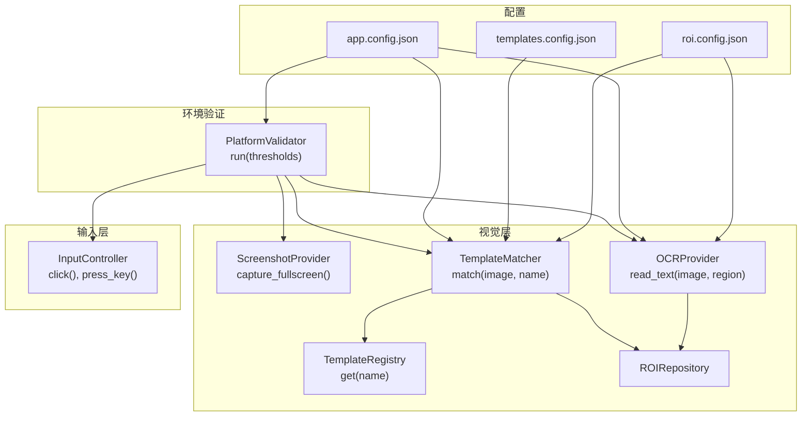
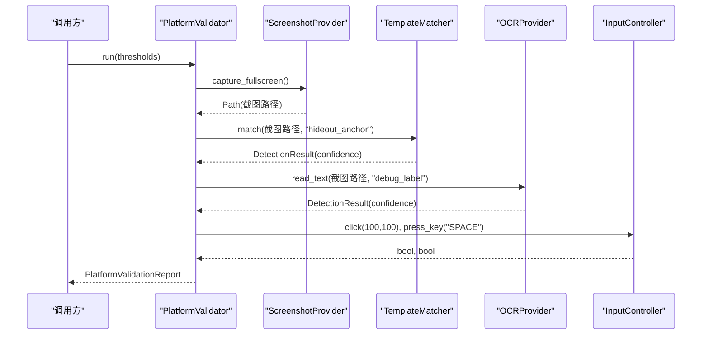
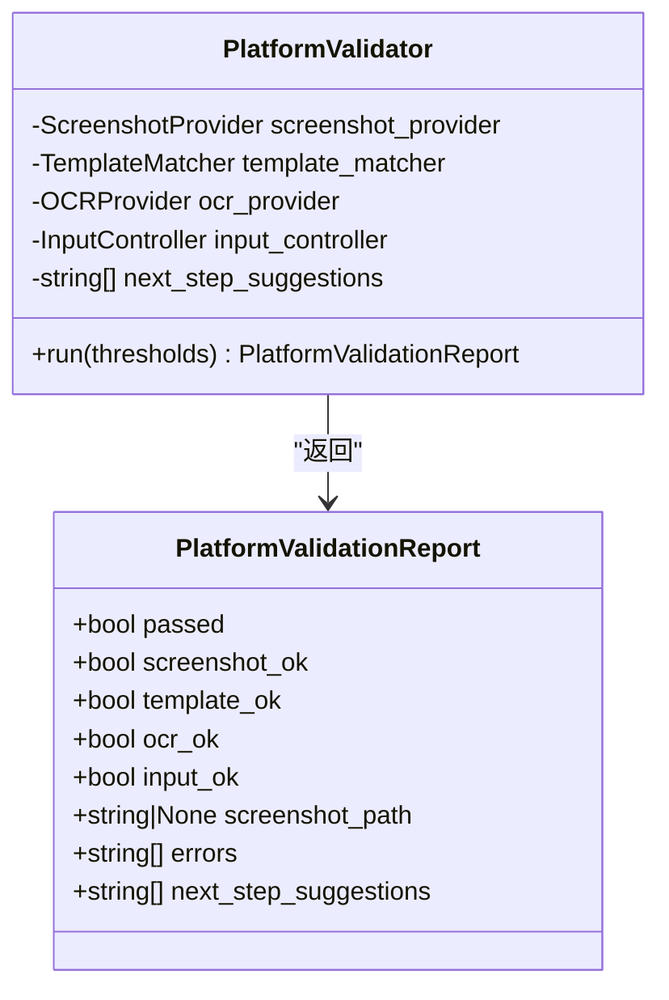
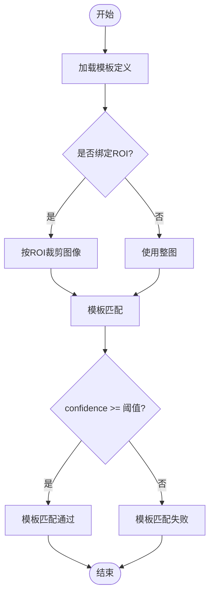
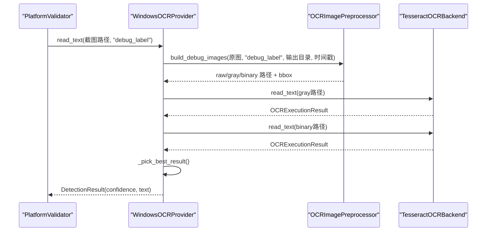
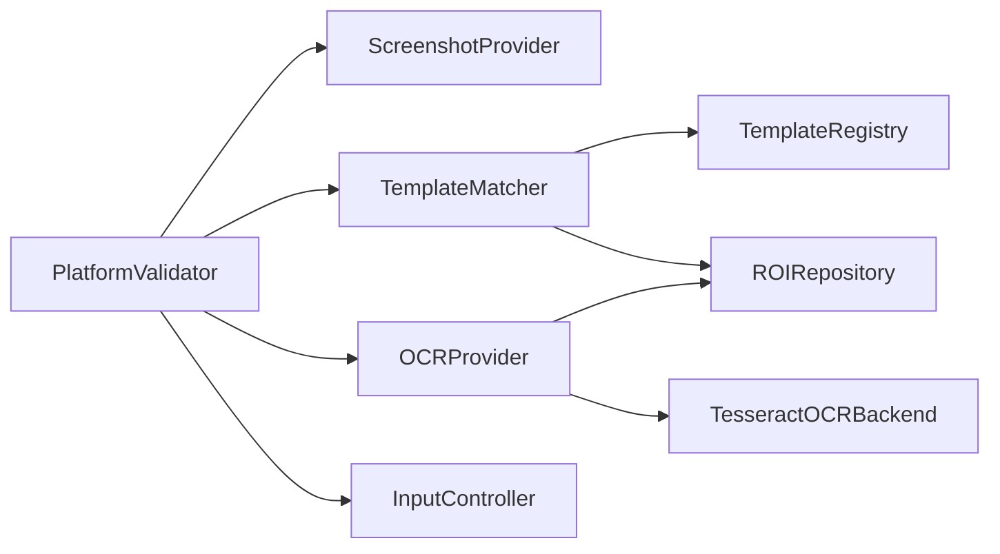

# 环境验证模块

<cite>
**本文引用的文件**
- [env_module.py](file://src/modules/env_module.py)
- [contracts.py](file://src/vision/contracts.py)
- [ocr.py](file://src/vision/ocr.py)
- [template_registry.py](file://src/vision/template_registry.py)
- [contracts.py](file://src/input/contracts.py)
- [app.config.json](file://config/app.config.json)
- [templates.config.json](file://config/templates.config.json)
- [roi.config.json](file://config/roi.config.json)
- [test_ocr.py](file://tools/test_ocr.py)
</cite>

## 目录
1. [简介](#简介)
2. [项目结构](#项目结构)
3. [核心组件](#核心组件)
4. [架构总览](#架构总览)
5. [详细组件分析](#详细组件分析)
6. [依赖关系分析](#依赖关系分析)
7. [性能与阈值配置](#性能与阈值配置)
8. [故障排查指南](#故障排查指南)
9. [结论](#结论)
10. [附录：配置示例与使用场景](#附录配置示例与使用场景)

## 简介
本技术文档聚焦“环境验证模块”，围绕 PlatformValidator 类及其协作的截图、模板匹配、OCR 识别与输入控制链路，系统阐述其实现原理、数据流、阈值配置机制与排障方法。该模块用于在业务自动化之前，对运行环境的稳定性进行前置校验，确保后续流程具备可复现的基础能力。

## 项目结构
环境验证模块位于 src/modules/env_module.py，依赖视觉层（截图、模板匹配、OCR）与输入控制抽象接口，并通过配置文件提供阈值与资源路径。关键文件职责如下：
- 环境验证编排：src/modules/env_module.py
- 视觉契约与实现：src/vision/contracts.py、src/vision/ocr.py、src/vision/template_registry.py
- 输入控制契约与实现：src/input/contracts.py
- 配置：config/app.config.json、config/templates.config.json、config/roi.config.json
- OCR 独立测试工具：tools/test_ocr.py

图表来源
- [env_module.py:23-87](file://src/modules/env_module.py#L23-L87)
- [contracts.py:25-55](file://src/vision/contracts.py#L25-L55)
- [template_registry.py:17-43](file://src/vision/template_registry.py#L17-L43)
- [ocr.py:73-107](file://src/vision/ocr.py#L73-L107)
- [app.config.json:16-21](file://config/app.config.json#L16-L21)

章节来源
- [env_module.py:23-87](file://src/modules/env_module.py#L23-L87)
- [contracts.py:25-55](file://src/vision/contracts.py#L25-L55)
- [template_registry.py:17-43](file://src/vision/template_registry.py#L17-L43)
- [ocr.py:73-107](file://src/vision/ocr.py#L73-L107)
- [app.config.json:16-21](file://config/app.config.json#L16-L21)

## 核心组件
- PlatformValidator：统一编排截图、模板匹配、OCR、输入四项验证，汇总错误与建议，输出平台验证报告。
- PlatformValidationReport：记录通过状态、各子项结果、截图路径、错误列表与下一步建议。
- ScreenshotProvider / TemplateMatcher / OCRProvider / InputController：抽象接口，便于替换 Windows 或 DryRun 实现。
- TemplateRegistry / ROIRepository：模板与区域配置管理，支撑模板匹配与 OCR 预处理。
- TesseractOCRBackend / OCRImagePreprocessor：OCR 后端与图像预处理（灰度化、二值化、缩放）。

章节来源
- [env_module.py:11-87](file://src/modules/env_module.py#L11-L87)
- [contracts.py:25-55](file://src/vision/contracts.py#L25-L55)
- [template_registry.py:8-43](file://src/vision/template_registry.py#L8-L43)
- [ocr.py:23-107](file://src/vision/ocr.py#L23-L107)
- [contracts.py:101-251](file://src/vision/contracts.py#L101-L251)
- [contracts.py:10-65](file://src/input/contracts.py#L10-L65)

## 架构总览
PlatformValidator.run 的执行顺序为：截图 → 模板匹配 → OCR → 输入控制。每一步均捕获异常并收集错误信息；最终根据各子项是否通过计算总体 passed。

图表来源
- [env_module.py:38-87](file://src/modules/env_module.py#L38-L87)
- [contracts.py:25-55](file://src/vision/contracts.py#L25-L55)
- [contracts.py:101-251](file://src/vision/contracts.py#L101-L251)
- [contracts.py:10-65](file://src/input/contracts.py#L10-L65)

## 详细组件分析

### PlatformValidator 与 PlatformValidationReport
- 职责：串联四大链路，按阈值判定通过与否，收集错误与建议，生成报告。
- 关键行为：
  - 截图：调用 ScreenshotProvider.capture_fullscreen()，失败则记录错误。
  - 模板匹配：调用 TemplateMatcher.match()，比较 confidence 与 template_match_threshold。
  - OCR：调用 OCRProvider.read_text()，比较 confidence 与 ocr_confidence_threshold。
  - 输入控制：执行一次点击与一次按键，要求两者均成功。
  - 报告字段：passed、screenshot_ok、template_ok、ocr_ok、input_ok、screenshot_path、errors、next_step_suggestions。
- 设计要点：
  - 异常隔离：每个子步骤 try/except 捕获异常，避免单点失败导致整体中断。
  - 建议注入：若存在 errors，则在 next_step_suggestions 中插入优先修复提示。

图表来源
- [env_module.py:11-87](file://src/modules/env_module.py#L11-L87)

章节来源
- [env_module.py:11-87](file://src/modules/env_module.py#L11-L87)

### 截图链路验证
- 实现位置：ScreenshotProvider 抽象及 Windows/DryRun 实现。
- 行为说明：
  - Windows 实现会查找目标窗口并截取客户区画面，保存为 BMP。
  - DryRun 实现仅写入占位文本，用于无真实环境下的联调。
- 关键点：
  - 截图成功后，后续模板匹配与 OCR 才可能继续。
  - 若截图失败，errors 将记录“截图链路失败”。

章节来源
- [contracts.py:25-34](file://src/vision/contracts.py#L25-L34)
- [contracts.py:58-70](file://src/vision/contracts.py#L58-L70)
- [contracts.py:101-116](file://src/vision/contracts.py#L101-L116)
- [env_module.py:45-48](file://src/modules/env_module.py#L45-L48)

### 模板匹配验证
- 实现位置：TemplateMatcher 抽象及 WindowsTemplateMatcher 实现；模板定义由 TemplateRegistry 加载。
- 行为说明：
  - 从 templates.config.json 读取模板路径、ROI、阈值等。
  - 若绑定 ROI，先在 ROI 区域内裁剪再匹配，提升性能与鲁棒性。
  - 匹配结果以 confidence 与模板阈值比较，决定是否命中。
- 关键点：
  - ROI 越界时返回安全失败结果，不抛异常。
  - 匹配失败会在 errors 中记录“模板匹配失败”。

图表来源
- [template_registry.py:17-43](file://src/vision/template_registry.py#L17-L43)
- [contracts.py:119-185](file://src/vision/contracts.py#L119-L185)
- [env_module.py:51-57](file://src/modules/env_module.py#L51-L57)

章节来源
- [template_registry.py:17-43](file://src/vision/template_registry.py#L17-L43)
- [contracts.py:119-185](file://src/vision/contracts.py#L119-L185)
- [env_module.py:51-57](file://src/modules/env_module.py#L51-L57)

### OCR 识别验证
- 实现位置：OCRProvider 抽象及 WindowsOCRProvider；OCR 后端 TesseractOCRBackend；预处理 OCRImagePreprocessor。
- 行为说明：
  - 根据 ROI 配置裁切 debug_label 区域。
  - 生成灰度图与二值图（Otsu 自适应阈值），分别调用 Tesseract 识别。
  - 选择最佳结果（有内容优先，其次置信度与长度）。
  - 返回 DetectionResult，包含 confidence 与文本。
- 关键点：
  - 若未安装 Tesseract 或命令不可用，将抛出运行时错误。
  - 识别失败会在 errors 中记录“OCR 链路失败”。

图表来源
- [contracts.py:188-251](file://src/vision/contracts.py#L188-L251)
- [ocr.py:73-107](file://src/vision/ocr.py#L73-L107)
- [ocr.py:23-70](file://src/vision/ocr.py#L23-L70)
- [env_module.py:59-63](file://src/modules/env_module.py#L59-L63)

章节来源
- [contracts.py:188-251](file://src/vision/contracts.py#L188-L251)
- [ocr.py:23-107](file://src/vision/ocr.py#L23-L107)
- [env_module.py:59-63](file://src/modules/env_module.py#L59-L63)

### 输入控制验证
- 实现位置：InputController 抽象及 WindowsInputController 实现。
- 行为说明：
  - 执行一次点击与一次按键，要求两者均返回成功。
  - 操作日志写入调试目录，便于回溯。
- 关键点：
  - 若任一动作失败，input_ok 为 False，并在 errors 中记录“输入链路失败”。

章节来源
- [contracts.py:10-65](file://src/input/contracts.py#L10-L65)
- [env_module.py:65-70](file://src/modules/env_module.py#L65-L70)

## 依赖关系分析
- 耦合与内聚：
  - PlatformValidator 仅依赖抽象接口，低耦合、高内聚，便于替换实现。
  - 视觉层内部通过 TemplateRegistry 与 ROIRepository 解耦配置与算法。
- 外部依赖：
  - Tesseract OCR 作为外部进程被调用，需保证可执行文件可用。
  - Windows API 用于窗口查找、截图与输入模拟。
- 潜在循环依赖：
  - 当前模块间为单向依赖，未发现循环引用。

图表来源
- [env_module.py:23-87](file://src/modules/env_module.py#L23-L87)
- [contracts.py:25-55](file://src/vision/contracts.py#L25-L55)
- [template_registry.py:17-43](file://src/vision/template_registry.py#L17-L43)
- [ocr.py:23-107](file://src/vision/ocr.py#L23-L107)

章节来源
- [env_module.py:23-87](file://src/modules/env_module.py#L23-L87)
- [contracts.py:25-55](file://src/vision/contracts.py#L25-L55)
- [template_registry.py:17-43](file://src/vision/template_registry.py#L17-L43)
- [ocr.py:23-107](file://src/vision/ocr.py#L23-L107)

## 性能与阈值配置
- 阈值来源：
  - app.config.json 中的 platform_validation 段提供：
    - template_match_threshold：模板匹配置信度阈值。
    - ocr_confidence_threshold：OCR 识别置信度阈值。
    - input_success_threshold：输入成功率阈值（当前验证逻辑以布尔成功为准）。
- 阈值作用：
  - template_match_threshold：决定模板匹配是否通过，过高可能导致误判失败，过低可能误报。
  - ocr_confidence_threshold：决定 OCR 是否通过，受语言、PSM、预处理质量影响。
- 性能优化建议：
  - 模板匹配结合 ROI 裁剪，减少搜索空间。
  - OCR 双路识别（灰度/二值）提高鲁棒性，但会增加耗时。
  - 合理设置 PSM 与语言，减少无效识别。
  - 截图目录与调试图目录分离，避免 I/O 瓶颈。

章节来源
- [app.config.json:16-21](file://config/app.config.json#L16-L21)
- [env_module.py:51-63](file://src/modules/env_module.py#L51-L63)
- [contracts.py:119-185](file://src/vision/contracts.py#L119-L185)
- [ocr.py:73-107](file://src/vision/ocr.py#L73-L107)

## 故障排查指南
- 截图链路失败
  - 现象：errors 包含“截图链路失败”。
  - 排查：
    - 确认目标窗口是否存在且标题关键词匹配。
    - 检查截图目录权限与磁盘空间。
    - 使用 DryRun 模式先验证后续链路。
- 模板匹配失败
  - 现象：errors 包含“模板匹配失败”或 template_ok 为 False。
  - 排查：
    - 检查 templates.config.json 中 path 与 roi 是否正确。
    - 确认模板文件存在且与游戏 UI 一致。
    - 调整 template_match_threshold 或重新采集模板。
    - 查看 ROI 是否越界（ROI 越界会返回安全失败）。
- OCR 链路失败
  - 现象：errors 包含“OCR 链路失败”或 ocr_ok 为 False。
  - 排查：
    - 确认已安装 Tesseract 并可执行。
    - 检查 app.config.json 中 ocr_tesseract_cmd、ocr_language、ocr_psm。
    - 使用 tools/test_ocr.py 单独验证 ROI 与预处理效果。
    - 观察 runtime/debug/ocr 下的原始/灰度/二值图，确认区域正确。
- 输入链路失败
  - 现象：errors 包含“输入链路失败”或 input_ok 为 False。
  - 排查：
    - 确认窗口焦点与坐标体系（客户区相对坐标）。
    - 检查调试日志 windows_input_click/key_*.log。
    - 尝试在其他窗口或不同坐标下验证输入能力。

章节来源
- [env_module.py:45-70](file://src/modules/env_module.py#L45-L70)
- [contracts.py:119-185](file://src/vision/contracts.py#L119-L185)
- [ocr.py:23-70](file://src/vision/ocr.py#L23-L70)
- [contracts.py:37-65](file://src/input/contracts.py#L37-L65)
- [test_ocr.py:57-181](file://tools/test_ocr.py#L57-L181)

## 结论
环境验证模块通过统一的编排与严格的异常隔离，确保截图、模板匹配、OCR 与输入四条基础链路在业务开发前达到稳定可用。配合配置化的阈值与 ROI，可在固定环境下快速定位问题并给出可操作的修复建议。建议在 M0 阶段完成全链路验证后再推进后续功能。

## 附录：配置示例与使用场景
- 配置要点
  - app.config.json
    - window_title_keyword：目标窗口标题关键词。
    - ocr_language、ocr_psm、ocr_tesseract_cmd：OCR 参数。
    - platform_validation：thresholds 与检查次数。
  - templates.config.json
    - hideout_anchor：模板路径、ROI、阈值与描述。
  - roi.config.json
    - debug_label、hideout_anchor 等 ROI 区域定义。
- 使用场景
  - 本地联调：使用 DryRun 实现快速验证逻辑，无需真实窗口。
  - 真实环境：配置 Windows 实现，确保窗口、模板、ROI 与实际一致。
  - OCR 调试：使用 tools/test_ocr.py 单独验证 ROI 与预处理效果，输出调试图。
- 典型调用流程
  - 加载 app.config.json 获取 thresholds。
  - 构造 PlatformValidator 实例，注入 ScreenshotProvider、TemplateMatcher、OCRProvider、InputController。
  - 调用 run(thresholds)，读取 PlatformValidationReport 判断 passed 与 errors。
  - 根据 next_step_suggestions 进行修复或重试。

章节来源
- [app.config.json:1-22](file://config/app.config.json#L1-L22)
- [templates.config.json:1-9](file://config/templates.config.json#L1-L9)
- [roi.config.json:1-31](file://config/roi.config.json#L1-L31)
- [test_ocr.py:26-55](file://tools/test_ocr.py#L26-L55)
- [env_module.py:38-87](file://src/modules/env_module.py#L38-L87)