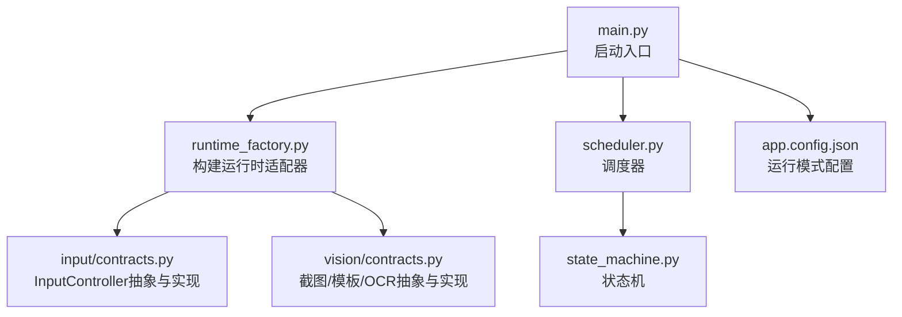
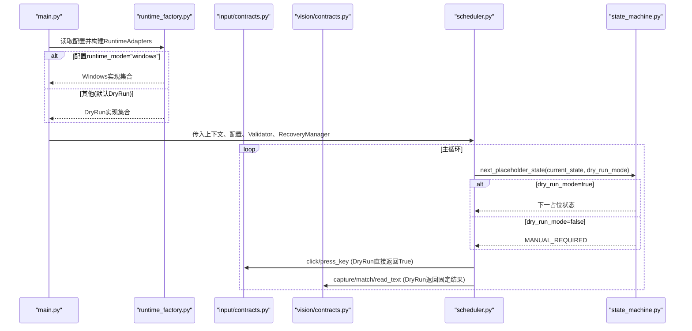
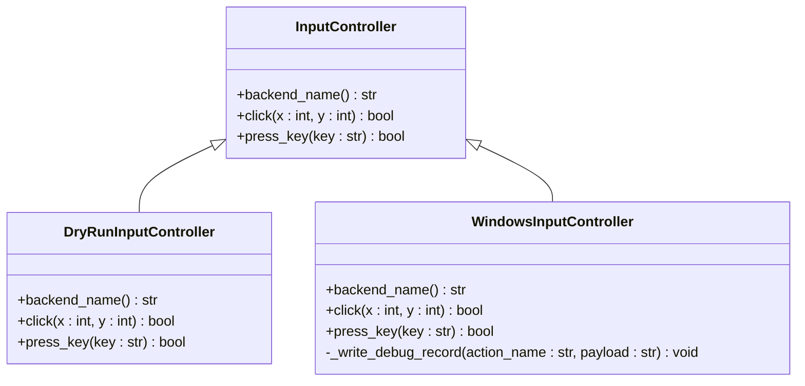
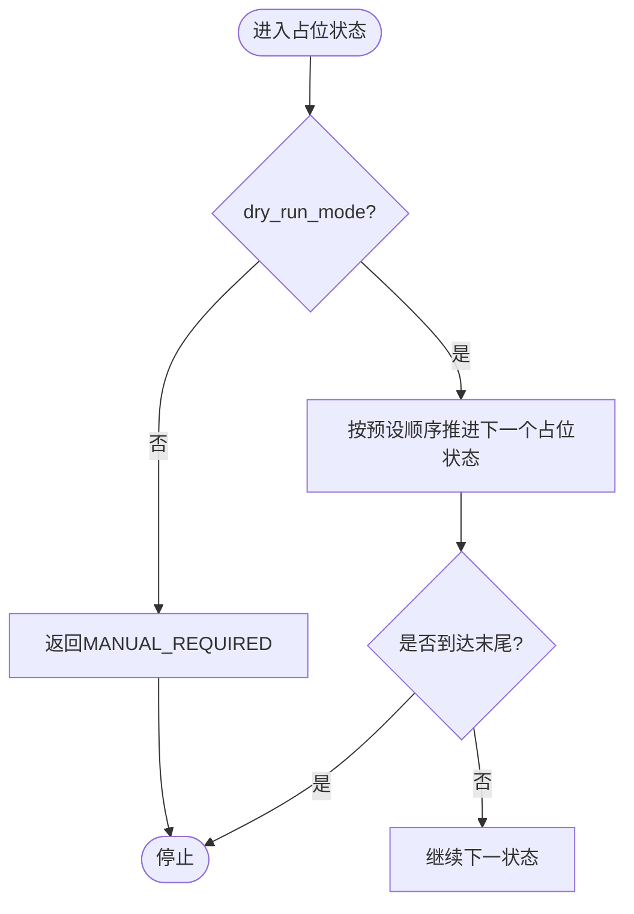
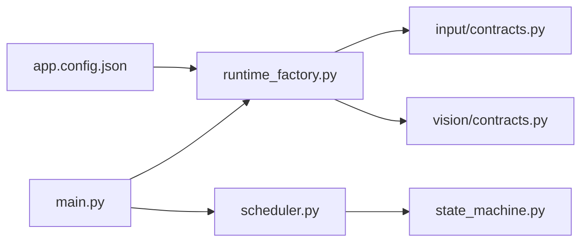

# DryRun开发模式

<cite>
**本文引用的文件**
- [src/input/contracts.py](file://src/input/contracts.py)
- [src/vision/contracts.py](file://src/vision/contracts.py)
- [src/core/runtime_factory.py](file://src/core/runtime_factory.py)
- [src/core/scheduler.py](file://src/core/scheduler.py)
- [src/core/state_machine.py](file://src/core/state_machine.py)
- [src/main.py](file://src/main.py)
- [config/app.config.json](file://config/app.config.json)
- [README.md](file://README.md)
</cite>

## 目录
1. [简介](#简介)
2. [项目结构](#项目结构)
3. [核心组件](#核心组件)
4. [架构总览](#架构总览)
5. [详细组件分析](#详细组件分析)
6. [依赖关系分析](#依赖关系分析)
7. [性能与行为特征](#性能与行为特征)
8. [故障排查指南](#故障排查指南)
9. [结论](#结论)
10. [附录：使用示例与最佳实践](#附录使用示例与最佳实践)

## 简介
本技术文档聚焦于DryRun开发模式，围绕输入控制器的抽象契约、运行时装配、状态机占位流转以及在不同环境下的切换方式展开。DryRun模式的核心目标是：在不启动真实游戏窗口、不执行系统级输入的前提下，验证脚本的状态流转、识别链路和调用顺序是否正确；同时为单元测试、集成测试和开发调试提供稳定、可重复的“假实现”。

在DryRun模式下，所有输入操作（鼠标点击、键盘按键）均返回成功，但不产生任何系统副作用；截图、模板匹配、OCR等视觉能力也通过DryRun实现返回固定结果，从而让上层业务逻辑可以在无外部依赖的环境中运行。

## 项目结构
本项目采用分层与适配器模式组织代码：
- 输入层：定义输入控制器抽象接口，并提供DryRun与Windows两套实现
- 视觉层：定义截图、模板匹配、OCR抽象接口，并提供DryRun与Windows两套实现
- 核心层：运行时工厂根据配置装配具体实现；调度器驱动状态机流转
- 入口：主程序加载配置并构建运行时适配器，启动调度循环

图表来源
- [src/main.py:22-50](file://src/main.py#L22-L50)
- [src/core/runtime_factory.py:30-76](file://src/core/runtime_factory.py#L30-L76)
- [src/input/contracts.py:10-64](file://src/input/contracts.py#L10-L64)
- [src/vision/contracts.py:25-99](file://src/vision/contracts.py#L25-L99)
- [src/core/scheduler.py:32-83](file://src/core/scheduler.py#L32-L83)
- [src/core/state_machine.py:17-41](file://src/core/state_machine.py#L17-L41)
- [config/app.config.json:1-22](file://config/app.config.json#L1-L22)

章节来源
- [src/main.py:22-50](file://src/main.py#L22-L50)
- [src/core/runtime_factory.py:30-76](file://src/core/runtime_factory.py#L30-L76)
- [src/input/contracts.py:10-64](file://src/input/contracts.py#L10-L64)
- [src/vision/contracts.py:25-99](file://src/vision/contracts.py#L25-L99)
- [src/core/scheduler.py:32-83](file://src/core/scheduler.py#L32-L83)
- [src/core/state_machine.py:17-41](file://src/core/state_machine.py#L17-L41)
- [config/app.config.json:1-22](file://config/app.config.json#L1-L22)

## 核心组件
- 输入控制器抽象与实现
  - InputController：定义click与press_key方法，以及后端名称属性
  - DryRunInputController：DryRun模式的输入控制器，所有操作返回True，不执行系统调用
  - WindowsInputController：真实Windows模式，调用底层API进行窗口查找与输入发送，并记录调试日志
- 视觉提供者抽象与实现
  - ScreenshotProvider/TemplateMatcher/OCRProvider：抽象接口
  - DryRun*系列：返回固定结果，用于无依赖测试
  - Windows*系列：真实截图、模板匹配、OCR识别
- 运行时装配器
  - RuntimeAdapters：聚合各适配层实例
  - build_runtime_adapters：根据配置选择DryRun或Windows实现
- 调度器与状态机
  - Scheduler：主循环、超时保护、状态处理
  - StateMachine：占位状态在DryRun模式下按序推进，便于验证流程

章节来源
- [src/input/contracts.py:10-64](file://src/input/contracts.py#L10-L64)
- [src/vision/contracts.py:25-99](file://src/vision/contracts.py#L25-L99)
- [src/core/runtime_factory.py:21-76](file://src/core/runtime_factory.py#L21-L76)
- [src/core/scheduler.py:13-83](file://src/core/scheduler.py#L13-L83)
- [src/core/state_machine.py:6-41](file://src/core/state_machine.py#L6-L41)

## 架构总览
下图展示了从主程序到具体实现的装配与调用关系，突出DryRun模式在输入与视觉层的占位作用。

图表来源
- [src/main.py:22-50](file://src/main.py#L22-L50)
- [src/core/runtime_factory.py:30-76](file://src/core/runtime_factory.py#L30-L76)
- [src/input/contracts.py:25-34](file://src/input/contracts.py#L25-L34)
- [src/vision/contracts.py:58-99](file://src/vision/contracts.py#L58-L99)
- [src/core/scheduler.py:32-83](file://src/core/scheduler.py#L32-L83)
- [src/core/state_machine.py:17-41](file://src/core/state_machine.py#L17-L41)

## 详细组件分析

### 输入控制器：DryRunInputController设计思想
- 设计目标
  - 提供与真实输入控制器一致的接口，使上层无需关心平台差异
  - 在DryRun模式下屏蔽系统调用，保证测试可重复、快速且无副作用
- 关键行为
  - backend_name返回"dry_run"，便于诊断与日志区分
  - click(x, y)始终返回True，表示“操作成功”，但不实际点击
  - press_key(key)始终返回True，表示“按键成功”，但不实际发送
- 对比Windows实现
  - WindowsInputController会查找目标窗口、调用底层API发送输入，并写入调试日志
  - DryRunInputController完全跳过这些步骤，适合在无游戏环境的CI或本地开发中运行

图表来源
- [src/input/contracts.py:10-64](file://src/input/contracts.py#L10-L64)

章节来源
- [src/input/contracts.py:10-64](file://src/input/contracts.py#L10-L64)

### 视觉层DryRun实现：截图、模板匹配、OCR
- DryRunScreenshotProvider
  - 创建screenshot_dir，capture_fullscreen返回一个占位文本文件路径
- DryRunTemplateMatcher
  - match返回固定DetectionResult，found=True，confidence=0.99，text为模板名
- DryRunOCRProvider
  - read_text返回固定DetectionResult，found=True，confidence=0.96，text包含region_name标识

这些实现确保上层识别链路在DryRun模式下稳定通过，便于验证状态流转与业务逻辑。

章节来源
- [src/vision/contracts.py:58-99](file://src/vision/contracts.py#L58-L99)

### 运行时装配：根据配置选择DryRun或Windows
- build_runtime_adapters读取配置中的runtime_mode
  - 若为"windows"，装配Windows实现集
  - 否则装配DryRun实现集（默认）
- 该函数集中了平台细节，避免散落到主程序或其他模块

章节来源
- [src/core/runtime_factory.py:30-76](file://src/core/runtime_factory.py#L30-L76)

### 调度器与状态机：DryRun模式下的占位流转
- Scheduler主循环负责状态推进、超时保护与错误恢复
- StateMachine.next_placeholder_state在dry_run_mode为true时，按预设顺序推进占位状态，直到STOPPED
- 当dry_run_mode为false时，占位状态直接返回MANUAL_REQUIRED，提示需要人工介入或真实环境支持

图表来源
- [src/core/state_machine.py:17-41](file://src/core/state_machine.py#L17-L41)
- [src/core/scheduler.py:77-83](file://src/core/scheduler.py#L77-L83)

章节来源
- [src/core/state_machine.py:17-41](file://src/core/state_machine.py#L17-L41)
- [src/core/scheduler.py:32-83](file://src/core/scheduler.py#L32-L83)

## 依赖关系分析
- 主程序依赖运行时工厂装配具体实现
- 调度器依赖状态机与校验器，校验器依赖各适配层
- DryRun模式通过统一抽象屏蔽平台差异，降低耦合度
- 配置文件决定运行时模式，影响整个装配链

图表来源
- [config/app.config.json:1-22](file://config/app.config.json#L1-L22)
- [src/core/runtime_factory.py:30-76](file://src/core/runtime_factory.py#L30-L76)
- [src/main.py:22-50](file://src/main.py#L22-L50)
- [src/core/scheduler.py:32-83](file://src/core/scheduler.py#L32-L83)
- [src/core/state_machine.py:17-41](file://src/core/state_machine.py#L17-L41)

章节来源
- [config/app.config.json:1-22](file://config/app.config.json#L1-L22)
- [src/core/runtime_factory.py:30-76](file://src/core/runtime_factory.py#L30-L76)
- [src/main.py:22-50](file://src/main.py#L22-L50)
- [src/core/scheduler.py:32-83](file://src/core/scheduler.py#L32-L83)
- [src/core/state_machine.py:17-41](file://src/core/state_machine.py#L17-L41)

## 性能与行为特征
- DryRun模式优势
  - 零系统调用：无窗口查找、无输入发送、无磁盘IO开销（仅最小化占位文件）
  - 确定性输出：固定返回值与置信度，便于断言与回归测试
  - 快速迭代：无需启动游戏或安装OCR，提升开发与CI速度
- 行为约束
  - 所有输入操作返回True，不代表真实系统可用性，需切换到Windows模式验证
  - 视觉层返回固定结果，不能反映真实识别率，需结合Windows模式做基准测试
- 适用场景
  - 单元测试：验证状态机流转、异常分支、重试与恢复逻辑
  - 集成测试：串联多模块调用顺序，确保接口契约一致
  - 开发调试：快速定位逻辑问题，减少环境干扰

[本节为通用指导，不直接分析具体文件]

## 故障排查指南
- 常见问题
  - 配置未生效：确认app.config.json中的runtime_mode与dry_run_mode设置正确
  - 占位状态未推进：检查scheduler是否正确传递dry_run_mode给state_machine
  - 日志缺失：DryRun模式不会写入系统输入日志，需在Windows模式下验证输入链路
- 建议排查步骤
  - 打印当前runtime_mode与next_step_suggestions，确认装配结果
  - 在DryRun模式下观察状态流转是否符合预期顺序
  - 切换到Windows模式后，检查debug_dir中的输入日志与截图路径

章节来源
- [config/app.config.json:1-22](file://config/app.config.json#L1-L22)
- [src/core/scheduler.py:57-83](file://src/core/scheduler.py#L57-L83)
- [src/core/runtime_factory.py:30-76](file://src/core/runtime_factory.py#L30-L76)

## 结论
DryRun开发模式通过统一的抽象接口与适配器装配，实现了“无真实环境”的可测试性。它让开发者能够在没有游戏窗口、OCR与系统输入依赖的情况下，完整验证脚本的状态流转、调用顺序与异常处理。配合Windows真实模式，可以形成“先逻辑后平台”的开发节奏，提高稳定性与效率。

[本节为总结性内容，不直接分析具体文件]

## 附录：使用示例与最佳实践

### 使用示例：在不同环境下切换DryRun与Windows模式
- 在配置文件中设置运行模式
  - 将runtime_mode设置为"windows"以启用真实Windows模式
  - 保持或设置dry_run_mode为true/false以控制占位状态流转策略
- 启动主程序
  - main会加载配置并构建运行时适配器，随后启动调度器
- 观察行为
  - DryRun模式：输入与视觉返回固定结果，占位状态按序推进
  - Windows模式：需要目标窗口存在、OCR可用，输入会发送到真实窗口

章节来源
- [config/app.config.json:1-22](file://config/app.config.json#L1-L22)
- [src/main.py:22-50](file://src/main.py#L22-L50)
- [src/core/runtime_factory.py:30-76](file://src/core/runtime_factory.py#L30-L76)

### 最佳实践建议
- 开发阶段
  - 优先使用DryRun模式编写与验证业务逻辑，确保状态机与调用顺序正确
  - 利用DryRun的固定返回值编写单元测试，覆盖边界与异常分支
- 集成测试
  - 在CI中使用DryRun模式快速验证流水线，减少对外部依赖
  - 定期切换到Windows模式进行端到端验证，确保真实环境可用性
- 生产与发布
  - 明确DryRun模式不可用于生产环境，必须切换到Windows模式
  - 建立回归测试套件，对比DryRun与Windows模式的差异点

[本节为通用指导，不直接分析具体文件]