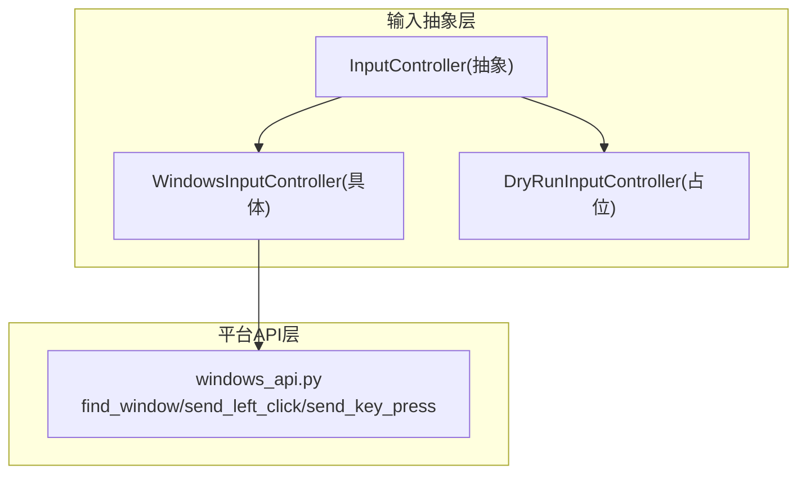
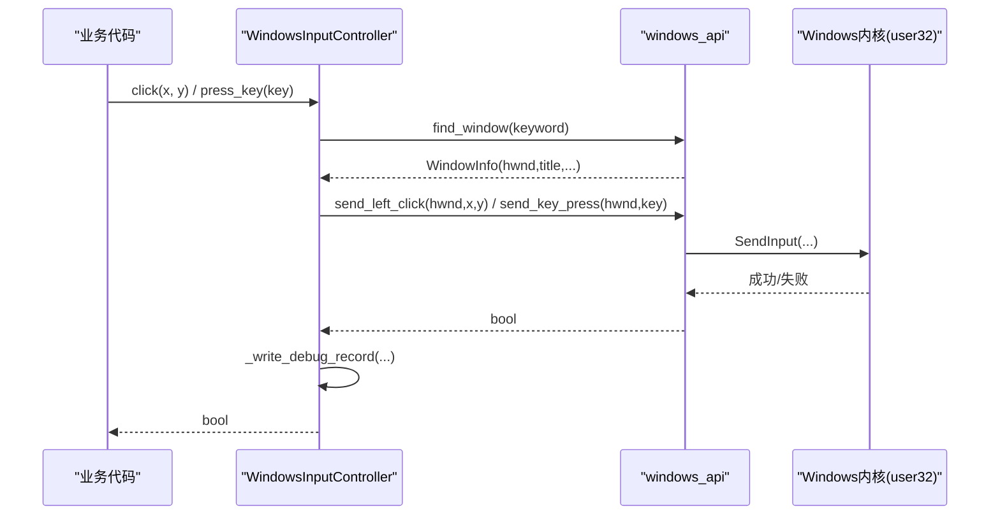
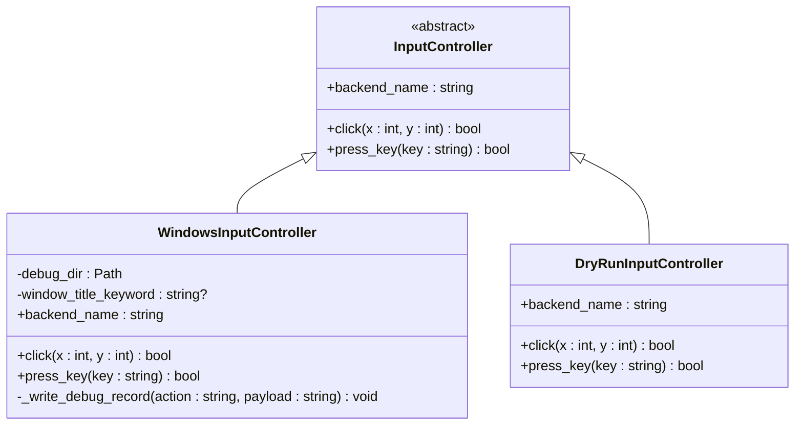
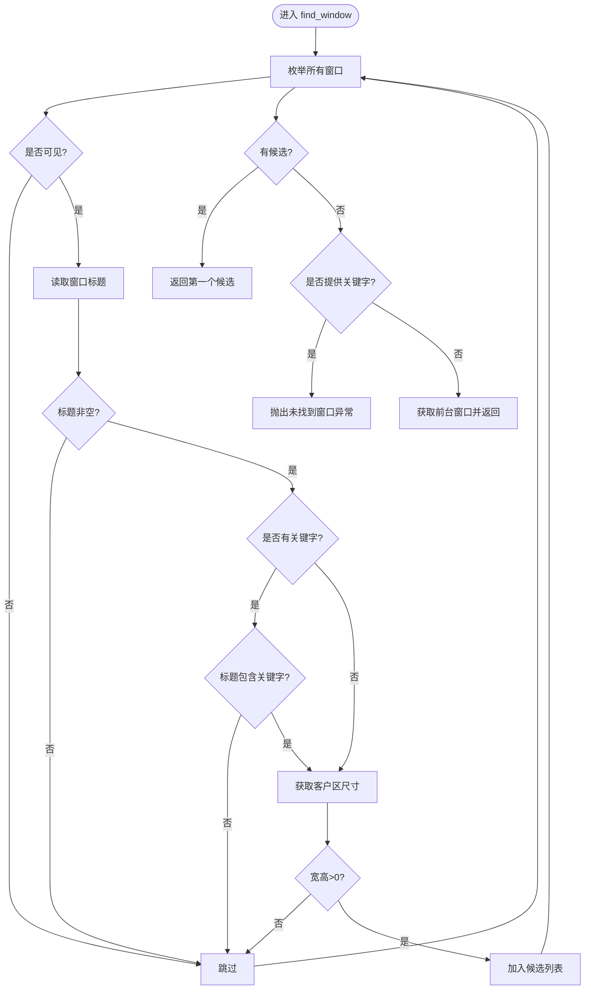
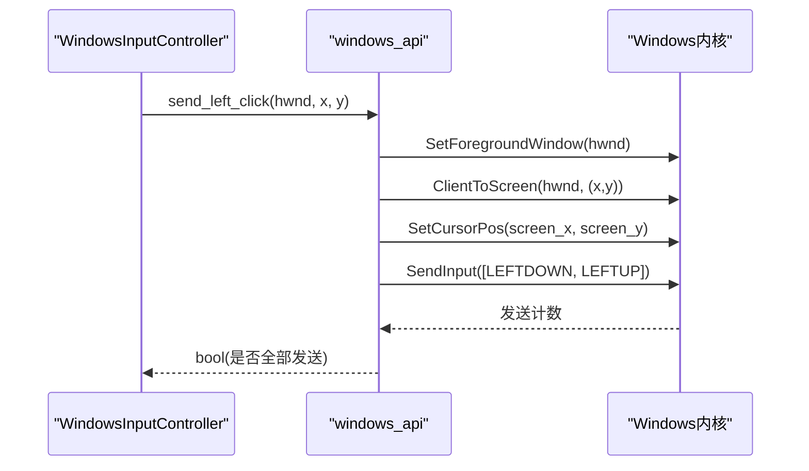
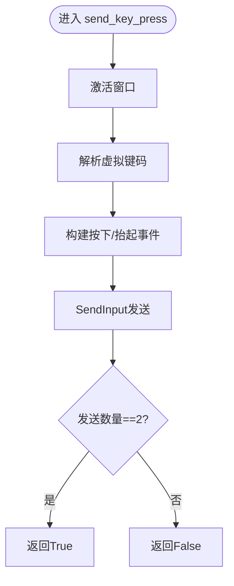
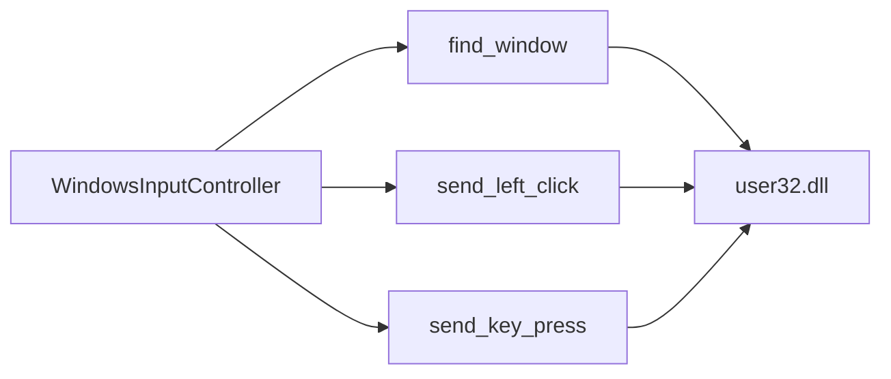

# Windows平台适配器

<cite>
**本文引用的文件**
- [src/input/contracts.py](file://src/input/contracts.py)
- [src/utils/windows_api.py](file://src/utils/windows_api.py)
- [README.md](file://README.md)
</cite>

## 目录
1. [简介](#简介)
2. [项目结构](#项目结构)
3. [核心组件](#核心组件)
4. [架构总览](#架构总览)
5. [详细组件分析](#详细组件分析)
6. [依赖关系分析](#依赖关系分析)
7. [性能考虑](#性能考虑)
8. [故障排查指南](#故障排查指南)
9. [结论](#结论)
10. [附录：使用示例与最佳实践](#附录使用示例与最佳实践)

## 简介
本技术文档聚焦于Windows平台适配器的实现，围绕WindowsInputController类展开，系统阐述其窗口查找、鼠标点击模拟、键盘按键输入等核心能力，并说明底层Windows API的封装方式、调试记录机制以及错误处理策略。文档同时提供实际使用示例与常见问题解决方案，帮助开发者在Windows环境下稳定地进行游戏自动化操作。

## 项目结构
本项目采用分层组织方式：
- 输入抽象层：定义统一的输入控制器接口，并提供Windows平台的具体实现。
- 平台API层：通过ctypes直接调用user32/gdi32等Windows API，完成窗口枚举、坐标转换、截图、鼠标与键盘事件注入。
- 业务与工具层：包含视觉识别、ROI标定、OCR等能力（与本适配器间接相关）。

图表来源
- [src/input/contracts.py:10-64](file://src/input/contracts.py#L10-L64)
- [src/utils/windows_api.py:121-376](file://src/utils/windows_api.py#L121-L376)

章节来源
- [src/input/contracts.py:10-64](file://src/input/contracts.py#L10-L64)
- [src/utils/windows_api.py:121-376](file://src/utils/windows_api.py#L121-L376)

## 核心组件
- InputController：定义统一的输入控制接口，包括click(x, y)与press_key(key)。
- WindowsInputController：基于Windows API的具体实现，负责定位目标窗口、执行点击与按键，并输出调试日志。
- windows_api模块：封装Windows API，提供窗口查找、坐标转换、截图、鼠标/键盘事件注入等能力。

章节来源
- [src/input/contracts.py:10-64](file://src/input/contracts.py#L10-L64)
- [src/utils/windows_api.py:121-376](file://src/utils/windows_api.py#L121-L376)

## 架构总览
WindowsInputController作为上层业务与底层Windows API之间的桥梁，遵循“先定位窗口，再执行动作”的流程。所有输入动作均通过SendInput注入到目标窗口，确保输入被正确接收。

图表来源
- [src/input/contracts.py:47-64](file://src/input/contracts.py#L47-L64)
- [src/utils/windows_api.py:121-376](file://src/utils/windows_api.py#L121-L376)

## 详细组件分析

### WindowsInputController类
- 职责
  - 初始化时创建调试目录，保存每次操作的日志文件。
  - 根据可选的窗口标题关键字定位目标窗口。
  - 将相对客户区坐标转换为屏幕坐标后发送鼠标点击。
  - 将键名解析为虚拟键码后发送键盘按下/抬起事件。
  - 每次操作后写入调试记录，便于问题回溯。
- 关键方法
  - click(x, y)：定位窗口→发送左键点击→写日志→返回结果。
  - press_key(key)：定位窗口→解析键码→发送按键→写日志→返回结果。
  - _write_debug_record(action, payload)：以时间戳命名日志文件，追加一行记录。

图表来源
- [src/input/contracts.py:10-64](file://src/input/contracts.py#L10-L64)

章节来源
- [src/input/contracts.py:37-64](file://src/input/contracts.py#L37-L64)

### 窗口查找：find_window
- 功能
  - 枚举所有可见窗口，过滤出标题包含指定关键字的窗口。
  - 若未找到匹配窗口且提供了关键字，抛出运行时异常；否则回退到前台窗口。
  - 对每个候选窗口获取客户区尺寸，仅保留有效尺寸的窗口。
- 关键点
  - 使用EnumWindows遍历窗口，IsWindowVisible过滤不可见窗口。
  - 使用GetWindowTextW读取窗口标题并进行大小写无关的关键字匹配。
  - 使用ClientToScreen将客户区左上角与右下角转换为屏幕坐标，计算宽高。
  - 若无匹配且未提供关键字，则尝试使用当前前台窗口。

图表来源
- [src/utils/windows_api.py:121-196](file://src/utils/windows_api.py#L121-L196)

章节来源
- [src/utils/windows_api.py:121-196](file://src/utils/windows_api.py#L121-L196)

### 鼠标点击：send_left_click
- 流程
  - 激活目标窗口。
  - 将客户区坐标转换为屏幕坐标。
  - 移动光标到目标位置。
  - 构造两个INPUT事件：左键按下与左键抬起。
  - 通过SendInput一次性发送，返回是否全部发送成功。
- 注意事项
  - 坐标为客户区相对坐标，需先转换。
  - 若SetCursorPos或SendInput失败，会抛出包含最后错误码的异常。

图表来源
- [src/utils/windows_api.py:315-328](file://src/utils/windows_api.py#L315-L328)

章节来源
- [src/utils/windows_api.py:315-328](file://src/utils/windows_api.py#L315-L328)

### 键盘按键：send_key_press
- 流程
  - 激活目标窗口。
  - 将键名解析为虚拟键码（支持常用键、F1-F24、单字符键）。
  - 构造两个INPUT事件：按键按下与按键抬起。
  - 通过SendInput发送，返回是否全部发送成功。
- 键名解析规则
  - 常见键映射：SPACE、ENTER、ESC、TAB、SHIFT、CTRL、ALT、方向键等。
  - F1-F24：自动映射到对应虚拟键码。
  - 单字符：通过VkKeyScanW查询虚拟键码。
  - 不支持的键名将抛出ValueError。

图表来源
- [src/utils/windows_api.py:331-342](file://src/utils/windows_api.py#L331-L342)
- [src/utils/windows_api.py:345-376](file://src/utils/windows_api.py#L345-L376)

章节来源
- [src/utils/windows_api.py:331-376](file://src/utils/windows_api.py#L331-L376)

### 调试记录机制：_write_debug_record
- 行为
  - 生成带毫秒级时间戳的文件名，避免覆盖。
  - 将动作名称、窗口标题、参数与结果写入一行文本。
  - 文件保存在构造函数指定的调试目录下。
- 扩展建议
  - 可追加异常堆栈、操作序列号、耗时统计等信息，便于更精细的问题定位。

章节来源
- [src/input/contracts.py:60-64](file://src/input/contracts.py#L60-L64)

## 依赖关系分析
- WindowsInputController依赖windows_api提供的窗口查找与输入发送能力。
- windows_api直接依赖user32与gdi32进行系统级操作。
- 输入抽象层使上层业务无需感知平台差异，便于替换或测试（如DryRun模式）。

图表来源
- [src/input/contracts.py:47-64](file://src/input/contracts.py#L47-L64)
- [src/utils/windows_api.py:121-376](file://src/utils/windows_api.py#L121-L376)

章节来源
- [src/input/contracts.py:47-64](file://src/input/contracts.py#L47-L64)
- [src/utils/windows_api.py:121-376](file://src/utils/windows_api.py#L121-L376)

## 性能考虑
- 窗口枚举开销：频繁调用find_window可能带来一定开销，建议在单次会话中复用已定位的窗口句柄。
- 输入事件批量发送：鼠标与键盘均使用两次SendInput调用（按下+抬起），减少上下文切换。
- 坐标转换：尽量在业务层缓存窗口客户区尺寸，避免重复计算。
- 日志写入：调试日志为顺序写入，注意在高并发场景下避免过多I/O。

[本节为通用性能建议，不直接分析具体文件]

## 故障排查指南
- 未找到窗口
  - 现象：抛出“未找到标题包含...的可见窗口”。
  - 排查：确认游戏窗口标题是否包含关键字；检查窗口是否可见；必要时移除关键字以回退到前台窗口。
- 前台窗口不可用
  - 现象：抛出“当前没有可用的前台窗口”。
  - 排查：确保至少有一个前台窗口存在；避免在多显示器或多会话环境下误判。
- 坐标无效
  - 现象：抛出“目标窗口客户区尺寸无效”或坐标转换失败。
  - 排查：确认传入的客户区坐标是否在窗口范围内；检查多显示器缩放导致的坐标偏移。
- 输入失败
  - 现象：SetCursorPos或SendInput失败，抛出包含last_error的异常。
  - 排查：确认目标窗口处于前台；检查权限与防作弊软件拦截；重试前等待短暂延迟。
- 键名不支持
  - 现象：抛出“不支持的按键”。
  - 排查：使用支持的键名（空格、回车、Esc、Tab、Shift、Ctrl、Alt、方向键、F1-F24、单字符）；组合键需在业务层拆分处理。

章节来源
- [src/utils/windows_api.py:178-183](file://src/utils/windows_api.py#L178-L183)
- [src/utils/windows_api.py:228-231](file://src/utils/windows_api.py#L228-L231)
- [src/utils/windows_api.py:315-328](file://src/utils/windows_api.py#L315-L328)
- [src/utils/windows_api.py:345-376](file://src/utils/windows_api.py#L345-L376)

## 结论
WindowsInputController通过清晰的抽象与稳定的底层API封装，实现了可靠的窗口定位与输入模拟能力。结合调试日志与完善的错误处理，能够在固定环境下稳定支撑游戏自动化任务。建议在业务层增加超时、重试与随机微偏移等策略，进一步提升鲁棒性。

[本节为总结性内容，不直接分析具体文件]

## 附录：使用示例与最佳实践

- 基本用法
  - 初始化：传入调试目录路径与可选的窗口标题关键字。
  - 点击：传入客户区相对坐标(x, y)，返回是否成功。
  - 按键：传入支持的键名，返回是否成功。
  - 参考路径：[src/input/contracts.py:37-64](file://src/input/contracts.py#L37-L64)

- 典型工作流
  - 启动游戏并确保窗口标题包含关键字。
  - 使用find_window定位窗口。
  - 在业务逻辑中按步骤调用click与press_key。
  - 每次操作后检查返回值，必要时重试或停机。
  - 参考路径：[src/utils/windows_api.py:121-196](file://src/utils/windows_api.py#L121-L196)、[src/utils/windows_api.py:315-376](file://src/utils/windows_api.py#L315-L376)

- 调试与验证
  - 查看调试日志文件，确认动作参数与结果。
  - 若失败，结合last_error信息定位具体原因。
  - 参考路径：[src/input/contracts.py:60-64](file://src/input/contracts.py#L60-L64)

- 最佳实践
  - 固定环境：分辨率、窗口模式、UI缩放、语言等保持一致。
  - 安全策略：每次点击后进行状态校验，避免连续无校验点击。
  - 容错设计：设置超时与最大重试次数，失败时安全停机。
  - 参考需求约束：[README.md:192-227](file://README.md#L192-L227)

章节来源
- [src/input/contracts.py:37-64](file://src/input/contracts.py#L37-L64)
- [src/utils/windows_api.py:121-196](file://src/utils/windows_api.py#L121-L196)
- [src/utils/windows_api.py:315-376](file://src/utils/windows_api.py#L315-L376)
- [README.md:192-227](file://README.md#L192-L227)