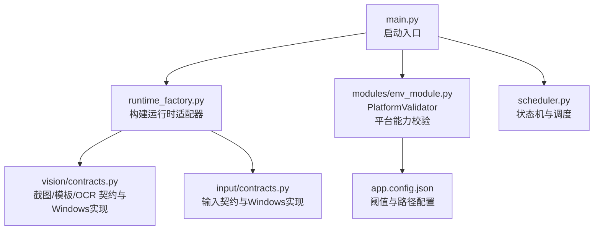
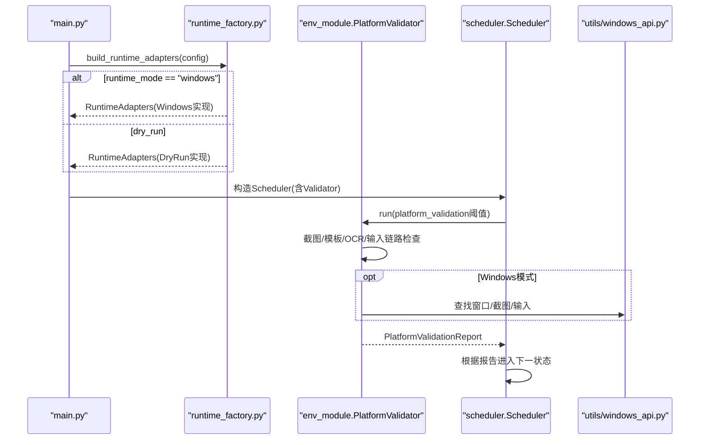
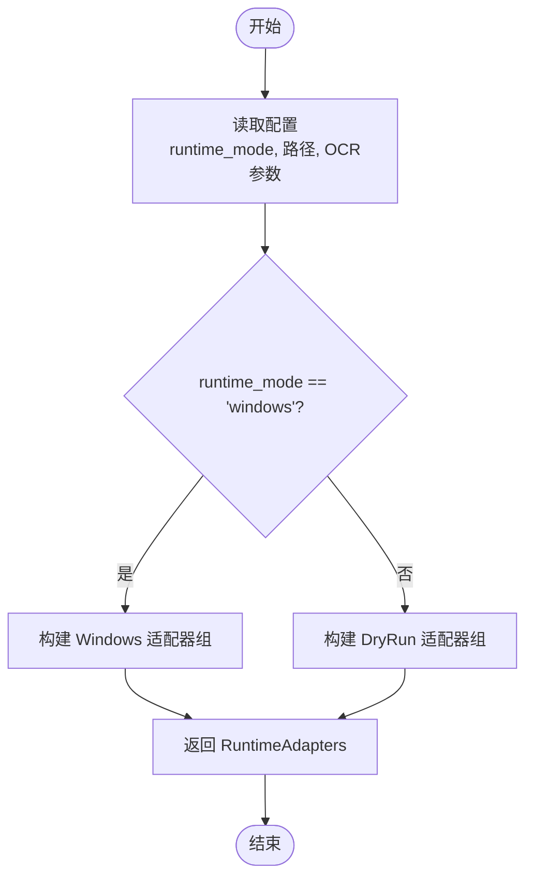
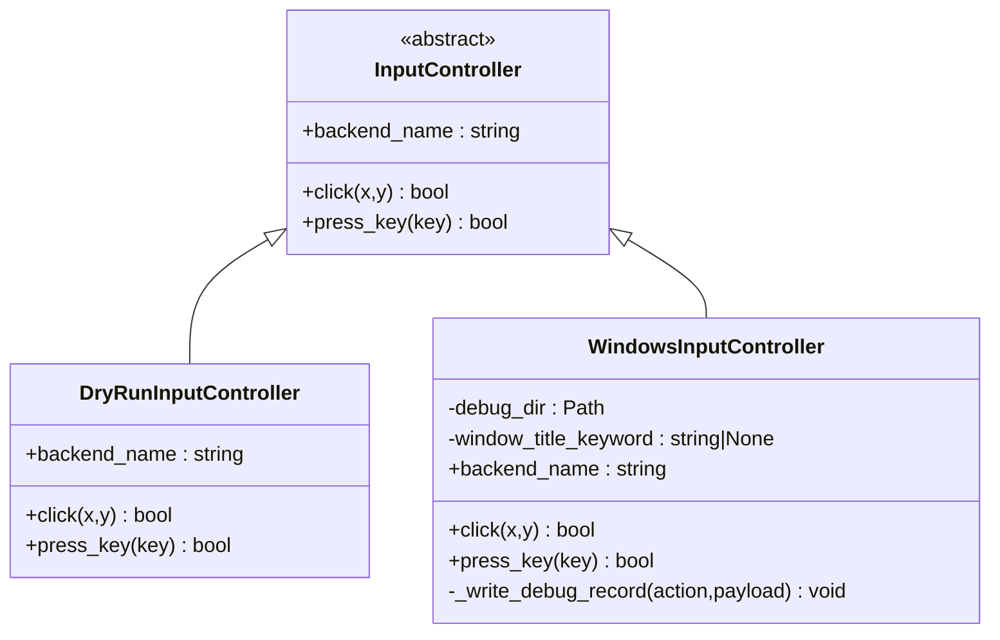
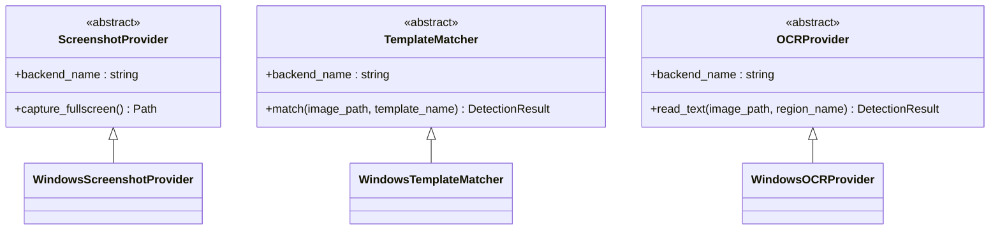
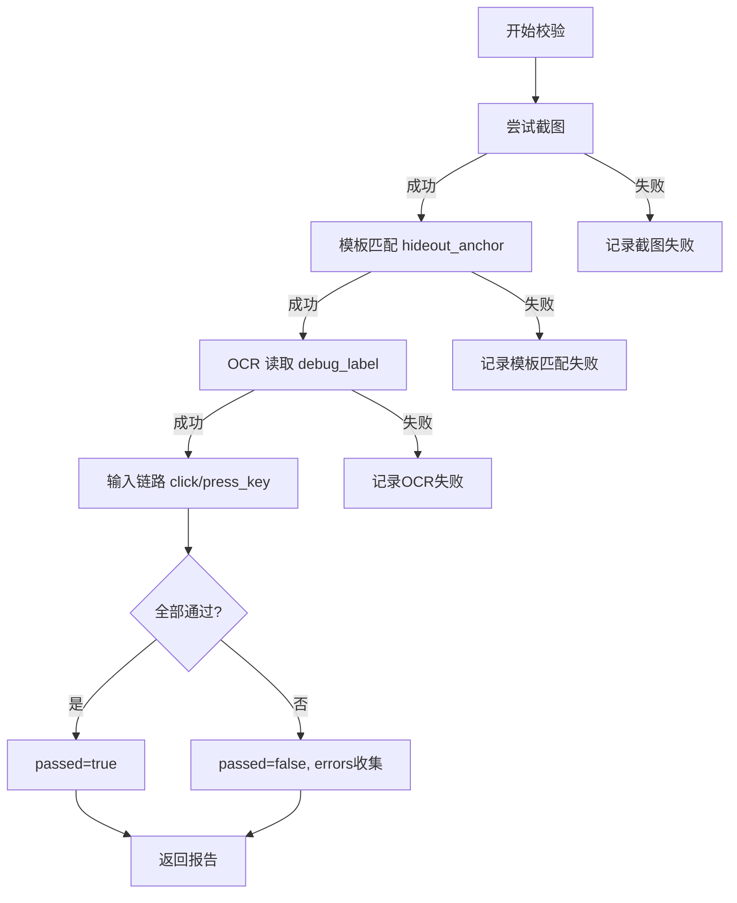
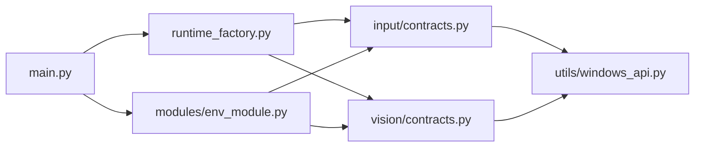

# 平台扩展指南

<cite>
**本文引用的文件**
- [src/core/runtime_factory.py](file://src/core/runtime_factory.py)
- [src/input/contracts.py](file://src/input/contracts.py)
- [src/vision/contracts.py](file://src/vision/contracts.py)
- [src/modules/env_module.py](file://src/modules/env_module.py)
- [src/utils/windows_api.py](file://src/utils/windows_api.py)
- [src/main.py](file://src/main.py)
- [config/app.config.json](file://config/app.config.json)
</cite>

## 目录
1. [简介](#简介)
2. [项目结构](#项目结构)
3. [核心组件](#核心组件)
4. [架构总览](#架构总览)
5. [详细组件分析](#详细组件分析)
6. [依赖关系分析](#依赖关系分析)
7. [性能考量](#性能考量)
8. [故障排查指南](#故障排查指南)
9. [结论](#结论)
10. [附录：扩展示例与测试策略](#附录：扩展示例与测试策略)

## 简介
本指南面向需要在当前系统中新增“平台适配器”的开发者，目标是帮助你以最小侵入的方式为新的操作系统或运行环境（例如 Linux、macOS）添加截图、模板匹配、OCR 和输入能力。文档围绕以下主题展开：
- 如何通过实现 InputController 接口并配套其他契约类，完成新平台适配
- RuntimeFactory 如何根据配置动态创建不同平台的适配器实例
- 平台检测机制与环境校验流程
- 完整扩展示例（以 Linux 为例）
- 平台特定配置要求（系统依赖、权限等）
- 测试策略与故障排查

## 项目结构
本项目采用“契约 + 多实现 + 工厂装配”的分层设计：
- 契约层定义跨平台统一接口：输入控制、截图、模板匹配、OCR
- 平台实现层提供具体平台的能力（如 Windows）
- 工厂层根据配置选择并组装运行时适配器
- 调度器在启动时执行平台能力验证，确保关键链路可用

图表来源
- [src/main.py:22-50](file://src/main.py#L22-L50)
- [src/core/runtime_factory.py:30-76](file://src/core/runtime_factory.py#L30-L76)
- [src/vision/contracts.py:25-251](file://src/vision/contracts.py#L25-L251)
- [src/input/contracts.py:10-65](file://src/input/contracts.py#L10-L65)
- [src/modules/env_module.py:23-88](file://src/modules/env_module.py#L23-L88)
- [config/app.config.json:1-22](file://config/app.config.json#L1-L22)

章节来源
- [src/main.py:22-50](file://src/main.py#L22-L50)
- [config/app.config.json:1-22](file://config/app.config.json#L1-L22)

## 核心组件
- InputController 及其实现：抽象鼠标点击、键盘按键的统一接口；当前包含 DryRun 与 Windows 两种实现
- ScreenshotProvider / TemplateMatcher / OCRProvider 及其实现：抽象截图、模板匹配、OCR 的统一接口；当前包含 DryRun 与 Windows 两种实现
- RuntimeAdapters：将上述三类能力打包为一个运行时对象
- PlatformValidator：在启动阶段对截图、模板匹配、OCR、输入进行能力验证，输出通过/失败与建议
- Scheduler：驱动脚本状态机，并在 CHECK_ENV 阶段调用 PlatformValidator

章节来源
- [src/input/contracts.py:10-65](file://src/input/contracts.py#L10-L65)
- [src/vision/contracts.py:25-251](file://src/vision/contracts.py#L25-L251)
- [src/core/runtime_factory.py:21-76](file://src/core/runtime_factory.py#L21-L76)
- [src/modules/env_module.py:23-88](file://src/modules/env_module.py#L23-L88)
- [src/core/scheduler.py:13-83](file://src/core/scheduler.py#L13-L83)

## 架构总览
下图展示了从启动到平台能力验证的关键调用链，以及运行时适配器如何被注入到验证与调度中。

图表来源
- [src/main.py:22-50](file://src/main.py#L22-L50)
- [src/core/runtime_factory.py:30-76](file://src/core/runtime_factory.py#L30-L76)
- [src/modules/env_module.py:38-88](file://src/modules/env_module.py#L38-L88)
- [src/utils/windows_api.py:121-196](file://src/utils/windows_api.py#L121-L196)
- [src/utils/windows_api.py:228-342](file://src/utils/windows_api.py#L228-L342)

## 详细组件分析

### 运行时工厂与平台切换
- 工厂读取配置中的 runtime_mode，当值为 windows 时，返回 Windows 系列适配器；否则返回 DryRun 适配器
- 所有平台相关的路径均通过 resolve_project_path 解析为绝对路径，避免相对路径在不同工作目录下出错
- next_step_suggestions 会随模式不同而给出下一步建议，便于开发调试

图表来源
- [src/core/runtime_factory.py:30-76](file://src/core/runtime_factory.py#L30-L76)

章节来源
- [src/core/runtime_factory.py:30-76](file://src/core/runtime_factory.py#L30-L76)
- [config/app.config.json:1-22](file://config/app.config.json#L1-L22)

### 输入控制器契约与实现
- InputController 定义了 backend_name、click、press_key 三个成员
- DryRunInputController 直接返回成功，用于无真实环境的联调
- WindowsInputController 基于 Windows API 查找目标窗口并发送点击/按键事件，同时记录调试日志

图表来源
- [src/input/contracts.py:10-65](file://src/input/contracts.py#L10-L65)

章节来源
- [src/input/contracts.py:10-65](file://src/input/contracts.py#L10-L65)
- [src/utils/windows_api.py:121-196](file://src/utils/windows_api.py#L121-L196)
- [src/utils/windows_api.py:315-377](file://src/utils/windows_api.py#L315-L377)

### 截图、模板匹配与OCR契约与实现
- ScreenshotProvider：抽象 capture_fullscreen
- TemplateMatcher：抽象 match(image_path, template_name) -> DetectionResult
- OCRProvider：抽象 read_text(image_path, region_name) -> DetectionResult
- Windows 实现分别封装了窗口截图、模板匹配（含ROI裁剪）、Tesseract OCR 预处理与识别

图表来源
- [src/vision/contracts.py:25-251](file://src/vision/contracts.py#L25-L251)

章节来源
- [src/vision/contracts.py:25-251](file://src/vision/contracts.py#L25-L251)

### 平台检测与能力校验
- PlatformValidator 在启动阶段依次尝试截图、模板匹配、OCR、输入，并依据阈值判断是否通过
- 任何链路异常都会被捕获并记录错误信息，最终汇总为 PlatformValidationReport
- Scheduler 在 CHECK_ENV 状态调用 validator.run，并根据结果推进状态机

图表来源
- [src/modules/env_module.py:38-88](file://src/modules/env_module.py#L38-L88)
- [src/core/scheduler.py:57-75](file://src/core/scheduler.py#L57-L75)

章节来源
- [src/modules/env_module.py:38-88](file://src/modules/env_module.py#L38-L88)
- [src/core/scheduler.py:57-75](file://src/core/scheduler.py#L57-L75)
- [config/app.config.json:16-21](file://config/app.config.json#L16-L21)

## 依赖关系分析
- main 仅负责加载配置、初始化日志、构建适配器与调度器，不感知平台细节
- runtime_factory 集中处理平台分支逻辑，屏蔽上层差异
- env_module 依赖各契约的具体实现，但不关心其内部平台细节
- windows_api 提供底层系统交互能力，被 Windows 适配器使用

图表来源
- [src/main.py:22-50](file://src/main.py#L22-L50)
- [src/core/runtime_factory.py:30-76](file://src/core/runtime_factory.py#L30-L76)
- [src/modules/env_module.py:23-88](file://src/modules/env_module.py#L23-L88)
- [src/utils/windows_api.py:121-377](file://src/utils/windows_api.py#L121-L377)

章节来源
- [src/main.py:22-50](file://src/main.py#L22-L50)
- [src/core/runtime_factory.py:30-76](file://src/core/runtime_factory.py#L30-L76)
- [src/modules/env_module.py:23-88](file://src/modules/env_module.py#L23-L88)
- [src/utils/windows_api.py:121-377](file://src/utils/windows_api.py#L121-L377)

## 性能考量
- ROI 裁剪：模板匹配前按 ROI 裁剪图像，减少全图匹配开销，提升速度并降低误匹配
- OCR 双路对比：灰度与二值化两条路径分别识别，取置信度更高者，提高鲁棒性
- 截图区域：优先截取窗口客户区，避免边框/标题栏干扰后续 ROI 与模板匹配
- 调试输出：将中间产物写入 debug 目录，便于定位性能瓶颈与识别问题

[本节为通用指导，无需引用具体文件]

## 故障排查指南
- 未找到目标窗口：检查 window_title_keyword 是否正确，确认游戏窗口可见且标题包含关键词
- 截图为空或黑屏：确认窗口客户区尺寸有效，检查 DPI/缩放设置，必要时调整分辨率与窗口模式
- 模板匹配失败：核对模板文件与 ROI 配置是否与当前分辨率一致，关注 ROI 越界时的错误提示
- OCR 识别率低：调整语言包与 PSM 参数，检查预处理图像质量，必要时增加样本训练或更换区域
- 输入无效：确认目标窗口已激活，坐标为客户区相对坐标；检查虚拟键映射是否支持
- 校验失败：查看 PlatformValidationReport 中的 errors 列表与 next_step_suggestions，逐项修复

章节来源
- [src/utils/windows_api.py:121-196](file://src/utils/windows_api.py#L121-L196)
- [src/vision/contracts.py:119-185](file://src/vision/contracts.py#L119-L185)
- [src/vision/contracts.py:188-251](file://src/vision/contracts.py#L188-L251)
- [src/modules/env_module.py:38-88](file://src/modules/env_module.py#L38-L88)

## 结论
本项目通过契约抽象与工厂装配实现了平台解耦。新增平台的核心在于：
- 实现输入、截图、模板匹配、OCR 的契约类
- 在工厂中按配置分支创建新平台适配器
- 通过 PlatformValidator 验证新平台能力
遵循此路径可快速、安全地扩展至 Linux/macOS 等平台。

[本节为总结，无需引用具体文件]

## 附录：扩展示例与测试策略

### 新增平台适配步骤（以 Linux 为例）
1. 新建 Linux 输入控制器
   - 实现 InputController 接口，提供 backend_name、click、press_key
   - 使用 Linux 平台输入库（如 XTest 或等效方案）模拟鼠标与键盘事件
   - 参考 Windows 实现的日志记录方式，输出调试信息以便定位问题

2. 新建 Linux 截图提供者
   - 实现 ScreenshotProvider.capture_fullscreen，截取目标窗口客户区并保存为位图
   - 注意 DPI、缩放与窗口层级，保证截图稳定

3. 新建 Linux 模板匹配器
   - 实现 TemplateMatcher.match，复用现有模板与 ROI 配置
   - 若需要，可在 Linux 上集成 OpenCV 或其他图像库进行匹配

4. 新建 Linux OCR 提供者
   - 实现 OCRProvider.read_text，调用 Tesseract 或等效引擎
   - 保持与 Windows 实现一致的预处理与调试输出格式

5. 在工厂中添加分支
   - 在 build_runtime_adapters 中增加 platform 分支（例如 linux），返回 Linux 系列适配器
   - 保持与 Windows/DryRun 相同的返回值结构与 next_step_suggestions

6. 更新配置
   - 在 app.config.json 中新增或修改 runtime_mode（例如 "linux"）
   - 根据需要调整 OCR 语言、PSM、命令路径等参数

7. 运行与验证
   - 启动后进入 CHECK_ENV，观察 PlatformValidationReport 的结果
   - 逐步修复失败的链路，直至全部通过

章节来源
- [src/input/contracts.py:10-65](file://src/input/contracts.py#L10-L65)
- [src/vision/contracts.py:25-251](file://src/vision/contracts.py#L25-L251)
- [src/core/runtime_factory.py:30-76](file://src/core/runtime_factory.py#L30-L76)
- [config/app.config.json:1-22](file://config/app.config.json#L1-L22)

### 平台特定的配置要求
- 系统依赖
  - Linux：安装并配置截图工具（如 xdotool/Xephyr）、输入模拟库（XTest）、OCR 引擎（Tesseract）
  - macOS：安装并配置屏幕捕获（CGDisplay/Screencapture）、输入模拟（AXAPI/Quartz）、OCR 引擎（Tesseract）
- 权限设置
  - Linux：可能需要 root 或特定用户组权限以捕获全屏或注入输入事件
  - macOS：需在“辅助功能”中授予脚本访问权限，允许模拟输入与屏幕捕获
- 窗口与分辨率
  - 固定分辨率与窗口模式，避免 DPI/缩放导致的坐标偏移
  - 确保目标窗口可见且可获取客户区尺寸

[本节为通用指导，无需引用具体文件]

### 测试策略
- 单元测试
  - 针对每个契约方法编写用例，覆盖正常路径与异常路径（如窗口不存在、ROI 越界、OCR 超时）
  - 使用 Mock 替代底层系统调用，确保测试可重复
- 集成测试
  - 在真实环境中运行 PlatformValidator，验证截图、模板匹配、OCR、输入链路
  - 使用固定场景（如隐藏处锚点）作为基准，评估成功率与稳定性
- 回归测试
  - 每次新增平台或修改实现后，重新跑通 CHECK_ENV 与关键业务场景
  - 记录指标：截图成功率、模板匹配成功率、OCR 识别率、输入成功率

[本节为通用指导，无需引用具体文件]

### 常见问题与解决思路
- 无法定位窗口
  - 检查窗口标题关键词与可见性，必要时改为前台窗口兜底
- 截图错位或黑屏
  - 检查 DPI/缩放、窗口类型（无边框/全屏）、渲染后端
- 模板匹配不稳定
  - 调整阈值、缩小搜索区域、优化模板采集质量
- OCR 识别差
  - 调整预处理、语言包、PSM；必要时裁剪更稳定的文本区域
- 输入无效
  - 确认窗口激活、坐标转换正确、虚拟键映射合法

章节来源
- [src/utils/windows_api.py:121-196](file://src/utils/windows_api.py#L121-L196)
- [src/vision/contracts.py:119-185](file://src/vision/contracts.py#L119-L185)
- [src/vision/contracts.py:188-251](file://src/vision/contracts.py#L188-L251)
- [src/modules/env_module.py:38-88](file://src/modules/env_module.py#L38-L88)