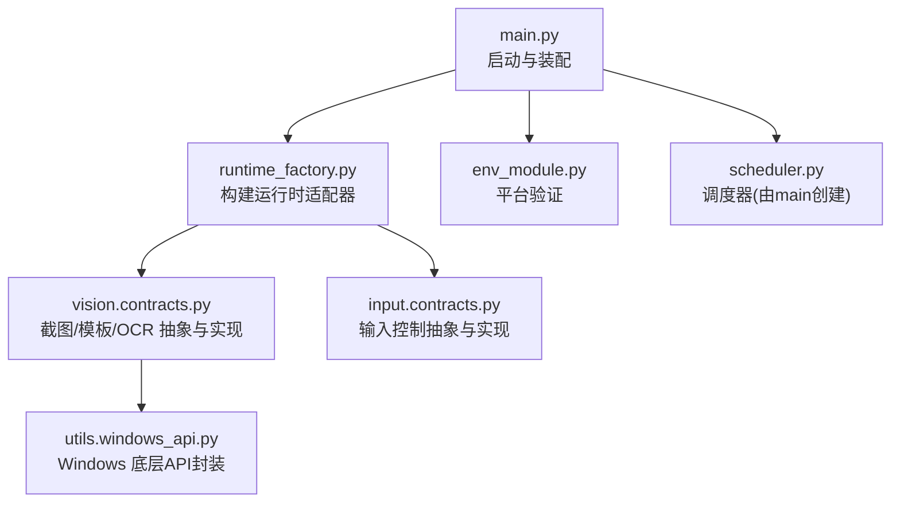
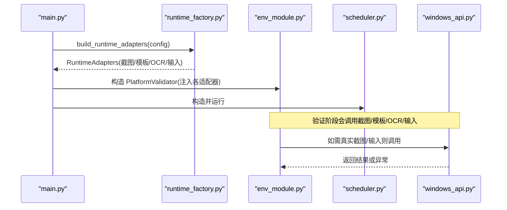
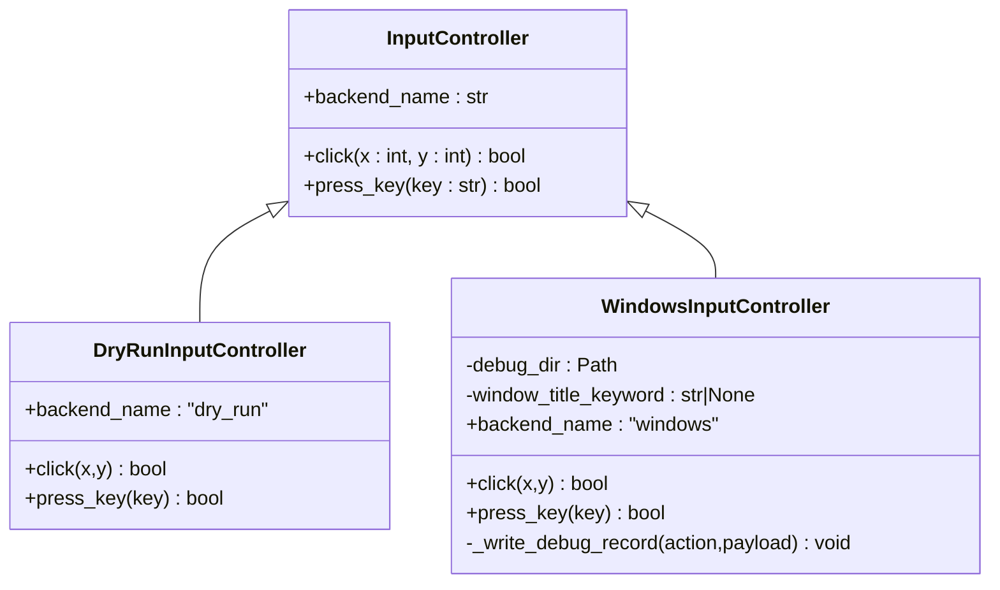
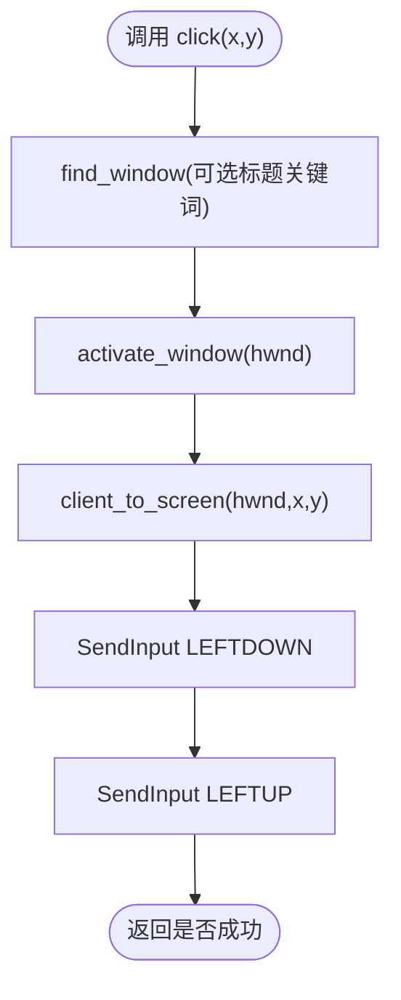
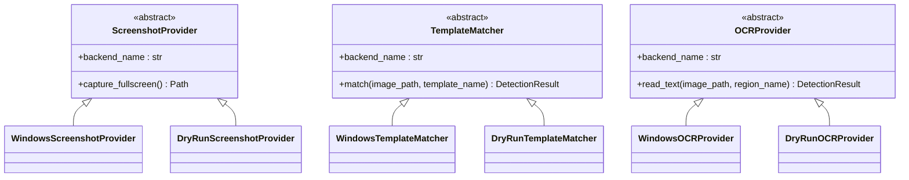
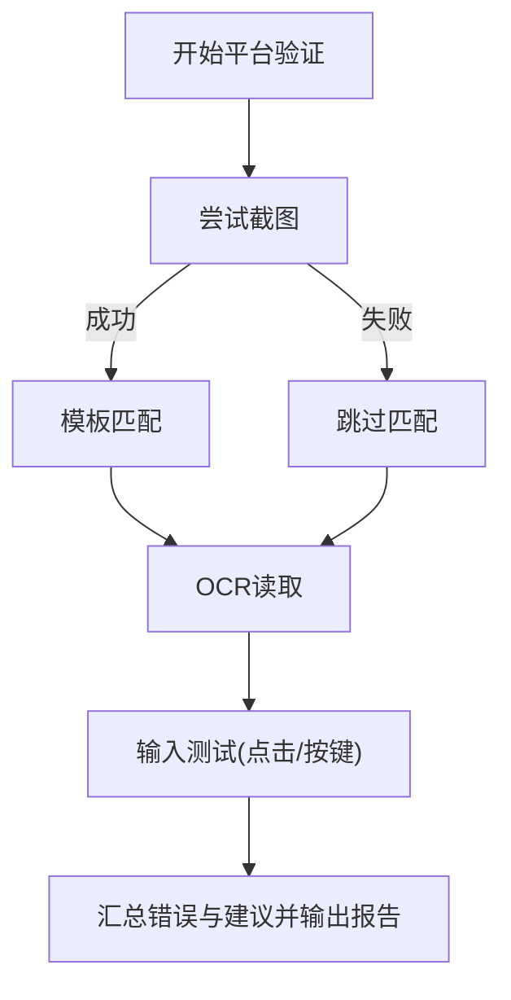
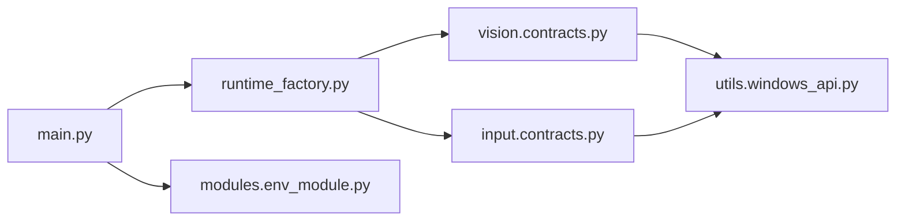

# 平台适配层

<cite>
**本文引用的文件**
- [src/main.py](file://src/main.py)
- [src/core/runtime_factory.py](file://src/core/runtime_factory.py)
- [src/input/contracts.py](file://src/input/contracts.py)
- [src/utils/windows_api.py](file://src/utils/windows_api.py)
- [src/vision/contracts.py](file://src/vision/contracts.py)
- [src/modules/env_module.py](file://src/modules/env_module.py)
- [config/app.config.json](file://config/app.config.json)
- [README.md](file://README.md)
- [technical.plan.md](file://technical.plan.md)
</cite>

## 目录
1. [简介](#简介)
2. [项目结构](#项目结构)
3. [核心组件](#核心组件)
4. [架构总览](#架构总览)
5. [详细组件分析](#详细组件分析)
6. [依赖关系分析](#依赖关系分析)
7. [性能考虑](#性能考虑)
8. [故障排查指南](#故障排查指南)
9. [结论](#结论)
10. [附录：平台扩展指南与使用示例](#附录：平台扩展指南与使用示例)

## 简介
本技术文档聚焦“平台适配层”的设计与实现，围绕适配器模式展开，解释如何通过抽象接口屏蔽底层平台差异，使上层业务（调度、状态机、策略）保持平台无关。当前仓库已提供 Windows 平台的完整适配能力（窗口操作、屏幕捕获、鼠标键盘输入模拟），并提供了 DryRun 开发模式以在无真实游戏环境的情况下进行端到端测试与调试。同时，输入控制抽象接口统一了点击、按键等动作，便于后续扩展更多平台或更丰富的交互行为。

## 项目结构
- 入口与装配
  - 主程序负责加载配置、初始化日志、构建运行时适配器、组装校验器与调度器，并启动运行。
- 运行时适配器工厂
  - 根据配置中的运行模式选择 DryRun 或 Windows 具体实现，集中管理截图、模板匹配、OCR、输入控制器等后端。
- 输入抽象与实现
  - 定义统一的输入控制接口；提供 DryRun 和 Windows 两种实现，Windows 实现通过 ctypes 调用系统 API 完成点击与按键。
- 视觉识别抽象与实现
  - 定义截图提供者、模板匹配器、OCR 提供者的统一接口；提供 DryRun 与 Windows 实现，Windows 实现基于 GDI 截取窗口客户区、模板匹配与 Tesseract OCR。
- 平台验证模块
  - 对截图、模板匹配、OCR、输入链路进行快速自检，输出报告与下一步建议。
- 配置
  - 通过 JSON 配置运行模式、窗口标题关键词、OCR 参数、模板与 ROI 路径等。

图表来源
- [src/main.py:22-50](file://src/main.py#L22-L50)
- [src/core/runtime_factory.py:30-77](file://src/core/runtime_factory.py#L30-L77)
- [src/vision/contracts.py:25-117](file://src/vision/contracts.py#L25-L117)
- [src/input/contracts.py:10-65](file://src/input/contracts.py#L10-L65)
- [src/utils/windows_api.py:121-377](file://src/utils/windows_api.py#L121-L377)

章节来源
- [src/main.py:22-50](file://src/main.py#L22-L50)
- [src/core/runtime_factory.py:30-77](file://src/core/runtime_factory.py#L30-L77)
- [config/app.config.json:1-23](file://config/app.config.json#L1-L23)

## 核心组件
- 运行时适配器（RuntimeAdapters）
  - 聚合截图提供者、模板匹配器、OCR 提供者、输入控制器以及下一步建议，作为上层调用的统一视图。
- 输入控制抽象（InputController）
  - 定义 backend_name、click(x, y)、press_key(key) 的统一接口；DryRun 返回成功但不执行真实操作；Windows 通过系统 API 执行。
- 视觉抽象（ScreenshotProvider / TemplateMatcher / OCRProvider）
  - 统一 capture_fullscreen()、match(image_path, template_name)、read_text(image_path, region_name) 的接口；DryRun 返回占位结果；Windows 实现真实截图、模板匹配与 OCR。
- Windows 底层 API 封装（windows_api）
  - 封装窗口枚举与查找、客户区坐标转换、窗口截图、鼠标点击、键盘按键、虚拟键码解析等。
- 平台验证（PlatformValidator）
  - 串联截图、模板匹配、OCR、输入链路，输出是否通过及错误信息、下一步建议。

章节来源
- [src/core/runtime_factory.py:21-77](file://src/core/runtime_factory.py#L21-L77)
- [src/input/contracts.py:10-65](file://src/input/contracts.py#L10-L65)
- [src/vision/contracts.py:25-251](file://src/vision/contracts.py#L25-L251)
- [src/utils/windows_api.py:121-377](file://src/utils/windows_api.py#L121-L377)
- [src/modules/env_module.py:23-88](file://src/modules/env_module.py#L23-L88)

## 架构总览
整体采用分层与适配器模式结合：
- 上层（调度、状态机、策略）仅依赖抽象接口，不感知平台细节。
- 中间层（运行时工厂）根据配置注入具体平台实现。
- 下层（Windows API 封装）处理操作系统级交互。

图表来源
- [src/main.py:22-50](file://src/main.py#L22-L50)
- [src/core/runtime_factory.py:30-77](file://src/core/runtime_factory.py#L30-L77)
- [src/modules/env_module.py:38-88](file://src/modules/env_module.py#L38-L88)
- [src/utils/windows_api.py:121-377](file://src/utils/windows_api.py#L121-L377)

## 详细组件分析

### 输入控制抽象与实现
- 抽象接口
  - InputController 定义了 backend_name、click(x, y)、press_key(key)。
- DryRun 实现
  - 直接返回 True，用于无真实环境的流程联调。
- Windows 实现
  - 通过 find_window 定位目标窗口，send_left_click/send_key_press 发送输入，并记录调试日志到 debug_dir。

图表来源
- [src/input/contracts.py:10-65](file://src/input/contracts.py#L10-L65)

章节来源
- [src/input/contracts.py:10-65](file://src/input/contracts.py#L10-L65)

### Windows 平台适配：窗口、截图、输入
- 窗口查找与坐标转换
  - find_window 枚举可见窗口，按标题关键词匹配或回退到前台窗口；get_client_rect_on_screen 获取客户区尺寸；client_to_screen 将客户端坐标转为屏幕坐标。
- 窗口截图
  - capture_window_client_area 使用 GDI 截取窗口客户区为 BMP，避免边框干扰后续 ROI 与模板匹配。
- 输入模拟
  - send_left_click 移动光标并发送按下/抬起事件；send_key_press 解析虚拟键码并发送按键事件；resolve_virtual_key 支持常用键与 F1-F24。

图表来源
- [src/utils/windows_api.py:216-328](file://src/utils/windows_api.py#L216-L328)
- [src/input/contracts.py:37-65](file://src/input/contracts.py#L37-L65)

章节来源
- [src/utils/windows_api.py:121-377](file://src/utils/windows_api.py#L121-L377)
- [src/input/contracts.py:37-65](file://src/input/contracts.py#L37-L65)

### 视觉识别抽象与实现（截图/模板/OCR）
- 抽象接口
  - ScreenshotProvider.capture_fullscreen()
  - TemplateMatcher.match(image_path, template_name) -> DetectionResult
  - OCRProvider.read_text(image_path, region_name) -> DetectionResult
- DryRun 实现
  - 生成占位截图文本、固定高置信度匹配结果、固定 OCR 文本，便于流程走通。
- Windows 实现
  - WindowsScreenshotProvider 调用 windows_api 截取窗口客户区。
  - WindowsTemplateMatcher 加载模板与图像，支持 ROI 裁剪以提升匹配效率与稳定性，返回带置信度与边界框的结果。
  - WindowsOCRProvider 使用预处理与 Tesseract 后端，保留灰度/二值化图与命令参数，择优返回最佳识别结果。

图表来源
- [src/vision/contracts.py:25-251](file://src/vision/contracts.py#L25-L251)

章节来源
- [src/vision/contracts.py:25-251](file://src/vision/contracts.py#L25-L251)

### DryRun 开发模式的原理与作用
- 原理
  - 在 runtime_factory 中根据配置选择 DryRun 实现，所有平台相关调用均被替换为“空操作+固定返回值”，从而在不连接真实游戏窗口的情况下完成端到端流程演练。
- 作用
  - 快速验证调度、状态机、策略与数据流是否正确；降低开发与调试成本；便于回归测试与回放。
- 切换方式
  - 修改 app.config.json 中的 runtime_mode 为 dry_run 或 windows。

章节来源
- [src/core/runtime_factory.py:30-77](file://src/core/runtime_factory.py#L30-L77)
- [config/app.config.json:1-23](file://config/app.config.json#L1-L23)
- [src/vision/contracts.py:58-99](file://src/vision/contracts.py#L58-L99)
- [src/input/contracts.py:25-35](file://src/input/contracts.py#L25-L35)

### 平台验证与错误处理
- 平台验证
  - PlatformValidator 依次尝试截图、模板匹配、OCR、输入，收集错误与建议，最终给出是否通过的报告。
- 错误处理策略
  - 截图失败：记录错误，跳过后续识别步骤。
  - 模板/OCR 失败：记录错误，不影响输入链路验证。
  - 输入失败：记录错误，标记 input_ok 为 False。
  - 若存在错误，建议在继续业务前修复对应链路。

图表来源
- [src/modules/env_module.py:38-88](file://src/modules/env_module.py#L38-L88)

章节来源
- [src/modules/env_module.py:23-88](file://src/modules/env_module.py#L23-L88)

## 依赖关系分析
- main.py 依赖运行时工厂、平台验证、调度器与日志。
- runtime_factory 依赖输入与视觉抽象的具体实现，并根据配置注入。
- vision 与 input 的具体实现依赖 windows_api 提供的底层能力。
- env_module 依赖上述抽象与实现进行链路验证。

图表来源
- [src/main.py:22-50](file://src/main.py#L22-L50)
- [src/core/runtime_factory.py:30-77](file://src/core/runtime_factory.py#L30-L77)
- [src/vision/contracts.py:25-251](file://src/vision/contracts.py#L25-L251)
- [src/input/contracts.py:10-65](file://src/input/contracts.py#L10-L65)
- [src/utils/windows_api.py:121-377](file://src/utils/windows_api.py#L121-L377)
- [src/modules/env_module.py:23-88](file://src/modules/env_module.py#L23-L88)

章节来源
- [src/main.py:22-50](file://src/main.py#L22-L50)
- [src/core/runtime_factory.py:30-77](file://src/core/runtime_factory.py#L30-L77)

## 性能考虑
- 截图
  - 使用 GDI BitBlt + GetDIBits 截取窗口客户区，避免 UI 边框影响；注意释放 DC 与对象，防止资源泄漏。
- 模板匹配
  - 通过 ROI 裁剪减少搜索区域，提升匹配速度；阈值过滤低置信度结果。
- OCR
  - 预处理生成灰度/二值化图，分别识别后择优；保留命令与图像路径便于回溯。
- 输入
  - 批量发送输入事件（按下/抬起）减少系统调用次数；必要时激活窗口确保焦点。

[本节为通用性能讨论，不直接分析具体代码行]

## 故障排查指南
- 无法找到目标窗口
  - 检查 window_title_keyword 是否与游戏窗口标题匹配；确认窗口可见且非最小化。
- 截图黑屏或错位
  - 确认分辨率、缩放、窗口模式固定；优先截取客户区而非全屏；检查 DPI 与多显示器场景。
- 模板匹配失败
  - 检查模板采集质量、ROI 标定是否越界；适当调整阈值；确认截图坐标系一致。
- OCR 识别率低
  - 调整语言、PSM；检查预处理图像质量；保留原始与处理后图像以便分析。
- 输入无效
  - 确认窗口已激活；坐标是否为客户区相对坐标；按键映射是否正确；查看调试日志文件。

章节来源
- [src/utils/windows_api.py:121-377](file://src/utils/windows_api.py#L121-L377)
- [src/vision/contracts.py:119-186](file://src/vision/contracts.py#L119-L186)
- [src/modules/env_module.py:38-88](file://src/modules/env_module.py#L38-L88)

## 结论
本项目通过适配器模式将平台差异隔离在抽象接口之下，上层调度与策略无需关心具体平台实现。当前已具备 Windows 平台的完整适配能力（窗口、截图、输入、模板匹配、OCR），并提供 DryRun 模式用于无真实环境的开发与调试。配合平台验证模块，可在进入业务逻辑前快速发现并修复基础链路问题。

[本节为总结性内容，不直接分析具体代码行]

## 附录：平台扩展指南与使用示例

### 如何添加新平台支持
- 新增输入控制器
  - 继承 InputController，实现 backend_name、click、press_key；在 runtime_factory 中增加分支注入新实现。
- 新增视觉后端
  - 实现 ScreenshotProvider、TemplateMatcher、OCRProvider 的新子类；在 runtime_factory 中按配置选择。
- 配置驱动
  - 在 app.config.json 中添加新的 runtime_mode 选项，并在工厂中解析与装配。
- 验证与回归
  - 使用 PlatformValidator 对新平台进行链路验证；保存截图与日志，建立回归基线。

章节来源
- [src/input/contracts.py:10-65](file://src/input/contracts.py#L10-L65)
- [src/vision/contracts.py:25-251](file://src/vision/contracts.py#L25-L251)
- [src/core/runtime_factory.py:30-77](file://src/core/runtime_factory.py#L30-L77)
- [config/app.config.json:1-23](file://config/app.config.json#L1-L23)

### 使用示例（DryRun 与 Windows）
- DryRun 模式
  - 设置 runtime_mode 为 dry_run；运行后可验证调度与状态机流程，不会触发真实输入与截图。
- Windows 模式
  - 设置 runtime_mode 为 windows；配置 window_title_keyword、OCR 参数、模板与 ROI 路径；运行后进行真实截图、识别与输入。

章节来源
- [config/app.config.json:1-23](file://config/app.config.json#L1-L23)
- [src/core/runtime_factory.py:30-77](file://src/core/runtime_factory.py#L30-L77)

### 错误处理策略（推荐）
- 截图失败：记录错误并跳过后续识别，提示先修复截图链路。
- 模板/OCR 失败：记录错误与上下文（模板路径、ROI、命令参数），不中断输入链路验证。
- 输入失败：记录错误并停止危险动作，进入人工接管或安全停机。
- 未知状态：优先停机，避免误操作。

章节来源
- [src/modules/env_module.py:38-88](file://src/modules/env_module.py#L38-L88)
- [README.md:192-227](file://README.md#L192-L227)
- [technical.plan.md:461-503](file://technical.plan.md#L461-L503)