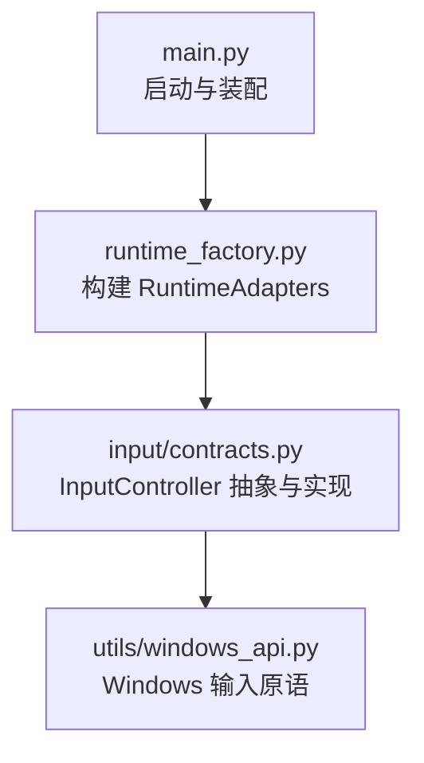
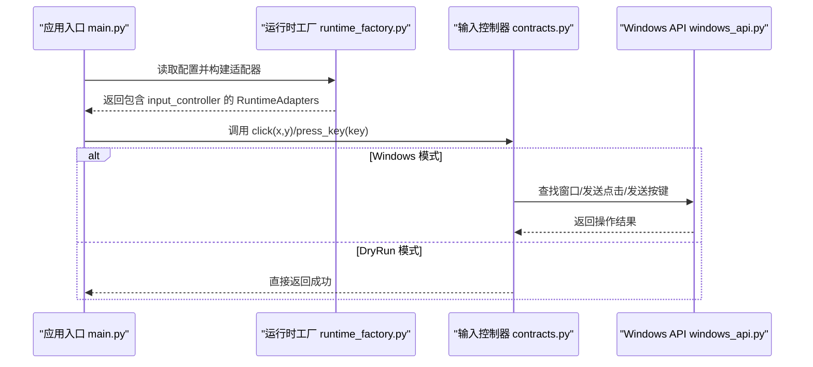
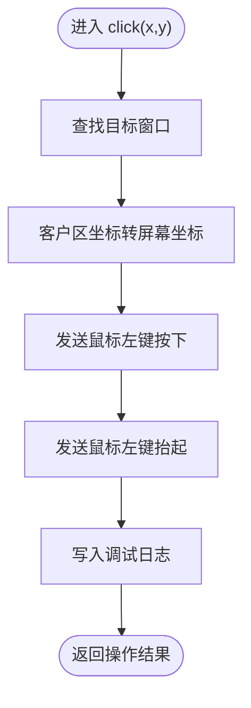
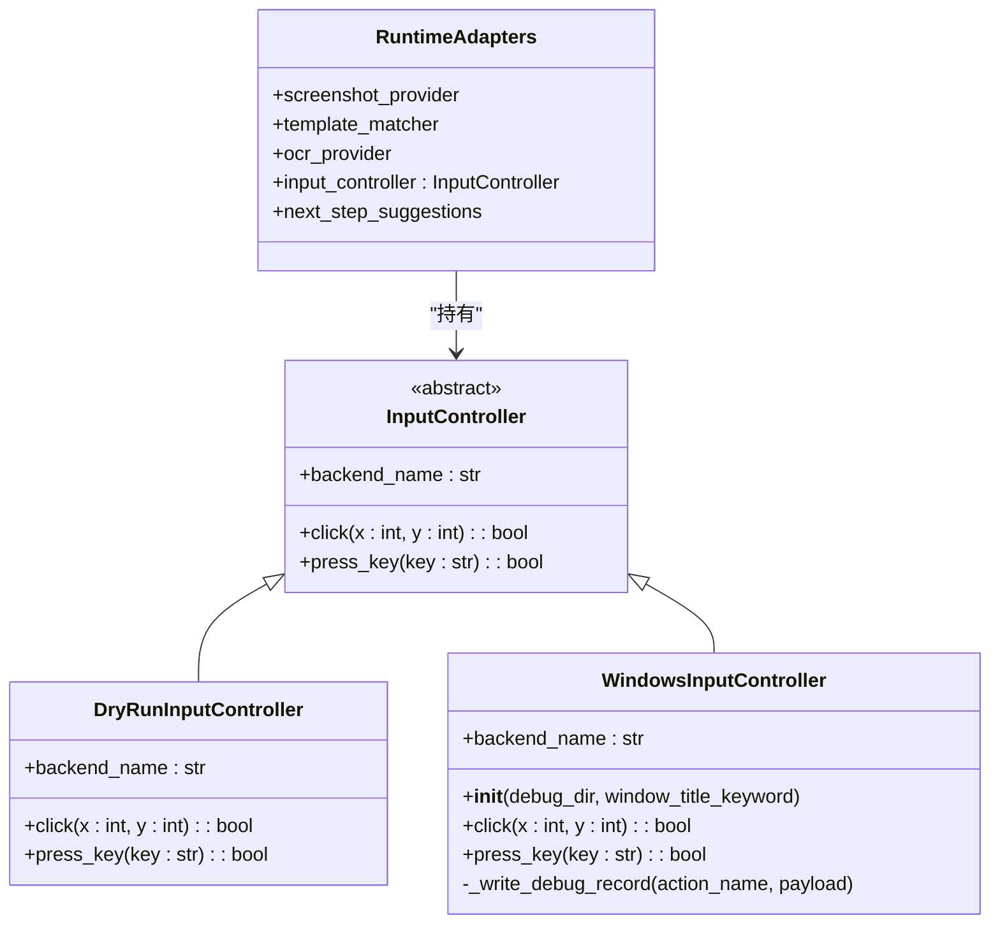
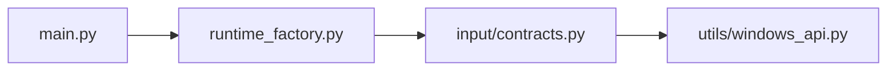

# 输入控制接口

<cite>
**本文引用的文件**
- [src/input/contracts.py](file://src/input/contracts.py)
- [src/core/runtime_factory.py](file://src/core/runtime_factory.py)
- [src/utils/windows_api.py](file://src/utils/windows_api.py)
- [src/main.py](file://src/main.py)
</cite>

## 目录
1. [简介](#简介)
2. [项目结构](#项目结构)
3. [核心组件](#核心组件)
4. [架构总览](#架构总览)
5. [详细组件分析](#详细组件分析)
6. [依赖关系分析](#依赖关系分析)
7. [性能与可靠性](#性能与可靠性)
8. [故障排查指南](#故障排查指南)
9. [结论](#结论)
10. [附录：使用示例与扩展指南](#附录使用示例与扩展指南)

## 简介
本技术文档围绕“输入控制接口”展开，重点解释 InputController 抽象基类的设计原则、平台无关性实现方式、扩展机制以及工厂模式在其中的作用。通过该抽象层，上层业务（如调度器、校验模块）可以以统一 API 调用不同平台的输入后端（例如 Windows 真实输入与 DryRun 模拟输入），从而在不修改业务代码的前提下切换或新增平台支持。

## 项目结构
输入控制相关代码主要位于以下位置：
- 抽象接口与具体实现：src/input/contracts.py
- 运行时装配（工厂）：src/core/runtime_factory.py
- Windows 底层输入能力：src/utils/windows_api.py
- 应用入口与装配注入：src/main.py

图表来源
- [src/main.py:22-50](file://src/main.py#L22-L50)
- [src/core/runtime_factory.py:30-76](file://src/core/runtime_factory.py#L30-L76)
- [src/input/contracts.py:10-64](file://src/input/contracts.py#L10-L64)
- [src/utils/windows_api.py:121-376](file://src/utils/windows_api.py#L121-L376)

章节来源
- [src/main.py:22-50](file://src/main.py#L22-L50)
- [src/core/runtime_factory.py:30-76](file://src/core/runtime_factory.py#L30-L76)
- [src/input/contracts.py:10-64](file://src/input/contracts.py#L10-L64)
- [src/utils/windows_api.py:121-376](file://src/utils/windows_api.py#L121-L376)

## 核心组件
- InputController 抽象基类
  - backend_name：返回当前后端的标识名称，便于日志、诊断与配置选择。
  - click(x, y)：在目标窗口客户区坐标 (x, y) 执行左键点击，返回操作是否成功。
  - press_key(key)：向目标窗口发送一次按键事件，返回操作是否成功。
- DryRunInputController：DryRun 模式下的占位实现，所有方法直接返回成功，用于开发调试与流程验证。
- WindowsInputController：Windows 平台的具体实现，基于 Windows API 完成窗口查找、坐标转换与输入事件注入，并输出调试日志。

章节来源
- [src/input/contracts.py:10-64](file://src/input/contracts.py#L10-L64)

## 架构总览
下图展示了从应用启动到输入执行的完整链路，体现“抽象接口 + 工厂装配 + 平台实现”的解耦设计。

图表来源
- [src/main.py:22-50](file://src/main.py#L22-L50)
- [src/core/runtime_factory.py:30-76](file://src/core/runtime_factory.py#L30-L76)
- [src/input/contracts.py:10-64](file://src/input/contracts.py#L10-L64)
- [src/utils/windows_api.py:121-376](file://src/utils/windows_api.py#L121-L376)

## 详细组件分析

### InputController 抽象基类
- 设计要点
  - 通过抽象属性 backend_name 暴露后端标识，便于日志记录、监控与配置路由。
  - 通过 click 与 press_key 两个最小化但完备的方法定义输入控制的通用契约，屏蔽平台差异。
  - 返回值采用布尔类型，明确表达操作成功与否，便于上层进行错误处理与重试策略。
- 平台无关性
  - 上层仅依赖 InputController 接口，不感知具体平台细节；新增平台只需实现该接口并通过工厂装配即可。
- 可扩展性
  - 新增平台时，仅需继承 InputController 并实现三个成员；无需改动现有调用方代码。

章节来源
- [src/input/contracts.py:10-23](file://src/input/contracts.py#L10-L23)

### DryRunInputController
- 用途
  - 在 DryRun 模式下提供无副作用的输入行为，便于端到端流程验证与测试。
- 行为特征
  - 所有输入方法均返回成功，不实际操作系统。
  - 适合单元测试、集成测试与快速迭代。

章节来源
- [src/input/contracts.py:25-34](file://src/input/contracts.py#L25-L34)

### WindowsInputController
- 职责
  - 根据可选的窗口标题关键词定位目标窗口。
  - 将客户区坐标转换为屏幕坐标并执行鼠标点击。
  - 将按键字符串解析为虚拟键码并发送键盘事件。
  - 将每次输入动作写入调试日志文件，便于问题定位。
- 关键流程
  - 点击流程：查找窗口 -> 坐标转换 -> 发送鼠标按下/抬起 -> 写日志 -> 返回结果。
  - 按键流程：查找窗口 -> 解析键码 -> 发送按键按下/抬起 -> 写日志 -> 返回结果。

图表来源
- [src/input/contracts.py:47-52](file://src/input/contracts.py#L47-L52)
- [src/utils/windows_api.py:315-328](file://src/utils/windows_api.py#L315-L328)

章节来源
- [src/input/contracts.py:37-64](file://src/input/contracts.py#L37-L64)
- [src/utils/windows_api.py:121-376](file://src/utils/windows_api.py#L121-L376)

### 运行时工厂与依赖注入
- 工厂职责
  - 根据配置中的运行模式（dry_run 或 windows）创建对应的输入控制器实例。
  - 将输入控制器与其他适配组件（截图、模板匹配、OCR）一起封装为 RuntimeAdapters，供上层统一消费。
- 依赖注入
  - main 中通过工厂获取 adapters.input_controller，并注入到 PlatformValidator 等组件，避免硬编码具体实现。
  - 这种模式使“调用方”与“实现方”完全解耦，提升可测试性与可维护性。

图表来源
- [src/input/contracts.py:10-64](file://src/input/contracts.py#L10-L64)
- [src/core/runtime_factory.py:21-27](file://src/core/runtime_factory.py#L21-L27)

章节来源
- [src/core/runtime_factory.py:30-76](file://src/core/runtime_factory.py#L30-L76)
- [src/main.py:22-50](file://src/main.py#L22-L50)

## 依赖关系分析
- 耦合度
  - 上层模块仅依赖 InputController 抽象，不依赖具体平台实现，降低耦合。
  - WindowsInputController 依赖 Windows API 工具函数，封装了系统级细节。
- 内聚性
  - 每个组件职责清晰：抽象定义契约、工厂负责装配、平台实现专注底层交互。
- 外部依赖
  - Windows 平台下依赖 user32/gdi32 等系统库进行窗口枚举、坐标转换与输入注入。

图表来源
- [src/main.py:22-50](file://src/main.py#L22-L50)
- [src/core/runtime_factory.py:30-76](file://src/core/runtime_factory.py#L30-L76)
- [src/input/contracts.py:10-64](file://src/input/contracts.py#L10-L64)
- [src/utils/windows_api.py:121-376](file://src/utils/windows_api.py#L121-L376)

章节来源
- [src/main.py:22-50](file://src/main.py#L22-L50)
- [src/core/runtime_factory.py:30-76](file://src/core/runtime_factory.py#L30-L76)
- [src/input/contracts.py:10-64](file://src/input/contracts.py#L10-L64)
- [src/utils/windows_api.py:121-376](file://src/utils/windows_api.py#L121-L376)

## 性能与可靠性
- 性能
  - Windows 输入通过 SendInput 批量提交事件，减少系统调用次数，提高吞吐。
  - 坐标转换与窗口查找仅在必要时执行，避免重复开销。
- 可靠性
  - 所有输入操作返回布尔值，便于上层判断失败并进行重试或降级。
  - 调试日志记录每次输入的关键信息（窗口标题、坐标/按键、结果），有助于问题定位。
- 建议优化
  - 对频繁点击场景可增加节流或随机偏移，降低被反作弊检测的风险。
  - 对窗口查找失败增加重试与超时策略，提升鲁棒性。

[本节为通用指导，不直接分析具体文件]

## 故障排查指南
- 常见问题
  - 未找到目标窗口：检查窗口标题关键词是否正确，确保目标窗口可见且尺寸有效。
  - 坐标无效：确认传入的是客户区相对坐标，并确保目标窗口已激活。
  - 按键不支持：确认按键字符串格式，常见键名需大写，单字符键需合法。
- 定位手段
  - 查看调试日志文件，确认输入动作序列与结果。
  - 检查 Windows API 的错误码与异常信息，辅助定位系统调用失败原因。

章节来源
- [src/input/contracts.py:60-64](file://src/input/contracts.py#L60-L64)
- [src/utils/windows_api.py:121-196](file://src/utils/windows_api.py#L121-L196)
- [src/utils/windows_api.py:315-376](file://src/utils/windows_api.py#L315-L376)

## 结论
InputController 抽象层通过最小化的接口定义实现了平台无关的输入控制能力，结合运行时工厂与依赖注入，使得新增平台或替换实现变得简单且安全。WindowsInputController 提供了完整的 Windows 平台实现，并具备调试日志能力；DryRunInputController 则用于开发与测试阶段的无副作用验证。整体设计遵循高内聚、低耦合原则，具备良好的可扩展性与可维护性。

[本节为总结性内容，不直接分析具体文件]

## 附录：使用示例与扩展指南

### 通过依赖注入使用不同的输入控制器
- 在 DryRun 模式
  - 工厂会返回 DryRunInputController，所有输入操作直接返回成功，适合流程验证。
- 在 Windows 模式
  - 工厂会返回 WindowsInputController，并根据配置查找目标窗口并执行真实输入。

章节来源
- [src/core/runtime_factory.py:30-76](file://src/core/runtime_factory.py#L30-L76)
- [src/main.py:22-50](file://src/main.py#L22-L50)

### 如何添加新的平台支持
- 步骤
  1. 新建一个类继承 InputController，实现 backend_name、click、press_key。
  2. 在该实现中封装平台特定的输入逻辑（如 macOS 或 Linux 的输入库）。
  3. 在运行时工厂中根据配置创建新实现，并将其注入到 RuntimeAdapters。
  4. 保持上层调用不变，仅通过配置切换后端。
- 注意事项
  - 保持接口契约一致：参数与返回值类型不变。
  - 提供足够的调试信息：记录关键上下文，便于问题定位。
  - 考虑异常处理：对不可恢复错误抛出明确异常，对可恢复错误返回失败并允许重试。

章节来源
- [src/input/contracts.py:10-23](file://src/input/contracts.py#L10-L23)
- [src/core/runtime_factory.py:30-76](file://src/core/runtime_factory.py#L30-L76)

### 接口设计最佳实践
- 单一职责：抽象只定义必要的最小接口，避免过度设计。
- 明确语义：backend_name 用于标识后端，click/press_key 语义清晰。
- 可观测性：通过日志与返回值增强可观测性与可测试性。
- 可替换性：通过工厂与依赖注入实现运行时替换，保证开闭原则。

[本节为通用指导，不直接分析具体文件]