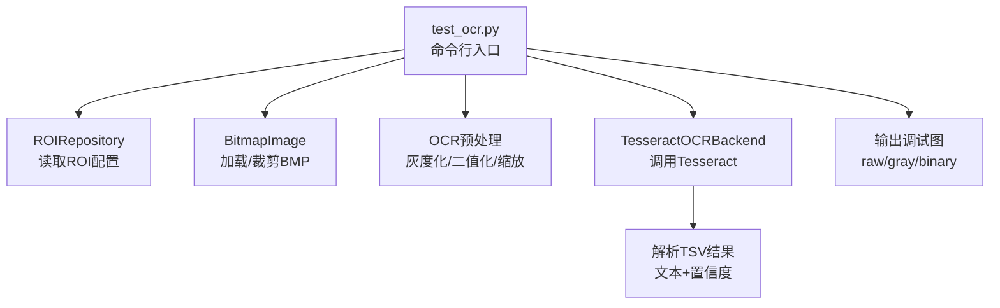
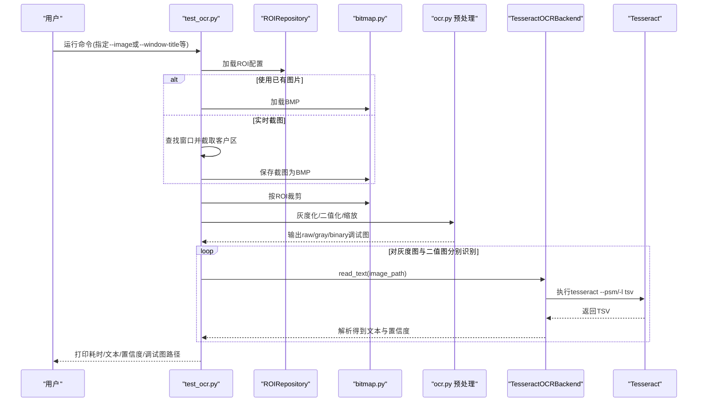
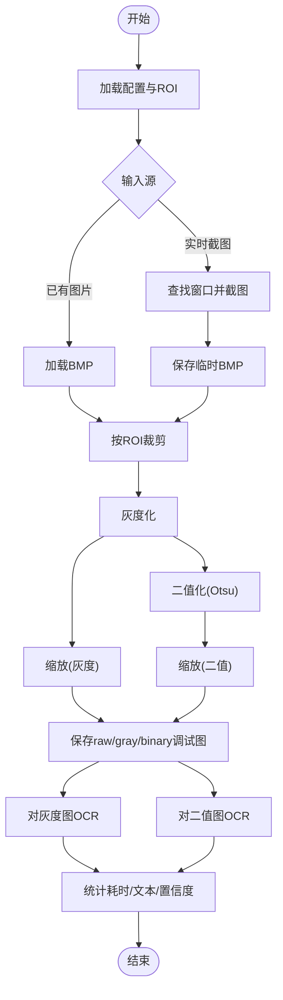
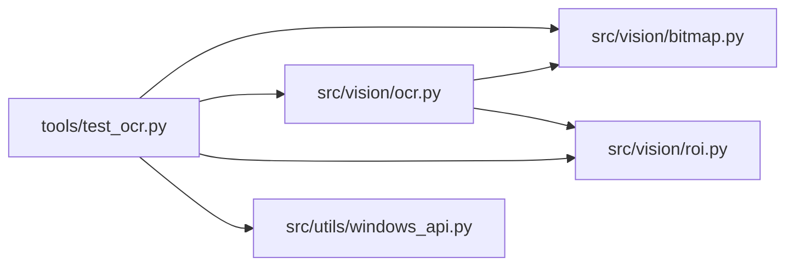

# OCR测试工具

<cite>
**本文引用的文件**
- [tools/test_ocr.py](file://tools/test_ocr.py)
- [src/vision/ocr.py](file://src/vision/ocr.py)
- [src/vision/bitmap.py](file://src/vision/bitmap.py)
- [config/app.config.json](file://config/app.config.json)
- [config/roi.config.json](file://config/roi.config.json)
- [README.md](file://README.md)
</cite>

## 目录
1. [简介](#简介)
2. [项目结构](#项目结构)
3. [核心组件](#核心组件)
4. [架构总览](#架构总览)
5. [详细组件分析](#详细组件分析)
6. [依赖关系分析](#依赖关系分析)
7. [性能与优化建议](#性能与优化建议)
8. [故障排查指南](#故障排查指南)
9. [结论](#结论)
10. [附录：常用命令与参数速查](#附录常用命令与参数速查)

## 简介
本指南面向需要评估与优化 Tesseract OCR 文字识别效果的用户，围绕独立测试脚本 tools/test_ocr.py 展开。该工具支持从已有截图或实时窗口截图开始，按 ROI 裁切、预处理（灰度化、二值化、缩放），再调用 Tesseract 进行识别，并输出文本、置信度、耗时以及调试图像路径，便于快速定位问题与调优。

## 项目结构
- 入口脚本：tools/test_ocr.py
- OCR 后端与预处理：src/vision/ocr.py
- 位图读写与裁剪：src/vision/bitmap.py
- 应用配置与 ROI 配置：config/app.config.json、config/roi.config.json
- 需求与验收标准参考：README.md

图表来源
- [tools/test_ocr.py:26-50](file://tools/test_ocr.py#L26-L50)
- [src/vision/ocr.py:23-70](file://src/vision/ocr.py#L23-L70)
- [src/vision/bitmap.py:17-115](file://src/vision/bitmap.py#L17-L115)

章节来源
- [tools/test_ocr.py:26-50](file://tools/test_ocr.py#L26-L50)
- [config/app.config.json:1-23](file://config/app.config.json#L1-L23)
- [config/roi.config.json:1-31](file://config/roi.config.json#L1-L31)

## 核心组件
- 命令行入口与流程编排：tools/test_ocr.py
  - 负责解析参数、加载配置、选择输入源（图片文件或窗口截图）、ROI 裁切、预处理、保存调试图、调用 OCR 后端并统计耗时与置信度。
- OCR 后端与结果解析：src/vision/ocr.py
  - TesseractOCRBackend：封装 Tesseract 子进程调用、参数注入（PSM、语言）、错误处理与 TSV 结果解析。
  - OCRImagePreprocessor：基于 ROI 生成 raw/gray/binary 调试图。
  - 图像处理函数：灰度化、Otsu 二值化、等比放大。
- 位图基础能力：src/vision/bitmap.py
  - 仅支持 BMP 的加载、保存、裁剪；模板匹配辅助（非本次重点）。
- 配置：
  - app.config.json：默认语言、PSM、Tesseract 可执行名、窗口标题关键词、阈值等。
  - roi.config.json：ROI 名称与坐标尺寸，如 debug_label。

章节来源
- [tools/test_ocr.py:57-176](file://tools/test_ocr.py#L57-L176)
- [src/vision/ocr.py:14-141](file://src/vision/ocr.py#L14-L141)
- [src/vision/bitmap.py:17-115](file://src/vision/bitmap.py#L17-L115)
- [config/app.config.json:1-23](file://config/app.config.json#L1-L23)
- [config/roi.config.json:1-31](file://config/roi.config.json#L1-L31)

## 架构总览
下图展示了从输入到输出的完整链路，包括两种输入方式（已有图片 vs 实时窗口截图）与两条预处理分支（灰度图、二值图）分别进行 OCR 识别。

图表来源
- [tools/test_ocr.py:75-176](file://tools/test_ocr.py#L75-L176)
- [src/vision/ocr.py:29-70](file://src/vision/ocr.py#L29-L70)
- [src/vision/bitmap.py:17-115](file://src/vision/bitmap.py#L17-L115)

## 详细组件分析

### 命令行参数与用法
- 输入源（互斥）
  - --image：指定已有 BMP 截图路径。
  - --window-title：通过窗口标题关键词实时截图；若未提供则回退到 app.config.json 中的 window_title_keyword。
- 区域与配置
  - --roi-name：要识别的 ROI 名称，默认 debug_label。
  - --roi-config：ROI 配置文件路径，默认 config/roi.config.json。
  - --app-config：应用配置路径，默认 config/app.config.json。
- OCR 引擎参数
  - --tesseract-cmd：Tesseract 可执行文件路径或命令名。
  - --language：OCR 语言，默认从 app.config.json 的 ocr_language 读取。
  - --psm：Tesseract PSM 模式，默认从 app.config.json 的 ocr_psm 读取。
- 运行选项
  - --dry-run：跳过实际 OCR，仅验证截图与预处理链路，并输出调试图。
  - --output-dir：调试图输出目录，默认 runtime/debug/ocr_test。
  - --save-screenshot：指定截图保存路径，不指定则保存到 output-dir。

章节来源
- [tools/test_ocr.py:26-50](file://tools/test_ocr.py#L26-L50)
- [config/app.config.json:9-12](file://config/app.config.json#L9-L12)
- [config/roi.config.json:1-8](file://config/roi.config.json#L1-L8)

### 识别流程与数据流
- 步骤概览
  1) 解析参数与配置。
  2) 选择输入源：已有图片或直接截取窗口客户区。
  3) 根据 ROI 裁切目标区域。
  4) 预处理：灰度化 → 可选缩放；二值化（Otsu 自适应阈值）→ 可选缩放。
  5) 保存 raw/gray/binary 三张调试图。
  6) 对灰度图与二值图分别调用 Tesseract 识别，记录耗时、文本与置信度。
- 关键数据结构
  - OCRExecutionResult：包含 text、confidence、command、raw_output、image_path。
  - BitmapImage：承载位图宽高、位深、像素行数据。
- 预处理算法要点
  - 灰度化：RGB 加权求和近似亮度。
  - 二值化：Otsu 自动阈值，并根据暗像素占比自动反转前景/背景。
  - 缩放：整数倍放大以提升识别稳定性（默认倍数由调用处决定）。

图表来源
- [tools/test_ocr.py:95-176](file://tools/test_ocr.py#L95-L176)
- [src/vision/ocr.py:144-177](file://src/vision/ocr.py#L144-L177)
- [src/vision/bitmap.py:17-115](file://src/vision/bitmap.py#L17-L115)

章节来源
- [tools/test_ocr.py:95-176](file://tools/test_ocr.py#L95-L176)
- [src/vision/ocr.py:110-177](file://src/vision/ocr.py#L110-L177)
- [src/vision/bitmap.py:17-115](file://src/vision/bitmap.py#L17-L115)

### 评估指标与输出
- 准确率：工具本身不直接计算“准确率”，需结合人工标注或业务规则对比“期望文本”与“识别文本”。可通过多次采样统计正确率。
- 置信度分数：来自 Tesseract TSV 的 conf 字段，工具将其归一化为 0~1 的浮点数用于比较。
- 识别时间统计：每次识别前后记录时间戳，输出耗时秒数，便于对比不同预处理与参数组合的性能。
- 调试图：raw/gray/binary 三张图，便于观察 ROI 是否越界、二值化阈值是否合理、缩放是否足够。

章节来源
- [tools/test_ocr.py:149-166](file://tools/test_ocr.py#L149-L166)
- [src/vision/ocr.py:110-141](file://src/vision/ocr.py#L110-L141)

### 典型使用场景
- 快速验证 ROI 与预处理效果（不调用 Tesseract）
  - 使用 --dry-run 与 --image 指定一张已知截图，检查 raw/gray/binary 是否满足预期。
- 对比灰度图与二值图的识别效果
  - 不传 --dry-run，工具会分别对灰度图与二值图执行 OCR，并输出各自的耗时、文本与置信度。
- 批量参数扫描
  - 固定 ROI 与图片，循环调整 --language 与 --psm，比较置信度与耗时，选择最优组合。

章节来源
- [tools/test_ocr.py:132-140](file://tools/test_ocr.py#L132-L140)
- [tools/test_ocr.py:149-166](file://tools/test_ocr.py#L149-L166)

## 依赖关系分析
- test_ocr.py 依赖
  - src.vision.bitmap：BMP 加载/保存/裁剪。
  - src.vision.ocr：Tesseract 后端、预处理函数。
  - src.vision.roi：ROI 配置仓库。
  - src.utils.windows_api：窗口查找与截图（当使用 --window-title 时）。
- ocr.py 依赖
  - src.vision.bitmap：位图操作。
  - src.vision.roi：ROI 仓库（在 OCRImagePreprocessor 中）。
- 配置依赖
  - app.config.json：默认语言、PSM、Tesseract 命令、窗口标题关键词、阈值等。
  - roi.config.json：ROI 定义（如 debug_label）。

图表来源
- [tools/test_ocr.py:14-23](file://tools/test_ocr.py#L14-L23)
- [src/vision/ocr.py:10-11](file://src/vision/ocr.py#L10-L11)

章节来源
- [tools/test_ocr.py:14-23](file://tools/test_ocr.py#L14-L23)
- [src/vision/ocr.py:10-11](file://src/vision/ocr.py#L10-L11)

## 性能与优化建议
- 预处理策略
  - 优先使用二值图进行 OCR，尤其在高对比度 UI 上；若背景复杂或噪声较多，可尝试灰度图。
  - 适当放大图像（当前实现会对预处理后的图像进行缩放）有助于提升小字号识别率，但会增加耗时。
- Tesseract 参数
  - PSM：页面分割模式影响文本布局假设。默认来自 app.config.json，可按场景调整（例如单行文本、整页文本等）。
  - 语言：确保安装对应语言包；中文可使用 chi_sim/chi_tra，英文使用 eng。
- ROI 标定
  - 确保 ROI 严格覆盖目标文本区域，避免多余背景；若 ROI 越界会触发警告。
- 批量化评测
  - 固定 ROI 与多张样本图，遍历不同语言与 PSM 组合，统计平均耗时与置信度，选择稳定且高效的配置。

[本节为通用指导，不直接分析具体文件]

## 故障排查指南
- 找不到 Tesseract 可执行文件
  - 现象：启动 OCR 时报错提示未找到 tesseract。
  - 解决：安装 Tesseract 或将可执行路径通过 --tesseract-cmd 指定；也可在 app.config.json 中配置 ocr_tesseract_cmd。
- 输入图像不存在
  - 现象：传入 --image 后报错。
  - 解决：确认路径存在且为 BMP 格式；或使用 --window-title 实时截图。
- ROI 越界
  - 现象：控制台输出 ROI 越界警告。
  - 解决：重新标定 roi.config.json 中的坐标与尺寸，确保 ROI 完全位于截图范围内。
- 识别结果为空或置信度极低
  - 可能原因：字体过小、背景复杂、特效干扰、PSM 设置不当、语言包缺失。
  - 排查步骤：
    1) 查看 raw/gray/binary 调试图，确认 ROI 是否正确、二值化阈值是否合理。
    2) 切换 PSM 与语言，比较灰度图与二值图的结果。
    3) 增大缩放比例或调整 ROI 以聚焦文本区域。
- 实时截图失败
  - 现象：未找到窗口或截图为空。
  - 解决：确认 --window-title 与 app.config.json 中的 window_title_keyword 能匹配目标窗口；必要时显式传入 --window-title。

章节来源
- [tools/test_ocr.py:75-103](file://tools/test_ocr.py#L75-L103)
- [tools/test_ocr.py:149-166](file://tools/test_ocr.py#L149-L166)
- [src/vision/ocr.py:29-61](file://src/vision/ocr.py#L29-L61)
- [src/vision/bitmap.py:17-39](file://src/vision/bitmap.py#L17-L39)

## 结论
tools/test_ocr.py 提供了端到端的 OCR 测试流水线，涵盖输入源选择、ROI 裁切、预处理、Tesseract 调用与结果统计。配合 app.config.json 与 roi.config.json，可以快速完成不同语言、PSM 与预处理策略的对比评测。建议以“先验证预处理与 ROI，再调参优化 OCR”的顺序开展，并通过调试图与置信度/耗时指标持续迭代。

[本节为总结性内容，不直接分析具体文件]

## 附录：常用命令与参数速查
- 使用已有截图进行 dry-run 验证
  - python tools/test_ocr.py --image <截图路径> --roi-name debug_label --output-dir runtime/debug/ocr_test --dry-run
- 使用窗口实时截图并识别
  - python tools/test_ocr.py --window-title <窗口标题关键词> --roi-name debug_label --language eng --psm 7
- 指定 Tesseract 路径与自定义输出目录
  - python tools/test_ocr.py --image <截图路径> --tesseract-cmd <tesseract路径> --output-dir <输出目录>
- 仅保存截图到指定路径
  - python tools/test_ocr.py --window-title <窗口标题关键词> --save-screenshot <路径>

章节来源
- [tools/test_ocr.py:26-50](file://tools/test_ocr.py#L26-L50)
- [config/app.config.json:9-12](file://config/app.config.json#L9-L12)