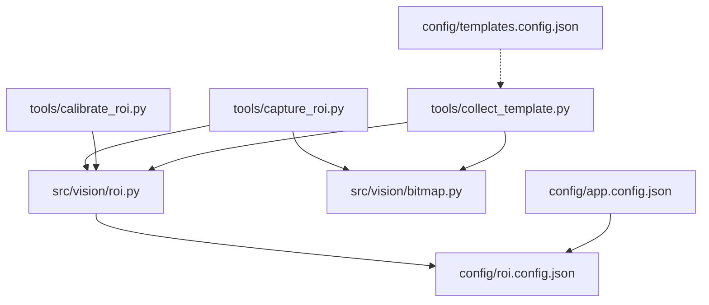
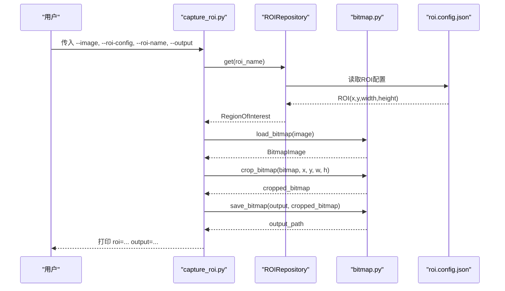
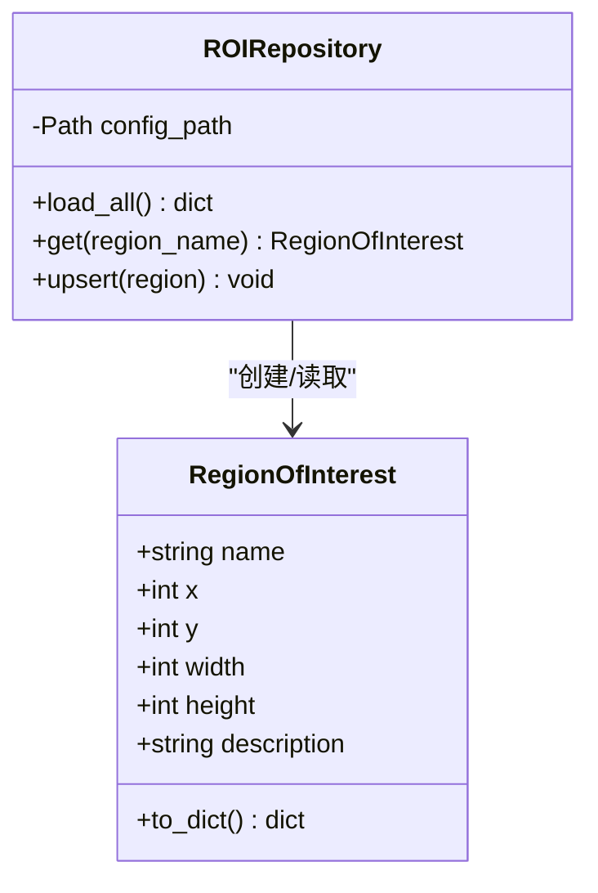
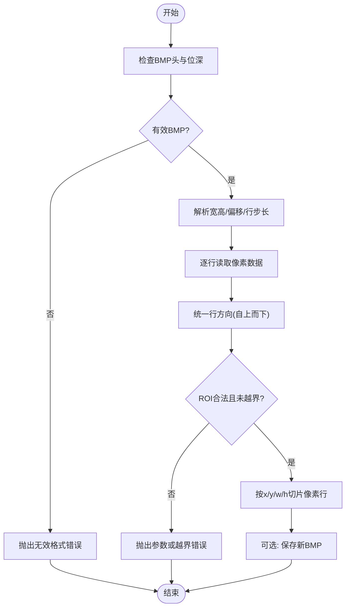
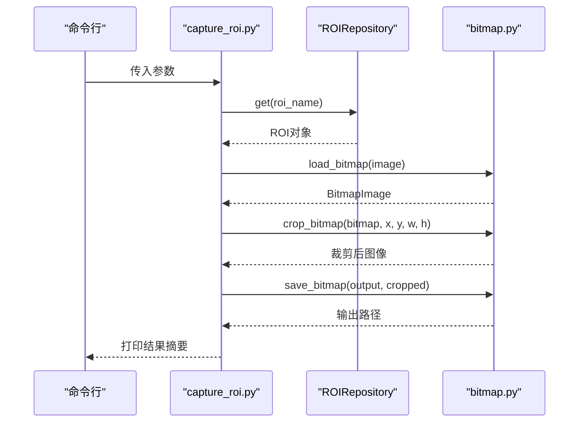
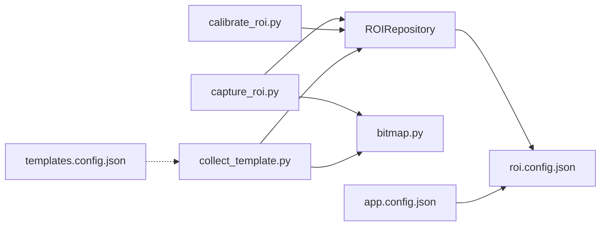

# ROI捕获工具

<cite>
**本文引用的文件**
- [tools/capture_roi.py](file://tools/capture_roi.py)
- [tools/calibrate_roi.py](file://tools/calibrate_roi.py)
- [src/vision/roi.py](file://src/vision/roi.py)
- [src/vision/bitmap.py](file://src/vision/bitmap.py)
- [config/roi.config.json](file://config/roi.config.json)
- [config/app.config.json](file://config/app.config.json)
- [config/templates.config.json](file://config/templates.config.json)
- [tools/collect_template.py](file://tools/collect_template.py)
</cite>

## 目录
1. [简介](#简介)
2. [项目结构](#项目结构)
3. [核心组件](#核心组件)
4. [架构总览](#架构总览)
5. [详细组件分析](#详细组件分析)
6. [依赖关系分析](#依赖关系分析)
7. [性能与精度建议](#性能与精度建议)
8. [故障排查指南](#故障排查指南)
9. [结论](#结论)
10. [附录：完整使用示例](#附录完整使用示例)

## 简介
本工具集围绕“ROI（感兴趣区域）标定与裁剪”展开，提供从截图到ROI配置、模板采集的完整工作流。当前仓库中的 capture_roi.py 是一个命令行工具，用于根据已标定的ROI配置，从BMP截图中裁切出指定区域并保存为新BMP文件；配合 calibrate_roi.py 可写入或更新ROI坐标；结合 collect_template.py 可从截图按ROI生成模板图；所有ROI数据统一通过 roi.config.json 管理，并由 src/vision/roi.py 提供的 ROIRepository 负责加载与持久化。

注意：当前版本的 capture_roi.py 并非“实时预览屏幕区域”的交互式GUI工具，而是基于已有BMP截图进行ROI裁切的批处理脚本。若需要“实时预览+鼠标交互选择ROI”，可在现有能力基础上扩展一个前端交互层，将选择的坐标回写到 roi.config.json。

## 项目结构
与本工具直接相关的目录与文件如下：
- tools：命令行工具入口
  - capture_roi.py：按ROI裁切截图
  - calibrate_roi.py：写入/更新ROI配置
  - collect_template.py：按ROI从截图采集模板
- src/vision：视觉基础能力
  - roi.py：ROI数据模型与配置仓库
  - bitmap.py：BMP读取、保存、裁剪与模板匹配基础实现
- config：配置文件
  - roi.config.json：ROI坐标与说明
  - app.config.json：应用运行参数（包含ROI配置文件路径等）
  - templates.config.json：模板注册表（绑定模板与ROI名称）

图表来源
- [tools/capture_roi.py:15-37](file://tools/capture_roi.py#L15-L37)
- [tools/calibrate_roi.py:14-42](file://tools/calibrate_roi.py#L14-L42)
- [tools/collect_template.py:15-37](file://tools/collect_template.py#L15-L37)
- [src/vision/roi.py:21-68](file://src/vision/roi.py#L21-L68)
- [src/vision/bitmap.py:17-115](file://src/vision/bitmap.py#L17-L115)
- [config/roi.config.json:1-31](file://config/roi.config.json#L1-L31)
- [config/app.config.json:1-23](file://config/app.config.json#L1-L23)
- [config/templates.config.json:1-9](file://config/templates.config.json#L1-L9)

章节来源
- [tools/capture_roi.py:15-37](file://tools/capture_roi.py#L15-L37)
- [src/vision/roi.py:21-68](file://src/vision/roi.py#L21-L68)
- [src/vision/bitmap.py:17-115](file://src/vision/bitmap.py#L17-L115)
- [config/roi.config.json:1-31](file://config/roi.config.json#L1-L31)
- [config/app.config.json:1-23](file://config/app.config.json#L1-L23)
- [config/templates.config.json:1-9](file://config/templates.config.json#L1-L9)

## 核心组件
- ROI数据模型与仓库（RegionOfInterest、ROIRepository）
  - 负责定义ROI结构（name、x、y、width、height、description），以及从JSON加载、查询、写入ROI配置。
- BMP图像读写与裁剪（load_bitmap、save_bitmap、crop_bitmap）
  - 支持BMP格式读取与写出，按ROI坐标裁剪像素行，保证行列对齐与填充字节正确。
- 命令行工具
  - capture_roi.py：输入截图、ROI配置名、输出路径，执行裁剪并打印结果摘要。
  - calibrate_roi.py：写入或更新ROI坐标到配置文件。
  - collect_template.py：按ROI从截图采集模板图。

章节来源
- [src/vision/roi.py:8-68](file://src/vision/roi.py#L8-L68)
- [src/vision/bitmap.py:17-115](file://src/vision/bitmap.py#L17-L115)
- [tools/capture_roi.py:15-37](file://tools/capture_roi.py#L15-L37)
- [tools/calibrate_roi.py:14-42](file://tools/calibrate_roi.py#L14-L42)
- [tools/collect_template.py:15-37](file://tools/collect_template.py#L15-L37)

## 架构总览
整体流程分为“标定—裁剪—模板采集—集成使用”四个阶段：
- 标定阶段：使用 calibrate_roi.py 将ROI坐标写入 roi.config.json。
- 裁剪阶段：使用 capture_roi.py 根据ROI名称从BMP截图裁切目标区域。
- 模板采集：使用 collect_template.py 从同一张截图按ROI生成模板图。
- 集成使用：在业务逻辑中通过 ROIRepository 读取ROI，结合模板匹配或OCR在ROI范围内处理。

图表来源
- [tools/capture_roi.py:15-37](file://tools/capture_roi.py#L15-L37)
- [src/vision/roi.py:21-68](file://src/vision/roi.py#L21-L68)
- [src/vision/bitmap.py:17-115](file://src/vision/bitmap.py#L17-L115)
- [config/roi.config.json:1-31](file://config/roi.config.json#L1-L31)

## 详细组件分析

### ROI数据模型与配置仓库
- RegionOfInterest
  - 字段：name、x、y、width、height、description
  - 用途：描述一个矩形区域及其说明，便于版本管理与人工校对。
- ROIRepository
  - 功能：
    - load_all：从JSON加载全部ROI，构造为字典映射 name -> RegionOfInterest
    - get：按名称获取ROI，不存在时抛出KeyError
    - upsert：新增或更新ROI，并以排序后的键写入JSON，便于人类阅读和diff比对
  - 设计要点：
    - 使用 dataclass 简化数据结构
    - JSON持久化保留 description，方便标注用途
    - 写入前确保目录存在

图表来源
- [src/vision/roi.py:8-68](file://src/vision/roi.py#L8-L68)

章节来源
- [src/vision/roi.py:8-68](file://src/vision/roi.py#L8-L68)

### BMP图像读写与裁剪
- load_bitmap
  - 仅支持未压缩BMP，位深24/32位
  - 解析文件头与信息头，提取宽高、像素偏移、行步长
  - 将自下而上的BMP行统一转为自上而下，避免后续坐标倒置
- save_bitmap
  - 写回BMP时恢复自下而上顺序，补齐行尾零字节
- crop_bitmap
  - 校验ROI参数合法性与边界
  - 按像素宽度切片行数据，生成新的BitmapImage

图表来源
- [src/vision/bitmap.py:17-115](file://src/vision/bitmap.py#L17-L115)

章节来源
- [src/vision/bitmap.py:17-115](file://src/vision/bitmap.py#L17-L115)

### 命令行工具：capture_roi.py
- 作用：从一张BMP截图中按ROI名称裁切目标区域，并保存为新BMP
- 参数：
  - --image：输入截图路径（要求BMP）
  - --roi-config：ROI配置文件路径
  - --roi-name：要裁切的ROI名称
  - --output：输出BMP路径
- 行为：
  - 通过ROIRepository加载ROI
  - 调用load_bitmap读取截图
  - 调用crop_bitmap裁剪
  - 调用save_bitmap保存
  - 标准输出打印 roi 名称与输出路径，便于串联自动化

图表来源
- [tools/capture_roi.py:15-37](file://tools/capture_roi.py#L15-L37)
- [src/vision/roi.py:21-68](file://src/vision/roi.py#L21-L68)
- [src/vision/bitmap.py:17-115](file://src/vision/bitmap.py#L17-L115)

章节来源
- [tools/capture_roi.py:15-37](file://tools/capture_roi.py#L15-L37)

### 命令行工具：calibrate_roi.py
- 作用：写入或更新一个ROI标定配置
- 参数：
  - --roi-config：ROI配置文件路径
  - --name：ROI名称
  - --x, --y, --width, --height：ROI坐标与尺寸
  - --description：说明（可选）
- 行为：
  - 构建RegionOfInterest
  - 调用ROIRepository.upsert写入配置
  - 标准输出打印保存结果摘要

章节来源
- [tools/calibrate_roi.py:14-42](file://tools/calibrate_roi.py#L14-L42)

### 模板采集工具：collect_template.py
- 作用：从截图中按ROI采集模板图
- 参数：
  - --image：输入截图路径（BMP）
  - --roi-config：ROI配置文件路径
  - --roi-name：模板绑定的ROI名称
  - --output：模板输出路径
- 行为：
  - 通过ROIRepository获取ROI
  - 读取截图并按ROI裁剪
  - 保存模板图
  - 标准输出打印模板与ROI信息

章节来源
- [tools/collect_template.py:15-37](file://tools/collect_template.py#L15-L37)

## 依赖关系分析
- capture_roi.py 依赖：
  - ROIRepository（读取ROI配置）
  - bitmap.py（读取、裁剪、保存BMP）
- calibrate_roi.py 依赖：
  - ROIRepository（写入ROI配置）
- collect_template.py 依赖：
  - ROIRepository（读取ROI配置）
  - bitmap.py（读取、裁剪、保存BMP）
- 配置文件：
  - roi.config.json：存储ROI坐标与说明
  - app.config.json：包含ROI配置文件路径等运行时参数
  - templates.config.json：模板注册表，绑定模板与ROI名称

图表来源
- [tools/capture_roi.py:15-37](file://tools/capture_roi.py#L15-L37)
- [tools/calibrate_roi.py:14-42](file://tools/calibrate_roi.py#L14-L42)
- [tools/collect_template.py:15-37](file://tools/collect_template.py#L15-L37)
- [src/vision/roi.py:21-68](file://src/vision/roi.py#L21-L68)
- [src/vision/bitmap.py:17-115](file://src/vision/bitmap.py#L17-L115)
- [config/roi.config.json:1-31](file://config/roi.config.json#L1-L31)
- [config/app.config.json:1-23](file://config/app.config.json#L1-L23)
- [config/templates.config.json:1-9](file://config/templates.config.json#L1-L9)

章节来源
- [tools/capture_roi.py:15-37](file://tools/capture_roi.py#L15-L37)
- [tools/calibrate_roi.py:14-42](file://tools/calibrate_roi.py#L14-L42)
- [tools/collect_template.py:15-37](file://tools/collect_template.py#L15-L37)
- [src/vision/roi.py:21-68](file://src/vision/roi.py#L21-L68)
- [src/vision/bitmap.py:17-115](file://src/vision/bitmap.py#L17-L115)
- [config/roi.config.json:1-31](file://config/roi.config.json#L1-L31)
- [config/app.config.json:1-23](file://config/app.config.json#L1-L23)
- [config/templates.config.json:1-9](file://config/templates.config.json#L1-L9)

## 性能与精度建议
- 使用ROI裁剪减少全图扫描成本
  - 模板匹配与OCR应在ROI范围内进行，避免整图暴力计算
- 保持BMP格式一致
  - 仅支持未压缩BMP，位深24/32位，确保读取与裁剪稳定
- 坐标与尺寸校验
  - 确保ROI不越界，避免裁剪异常
- 模板质量
  - 模板图应来自清晰截图，避免模糊或特效干扰
- OCR预处理
  - 可使用灰度与二值化辅助识别，必要时保存调试图对比效果

[本节为通用指导，无需特定文件引用]

## 故障排查指南
- 常见错误与定位
  - 非BMP文件或压缩BMP：load_bitmap会拒绝并报错，需确认截图格式
  - 位深不支持：仅支持24/32位BMP
  - ROI参数无效或越界：crop_bitmap会抛出参数错误或越界错误
  - ROI名称不存在：ROIRepository.get会抛出KeyError
- 快速验证步骤
  - 先用 calibrate_roi.py 写入已知坐标，再用 capture_roi.py 裁剪验证
  - 用 collect_template.py 生成模板图，检查是否为目标UI元素
  - 查看 app.config.json 中的 roi_config_path 是否正确指向配置文件
- 调试技巧
  - 保存裁剪前后的BMP图，肉眼核对坐标与尺寸
  - 对OCR场景，保存原图、灰度图、二值图，观察预处理效果
  - 利用标准输出摘要（roi=... output=... / saved_roi=...）串联自动化脚本

章节来源
- [src/vision/bitmap.py:17-115](file://src/vision/bitmap.py#L17-L115)
- [src/vision/roi.py:21-68](file://src/vision/roi.py#L21-L68)
- [tools/capture_roi.py:15-37](file://tools/capture_roi.py#L15-L37)
- [tools/calibrate_roi.py:14-42](file://tools/calibrate_roi.py#L14-L42)
- [tools/collect_template.py:15-37](file://tools/collect_template.py#L15-L37)
- [config/app.config.json:1-23](file://config/app.config.json#L1-L23)

## 结论
当前ROI工具链以“配置文件驱动+命令行裁剪/采集”为核心，具备稳定的BMP读写与ROI管理能力。capture_roi.py 用于从截图按ROI裁切目标区域；calibrate_roi.py 用于写入或更新ROI坐标；collect_template.py 用于按ROI采集模板。三者通过 roi.config.json 与 ROIRepository 紧密耦合，形成闭环。对于“实时预览+鼠标交互选择ROI”的需求，可在现有能力之上增加交互层，将选择的坐标回写到配置文件，从而无缝接入当前工作流。

[本节为总结性内容，无需特定文件引用]

## 附录：完整使用示例
以下示例展示从截图到ROI配置、模板采集的完整过程。请根据实际路径替换占位符。

- 准备截图
  - 使用系统截图或游戏窗口截图工具，保存为BMP文件，例如：runtime/screenshots/screen_001.bmp

- 标定ROI
  - 使用 calibrate_roi.py 写入ROI坐标到配置文件
  - 示例命令（请替换实际路径与坐标）：
    - python tools/calibrate_roi.py --roi-config config/roi.config.json --name hideout_anchor --x 20 --y 20 --width 320 --height 180 --description "藏身处固定 UI 锚点区域"

- 裁剪ROI
  - 使用 capture_roi.py 从截图按ROI名称裁切目标区域
  - 示例命令：
    - python tools/capture_roi.py --image runtime/screenshots/screen_001.bmp --roi-config config/roi.config.json --roi-name hideout_anchor --output runtime/screenshots/roi_hideout_anchor.bmp

- 采集模板
  - 使用 collect_template.py 从同一张截图按ROI生成模板图
  - 示例命令：
    - python tools/collect_template.py --image runtime/screenshots/screen_001.bmp --roi-config config/roi.config.json --roi-name hideout_anchor --output assets/templates/ui/hideout_anchor.bmp

- 集成使用
  - 在业务逻辑中通过 ROIRepository 读取ROI，结合模板匹配或OCR在ROI范围内处理
  - 模板注册表 templates.config.json 可将模板路径与ROI名称关联，便于统一管理

- 输出格式与数据传递
  - capture_roi.py 标准输出：roi=... output=...
  - calibrate_roi.py 标准输出：saved_roi=... x=... y=... w=... h=...
  - collect_template.py 标准输出：template_roi=... output=...
  - 这些摘要可用于自动化脚本串联与日志记录

章节来源
- [tools/calibrate_roi.py:14-42](file://tools/calibrate_roi.py#L14-L42)
- [tools/capture_roi.py:15-37](file://tools/capture_roi.py#L15-L37)
- [tools/collect_template.py:15-37](file://tools/collect_template.py#L15-L37)
- [config/roi.config.json:1-31](file://config/roi.config.json#L1-L31)
- [config/templates.config.json:1-9](file://config/templates.config.json#L1-L9)