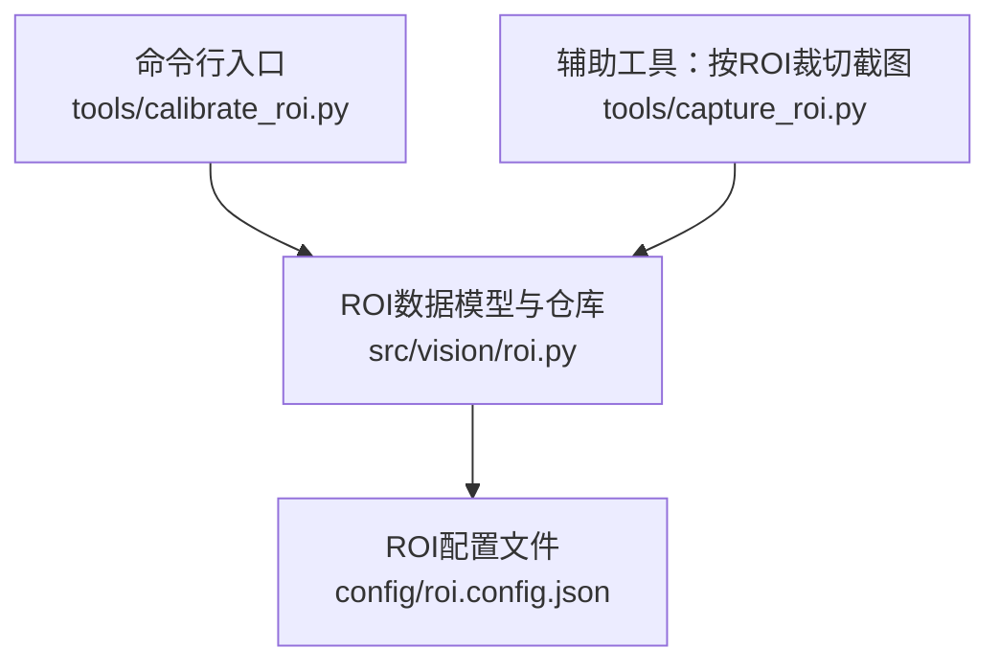
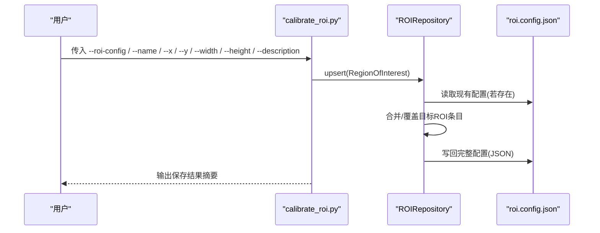
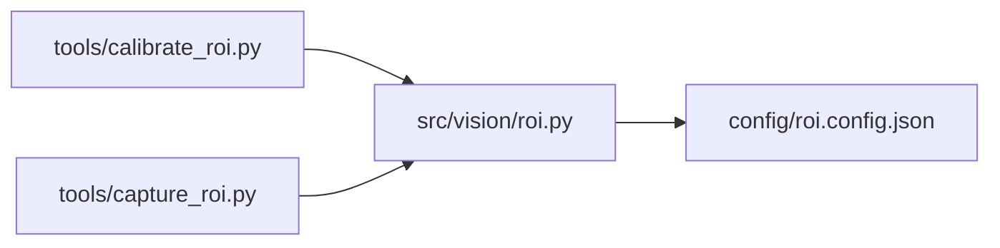

# ROI标定工具

<cite>
**本文引用的文件**
- [tools/calibrate_roi.py](file://tools/calibrate_roi.py)
- [src/vision/roi.py](file://src/vision/roi.py)
- [config/roi.config.json](file://config/roi.config.json)
- [tools/capture_roi.py](file://tools/capture_roi.py)
- [README.md](file://README.md)
</cite>

## 目录
1. [简介](#简介)
2. [项目结构](#项目结构)
3. [核心组件](#核心组件)
4. [架构总览](#架构总览)
5. [详细组件分析](#详细组件分析)
6. [依赖关系分析](#依赖关系分析)
7. [性能与稳定性考虑](#性能与稳定性考虑)
8. [故障排查指南](#故障排查指南)
9. [结论](#结论)
10. [附录：命令行参数与使用示例](#附录命令行参数与使用示例)

## 简介
ROI标定工具用于定义和更新屏幕上的“感兴趣区域”（Region of Interest, ROI），以便后续截图、模板匹配或OCR等视觉任务在固定区域内进行，提高识别稳定性和性能。本工具通过命令行参数快速写入或更新配置文件中的ROI条目，支持首次创建新ROI与更新已有ROI配置。

## 项目结构
本项目将ROI的持久化模型与仓库逻辑放在vision模块中，命令行入口位于tools目录，默认配置文件位于config目录。

图表来源
- [tools/calibrate_roi.py:14-42](file://tools/calibrate_roi.py#L14-L42)
- [src/vision/roi.py:21-67](file://src/vision/roi.py#L21-L67)
- [config/roi.config.json:1-31](file://config/roi.config.json#L1-L31)
- [tools/capture_roi.py:15-36](file://tools/capture_roi.py#L15-L36)

章节来源
- [tools/calibrate_roi.py:1-47](file://tools/calibrate_roi.py#L1-L47)
- [src/vision/roi.py:1-68](file://src/vision/roi.py#L1-L68)
- [config/roi.config.json:1-31](file://config/roi.config.json#L1-L31)
- [tools/capture_roi.py:1-42](file://tools/capture_roi.py#L1-L42)

## 核心组件
- RegionOfInterest：表示一个ROI的数据模型，包含名称、坐标、尺寸与可选说明。
- ROIRepository：负责从JSON配置文件加载所有ROI、读取单个ROI以及写入/更新ROI到配置文件。
- calibrate_roi.py：命令行工具，解析参数并调用ROIRepository.upsert保存ROI。
- capture_roi.py：配套工具，根据已配置的ROI从截图中裁切指定区域，便于验证标定效果。

章节来源
- [src/vision/roi.py:8-18](file://src/vision/roi.py#L8-L18)
- [src/vision/roi.py:21-67](file://src/vision/roi.py#L21-L67)
- [tools/calibrate_roi.py:14-42](file://tools/calibrate_roi.py#L14-L42)
- [tools/capture_roi.py:15-36](file://tools/capture_roi.py#L15-L36)

## 架构总览
ROI标定的整体流程如下：用户通过命令行提供ROI信息，工具将其转换为内存对象并持久化到JSON配置文件；其他工具或业务代码可从该配置读取并使用ROI。

图表来源
- [tools/calibrate_roi.py:26-42](file://tools/calibrate_roi.py#L26-L42)
- [src/vision/roi.py:48-67](file://src/vision/roi.py#L48-L67)

## 详细组件分析

### 数据模型：RegionOfInterest
- name：字符串，唯一标识该ROI的名称。
- x：整数，ROI左上角横坐标（像素）。
- y：整数，ROI左上角纵坐标（像素）。
- width：整数，ROI宽度（像素）。
- height：整数，ROI高度（像素）。
- description：字符串，可选说明，便于记录用途或备注。

该模型提供to_dict方法，便于序列化为字典以写入JSON。

章节来源
- [src/vision/roi.py:8-18](file://src/vision/roi.py#L8-L18)

### 仓库：ROIRepository
- load_all：从配置文件加载全部ROI为字典映射（名称→对象）。若文件不存在则返回空字典。
- get：按名称获取单个ROI，未找到时抛出KeyError。
- upsert：将给定ROI写入配置，实现新增或覆盖更新；写入前会确保目录存在，并以UTF-8编码格式化输出JSON。

章节来源
- [src/vision/roi.py:21-67](file://src/vision/roi.py#L21-L67)

### 命令行工具：calibrate_roi.py
- 作用：解析命令行参数，构造RegionOfInterest并调用ROIRepository.upsert持久化。
- 关键行为：
  - 构建参数解析器，声明必需与可选参数。
  - 初始化ROIRepository指向配置文件路径。
  - 构造RegionOfInterest对象并upsert。
  - 打印保存摘要，便于集成自动化脚本。

章节来源
- [tools/calibrate_roi.py:14-42](file://tools/calibrate_roi.py#L14-L42)

### 配套工具：capture_roi.py
- 作用：根据已配置的ROI从BMP截图中裁切指定区域，输出新的BMP文件，用于验证ROI是否准确。
- 典型用法：先标定ROI，再使用该工具对截图进行裁切，观察裁切结果是否符合预期。

章节来源
- [tools/capture_roi.py:15-36](file://tools/capture_roi.py#L15-L36)

## 依赖关系分析
- calibrate_roi.py 依赖 src/vision/roi.py 提供的 RegionOfInterest 与 ROIRepository。
- capture_roi.py 依赖 src/vision/roi.py 与图像裁剪能力（bitmap模块），用于基于ROI裁切截图。
- 配置文件 config/roi.config.json 是ROI数据的持久化载体，被ROIRepository读写。

图表来源
- [tools/calibrate_roi.py:11-12](file://tools/calibrate_roi.py#L11-L12)
- [tools/capture_roi.py:11-12](file://tools/capture_roi.py#L11-L12)
- [src/vision/roi.py:21-67](file://src/vision/roi.py#L21-L67)

## 性能与稳定性考虑
- 配置文件读写：每次upsert都会读取并写回整个配置文件，适合中小规模ROI数量。若未来ROI数量显著增长，可考虑增量写入或分片存储。
- 坐标与尺寸校验：当前实现未做边界检查，建议在调用方或仓库层增加合法性校验（如非负数、不超过屏幕分辨率等），以避免异常裁切或识别失败。
- 并发安全：同一时刻多进程写入同一配置文件可能产生竞争，建议串行化写入或使用锁机制。
- 错误处理：get在未找到ROI时会抛出KeyError，调用方应捕获并给出明确提示。

[本节为通用建议，不直接分析具体文件]

## 故障排查指南
- 找不到ROI配置：当使用capture_roi.py读取不存在的ROI名称时，会抛出KeyError。请确认名称一致且配置文件正确。
- 配置文件不存在：load_all在文件不存在时返回空字典，upsert会创建文件。若期望读取已有配置但为空，请检查路径是否正确。
- 坐标无效：若x/y/width/height为负数或超出屏幕范围，可能导致裁切失败或识别异常。请在标定后使用capture_roi.py验证裁切结果。
- JSON格式错误：手动编辑配置文件时需保持键名与类型一致（x/y/width/height为整数，description为字符串）。

章节来源
- [src/vision/roi.py:42-46](file://src/vision/roi.py#L42-L46)
- [src/vision/roi.py:25-40](file://src/vision/roi.py#L25-L40)
- [tools/capture_roi.py:26-36](file://tools/capture_roi.py#L26-L36)

## 结论
ROI标定工具提供了简单可靠的命令行接口，用于创建和更新屏幕区域的ROI配置。配合配套的裁切工具，可以快速验证标定准确性。建议在团队内统一命名规范与坐标体系，并在持续集成中定期校验ROI的有效性，以保证视觉模块的稳定运行。

[本节为总结性内容，不直接分析具体文件]

## 附录：命令行参数与使用示例

### 命令行参数说明
- --roi-config：必填。ROI配置文件路径（例如 config/roi.config.json）。
- --name：必填。ROI名称，作为配置文件中的键。
- --x：必填。ROI左上角X坐标（像素）。
- --y：必填。ROI左上角Y坐标（像素）。
- --width：必填。ROI宽度（像素）。
- --height：必填。ROI高度（像素）。
- --description：可选。ROI说明文本，便于记录用途。

章节来源
- [tools/calibrate_roi.py:14-23](file://tools/calibrate_roi.py#L14-L23)

### 常见使用场景与示例

- 首次创建ROI
  - 目的：为新功能添加一个新的ROI配置。
  - 命令要点：指定 --roi-config、--name、--x、--y、--width、--height，可选 --description。
  - 结果：在配置文件中新增对应键值对。

- 更新现有ROI
  - 目的：调整已有ROI的坐标或尺寸。
  - 命令要点：与创建相同，仅改变数值或描述。
  - 结果：覆盖配置文件中同名键的值。

- 验证ROI效果
  - 使用配套工具 capture_roi.py 从截图中裁切该ROI，查看输出图片是否包含目标UI元素。
  - 若裁切结果不理想，回到标定步骤微调坐标与尺寸。

- 批量标定建议
  - 先确定屏幕分辨率与窗口模式，保证坐标一致性。
  - 为每个ROI编写清晰的description，便于维护与回溯。
  - 在变更配置后，用capture_roi.py对关键界面进行抽样验证。

章节来源
- [tools/calibrate_roi.py:26-42](file://tools/calibrate_roi.py#L26-L42)
- [tools/capture_roi.py:26-36](file://tools/capture_roi.py#L26-L36)

### ROI配置文件JSON格式与存储结构
- 顶层为对象，键为ROI名称（即 --name 的值）。
- 每个ROI对象包含以下字段：
  - x：整数，左上角横坐标。
  - y：整数，左上角纵坐标。
  - width：整数，宽度。
  - height：整数，高度。
  - description：字符串，可选说明。
- 示例参考：config/roi.config.json 中已包含多个ROI条目，可作为格式样板。

章节来源
- [config/roi.config.json:1-31](file://config/roi.config.json#L1-L31)
- [src/vision/roi.py:52-67](file://src/vision/roi.py#L52-L67)

### 最佳实践建议
- 固定环境：确保游戏分辨率、窗口模式、UI缩放与语言固定，避免ROI漂移。
- 命名规范：使用语义化的名称（如 hideout_anchor、map_device_panel），避免歧义。
- 注释完善：为每个ROI填写description，记录用途、负责人或关联模块。
- 版本管理：将配置文件纳入版本控制，便于追踪变更与回滚。
- 回归验证：每次修改ROI后，使用capture_roi.py对关键界面进行裁切验证，确保识别稳定。

[本节为通用建议，不直接分析具体文件]