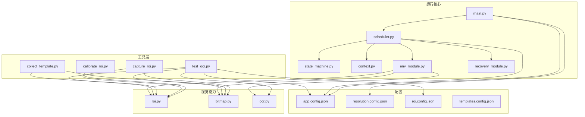
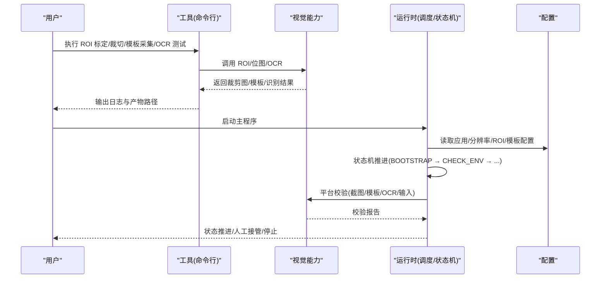
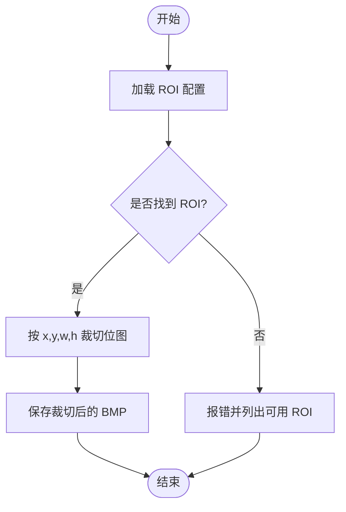
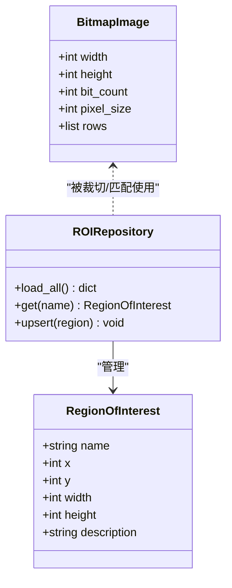
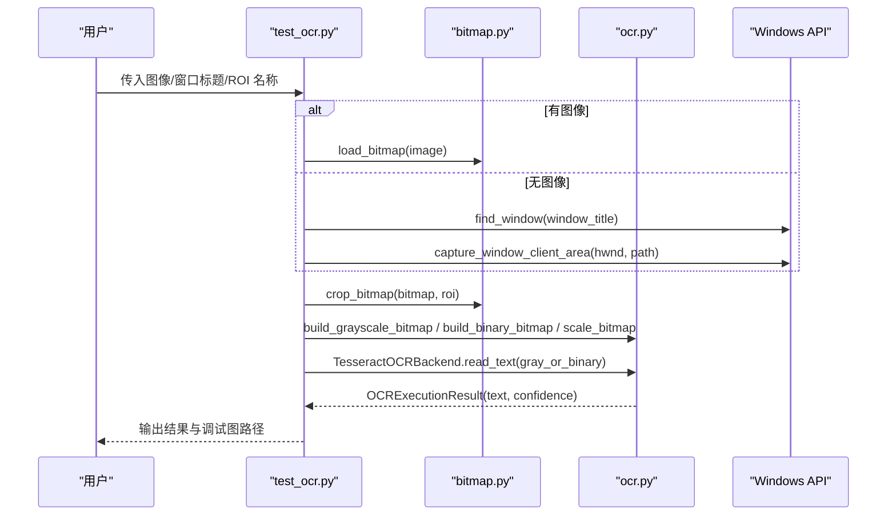
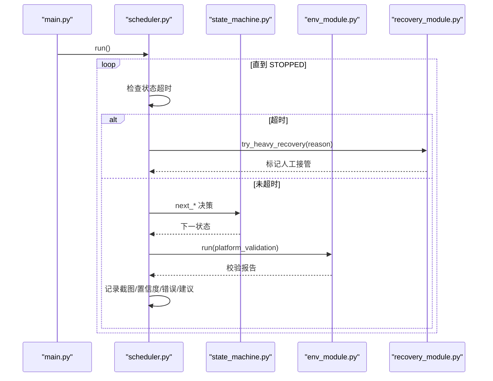
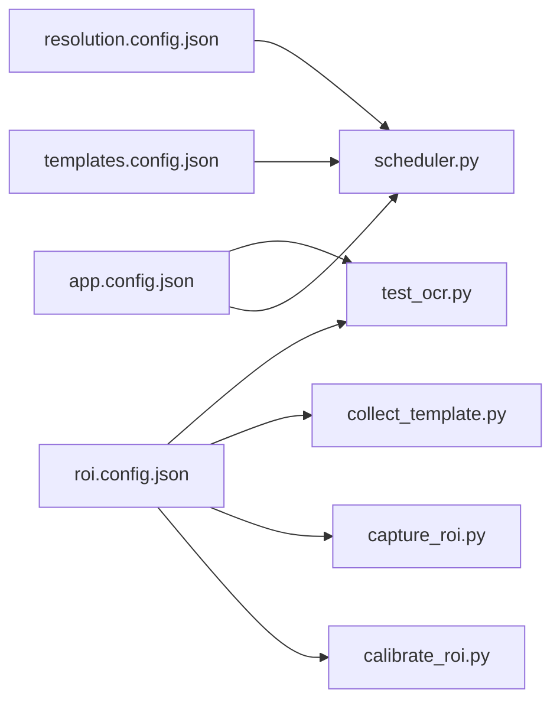
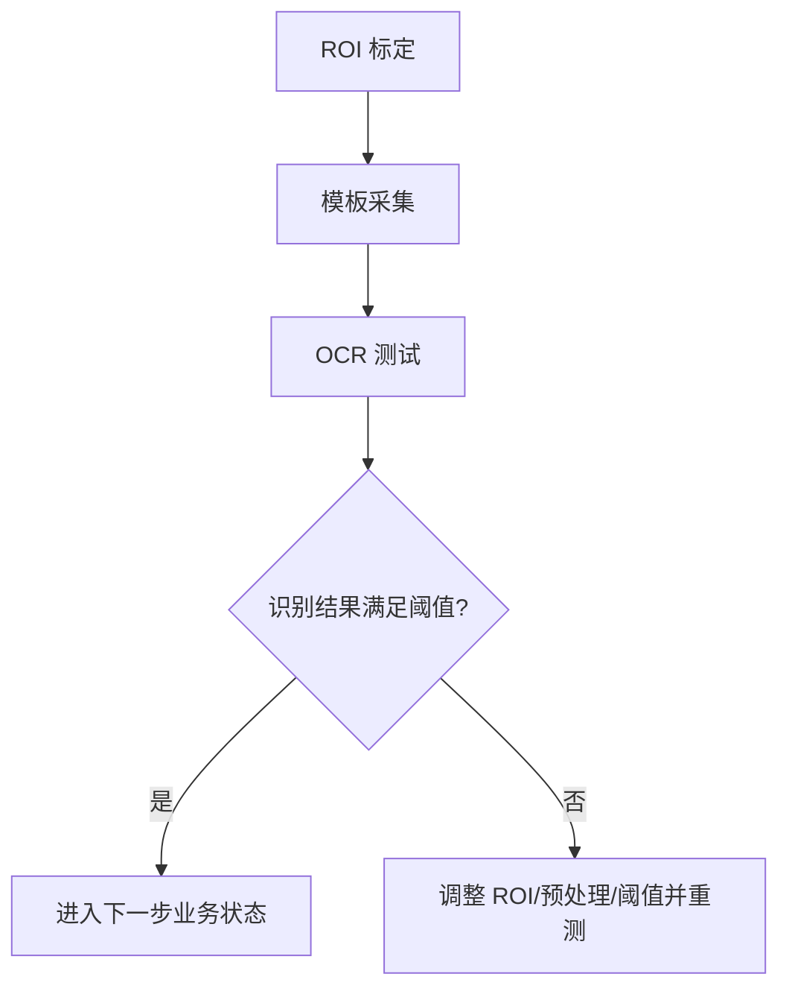

# 工具使用最佳实践

<cite>
**本文引用的文件**
- [README.md](file://README.md)
- [main.py](file://src/main.py)
- [scheduler.py](file://src/core/scheduler.py)
- [state_machine.py](file://src/core/state_machine.py)
- [context.py](file://src/core/context.py)
- [env_module.py](file://src/modules/env_module.py)
- [recovery_module.py](file://src/modules/recovery_module.py)
- [roi.py](file://src/vision/roi.py)
- [bitmap.py](file://src/vision/bitmap.py)
- [ocr.py](file://src/vision/ocr.py)
- [calibrate_roi.py](file://tools/calibrate_roi.py)
- [capture_roi.py](file://tools/capture_roi.py)
- [collect_template.py](file://tools/collect_template.py)
- [test_ocr.py](file://tools/test_ocr.py)
- [app.config.json](file://config/app.config.json)
- [resolution.config.json](file://config/resolution.config.json)
- [roi.config.json](file://config/roi.config.json)
- [templates.config.json](file://config/templates.config.json)
</cite>

## 目录
1. [引言](#引言)
2. [项目结构](#项目结构)
3. [核心组件](#核心组件)
4. [架构总览](#架构总览)
5. [详细组件分析](#详细组件分析)
6. [依赖关系分析](#依赖关系分析)
7. [性能与优化建议](#性能与优化建议)
8. [故障排查指南](#故障排查指南)
9. [结论](#结论)
10. [附录：实战工作流与脚本示例](#附录实战工作流与脚本示例)

## 引言
本指南面向开发工具集，目标是沉淀一套标准化的开发工作流与最佳实践，覆盖 ROI 标定、模板采集、OCR 测试的完整链路，并说明工具间的依赖关系、数据流转、环境配置、批量自动化方法、性能优化、错误处理与异常恢复策略。同时提供可复用的实战案例与故障排查清单，帮助团队在固定环境下稳定推进“截图→识别→输入”的可验证闭环。

## 项目结构
仓库采用分层组织：
- 顶层 tools 目录提供命令行工具，用于 ROI 标定、ROI 裁切、模板采集和 OCR 测试。
- src 目录包含运行时核心：上下文、状态机、调度器、平台校验、恢复管理，以及视觉能力（位图、ROI、OCR）。
- config 目录集中管理应用、分辨率、ROI 与模板配置。
- assets 目录用于存放 UI 模板等静态资源。

图表来源
- [main.py:22-50](file://src/main.py#L22-L50)
- [scheduler.py:13-83](file://src/core/scheduler.py#L13-L83)
- [state_machine.py:6-42](file://src/core/state_machine.py#L6-L42)
- [context.py:10-62](file://src/core/context.py#L10-L62)
- [env_module.py:23-88](file://src/modules/env_module.py#L23-L88)
- [recovery_module.py:6-20](file://src/modules/recovery_module.py#L6-L20)
- [roi.py:8-68](file://src/vision/roi.py#L8-L68)
- [bitmap.py:17-201](file://src/vision/bitmap.py#L17-L201)
- [ocr.py:23-280](file://src/vision/ocr.py#L23-L280)
- [calibrate_roi.py:14-42](file://tools/calibrate_roi.py#L14-L42)
- [capture_roi.py:15-37](file://tools/capture_roi.py#L15-L37)
- [collect_template.py:15-37](file://tools/collect_template.py#L15-L37)
- [test_ocr.py:26-181](file://tools/test_ocr.py#L26-L181)
- [app.config.json:1-23](file://config/app.config.json#L1-L23)
- [resolution.config.json:1-8](file://config/resolution.config.json#L1-L8)
- [roi.config.json:1-31](file://config/roi.config.json#L1-L31)
- [templates.config.json:1-9](file://config/templates.config.json#L1-L9)

章节来源
- [main.py:22-50](file://src/main.py#L22-L50)
- [scheduler.py:13-83](file://src/core/scheduler.py#L13-L83)
- [state_machine.py:6-42](file://src/core/state_machine.py#L6-L42)
- [context.py:10-62](file://src/core/context.py#L10-L62)
- [env_module.py:23-88](file://src/modules/env_module.py#L23-L88)
- [recovery_module.py:6-20](file://src/modules/recovery_module.py#L6-L20)
- [roi.py:8-68](file://src/vision/roi.py#L8-L68)
- [bitmap.py:17-201](file://src/vision/bitmap.py#L17-L201)
- [ocr.py:23-280](file://src/vision/ocr.py#L23-L280)
- [calibrate_roi.py:14-42](file://tools/calibrate_roi.py#L14-L42)
- [capture_roi.py:15-37](file://tools/capture_roi.py#L15-L37)
- [collect_template.py:15-37](file://tools/collect_template.py#L15-L37)
- [test_ocr.py:26-181](file://tools/test_ocr.py#L26-L181)
- [app.config.json:1-23](file://config/app.config.json#L1-L23)
- [resolution.config.json:1-8](file://config/resolution.config.json#L1-L8)
- [roi.config.json:1-31](file://config/roi.config.json#L1-L31)
- [templates.config.json:1-9](file://config/templates.config.json#L1-L9)

## 核心组件
- 启动与装配：入口加载应用与分辨率配置，构建运行时适配器，组装平台校验器与调度器，驱动主循环。
- 调度与状态机：以状态机驱动流程，结合守卫管理器进行超时与重试控制，失败时进入人工接管或停止。
- 平台校验：统一执行截图、模板匹配、OCR、输入四项能力检查，输出通过/失败与建议。
- 视觉能力：
  - ROI 仓库：持久化 ROI 配置，支持读取、写入、更新。
  - 位图：BMP 读写、裁剪、灰度化、模板匹配（纯 Python 实现，需配合 ROI 降低计算量）。
  - OCR：Tesseract 后端封装，图像预处理（灰度、二值、缩放）、结果解析与调试图生成。
- 恢复管理：提供轻/中/重恢复钩子，重恢复会触发人工接管。

章节来源
- [main.py:22-50](file://src/main.py#L22-L50)
- [scheduler.py:13-83](file://src/core/scheduler.py#L13-L83)
- [state_machine.py:6-42](file://src/core/state_machine.py#L6-L42)
- [context.py:10-62](file://src/core/context.py#L10-L62)
- [env_module.py:23-88](file://src/modules/env_module.py#L23-L88)
- [recovery_module.py:6-20](file://src/modules/recovery_module.py#L6-L20)
- [roi.py:8-68](file://src/vision/roi.py#L8-L68)
- [bitmap.py:17-201](file://src/vision/bitmap.py#L17-L201)
- [ocr.py:23-280](file://src/vision/ocr.py#L23-L280)

## 架构总览
系统由“工具层 + 运行核心 + 视觉能力 + 配置”构成。工具层负责离线标定与测试；运行核心负责编排与治理；视觉能力提供底层图像处理与 OCR；配置集中管理阈值、路径与环境参数。

图表来源
- [main.py:22-50](file://src/main.py#L22-L50)
- [scheduler.py:32-83](file://src/core/scheduler.py#L32-L83)
- [state_machine.py:6-42](file://src/core/state_machine.py#L6-L42)
- [env_module.py:38-88](file://src/modules/env_module.py#L38-L88)
- [roi.py:21-68](file://src/vision/roi.py#L21-L68)
- [bitmap.py:17-201](file://src/vision/bitmap.py#L17-L201)
- [ocr.py:23-280](file://src/vision/ocr.py#L23-L280)
- [app.config.json:1-23](file://config/app.config.json#L1-L23)

## 详细组件分析

### ROI 标定与裁切
- ROIRepository 负责从 JSON 配置加载/写入 ROI 区域，upsert 支持增量更新。
- calibrate_roi 通过命令行写入或更新 ROI 配置，便于版本管理与人工微调。
- capture_roi 根据 ROI 名称从截图中裁切指定区域，输出新 BMP，供后续模板或 OCR 使用。

图表来源
- [roi.py:21-68](file://src/vision/roi.py#L21-L68)
- [calibrate_roi.py:14-42](file://tools/calibrate_roi.py#L14-L42)
- [capture_roi.py:15-37](file://tools/capture_roi.py#L15-L37)
- [bitmap.py:100-115](file://src/vision/bitmap.py#L100-L115)

章节来源
- [roi.py:8-68](file://src/vision/roi.py#L8-L68)
- [calibrate_roi.py:14-42](file://tools/calibrate_roi.py#L14-L42)
- [capture_roi.py:15-37](file://tools/capture_roi.py#L15-L37)
- [bitmap.py:100-115](file://src/vision/bitmap.py#L100-L115)

### 模板采集与匹配
- collect_template 基于 ROI 从截图中提取模板并落盘，便于后续模板匹配。
- bitmap.match_template 提供纯 Python 模板匹配，需配合 ROI 缩小搜索范围，避免全图暴力扫描导致性能问题。
- templates.config.json 将模板名、路径、绑定 ROI 与阈值集中管理。

图表来源
- [bitmap.py:8-201](file://src/vision/bitmap.py#L8-L201)
- [roi.py:8-68](file://src/vision/roi.py#L8-L68)
- [collect_template.py:15-37](file://tools/collect_template.py#L15-L37)
- [templates.config.json:1-9](file://config/templates.config.json#L1-L9)

章节来源
- [collect_template.py:15-37](file://tools/collect_template.py#L15-L37)
- [bitmap.py:118-201](file://src/vision/bitmap.py#L118-L201)
- [templates.config.json:1-9](file://config/templates.config.json#L1-L9)

### OCR 测试与预处理
- test_ocr 支持从已有截图或实时窗口截图，按 ROI 裁切后生成灰度/二值调试图，并调用 Tesseract 识别，输出文本、置信度与耗时。
- ocr 模块提供预处理管线：灰度化、Otsu 二值化、自适应缩放，以及 TSV 结果解析。
- app.config.json 提供语言、PSM、Tesseract 命令等关键参数。

图表来源
- [test_ocr.py:26-181](file://tools/test_ocr.py#L26-L181)
- [bitmap.py:17-201](file://src/vision/bitmap.py#L17-L201)
- [ocr.py:23-280](file://src/vision/ocr.py#L23-L280)
- [app.config.json:1-23](file://config/app.config.json#L1-L23)

章节来源
- [test_ocr.py:26-181](file://tools/test_ocr.py#L26-L181)
- [ocr.py:73-142](file://src/vision/ocr.py#L73-L142)
- [ocr.py:144-280](file://src/vision/ocr.py#L144-L280)
- [app.config.json:1-23](file://config/app.config.json#L1-L23)

### 运行时调度与平台校验
- main 装配 Scheduler、PlatformValidator、RecoveryManager，并启动主循环。
- Scheduler 维护状态机推进、超时检测、恢复策略；CHECK_ENV 阶段调用 PlatformValidator 完成四项能力校验。
- StateMachine 定义从 BOOTSTRAP 到业务状态的顺序推进逻辑，dry_run 模式下逐步演示状态流转。

图表来源
- [main.py:22-50](file://src/main.py#L22-L50)
- [scheduler.py:13-83](file://src/core/scheduler.py#L13-L83)
- [state_machine.py:6-42](file://src/core/state_machine.py#L6-L42)
- [env_module.py:23-88](file://src/modules/env_module.py#L23-L88)
- [recovery_module.py:6-20](file://src/modules/recovery_module.py#L6-L20)

章节来源
- [main.py:22-50](file://src/main.py#L22-L50)
- [scheduler.py:32-83](file://src/core/scheduler.py#L32-L83)
- [state_machine.py:6-42](file://src/core/state_machine.py#L6-L42)
- [env_module.py:38-88](file://src/modules/env_module.py#L38-L88)
- [recovery_module.py:6-20](file://src/modules/recovery_module.py#L6-L20)

## 依赖关系分析
- 工具对视觉能力的直接依赖：
  - calibrate_roi → ROIRepository
  - capture_roi → ROIRepository + BitmapImage
  - collect_template → ROIRepository + BitmapImage
  - test_ocr → ROIRepository + BitmapImage + TesseractOCRBackend
- 运行时对视觉能力的间接依赖：
  - PlatformValidator 调用截图、模板匹配、OCR、输入控制器，形成“截图→模板→OCR→输入”的闭环校验。
- 配置依赖：
  - app.config.json 提供 OCR 语言、PSM、Tesseract 命令、模板根路径、ROI 配置文件路径等。
  - roi.config.json 提供各场景 ROI 坐标与描述。
  - templates.config.json 提供模板元信息（路径、绑定 ROI、阈值）。
  - resolution.config.json 提供分辨率、窗口模式、UI 缩放、语言等运行约束。

图表来源
- [app.config.json:1-23](file://config/app.config.json#L1-L23)
- [roi.config.json:1-31](file://config/roi.config.json#L1-L31)
- [templates.config.json:1-9](file://config/templates.config.json#L1-L9)
- [resolution.config.json:1-8](file://config/resolution.config.json#L1-L8)
- [scheduler.py:13-83](file://src/core/scheduler.py#L13-L83)
- [test_ocr.py:26-181](file://tools/test_ocr.py#L26-L181)
- [calibrate_roi.py:14-42](file://tools/calibrate_roi.py#L14-L42)
- [capture_roi.py:15-37](file://tools/capture_roi.py#L15-L37)
- [collect_template.py:15-37](file://tools/collect_template.py#L15-L37)

章节来源
- [app.config.json:1-23](file://config/app.config.json#L1-L23)
- [roi.config.json:1-31](file://config/roi.config.json#L1-L31)
- [templates.config.json:1-9](file://config/templates.config.json#L1-L9)
- [resolution.config.json:1-8](file://config/resolution.config.json#L1-L8)
- [scheduler.py:13-83](file://src/core/scheduler.py#L13-L83)
- [test_ocr.py:26-181](file://tools/test_ocr.py#L26-L181)
- [calibrate_roi.py:14-42](file://tools/calibrate_roi.py#L14-L42)
- [capture_roi.py:15-37](file://tools/capture_roi.py#L15-L37)
- [collect_template.py:15-37](file://tools/collect_template.py#L15-L37)

## 性能与优化建议
- 模板匹配性能：
  - 使用 ROI 限制搜索区域，避免整图暴力扫描带来的高时间复杂度。
  - 模板尺寸尽量小且特征明显，减少像素比较次数。
- OCR 预处理优化：
  - 优先使用二值图提升识别率；必要时调整 PSM 与语言。
  - 合理缩放（如 3x）有助于提高小字识别稳定性。
- 批处理与并行：
  - 对多张截图的 OCR 测试可使用进程级并行（例如按批次并发调用 test_ocr），注意 I/O 与磁盘带宽。
  - 模板采集可按 ROI 分组批量导出，减少重复 IO。
- 资源管理：
  - 及时关闭外部进程（Tesseract）并捕获 stderr/stdout，避免僵尸进程。
  - 控制调试图输出目录大小，定期清理历史产物。
- 缓存策略：
  - 对同一 ROI 的预处理结果（灰度/二值）可缓存至临时目录，避免重复计算。
  - 模板匹配可对常见模板做哈希缓存，命中则跳过重复匹配。

[本节为通用性能建议，不直接分析具体文件]

## 故障排查指南
- ROI 相关
  - ROI 越界：当 ROI 超出图像边界时会抛出错误；请检查分辨率与 ROI 坐标一致性。
  - ROI 不存在：读取 ROI 配置失败会抛出键错误；请确认 roi.config.json 中的名称正确。
- 模板匹配
  - 模板与图像像素格式不一致会报错；确保模板与截图均为相同位深。
  - 模板尺寸大于搜索图像会报错；请重新采集模板或调整搜索区域。
- OCR
  - Tesseract 未安装或路径错误：会提示找不到可执行文件；请在 app.config.json 中配置正确路径或使用系统 PATH。
  - 识别结果为空或置信度低：检查预处理图质量（灰度/二值）、PSM 设置与语言包。
- 平台校验
  - 截图失败：检查窗口是否存在、权限与截图链路。
  - 模板匹配失败：检查模板路径、ROI 绑定与阈值设置。
  - OCR 失败：检查 Tesseract 命令、语言与 PSM。
  - 输入失败：检查鼠标/键盘注入是否生效。
- 恢复与停机
  - 状态超时：调度器会尝试重恢复，最终可能进入人工接管；请查看日志定位卡点。
  - 连续失败：优先修复基础链路（截图/输入/ROI/模板/OCR），再推进业务状态。

章节来源
- [roi.py:21-68](file://src/vision/roi.py#L21-L68)
- [bitmap.py:100-201](file://src/vision/bitmap.py#L100-L201)
- [ocr.py:23-142](file://src/vision/ocr.py#L23-L142)
- [env_module.py:38-88](file://src/modules/env_module.py#L38-L88)
- [scheduler.py:32-83](file://src/core/scheduler.py#L32-L83)
- [recovery_module.py:6-20](file://src/modules/recovery_module.py#L6-L20)

## 结论
本工具集围绕“ROI 标定→模板采集→OCR 测试”的标准化流程，提供了可组合、可验证、可回归的开发能力。通过配置集中化、状态机驱动与平台校验，能够在固定环境下快速验证截图、识别与输入的稳定性。建议在推进业务逻辑前，先完成前置可行性验证，确保各项指标达标后再扩展复杂流程。

[本节为总结性内容，不直接分析具体文件]

## 附录：实战工作流与脚本示例

### 标准工作流：ROI 标定 → 模板采集 → OCR 测试
- 步骤一：ROI 标定
  - 使用 calibrate_roi 写入或更新 ROI 配置，确保坐标与分辨率一致。
- 步骤二：模板采集
  - 使用 collect_template 从截图中按 ROI 提取模板，保存到模板目录。
- 步骤三：OCR 测试
  - 使用 test_ocr 对 ROI 区域进行预处理与识别，输出调试图与识别结果。

图表来源
- [calibrate_roi.py:14-42](file://tools/calibrate_roi.py#L14-L42)
- [collect_template.py:15-37](file://tools/collect_template.py#L15-L37)
- [test_ocr.py:26-181](file://tools/test_ocr.py#L26-L181)
- [app.config.json:1-23](file://config/app.config.json#L1-L23)

### 环境配置要求与依赖项安装
- 运行环境
  - 固定分辨率、窗口模式、UI 缩放、语言与游戏语言，参考 resolution.config.json。
  - 应用配置参考 app.config.json，包括 OCR 语言、PSM、Tesseract 命令、模板根路径、ROI 配置文件路径。
- 依赖项
  - Tesseract OCR：安装后可执行程序并在 PATH 中可用，或在 app.config.json 中配置绝对路径。
  - 系统权限：允许截图与输入注入（鼠标/键盘）。
- 配置要点
  - roi.config.json：为每个场景定义 ROI 名称与坐标。
  - templates.config.json：为每个模板定义路径、绑定 ROI 与阈值。

章节来源
- [resolution.config.json:1-8](file://config/resolution.config.json#L1-L8)
- [app.config.json:1-23](file://config/app.config.json#L1-L23)
- [roi.config.json:1-31](file://config/roi.config.json#L1-L31)
- [templates.config.json:1-9](file://config/templates.config.json#L1-L9)

### 批量处理与自动化脚本编写
- 批量 ROI 裁切
  - 遍历截图目录，对每张图调用 capture_roi，输出对应 ROI 裁切图。
- 批量模板采集
  - 遍历 ROI 列表，对每张截图调用 collect_template，生成模板文件。
- 批量 OCR 测试
  - 对每张 ROI 裁切图调用 test_ocr，收集文本、置信度与调试图路径，汇总为报表。
- 并行策略
  - 按任务粒度（单图/单 ROI）并发执行，控制并发数以避免 CPU/IO 瓶颈。
  - 使用独立进程隔离外部依赖（如 Tesseract），避免共享状态污染。

[本节为通用自动化建议，不直接分析具体文件]

### 错误处理与异常恢复最佳实践
- 输入校验
  - 所有 CLI 参数必须存在且有效，缺失时给出明确错误与用法提示。
- 异常分类
  - 可恢复：预处理失败、OCR 返回空文本，应重试或切换预处理策略。
  - 不可恢复：Tesseract 不可用、ROI 不存在、截图失败，应记录错误并终止当前任务。
- 恢复策略
  - 轻恢复：重试一次，调整参数（如 PSM、语言）。
  - 中恢复：切换预处理图（灰度/二值），重新识别。
  - 重恢复：进入人工接管，等待干预。
- 日志与诊断
  - 记录每次调用的命令、输入路径、输出路径与耗时，便于回溯。
  - 保留调试图（原始、灰度、二值），辅助定位问题。

章节来源
- [test_ocr.py:26-181](file://tools/test_ocr.py#L26-L181)
- [ocr.py:23-142](file://src/vision/ocr.py#L23-L142)
- [scheduler.py:32-83](file://src/core/scheduler.py#L32-L83)
- [recovery_module.py:6-20](file://src/modules/recovery_module.py#L6-L20)

### 实战案例：在固定环境下完成一次“进图 + 祭坛交互”验证
- 目标
  - 验证截图、模板匹配、OCR、输入四项能力在固定环境下稳定可用。
- 步骤
  - 标定 hideout_anchor 与 debug_label ROI。
  - 采集 hideout_anchor 模板并注册到 templates.config.json。
  - 运行平台校验，确认截图、模板、OCR、输入均通过。
  - 在 dry_run 模式下逐步推进状态，观察状态机流转与日志。
- 验收
  - 连续多次平台校验通过，模板匹配与 OCR 置信度达到阈值。
  - 状态机能顺利从 BOOTSTRAP 推进到 IN_HIDEOUT，并在需要时进入 MANUAL_REQUIRED。

章节来源
- [README.md:92-124](file://README.md#L92-L124)
- [README.md:126-157](file://README.md#L126-L157)
- [env_module.py:38-88](file://src/modules/env_module.py#L38-L88)
- [state_machine.py:6-42](file://src/core/state_machine.py#L6-L42)
- [scheduler.py:32-83](file://src/core/scheduler.py#L32-L83)