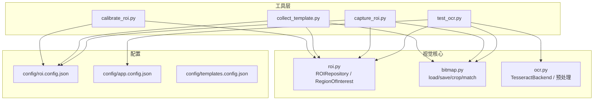
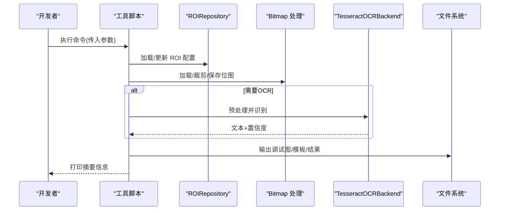
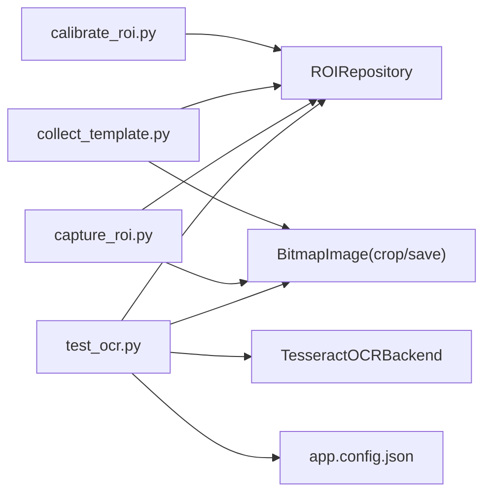

# 开发工具集

<cite>
**本文引用的文件**
- [tools/calibrate_roi.py](file://tools/calibrate_roi.py)
- [tools/collect_template.py](file://tools/collect_template.py)
- [tools/capture_roi.py](file://tools/capture_roi.py)
- [tools/test_ocr.py](file://tools/test_ocr.py)
- [src/vision/roi.py](file://src/vision/roi.py)
- [src/vision/bitmap.py](file://src/vision/bitmap.py)
- [src/vision/ocr.py](file://src/vision/ocr.py)
- [config/roi.config.json](file://config/roi.config.json)
- [config/app.config.json](file://config/app.config.json)
- [config/templates.config.json](file://config/templates.config.json)
- [README.md](file://README.md)
</cite>

## 目录
1. [简介](#简介)
2. [项目结构](#项目结构)
3. [核心组件](#核心组件)
4. [架构总览](#架构总览)
5. [详细组件分析](#详细组件分析)
6. [依赖关系分析](#依赖关系分析)
7. [性能与稳定性建议](#性能与稳定性建议)
8. [故障排查指南](#故障排查指南)
9. [结论](#结论)
10. [附录：命令行参数与输出格式](#附录命令行参数与输出格式)

## 简介
本指南面向使用本项目“开发工具集”的开发者，聚焦以下四个工具的完整使用方法与最佳实践：
- ROI 标定工具：calibrate_roi.py
- 模板采集工具：collect_template.py
- ROI 捕获工具：capture_roi.py
- OCR 测试工具：test_ocr.py

这些工具围绕“截图 → 区域裁切 → 预处理 → 识别/匹配”的视觉链路工作，配合配置文件（ROI、应用配置、模板配置）完成从屏幕区域选择、坐标校准到模板生成与OCR验证的全流程。

## 项目结构
- tools：提供可独立运行的命令行工具，用于标定ROI、采集模板、裁剪ROI、测试OCR。
- src/vision：视觉能力核心库，包含BMP读写与裁剪、模板匹配、OCR后端封装与图像预处理、ROI配置管理。
- config：运行时与视觉相关配置，包括ROI定义、应用运行参数、模板注册表、分辨率与环境约束。
- assets/templates/ui：存放UI模板位图。

图表来源
- [tools/calibrate_roi.py:14-42](file://tools/calibrate_roi.py#L14-L42)
- [tools/collect_template.py:15-37](file://tools/collect_template.py#L15-L37)
- [tools/capture_roi.py:15-37](file://tools/capture_roi.py#L15-L37)
- [tools/test_ocr.py:26-176](file://tools/test_ocr.py#L26-L176)
- [src/vision/roi.py:8-68](file://src/vision/roi.py#L8-L68)
- [src/vision/bitmap.py:17-201](file://src/vision/bitmap.py#L17-L201)
- [src/vision/ocr.py:23-280](file://src/vision/ocr.py#L23-L280)
- [config/roi.config.json:1-31](file://config/roi.config.json#L1-L31)
- [config/app.config.json:1-23](file://config/app.config.json#L1-L23)
- [config/templates.config.json:1-9](file://config/templates.config.json#L1-L9)

章节来源
- [README.md:92-124](file://README.md#L92-L124)

## 核心组件
- ROI 配置管理：通过 ROIRepository 加载/写入 ROI 配置，RegionOfInterest 描述名称、坐标与尺寸。
- 位图处理：支持BMP读取/写入、按ROI裁剪、灰度化、二值化、缩放与模板匹配。
- OCR 后端：封装 Tesseract 调用，提供灰度/二值预处理、OTSU阈值分割、结果解析与置信度计算。
- 工具编排：各工具以命令行参数驱动，串联上述能力，输出调试图、模板或识别结果。

章节来源
- [src/vision/roi.py:8-68](file://src/vision/roi.py#L8-L68)
- [src/vision/bitmap.py:17-201](file://src/vision/bitmap.py#L17-L201)
- [src/vision/ocr.py:23-280](file://src/vision/ocr.py#L23-L280)

## 架构总览
工具层通过配置与视觉核心协作，形成“输入图像/窗口 → ROI 裁切 → 预处理 → OCR/匹配 → 输出结果/调试图”的稳定流水线。所有工具均支持最小依赖与可插拔配置，便于在固定环境下进行平台可行性验证与迭代优化。

图表来源
- [tools/test_ocr.py:57-176](file://tools/test_ocr.py#L57-L176)
- [src/vision/roi.py:21-68](file://src/vision/roi.py#L21-L68)
- [src/vision/bitmap.py:17-201](file://src/vision/bitmap.py#L17-L201)
- [src/vision/ocr.py:23-70](file://src/vision/ocr.py#L23-L70)

## 详细组件分析

### ROI 标定工具：calibrate_roi.py
用途
- 写入或更新一个 ROI 标定配置，用于后续裁剪、模板采集与OCR定位。

关键流程
- 解析命令行参数（ROI配置文件路径、名称、坐标与尺寸、可选说明）。
- 构建 RegionOfInterest 对象并通过 ROIRepository.upsert 持久化到 JSON 配置。
- 标准输出包含保存摘要，便于集成到批处理或自动化脚本。

典型用法
- 先通过截图工具获取目标窗口画面，再根据像素坐标设置左上角X/Y、宽度width、高度height，最后写入 roi.config.json。

注意事项
- 坐标基于BMP坐标系（左上角为原点），需与实际截图分辨率一致。
- 若覆盖已有同名ROI，将替换其坐标与说明。

章节来源
- [tools/calibrate_roi.py:14-42](file://tools/calibrate_roi.py#L14-L42)
- [src/vision/roi.py:8-68](file://src/vision/roi.py#L8-L68)
- [config/roi.config.json:1-31](file://config/roi.config.json#L1-L31)

### 模板采集工具：collect_template.py
用途
- 从一张截图中按指定ROI裁切出模板，并保存到模板目录，供后续模板匹配使用。

操作流程
- 读取ROI配置，加载输入截图（要求BMP），按ROI坐标裁剪得到模板位图。
- 保存模板位图到指定输出路径。
- 输出模板绑定的ROI名称与最终模板路径，便于后续注册模板配置。

命名规范建议
- 模板文件名建议使用“业务语义_场景_时间戳.bmp”，例如 hideout_anchor_20240101_120000.bmp。
- 模板应尽可能清晰、稳定，避免包含动态元素（如闪烁光标、滚动条）。

质量评估要点
- 模板应在不同帧中保持稳定；建议在多张截图上验证一致性。
- 结合模板匹配阈值（见 app.config.json 中的 platform_validation.template_match_threshold）评估匹配稳定性。

章节来源
- [tools/collect_template.py:15-37](file://tools/collect_template.py#L15-L37)
- [src/vision/bitmap.py:17-115](file://src/vision/bitmap.py#L17-L115)
- [config/templates.config.json:1-9](file://config/templates.config.json#L1-L9)
- [config/app.config.json:16-21](file://config/app.config.json#L16-L21)

### ROI 捕获工具：capture_roi.py
用途
- 从一张BMP截图中按ROI裁切并保存为新BMP，用于快速验证ROI是否准确、预览裁剪效果。

功能说明
- 读取ROI配置，加载输入截图，按ROI坐标裁剪后保存。
- 输出裁剪后的ROI路径，便于人工核对或作为OCR输入。

批量处理建议
- 可通过脚本循环遍历多个截图文件，对每个文件调用该工具，实现批量ROI裁剪。
- 建议配合日志记录，统计成功/失败数量与异常原因。

注意
- 当前工具仅处理单张BMP输入，不支持实时预览或窗口抓取。
- 若ROI越界会触发错误，请先用 calibrate_roi.py 校正坐标。

章节来源
- [tools/capture_roi.py:15-37](file://tools/capture_roi.py#L15-L37)
- [src/vision/bitmap.py:100-115](file://src/vision/bitmap.py#L100-L115)

### OCR 测试工具：test_ocr.py
用途
- 独立OCR测试工具：支持从已有BMP截图或实时窗口截图开始，经ROI裁切、预处理（灰度/二值）、Tesseract识别，输出文本、置信度与调试图路径。

工作流程
- 确定输入源：
  - 指定 --image 使用已有BMP截图；
  - 或通过 --window-title 查找窗口并截取客户端区域。
- 加载ROI配置，裁切目标区域。
- 预处理：
  - 生成原始ROI图、灰度图、二值图，并保存到调试目录。
- OCR识别：
  - 构造 TesseractOCRBackend，按语言与PSM模式识别灰度图与二值图。
  - 输出耗时、文本、置信度与是否有内容提示。
- 结果摘要：
  - 汇总ROI边界框、调试图目录、Tesseract命令、语言与PSM等。

调试与优化建议
- 使用 --dry-run 跳过实际OCR，仅验证截图与预处理链路。
- 调整 PSM 模式与语言，以获得更好的识别效果。
- 观察灰度/二值调试图，必要时重新标定ROI或调整预处理策略。

章节来源
- [tools/test_ocr.py:26-176](file://tools/test_ocr.py#L26-L176)
- [src/vision/ocr.py:23-70](file://src/vision/ocr.py#L23-L70)
- [src/vision/ocr.py:110-141](file://src/vision/ocr.py#L110-L141)
- [config/app.config.json:9-12](file://config/app.config.json#L9-L12)

## 依赖关系分析
- 工具与核心库耦合点：
  - calibrate_roi.py 依赖 ROIRepository 写入ROI配置。
  - collect_template.py 与 capture_roi.py 依赖 BitmapImage 的裁剪与保存。
  - test_ocr.py 依赖 OCR 后端与预处理函数，同时读取应用配置。
- 配置依赖：
  - roi.config.json 提供ROI定义。
  - app.config.json 提供OCR语言、PSM、Tesseract命令、窗口标题关键词等。
  - templates.config.json 提供模板注册信息（路径、绑定ROI、阈值）。

图表来源
- [tools/calibrate_roi.py:14-42](file://tools/calibrate_roi.py#L14-L42)
- [tools/collect_template.py:15-37](file://tools/collect_template.py#L15-L37)
- [tools/capture_roi.py:15-37](file://tools/capture_roi.py#L15-L37)
- [tools/test_ocr.py:26-176](file://tools/test_ocr.py#L26-L176)
- [src/vision/roi.py:21-68](file://src/vision/roi.py#L21-L68)
- [src/vision/bitmap.py:17-201](file://src/vision/bitmap.py#L17-L201)
- [src/vision/ocr.py:23-70](file://src/vision/ocr.py#L23-L70)
- [config/app.config.json:1-23](file://config/app.config.json#L1-L23)

章节来源
- [config/roi.config.json:1-31](file://config/roi.config.json#L1-L31)
- [config/templates.config.json:1-9](file://config/templates.config.json#L1-L9)

## 性能与稳定性建议
- 使用ROI裁剪减少搜索范围，避免全图暴力匹配带来的性能问题。
- 模板匹配采用纯Python实现，适合小ROI场景；大区域匹配应考虑分块或更高效的算法。
- OCR预处理采用灰度归一化与OTSU二值化，有助于提升识别鲁棒性。
- 在固定分辨率与窗口模式下运行，确保ROI坐标与模板有效性。
- 合理设置模板匹配阈值与OCR置信度阈值，平衡误识与漏识。

[本节为通用指导，不直接分析具体文件]

## 故障排查指南
常见问题与解决思路
- 输入图像不是BMP或压缩格式：
  - 现象：加载位图时报错。
  - 解决：确保输入为未压缩的24/32位BMP。
- ROI越界：
  - 现象：裁剪时报错或识别结果为空。
  - 解决：使用 calibrate_roi.py 重新标定ROI，确保坐标与截图尺寸一致。
- 找不到Tesseract：
  - 现象：OCR执行失败。
  - 解决：安装Tesseract或在 app.config.json 中配置 ocr_tesseract_cmd。
- 窗口标题未匹配：
  - 现象：无法找到目标窗口。
  - 解决：检查 --window-title 或 app.config.json 中的 window_title_keyword。
- 识别结果为空或置信度低：
  - 现象：OCR无文本或置信度低于预期。
  - 解决：调整PSM模式与语言；检查预处理图（灰度/二值）质量；必要时重新标定ROI。

章节来源
- [src/vision/bitmap.py:17-39](file://src/vision/bitmap.py#L17-L39)
- [src/vision/bitmap.py:100-115](file://src/vision/bitmap.py#L100-L115)
- [src/vision/ocr.py:23-70](file://src/vision/ocr.py#L23-L70)
- [tools/test_ocr.py:75-103](file://tools/test_ocr.py#L75-L103)

## 结论
本工具集围绕ROI标定、模板采集、ROI捕获与OCR测试形成闭环，能够在固定环境下高效完成视觉链路的开发与调试。建议遵循“先标定、再采集、后验证”的流程，逐步完善配置与模板，确保识别与匹配的稳定性与可重复性。

[本节为总结，不直接分析具体文件]

## 附录：命令行参数与输出格式

- calibrate_roi.py
  - 参数：
    - --roi-config：ROI配置文件路径
    - --name：ROI名称
    - --x：左上角X坐标
    - --y：左上角Y坐标
    - --width：宽度
    - --height：高度
    - --description：说明（可选）
  - 输出：
    - 标准输出包含 saved_roi=... 摘要，便于集成。

- collect_template.py
  - 参数：
    - --image：输入截图路径（BMP）
    - --roi-config：ROI配置文件路径
    - --roi-name：模板绑定的ROI名称
    - --output：模板输出路径
  - 输出：
    - 标准输出包含 template_roi=... 与 output=... 摘要。

- capture_roi.py
  - 参数：
    - --image：输入截图路径（BMP）
    - --roi-config：ROI配置文件路径
    - --roi-name：要裁切的ROI名称
    - --output：输出BMP路径
  - 输出：
    - 标准输出包含 roi=... 与 output=... 摘要。

- test_ocr.py
  - 参数：
    - --image：已有BMP截图路径（与 --window-title 互斥）
    - --window-title：窗口标题关键词（默认从 app.config.json 读取）
    - --roi-name：要识别的ROI名称（默认 debug_label）
    - --roi-config：ROI配置文件路径（默认 config/roi.config.json）
    - --app-config：应用配置路径（默认 config/app.config.json）
    - --tesseract-cmd：Tesseract可执行文件路径
    - --language：OCR语言（默认从 app.config.json 读取）
    - --psm：Tesseract PSM模式（默认从 app.config.json 读取）
    - --dry-run：仅验证截图与预处理链路，不调用Tesseract
    - --output-dir：调试图输出目录（默认 runtime/debug/ocr_test）
    - --save-screenshot：保存截图路径（不指定则保存到 output-dir）
  - 输出：
    - 标准输出包含耗时、文本、置信度、是否有内容提示以及结果摘要。
    - 调试图目录包含 raw、gray、binary 三张图，便于分析预处理效果。

章节来源
- [tools/calibrate_roi.py:14-42](file://tools/calibrate_roi.py#L14-L42)
- [tools/collect_template.py:15-37](file://tools/collect_template.py#L15-L37)
- [tools/capture_roi.py:15-37](file://tools/capture_roi.py#L15-L37)
- [tools/test_ocr.py:26-176](file://tools/test_ocr.py#L26-L176)
- [config/app.config.json:9-12](file://config/app.config.json#L9-L12)