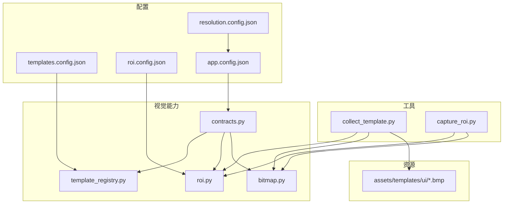
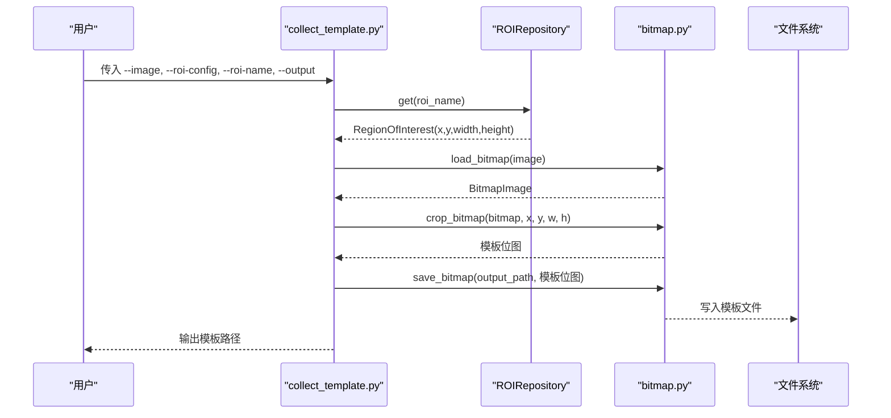
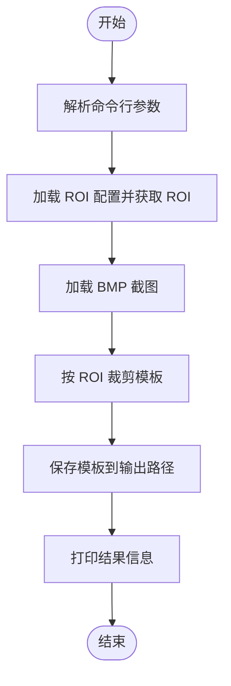
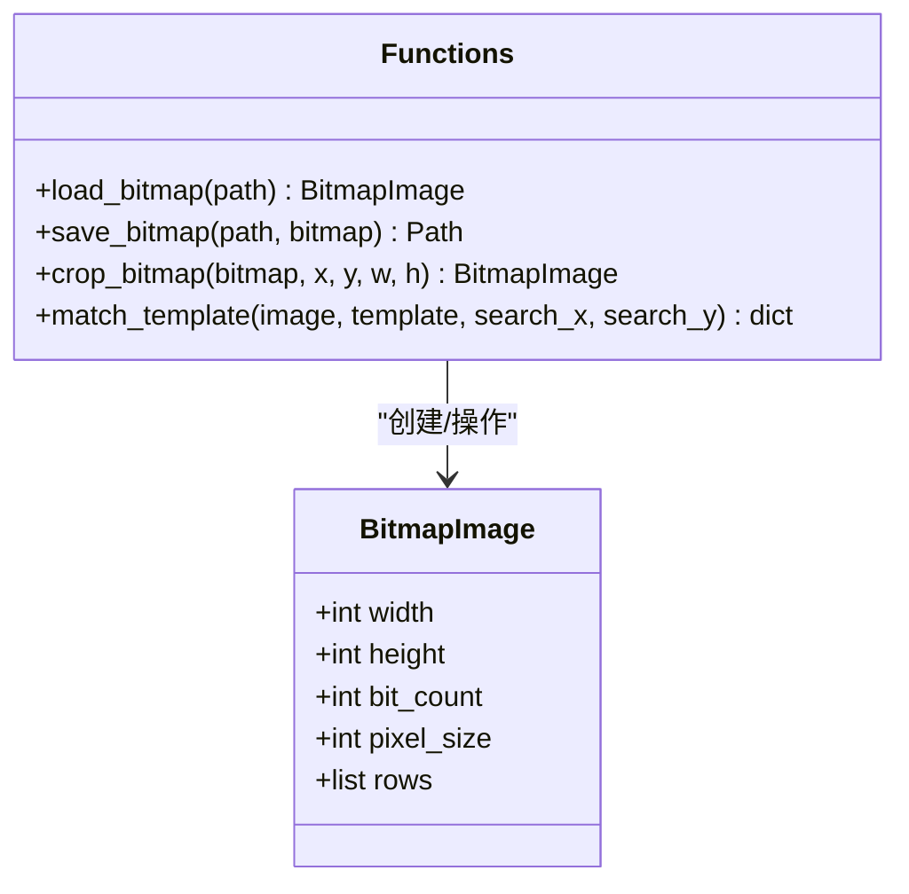
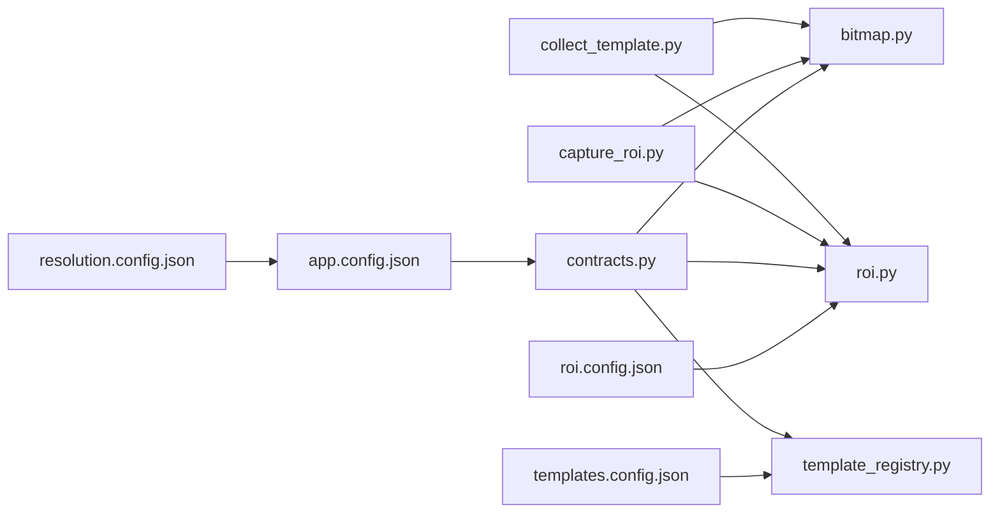

# 模板采集工具

<cite>
**本文引用的文件**
- [collect_template.py](file://tools/collect_template.py)
- [capture_roi.py](file://tools/capture_roi.py)
- [bitmap.py](file://src/vision/bitmap.py)
- [roi.py](file://src/vision/roi.py)
- [template_registry.py](file://src/vision/template_registry.py)
- [contracts.py](file://src/vision/contracts.py)
- [templates.config.json](file://config/templates.config.json)
- [roi.config.json](file://config/roi.config.json)
- [app.config.json](file://config/app.config.json)
- [resolution.config.json](file://config/resolution.config.json)
- [README.md](file://README.md)
</cite>

## 目录
1. [简介](#简介)
2. [项目结构](#项目结构)
3. [核心组件](#核心组件)
4. [架构总览](#架构总览)
5. [详细组件分析](#详细组件分析)
6. [依赖关系分析](#依赖关系分析)
7. [性能与质量考量](#性能与质量考量)
8. [故障排查指南](#故障排查指南)
9. [结论](#结论)
10. [附录：命令行参数与使用示例](#附录命令行参数与使用示例)

## 简介
本指南面向“模板采集工具”，目标是帮助你从游戏界面截图中按 ROI（感兴趣区域）提取 UI 元素模板，用于后续模板匹配识别。工具以 BMP 截图为输入，结合 ROI 配置裁剪出目标区域并保存为模板文件；配合模板注册表与阈值设置，可在运行时进行稳定识别。

该工具适用于固定分辨率、固定窗口模式、固定 UI 缩放等严格环境，确保模板在不同运行中保持一致性。

## 项目结构
与模板采集相关的关键路径如下：
- 工具脚本：tools/collect_template.py、tools/capture_roi.py
- 图像与 ROI 处理：src/vision/bitmap.py、src/vision/roi.py
- 模板注册与匹配：src/vision/template_registry.py、src/vision/contracts.py
- 配置文件：config/templates.config.json、config/roi.config.json、config/app.config.json、config/resolution.config.json
- 模板资源：assets/templates/ui/...（存放生成的模板文件）

图表来源
- [collect_template.py:15-37](file://tools/collect_template.py#L15-L37)
- [capture_roi.py:15-37](file://tools/capture_roi.py#L15-L37)
- [bitmap.py:17-115](file://src/vision/bitmap.py#L17-L115)
- [roi.py:8-68](file://src/vision/roi.py#L8-L68)
- [template_registry.py:8-44](file://src/vision/template_registry.py#L8-L44)
- [contracts.py:119-185](file://src/vision/contracts.py#L119-L185)
- [templates.config.json:1-9](file://config/templates.config.json#L1-L9)
- [roi.config.json:1-31](file://config/roi.config.json#L1-L31)
- [app.config.json:1-23](file://config/app.config.json#L1-L23)
- [resolution.config.json:1-8](file://config/resolution.config.json#L1-L8)

章节来源
- [collect_template.py:15-37](file://tools/collect_template.py#L15-L37)
- [capture_roi.py:15-37](file://tools/capture_roi.py#L15-L37)
- [bitmap.py:17-115](file://src/vision/bitmap.py#L17-L115)
- [roi.py:8-68](file://src/vision/roi.py#L8-L68)
- [template_registry.py:8-44](file://src/vision/template_registry.py#L8-L44)
- [contracts.py:119-185](file://src/vision/contracts.py#L119-L185)
- [templates.config.json:1-9](file://config/templates.config.json#L1-L9)
- [roi.config.json:1-31](file://config/roi.config.json#L1-L31)
- [app.config.json:1-23](file://config/app.config.json#L1-L23)
- [resolution.config.json:1-8](file://config/resolution.config.json#L1-L8)

## 核心组件
- collect_template.py：命令行入口，读取截图与 ROI 配置，裁剪并保存模板。
- capture_roi.py：辅助工具，从一张 BMP 截图中按 ROI 裁切并输出新 BMP，便于调试或二次加工。
- bitmap.py：BMP 图像的加载、保存、裁剪与基础模板匹配实现。
- roi.py：ROI 配置的加载、查询与持久化。
- template_registry.py：模板定义与路径解析，供运行时匹配器使用。
- contracts.py：Windows 平台下的模板匹配器，负责将模板与截图在指定 ROI 内匹配。

章节来源
- [collect_template.py:15-37](file://tools/collect_template.py#L15-L37)
- [capture_roi.py:15-37](file://tools/capture_roi.py#L15-L37)
- [bitmap.py:17-115](file://src/vision/bitmap.py#L17-L115)
- [roi.py:8-68](file://src/vision/roi.py#L8-L68)
- [template_registry.py:8-44](file://src/vision/template_registry.py#L8-L44)
- [contracts.py:119-185](file://src/vision/contracts.py#L119-L185)

## 架构总览
模板采集流程由“截图 → ROI 裁剪 → 模板保存”构成，随后通过模板注册表与匹配器在运行时进行识别。

图表来源
- [collect_template.py:26-37](file://tools/collect_template.py#L26-L37)
- [roi.py:21-46](file://src/vision/roi.py#L21-L46)
- [bitmap.py:17-115](file://src/vision/bitmap.py#L17-L115)

## 详细组件分析

### collect_template.py：模板采集入口
- 功能：解析命令行参数，加载 ROI 配置，读取截图并按 ROI 裁剪，保存为模板文件。
- 关键参数：
  - --image：输入截图路径（当前要求为 BMP）。
  - --roi-config：ROI 配置文件路径。
  - --roi-name：要使用的 ROI 名称。
  - --output：模板输出路径。
- 执行流程：
  - 构建参数解析器并解析参数。
  - 通过 ROIRepository 获取 ROI 坐标。
  - 加载截图位图，调用裁剪函数得到模板位图。
  - 保存模板位图到指定路径。
  - 打印模板 ROI 名称与输出路径。

图表来源
- [collect_template.py:15-37](file://tools/collect_template.py#L15-L37)

章节来源
- [collect_template.py:15-37](file://tools/collect_template.py#L15-L37)

### capture_roi.py：ROI 裁切辅助工具
- 功能：从一张 BMP 截图中按 ROI 裁切并保存为新 BMP，便于调试或二次处理。
- 关键参数：
  - --image：输入截图路径（BMP）。
  - --roi-config：ROI 配置文件路径。
  - --roi-name：要裁切的 ROI 名称。
  - --output：输出 BMP 文件路径。
- 适用场景：当需要验证 ROI 是否准确覆盖目标 UI 时，可快速生成裁剪结果查看。

章节来源
- [capture_roi.py:15-37](file://tools/capture_roi.py#L15-L37)

### bitmap.py：BMP 图像处理与模板匹配
- 加载与保存：
  - 仅支持未压缩的 24/32 位 BMP。
  - 自动处理行对齐与方向，统一自上而下存储。
- 裁剪：
  - 校验 ROI 参数合法性与边界，防止越界。
- 模板匹配：
  - 纯 Python 实现的灰度相似度计算，适合小 ROI 与小模板的快速验证。
  - 返回置信度与边界框，供上层判断是否匹配成功。

图表来源
- [bitmap.py:8-115](file://src/vision/bitmap.py#L8-L115)
- [bitmap.py:118-201](file://src/vision/bitmap.py#L118-L201)

章节来源
- [bitmap.py:17-115](file://src/vision/bitmap.py#L17-L115)
- [bitmap.py:118-201](file://src/vision/bitmap.py#L118-L201)

### roi.py：ROI 配置管理
- 数据结构：RegionOfInterest，包含名称、坐标、尺寸与描述。
- 仓库能力：
  - 加载全部 ROI 配置。
  - 按名称获取单个 ROI。
  - 更新并持久化 ROI 配置为 JSON。
- 错误处理：未找到 ROI 名称时抛出异常，便于快速定位配置问题。

章节来源
- [roi.py:8-68](file://src/vision/roi.py#L8-L68)

### template_registry.py：模板注册表
- 作用：根据模板名称解析模板文件路径、绑定 ROI 名称与匹配阈值。
- 行为：
  - 若配置不存在或未找到模板定义，抛出相应异常。
  - 若模板文件不存在，抛出文件未找到异常。
- 运行时使用：WindowsTemplateMatcher 会据此加载模板并在 ROI 范围内进行匹配。

章节来源
- [template_registry.py:8-44](file://src/vision/template_registry.py#L8-L44)

### contracts.py：Windows 模板匹配器
- 作用：将模板与截图在指定 ROI 内进行匹配，返回检测结果（是否找到、置信度、边界框等）。
- 关键点：
  - 从模板注册表获取模板定义。
  - 加载截图与模板位图。
  - 可选按 ROI 缩小搜索范围，提升性能与稳定性。
  - 使用 bitmap.match_template 计算相似度并判断是否超过阈值。

章节来源
- [contracts.py:119-185](file://src/vision/contracts.py#L119-L185)

## 依赖关系分析
- collect_template.py 依赖：
  - ROIRepository（roi.py）：读取 ROI 坐标。
  - bitmap 模块（bitmap.py）：加载、裁剪、保存 BMP。
- capture_roi.py 依赖：
  - 同上，用于裁切 ROI 并输出。
- 运行时匹配依赖：
  - WindowsTemplateMatcher（contracts.py）依赖 TemplateRegistry（template_registry.py）、ROIRepository（roi.py）、bitmap 模块。
- 配置依赖：
  - templates.config.json：模板定义（路径、ROI 绑定、阈值、描述）。
  - roi.config.json：ROI 坐标与描述。
  - app.config.json：全局配置（模板根目录、模板配置路径、ROI 配置路径、OCR 与平台参数）。
  - resolution.config.json：分辨率与窗口模式等显示设置。

图表来源
- [collect_template.py:11-12](file://tools/collect_template.py#L11-L12)
- [capture_roi.py:11-12](file://tools/capture_roi.py#L11-L12)
- [contracts.py:119-185](file://src/vision/contracts.py#L119-L185)
- [template_registry.py:17-44](file://src/vision/template_registry.py#L17-L44)
- [roi.py:21-68](file://src/vision/roi.py#L21-L68)
- [templates.config.json:1-9](file://config/templates.config.json#L1-L9)
- [roi.config.json:1-31](file://config/roi.config.json#L1-L31)
- [app.config.json:1-23](file://config/app.config.json#L1-L23)
- [resolution.config.json:1-8](file://config/resolution.config.json#L1-L8)

章节来源
- [collect_template.py:11-12](file://tools/collect_template.py#L11-L12)
- [capture_roi.py:11-12](file://tools/capture_roi.py#L11-L12)
- [contracts.py:119-185](file://src/vision/contracts.py#L119-L185)
- [template_registry.py:17-44](file://src/vision/template_registry.py#L17-L44)
- [roi.py:21-68](file://src/vision/roi.py#L21-L68)
- [templates.config.json:1-9](file://config/templates.config.json#L1-L9)
- [roi.config.json:1-31](file://config/roi.config.json#L1-L31)
- [app.config.json:1-23](file://config/app.config.json#L1-L23)
- [resolution.config.json:1-8](file://config/resolution.config.json#L1-L8)

## 性能与质量考量
- 输入格式限制：
  - 仅支持未压缩的 24/32 位 BMP。其他格式会被拒绝。
- ROI 裁剪性能：
  - 裁剪操作基于内存中的像素行切片，时间复杂度与 ROI 面积线性相关。
- 模板匹配性能：
  - 当前为纯 Python 暴力匹配，适合小 ROI 与小模板；在大图上全图扫描较慢。
  - 建议在运行时通过 ROI 缩小搜索范围以提升性能与稳定性。
- 模板质量评估标准：
  - 清晰度：模板应来自清晰、无模糊的截图；避免运动模糊、特效遮挡。
  - 大小：模板不宜过大，建议仅包含必要 UI 元素，减少误匹配概率。
  - 格式：统一使用 BMP 格式，保证像素一致性与兼容性。
  - 阈值：在模板注册表中设置合适的匹配阈值（例如 0.95），过低易误匹配，过高可能漏匹配。
- 分辨率与窗口模式：
  - 保持固定分辨率与窗口模式，避免模板因缩放或布局变化失效。

章节来源
- [bitmap.py:17-39](file://src/vision/bitmap.py#L17-L39)
- [bitmap.py:118-201](file://src/vision/bitmap.py#L118-L201)
- [template_registry.py:17-44](file://src/vision/template_registry.py#L17-L44)
- [contracts.py:119-185](file://src/vision/contracts.py#L119-L185)
- [resolution.config.json:1-8](file://config/resolution.config.json#L1-L8)

## 故障排查指南
- 截图模糊：
  - 原因：游戏特效、动态模糊或截图时机不当。
  - 解决：选择静态界面截图；降低特效；确保截图时画面静止。
- ROI 选择不当：
  - 现象：裁剪区域未覆盖目标 UI 或超出图像边界。
  - 解决：使用 capture_roi.py 快速验证 ROI；调整 roi.config.json 中的坐标与尺寸。
- 模板不匹配：
  - 现象：匹配置信度低于阈值。
  - 解决：重新采集更清晰的模板；检查模板尺寸与 ROI；适当调整阈值。
- 文件格式不支持：
  - 现象：非 BMP 或压缩 BMP 被拒绝。
  - 解决：转换为未压缩的 24/32 位 BMP。
- 配置缺失或错误：
  - 现象：未找到 ROI 名称或模板定义。
  - 解决：核对 roi.config.json 与 templates.config.json；确保模板文件存在。

章节来源
- [roi.py:21-46](file://src/vision/roi.py#L21-L46)
- [template_registry.py:22-35](file://src/vision/template_registry.py#L22-L35)
- [bitmap.py:17-39](file://src/vision/bitmap.py#L17-L39)
- [bitmap.py:100-115](file://src/vision/bitmap.py#L100-L115)

## 结论
模板采集工具通过“截图 → ROI 裁剪 → 模板保存”的简单流程，为后续模板匹配提供高质量模板。配合 ROI 配置与模板注册表，可在固定环境下实现稳定的 UI 识别。建议始终使用 BMP 格式、固定分辨率与窗口模式，并通过 ROI 缩小搜索范围以提升性能与可靠性。

## 附录：命令行参数与使用示例

### collect_template.py 参数说明
- --image：输入截图路径（BMP）。
- --roi-config：ROI 配置文件路径。
- --roi-name：要使用的 ROI 名称。
- --output：模板输出路径。

### 完整操作流程
1. 启动工具：
   - 在项目根目录下执行 collect_template.py，传入必要的参数。
2. 准备截图：
   - 使用系统截图或工具截取游戏窗口画面，保存为 BMP。
3. 配置 ROI：
   - 在 roi.config.json 中定义或调整 ROI 坐标与尺寸。
4. 执行采集：
   - 运行命令，传入截图路径、ROI 配置、ROI 名称与输出路径。
5. 保存模板：
   - 工具将裁剪出的模板保存到指定路径。
6. 注册模板：
   - 在 templates.config.json 中添加模板定义，包括路径、绑定的 ROI 名称与匹配阈值。
7. 运行匹配：
   - 使用 WindowsTemplateMatcher 在运行时对截图进行模板匹配。

### 实际使用示例
- 基本采集：
  - python tools/collect_template.py --image "runtime/screenshots/sample.bmp" --roi-config "config/roi.config.json" --roi-name "hideout_anchor" --output "assets/templates/ui/hideout_anchor.bmp"
- 辅助裁切：
  - python tools/capture_roi.py --image "runtime/screenshots/sample.bmp" --roi-config "config/roi.config.json" --roi-name "debug_label" --output "runtime/debug/cropped_debug.bmp"

### 常见问题与解决方案
- 截图模糊：
  - 重新截取静态界面；关闭不必要的特效；确保截图时画面静止。
- ROI 越界：
  - 使用 capture_roi.py 验证裁剪结果；调整 roi.config.json 中的坐标与尺寸。
- 模板不匹配：
  - 重新采集模板；检查模板尺寸与 ROI；调整模板注册表中的阈值。
- 文件格式错误：
  - 转换为未压缩的 24/32 位 BMP。
- 配置缺失：
  - 核对 roi.config.json 与 templates.config.json；确保模板文件存在。

章节来源
- [collect_template.py:15-37](file://tools/collect_template.py#L15-L37)
- [capture_roi.py:15-37](file://tools/capture_roi.py#L15-L37)
- [roi.config.json:1-31](file://config/roi.config.json#L1-L31)
- [templates.config.json:1-9](file://config/templates.config.json#L1-L9)
- [bitmap.py:17-39](file://src/vision/bitmap.py#L17-L39)
- [bitmap.py:100-115](file://src/vision/bitmap.py#L100-L115)
- [template_registry.py:17-44](file://src/vision/template_registry.py#L17-L44)
- [contracts.py:119-185](file://src/vision/contracts.py#L119-L185)