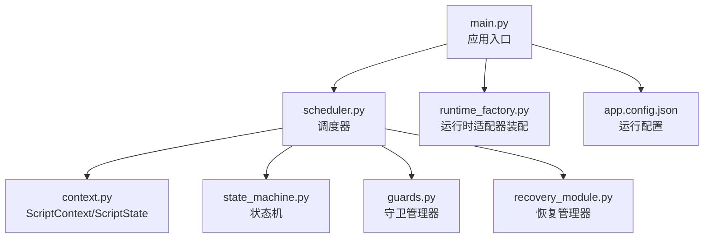
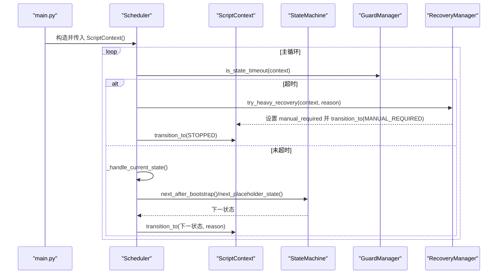
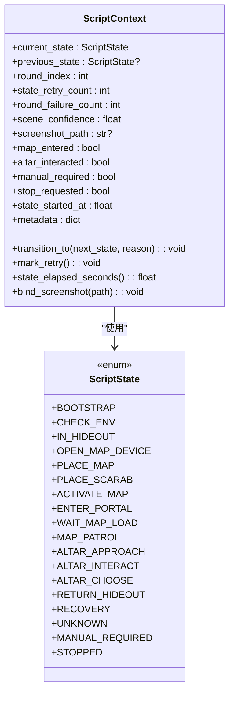
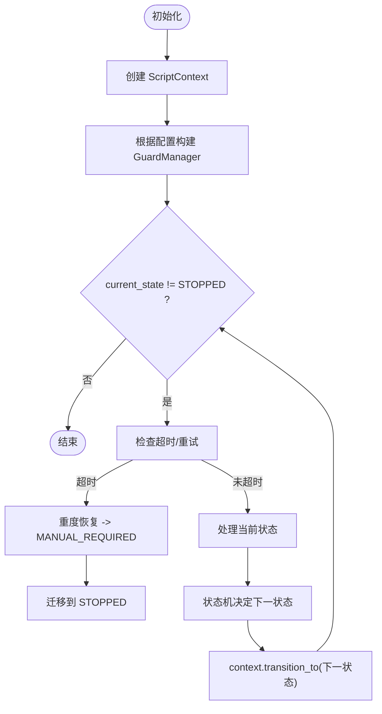
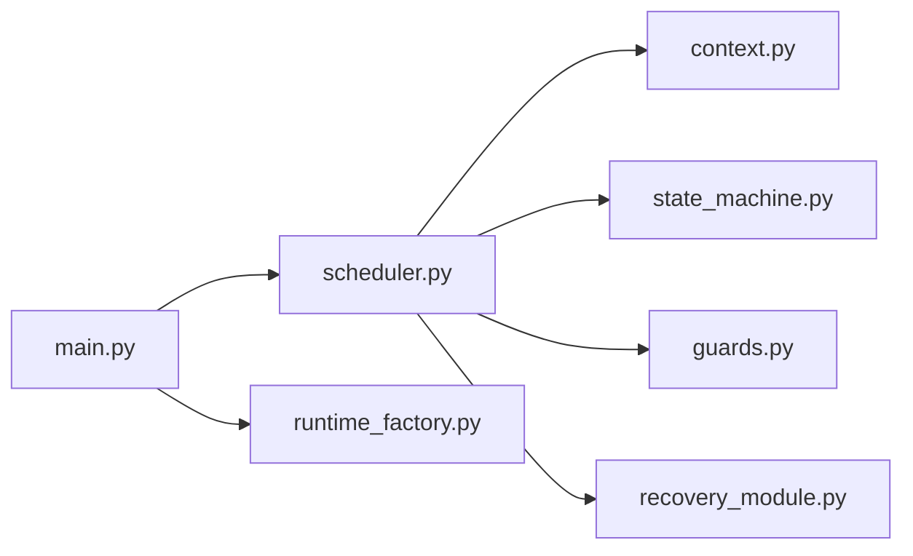

# 上下文管理

<cite>
**本文引用的文件**
- [src/core/context.py](file://src/core/context.py)
- [src/core/scheduler.py](file://src/core/scheduler.py)
- [src/core/state_machine.py](file://src/core/state_machine.py)
- [src/core/guards.py](file://src/core/guards.py)
- [src/modules/recovery_module.py](file://src/modules/recovery_module.py)
- [src/main.py](file://src/main.py)
- [config/app.config.json](file://config/app.config.json)
</cite>

## 目录
1. [简介](#简介)
2. [项目结构](#项目结构)
3. [核心组件](#核心组件)
4. [架构总览](#架构总览)
5. [详细组件分析](#详细组件分析)
6. [依赖关系分析](#依赖关系分析)
7. [性能与并发考虑](#性能与并发考虑)
8. [故障排查指南](#故障排查指南)
9. [结论](#结论)
10. [附录：扩展与最佳实践](#附录：扩展与最佳实践)

## 简介
本技术文档聚焦于“上下文管理”能力，围绕 ScriptContext 类与 ScriptState 枚举展开，系统阐述脚本执行上下文的维护与管理机制、生命周期（初始化、更新、销毁）、数据安全性与线程安全考量，并给出跨模块共享与执行上下文数据的示例路径、扩展方式以及常见问题解决方案。该上下文是调度器驱动状态机运行的核心载体，贯穿环境校验、地图装置流程、祭坛交互与恢复策略等关键阶段。

## 项目结构
本项目采用按职责划分的分层组织方式：
- core：核心运行时能力，包含上下文、状态机、守卫、调度器等
- modules：业务模块，如平台校验、恢复管理
- utils：通用工具（日志、系统 API）
- vision/input：视觉与输入适配层（通过工厂装配）
- config：运行配置
- main：应用入口，负责装配与启动

图表来源
- [src/main.py:22-50](file://src/main.py#L22-L50)
- [src/core/scheduler.py:13-47](file://src/core/scheduler.py#L13-L47)
- [src/core/context.py:10-61](file://src/core/context.py#L10-L61)
- [src/core/state_machine.py:6-41](file://src/core/state_machine.py#L6-L41)
- [src/core/guards.py:6-15](file://src/core/guards.py#L6-L15)
- [src/modules/recovery_module.py:6-19](file://src/modules/recovery_module.py#L6-L19)
- [config/app.config.json:1-23](file://config/app.config.json#L1-L23)

章节来源
- [src/main.py:22-50](file://src/main.py#L22-L50)
- [config/app.config.json:1-23](file://config/app.config.json#L1-L23)

## 核心组件
- ScriptState：定义脚本执行的离散状态集合，覆盖从引导、环境检查、地图装置到祭坛交互、恢复与停止的完整流程。
- ScriptContext：承载当前状态、上一状态、重试计数、失败计数、场景置信度、截图路径、流程标记位、人工接管标志、停止请求、状态计时与元数据等。提供状态迁移、重试标记、耗时计算与截图绑定等能力。
- Scheduler：主循环驱动，基于守卫条件（超时/重试耗尽）与状态机决策，协调上下文状态流转与恢复策略。
- StateMachine：根据上下文与配置决定下一状态，支持干跑模式下的顺序推进。
- GuardManager：基于上下文提供的计时与重试计数，判断是否触发恢复或终止。
- RecoveryManager：提供多级恢复策略，并在重度恢复时设置人工接管并转入相应状态。

章节来源
- [src/core/context.py:10-61](file://src/core/context.py#L10-L61)
- [src/core/scheduler.py:13-47](file://src/core/scheduler.py#L13-L47)
- [src/core/state_machine.py:6-41](file://src/core/state_machine.py#L6-L41)
- [src/core/guards.py:6-15](file://src/core/guards.py#L6-L15)
- [src/modules/recovery_module.py:6-19](file://src/modules/recovery_module.py#L6-L19)

## 架构总览
上下文在调度器的驱动下，配合状态机与守卫进行状态演进；当出现异常或超时，恢复管理器介入并可能将流程切换至人工接管或停止。

图表来源
- [src/main.py:22-50](file://src/main.py#L22-L50)
- [src/core/scheduler.py:32-55](file://src/core/scheduler.py#L32-L55)
- [src/core/state_machine.py:6-41](file://src/core/state_machine.py#L6-L41)
- [src/core/guards.py:11-15](file://src/core/guards.py#L11-L15)
- [src/modules/recovery_module.py:15-19](file://src/modules/recovery_module.py#L15-L19)
- [src/core/context.py:47-58](file://src/core/context.py#L47-L58)

## 详细组件分析

### ScriptState 枚举与业务含义
- BOOTSTRAP：引导阶段，准备进入环境校验。
- CHECK_ENV：平台与环境校验阶段。
- IN_HIDEOUT：位于避难所，作为地图装置流程起点。
- OPEN_MAP_DEVICE / PLACE_MAP / PLACE_SCARAB / ACTIVATE_MAP：打开地图设备、放置地图、放置圣甲虫、激活地图。
- ENTER_PORTAL / WAIT_MAP_LOAD：进入传送门与等待地图加载。
- MAP_PATROL：地图巡逻阶段。
- ALTAR_APPROACH / ALTAR_INTERACT / ALTAR_CHOOSE：接近祭坛、交互、选择祭坛效果。
- RETURN_HIDEOUT：返回避难所。
- RECOVERY：恢复阶段（由恢复管理器驱动）。
- UNKNOWN：未知状态，用于兜底。
- MANUAL_REQUIRED：需要人工接管。
- STOPPED：已停止。

章节来源
- [src/core/context.py:10-28](file://src/core/context.py#L10-L28)

### ScriptContext 设计与实现要点
- 状态字段：current_state、previous_state，记录当前与上一状态，便于回溯与审计。
- 计数与置信度：round_index、state_retry_count、round_failure_count、scene_confidence，支撑重试与质量评估。
- 流程标记：map_entered、altar_interacted、manual_required、stop_requested，表达业务流程关键点。
- 截图关联：screenshot_path，便于问题定位与调试。
- 时间度量：state_started_at、state_elapsed_seconds()，用于守卫超时判定。
- 元数据：metadata，用于跨模块传递诊断信息（如恢复原因、最后迁移原因等）。
- 方法：transition_to() 统一封装状态迁移逻辑，重置重试计数与开始时间，并记录迁移原因；mark_retry() 递增重试计数；bind_screenshot() 绑定截图路径。

图表来源
- [src/core/context.py:10-61](file://src/core/context.py#L10-L61)

章节来源
- [src/core/context.py:31-61](file://src/core/context.py#L31-L61)

### 生命周期管理：初始化、更新、销毁
- 初始化
  - 应用入口创建 ScriptContext 实例，并注入到 Scheduler。
  - 配置项（最大重试次数、状态超时秒数）通过 app.config.json 读取，用于构建 GuardManager。
- 更新
  - 调度器主循环中，先检查守卫条件（超时/重试耗尽），再处理当前状态。
  - 状态处理委托给状态机，得到下一状态后调用 context.transition_to() 完成迁移。
  - 若进入 MANUAL_REQUIRED，则进一步迁移到 STOPPED 并结束主循环。
- 销毁
  - 当 current_state == STOPPED 时，主循环退出，上下文不再被调度器消费。
  - 建议在外部资源清理阶段显式释放截图、日志等资源（当前代码未内置析构逻辑）。

图表来源
- [src/main.py:22-50](file://src/main.py#L22-L50)
- [src/core/scheduler.py:32-55](file://src/core/scheduler.py#L32-L55)
- [src/core/guards.py:11-15](file://src/core/guards.py#L11-L15)
- [src/core/state_machine.py:6-41](file://src/core/state_machine.py#L6-L41)
- [src/core/context.py:47-58](file://src/core/context.py#L47-L58)
- [config/app.config.json:1-23](file://config/app.config.json#L1-L23)

章节来源
- [src/main.py:22-50](file://src/main.py#L22-L50)
- [src/core/scheduler.py:32-55](file://src/core/scheduler.py#L32-L55)
- [config/app.config.json:1-23](file://config/app.config.json#L1-L23)

### 上下文数据的安全性与线程安全
- 单线程模型：当前调度器以单循环驱动状态机，所有对 ScriptContext 的读写均发生在同一线程内，因此不存在竞态条件。
- 原子性：transition_to() 在同一方法内完成 previous/current 状态更新、重试计数重置、时间戳更新与元数据写入，保证迁移的一致性。
- 可观测性：通过 metadata 与 state_elapsed_seconds() 暴露诊断信息，便于监控与排障。
- 建议：若未来引入多线程或多进程，应增加锁或不可变快照机制，避免并发写冲突。

章节来源
- [src/core/context.py:47-58](file://src/core/context.py#L47-L58)
- [src/core/scheduler.py:32-55](file://src/core/scheduler.py#L32-L55)

### 跨模块共享与执行上下文数据
- 共享方式：Scheduler 持有唯一 ScriptContext 实例，并通过参数传递给各模块（如 RecoveryManager、PlatformValidator 等），形成“单一上下文源”。
- 典型用法
  - 恢复管理器：在 recovery_module 中将恢复原因写入 context.metadata，并在重度恢复时设置 manual_required 并迁移状态。
  - 平台校验：在 env_module 中捕获错误与建议步骤，结合上下文进行后续流程控制。
  - 截图绑定：在需要时调用 bind_screenshot() 记录截图路径，辅助问题定位。

章节来源
- [src/modules/recovery_module.py:6-19](file://src/modules/recovery_module.py#L6-L19)
- [src/modules/env_module.py:23-88](file://src/modules/env_module.py#L23-L88)
- [src/core/context.py:60-61](file://src/core/context.py#L60-L61)

### 扩展上下文以支持新业务需求
- 新增流程标记：在 ScriptContext 中添加布尔字段（例如 map_completed、portal_entered），并在对应状态处理完成后置位。
- 新增元数据键：通过 metadata 字典传递临时诊断信息（如 last_match_score、last_ocr_text），避免频繁修改接口。
- 新增状态：在 ScriptState 中追加新状态，并在 StateMachine 中补充跳转逻辑。
- 新增守卫规则：在 GuardManager 中增加新的判定条件（如置信度阈值），并在 Scheduler 主循环中集成。

章节来源
- [src/core/context.py:31-61](file://src/core/context.py#L31-L61)
- [src/core/state_machine.py:6-41](file://src/core/state_machine.py#L6-L41)
- [src/core/guards.py:6-15](file://src/core/guards.py#L6-L15)

## 依赖关系分析
- Scheduler 依赖 ScriptContext、StateMachine、GuardManager、RecoveryManager 与 PlatformValidator。
- StateMachine 依赖 ScriptContext 与 ScriptState。
- GuardManager 依赖 ScriptContext 的时间与重试计数。
- RecoveryManager 依赖 ScriptContext 与 ScriptState 进行恢复与状态迁移。
- main 负责装配 RuntimeAdapters 并创建 Scheduler，从而间接依赖上述组件。

图表来源
- [src/main.py:22-50](file://src/main.py#L22-L50)
- [src/core/scheduler.py:13-47](file://src/core/scheduler.py#L13-L47)
- [src/core/context.py:10-61](file://src/core/context.py#L10-L61)
- [src/core/state_machine.py:6-41](file://src/core/state_machine.py#L6-L41)
- [src/core/guards.py:6-15](file://src/core/guards.py#L6-L15)
- [src/modules/recovery_module.py:6-19](file://src/modules/recovery_module.py#L6-L19)
- [src/core/runtime_factory.py:30-77](file://src/core/runtime_factory.py#L30-L77)

章节来源
- [src/core/scheduler.py:13-47](file://src/core/scheduler.py#L13-L47)
- [src/core/runtime_factory.py:30-77](file://src/core/runtime_factory.py#L30-L77)

## 性能与并发考虑
- 性能
  - ScriptContext 使用 dataclass(slots=True)，减少内存占用与属性访问开销。
  - 使用 monotonic 时间测量状态持续时间，避免系统时钟回拨影响。
  - 状态迁移集中化，降低分散更新的复杂度。
- 并发
  - 当前为单线程调度，无并发写风险。
  - 若未来引入多线程，需为 ScriptContext 增加互斥锁或使用不可变快照，确保 transition_to() 的原子性与可见性。

[本节为通用指导，不直接分析具体文件]

## 故障排查指南
- 状态超时
  - 现象：调度器检测到状态超过配置的 state_timeout_sec 秒。
  - 处理：触发重度恢复，设置 manual_required 并迁移至 MANUAL_REQUIRED，随后停止。
  - 排查：查看 context.metadata["recovery_reason"] 与日志输出。
- 重试耗尽
  - 现象：state_retry_count 达到 max_state_retry。
  - 处理：可在后续扩展中触发恢复或降级策略。
- 人工接管
  - 现象：进入 MANUAL_REQUIRED。
  - 处理：检查上下文中的截图路径与元数据，确认是否需要人工干预。
- 截图缺失
  - 现象：screenshot_path 为空。
  - 处理：检查截图链路是否正常，必要时在 env_module 中捕获并记录错误。

章节来源
- [src/core/scheduler.py:32-47](file://src/core/scheduler.py#L32-L47)
- [src/core/guards.py:11-15](file://src/core/guards.py#L11-L15)
- [src/modules/recovery_module.py:15-19](file://src/modules/recovery_module.py#L15-L19)
- [src/core/context.py:47-61](file://src/core/context.py#L47-L61)

## 结论
ScriptContext 作为脚本执行的核心载体，提供了清晰的状态管理与元数据记录能力；配合 Scheduler、StateMachine、GuardManager 与 RecoveryManager，实现了健壮的流程控制与恢复机制。当前实现为单线程模型，具备良好的一致性与可观测性。未来如需扩展多线程或更复杂的业务流，可在保持现有接口稳定的基础上，逐步增强并发安全与状态管理能力。

[本节为总结，不直接分析具体文件]

## 附录：扩展与最佳实践
- 最佳实践
  - 始终通过 transition_to() 进行状态迁移，避免直接修改 current_state。
  - 在关键节点调用 mark_retry() 与 bind_screenshot()，提升可观测性。
  - 使用 metadata 传递诊断信息，避免污染核心字段。
  - 在配置中合理设置 max_state_retry 与 state_timeout_sec，平衡鲁棒性与响应速度。
- 常见扩展
  - 新增状态：在 ScriptState 添加枚举值，并在 StateMachine 中补充跳转逻辑。
  - 新增流程标记：在 ScriptContext 添加布尔字段，并在对应状态完成后置位。
  - 新增守卫规则：在 GuardManager 增加判定条件，并在 Scheduler 主循环中集成。
- 示例路径（不展示代码内容）
  - 在恢复管理器中记录恢复原因并迁移状态：[recovery_module.py:15-19](file://src/modules/recovery_module.py#L15-L19)
  - 在调度器中检测超时并触发恢复：[scheduler.py:32-47](file://src/core/scheduler.py#L32-L47)
  - 在状态机中决定下一状态：[state_machine.py:6-41](file://src/core/state_machine.py#L6-L41)
  - 在上下文中标记截图与耗时：[context.py:47-61](file://src/core/context.py#L47-L61)

章节来源
- [src/modules/recovery_module.py:15-19](file://src/modules/recovery_module.py#L15-L19)
- [src/core/scheduler.py:32-47](file://src/core/scheduler.py#L32-L47)
- [src/core/state_machine.py:6-41](file://src/core/state_machine.py#L6-L41)
- [src/core/context.py:47-61](file://src/core/context.py#L47-L61)