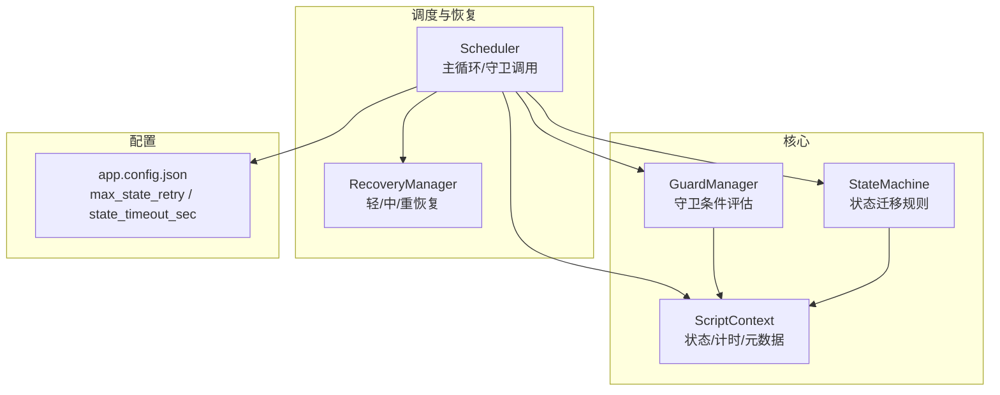
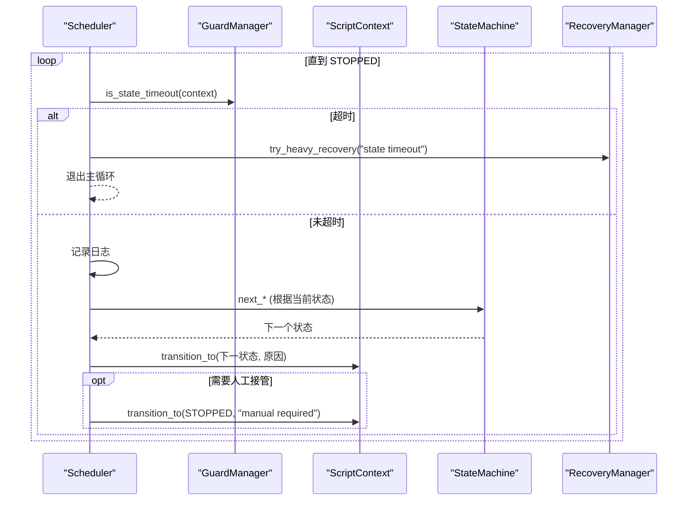
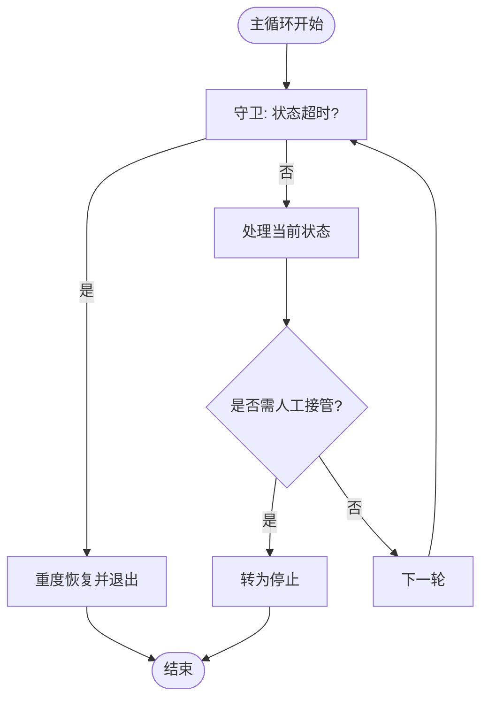
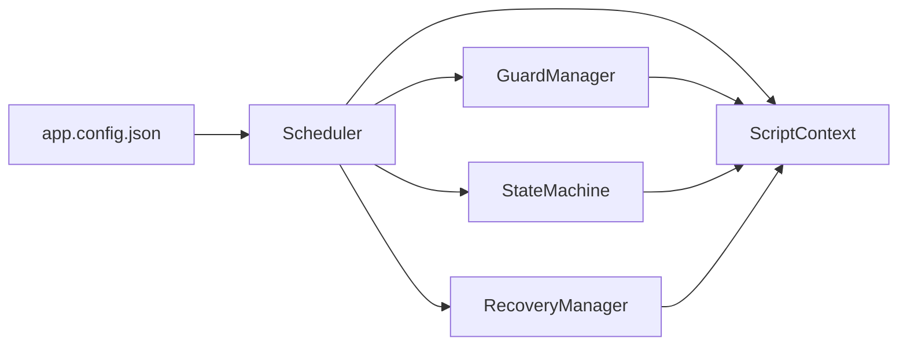

# 守卫机制

<cite>
**本文引用的文件**
- [guards.py](file://src/core/guards.py)
- [scheduler.py](file://src/core/scheduler.py)
- [context.py](file://src/core/context.py)
- [state_machine.py](file://src/core/state_machine.py)
- [recovery_module.py](file://src/modules/recovery_module.py)
- [app.config.json](file://config/app.config.json)
</cite>

## 目录
1. [简介](#简介)
2. [项目结构](#项目结构)
3. [核心组件](#核心组件)
4. [架构总览](#架构总览)
5. [详细组件分析](#详细组件分析)
6. [依赖关系分析](#依赖关系分析)
7. [性能考虑](#性能考虑)
8. [故障排查指南](#故障排查指南)
9. [结论](#结论)
10. [附录](#附录)

## 简介
本技术文档聚焦于“守卫机制”在状态机中的应用，围绕守卫条件的定义与评估、内置守卫的实现原理（超时检测、重试耗尽）、执行顺序与优先级管理、自定义守卫扩展方式、组合多个守卫条件的方法以及失败处理策略展开。同时提供性能优化建议与调试技巧，帮助读者在现有代码基础上安全、可控地扩展和集成更多业务守卫逻辑。

## 项目结构
当前仓库采用分层组织：核心能力位于 src/core，调度器负责编排状态流转与守卫检查；上下文对象承载状态与计时信息；状态机定义状态迁移规则；恢复模块提供不同级别的恢复策略；配置集中管理运行参数。

图表来源
- [scheduler.py:13-47](file://src/core/scheduler.py#L13-L47)
- [guards.py:6-15](file://src/core/guards.py#L6-L15)
- [context.py:10-62](file://src/core/context.py#L10-L62)
- [state_machine.py:6-42](file://src/core/state_machine.py#L6-L42)
- [recovery_module.py:6-19](file://src/modules/recovery_module.py#L6-L19)
- [app.config.json:1-23](file://config/app.config.json#L1-L23)

章节来源
- [scheduler.py:13-83](file://src/core/scheduler.py#L13-L83)
- [guards.py:6-15](file://src/core/guards.py#L6-L15)
- [context.py:10-62](file://src/core/context.py#L10-L62)
- [state_machine.py:6-42](file://src/core/state_machine.py#L6-L42)
- [recovery_module.py:6-19](file://src/modules/recovery_module.py#L6-L19)
- [app.config.json:1-23](file://config/app.config.json#L1-L23)

## 核心组件
- ScriptContext：维护当前状态、上一状态、轮次与重试计数、场景置信度、截图路径、进入地图/祭坛交互标记、是否请求停止、状态开始时间戳、元数据等。提供状态切换、重试标记、状态耗时计算等方法。
- GuardManager：封装守卫条件评估，包括“重试耗尽”和“状态超时”。
- StateMachine：定义各状态的下一步迁移逻辑，包含占位状态序列推进。
- Scheduler：主循环驱动，每轮先进行守卫检查（如超时），再处理当前状态，必要时触发恢复并终止流程。
- RecoveryManager：提供轻/中/重恢复能力，重度恢复会要求人工介入并转入人工接管状态。
- 配置：通过 app.config.json 提供最大重试次数与状态超时秒数等关键参数。

章节来源
- [context.py:10-62](file://src/core/context.py#L10-L62)
- [guards.py:6-15](file://src/core/guards.py#L6-L15)
- [state_machine.py:6-42](file://src/core/state_machine.py#L6-L42)
- [scheduler.py:13-83](file://src/core/scheduler.py#L13-L83)
- [recovery_module.py:6-19](file://src/modules/recovery_module.py#L6-L19)
- [app.config.json:1-23](file://config/app.config.json#L1-L23)

## 架构总览
守卫机制嵌入到调度器的每一轮主循环中，作为“前置门禁”，确保在进入具体状态处理之前满足安全与稳定性约束。其执行顺序为：
1) 检查状态是否已停止；
2) 检查状态是否超时；
3) 若未超时，记录日志并处理当前状态；
4) 若进入人工接管状态，则转为停止；
5) 循环直至停止。

图表来源
- [scheduler.py:32-47](file://src/core/scheduler.py#L32-L47)
- [guards.py:11-15](file://src/core/guards.py#L11-L15)
- [context.py:47-58](file://src/core/context.py#L47-L58)
- [state_machine.py:7-42](file://src/core/state_machine.py#L7-L42)
- [recovery_module.py:15-19](file://src/modules/recovery_module.py#L15-L19)

## 详细组件分析

### 守卫管理器 GuardManager
- 职责：封装守卫条件评估，屏蔽底层上下文细节，对外暴露统一的布尔判定接口。
- 内置守卫：
  - 重试耗尽：当上下文的重试计数达到或超过配置的最大重试次数时返回真。
  - 状态超时：当当前状态持续时间达到或超过配置的超时秒数时返回真。
- 复杂度：O(1)，仅读取上下文字段与简单比较。
- 可测试性：可通过构造不同上下文的 state_retry_count 与 state_started_at 来验证边界行为。

章节来源
- [guards.py:6-15](file://src/core/guards.py#L6-L15)
- [context.py:31-58](file://src/core/context.py#L31-L58)
- [app.config.json:4-5](file://config/app.config.json#L4-L5)

### 上下文 ScriptContext
- 关键字段：
  - current_state/previous_state：当前与上一状态。
  - round_index/state_retry_count/round_failure_count：轮次与重试计数。
  - scene_confidence/screenshot_path/map_entered/altar_interacted/manual_required/stop_requested：运行时标志与截图路径。
  - state_started_at：状态开始时间戳，用于计算状态持续时间。
  - metadata：通用元数据，便于记录恢复原因、最后转换原因等。
- 关键方法：
  - transition_to：更新状态、重置重试计数、更新时间戳、记录转换原因。
  - mark_retry：递增重试计数。
  - state_elapsed_seconds：计算自状态开始以来的秒数。
  - bind_screenshot：绑定截图路径。
- 设计要点：使用 dataclass slots=True 提升内存效率；使用 monotonic 避免系统时钟回拨影响。

章节来源
- [context.py:10-62](file://src/core/context.py#L10-L62)

### 状态机 StateMachine
- 职责：定义从某一状态到下一状态的迁移规则。
- 示例：
  - 引导后：若请求停止则进入停止，否则进入环境检查。
  - 环境检查后：通过则进入藏身处，否则进入人工接管。
  - 占位状态推进：按固定顺序推进一系列状态，到达末尾则停止。
- 与守卫的关系：状态机只负责“下一步是什么”，不负责“能否继续”；守卫负责“是否允许继续”。

章节来源
- [state_machine.py:6-42](file://src/core/state_machine.py#L6-L42)

### 调度器 Scheduler 与守卫执行顺序
- 主循环每轮首先调用守卫检查（当前实现为状态超时检查）。
- 若超时：记录错误日志，触发重度恢复，并退出主循环。
- 若未超时：记录进入状态日志，调用状态机的迁移函数，更新上下文状态。
- 若进入人工接管状态：立即转为停止。
- 执行顺序总结：
  1) 守卫检查（超时）
  2) 状态处理（状态机迁移）
  3) 人工接管判断
  4) 循环结束判断

图表来源
- [scheduler.py:32-47](file://src/core/scheduler.py#L32-L47)
- [guards.py:11-15](file://src/core/guards.py#L11-L15)
- [recovery_module.py:15-19](file://src/modules/recovery_module.py#L15-L19)

章节来源
- [scheduler.py:13-83](file://src/core/scheduler.py#L13-L83)

### 恢复模块 RecoveryManager
- 轻/中/重恢复：当前实现将恢复原因写入上下文元数据；重度恢复会将人工接管标志置位并转入人工接管状态，随后由调度器转为停止。
- 与守卫的协作：当守卫判定异常（如超时）时，调度器调用恢复模块进行兜底处理，防止无限循环或误操作。

章节来源
- [recovery_module.py:6-19](file://src/modules/recovery_module.py#L6-L19)
- [scheduler.py:32-47](file://src/core/scheduler.py#L32-L47)

### 配置与参数
- max_state_retry：每个状态的最大重试次数，用于“重试耗尽”守卫。
- state_timeout_sec：每个状态的最大持续时间（秒），用于“状态超时”守卫。
- 其他：日志目录、截图目录、OCR 语言与阈值、模板根目录等。

章节来源
- [app.config.json:1-23](file://config/app.config.json#L1-L23)

## 依赖关系分析
- Scheduler 依赖 GuardManager、StateMachine、ScriptContext、RecoveryManager 与配置。
- GuardManager 依赖 ScriptContext。
- StateMachine 依赖 ScriptContext。
- RecoveryManager 依赖 ScriptContext。
- 所有组件均通过配置注入参数，降低耦合度。

图表来源
- [scheduler.py:13-30](file://src/core/scheduler.py#L13-L30)
- [guards.py:6-15](file://src/core/guards.py#L6-L15)
- [state_machine.py:6-15](file://src/core/state_machine.py#L6-L15)
- [recovery_module.py:6-19](file://src/modules/recovery_module.py#L6-L19)
- [app.config.json:1-23](file://config/app.config.json#L1-L23)

章节来源
- [scheduler.py:13-83](file://src/core/scheduler.py#L13-L83)
- [guards.py:6-15](file://src/core/guards.py#L6-L15)
- [state_machine.py:6-42](file://src/core/state_machine.py#L6-L42)
- [recovery_module.py:6-19](file://src/modules/recovery_module.py#L6-L19)
- [app.config.json:1-23](file://config/app.config.json#L1-L23)

## 性能考虑
- 守卫评估为 O(1) 操作，开销极低，适合在主循环高频调用。
- 使用 monotonic 计算时间差，避免系统时钟回拨导致的误差。
- 合理设置 state_timeout_sec 与 max_state_retry，避免过短导致频繁恢复，过长导致卡死。
- 建议在状态处理中加入节流与随机微偏移，减少输入抖动与资源争用（需求层已有相关约束）。
- 日志输出应控制级别与频率，避免 I/O 瓶颈。

[本节为通用性能指导，不直接分析具体文件]

## 故障排查指南
- 常见现象：
  - 状态长时间无进展：检查 state_timeout_sec 是否过小或过大；查看日志中的“状态超时”提示。
  - 频繁重试：检查 max_state_retry 与状态处理逻辑是否正确更新重试计数。
  - 人工接管频繁：检查是否需要更稳健的状态识别或增加恢复策略。
- 定位步骤：
  1) 查看调度器日志，确认进入状态与守卫检查结果。
  2) 检查上下文元数据中的 last_transition_reason 与 recovery_reason。
  3) 核对截图路径与模板匹配结果，确认识别链路稳定。
  4) 调整配置参数并复测。
- 快速修复建议：
  - 临时增大 state_timeout_sec 以缓解偶发延迟。
  - 适当提高 max_state_retry 以容忍短暂波动。
  - 在状态处理前后增加断言或校验，尽早发现问题。

章节来源
- [scheduler.py:32-47](file://src/core/scheduler.py#L32-L47)
- [recovery_module.py:15-19](file://src/modules/recovery_module.py#L15-L19)
- [context.py:47-62](file://src/core/context.py#L47-L62)
- [app.config.json:4-5](file://config/app.config.json#L4-L5)

## 结论
当前守卫机制以最小化侵入的方式嵌入调度主循环，提供“状态超时”这一关键安全门控，并与恢复模块协同，确保异常情况下能安全降级至人工接管。结合上下文的状态与计时能力，后续可扩展更多守卫（如重试耗尽、置信度阈值、外部信号等），并通过统一接口接入调度器，保持高内聚、低耦合的架构风格。

[本节为总结性内容，不直接分析具体文件]

## 附录

### 如何扩展新的守卫类型
- 在 GuardManager 中添加新方法，例如 is_low_confidence(context) 或 is_external_signal(context)，返回布尔值。
- 在 Scheduler 的主循环中按需调用新守卫，并在触发时执行相应恢复或终止逻辑。
- 如需组合多个守卫，可在调度器中串联调用，或使用短路逻辑（任一为真即触发恢复）。

章节来源
- [guards.py:6-15](file://src/core/guards.py#L6-L15)
- [scheduler.py:32-47](file://src/core/scheduler.py#L32-L47)

### 如何组合多个守卫条件
- 串行组合：依次调用多个守卫，任一为真即进入恢复分支。
- 加权组合：为不同守卫赋予权重，累计得分超过阈值时触发恢复（需在 GuardManager 中新增聚合方法）。
- 条件分组：将同类型守卫归组，便于配置化管理与动态启用。

章节来源
- [guards.py:6-15](file://src/core/guards.py#L6-L15)
- [scheduler.py:32-47](file://src/core/scheduler.py#L32-L47)

### 如何处理守卫失败的情况
- 超时失败：记录错误日志，触发重度恢复，并退出主循环。
- 重试耗尽：可设计为触发中度恢复或转入人工接管，视业务风险而定。
- 置信度过低：可记录截图与元数据，转入人工接管或回退到上一安全状态。

章节来源
- [scheduler.py:32-47](file://src/core/scheduler.py#L32-L47)
- [recovery_module.py:15-19](file://src/modules/recovery_module.py#L15-L19)

### 调试技巧
- 开启详细日志：关注“进入状态”“状态超时”“人工接管”等关键日志。
- 利用上下文元数据：通过 metadata 记录恢复原因、最后转换原因、截图路径等。
- 截图留存：在关键节点绑定截图路径，便于回溯问题。
- 参数调优：逐步调整 state_timeout_sec 与 max_state_retry，观察成功率与稳定性变化。

章节来源
- [scheduler.py:32-47](file://src/core/scheduler.py#L32-L47)
- [context.py:47-62](file://src/core/context.py#L47-L62)
- [app.config.json:4-5](file://config/app.config.json#L4-L5)