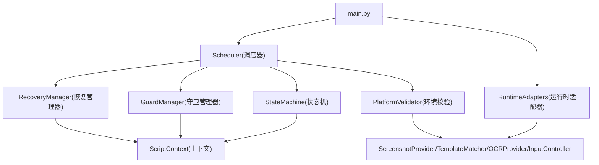
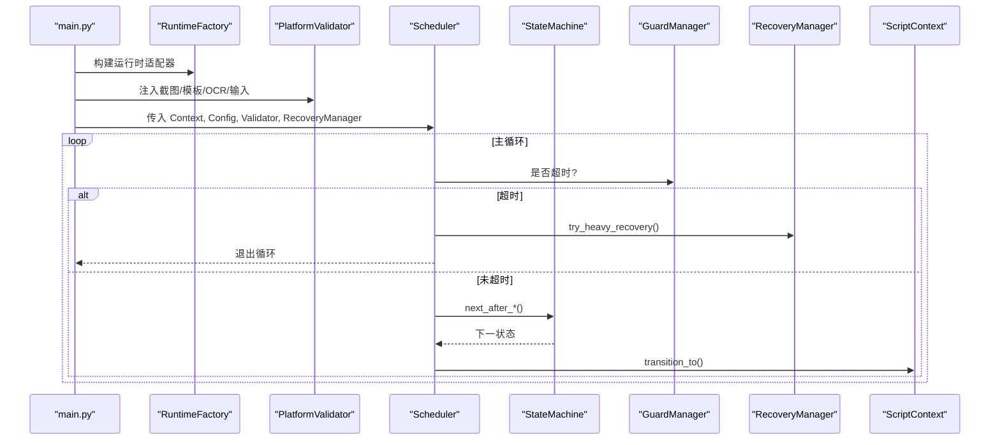
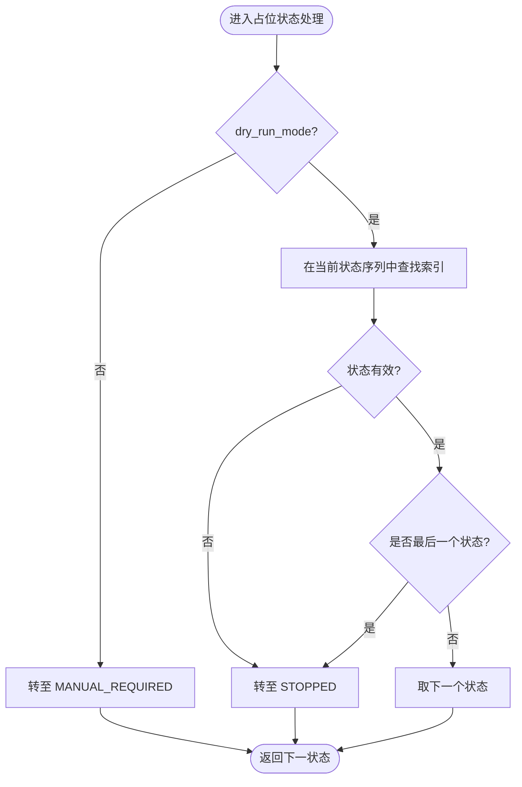
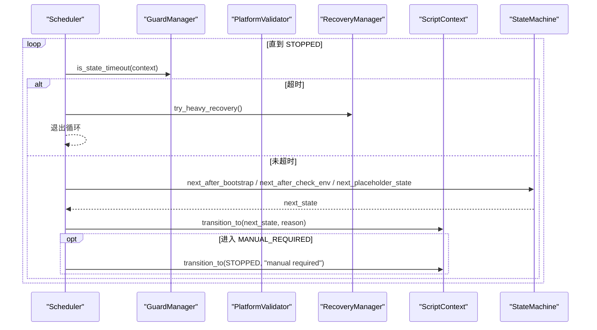
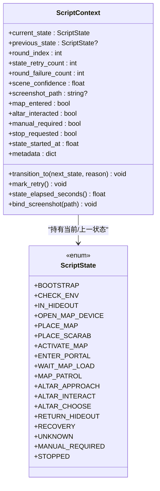
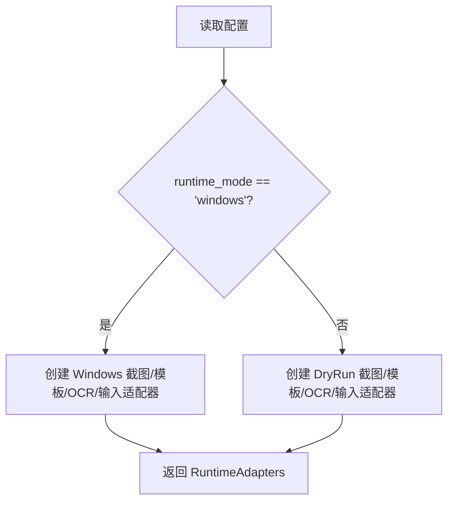
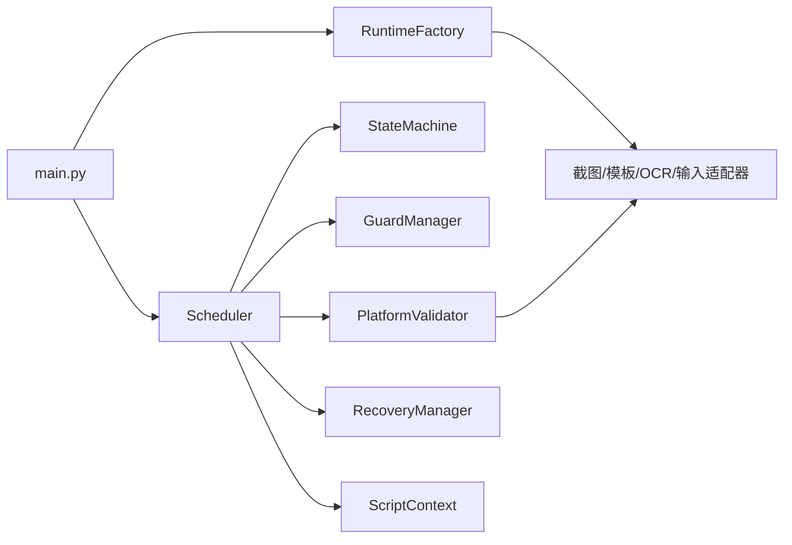

# 核心框架

<cite>
**本文引用的文件**
- [src/core/state_machine.py](file://src/core/state_machine.py)
- [src/core/scheduler.py](file://src/core/scheduler.py)
- [src/core/context.py](file://src/core/context.py)
- [src/core/guards.py](file://src/core/guards.py)
- [src/core/runtime_factory.py](file://src/core/runtime_factory.py)
- [src/core/pathing.py](file://src/core/pathing.py)
- [src/modules/env_module.py](file://src/modules/env_module.py)
- [src/modules/recovery_module.py](file://src/modules/recovery_module.py)
- [src/main.py](file://src/main.py)
- [config/app.config.json](file://config/app.config.json)
- [README.md](file://README.md)
</cite>

## 目录
1. [简介](#简介)
2. [项目结构](#项目结构)
3. [核心组件](#核心组件)
4. [架构总览](#架构总览)
5. [详细组件分析](#详细组件分析)
6. [依赖关系分析](#依赖关系分析)
7. [性能与稳定性考量](#性能与稳定性考量)
8. [故障排查指南](#故障排查指南)
9. [结论](#结论)
10. [附录：扩展与最佳实践](#附录：扩展与最佳实践)

## 简介
本技术文档聚焦于游戏自动化脚本的核心框架模块，围绕状态机设计模式、调度器执行流程、上下文管理、运行时工厂模式展开，解释状态定义、转换规则与守卫机制，并给出扩展新状态、新守卫逻辑与新运行时适配器的具体方法。该框架以“先验证平台能力、再逐步实现业务闭环”为原则，强调可观测、可恢复、可停止的稳健运行方式。

## 项目结构
核心框架位于 src/core 下，配合 modules（环境校验、恢复）、utils（日志、系统 API）、vision（截图、模板匹配、OCR）和 input（输入控制）等子系统，由 main.py 装配并启动。配置集中在 config/app.config.json，用于驱动运行时模式、阈值、路径与行为策略。

图表来源
- [src/main.py:22-50](file://src/main.py#L22-L50)
- [src/core/scheduler.py:13-31](file://src/core/scheduler.py#L13-L31)
- [src/core/runtime_factory.py:21-77](file://src/core/runtime_factory.py#L21-L77)
- [src/core/state_machine.py:6-42](file://src/core/state_machine.py#L6-L42)
- [src/core/guards.py:6-16](file://src/core/guards.py#L6-L16)
- [src/modules/env_module.py:23-88](file://src/modules/env_module.py#L23-L88)
- [src/modules/recovery_module.py:6-20](file://src/modules/recovery_module.py#L6-L20)
- [src/core/context.py:10-62](file://src/core/context.py#L10-L62)

章节来源
- [src/main.py:22-50](file://src/main.py#L22-L50)
- [config/app.config.json:1-23](file://config/app.config.json#L1-L23)

## 核心组件
- 状态机 StateMachine：定义状态转换规则，包括引导后、环境检查后以及占位状态的顺序推进。
- 调度器 Scheduler：主循环驱动状态流转，集成守卫超时与重试、环境校验、恢复策略。
- 上下文 ScriptContext：承载当前状态、时间戳、重试计数、截图路径、元数据等生命周期信息。
- 守卫 GuardManager：提供最大重试次数与状态超时判定。
- 运行时工厂 RuntimeFactory：根据配置动态创建截图、模板匹配、OCR、输入控制器等适配器实例。
- 环境校验 PlatformValidator：串联截图、模板匹配、OCR、输入链路，输出通过与否与建议。
- 恢复管理器 RecoveryManager：提供轻/中/重恢复策略，必要时转入人工接管。

章节来源
- [src/core/state_machine.py:6-42](file://src/core/state_machine.py#L6-L42)
- [src/core/scheduler.py:13-83](file://src/core/scheduler.py#L13-L83)
- [src/core/context.py:10-62](file://src/core/context.py#L10-L62)
- [src/core/guards.py:6-16](file://src/core/guards.py#L6-L16)
- [src/core/runtime_factory.py:21-77](file://src/core/runtime_factory.py#L21-L77)
- [src/modules/env_module.py:11-88](file://src/modules/env_module.py#L11-L88)
- [src/modules/recovery_module.py:6-20](file://src/modules/recovery_module.py#L6-L20)

## 架构总览
整体采用“配置驱动 + 工厂装配 + 状态机驱动 + 守卫保护”的架构。入口 main.py 加载配置并构建运行时适配器，随后组装 Validator、Scheduler 并启动。Scheduler 在循环中依据 Guard 的超时/重试条件与环境校验结果，调用 StateMachine 决定下一状态，并通过 Context 完成状态切换与记录。

图表来源
- [src/main.py:22-50](file://src/main.py#L22-L50)
- [src/core/runtime_factory.py:30-77](file://src/core/runtime_factory.py#L30-L77)
- [src/core/scheduler.py:32-83](file://src/core/scheduler.py#L32-L83)
- [src/core/state_machine.py:6-42](file://src/core/state_machine.py#L6-L42)
- [src/core/guards.py:6-16](file://src/core/guards.py#L6-L16)
- [src/modules/recovery_module.py:6-20](file://src/modules/recovery_module.py#L6-L20)
- [src/core/context.py:31-62](file://src/core/context.py#L31-L62)

## 详细组件分析

### 状态机 StateMachine
- 职责：封装状态转换规则，将“当前状态 + 外部结果”映射为“下一状态”。
- 关键规则：
  - 引导后：若请求停止则进入 STOPPED，否则进入 CHECK_ENV。
  - 环境检查后：通过则进入 IN_HIDEOUT，否则进入 MANUAL_REQUIRED。
  - 占位状态：按固定顺序推进（藏身处→打开地图设备→放置地图→放置圣甲虫→激活地图→进入传送门→等待加载→巡逻→接近祭坛→交互→选择→返回藏身处），并在末尾或非法状态时进入 STOPPED。
- 复杂度：O(n) 查找当前索引，n 为状态序列长度；实际 n 较小，开销可忽略。
- 可扩展性：新增状态可在顺序列表中添加，或在分支逻辑中增加判断。

图表来源
- [src/core/state_machine.py:17-42](file://src/core/state_machine.py#L17-L42)

章节来源
- [src/core/state_machine.py:6-42](file://src/core/state_machine.py#L6-L42)

### 调度器 Scheduler
- 职责：协调状态机、守卫、环境校验与恢复，驱动主循环。
- 关键点：
  - 每轮检查超时，触发重度恢复并退出。
  - 对 BOOTSTRAP 与 CHECK_ENV 进行专门处理，其他状态走占位推进。
  - 遇到 MANUAL_REQUIRED 立即转为 STOPPED。
  - 使用 Logger 记录状态进入、检查结果与建议。
- 错误处理：捕获异常并记录建议，必要时转入人工接管。

图表来源
- [src/core/scheduler.py:32-83](file://src/core/scheduler.py#L32-L83)
- [src/core/state_machine.py:6-42](file://src/core/state_machine.py#L6-L42)
- [src/core/guards.py:6-16](file://src/core/guards.py#L6-L16)
- [src/modules/recovery_module.py:6-20](file://src/modules/recovery_module.py#L6-L20)
- [src/core/context.py:31-62](file://src/core/context.py#L31-L62)

章节来源
- [src/core/scheduler.py:13-83](file://src/core/scheduler.py#L13-L83)

### 上下文 ScriptContext
- 数据结构：包含当前/上一状态、轮次与失败计数、场景置信度、截图路径、地图/祭坛交互标记、停止标志、状态开始时间与元数据。
- 生命周期：
  - 初始化默认状态为 BOOTSTRAP。
  - 每次状态切换更新 previous_state、current_state、state_retry_count、state_started_at，并记录转换原因。
  - 提供重试计数递增、状态耗时计算、截图绑定等方法。
- 设计要点：使用 dataclass slots 提升内存效率；时间使用 monotonic 避免系统时钟回拨影响。

图表来源
- [src/core/context.py:10-62](file://src/core/context.py#L10-L62)

章节来源
- [src/core/context.py:10-62](file://src/core/context.py#L10-L62)

### 守卫 GuardManager
- 职责：基于上下文中的重试计数与状态耗时，判断是否达到最大重试或超时。
- 使用方式：调度器每轮先检查超时，结合状态内重试计数决定是否触发恢复或停机。
- 扩展点：可按需增加更多守卫条件（如连续失败次数、资源占用阈值）。

章节来源
- [src/core/guards.py:6-16](file://src/core/guards.py#L6-L16)

### 运行时工厂 RuntimeFactory
- 职责：根据配置 runtime_mode 动态创建截图、模板匹配、OCR、输入控制器等适配器，并附带下一步建议。
- 支持模式：
  - windows：使用 Windows 平台真实适配器。
  - dry_run：使用 DryRun 模拟适配器，便于开发与联调。
- 配置项：截图目录、调试目录、窗口标题关键词、OCR 语言/PSM/命令、模板根路径与配置文件、ROI 配置路径。
- 路径解析：通过 pathing.resolve_project_path 将相对路径解析为项目根下的绝对路径，保证跨平台一致性。

图表来源
- [src/core/runtime_factory.py:30-77](file://src/core/runtime_factory.py#L30-L77)
- [src/core/pathing.py:6-11](file://src/core/pathing.py#L6-L11)

章节来源
- [src/core/runtime_factory.py:21-77](file://src/core/runtime_factory.py#L21-L77)
- [src/core/pathing.py:6-11](file://src/core/pathing.py#L6-L11)

### 环境校验 PlatformValidator
- 职责：串联截图、模板匹配、OCR、输入链路，输出通过与否、截图路径、错误与建议。
- 校验项：
  - 截图：全屏截图并确认文件存在。
  - 模板匹配：在截图上匹配 hideout_anchor，置信度超过阈值。
  - OCR：在 debug_label 区域识别文本，置信度超过阈值。
  - 输入：点击与按键均成功。
- 建议：当出现错误时，优先提示修复失败链路再继续开发。

章节来源
- [src/modules/env_module.py:11-88](file://src/modules/env_module.py#L11-L88)

### 恢复管理器 RecoveryManager
- 职责：提供轻/中/重恢复策略。重度恢复会记录原因并转入 MANUAL_REQUIRED，交由调度器停止自动流程。
- 使用场景：状态超时、连续失败、未知界面等需要人工介入的情况。

章节来源
- [src/modules/recovery_module.py:6-20](file://src/modules/recovery_module.py#L6-L20)

## 依赖关系分析
- main.py 负责装配：加载配置、构建运行时适配器、创建 Validator、Scheduler 并启动。
- Scheduler 依赖：
  - StateMachine：决定下一状态。
  - GuardManager：判断超时与重试耗尽。
  - PlatformValidator：执行环境校验。
  - RecoveryManager：执行恢复策略。
  - ScriptContext：读写状态与元数据。
- RuntimeFactory 依赖：
  - 各平台适配器（Windows/DryRun）与路径解析工具。
- 配置 app.config.json 驱动：
  - 运行模式、重试次数、超时、路径、阈值等。

图表来源
- [src/main.py:22-50](file://src/main.py#L22-L50)
- [src/core/scheduler.py:13-31](file://src/core/scheduler.py#L13-L31)
- [src/core/runtime_factory.py:30-77](file://src/core/runtime_factory.py#L30-L77)
- [src/modules/env_module.py:23-88](file://src/modules/env_module.py#L23-L88)

章节来源
- [src/main.py:22-50](file://src/main.py#L22-L50)
- [config/app.config.json:1-23](file://config/app.config.json#L1-L23)

## 性能与稳定性考量
- 状态机顺序推进为 O(n)，n 较小，不影响性能。
- 超时与重试限制防止无限循环与误操作，保障稳定性。
- 使用 dataclass slots 减少内存占用。
- 使用 monotonic 计时避免系统时间回拨导致误判。
- 建议在后续阶段引入节流、随机微偏移与动作后校验，满足需求约束。

[本节为通用指导，不直接分析具体文件]

## 故障排查指南
- 状态超时：检查 state_timeout_sec 配置与业务逻辑耗时，必要时调整阈值或优化链路。
- 环境校验失败：查看 PlatformValidationReport.errors 与 next_step_suggestions，优先修复截图、模板匹配、OCR、输入链路。
- 人工接管：当进入 MANUAL_REQUIRED，说明已触发重度恢复或安全策略，需人工介入后再继续。
- 日志定位：通过 get_logger 输出的日志定位问题阶段与原因。

章节来源
- [src/core/scheduler.py:32-83](file://src/core/scheduler.py#L32-L83)
- [src/modules/env_module.py:38-88](file://src/modules/env_module.py#L38-L88)
- [src/modules/recovery_module.py:6-20](file://src/modules/recovery_module.py#L6-L20)

## 结论
该核心框架以状态机为核心，结合调度器、守卫、上下文与运行时工厂，实现了可配置、可扩展、可恢复的游戏自动化流程。当前阶段重点在于平台可行性验证与稳定进图，后续在此基础上逐步扩展地图内交互与完整闭环。遵循“先验证、再扩展、强约束、可恢复”的原则，可有效降低风险并提高成功率。

[本节为总结性内容，不直接分析具体文件]

## 附录：扩展与最佳实践

### 如何定义新的游戏状态
- 在 ScriptState 枚举中添加新状态。
- 在 StateMachine 的占位状态顺序中插入新状态，或为特定状态添加分支逻辑。
- 在 Scheduler 中为新状态编写处理逻辑（如需特殊处理），否则沿用占位推进。
- 在 PlatformValidator 或业务模块中补充对该状态的识别与校验。

章节来源
- [src/core/context.py:10-29](file://src/core/context.py#L10-L29)
- [src/core/state_machine.py:17-42](file://src/core/state_machine.py#L17-L42)
- [src/core/scheduler.py:49-83](file://src/core/scheduler.py#L49-L83)

### 如何扩展守卫逻辑
- 在 GuardManager 中新增守卫方法（例如连续失败次数、资源占用阈值）。
- 在 Scheduler 主循环中调用新守卫，并在失败时采取相应恢复或停机策略。
- 在 Context.metadata 中记录守卫触发原因，便于追踪与分析。

章节来源
- [src/core/guards.py:6-16](file://src/core/guards.py#L6-L16)
- [src/core/scheduler.py:32-47](file://src/core/scheduler.py#L32-L47)
- [src/core/context.py:31-62](file://src/core/context.py#L31-L62)

### 如何集成新的运行时适配器
- 在 RuntimeFactory 中根据配置新增分支，创建新平台的适配器实例。
- 确保新适配器实现统一的接口（截图、模板匹配、OCR、输入）。
- 在 PlatformValidator 中无需改动即可复用新适配器。
- 通过 app.config.json 切换 runtime_mode 与相关参数。

章节来源
- [src/core/runtime_factory.py:30-77](file://src/core/runtime_factory.py#L30-L77)
- [src/modules/env_module.py:23-88](file://src/modules/env_module.py#L23-L88)
- [config/app.config.json:1-23](file://config/app.config.json#L1-L23)

### 最佳实践
- 严格遵循状态机驱动，避免散乱 if-else。
- 所有动作必须支持超时与重试限制，并进行结果校验。
- 低置信度识别不应驱动危险动作，不确定时优先停机。
- 优先轻量恢复，失败后优先停机，禁止无限循环恢复。
- 记录关键指标（截图成功率、模板识别率、OCR 识别率、进图成功率、祭坛发现/交互成功率等），持续评估稳定性。

章节来源
- [README.md:192-227](file://README.md#L192-L227)
- [src/core/scheduler.py:32-83](file://src/core/scheduler.py#L32-L83)
- [src/modules/env_module.py:38-88](file://src/modules/env_module.py#L38-L88)

### 常见陷阱与避免方法
- 陷阱：在未知状态下继续危险操作。
  - 避免：遇到 UNKNOWN 或低置信度时立即停机或转入人工接管。
- 陷阱：无校验点击或连续点击。
  - 避免：每次动作后必须有结果校验，并设置超时与重试上限。
- 陷阱：无限恢复循环。
  - 避免：限制恢复层级与次数，重度恢复失败即停机。
- 陷阱：配置不一致导致路径或阈值错误。
  - 避免：统一通过 app.config.json 管理，并使用 resolve_project_path 解析路径。

章节来源
- [README.md:192-227](file://README.md#L192-L227)
- [src/core/runtime_factory.py:30-77](file://src/core/runtime_factory.py#L30-L77)
- [src/core/scheduler.py:32-83](file://src/core/scheduler.py#L32-L83)