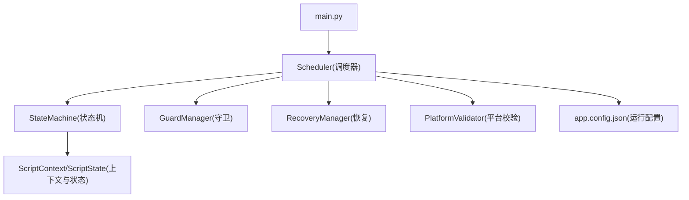
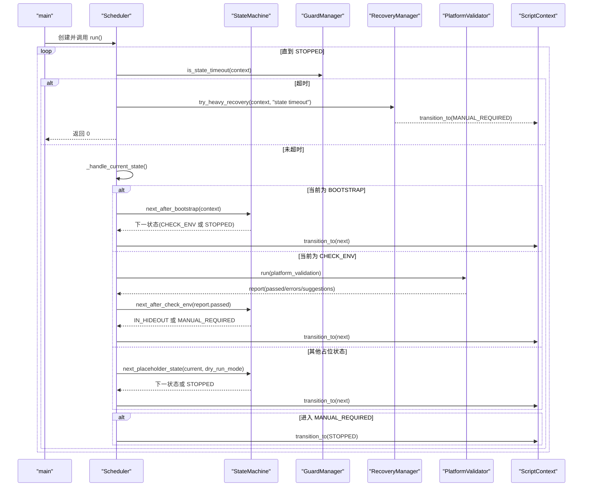
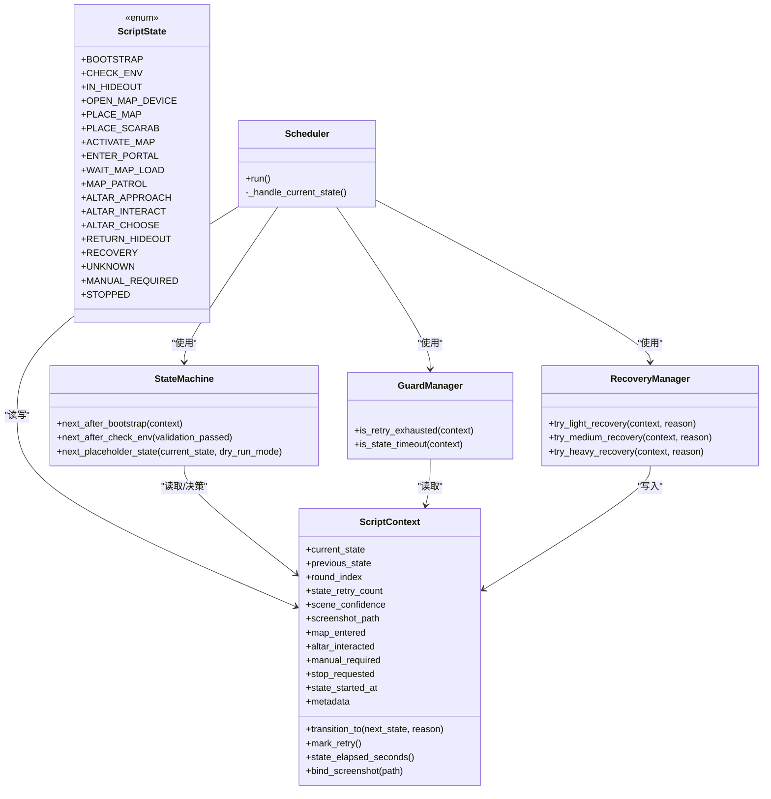

# 状态机设计

<cite>
**本文引用的文件**
- [src/core/context.py](file://src/core/context.py)
- [src/core/state_machine.py](file://src/core/state_machine.py)
- [src/core/scheduler.py](file://src/core/scheduler.py)
- [src/core/guards.py](file://src/core/guards.py)
- [src/modules/recovery_module.py](file://src/modules/recovery_module.py)
- [config/app.config.json](file://config/app.config.json)
- [README.md](file://README.md)
</cite>

## 目录
1. [简介](#简介)
2. [项目结构](#项目结构)
3. [核心组件](#核心组件)
4. [架构总览](#架构总览)
5. [详细组件分析](#详细组件分析)
6. [依赖关系分析](#依赖关系分析)
7. [性能与稳定性考虑](#性能与稳定性考虑)
8. [故障排查指南](#故障排查指南)
9. [结论](#结论)
10. [附录：扩展指南与最佳实践](#附录：扩展指南与最佳实践)

## 简介
本技术文档聚焦于游戏自动化流程中的有限状态机（FSM）设计与实现，围绕 ScriptState 枚举、状态转换逻辑、启动/环境检查/主循环流程展开，并提供如何新增状态、自定义转换规则以及扩展状态机的实践建议。该状态机用于驱动“流放之路”贪婪刷图脚本的阶段性目标：稳定进图、地图内祭坛交互与安全收尾。

## 项目结构
状态机相关代码集中在 core 层，配合调度器、守卫与恢复模块共同构成运行时控制流；配置项位于 config 目录；需求与约束在 README 中明确。

图表来源
- [src/core/scheduler.py:13-47](file://src/core/scheduler.py#L13-L47)
- [src/core/state_machine.py:6-41](file://src/core/state_machine.py#L6-L41)
- [src/core/context.py:10-61](file://src/core/context.py#L10-L61)
- [config/app.config.json:1-22](file://config/app.config.json#L1-L22)

章节来源
- [src/core/scheduler.py:13-83](file://src/core/scheduler.py#L13-L83)
- [src/core/state_machine.py:6-41](file://src/core/state_machine.py#L6-L41)
- [src/core/context.py:10-61](file://src/core/context.py#L10-L61)
- [config/app.config.json:1-22](file://config/app.config.json#L1-L22)

## 核心组件
- ScriptState 枚举：定义所有游戏状态，包括启动、环境检查、藏身处、开图设备、放置地图/圣甲虫、激活地图、进入传送门、等待加载、巡逻、祭坛接近/交互/选择、回城、恢复、未知、人工接管、停止等。
- StateMachine：提供状态转换策略方法，如 next_after_bootstrap、next_after_check_env、next_placeholder_state。
- Scheduler：主循环调度器，负责超时保护、状态处理分发、人工接管与停机。
- GuardManager：守卫管理器，提供重试耗尽与状态超时判断。
- RecoveryManager：恢复管理器，支持轻/中/重恢复，失败时转入人工接管并停机。
- ScriptContext：状态机上下文，记录当前/上一状态、轮次、重试计数、置信度、截图路径、标志位、时间戳与元数据，并提供状态迁移与计时工具方法。

章节来源
- [src/core/context.py:10-61](file://src/core/context.py#L10-L61)
- [src/core/state_machine.py:6-41](file://src/core/state_machine.py#L6-L41)
- [src/core/scheduler.py:13-83](file://src/core/scheduler.py#L13-L83)
- [src/core/guards.py:6-15](file://src/core/guards.py#L6-L15)
- [src/modules/recovery_module.py:6-19](file://src/modules/recovery_module.py#L6-L19)

## 架构总览
状态机由调度器驱动，按当前状态执行对应逻辑，并通过状态机决定下一状态；守卫确保状态不超时、不无限重试；恢复模块在异常或超时后尝试恢复，必要时转入人工接管并停机。

图表来源
- [src/core/scheduler.py:32-83](file://src/core/scheduler.py#L32-L83)
- [src/core/state_machine.py:7-41](file://src/core/state_machine.py#L7-L41)
- [src/core/guards.py:11-15](file://src/core/guards.py#L11-L15)
- [src/modules/recovery_module.py:15-19](file://src/modules/recovery_module.py#L15-L19)
- [src/core/context.py:47-52](file://src/core/context.py#L47-L52)

## 详细组件分析

### ScriptState 枚举与含义
- 启动与环境阶段
  - BOOTSTRAP：脚本启动，准备进入下一阶段。
  - CHECK_ENV：平台能力与环境校验（截图、模板匹配、OCR、输入）。
- 游戏流程阶段
  - IN_HIDEOUT：处于藏身处。
  - OPEN_MAP_DEVICE：打开地图设备。
  - PLACE_MAP：放置地图。
  - PLACE_SCARAB：放置圣甲虫。
  - ACTIVATE_MAP：激活地图。
  - ENTER_PORTAL：进入传送门。
  - WAIT_MAP_LOAD：等待地图加载。
  - MAP_PATROL：地图内巡逻。
  - ALTAR_APPROACH：接近祭坛。
  - ALTAR_INTERACT：与祭坛交互。
  - ALTAR_CHOOSE：选择祭坛选项。
  - RETURN_HIDEOUT：返回藏身处。
- 安全与兜底阶段
  - RECOVERY：恢复流程。
  - UNKNOWN：无法识别场景。
  - MANUAL_REQUIRED：需要人工介入。
  - STOPPED：停止。

章节来源
- [src/core/context.py:10-28](file://src/core/context.py#L10-L28)

### 状态转换逻辑
- next_after_bootstrap(context)
  - 若 context.stop_requested 为真，则直接转至 STOPPED。
  - 否则进入 CHECK_ENV，进行环境检查。
- next_after_check_env(validation_passed)
  - 若通过校验，进入 IN_HIDEOUT，开始游戏流程。
  - 否则进入 MANUAL_REQUIRED，要求人工介入。
- next_placeholder_state(current_state, dry_run_mode)
  - 非 dry_run 模式：一律转入 MANUAL_REQUIRED。
  - dry_run 模式：按预设顺序推进到下一个状态；若当前状态不在序列或已到末尾，则转至 STOPPED。

章节来源
- [src/core/state_machine.py:7-41](file://src/core/state_machine.py#L7-L41)

### 启动流程
- main 读取配置，构建适配器与 PlatformValidator，创建 Scheduler 并运行。
- Scheduler.run 进入主循环，持续检查超时、处理当前状态、必要时触发恢复与停机。

章节来源
- [src/main.py:22-50](file://src/main.py#L22-L50)
- [src/core/scheduler.py:32-47](file://src/core/scheduler.py#L32-L47)

### 环境检查流程
- 当处于 CHECK_ENV 时，调度器调用 PlatformValidator.run，收集截图、模板匹配、OCR、输入结果与建议。
- 根据 report.passed 决定是否进入 IN_HIDEOUT；否则进入 MANUAL_REQUIRED。
- 将截图路径与置信度写入上下文，便于后续诊断。

章节来源
- [src/core/scheduler.py:57-75](file://src/core/scheduler.py#L57-L75)
- [src/core/context.py:38-45](file://src/core/context.py#L38-L45)

### 主循环流程
- 每次循环先检测是否超时，若超时则尝试重度恢复并退出。
- 根据当前状态分派处理：
  - BOOTSTRAP：调用状态机确定下一状态。
  - CHECK_ENV：执行环境检查并确定下一状态。
  - 其他状态：调用占位状态处理器推进流程。
- 若进入 MANUAL_REQUIRED，立即转为 STOPPED 并结束。

章节来源
- [src/core/scheduler.py:32-83](file://src/core/scheduler.py#L32-L83)

### 状态迁移与上下文
- ScriptContext.transition_to 会更新 previous/current 状态、重置重试计数、记录开始时间与迁移原因。
- 提供 mark_retry 与 state_elapsed_seconds 辅助方法，配合 GuardManager 完成超时与重试控制。

章节来源
- [src/core/context.py:47-58](file://src/core/context.py#L47-L58)
- [src/core/guards.py:11-15](file://src/core/guards.py#L11-L15)

### 恢复机制
- RecoveryManager 提供轻/中/重恢复接口；重度恢复失败时将 manual_required 置位并转入 MANUAL_REQUIRED，随后由调度器转为 STOPPED。

章节来源
- [src/modules/recovery_module.py:6-19](file://src/modules/recovery_module.py#L6-L19)
- [src/core/scheduler.py:34-45](file://src/core/scheduler.py#L34-L45)

## 依赖关系分析
- Scheduler 依赖 StateMachine、GuardManager、RecoveryManager、PlatformValidator。
- StateMachine 依赖 ScriptContext 与 ScriptState。
- GuardManager 依赖 ScriptContext。
- RecoveryManager 依赖 ScriptContext。
- 配置 app.config.json 影响最大重试次数、状态超时阈值、干跑模式等。

图表来源
- [src/core/context.py:10-61](file://src/core/context.py#L10-L61)
- [src/core/state_machine.py:6-41](file://src/core/state_machine.py#L6-L41)
- [src/core/scheduler.py:13-83](file://src/core/scheduler.py#L13-L83)
- [src/core/guards.py:6-15](file://src/core/guards.py#L6-L15)
- [src/modules/recovery_module.py:6-19](file://src/modules/recovery_module.py#L6-L19)

章节来源
- [src/core/scheduler.py:13-83](file://src/core/scheduler.py#L13-L83)
- [src/core/state_machine.py:6-41](file://src/core/state_machine.py#L6-L41)
- [src/core/context.py:10-61](file://src/core/context.py#L10-L61)
- [src/core/guards.py:6-15](file://src/core/guards.py#L6-L15)
- [src/modules/recovery_module.py:6-19](file://src/modules/recovery_module.py#L6-L19)

## 性能与稳定性考虑
- 超时与重试
  - 通过 GuardManager 的状态超时与最大重试限制，避免长时间卡死或无限重试。
  - 配置项 max_state_retry 与 state_timeout_sec 可调节。
- 干跑模式
  - dry_run_mode=false 时，占位状态统一转入 MANUAL_REQUIRED，防止在未验证环境下误操作。
- 低置信度防护
  - 需求文档强调低置信度识别不应驱动危险动作；状态不确定优先停机。
- 日志与截图
  - 环境检查阶段记录截图路径与错误信息，便于定位问题。

章节来源
- [config/app.config.json:3-5](file://config/app.config.json#L3-L5)
- [src/core/scheduler.py:32-47](file://src/core/scheduler.py#L32-L47)
- [src/core/state_machine.py:17-19](file://src/core/state_machine.py#L17-L19)
- [README.md:196-226](file://README.md#L196-L226)

## 故障排查指南
- 常见问题
  - 状态超时：检查截图、模板匹配、OCR、输入链路是否稳定；查看日志与截图路径。
  - 环境检查失败：确认分辨率、窗口模式、UI 缩放、语言等固定设置；调整阈值。
  - 无限重试：核对 max_state_retry 与状态处理逻辑是否正确重置重试计数。
  - 人工接管频繁：检查 low confidence 分支与 UNKNOWN/MANUAL_REQUIRED 的处理。
- 定位步骤
  - 查看 Scheduler 日志输出，关注进入状态、检查结果、错误与建议。
  - 检查 ScriptContext.metadata 中的 last_transition_reason 与 recovery_reason。
  - 结合截图路径回放画面，确认识别区域与模板质量。

章节来源
- [src/core/scheduler.py:39-75](file://src/core/scheduler.py#L39-L75)
- [src/core/context.py:47-52](file://src/core/context.py#L47-L52)
- [src/modules/recovery_module.py:15-19](file://src/modules/recovery_module.py#L15-L19)

## 结论
该状态机以清晰的状态枚举与明确的转换策略为核心，配合调度器的超时保护与恢复机制，实现了从启动、环境检查到游戏流程推进的安全可控闭环。通过干跑模式与人工接管，有效降低了误操作风险。后续可在保持入口稳定的前提下，逐步完善各业务状态的实现与校验。

## 附录：扩展指南与最佳实践

### 如何定义新的游戏状态
- 在 ScriptState 枚举中添加新状态，并在业务流程中合理引用。
- 若为新业务阶段，需在 Scheduler._handle_current_state 中增加对应的处理分支，或在占位状态序列中插入相应位置。

章节来源
- [src/core/context.py:10-28](file://src/core/context.py#L10-L28)
- [src/core/scheduler.py:49-83](file://src/core/scheduler.py#L49-L83)

### 如何实现自定义的状态转换规则
- 在 StateMachine 中新增或修改转换方法，依据上下文与配置决定下一状态。
- 对于通用推进逻辑，可复用 next_placeholder_state 的顺序推进方式，或将新状态加入顺序列表。

章节来源
- [src/core/state_machine.py:7-41](file://src/core/state_machine.py#L7-L41)

### 如何扩展状态机以支持新的游戏场景
- 在 Scheduler 中为新增状态编写具体处理逻辑，包含截图、识别、输入与结果校验。
- 结合 GuardManager 与 RecoveryManager，确保异常时能安全恢复或停机。
- 在 app.config.json 中调整重试与超时参数，以适应新场景的性能特征。

章节来源
- [src/core/scheduler.py:49-83](file://src/core/scheduler.py#L49-L83)
- [config/app.config.json:3-5](file://config/app.config.json#L3-L5)

### 最佳实践
- 严格遵循“状态机驱动”，避免散乱 if-else 拼接。
- 每一步操作必须带结果校验与超时限制。
- 低置信度识别不驱动危险动作；不确定时优先停机。
- 恢复优先轻量，失败后尽快停机，避免无限循环。

章节来源
- [README.md:196-226](file://README.md#L196-L226)