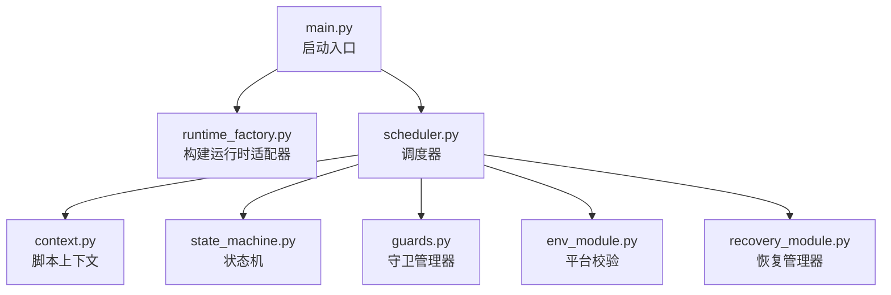
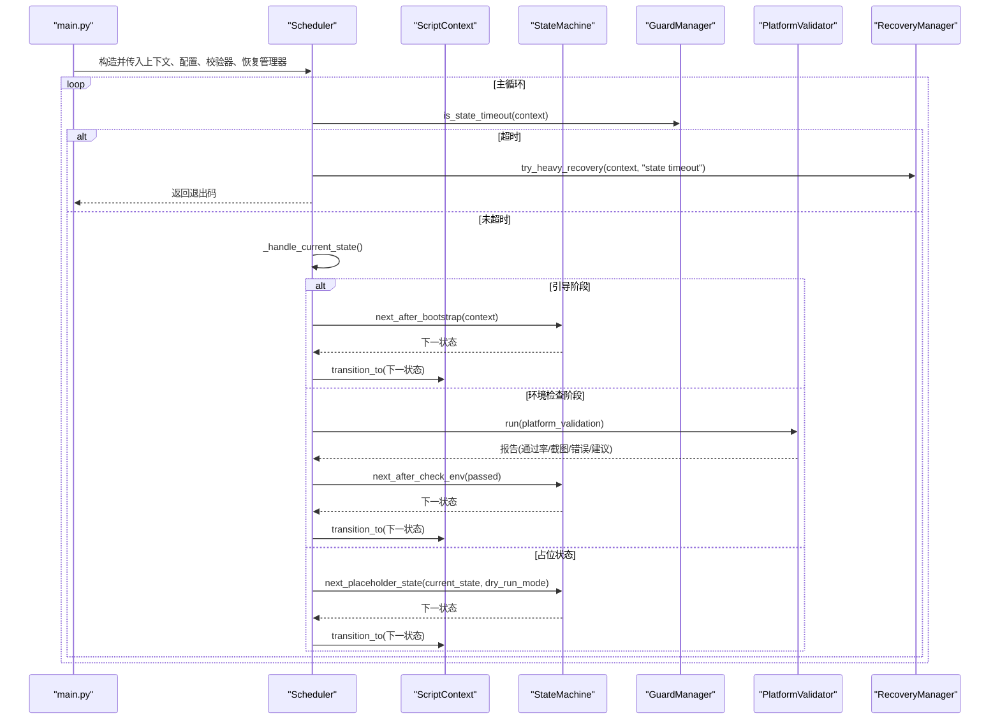
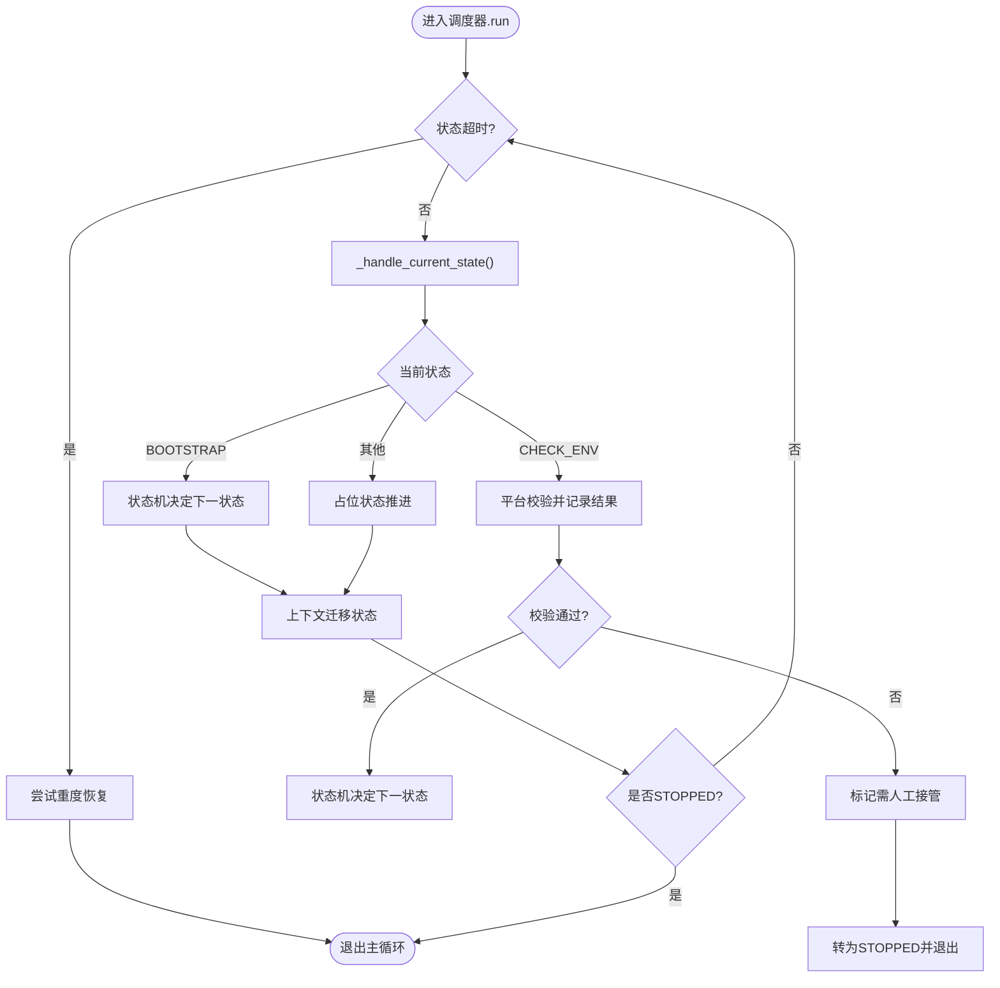
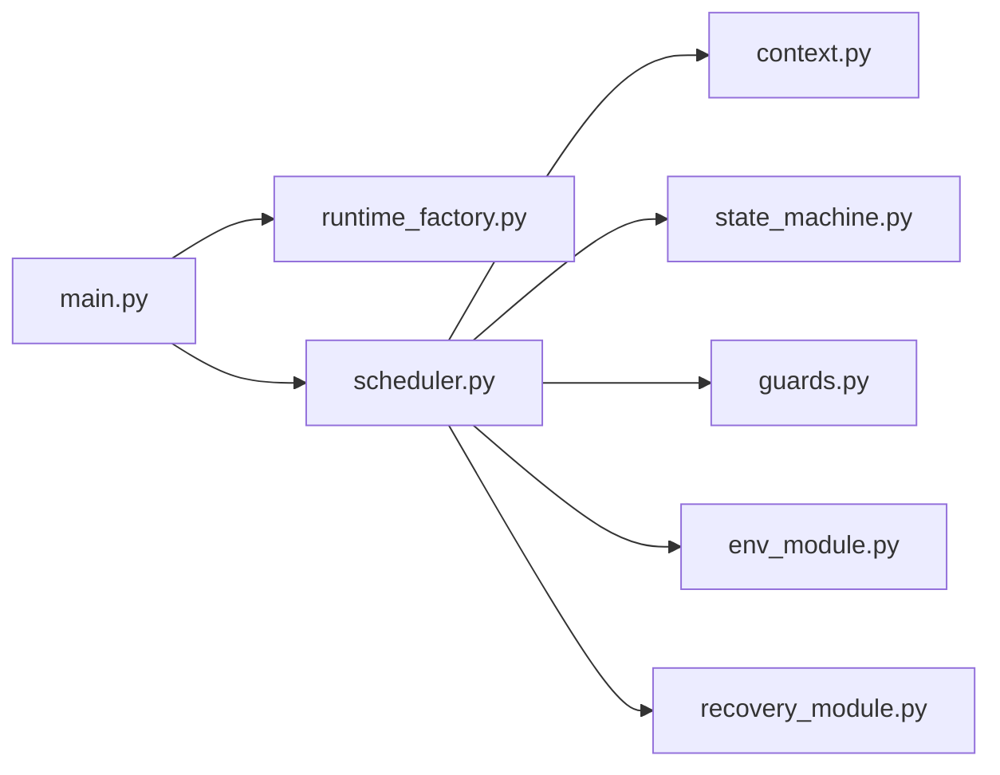

# 调度器实现

<cite>
**本文引用的文件**
- [src/core/scheduler.py](file://src/core/scheduler.py)
- [src/core/state_machine.py](file://src/core/state_machine.py)
- [src/core/guards.py](file://src/core/guards.py)
- [src/core/context.py](file://src/core/context.py)
- [src/modules/env_module.py](file://src/modules/env_module.py)
- [src/modules/recovery_module.py](file://src/modules/recovery_module.py)
- [src/core/runtime_factory.py](file://src/core/runtime_factory.py)
- [config/app.config.json](file://config/app.config.json)
- [src/main.py](file://src/main.py)
</cite>

## 目录
1. [简介](#简介)
2. [项目结构](#项目结构)
3. [核心组件](#核心组件)
4. [架构总览](#架构总览)
5. [详细组件分析](#详细组件分析)
6. [依赖关系分析](#依赖关系分析)
7. [性能考虑](#性能考虑)
8. [故障排查指南](#故障排查指南)
9. [结论](#结论)
10. [附录：配置与使用示例](#附录：配置与使用示例)

## 简介
本技术文档聚焦于调度器组件，解释其如何协调整个脚本的执行流程，包括状态轮询、守卫检查（超时/重试）和异常处理机制。文档覆盖调度器的生命周期管理（初始化、执行、清理），以及与状态机、守卫管理器、上下文管理的集成方式。同时提供配置调度器参数、添加自定义守卫逻辑、处理异常情况的具体路径指引，并给出性能优化建议与故障排查指南。

## 项目结构
调度器位于核心模块中，围绕“上下文 + 状态机 + 守卫 + 平台校验 + 恢复”的协作模式组织代码。入口通过主程序装配运行时适配器与调度器，启动后进入主循环，按当前状态驱动下一步动作，并在超时或需要人工接管时安全退出。

图表来源
- [src/main.py:22-50](file://src/main.py#L22-L50)
- [src/core/runtime_factory.py:30-77](file://src/core/runtime_factory.py#L30-L77)
- [src/core/scheduler.py:13-30](file://src/core/scheduler.py#L13-L30)

章节来源
- [src/main.py:22-50](file://src/main.py#L22-L50)
- [src/core/runtime_factory.py:30-77](file://src/core/runtime_factory.py#L30-L77)
- [src/core/scheduler.py:13-30](file://src/core/scheduler.py#L13-L30)

## 核心组件
- 调度器 Scheduler：负责主循环、状态推进、守卫检查、异常恢复与日志记录。
- 上下文 ScriptContext：维护当前状态、上一状态、重试计数、时间戳、截图路径等运行期数据，并提供状态迁移方法。
- 状态机 StateMachine：定义从引导到环境检查再到占位状态的流转规则。
- 守卫管理器 GuardManager：提供超时与重试上限判断。
- 平台校验 PlatformValidator：验证截图、模板匹配、OCR、输入链路是否可用，并产出报告与建议。
- 恢复管理器 RecoveryManager：提供轻量/中等/重度恢复策略，必要时转入人工接管。

章节来源
- [src/core/scheduler.py:13-83](file://src/core/scheduler.py#L13-L83)
- [src/core/context.py:10-62](file://src/core/context.py#L10-L62)
- [src/core/state_machine.py:6-42](file://src/core/state_machine.py#L6-L42)
- [src/core/guards.py:6-16](file://src/core/guards.py#L6-L16)
- [src/modules/env_module.py:11-88](file://src/modules/env_module.py#L11-L88)
- [src/modules/recovery_module.py:6-20](file://src/modules/recovery_module.py#L6-L20)

## 架构总览
调度器在每次循环中先进行守卫检查（超时/重试），再根据当前状态调用状态机决定下一步；对于引导与环境检查阶段有专门处理；其他占位状态在干跑模式下顺序推进，否则要求人工介入。若检测到超时或错误，调度器会尝试恢复并可能终止自动流程。

图表来源
- [src/core/scheduler.py:32-83](file://src/core/scheduler.py#L32-L83)
- [src/core/state_machine.py:7-42](file://src/core/state_machine.py#L7-L42)
- [src/core/guards.py:11-16](file://src/core/guards.py#L11-L16)
- [src/modules/env_module.py:38-88](file://src/modules/env_module.py#L38-L88)
- [src/modules/recovery_module.py:6-20](file://src/modules/recovery_module.py#L6-L20)

## 详细组件分析

### 调度器 Scheduler
- 职责
  - 维护上下文、配置、平台校验器、恢复管理器、状态机与守卫管理器。
  - 主循环：每轮检查状态超时，记录日志，处理当前状态，必要时触发恢复或停止。
  - 状态分支：引导阶段、环境检查阶段、占位状态推进。
- 关键行为
  - 超时保护：当当前状态耗时超过阈值，记录错误并尝试重度恢复，随后退出主循环。
  - 人工接管：当进入需人工接管的状态，立即转为停止状态，结束自动流程。
  - 占位状态：在非干跑模式下直接要求人工介入；在干跑模式下按固定顺序推进。
- 异常处理
  - 环境检查失败时记录错误与建议，依据结果决定是否继续或转人工。
  - 超时或严重错误时调用恢复管理器，必要时强制停机。

图表来源
- [src/core/scheduler.py:32-83](file://src/core/scheduler.py#L32-L83)
- [src/core/state_machine.py:7-42](file://src/core/state_machine.py#L7-L42)
- [src/core/guards.py:11-16](file://src/core/guards.py#L11-L16)
- [src/modules/env_module.py:38-88](file://src/modules/env_module.py#L38-L88)
- [src/modules/recovery_module.py:6-20](file://src/modules/recovery_module.py#L6-L20)

章节来源
- [src/core/scheduler.py:13-83](file://src/core/scheduler.py#L13-L83)

### 上下文 ScriptContext
- 职责
  - 保存当前状态、上一状态、轮次索引、重试计数、场景置信度、截图路径、地图/祭坛交互标志、人工接管标志、停止请求等。
  - 提供状态迁移方法，重置重试计数与开始时间，记录迁移原因。
  - 提供状态耗时计算与截图绑定方法。
- 设计要点
  - 使用枚举限定状态集合，避免非法状态。
  - 使用单调时钟测量状态持续时间，保证超时判断准确。
  - 元数据字典用于附加信息（如恢复原因）。

章节来源
- [src/core/context.py:10-62](file://src/core/context.py#L10-L62)

### 状态机 StateMachine
- 职责
  - 定义引导后的下一状态：若请求停止则直接进入停止状态，否则进入环境检查。
  - 定义环境检查后的下一状态：通过则进入业务状态（例如藏身处），否则要求人工接管。
  - 定义占位状态推进：在非干跑模式下要求人工接管；在干跑模式下按固定顺序推进至停止。
- 设计要点
  - 将业务流转抽象为纯函数式决策，便于测试与扩展。
  - 占位状态顺序可集中维护，便于后续替换为真实业务状态。

章节来源
- [src/core/state_machine.py:6-42](file://src/core/state_machine.py#L6-L42)

### 守卫管理器 GuardManager
- 职责
  - 判断是否达到最大重试次数。
  - 判断当前状态是否超时。
- 设计要点
  - 基于上下文中的重试计数与状态开始时间进行判定。
  - 可通过配置注入最大重试次数与超时阈值，便于调优。

章节来源
- [src/core/guards.py:6-16](file://src/core/guards.py#L6-L16)

### 平台校验 PlatformValidator
- 职责
  - 依次执行截图、模板匹配、OCR、输入操作，收集成功与否与错误信息。
  - 输出包含总体通过情况、各链路状态、截图路径、错误列表与下一步建议的报告。
- 设计要点
  - 每个子链路独立捕获异常，避免单点失败影响整体评估。
  - 结合阈值配置进行判定，便于在不同环境下调参。

章节来源
- [src/modules/env_module.py:11-88](file://src/modules/env_module.py#L11-L88)

### 恢复管理器 RecoveryManager
- 职责
  - 提供轻/中/重三种恢复策略，记录恢复原因。
  - 重度恢复会将上下文标记为需人工接管，并迁移到人工接管状态。
- 设计要点
  - 恢复策略可扩展，当前以记录与状态迁移为主，便于后续接入具体恢复动作。

章节来源
- [src/modules/recovery_module.py:6-20](file://src/modules/recovery_module.py#L6-L20)

### 运行时适配 RuntimeAdapters
- 职责
  - 根据配置选择 DryRun 或 Windows 平台的具体实现，统一对外暴露截图、模板匹配、OCR、输入控制器与建议列表。
- 设计要点
  - 将平台差异封装在工厂中，保持调度器与上层逻辑对平台细节解耦。

章节来源
- [src/core/runtime_factory.py:21-77](file://src/core/runtime_factory.py#L21-L77)

## 依赖关系分析
调度器依赖上下文、状态机、守卫管理器、平台校验器与恢复管理器；入口程序负责装配运行时适配器并创建调度器实例。

图表来源
- [src/main.py:22-50](file://src/main.py#L22-L50)
- [src/core/runtime_factory.py:30-77](file://src/core/runtime_factory.py#L30-L77)
- [src/core/scheduler.py:13-30](file://src/core/scheduler.py#L13-L30)

章节来源
- [src/main.py:22-50](file://src/main.py#L22-L50)
- [src/core/runtime_factory.py:30-77](file://src/core/runtime_factory.py#L30-L77)
- [src/core/scheduler.py:13-30](file://src/core/scheduler.py#L13-L30)

## 性能考虑
- 超时与重试
  - 合理设置 state_timeout_sec 与 max_state_retry，避免过长等待或频繁重试导致资源浪费。
- 状态推进
  - 在干跑模式下，占位状态顺序推进有助于快速验证流程；在生产模式应尽快实现真实状态处理以减少空转。
- 平台校验
  - 截图、模板匹配、OCR、输入链路的耗时直接影响单轮时长；建议缓存必要资源、减少重复 I/O。
- 日志与调试
  - 控制日志级别与输出频率，避免高频日志造成 IO 瓶颈；利用截图路径定位问题。
- 资源隔离
  - 不同平台的适配层应尽量复用连接与对象，避免重复初始化带来的开销。

[本节为通用性能指导，不直接分析具体文件]

## 故障排查指南
- 常见症状与定位
  - 状态超时：检查 state_timeout_sec 配置与当前状态处理耗时；查看上下文状态开始时间与日志。
  - 环境检查失败：查看 PlatformValidationReport 的错误列表与截图路径，逐项验证截图、模板匹配、OCR、输入链路。
  - 人工接管：确认是否触发了 MANUAL_REQUIRED 状态；检查恢复管理器是否记录了恢复原因。
- 排查步骤
  - 启用更详细的日志，关注“进入状态”“环境检查结果”“下一步建议”等关键日志。
  - 检查截图目录是否存在有效截图，确认窗口标题关键词是否正确命中目标游戏窗口。
  - 调整 OCR 语言与 PSM，确保文本识别阈值合理。
  - 逐步缩小问题范围：先验证截图与输入，再验证模板匹配与 OCR。
- 恢复策略
  - 轻度/中度恢复可用于临时缓解；重度恢复会要求人工介入，适合不可恢复的错误。
- 回退与止损
  - 连续失败时应优先停机，避免无限重试；必要时重启进程并重新加载配置。

章节来源
- [src/core/scheduler.py:32-83](file://src/core/scheduler.py#L32-L83)
- [src/modules/env_module.py:38-88](file://src/modules/env_module.py#L38-L88)
- [src/modules/recovery_module.py:6-20](file://src/modules/recovery_module.py#L6-L20)

## 结论
调度器通过“上下文 + 状态机 + 守卫 + 平台校验 + 恢复”的协作，实现了稳定可控的脚本执行流程。它在引导与环境检查阶段提供明确的决策路径，在占位状态下支持干跑模式推进，并通过超时与重试机制保障鲁棒性。配合合理的配置与恢复策略，可在复杂环境中安全地推进自动化任务。

[本节为总结性内容，不直接分析具体文件]

## 附录：配置与使用示例
- 配置调度器参数
  - 在应用配置中设置运行模式、干跑模式、最大重试次数、状态超时、日志与截图目录、窗口标题关键词、OCR 参数、模板与 ROI 路径、平台校验阈值等。
  - 参考配置项位置：应用配置文件的键值说明。
- 添加自定义守卫逻辑
  - 在守卫管理器中扩展新的守卫条件（例如基于置信度或外部信号），并在调度器主循环中调用该守卫以提前终止或切换状态。
  - 通过上下文元数据记录守卫触发原因，便于追踪。
- 处理执行过程中的异常情况
  - 在平台校验中捕获各链路异常并记录错误与建议；调度器根据结果决定是否继续或转人工。
  - 在超时或严重错误时调用恢复管理器，必要时转入人工接管并退出自动流程。
- 运行入口
  - 主程序加载配置、构建运行时适配器、创建平台校验器与恢复管理器，并启动调度器。

章节来源
- [config/app.config.json:1-23](file://config/app.config.json#L1-L23)
- [src/core/guards.py:6-16](file://src/core/guards.py#L6-L16)
- [src/modules/env_module.py:38-88](file://src/modules/env_module.py#L38-L88)
- [src/modules/recovery_module.py:6-20](file://src/modules/recovery_module.py#L6-L20)
- [src/main.py:22-50](file://src/main.py#L22-L50)