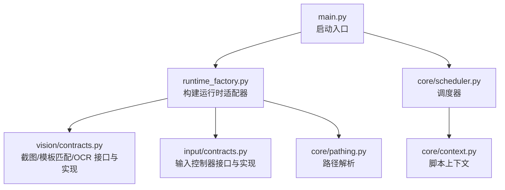
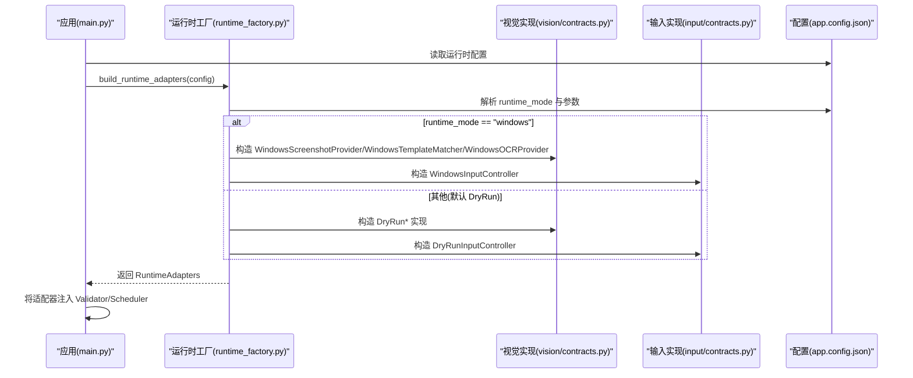
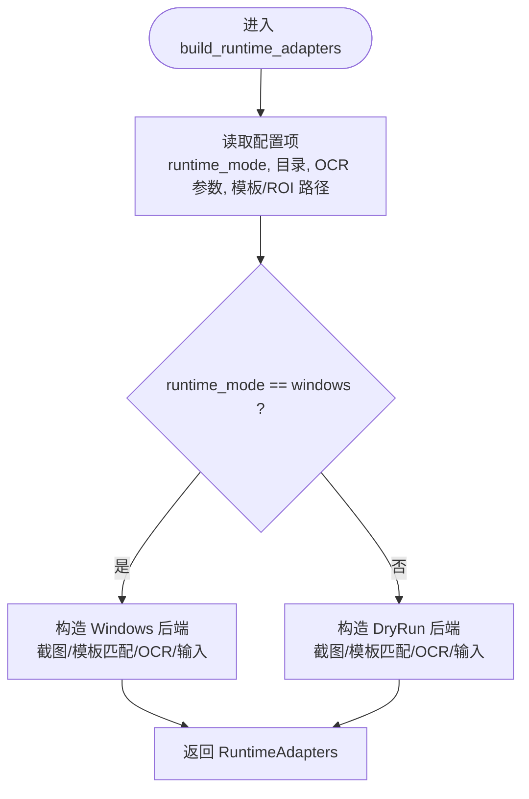
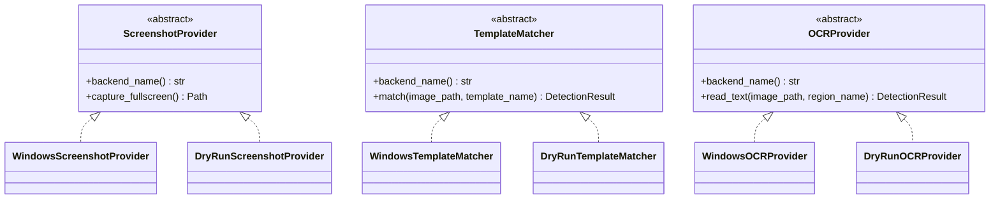
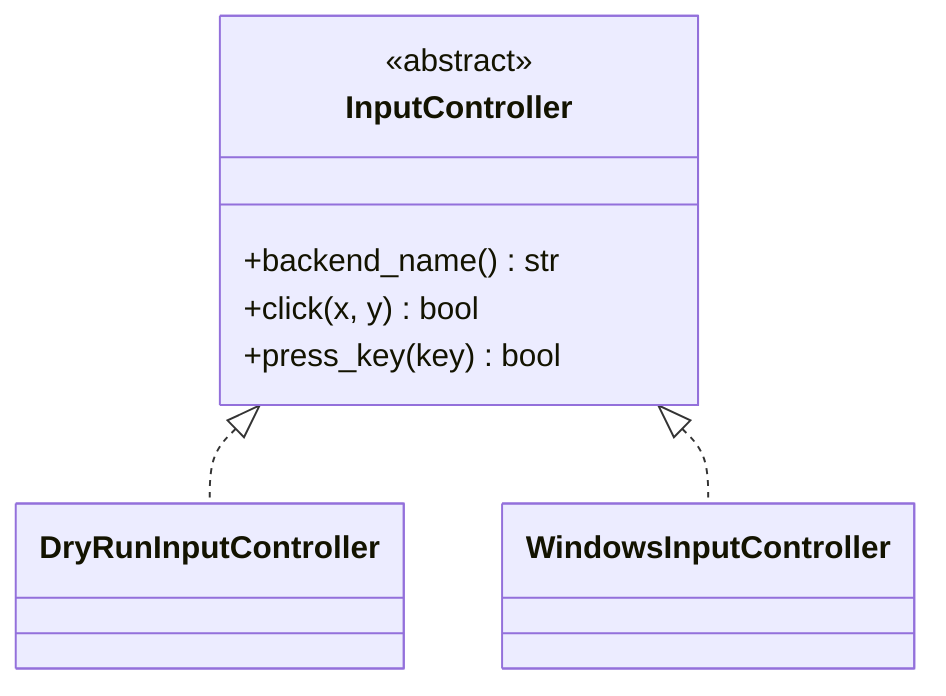
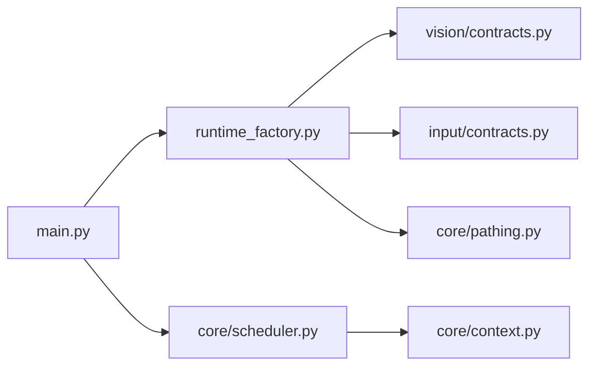

# 运行时工厂

<cite>
**本文引用的文件**
- [runtime_factory.py](file://src/core/runtime_factory.py)
- [contracts.py（视觉接口与实现）](file://src/vision/contracts.py)
- [contracts.py（输入接口与实现）](file://src/input/contracts.py)
- [app.config.json](file://config/app.config.json)
- [main.py](file://src/main.py)
- [pathing.py](file://src/core/pathing.py)
- [context.py](file://src/core/context.py)
- [scheduler.py](file://src/core/scheduler.py)
</cite>

## 目录
1. [简介](#简介)
2. [项目结构](#项目结构)
3. [核心组件](#核心组件)
4. [架构总览](#架构总览)
5. [详细组件分析](#详细组件分析)
6. [依赖关系分析](#依赖关系分析)
7. [性能考虑](#性能考虑)
8. [故障排查指南](#故障排查指南)
9. [结论](#结论)
10. [附录：扩展指南](#附录：扩展指南)

## 简介
本技术文档聚焦“运行时工厂”组件，系统性解释工厂模式在平台适配中的应用。通过配置文件动态创建不同运行时适配器实例（如 Windows 与 DryRun），并围绕 RuntimeAdapters 的创建与管理机制展开。文档同时阐述适配器的注册与发现、扩展新平台或运行模式的步骤、工厂模式的扩展性设计与依赖注入原理，并提供添加新适配器类型、配置参数以及处理创建失败的实践建议与最佳实践。

## 项目结构
本项目采用分层与按职责划分的方式组织代码：
- 核心层：状态机、调度器、上下文、路径解析、运行时工厂
- 能力抽象层：视觉与输入的接口定义及多后端实现
- 业务模块：平台校验、恢复管理
- 配置：应用配置、分辨率、模板与 ROI 配置
- 入口：主程序加载配置、装配运行时适配器并启动调度

图表来源
- [main.py:22-50](file://src/main.py#L22-L50)
- [runtime_factory.py:30-77](file://src/core/runtime_factory.py#L30-L77)
- [contracts.py（视觉接口与实现）:25-251](file://src/vision/contracts.py#L25-L251)
- [contracts.py（输入接口与实现）:10-65](file://src/input/contracts.py#L10-L65)
- [pathing.py:6-11](file://src/core/pathing.py#L6-L11)
- [scheduler.py:13-40](file://src/core/scheduler.py#L13-L40)
- [context.py:10-62](file://src/core/context.py#L10-L62)

章节来源
- [main.py:22-50](file://src/main.py#L22-L50)
- [runtime_factory.py:30-77](file://src/core/runtime_factory.py#L30-L77)

## 核心组件
- 运行时适配器集合：RuntimeAdapters 将截图、模板匹配、OCR、输入控制等能力聚合为一个统一对象，供上层使用。
- 运行时工厂：build_runtime_adapters 根据配置中的 runtime_mode 选择具体后端实现，完成依赖注入与组装。
- 视觉能力：提供 ScreenshotProvider、TemplateMatcher、OCRProvider 三类抽象与 DryRun/Windows 两套实现。
- 输入能力：InputController 抽象与 DryRun/Windows 两套实现。
- 配置驱动：app.config.json 决定运行模式、窗口关键词、OCR 语言/PSM、模板与 ROI 路径等。
- 启动装配：main.py 读取配置，调用工厂生成适配器，再注入到 PlatformValidator 与 Scheduler。

章节来源
- [runtime_factory.py:21-77](file://src/core/runtime_factory.py#L21-L77)
- [contracts.py（视觉接口与实现）:25-251](file://src/vision/contracts.py#L25-L251)
- [contracts.py（输入接口与实现）:10-65](file://src/input/contracts.py#L10-L65)
- [app.config.json:1-23](file://config/app.config.json#L1-L23)
- [main.py:22-50](file://src/main.py#L22-L50)

## 架构总览
运行时工厂位于系统装配层，屏蔽平台差异，向上层暴露统一的 RuntimeAdapters。上层仅依赖抽象接口，不感知具体实现，从而支持在不同环境（开发调试 vs 真实平台）间无缝切换。

图表来源
- [main.py:22-50](file://src/main.py#L22-L50)
- [runtime_factory.py:30-77](file://src/core/runtime_factory.py#L30-L77)
- [contracts.py（视觉接口与实现）:58-251](file://src/vision/contracts.py#L58-L251)
- [contracts.py（输入接口与实现）:25-65](file://src/input/contracts.py#L25-L65)
- [app.config.json:1-23](file://config/app.config.json#L1-L23)

## 详细组件分析

### 运行时适配器集合 RuntimeAdapters
- 作用：聚合截图、模板匹配、OCR、输入控制器以及下一步建议提示，作为单一依赖注入单元。
- 设计要点：使用数据类承载，避免散落的参数传递；next_step_suggestions 用于在不同模式下给出针对性建议。

章节来源
- [runtime_factory.py:21-28](file://src/core/runtime_factory.py#L21-L28)

### 运行时工厂 build_runtime_adapters
- 输入：配置字典（来自 app.config.json）。
- 行为：
  - 解析运行模式与关键参数（截图目录、调试目录、窗口标题关键词、OCR 语言/PSM/Tesseract 命令、模板与 ROI 路径）。
  - 根据 runtime_mode 分支创建具体后端实例。
  - 为 Windows 模式注入更多参数（ROI、模板、OCR 调试输出等）。
  - 为 DryRun 模式提供轻量占位实现，便于开发与联调。
- 输出：RuntimeAdapters 实例。

图表来源
- [runtime_factory.py:30-77](file://src/core/runtime_factory.py#L30-L77)
- [pathing.py:6-11](file://src/core/pathing.py#L6-L11)

章节来源
- [runtime_factory.py:30-77](file://src/core/runtime_factory.py#L30-L77)
- [pathing.py:6-11](file://src/core/pathing.py#L6-L11)

### 视觉能力抽象与实现
- 抽象接口：
  - ScreenshotProvider：提供 capture_fullscreen 与 backend_name。
  - TemplateMatcher：提供 match(image_path, template_name) -> DetectionResult。
  - OCRProvider：提供 read_text(image_path, region_name) -> DetectionResult。
- 实现：
  - DryRun*：轻量占位，返回固定成功结果与示例文本，便于流程贯通。
  - Windows*：基于 Windows API 截取窗口客户区区域、模板匹配（含 ROI 裁剪）、Tesseract OCR 预处理与识别。

图表来源
- [contracts.py（视觉接口与实现）:25-251](file://src/vision/contracts.py#L25-L251)

章节来源
- [contracts.py（视觉接口与实现）:25-251](file://src/vision/contracts.py#L25-L251)

### 输入能力抽象与实现
- 抽象接口：InputController 提供 click(x, y) 与 press_key(key)，以及 backend_name。
- 实现：
  - DryRunInputController：直接返回成功，无实际系统调用。
  - WindowsInputController：查找目标窗口并发送点击/按键，记录调试日志。

图表来源
- [contracts.py（输入接口与实现）:10-65](file://src/input/contracts.py#L10-L65)

章节来源
- [contracts.py（输入接口与实现）:10-65](file://src/input/contracts.py#L10-L65)

### 配置与装配
- 配置项说明（节选）：
  - runtime_mode：选择 windows 或 dry_run。
  - screenshot_dir/debug_dir：截图与调试输出目录。
  - window_title_keyword：目标窗口标题关键词。
  - ocr_language/ocr_psm/ocr_tesseract_cmd：OCR 语言、页面分割模式、可执行命令。
  - template_root/template_config_path/roi_config_path：模板根目录、模板配置、ROI 配置。
- 装配流程：
  - main.py 读取 app.config.json 与 resolution.config.json。
  - 调用 build_runtime_adapters 生成适配器。
  - 将适配器注入 PlatformValidator 与 Scheduler，启动调度。

章节来源
- [app.config.json:1-23](file://config/app.config.json#L1-L23)
- [main.py:22-50](file://src/main.py#L22-L50)

## 依赖关系分析
- 松耦合：上层仅依赖抽象接口（ScreenshotProvider、TemplateMatcher、OCRProvider、InputController），通过工厂注入具体实现。
- 配置驱动：运行时模式与参数集中管理，修改配置即可切换后端。
- 路径解析：通过 pathing.resolve_project_path 统一解析相对路径，避免硬编码绝对路径。
- 调度与上下文：Scheduler 与 ScriptContext 负责状态流转与超时保护，与运行时工厂解耦。

图表来源
- [main.py:22-50](file://src/main.py#L22-L50)
- [runtime_factory.py:30-77](file://src/core/runtime_factory.py#L30-L77)
- [contracts.py（视觉接口与实现）:25-251](file://src/vision/contracts.py#L25-L251)
- [contracts.py（输入接口与实现）:10-65](file://src/input/contracts.py#L10-L65)
- [pathing.py:6-11](file://src/core/pathing.py#L6-L11)
- [scheduler.py:13-40](file://src/core/scheduler.py#L13-L40)
- [context.py:10-62](file://src/core/context.py#L10-L62)

章节来源
- [runtime_factory.py:30-77](file://src/core/runtime_factory.py#L30-L77)
- [contracts.py（视觉接口与实现）:25-251](file://src/vision/contracts.py#L25-L251)
- [contracts.py（输入接口与实现）:10-65](file://src/input/contracts.py#L10-L65)
- [pathing.py:6-11](file://src/core/pathing.py#L6-L11)
- [scheduler.py:13-40](file://src/core/scheduler.py#L13-L40)
- [context.py:10-62](file://src/core/context.py#L10-L62)

## 性能考虑
- ROI 裁剪：模板匹配前按 ROI 裁剪图像，减少全图匹配开销，提升速度并降低误检。
- 双路 OCR 择优：分别对灰度与二值化图像进行 OCR，择优返回，提高鲁棒性。
- 调试输出：OCR 与输入操作均输出调试文件，便于定位问题但不影响主流程。
- 资源初始化：各 Provider 在构造时创建必要目录，避免运行时重复检查。
- 建议：
  - 合理设置 OCR PSM 与语言，减少无效计算。
  - 模板阈值与 ROI 标定需与分辨率严格匹配，避免越界与低置信度导致的重试放大。
  - 在高并发或长时运行场景下，注意文件 I/O 与外部进程（Tesseract）的开销。

章节来源
- [contracts.py（视觉接口与实现）:119-185](file://src/vision/contracts.py#L119-L185)
- [contracts.py（视觉接口与实现）:188-251](file://src/vision/contracts.py#L188-L251)
- [contracts.py（输入接口与实现）:37-65](file://src/input/contracts.py#L37-L65)

## 故障排查指南
- 常见失败点
  - 窗口未找到：Windows 模式下需确保 window_title_keyword 能稳定命中目标窗口。
  - ROI 越界：模板绑定 ROI 但当前分辨率不一致会导致裁剪异常，应调整 ROI 或分辨率。
  - OCR 不可用：tesseract 命令不存在或语言包缺失，需检查环境变量与安装。
  - 模板匹配失败：阈值过高或模板质量不佳，需重新采集模板或调低阈值。
- 定位方法
  - 查看截图目录与调试目录下的文件，确认截图是否有效、OCR 中间产物是否正确。
  - 检查输入调试日志，确认点击/按键是否发送到正确窗口。
  - 结合 next_step_suggestions 提供的建议逐步验证链路。
- 恢复策略
  - 调度器内置超时与恢复机制，严重错误会转入 MANUAL_REQUIRED 状态，等待人工介入。

章节来源
- [scheduler.py:32-40](file://src/core/scheduler.py#L32-L40)
- [contracts.py（视觉接口与实现）:143-163](file://src/vision/contracts.py#L143-L163)
- [contracts.py（输入接口与实现）:47-65](file://src/input/contracts.py#L47-L65)

## 结论
运行时工厂通过配置驱动与依赖注入，将平台差异封装在抽象接口之后，使上层逻辑保持简洁与可测试。当前已支持 Windows 与 DryRun 两种模式，具备可扩展性以接入更多平台或运行模式。配合 ROI、模板与 OCR 的优化，整体链路在固定环境下具备较高稳定性。后续可按附录指引平滑扩展新的适配器类型。

## 附录：扩展指南

### 如何添加新的适配器类型
- 步骤概览
  1. 新增实现类：在 vision/contracts.py 或 input/contracts.py 中新增对应后端实现，遵循已有抽象接口。
  2. 在工厂中注册：在 build_runtime_adapters 中增加新的分支或映射，依据配置选择新实现。
  3. 配置项扩展：如需新参数，先在 app.config.json 中添加键值，并在工厂中读取与注入。
  4. 测试验证：切换到新模式，验证截图、匹配、OCR、输入链路是否正常。
- 参考位置
  - 新增实现：[contracts.py（视觉接口与实现）:58-251](file://src/vision/contracts.py#L58-L251)、[contracts.py（输入接口与实现）:25-65](file://src/input/contracts.py#L25-L65)
  - 工厂分支：[runtime_factory.py:30-77](file://src/core/runtime_factory.py#L30-L77)
  - 配置键：[app.config.json:1-23](file://config/app.config.json#L1-L23)

### 如何配置适配器参数
- 关键配置项
  - runtime_mode：选择 windows 或 dry_run。
  - screenshot_dir/debug_dir：截图与调试输出目录。
  - window_title_keyword：目标窗口标题关键词。
  - ocr_language/ocr_psm/ocr_tesseract_cmd：OCR 语言、页面分割模式、可执行命令。
  - template_root/template_config_path/roi_config_path：模板与 ROI 相关路径。
- 注入方式：工厂从配置读取后传入对应 Provider 构造函数。

章节来源
- [app.config.json:1-23](file://config/app.config.json#L1-L23)
- [runtime_factory.py:30-77](file://src/core/runtime_factory.py#L30-L77)

### 如何处理适配器创建失败
- 建议策略
  - 在工厂中捕获异常并降级：例如当 Windows 后端初始化失败时，回退到 DryRun 模式或抛出明确错误。
  - 记录诊断信息：写入调试目录，包含失败原因、当前配置与堆栈摘要。
  - 通知上层：让 main.py 或 Scheduler 根据错误决定是否终止或进入恢复流程。
- 参考位置
  - 工厂入口：[runtime_factory.py:30-77](file://src/core/runtime_factory.py#L30-L77)
  - 调度恢复：[scheduler.py:32-40](file://src/core/scheduler.py#L32-L40)

### 最佳实践
- 保持抽象稳定：新增后端只实现接口，不改动上层调用。
- 配置与实现分离：所有可调参数集中在配置文件中，避免硬编码。
- 最小化副作用：Provider 构造只做必要初始化，避免阻塞启动。
- 可观测性：输出必要的调试文件与日志，便于定位问题。
- 渐进式增强：先保证 DryRun 链路通畅，再逐步替换为真实后端。

### 性能建议
- 优先使用 ROI 裁剪以减少匹配范围。
- 合理设置 OCR 参数，避免过度预处理。
- 复用共享资源（如模板注册表、ROI 仓库）以降低重复加载成本。
- 对高耗时操作（如 OCR）增加超时与重试上限，防止卡死。