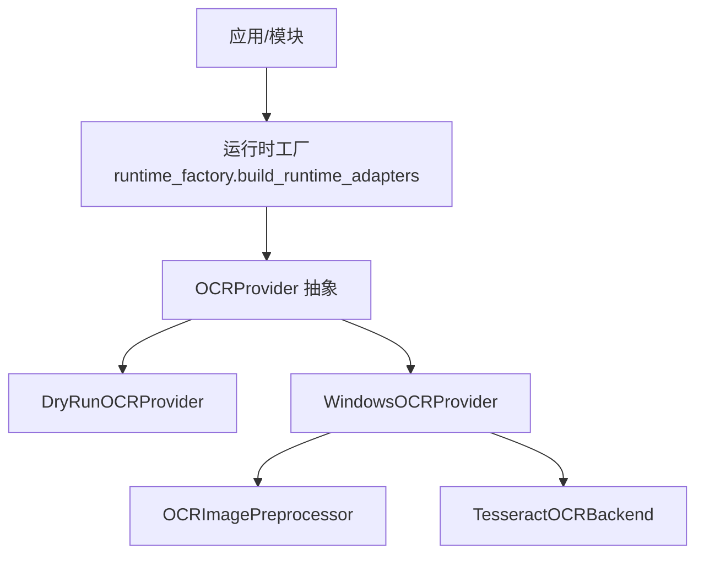
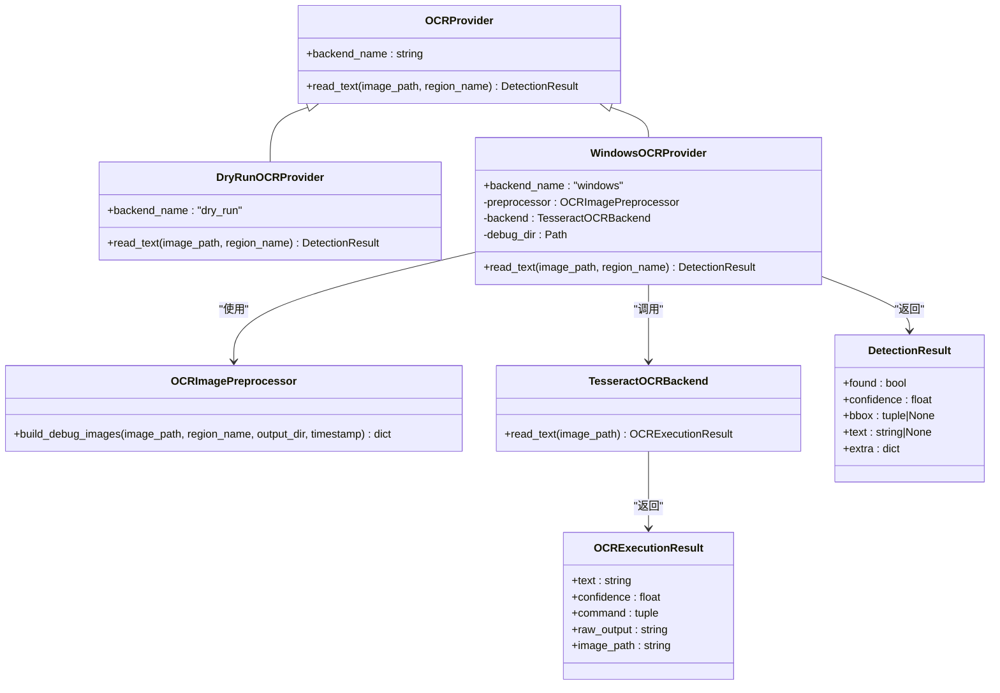
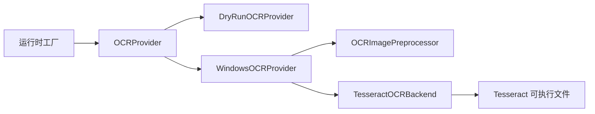
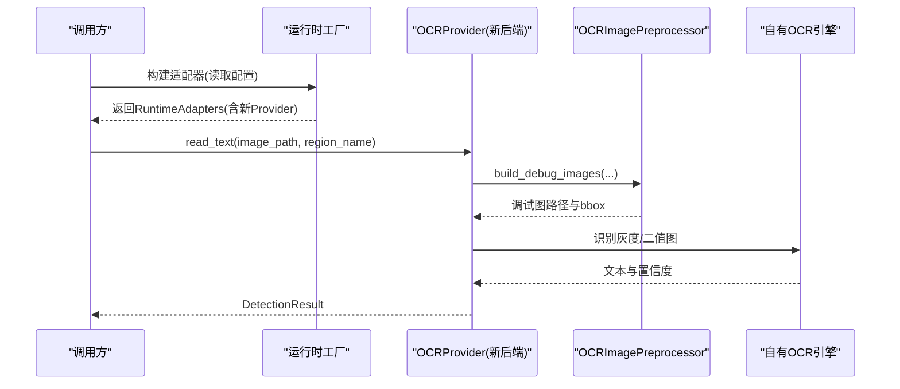

# OCRProvider接口设计

<cite>
**本文引用的文件**
- [src/vision/contracts.py](file://src/vision/contracts.py)
- [src/vision/ocr.py](file://src/vision/ocr.py)
- [src/core/runtime_factory.py](file://src/core/runtime_factory.py)
- [config/app.config.json](file://config/app.config.json)
- [tools/test_ocr.py](file://tools/test_ocr.py)
</cite>

## 目录
1. [简介](#简介)
2. [项目结构](#项目结构)
3. [核心组件](#核心组件)
4. [架构总览](#架构总览)
5. [详细组件分析](#详细组件分析)
6. [依赖关系分析](#依赖关系分析)
7. [性能考虑](#性能考虑)
8. [故障排查指南](#故障排查指南)
9. [结论](#结论)
10. [附录：扩展新OCR后端指南](#附录：扩展新ocr后端指南)

## 简介
本技术文档围绕 OCRProvider 抽象接口及其两种实现 DryRunOCRProvider、WindowsOCRProvider 展开，系统性阐述其设计理念、抽象层次、识别方法参数与返回值结构、异常处理机制，以及如何通过该接口支持不同 OCR 后端与平台适配。同时提供使用示例、最佳实践与扩展新后端的指导说明。

## 项目结构
与 OCRProvider 相关的代码主要分布在以下位置：
- 抽象与实现定义：src/vision/contracts.py
- OCR 后端与图像预处理：src/vision/ocr.py
- 运行时装配（根据配置选择 dry_run 或 windows）：src/core/runtime_factory.py
- 应用配置（语言、PSM、Tesseract 命令等）：config/app.config.json
- 独立测试工具（验证截图→ROI→预处理→OCR 链路）：tools/test_ocr.py

图表来源
- [src/core/runtime_factory.py:30-77](file://src/core/runtime_factory.py#L30-L77)
- [src/vision/contracts.py:47-55](file://src/vision/contracts.py#L47-L55)
- [src/vision/contracts.py:87-98](file://src/vision/contracts.py#L87-L98)
- [src/vision/contracts.py:188-250](file://src/vision/contracts.py#L188-L250)
- [src/vision/ocr.py:23-70](file://src/vision/ocr.py#L23-L70)
- [src/vision/ocr.py:73-107](file://src/vision/ocr.py#L73-L107)

章节来源
- [src/core/runtime_factory.py:30-77](file://src/core/runtime_factory.py#L30-L77)
- [src/vision/contracts.py:47-55](file://src/vision/contracts.py#L47-L55)
- [src/vision/ocr.py:23-70](file://src/vision/ocr.py#L23-L70)
- [src/vision/ocr.py:73-107](file://src/vision/ocr.py#L73-L107)

## 核心组件
- OCRProvider：抽象接口，统一对外暴露 OCR 能力，屏蔽后端差异。
- DryRunOCRProvider：无需真实 OCR 的“干跑”实现，用于开发调试与流程验证。
- WindowsOCRProvider：基于 Tesseract 的真实实现，包含 ROI 裁切、灰度/二值化预处理与结果择优。
- TesseractOCRBackend：封装 Tesseract 命令行调用、TSV 解析与错误处理。
- OCRImagePreprocessor：按 ROI 配置生成原始图、灰度图、二值化图并输出调试图片。

章节来源
- [src/vision/contracts.py:47-55](file://src/vision/contracts.py#L47-L55)
- [src/vision/contracts.py:87-98](file://src/vision/contracts.py#L87-L98)
- [src/vision/contracts.py:188-250](file://src/vision/contracts.py#L188-L250)
- [src/vision/ocr.py:23-70](file://src/vision/ocr.py#L23-L70)
- [src/vision/ocr.py:73-107](file://src/vision/ocr.py#L73-L107)

## 架构总览
OCRProvider 作为抽象层，向上屏蔽具体 OCR 引擎的差异；向下通过 TesseractOCRBackend 执行外部进程，并通过 OCRImagePreprocessor 完成图像预处理。运行时根据配置在 dry_run 与 windows 模式间切换。

图表来源
- [src/vision/contracts.py:47-55](file://src/vision/contracts.py#L47-L55)
- [src/vision/contracts.py:87-98](file://src/vision/contracts.py#L87-L98)
- [src/vision/contracts.py:188-250](file://src/vision/contracts.py#L188-L250)
- [src/vision/ocr.py:14-20](file://src/vision/ocr.py#L14-L20)
- [src/vision/ocr.py:23-70](file://src/vision/ocr.py#L23-L70)
- [src/vision/ocr.py:73-107](file://src/vision/ocr.py#L73-L107)

## 详细组件分析

### OCRProvider 抽象接口
- 设计理念：以最小契约暴露 OCR 能力，屏蔽后端差异，便于替换与扩展。
- 抽象层次：
  - backend_name：标识当前后端类型，便于日志与诊断。
  - read_text(image_path, region_name)：输入为图像路径与 ROI 名称，输出标准化检测结果。
- 参数定义：
  - image_path：待识别图像的绝对或相对路径。
  - region_name：ROI 名称，用于定位裁剪区域。
- 返回值结构：DetectionResult
  - found：是否识别到有效文本。
  - confidence：置信度（0~1）。
  - bbox：可选边界框坐标。
  - text：识别出的文本（可能为空）。
  - extra：扩展信息（如后端名、语言、PSM、命令、调试图路径等）。
- 异常处理：
  - 接口本身不抛业务异常；具体实现可抛出底层异常（如文件不存在、外部命令失败），由上层捕获处理。

章节来源
- [src/vision/contracts.py:47-55](file://src/vision/contracts.py#L47-L55)
- [src/vision/contracts.py:16-22](file://src/vision/contracts.py#L16-L22)

### DryRunOCRProvider 实现
- 用途：无需安装 OCR 引擎即可运行，适合开发联调、回归测试与演示。
- 行为特征：
  - 始终返回 found=True 与固定高置信度。
  - 文本内容为占位字符串，便于区分是否为干跑模式。
  - 不访问文件系统进行 OCR，仅记录传入的 image_path。
- 适用场景：
  - 快速验证业务流程与数据流。
  - 在无 OCR 环境或 CI 中稳定运行。

章节来源
- [src/vision/contracts.py:87-98](file://src/vision/contracts.py#L87-L98)

### WindowsOCRProvider 实现
- 职责：将图像经 ROI 裁切与预处理后，调用 Tesseract 进行识别，并择优合并结果。
- 关键步骤：
  - 构建调试图像：原始图、灰度图、二值图，保存至 debug_dir。
  - 分别对灰度图与二值图执行 OCR。
  - 择优策略：优先有文本，其次置信度高，再次文本长度更长。
  - 组装 DetectionResult，附带 region_name、各调试图路径、后端名、语言、PSM、命令、图像路径等。
- 参数与配置：
  - roi_config_path：ROI 配置文件路径。
  - debug_dir：调试图输出根目录。
  - tesseract_cmd：Tesseract 可执行文件名或路径。
  - language：识别语言。
  - psm：页面分割模式。
- 适用场景：
  - Windows 平台上的真实 OCR 识别。
  - 需要调试图与详细元数据的场景。

章节来源
- [src/vision/contracts.py:188-250](file://src/vision/contracts.py#L188-L250)
- [src/vision/ocr.py:73-107](file://src/vision/ocr.py#L73-L107)

### TesseractOCRBackend 与 OCRImagePreprocessor
- TesseractOCRBackend：
  - 校验输入图像是否存在。
  - 查找 Tesseract 可执行文件，未找到则抛出运行时异常。
  - 调用子进程执行 Tesseract，解析 TSV 输出，计算平均置信度。
  - 非零返回码时抛出运行时异常，携带 stderr/stdout 信息。
- OCRImagePreprocessor：
  - 读取 ROI 配置，裁剪出目标区域。
  - 生成灰度图与二值图，并进行缩放以便后续识别。
  - 输出调试图路径与边界框信息。

章节来源
- [src/vision/ocr.py:23-70](file://src/vision/ocr.py#L23-L70)
- [src/vision/ocr.py:73-107](file://src/vision/ocr.py#L73-L107)

### 运行时装配与配置
- runtime_factory 根据 app.config.json 中的 runtime_mode 决定使用 DryRun 还是 Windows 实现。
- 当 mode 为 windows 时，注入 WindowsOCRProvider，并传递 ROI 配置、调试目录、Tesseract 命令、语言与 PSM。
- 当 mode 为 dry_run 时，注入 DryRunOCRProvider，便于无依赖运行。

章节来源
- [src/core/runtime_factory.py:30-77](file://src/core/runtime_factory.py#L30-L77)
- [config/app.config.json:1-23](file://config/app.config.json#L1-L23)

## 依赖关系分析
- OCRProvider 被上层模块通过 RuntimeAdapters 注入，解耦了具体实现。
- WindowsOCRProvider 依赖 OCRImagePreprocessor 与 TesseractOCRBackend。
- TesseractOCRBackend 依赖系统级 Tesseract 可执行文件。
- 配置集中管理于 app.config.json，便于多环境切换。

图表来源
- [src/core/runtime_factory.py:30-77](file://src/core/runtime_factory.py#L30-L77)
- [src/vision/contracts.py:188-250](file://src/vision/contracts.py#L188-L250)
- [src/vision/ocr.py:23-70](file://src/vision/ocr.py#L23-L70)

章节来源
- [src/core/runtime_factory.py:30-77](file://src/core/runtime_factory.py#L30-L77)
- [src/vision/contracts.py:188-250](file://src/vision/contracts.py#L188-L250)
- [src/vision/ocr.py:23-70](file://src/vision/ocr.py#L23-L70)

## 性能考虑
- 预处理优化：
  - 先裁剪 ROI，再灰度化与二值化，减少无效像素处理。
  - 二值化采用 Otsu 阈值自动估计，并在暗像素占比过高时反转，提升对比度。
  - 缩放因子可调，平衡识别精度与耗时。
- 并行与重试：
  - 对灰度图与二值图分别执行 OCR，择优合并，提高鲁棒性。
  - 可在上层增加超时与重试逻辑，避免外部进程阻塞。
- I/O 与缓存：
  - 调试图写入磁盘便于问题定位，生产环境可关闭或异步落盘。
  - 若同一图像多次识别，可缓存中间结果以减少重复计算。

[本节为通用性能建议，不直接分析具体文件]

## 故障排查指南
- 常见异常与定位：
  - 输入图像不存在：TesseractOCRBackend 会抛出 FileNotFoundError，检查 image_path 是否正确。
  - Tesseract 未安装或不可用：抛出 RuntimeError，提示安装或配置 ocr_tesseract_cmd。
  - Tesseract 执行失败：捕获 stderr/stdout 信息，检查语言包、PSM 设置与图像质量。
  - ROI 越界：模板匹配与 OCR 预处理阶段应做边界检查，避免崩溃。
- 调试手段：
  - 启用调试图输出，查看 raw/gray/binary 三张图，确认 ROI 裁剪与预处理效果。
  - 使用 tools/test_ocr.py 逐步验证截图、ROI、预处理与 OCR 链路。
  - 调整 app.config.json 中的 ocr_language、ocr_psm、ocr_tesseract_cmd 等参数。

章节来源
- [src/vision/ocr.py:23-70](file://src/vision/ocr.py#L23-L70)
- [tools/test_ocr.py:57-176](file://tools/test_ocr.py#L57-L176)
- [config/app.config.json:1-23](file://config/app.config.json#L1-L23)

## 结论
OCRProvider 以简洁抽象统一了 OCR 能力，DryRun 与 Windows 两种实现覆盖了开发与生产场景。通过 ROI 预处理与双路识别择优，提升了识别鲁棒性。结合运行时工厂与集中配置，系统具备良好的可扩展性与可维护性。

[本节为总结性内容，不直接分析具体文件]

## 附录：扩展新OCR后端指南
- 目标：新增一个自定义 OCR 后端，保持与现有体系一致。
- 步骤：
  1. 在 contracts.py 中新增类实现 OCRProvider 接口，实现 backend_name 与 read_text。
  2. 在 read_text 中：
     - 接收 image_path 与 region_name。
     - 可选地复用 OCRImagePreprocessor 进行预处理。
     - 调用自有 OCR 引擎或外部服务。
     - 返回 DetectionResult，填充 found、confidence、bbox、text、extra。
  3. 在 runtime_factory.py 中：
     - 新增分支或配置项，选择新后端。
     - 将新实例注入 RuntimeAdapters 的 ocr_provider。
  4. 在 app.config.json 中：
     - 添加必要配置键（如 engine、endpoint、token 等）。
  5. 编写单元测试与集成测试：
     - 覆盖正常路径、空文本、低置信度、异常路径。
  6. 更新文档与示例：
     - 补充使用方式、参数说明与故障排查要点。

图表来源
- [src/core/runtime_factory.py:30-77](file://src/core/runtime_factory.py#L30-L77)
- [src/vision/contracts.py:47-55](file://src/vision/contracts.py#L47-L55)
- [src/vision/ocr.py:73-107](file://src/vision/ocr.py#L73-L107)

最佳实践
- 保持 DetectionResult 语义一致：found 表示是否有有效文本，confidence 归一化到 0~1。
- 将后端相关元数据放入 extra，便于追踪与审计。
- 对异常进行明确分类与提示，便于上层统一处理。
- 在生产环境关闭不必要的调试图落盘，或改为异步与限流。

[本节为通用指导，不直接分析具体文件]