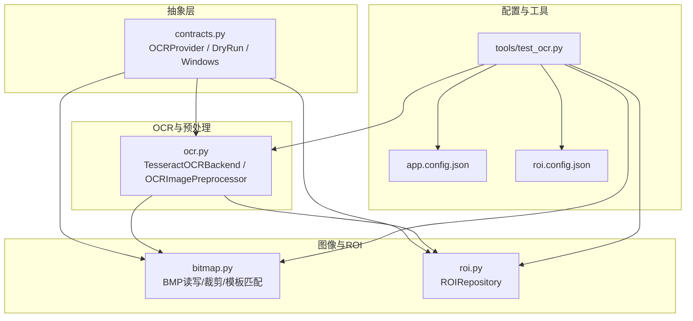
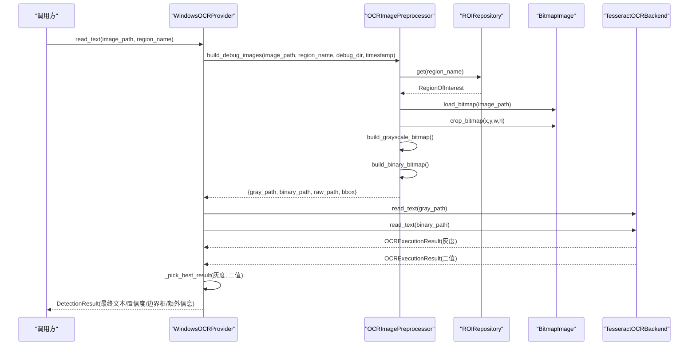
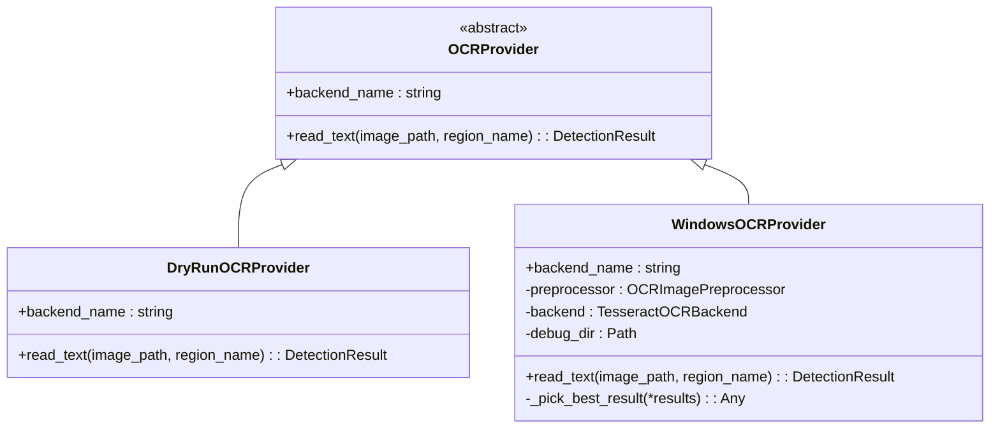
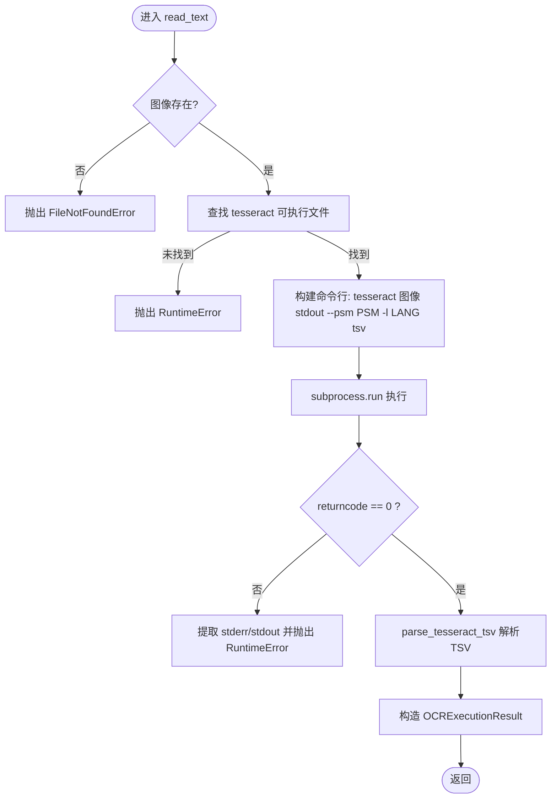
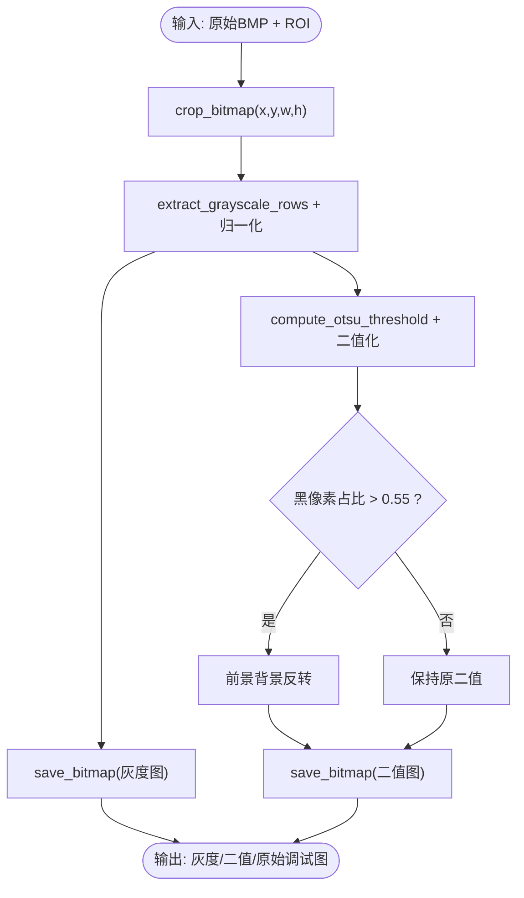
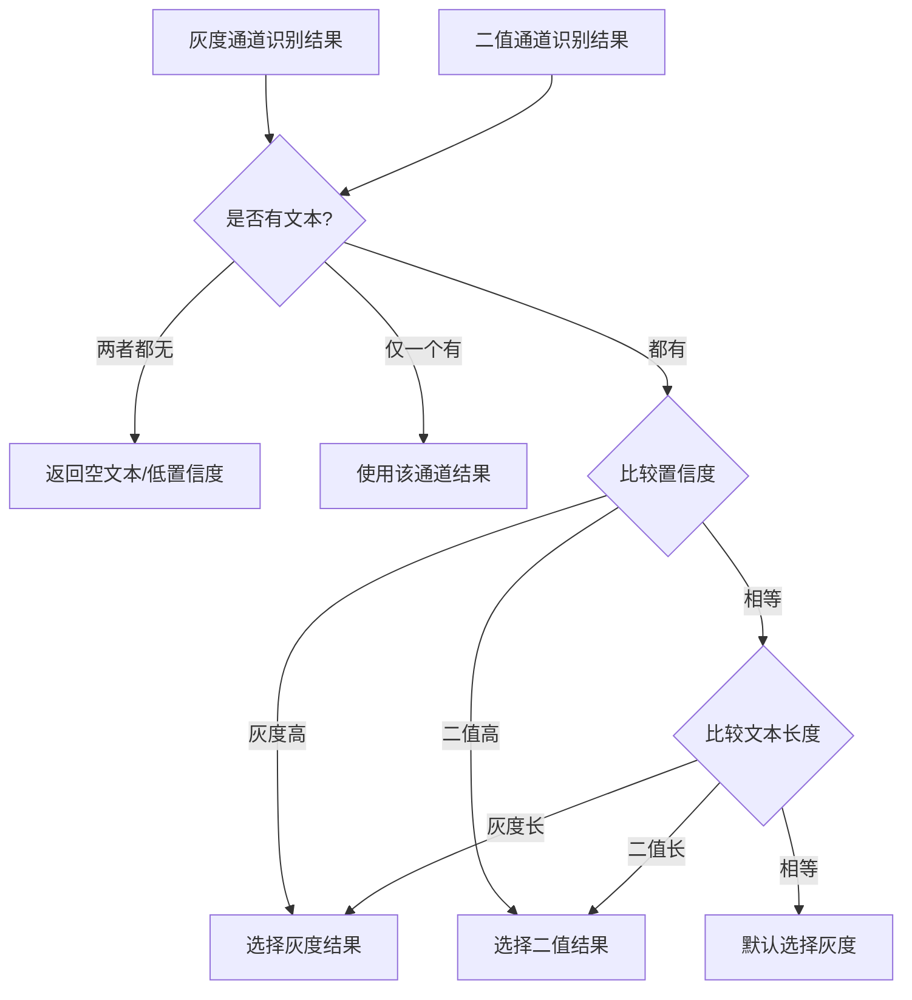
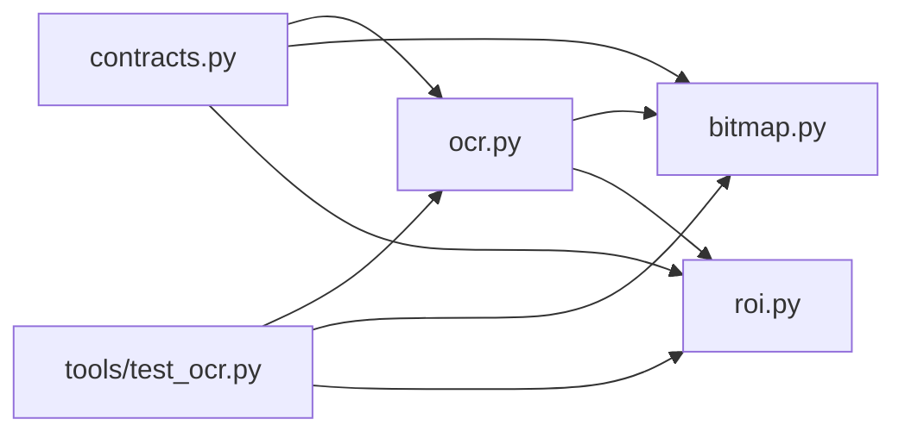

# OCR文字识别

<cite>
**本文引用的文件**
- [src/vision/ocr.py](file://src/vision/ocr.py)
- [src/vision/contracts.py](file://src/vision/contracts.py)
- [src/vision/bitmap.py](file://src/vision/bitmap.py)
- [src/vision/roi.py](file://src/vision/roi.py)
- [config/app.config.json](file://config/app.config.json)
- [config/roi.config.json](file://config/roi.config.json)
- [tools/test_ocr.py](file://tools/test_ocr.py)
- [README.md](file://README.md)
</cite>

## 目录
1. [简介](#简介)
2. [项目结构](#项目结构)
3. [核心组件](#核心组件)
4. [架构总览](#架构总览)
5. [详细组件分析](#详细组件分析)
6. [依赖关系分析](#依赖关系分析)
7. [性能考虑](#性能考虑)
8. [故障排查指南](#故障排查指南)
9. [结论](#结论)
10. [附录](#附录)

## 简介
本技术文档围绕仓库中的OCR文字识别子系统展开，重点解释以下方面：
- OCRProvider抽象接口的设计与实现差异（DryRunOCRProvider 与 WindowsOCRProvider）
- Tesseract OCR后端的集成方案（引擎配置、语言包管理、命令行参数）
- 图像预处理流程（灰度转换、二值化、ROI裁剪）
- 双通道识别策略（灰度图与二值图分别识别及结果选择算法）
- 文本后处理机制（清洗、格式化、置信度评估）
- 配置示例、语言包安装指南与识别效果优化技巧
- 常见问题诊断方法与性能调优建议

## 项目结构
OCR相关能力集中在 vision 模块中，配合配置与工具脚本形成完整链路：
- 抽象与提供者：contracts.py 定义 ScreenshotProvider、TemplateMatcher、OCRProvider 等抽象；并提供 DryRun 与 Windows 两种实现。
- OCR后端与预处理：ocr.py 提供 TesseractOCRBackend、OCRImagePreprocessor 以及灰度/二值化、OTSU阈值、缩放等工具函数。
- 位图与ROI：bitmap.py 负责BMP读写、裁剪、模板匹配；roi.py 负责ROI配置的加载与持久化。
- 配置：app.config.json 集中OCR语言、PSM模式、Tesseract命令路径等；roi.config.json 定义各业务区域的坐标。
- 测试工具：tools/test_ocr.py 提供端到端验证入口，支持截图、ROI裁剪、预处理、调用Tesseract并输出调试图与结果。

图表来源
- [src/vision/contracts.py:47-251](file://src/vision/contracts.py#L47-L251)
- [src/vision/ocr.py:23-107](file://src/vision/ocr.py#L23-L107)
- [src/vision/bitmap.py:17-115](file://src/vision/bitmap.py#L17-L115)
- [src/vision/roi.py:21-68](file://src/vision/roi.py#L21-L68)
- [config/app.config.json:1-23](file://config/app.config.json#L1-L23)
- [config/roi.config.json:1-31](file://config/roi.config.json#L1-L31)
- [tools/test_ocr.py:26-180](file://tools/test_ocr.py#L26-L180)

章节来源
- [src/vision/contracts.py:47-251](file://src/vision/contracts.py#L47-L251)
- [src/vision/ocr.py:23-107](file://src/vision/ocr.py#L23-L107)
- [src/vision/bitmap.py:17-115](file://src/vision/bitmap.py#L17-L115)
- [src/vision/roi.py:21-68](file://src/vision/roi.py#L21-L68)
- [config/app.config.json:1-23](file://config/app.config.json#L1-L23)
- [config/roi.config.json:1-31](file://config/roi.config.json#L1-L31)
- [tools/test_ocr.py:26-180](file://tools/test_ocr.py#L26-L180)

## 核心组件
- OCRProvider 抽象接口：统一 read_text(image_path, region_name) 的识别契约，屏蔽不同后端差异。
- DryRunOCRProvider：不执行真实OCR，返回固定占位结果，用于联调与回归测试。
- WindowsOCRProvider：组合 OCRImagePreprocessor 与 TesseractOCRBackend，完成“截图→ROI→预处理→双通道识别→结果选择”的完整流程。
- TesseractOCRBackend：封装Tesseract命令行调用、TSV解析、错误处理与置信度计算。
- OCRImagePreprocessor：基于ROI配置裁剪原始图像，生成灰度图与二值图，并保存调试图。
- BitmapImage/BMP工具：BMP读取/写入、ROI裁剪、灰度化、模板匹配等基础图像处理能力。
- ROIRepository：从JSON加载/更新ROI区域，供模板匹配与OCR预处理使用。

章节来源
- [src/vision/contracts.py:47-251](file://src/vision/contracts.py#L47-L251)
- [src/vision/ocr.py:23-107](file://src/vision/ocr.py#L23-L107)
- [src/vision/bitmap.py:17-115](file://src/vision/bitmap.py#L17-L115)
- [src/vision/roi.py:21-68](file://src/vision/roi.py#L21-L68)

## 架构总览
下图展示了Windows场景下OCR识别的端到端数据流：从截图到ROI裁剪、预处理、双通道识别与结果选择。

图表来源
- [src/vision/contracts.py:188-251](file://src/vision/contracts.py#L188-L251)
- [src/vision/ocr.py:73-107](file://src/vision/ocr.py#L73-L107)
- [src/vision/ocr.py:23-70](file://src/vision/ocr.py#L23-L70)
- [src/vision/bitmap.py:17-115](file://src/vision/bitmap.py#L17-L115)
- [src/vision/roi.py:21-46](file://src/vision/roi.py#L21-L46)

## 详细组件分析

### OCRProvider抽象接口与实现差异
- 抽象接口
  - backend_name：标识当前后端名称，便于日志与路由。
  - read_text(image_path, region_name)：输入为图像路径与ROI名称，返回标准化检测结果。
- DryRunOCRProvider
  - 行为：不调用外部OCR，直接返回固定文本与高置信度，便于快速验证上下游链路。
  - 适用：单元测试、CI流水线、无Tesseract环境下的联调。
- WindowsOCRProvider
  - 行为：组合预处理与Tesseract后端，进行灰度图与二值图双通道识别，并通过内置策略选择最优结果。
  - 优势：在复杂背景或低对比度场景中，通过双通道互补提升鲁棒性。

图表来源
- [src/vision/contracts.py:47-99](file://src/vision/contracts.py#L47-L99)
- [src/vision/contracts.py:188-251](file://src/vision/contracts.py#L188-L251)

章节来源
- [src/vision/contracts.py:47-99](file://src/vision/contracts.py#L47-L99)
- [src/vision/contracts.py:188-251](file://src/vision/contracts.py#L188-L251)

### Tesseract OCR后端集成
- 引擎配置
  - tesseract_cmd：可执行文件名或绝对路径，默认“tesseract”。
  - language：语言代码，如“eng”，需对应已安装的语言包。
  - psm：页面分割模式，影响行/词/块识别策略。
- 命令行参数
  - 以TSV格式输出，包含每行的token、置信度与层级信息，便于聚合与置信度统计。
  - 关键参数：--psm、-l、tsv。
- 语言包管理
  - 需在系统安装Tesseract及对应语言数据；若未找到可执行文件或语言包缺失，将抛出运行时异常。
- 错误处理
  - 检查输入图像是否存在。
  - 检查Tesseract可执行文件是否可用。
  - 捕获子进程返回码，非零时抛出异常并附带stderr/stdout信息。
- 结果解析
  - 按页/块/段落/行分组拼接token，得到最终文本。
  - 置信度为所有有效token置信度的均值，归一化至[0,1]。

图表来源
- [src/vision/ocr.py:23-70](file://src/vision/ocr.py#L23-L70)
- [src/vision/ocr.py:110-141](file://src/vision/ocr.py#L110-L141)

章节来源
- [src/vision/ocr.py:23-70](file://src/vision/ocr.py#L23-L70)
- [src/vision/ocr.py:110-141](file://src/vision/ocr.py#L110-L141)

### 图像预处理流程
- ROI裁剪
  - 通过ROIRepository加载指定区域坐标，对原始BMP进行精确裁剪，避免全图处理带来的性能问题。
- 灰度转换
  - 使用标准亮度公式对RGB像素进行加权求和，得到灰度矩阵。
  - 对灰度矩阵进行线性归一化，使最小值映射为0、最大值映射为255，增强对比度。
- 二值化
  - 采用Otsu方法自动计算全局阈值，将灰度图转换为黑白二值图。
  - 根据黑像素占比自适应反转前景/背景，确保文字为深色、背景为浅色（或反之），提高识别稳定性。
- 调试图输出
  - 同时保存原始ROI图、灰度图、二值图，便于可视化定位问题。

图表来源
- [src/vision/ocr.py:73-107](file://src/vision/ocr.py#L73-L107)
- [src/vision/ocr.py:144-177](file://src/vision/ocr.py#L144-L177)
- [src/vision/ocr.py:203-280](file://src/vision/ocr.py#L203-L280)
- [src/vision/bitmap.py:17-115](file://src/vision/bitmap.py#L17-L115)

章节来源
- [src/vision/ocr.py:73-107](file://src/vision/ocr.py#L73-L107)
- [src/vision/ocr.py:144-177](file://src/vision/ocr.py#L144-L177)
- [src/vision/ocr.py:203-280](file://src/vision/ocr.py#L203-L280)
- [src/vision/bitmap.py:17-115](file://src/vision/bitmap.py#L17-L115)

### 双通道识别策略与结果选择
- 双通道设计
  - 灰度通道：保留更多亮度细节，适合字体清晰、对比度良好的场景。
  - 二值通道：去除噪声干扰，适合复杂背景或低对比度场景。
- 结果选择算法
  - 优先选择有内容的结果。
  - 在有内容的前提下，比较置信度。
  - 若置信度相同，选择文本长度更长的结果。
- 优势
  - 通过互补通道覆盖更多识别场景，降低单一通道的脆弱性。
  - 结合置信度与长度启发式，兼顾准确性与完整性。

图表来源
- [src/vision/contracts.py:210-251](file://src/vision/contracts.py#L210-L251)

章节来源
- [src/vision/contracts.py:210-251](file://src/vision/contracts.py#L210-L251)

### 文本后处理机制
- 清洗
  - 过滤空token与无效置信度，避免污染最终文本。
- 格式化
  - 按页/块/段落/行维度重组token序列，保证阅读顺序正确。
  - 行内token以空格连接，行间以换行连接。
- 置信度评估
  - 对所有有效token的置信度求平均，并归一化到[0,1]区间，作为整体可信度指标。

章节来源
- [src/vision/ocr.py:110-141](file://src/vision/ocr.py#L110-L141)

## 依赖关系分析
- 模块耦合
  - contracts.py 依赖 ocr.py、bitmap.py、roi.py，向上暴露统一接口。
  - ocr.py 依赖 bitmap.py 与 roi.py，向下封装图像处理与ROI访问。
  - tools/test_ocr.py 作为入口，串联上述模块进行端到端验证。
- 外部依赖
  - Tesseract可执行文件与语言包：由系统环境与配置文件共同决定。
  - BMP图像：仅支持未压缩的24/32位BMP。
- 潜在循环依赖
  - 当前结构为单向依赖，未见循环引用。

图表来源
- [src/vision/contracts.py:1-251](file://src/vision/contracts.py#L1-L251)
- [src/vision/ocr.py:1-280](file://src/vision/ocr.py#L1-L280)
- [src/vision/bitmap.py:1-201](file://src/vision/bitmap.py#L1-L201)
- [src/vision/roi.py:1-68](file://src/vision/roi.py#L1-L68)
- [tools/test_ocr.py:1-181](file://tools/test_ocr.py#L1-L181)

章节来源
- [src/vision/contracts.py:1-251](file://src/vision/contracts.py#L1-L251)
- [src/vision/ocr.py:1-280](file://src/vision/ocr.py#L1-L280)
- [src/vision/bitmap.py:1-201](file://src/vision/bitmap.py#L1-L201)
- [src/vision/roi.py:1-68](file://src/vision/roi.py#L1-L68)
- [tools/test_ocr.py:1-181](file://tools/test_ocr.py#L1-L181)

## 性能考虑
- ROI裁剪优先
  - 通过ROI限制处理范围，避免整图扫描与识别带来的性能开销。
- 二值化与阈值
  - Otsu自动阈值减少人工调参成本，且在多数场景下具备良好泛化性。
- 图像缩放
  - 预处理时对灰度/二值图进行放大，有助于提升小字体的识别率，但会增加计算量。
- 双通道并行
  - 当前为串行调用两次Tesseract，可在后续优化为并发以减少总耗时。
- 内存与I/O
  - BMP逐行读取与写入，注意大图的内存占用；调试图落盘可能成为瓶颈，可按需关闭。

## 故障排查指南
- Tesseract未找到或不可执行
  - 现象：启动时报错提示未找到可执行文件。
  - 处理：确认系统PATH中包含tesseract，或在配置中设置绝对路径。
- 语言包缺失
  - 现象：识别失败或结果为空。
  - 处理：安装对应语言数据（如eng），并在配置中设置正确的language。
- 输入图像不存在
  - 现象：抛出文件不存在异常。
  - 处理：确认截图路径有效且BMP格式正确。
- ROI越界
  - 现象：裁剪时报错或模板匹配失败。
  - 处理：校准ROI坐标与分辨率一致，必要时重新标定。
- 识别结果为空或置信度低
  - 现象：最终文本为空或置信度低于阈值。
  - 处理：调整PSM模式、检查预处理效果（查看调试图）、优化ROI位置与尺寸。
- 运行环境约束
  - 参考需求文档中的前置可行性验证项与验收标准，确保截图、输入、识别链路稳定。

章节来源
- [src/vision/ocr.py:23-70](file://src/vision/ocr.py#L23-L70)
- [src/vision/bitmap.py:17-115](file://src/vision/bitmap.py#L17-L115)
- [src/vision/roi.py:21-46](file://src/vision/roi.py#L21-L46)
- [README.md:92-124](file://README.md#L92-L124)

## 结论
本OCR子系统通过抽象接口隔离后端差异，结合Tesseract与自研预处理管线，实现了稳健的文字识别能力。双通道识别策略提升了在不同视觉条件下的鲁棒性，ROI裁剪与调试图输出为问题定位提供了便利。建议在后续迭代中引入并发识别、动态阈值与更精细的后处理规则，以进一步提升准确率与性能。

## 附录

### OCR配置示例
- 应用配置（app.config.json）
  - runtime_mode：运行平台
  - dry_run_mode：是否启用干跑模式
  - screenshot_dir/debug_dir：截图与调试输出目录
  - window_title_keyword：目标窗口标题关键词
  - ocr_language：OCR语言代码
  - ocr_psm：Tesseract页面分割模式
  - ocr_tesseract_cmd：Tesseract可执行文件路径
  - template_root/template_config_path/roi_config_path：模板与ROI配置路径
  - platform_validation：平台验证阈值与次数

章节来源
- [config/app.config.json:1-23](file://config/app.config.json#L1-L23)

### 语言包安装指南
- 安装Tesseract OCR引擎
  - 确保系统PATH包含tesseract可执行文件，或通过配置指定绝对路径。
- 安装语言数据
  - 根据ocr_language配置安装对应语言包（例如eng）。
- 验证安装
  - 使用tools/test_ocr.py进行端到端测试，观察是否能正常输出文本与置信度。

章节来源
- [src/vision/ocr.py:23-70](file://src/vision/ocr.py#L23-L70)
- [tools/test_ocr.py:142-176](file://tools/test_ocr.py#L142-L176)

### 识别效果优化技巧
- 调整ROI
  - 缩小识别区域，聚焦关键文本，减少背景干扰。
- 调整PSM
  - 针对单行/单词/整块文本选择合适的页面分割模式。
- 预处理增强
  - 适当放大图像以提升小字识别率；必要时调整二值化阈值策略。
- 双通道利用
  - 关注灰度与二值通道的差异，必要时增加通道权重或引入其他特征。
- 置信度阈值
  - 结合业务风险设定合理的置信度阈值，避免误触发危险动作。

章节来源
- [src/vision/ocr.py:144-177](file://src/vision/ocr.py#L144-L177)
- [src/vision/ocr.py:237-280](file://src/vision/ocr.py#L237-L280)
- [src/vision/contracts.py:210-251](file://src/vision/contracts.py#L210-L251)