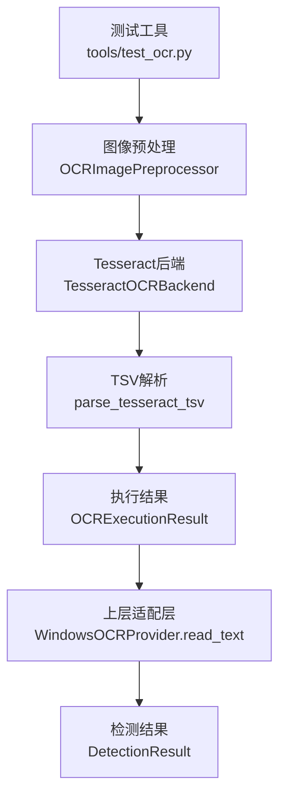
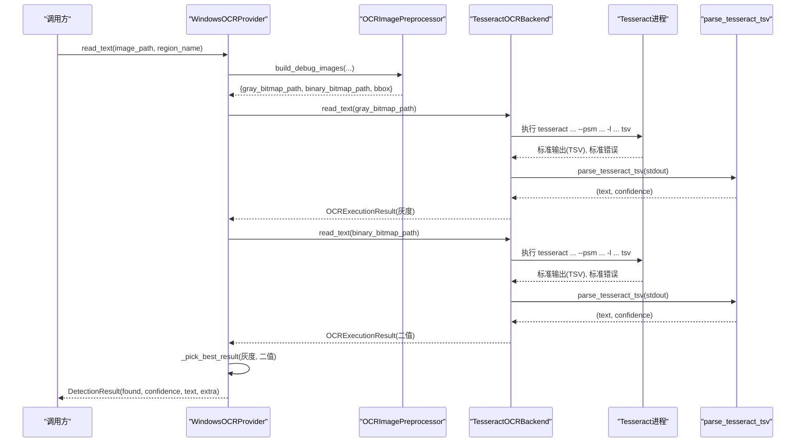
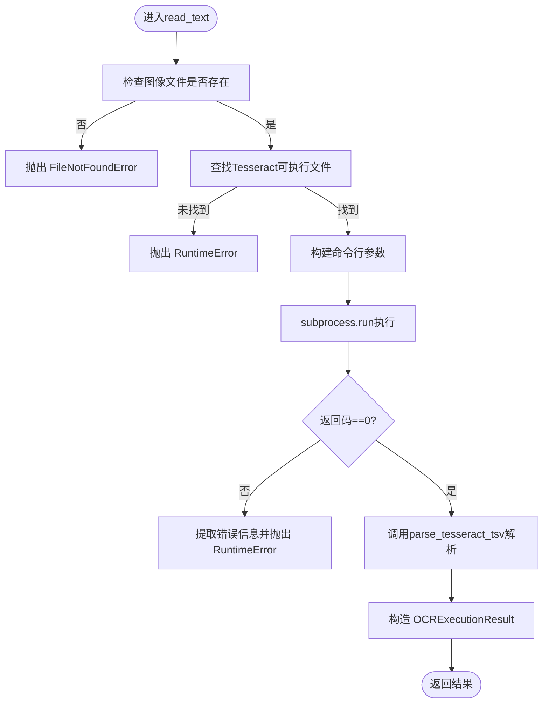
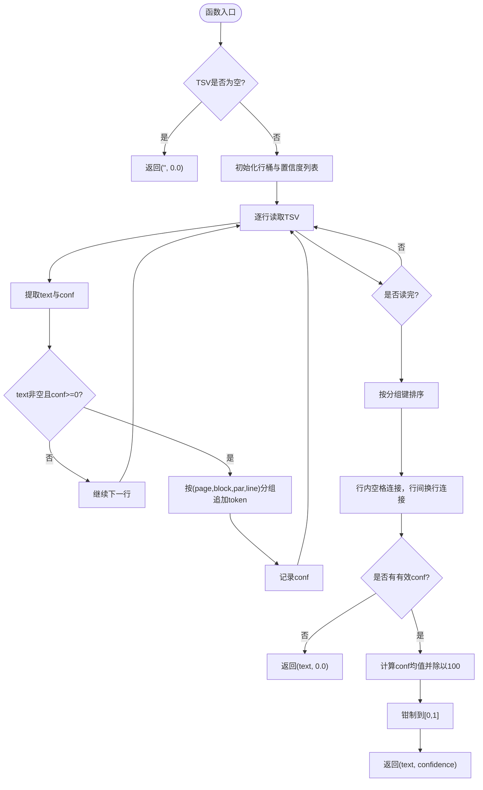
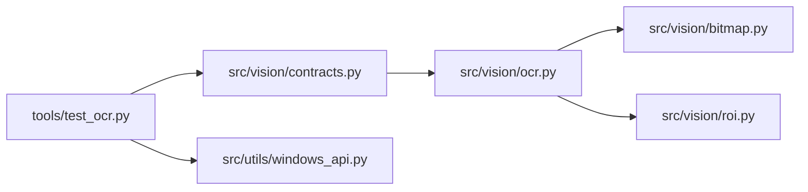

# OCR结果处理

<cite>
**本文引用的文件**
- [src/vision/ocr.py](file://src/vision/ocr.py)
- [tools/test_ocr.py](file://tools/test_ocr.py)
- [config/app.config.json](file://config/app.config.json)
- [src/vision/contracts.py](file://src/vision/contracts.py)
</cite>

## 目录
1. [简介](#简介)
2. [项目结构](#项目结构)
3. [核心组件](#核心组件)
4. [架构总览](#架构总览)
5. [详细组件分析](#详细组件分析)
6. [依赖关系分析](#依赖关系分析)
7. [性能考量](#性能考量)
8. [故障排查指南](#故障排查指南)
9. [结论](#结论)
10. [附录](#附录)

## 简介
本技术文档聚焦于OCR结果处理机制，围绕OCRExecutionResult数据结构和parse_tesseract_tsv函数的实现原理展开，系统阐述TSV格式解析、文本行重组与置信度计算、结果清洗与格式化、质量评估策略、错误处理方案，以及不同语言环境的处理差异与性能优化建议。文档同时给出可操作的验证流程与调试方法，帮助读者快速定位问题并优化识别效果。

## 项目结构
本项目将OCR能力封装在vision模块中，通过TesseractOCRBackend调用外部Tesseract进程，并以TSV格式接收原始输出；随后由parse_tesseract_tsv完成结构化解析与聚合。测试工具tools/test_ocr.py提供端到端验证链路：截图→ROI裁切→预处理（灰度/二值）→OCR识别→结果输出。配置项集中在config/app.config.json，用于指定语言、PSM模式、Tesseract命令路径等。

图表来源
- [tools/test_ocr.py:142-166](file://tools/test_ocr.py#L142-L166)
- [src/vision/ocr.py:73-107](file://src/vision/ocr.py#L73-L107)
- [src/vision/ocr.py:23-70](file://src/vision/ocr.py#L23-L70)
- [src/vision/ocr.py:110-141](file://src/vision/ocr.py#L110-L141)
- [src/vision/contracts.py:210-251](file://src/vision/contracts.py#L210-L251)

章节来源
- [tools/test_ocr.py:57-176](file://tools/test_ocr.py#L57-L176)
- [src/vision/ocr.py:23-141](file://src/vision/ocr.py#L23-L141)
- [src/vision/contracts.py:188-251](file://src/vision/contracts.py#L188-L251)
- [config/app.config.json:1-23](file://config/app.config.json#L1-L23)

## 核心组件
- OCRExecutionResult：承载单次OCR执行的文本、置信度、命令、原始输出与图像路径，便于回溯与诊断。
- TesseractOCRBackend：负责构建命令行参数、启动Tesseract进程、捕获标准输出与错误、校验返回码并调用TSV解析。
- parse_tesseract_tsv：解析Tesseract输出的TSV流，按页/块/段落/行维度重组文本行，并计算全局置信度。
- OCRImagePreprocessor：基于ROI配置裁剪图像，生成灰度图与二值图，并保存调试图片。
- WindowsOCRProvider：组合预处理与后端，对灰度图与二值图分别执行OCR，择优合并为最终检测结果。

章节来源
- [src/vision/ocr.py:14-70](file://src/vision/ocr.py#L14-L70)
- [src/vision/ocr.py:73-107](file://src/vision/ocr.py#L73-L107)
- [src/vision/ocr.py:110-141](file://src/vision/ocr.py#L110-L141)
- [src/vision/contracts.py:188-251](file://src/vision/contracts.py#L188-L251)

## 架构总览
下图展示了从输入图像到最终检测结果的完整流程，包括预处理、双通道OCR（灰度/二值）、TSV解析、结果择优与封装。

图表来源
- [src/vision/contracts.py:210-251](file://src/vision/contracts.py#L210-L251)
- [src/vision/ocr.py:23-70](file://src/vision/ocr.py#L23-L70)
- [src/vision/ocr.py:110-141](file://src/vision/ocr.py#L110-L141)

## 详细组件分析

### OCRExecutionResult数据结构
- 字段说明
  - text：清洗后的多行文本，行内词以空格分隔，行间以换行分隔。
  - confidence：0~1的全局置信度，来源于TSV中各token的conf均值归一化。
  - command：实际执行的Tesseract命令行元组，便于复现与排错。
  - raw_output：Tesseract原始TSV输出，便于离线分析与调试。
  - image_path：本次识别使用的图像路径。
- 设计要点
  - 使用数据类存储，便于序列化与扩展。
  - 保留command与raw_output，支持“可观测性优先”的调试策略。

章节来源
- [src/vision/ocr.py:14-21](file://src/vision/ocr.py#L14-L21)
- [src/vision/ocr.py:63-70](file://src/vision/ocr.py#L63-L70)

### TesseractOCRBackend执行流程
- 关键步骤
  - 校验输入图像存在性。
  - 查找或验证Tesseract可执行文件。
  - 组装命令行：包含图像路径、输出stdout、PSM模式、语言、tsv格式。
  - 子进程执行并捕获输出，检查返回码，非零时抛出运行时异常。
  - 调用parse_tesseract_tsv解析TSV，构造OCRExecutionResult。
- 错误处理
  - 文件不存在：抛出FileNotFoundError。
  - 未找到可执行文件：抛出RuntimeError。
  - 进程返回码非零：提取stderr或stdout作为错误信息并抛出RuntimeError。

图表来源
- [src/vision/ocr.py:29-70](file://src/vision/ocr.py#L29-L70)

章节来源
- [src/vision/ocr.py:23-70](file://src/vision/ocr.py#L23-L70)

### parse_tesseract_tsv：TSV解析、文本行重组与置信度计算
- 输入与输出
  - 输入：Tesseract以tsv格式输出的字符串。
  - 输出：(text, confidence)，其中text为按行重组的文本，confidence为0~1的全局置信度。
- 解析逻辑
  - 空输入直接返回空文本与0.0置信度。
  - 使用csv.DictReader按制表符分割TSV行，读取text与conf字段。
  - 过滤无效行：token为空或conf为负数则跳过。
  - 行分组键：(page_num, block_num, par_num, line_num)，将同一行的token拼接为单行文本。
  - 排序：按分组键字典序排序，保证行顺序稳定。
  - 文本重组：行内用空格连接token，行间用换行连接。
  - 置信度计算：对所有有效token的conf求平均，再除以100归一化至[0,1]区间，并进行边界钳制。
- 复杂度分析
  - 时间复杂度：O(N)，N为TSV行数。
  - 空间复杂度：O(N)，用于缓存行分组与置信度列表。
- 健壮性
  - conf字段缺失或非法时回退为-1，该行被忽略。
  - 无有效token时返回空文本与0.0置信度。

图表来源
- [src/vision/ocr.py:110-141](file://src/vision/ocr.py#L110-L141)

章节来源
- [src/vision/ocr.py:110-141](file://src/vision/ocr.py#L110-L141)

### 结果清洗、格式化与质量评估
- 清洗与格式化
  - 行内token以空格拼接，去除多余空白。
  - 行与行之间以换行分隔，整体strip去除首尾空白。
- 质量评估
  - 全局置信度：所有有效token的conf平均值归一化至[0,1]。
  - 上层择优：WindowsOCRProvider对灰度图与二值图分别执行OCR，选择“有内容优先、置信度高优先、长度长优先”的结果作为最终输出。
  - 阈值判定：应用配置中的ocr_confidence_threshold可用于业务侧判定是否接受该结果。

章节来源
- [src/vision/ocr.py:110-141](file://src/vision/ocr.py#L110-L141)
- [src/vision/contracts.py:210-251](file://src/vision/contracts.py#L210-L251)
- [config/app.config.json:16-21](file://config/app.config.json#L16-L21)

### 不同语言环境的处理差异
- 语言参数：通过-l language传入Tesseract，影响字符集与模型加载。
- PSM模式：通过--psm设置页面扫描模式，影响布局分析与行检测。
- 配置来源：默认从app.config.json读取ocr_language与ocr_psm，也可通过命令行覆盖。
- 实践建议
  - 英文场景常用PSM=6或7，中文场景需确保对应语言包安装正确。
  - 若识别结果出现乱码或行序错乱，优先调整language与psm组合。

章节来源
- [config/app.config.json:10-12](file://config/app.config.json#L10-L12)
- [tools/test_ocr.py:65-67](file://tools/test_ocr.py#L65-L67)
- [src/vision/ocr.py:41-50](file://src/vision/ocr.py#L41-L50)

### 结果验证策略
- 端到端验证：使用tools/test_ocr.py进行截图→ROI→预处理→OCR全流程验证。
- 双通道对比：分别对灰度图与二值图执行OCR，择优输出，提升鲁棒性。
- 调试图输出：保存raw、gray、binary三张图，便于人工核对预处理效果。
- 日志与回溯：OCRExecutionResult.command与raw_output可用于离线重放与问题定位。

章节来源
- [tools/test_ocr.py:149-166](file://tools/test_ocr.py#L149-L166)
- [src/vision/ocr.py:73-107](file://src/vision/ocr.py#L73-L107)
- [src/vision/ocr.py:63-70](file://src/vision/ocr.py#L63-L70)

## 依赖关系分析
- 模块耦合
  - TesseractOCRBackend依赖外部Tesseract进程与系统PATH。
  - OCRImagePreprocessor依赖ROIRepository与bitmap操作。
  - WindowsOCRProvider组合预处理与后端，向上暴露统一接口。
- 外部依赖
  - Tesseract可执行文件及语言包。
  - 操作系统窗口API（用于截图）。
- 潜在循环依赖
  - 当前模块间为单向依赖，未见循环引用。

图表来源
- [tools/test_ocr.py:14-23](file://tools/test_ocr.py#L14-L23)
- [src/vision/ocr.py:10-11](file://src/vision/ocr.py#L10-L11)
- [src/vision/contracts.py:188-251](file://src/vision/contracts.py#L188-L251)

章节来源
- [src/vision/ocr.py:10-11](file://src/vision/ocr.py#L10-L11)
- [src/vision/contracts.py:188-251](file://src/vision/contracts.py#L188-L251)
- [tools/test_ocr.py:14-23](file://tools/test_ocr.py#L14-L23)

## 性能考量
- 预处理缩放：scale_bitmap默认放大3倍以提升二值化与OCR稳定性，但会增加内存与计算开销。可根据图像分辨率调小scale以降低耗时。
- 双通道OCR：灰度与二值图分别识别，耗时约为单通道的两倍。可在高吞吐场景下仅使用一种通道，或根据ROI特征动态选择。
- TSV解析：线性复杂度，通常可忽略不计；但在超大TSV时需注意内存占用。
- 语言与PSM：选择合适的language与psm可减少误检与重排成本，间接提升整体效率。
- I/O优化：批量处理时可复用已生成的调试图，避免重复预处理。

[本节为通用性能指导，不直接分析具体文件]

## 故障排查指南
- 常见错误与处理
  - 输入图像不存在：检查image_path与ROI边界框是否越界。
  - 未找到Tesseract：确认环境变量PATH或配置中的ocr_tesseract_cmd是否正确。
  - Tesseract执行失败：查看raw_output与stderr，检查语言包是否安装、PSM是否合理。
  - 结果为空或置信度低：调整预处理（灰度/二值）、PSM与语言；必要时重新采集ROI。
- 调试手段
  - 启用dry-run模式验证截图与预处理链路。
  - 保存raw/gray/binary调试图，观察二值化阈值与噪声情况。
  - 打印command与raw_output，离线重放TSV并逐步定位问题。
- 配置检查
  - app.config.json中的ocr_language、ocr_psm、ocr_tesseract_cmd是否与运行环境匹配。
  - platform_validation中的ocr_confidence_threshold是否符合业务容忍度。

章节来源
- [src/vision/ocr.py:29-70](file://src/vision/ocr.py#L29-L70)
- [tools/test_ocr.py:75-104](file://tools/test_ocr.py#L75-L104)
- [config/app.config.json:10-21](file://config/app.config.json#L10-L21)

## 结论
本实现通过TesseractOCRBackend与parse_tesseract_tsv构建了稳健的OCR结果处理管线：以TSV为中间格式，按层级重组文本行，计算全局置信度，并通过双通道识别与择优策略提升鲁棒性。配合ROI预处理与调试图输出，形成完整的可观测性与可维护性闭环。针对不同语言与场景，可通过language与psm灵活调优；在生产环境中，建议结合阈值与日志进行持续监控与迭代优化。

[本节为总结性内容，不直接分析具体文件]

## 附录
- 关键流程参考
  - 端到端测试入口：tools/test_ocr.py
  - OCR后端与解析：src/vision/ocr.py
  - 上层适配与择优：src/vision/contracts.py
  - 应用配置：config/app.config.json

[本节为索引性内容，不直接分析具体文件]