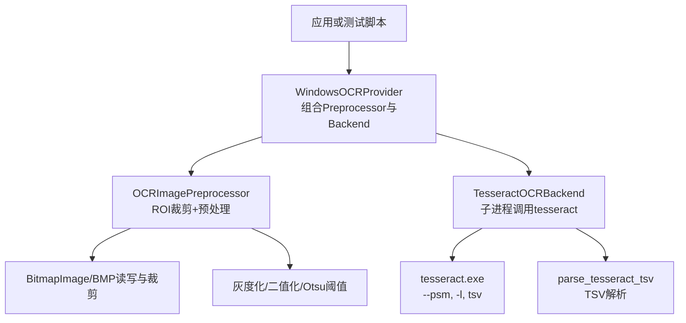
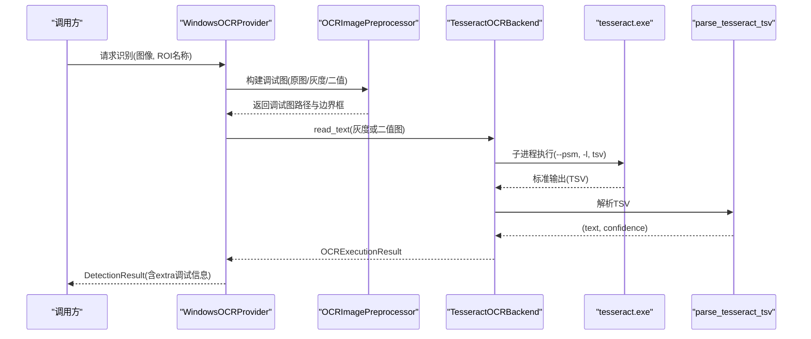
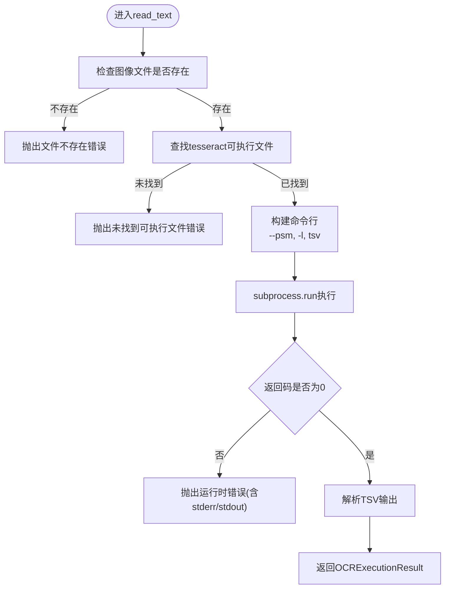
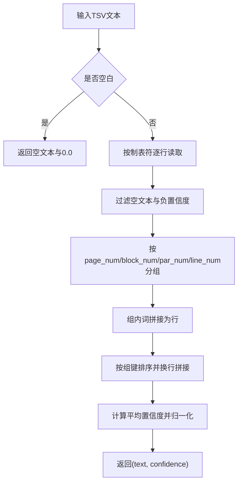
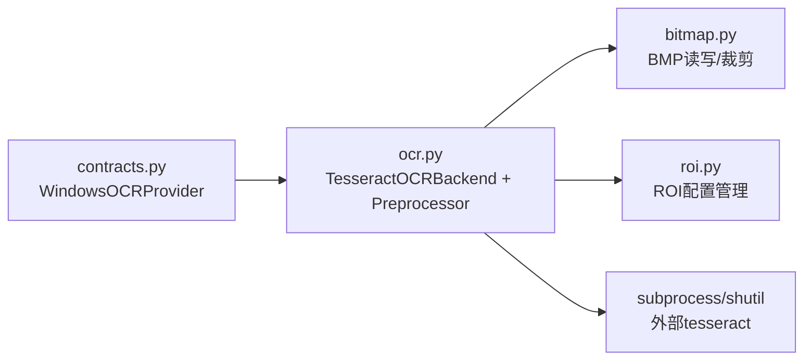

# Tesseract OCR后端集成

<cite>
**本文引用的文件**
- [ocr.py](file://src/vision/ocr.py)
- [contracts.py](file://src/vision/contracts.py)
- [test_ocr.py](file://tools/test_ocr.py)
- [app.config.json](file://config/app.config.json)
- [bitmap.py](file://src/vision/bitmap.py)
- [roi.py](file://src/vision/roi.py)
</cite>

## 目录
1. [简介](#简介)
2. [项目结构](#项目结构)
3. [核心组件](#核心组件)
4. [架构总览](#架构总览)
5. [详细组件分析](#详细组件分析)
6. [依赖关系分析](#依赖关系分析)
7. [性能与调优](#性能与调优)
8. [故障排查指南](#故障排查指南)
9. [结论](#结论)
10. [附录：安装与配置](#附录安装与配置)

## 简介
本技术文档面向Tesseract OCR后端的集成与使用，重点解释TesseractOCRBackend类的实现原理、引擎初始化、命令行参数配置与执行流程；说明语言包管理、PSM模式选择与TSV输出格式解析；阐述错误处理机制与调试信息收集；并提供Tesseract安装配置、语言包下载、性能调优建议以及常见问题诊断方法。

## 项目结构
本项目将OCR能力封装在vision模块中，通过TesseractOCRBackend调用外部tesseract可执行程序，结合ROI裁剪与图像预处理（灰度化、二值化）提升识别效果。测试工具tools/test_ocr.py提供端到端验证链路：截图→ROI裁切→预处理→Tesseract识别→结果输出。

图表来源
- [ocr.py:23-70](file://src/vision/ocr.py#L23-L70)
- [ocr.py:73-107](file://src/vision/ocr.py#L73-L107)
- [ocr.py:110-141](file://src/vision/ocr.py#L110-L141)
- [contracts.py:188-240](file://src/vision/contracts.py#L188-L240)
- [bitmap.py:17-60](file://src/vision/bitmap.py#L17-L60)
- [roi.py:21-46](file://src/vision/roi.py#L21-L46)

章节来源
- [ocr.py:23-107](file://src/vision/ocr.py#L23-L107)
- [contracts.py:188-240](file://src/vision/contracts.py#L188-L240)
- [test_ocr.py:57-176](file://tools/test_ocr.py#L57-L176)
- [app.config.json:1-23](file://config/app.config.json#L1-L23)

## 核心组件
- TesseractOCRBackend：封装对tesseract可执行文件的子进程调用，负责构建命令、执行、错误处理与TSV结果解析。
- OCRImagePreprocessor：基于ROI配置裁剪图像，生成原始图、灰度图、二值图等调试图片，辅助定位问题。
- parse_tesseract_tsv：解析Tesseract的TSV输出，按行聚合文本并计算平均置信度。
- WindowsOCRProvider：将Preprocessor与Backend组合为统一的OCR提供者，输出DetectionResult并附带调试路径与元数据。
- BitmapImage与ROIRepository：BMP图像读写、裁剪与ROI区域配置管理。

章节来源
- [ocr.py:14-70](file://src/vision/ocr.py#L14-L70)
- [ocr.py:73-107](file://src/vision/ocr.py#L73-L107)
- [ocr.py:110-141](file://src/vision/ocr.py#L110-L141)
- [contracts.py:188-240](file://src/vision/contracts.py#L188-L240)
- [bitmap.py:17-115](file://src/vision/bitmap.py#L17-L115)
- [roi.py:21-46](file://src/vision/roi.py#L21-L46)

## 架构总览
下图展示了从输入图像到最终文本输出的完整流程，包括预处理、子进程调用、TSV解析与结果组装。

图表来源
- [ocr.py:23-70](file://src/vision/ocr.py#L23-L70)
- [ocr.py:73-107](file://src/vision/ocr.py#L73-L107)
- [ocr.py:110-141](file://src/vision/ocr.py#L110-L141)
- [contracts.py:188-240](file://src/vision/contracts.py#L188-L240)

## 详细组件分析

### TesseractOCRBackend：引擎初始化、参数与执行流程
- 初始化参数
  - tesseract_cmd：可执行文件名或路径，默认“tesseract”。
  - language：语言代码，默认“eng”。
  - psm：页面分割模式，默认6。
- 执行流程
  - 校验输入图像是否存在。
  - 查找tesseract可执行文件（系统PATH或相对路径）。
  - 构造命令行：包含图像路径、输出stdout、PSM模式、语言、TSV格式。
  - 通过subprocess.run执行，捕获标准输出与错误输出。
  - 若返回码非0，抛出运行时错误，携带stderr或stdout内容。
  - 成功时调用TSV解析函数，返回包含文本、置信度、命令、原始输出与图像路径的结果对象。

图表来源
- [ocr.py:29-70](file://src/vision/ocr.py#L29-L70)

章节来源
- [ocr.py:23-70](file://src/vision/ocr.py#L23-L70)

### 语言包管理与PSM模式选择
- 语言包管理
  - 语言由language参数传入，对应Tesseract的语言包标识（如eng、chi_sim等）。
  - 语言包需预先安装至Tesseract的数据目录，否则执行时会失败。
  - 可通过配置文件app.config.json中的ocr_language设置默认语言。
- PSM模式选择
  - PSM控制页面分割与文本布局解析策略，影响识别精度与速度。
  - 当前默认值为6（假设单列文本），可在配置或测试工具中覆盖为其他值（如7用于单行文本）。
  - 不同场景下应选择合适的PSM以获得最佳识别效果。

章节来源
- [app.config.json:10-12](file://config/app.config.json#L10-L12)
- [ocr.py:24-50](file://src/vision/ocr.py#L24-L50)
- [test_ocr.py:65-67](file://tools/test_ocr.py#L65-L67)

### TSV输出格式解析
- 解析逻辑
  - 使用csv.DictReader按制表符分隔读取TSV。
  - 忽略空文本或负置信度的行。
  - 按页号、块号、段落号、行号进行分组，合并每行的词序列。
  - 按组顺序拼接成多行文本。
  - 置信度计算：取所有有效token的conf均值，再除以100归一化到[0,1]区间。
- 复杂度
  - 时间复杂度O(N)，N为TSV行数；空间复杂度O(N)用于存储分组与结果。
- 健壮性
  - 空输入直接返回空文本与0.0置信度。
  - 非数字conf字段被安全转换为-1.0并过滤。

图表来源
- [ocr.py:110-141](file://src/vision/ocr.py#L110-L141)

章节来源
- [ocr.py:110-141](file://src/vision/ocr.py#L110-L141)

### 图像预处理与调试信息
- 预处理步骤
  - 加载BMP图像并按ROI裁剪。
  - 生成灰度图并进行归一化。
  - 使用Otsu算法计算阈值生成二值图，自动反转以适配黑字白底或白字黑底。
  - 可选放大倍数以提升识别稳定性。
- 调试输出
  - 保存原始图、灰度图、二值图到指定目录，便于人工核对。
  - 返回边界框坐标，便于定位ROI位置。
- 适用场景
  - 当识别率低时，优先检查ROI是否正确、图像是否过暗/过亮、是否需要二值化或放大。

章节来源
- [ocr.py:73-107](file://src/vision/ocr.py#L73-L107)
- [ocr.py:144-176](file://src/vision/ocr.py#L144-L176)
- [bitmap.py:17-115](file://src/vision/bitmap.py#L17-L115)

### WindowsOCRProvider：统一入口与结果封装
- 职责
  - 组合OCRImagePreprocessor与TesseractOCRBackend。
  - 创建调试目录并记录调试图路径。
  - 对多个候选结果择优（优先有文本、高置信度、长文本）。
  - 输出DetectionResult，包含region_name、调试图路径、后端类型、语言、PSM、命令、图像路径等额外信息。
- 集成点
  - 通过构造函数注入tesseract_cmd、language、psm，便于外部配置。
  - 与模板匹配等其他识别方式并列，统一返回DetectionResult。

章节来源
- [contracts.py:188-240](file://src/vision/contracts.py#L188-L240)

## 依赖关系分析
- 模块耦合
  - TesseractOCRBackend依赖subprocess与shutil，调用外部tesseract。
  - OCRImagePreprocessor依赖ROIRepository与BitmapImage，完成裁剪与预处理。
  - WindowsOCRProvider依赖Preprocessor与Backend，对外暴露统一接口。
- 外部依赖
  - Tesseract可执行程序必须安装且可被系统PATH或配置路径找到。
  - 语言包需与language参数匹配。
- 潜在循环依赖
  - 当前模块间为单向依赖，无循环引用。

图表来源
- [contracts.py:188-240](file://src/vision/contracts.py#L188-L240)
- [ocr.py:23-107](file://src/vision/ocr.py#L23-L107)
- [bitmap.py:17-115](file://src/vision/bitmap.py#L17-L115)
- [roi.py:21-46](file://src/vision/roi.py#L21-L46)

章节来源
- [contracts.py:188-240](file://src/vision/contracts.py#L188-L240)
- [ocr.py:23-107](file://src/vision/ocr.py#L23-L107)
- [bitmap.py:17-115](file://src/vision/bitmap.py#L17-L115)
- [roi.py:21-46](file://src/vision/roi.py#L21-L46)

## 性能与调优
- 预处理优化
  - 合理选择ROI，避免整图扫描带来的性能损耗。
  - 灰度化与二值化能显著提升识别速度与准确率，尤其对复杂背景。
  - 适度放大图像（scale=3）有助于小字号识别，但会增加处理时间。
- 参数调优
  - PSM模式：根据文本布局选择合适值（如单行文本常用7）。
  - 语言包：仅加载必要语言，减少启动开销。
  - 置信度阈值：结合业务需求调整，避免误触发危险动作。
- 资源与并发
  - 每次识别为独立子进程，注意并发时的系统资源占用。
  - 批量识别时可复用预处理结果，减少重复I/O。

章节来源
- [ocr.py:144-176](file://src/vision/ocr.py#L144-L176)
- [app.config.json:16-21](file://config/app.config.json#L16-L21)

## 故障排查指南
- 常见错误与定位
  - 输入图像不存在：检查图像路径与命名，确保文件存在。
  - 未找到tesseract可执行文件：确认已安装Tesseract并将可执行文件加入PATH或在配置中指定绝对路径。
  - Tesseract执行失败：查看stderr/stdout内容，检查语言包是否安装、PSM是否合理、图像格式是否为BMP。
  - ROI越界：检查ROI配置与实际图像尺寸是否匹配。
  - 识别结果为空或置信度低：检查预处理图质量、PSM与语言选择、ROI是否准确。
- 调试手段
  - 使用测试工具输出原始图、灰度图、二值图，人工核对预处理效果。
  - 记录并打印执行的命令行与原始TSV输出，便于离线分析。
  - 逐步切换PSM与语言，观察识别变化。
- 日志与指标
  - 记录单次识别耗时、文本长度、置信度，建立基线对比。
  - 结合平台验证阈值（如OCR置信度阈值）评估稳定性。

章节来源
- [ocr.py:29-70](file://src/vision/ocr.py#L29-L70)
- [test_ocr.py:149-166](file://tools/test_ocr.py#L149-L166)
- [app.config.json:16-21](file://config/app.config.json#L16-L21)

## 结论
TesseractOCRBackend以简洁稳定的方式封装了Tesseract的调用流程，配合ROI裁剪与图像预处理，能够在固定环境下提供可靠的OCR能力。通过合理的PSM与语言配置、完善的调试输出与错误处理，可有效提升识别成功率与可维护性。建议在业务中持续监控识别指标，并根据实际场景微调参数与预处理策略。

## 附录：安装与配置
- 安装Tesseract
  - 安装Tesseract OCR可执行程序，并确保其可被系统PATH找到，或在配置中指定绝对路径。
  - 安装所需语言包（如eng、chi_sim等），放置于Tesseract数据目录。
- 配置语言与PSM
  - 在app.config.json中设置ocr_language与ocr_psm，或通过测试工具的命令行参数覆盖。
- 运行测试
  - 使用tools/test_ocr.py进行端到端验证，支持dry-run模式仅验证预处理链路。
  - 输出调试图至runtime/debug/ocr_test目录，便于问题定位。

章节来源
- [app.config.json:10-12](file://config/app.config.json#L10-L12)
- [test_ocr.py:26-50](file://tools/test_ocr.py#L26-L50)
- [test_ocr.py:57-176](file://tools/test_ocr.py#L57-L176)