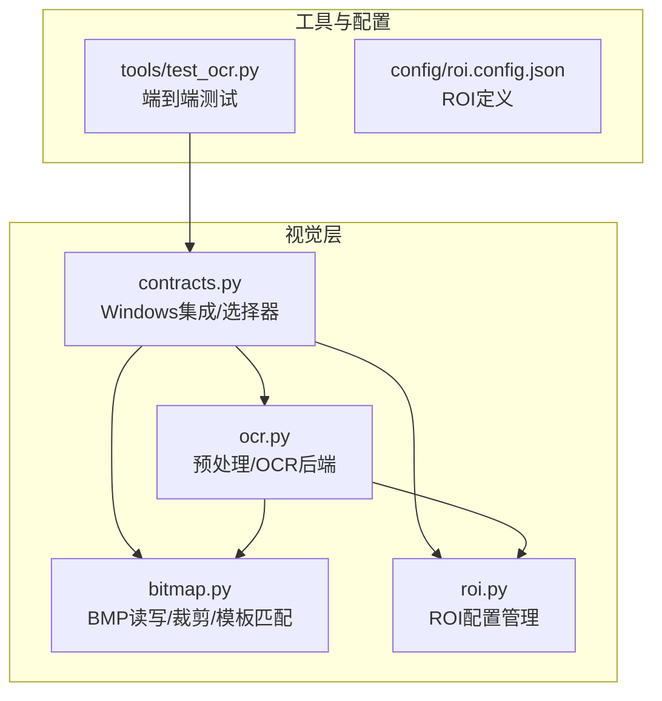
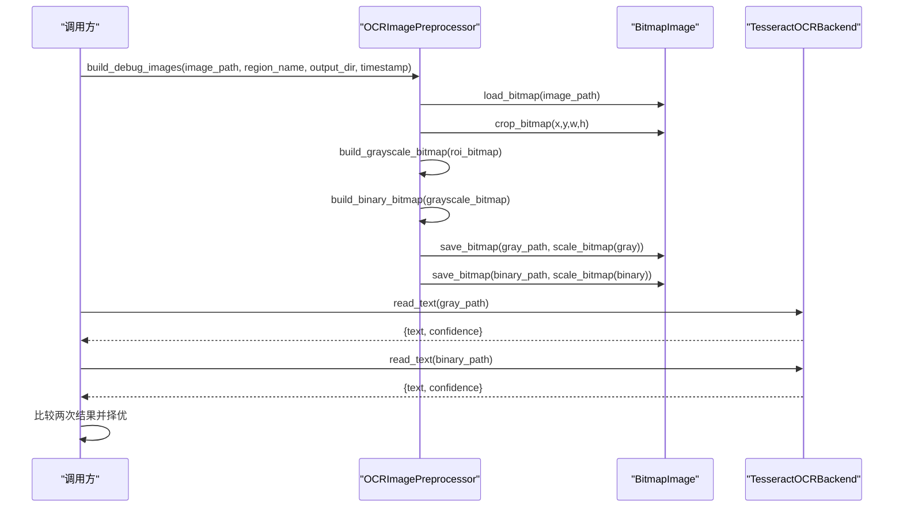
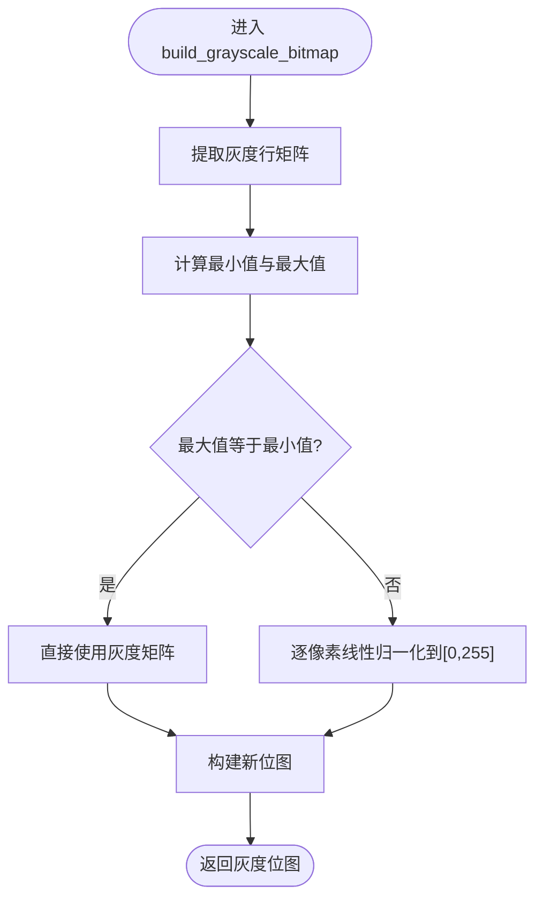
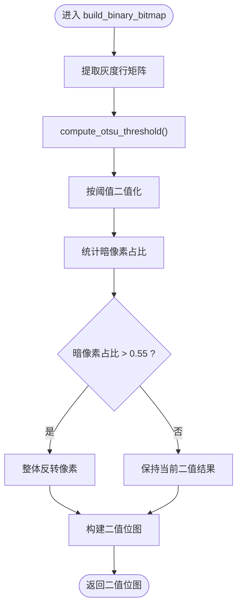
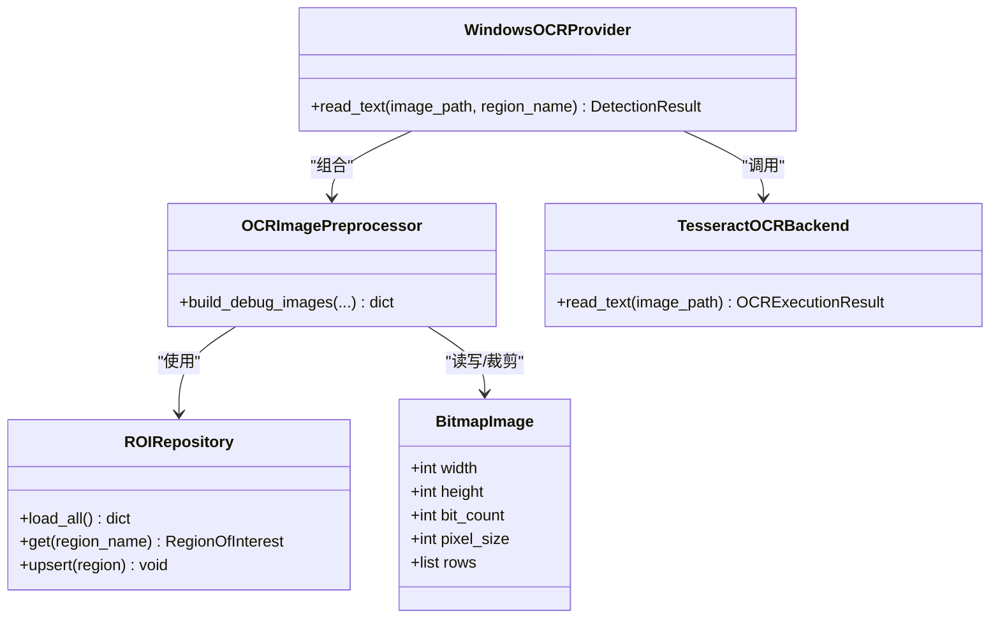

# 图像预处理流程

<cite>
**本文引用的文件**
- [ocr.py](file://src/vision/ocr.py)
- [bitmap.py](file://src/vision/bitmap.py)
- [roi.py](file://src/vision/roi.py)
- [contracts.py](file://src/vision/contracts.py)
- [test_ocr.py](file://tools/test_ocr.py)
- [roi.config.json](file://config/roi.config.json)
- [README.md](file://README.md)
</cite>

## 目录
1. [简介](#简介)
2. [项目结构](#项目结构)
3. [核心组件](#核心组件)
4. [架构总览](#架构总览)
5. [详细组件分析](#详细组件分析)
6. [依赖关系分析](#依赖关系分析)
7. [性能考虑](#性能考虑)
8. [故障排查指南](#故障排查指南)
9. [结论](#结论)
10. [附录](#附录)

## 简介
本技术文档聚焦于OCR图像预处理流程，围绕 OCRImagePreprocessor 类及其相关算法展开，系统阐述ROI区域裁剪、灰度转换与二值化处理、Otsu阈值计算、像素归一化、图像缩放策略以及调试图像生成机制。同时提供针对不同图像类型的处理建议、参数调优指南和性能优化要点，帮助读者在固定分辨率与固定UI环境下稳定提升OCR识别效果。

## 项目结构
本项目将视觉能力集中在 src/vision 模块中：
- bitmap.py：BMP图像的加载、保存、裁剪、模板匹配等底层操作
- roi.py：ROI（感兴趣区域）配置读取与管理
- ocr.py：OCR后端封装、预处理算法（灰度、二值化、缩放）、调试图生成
- contracts.py：上层抽象与Windows环境下的具体实现（截图、模板匹配、OCR调用）
- tools/test_ocr.py：端到端测试工具，串联“截图→ROI裁剪→预处理→OCR”的完整链路
- config/roi.config.json：ROI区域定义与描述
- README.md：项目目标、边界与验收指标

图表来源
- [ocr.py:73-107](file://src/vision/ocr.py#L73-L107)
- [bitmap.py:17-60](file://src/vision/bitmap.py#L17-L60)
- [roi.py:21-46](file://src/vision/roi.py#L21-L46)
- [contracts.py:188-240](file://src/vision/contracts.py#L188-L240)
- [test_ocr.py:57-176](file://tools/test_ocr.py#L57-L176)

章节来源
- [README.md:14-124](file://README.md#L14-L124)

## 核心组件
- BitmapImage：BMP位图的内存表示，包含宽高、位深、像素步长与行数据
- ROIRepository：从JSON加载ROI配置，支持查询与持久化更新
- TesseractOCRBackend：封装Tesseract命令行调用，解析TSV输出并返回文本与置信度
- OCRImagePreprocessor：组合ROI裁剪、灰度化、二值化、缩放与调试图落盘
- 辅助函数：extract_grayscale_rows、compute_otsu_threshold、build_grayscale_bitmap、build_binary_bitmap、scale_bitmap、bitmap_from_gray_rows

章节来源
- [bitmap.py:8-15](file://src/vision/bitmap.py#L8-L15)
- [roi.py:8-46](file://src/vision/roi.py#L8-L46)
- [ocr.py:23-70](file://src/vision/ocr.py#L23-L70)
- [ocr.py:73-107](file://src/vision/ocr.py#L73-L107)
- [ocr.py:144-279](file://src/vision/ocr.py#L144-L279)

## 架构总览
OCR预处理与识别的整体流程如下：
- 输入：BMP截图或已有图像路径
- ROI裁剪：根据ROI配置从原图中裁切目标区域
- 灰度化：将RGB像素转换为灰度值并进行全局归一化
- 二值化：使用Otsu方法自动计算阈值，进行黑白二值化，并根据暗像素比例自适应翻转
- 缩放：为可视化或提高OCR鲁棒性，对灰度/二值图进行整数倍放大
- 调试图：保存原始、灰度、二值三张图用于问题定位
- OCR识别：分别对灰度图与二值图执行Tesseract识别，择优返回结果

图表来源
- [ocr.py:73-107](file://src/vision/ocr.py#L73-L107)
- [ocr.py:144-200](file://src/vision/ocr.py#L144-L200)
- [ocr.py:237-279](file://src/vision/ocr.py#L237-L279)
- [contracts.py:210-240](file://src/vision/contracts.py#L210-L240)

## 详细组件分析

### ROI区域裁剪
- 功能：依据ROI配置的x、y、width、height从原图中精确裁剪目标区域
- 关键点：
  - 校验ROI参数合法性与是否越界
  - 按像素步长截取每行数据，构建新的BitmapImage
- 适用场景：固定分辨率下快速缩小搜索范围，降低后续处理开销

章节来源
- [bitmap.py:100-115](file://src/vision/bitmap.py#L100-L115)
- [roi.py:21-46](file://src/vision/roi.py#L21-L46)
- [roi.config.json:1-31](file://config/roi.config.json#L1-L31)

### 灰度转换与像素归一化
- 灰度转换：采用加权公式将RGB转为灰度，避免浮点运算，保证速度与精度平衡
- 归一化：统计整幅ROI的最小/最大灰度值，线性映射到[0,255]区间，增强对比度
- 复杂度：时间O(N)，空间O(N)，N为像素总数

图表来源
- [ocr.py:144-157](file://src/vision/ocr.py#L144-L157)
- [ocr.py:203-213](file://src/vision/ocr.py#L203-L213)
- [ocr.py:216-234](file://src/vision/ocr.py#L216-L234)

章节来源
- [ocr.py:144-157](file://src/vision/ocr.py#L144-L157)
- [ocr.py:203-213](file://src/vision/ocr.py#L203-L213)
- [ocr.py:216-234](file://src/vision/ocr.py#L216-L234)

### 二值化与Otsu阈值
- Otsu阈值：基于直方图遍历所有可能阈值，最大化类间方差，得到最优分割阈值
- 二值化：按阈值将像素分为黑/白两态，随后统计暗像素占比；若暗像素超过阈值（默认>55%），则整体反转，确保文字为深色背景浅色更利于OCR
- 复杂度：直方图统计O(N)，阈值遍历O(256)，总体O(N)

图表来源
- [ocr.py:160-176](file://src/vision/ocr.py#L160-L176)
- [ocr.py:237-279](file://src/vision/ocr.py#L237-L279)

章节来源
- [ocr.py:160-176](file://src/vision/ocr.py#L160-L176)
- [ocr.py:237-279](file://src/vision/ocr.py#L237-L279)

### 图像缩放策略
- 目的：放大灰度/二值图以提升OCR鲁棒性与调试可视性
- 实现：整数倍复制像素行与列，简单高效但无抗锯齿
- 默认倍数：3倍，可根据图像质量与OCR引擎表现调整

章节来源
- [ocr.py:179-200](file://src/vision/ocr.py#L179-L200)

### 调试图像生成机制
- 输出：原始ROI、灰度图、二值图三张BMP，便于问题定位与效果对比
- 命名：包含区域名与时间戳，避免覆盖
- 用途：结合OCR结果与可视化图，快速判断预处理是否合理

章节来源
- [ocr.py:77-107](file://src/vision/ocr.py#L77-L107)
- [test_ocr.py:116-130](file://tools/test_ocr.py#L116-L130)

### OCR后端与结果择优
- TesseractOCRBackend：检查可执行文件、构造命令、执行子进程、解析TSV输出，返回文本与置信度
- 结果择优：分别对灰度图与二值图执行OCR，选择有内容且置信度更高的结果

章节来源
- [ocr.py:23-70](file://src/vision/ocr.py#L23-L70)
- [contracts.py:210-240](file://src/vision/contracts.py#L210-L240)

## 依赖关系分析
- OCRImagePreprocessor依赖：
  - ROIRepository：读取ROI配置
  - BitmapImage：加载、裁剪、保存位图
  - 预处理函数：灰度化、二值化、缩放
- WindowsOCRProvider组合：
  - 通过OCRImagePreprocessor生成调试图
  - 通过TesseractOCRBackend执行识别
  - 择优返回最终结果

图表来源
- [ocr.py:73-107](file://src/vision/ocr.py#L73-L107)
- [ocr.py:23-70](file://src/vision/ocr.py#L23-L70)
- [roi.py:21-46](file://src/vision/roi.py#L21-L46)
- [contracts.py:188-240](file://src/vision/contracts.py#L188-L240)

章节来源
- [contracts.py:188-240](file://src/vision/contracts.py#L188-L240)
- [ocr.py:73-107](file://src/vision/ocr.py#L73-L107)

## 性能考虑
- ROI裁剪优先：在固定分辨率下，先裁剪再处理，显著减少后续计算量
- 灰度转换与归一化：纯Python实现，避免引入第三方库，速度可控；对于超大ROI可考虑分块处理
- Otsu阈值：直方图统计O(N)，适合实时或近实时场景；若需更高精度可引入加权或迭代优化
- 二值化翻转：暗像素比例阈值可调，针对高亮背景或低对比度场景可微调
- 缩放倍数：默认3倍兼顾速度与清晰度；若OCR引擎对高分辨率敏感，可适当增大
- I/O优化：批量保存调试图时注意磁盘写入频率；生产环境可关闭调试图以节省IO

## 故障排查指南
- 输入图像不存在：TesseractOCRBackend会抛出运行时错误，检查传入路径与权限
- 未找到Tesseract可执行：确认环境变量或配置文件中的命令路径正确
- ROI越界：检查ROI配置与实际截图尺寸是否一致，必要时重新标定
- 识别结果为空：检查灰度/二值图质量，调整缩放倍数或二值化阈值策略
- 性能瓶颈：确认ROI大小、缩放倍数与I/O路径；必要时减少调试图输出

章节来源
- [ocr.py:29-70](file://src/vision/ocr.py#L29-L70)
- [bitmap.py:17-60](file://src/vision/bitmap.py#L17-L60)
- [roi.py:21-46](file://src/vision/roi.py#L21-L46)
- [test_ocr.py:95-130](file://tools/test_ocr.py#L95-L130)

## 结论
本预处理流程通过ROI裁剪、灰度归一化、Otsu二值化与适度缩放，构建了稳定高效的OCR输入管线。配合调试图与双通道识别（灰度/二值），可在固定环境下显著提升识别成功率与鲁棒性。建议在真实业务场景中持续收集样本，微调ROI与二值化策略，并结合OCR引擎参数获得最佳效果。

## 附录

### 参数调优指南
- ROI标定：确保ROI覆盖目标文本区域，避免包含无关干扰元素
- 灰度归一化：适用于对比度不足的场景；若图像本身对比度良好，可跳过归一化以减少计算
- Otsu阈值：默认策略对多数场景有效；若背景复杂，可结合形态学预处理或局部阈值
- 二值化翻转阈值：默认>55%暗像素时反转；可根据实际文本颜色分布调整
- 缩放倍数：默认3倍；若OCR引擎对高分辨率敏感，可尝试2-4倍范围
- Tesseract参数：PSM模式与语言包需与目标文本类型匹配；必要时切换PSM或添加自定义字典

### 不同图像类型的处理策略
- 高对比度文本：直接二值化即可，无需过度缩放
- 低对比度或模糊文本：增强归一化与适度缩放，必要时增加形态学去噪
- 彩色背景干扰：先灰度化并归一化，再二值化；若仍受干扰，可尝试局部阈值或颜色空间转换
- 小字号文本：适当放大后再二值化，提高笔画连通性

### 端到端测试参考
- 使用tools/test_ocr.py进行“截图→ROI裁剪→预处理→OCR”的完整验证
- 支持dry-run模式仅验证预处理链路，便于快速定位问题

章节来源
- [test_ocr.py:26-176](file://tools/test_ocr.py#L26-L176)