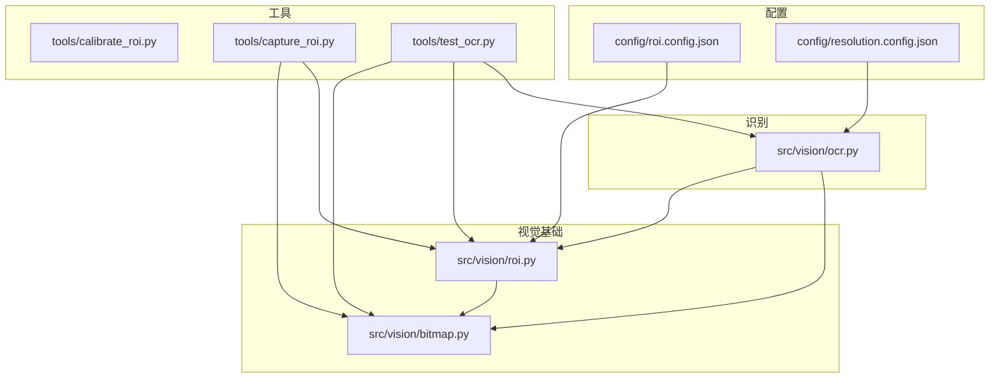
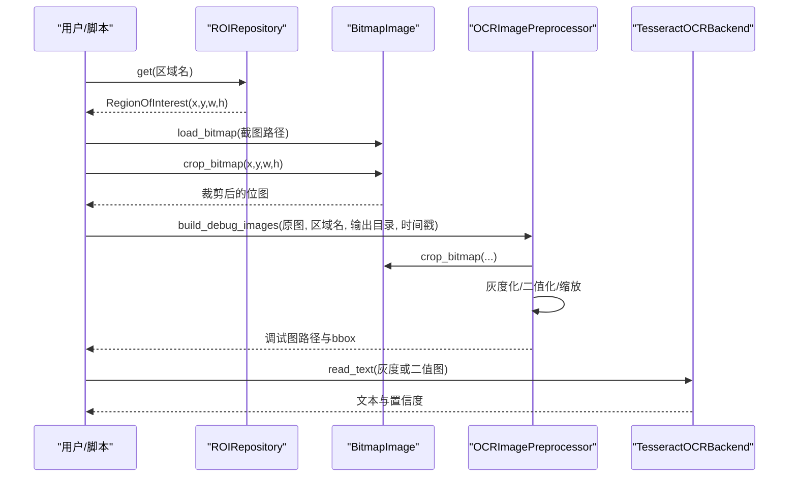
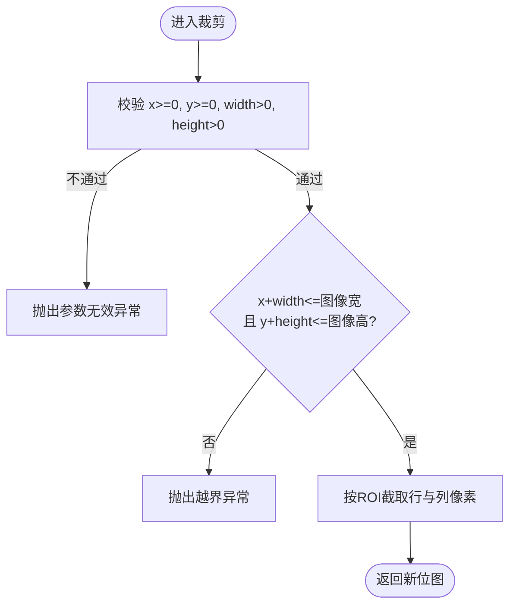
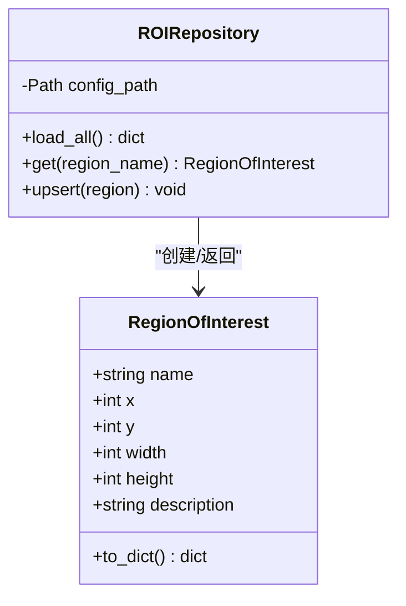
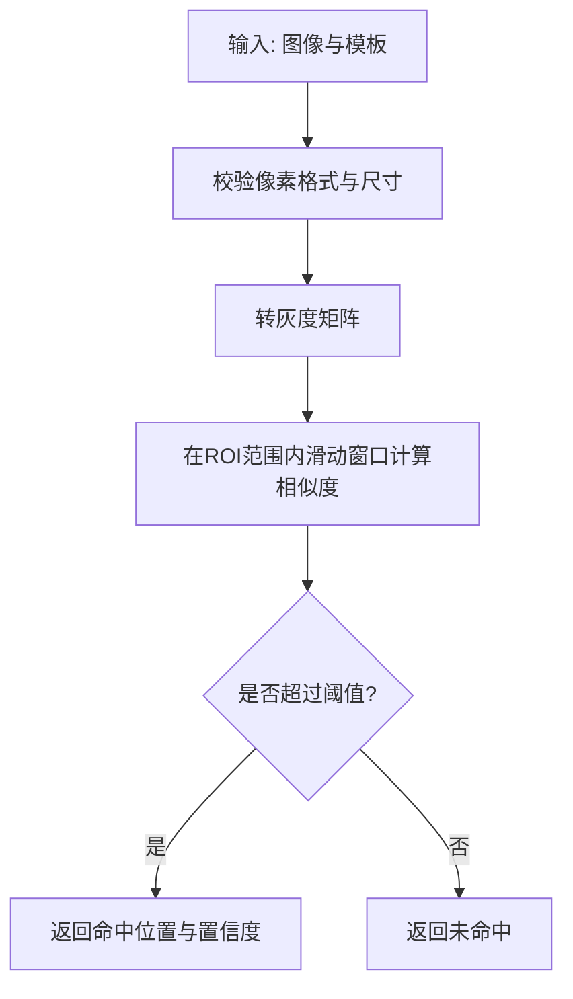
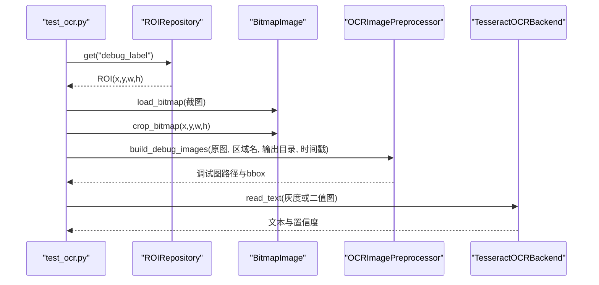
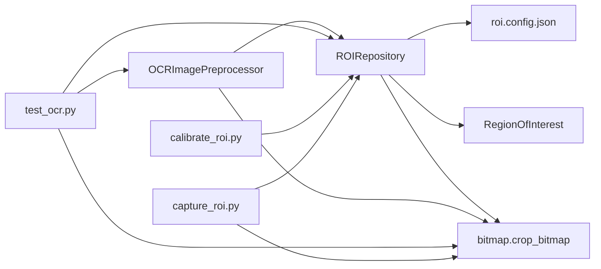

# ROI区域管理

<cite>
**本文引用的文件**
- [src/vision/roi.py](file://src/vision/roi.py)
- [config/roi.config.json](file://config/roi.config.json)
- [src/vision/bitmap.py](file://src/vision/bitmap.py)
- [src/vision/ocr.py](file://src/vision/ocr.py)
- [tools/calibrate_roi.py](file://tools/calibrate_roi.py)
- [tools/capture_roi.py](file://tools/capture_roi.py)
- [tools/test_ocr.py](file://tools/test_ocr.py)
- [config/resolution.config.json](file://config/resolution.config.json)
- [README.md](file://README.md)
- [technical.plan.md](file://technical.plan.md)
</cite>

## 目录
1. [简介](#简介)
2. [项目结构](#项目结构)
3. [核心组件](#核心组件)
4. [架构总览](#架构总览)
5. [详细组件分析](#详细组件分析)
6. [依赖关系分析](#依赖关系分析)
7. [性能考虑](#性能考虑)
8. [故障排查指南](#故障排查指南)
9. [结论](#结论)
10. [附录](#附录)

## 简介
本技术文档围绕ROI（感兴趣区域）在视觉处理中的关键作用展开，重点说明ROIRepository类的设计与实现、ROI数据结构定义、坐标系统与边界检查、与分辨率的关系及多分辨率适配思路、以及ROI在模板匹配和OCR识别中的应用方式。同时提供ROI配置格式说明、标定工具使用方法与最佳实践，并总结常见问题与解决方案。

## 项目结构
本项目采用分层设计：配置层、视觉基础层、识别层、工具层。ROI相关能力主要分布在vision模块与tools目录中，并通过配置文件集中管理。

图表来源
- [src/vision/roi.py:21-68](file://src/vision/roi.py#L21-L68)
- [src/vision/bitmap.py:17-115](file://src/vision/bitmap.py#L17-L115)
- [src/vision/ocr.py:73-107](file://src/vision/ocr.py#L73-L107)
- [tools/calibrate_roi.py:14-42](file://tools/calibrate_roi.py#L14-L42)
- [tools/capture_roi.py:15-37](file://tools/capture_roi.py#L15-L37)
- [tools/test_ocr.py:26-176](file://tools/test_ocr.py#L26-L176)
- [config/roi.config.json:1-31](file://config/roi.config.json#L1-L31)
- [config/resolution.config.json:1-8](file://config/resolution.config.json#L1-L8)

章节来源
- [technical.plan.md:45-129](file://technical.plan.md#L45-L129)
- [README.md:92-124](file://README.md#L92-L124)

## 核心组件
- RegionOfInterest数据类：描述一个ROI的名称、左上角坐标、宽高与可选描述信息。
- ROIRepository：负责从JSON配置文件加载、查询、更新ROI集合，并以JSON持久化存储。
- BitmapImage与裁剪/匹配函数：提供BMP图像读写、ROI裁剪、模板匹配等底层能力。
- OCR预处理管线：基于ROI裁剪后进行灰度化、二值化、缩放等预处理，调用Tesseract进行文本识别。
- 标定与采集工具：命令行工具用于写入ROI配置、按ROI裁切截图、端到端测试OCR链路。

章节来源
- [src/vision/roi.py:8-68](file://src/vision/roi.py#L8-L68)
- [src/vision/bitmap.py:8-115](file://src/vision/bitmap.py#L8-L115)
- [src/vision/ocr.py:23-107](file://src/vision/ocr.py#L23-L107)
- [tools/calibrate_roi.py:14-42](file://tools/calibrate_roi.py#L14-L42)
- [tools/capture_roi.py:15-37](file://tools/capture_roi.py#L15-L37)
- [tools/test_ocr.py:26-176](file://tools/test_ocr.py#L26-L176)

## 架构总览
ROI作为视觉处理的“聚焦窗口”，贯穿截图、裁剪、模板匹配与OCR全流程。其典型调用链如下：

图表来源
- [src/vision/roi.py:21-68](file://src/vision/roi.py#L21-L68)
- [src/vision/bitmap.py:17-115](file://src/vision/bitmap.py#L17-L115)
- [src/vision/ocr.py:73-107](file://src/vision/ocr.py#L73-L107)
- [src/vision/ocr.py:23-70](file://src/vision/ocr.py#L23-L70)

## 详细组件分析

### ROI数据结构与坐标系
- 数据结构：RegionOfInterest包含name、x、y、width、height、description。
- 坐标系统：以像素为单位，原点位于图像左上角；x向右递增，y向下递增。
- 尺寸单位：像素；width与height必须为正整数。
- 边界检查：裁剪时若x<0或y<0或width<=0或height<=0会抛出参数无效异常；若ROI超出图像边界也会抛出越界异常。

图表来源
- [src/vision/bitmap.py:100-115](file://src/vision/bitmap.py#L100-L115)

章节来源
- [src/vision/roi.py:8-18](file://src/vision/roi.py#L8-L18)
- [src/vision/bitmap.py:100-115](file://src/vision/bitmap.py#L100-L115)

### ROIRepository设计与缓存机制
- 职责：从JSON配置文件加载所有ROI，支持按名称获取单个ROI，支持新增或更新后写回JSON。
- 加载流程：读取JSON，解析为字典，逐项构造RegionOfInterest对象，返回映射表。
- 缓存策略：当前实现每次get/load_all都会重新读取并解析JSON，未引入内存级缓存；适合配置变更不频繁的场景。
- 持久化：upsert会将所有ROI按名称排序后写回JSON，便于人工微调与版本比对。

图表来源
- [src/vision/roi.py:8-68](file://src/vision/roi.py#L8-L68)

章节来源
- [src/vision/roi.py:21-68](file://src/vision/roi.py#L21-L68)

### ROI与分辨率的关系及多分辨率适配
- 固定分辨率假设：第一版要求固定分辨率、窗口模式、UI缩放与语言，因此ROI通常针对特定分辨率标定。
- 分辨率配置：resolution.config.json记录目标分辨率、窗口模式、UI缩放与语言，便于统一环境约束。
- 多分辨率适配建议：
  - 当分辨率变化时，可按比例换算ROI坐标与尺寸：new_x = round(x * new_w / old_w)，new_y = round(y * new_h / old_h)，new_w = round(w * new_w / old_w)，new_h = round(h * new_h / old_h)。
  - 对UI缩放变化的情况，需结合UI缩放因子进一步调整。
  - 建议在配置中维护多套ROI或增加缩放系数字段，避免硬编码。
- 注意：当前代码未内置自动换算逻辑，需在业务层根据分辨率差异计算后再传入crop_bitmap。

章节来源
- [config/resolution.config.json:1-8](file://config/resolution.config.json#L1-L8)
- [README.md:63-89](file://README.md#L63-L89)
- [technical.plan.md:24-42](file://technical.plan.md#L24-L42)

### ROI在模板匹配中的应用
- 使用场景：为避免全图暴力扫描带来的性能问题，模板匹配应在ROI范围内进行，显著减少搜索空间。
- 匹配流程：将模板与搜索图像转换为灰度矩阵，遍历ROI内每个可能偏移位置计算相似度，返回最高分位置与置信度。
- 性能要点：
  - 先裁剪ROI再匹配，降低复杂度。
  - 模板尺寸不应大于搜索图像。
  - 像素格式需一致。
- 错误处理：像素格式不一致或模板过大时会抛出异常，调用方应捕获并降级或提示。

图表来源
- [src/vision/bitmap.py:118-165](file://src/vision/bitmap.py#L118-L165)
- [src/vision/bitmap.py:168-201](file://src/vision/bitmap.py#L168-L201)

章节来源
- [src/vision/bitmap.py:118-201](file://src/vision/bitmap.py#L118-L201)

### ROI在OCR识别中的应用
- 预处理管线：
  - 使用ROIRepository获取ROI，按ROI裁剪原始截图。
  - 生成原始、灰度、二值三种调试图，便于定位识别问题。
  - 灰度化与归一化提升对比度；二值化使用Otsu阈值自适应选择黑白分割点，并根据暗像素占比决定是否反转。
  - 可选放大倍数以提升识别率。
- 识别后端：调用Tesseract执行识别，解析TSV结果得到文本与平均置信度。
- 错误处理：
  - 输入图像不存在或未找到可执行文件会抛出相应异常。
  - Tesseract执行失败会返回错误消息。
  - 构建调试图时若ROI越界会触发裁剪异常，需在上层处理。

图表来源
- [tools/test_ocr.py:26-176](file://tools/test_ocr.py#L26-L176)
- [src/vision/ocr.py:73-107](file://src/vision/ocr.py#L73-L107)
- [src/vision/ocr.py:23-70](file://src/vision/ocr.py#L23-L70)

章节来源
- [src/vision/ocr.py:73-107](file://src/vision/ocr.py#L73-L107)
- [src/vision/ocr.py:110-141](file://src/vision/ocr.py#L110-L141)
- [src/vision/ocr.py:144-280](file://src/vision/ocr.py#L144-L280)
- [tools/test_ocr.py:26-176](file://tools/test_ocr.py#L26-L176)

### ROI配置文件格式说明
- 文件路径：config/roi.config.json
- 结构：键为区域名称，值为对象，包含x、y、width、height与可选description。
- 示例字段：
  - debug_label：用于平台验证和OCR调试的固定区域。
  - hideout_anchor：藏身处固定UI锚点区域。
  - map_device_panel：地图装置主面板区域。
  - unit_test_roi：单元测试用的小区域。
- 注意事项：
  - 坐标与尺寸单位为像素。
  - 名称唯一，重复写入会覆盖。
  - 可通过工具命令更新或新增。

章节来源
- [config/roi.config.json:1-31](file://config/roi.config.json#L1-L31)
- [src/vision/roi.py:21-68](file://src/vision/roi.py#L21-L68)

### 标定工具使用方法
- 写入ROI：calibrate_roi.py
  - 参数：--roi-config（配置文件路径）、--name（区域名）、--x/--y（左上角坐标）、--width/--height（宽高）、--description（可选说明）。
  - 行为：创建RegionOfInterest并调用ROIRepository.upsert写入配置。
  - 输出：标准输出打印保存结果，便于集成自动化。
- 裁切ROI：capture_roi.py
  - 参数：--image（输入BMP截图）、--roi-config（配置文件路径）、--roi-name（区域名）、--output（输出BMP路径）。
  - 行为：读取ROI配置，加载截图并按ROI裁剪，保存为新BMP。
  - 输出：标准输出打印ROI名称与输出路径。
- 端到端OCR测试：test_ocr.py
  - 参数：支持指定图像或实时窗口截图、ROI名称、配置文件路径、应用配置、Tesseract命令、语言、PSM模式、dry-run、输出目录等。
  - 行为：加载ROI、裁剪、预处理、保存调试图、调用Tesseract识别并输出结果摘要。
  - 用途：验证ROI标定质量与OCR链路稳定性。

章节来源
- [tools/calibrate_roi.py:14-42](file://tools/calibrate_roi.py#L14-L42)
- [tools/capture_roi.py:15-37](file://tools/capture_roi.py#L15-L37)
- [tools/test_ocr.py:26-176](file://tools/test_ocr.py#L26-L176)

### 最佳实践
- 标定阶段：
  - 使用固定分辨率与UI缩放进行标定，确保ROI与实际界面元素对齐。
  - 优先标注稳定、不易变动的UI区域，如标题栏、按钮、状态标签。
  - 为每个ROI添加清晰的description，便于后续维护。
- 使用阶段：
  - 在模板匹配前务必先裁剪ROI，避免全图扫描导致性能下降。
  - 在OCR前保存原始、灰度、二值调试图，便于定位识别问题。
  - 对低置信度识别结果进行二次确认或降级处理，不直接驱动危险动作。
- 维护阶段：
  - 游戏更新或界面变更后，及时重新标定ROI并回归测试。
  - 保留历史配置与截图样本，支持版本对比与回溯。

[本节为通用指导，不直接分析具体文件]

## 依赖关系分析
ROI相关模块之间的依赖关系如下：

图表来源
- [src/vision/roi.py:21-68](file://src/vision/roi.py#L21-L68)
- [src/vision/bitmap.py:17-115](file://src/vision/bitmap.py#L17-L115)
- [src/vision/ocr.py:73-107](file://src/vision/ocr.py#L73-L107)
- [tools/calibrate_roi.py:14-42](file://tools/calibrate_roi.py#L14-L42)
- [tools/capture_roi.py:15-37](file://tools/capture_roi.py#L15-L37)
- [tools/test_ocr.py:26-176](file://tools/test_ocr.py#L26-L176)

章节来源
- [src/vision/roi.py:21-68](file://src/vision/roi.py#L21-L68)
- [src/vision/bitmap.py:17-115](file://src/vision/bitmap.py#L17-L115)
- [src/vision/ocr.py:73-107](file://src/vision/ocr.py#L73-L107)
- [tools/calibrate_roi.py:14-42](file://tools/calibrate_roi.py#L14-L42)
- [tools/capture_roi.py:15-37](file://tools/capture_roi.py#L15-L37)
- [tools/test_ocr.py:26-176](file://tools/test_ocr.py#L26-L176)

## 性能考虑
- 模板匹配：
  - 在ROI范围内进行匹配，显著减少搜索空间。
  - 纯Python逐像素比较无第三方依赖，但速度受ROI大小影响；建议尽量缩小ROI。
  - 模板尺寸不应大于搜索图像，否则直接报错。
- OCR预处理：
  - 灰度化与二值化提升对比度，有助于提高识别率。
  - Otsu阈值自适应选择黑白分割点，适用于多数场景。
  - 放大倍数可提高小字识别率，但会增加计算量。
- I/O与缓存：
  - ROIRepository每次读取JSON，适合低频配置变更；如需高频访问可引入内存缓存。
  - 调试图落盘便于回放与问题定位，但需注意磁盘占用。

[本节为通用指导，不直接分析具体文件]

## 故障排查指南
- ROI越界：
  - 现象：裁剪时报错“ROI超出图像边界”。
  - 原因：ROI坐标或尺寸与当前截图分辨率不匹配。
  - 解决：检查分辨率配置，按比例换算ROI；或使用capture_roi.py验证裁剪结果。
- 坐标偏移：
  - 现象：模板匹配或OCR结果不稳定。
  - 原因：UI缩放或窗口模式变化导致坐标偏移。
  - 解决：固定UI缩放与窗口模式；必要时重新标定ROI。
- 模板匹配失败：
  - 现象：未命中或置信度过低。
  - 原因：模板与目标差异大、光照变化、ROI范围不当。
  - 解决：重新采集模板；调整ROI范围；增加预处理步骤。
- OCR识别失败：
  - 现象：文本为空或置信度低。
  - 原因：ROI未对准文本区域、字体或背景复杂、Tesseract配置不当。
  - 解决：检查调试图；调整PSM与语言；尝试放大或二值化增强。
- 工具调用错误：
  - 现象：找不到Tesseract或输入图像不存在。
  - 原因：环境变量未配置或路径错误。
  - 解决：安装Tesseract并配置命令；确认输入图像路径存在。

章节来源
- [src/vision/bitmap.py:100-115](file://src/vision/bitmap.py#L100-L115)
- [src/vision/ocr.py:23-70](file://src/vision/ocr.py#L23-L70)
- [tools/test_ocr.py:75-103](file://tools/test_ocr.py#L75-L103)

## 结论
ROI是视觉处理的核心聚焦窗口，直接影响模板匹配与OCR的性能与准确率。通过ROIRepository统一管理ROI配置，配合bitmap与OCR预处理管线，可在固定环境下实现稳定高效的识别流程。建议严格遵循固定分辨率与UI缩放，合理标定ROI，并在工具链中保存调试图以便问题定位与回归验证。

[本节为总结性内容，不直接分析具体文件]

## 附录
- 快速上手：
  - 标定ROI：使用calibrate_roi.py写入配置。
  - 验证裁剪：使用capture_roi.py按ROI裁切截图。
  - 端到端测试：使用test_ocr.py完成截图、裁剪、预处理与识别。
- 参考文档：
  - 技术方案与开发顺序见technical.plan.md。
  - 需求与验收指标见README.md。

章节来源
- [technical.plan.md:45-129](file://technical.plan.md#L45-L129)
- [README.md:92-124](file://README.md#L92-L124)