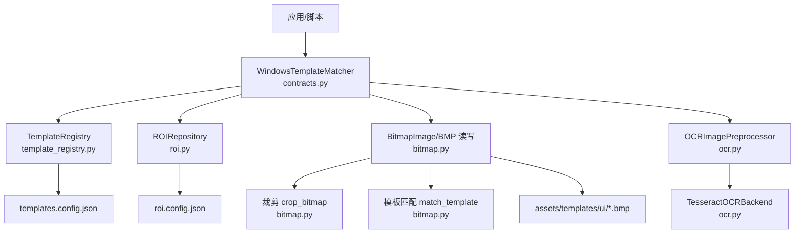
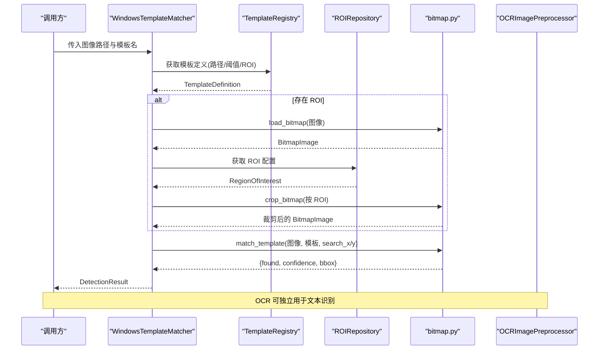
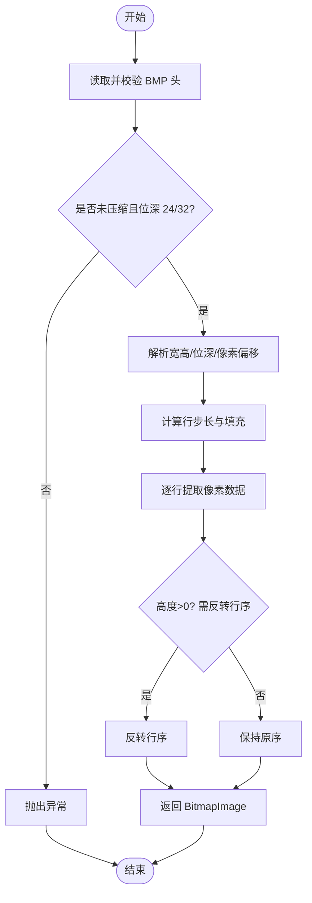
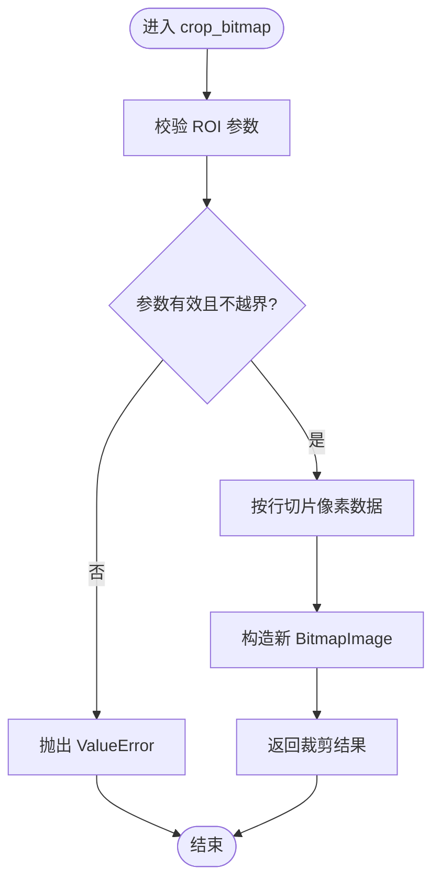
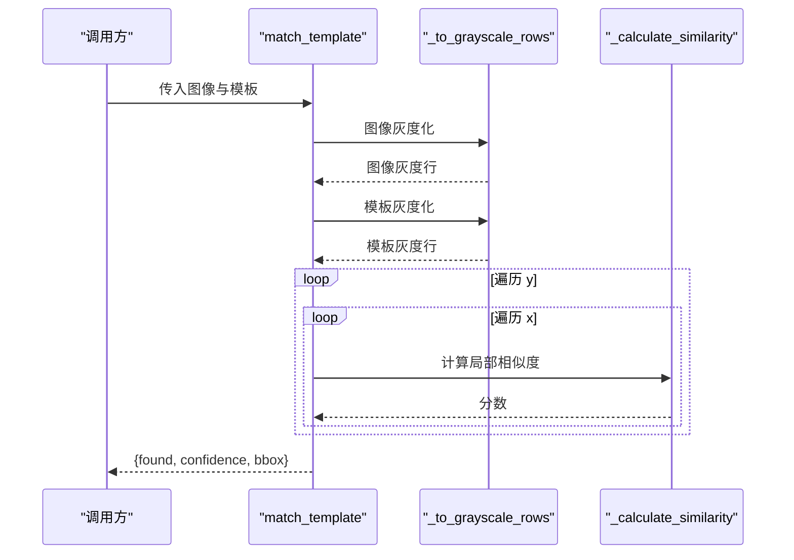
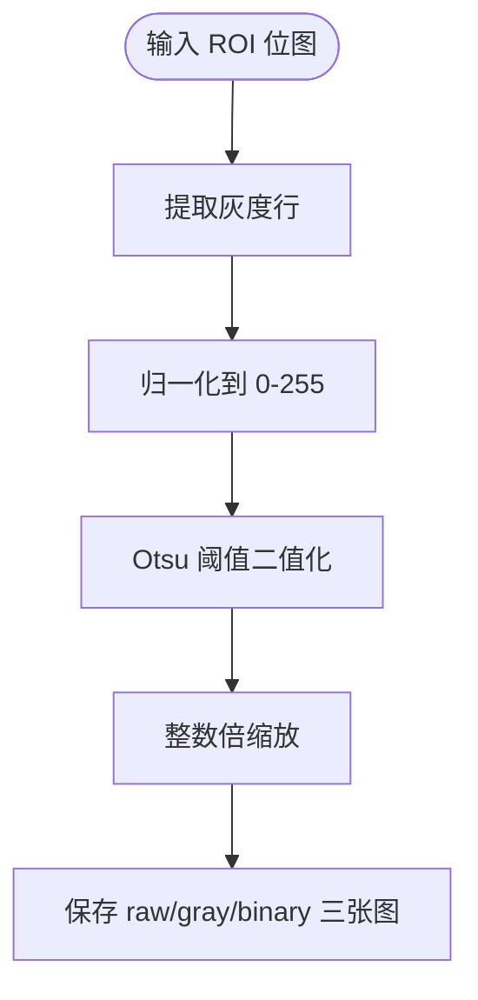
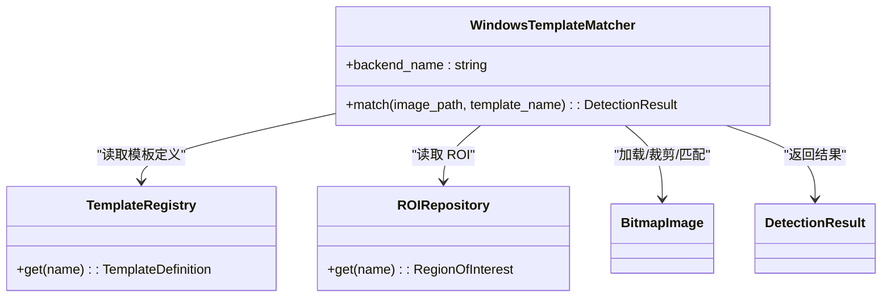
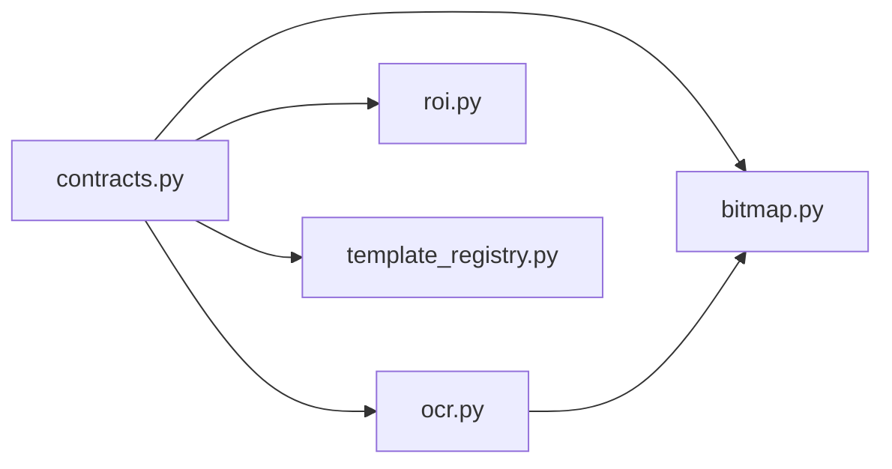

# 位图处理工具

<cite>
**本文引用的文件**
- [src/vision/bitmap.py](file://src/vision/bitmap.py)
- [src/vision/ocr.py](file://src/vision/ocr.py)
- [src/vision/contracts.py](file://src/vision/contracts.py)
- [src/vision/roi.py](file://src/vision/roi.py)
- [src/vision/template_registry.py](file://src/vision/template_registry.py)
- [config/templates.config.json](file://config/templates.config.json)
- [config/roi.config.json](file://config/roi.config.json)
- [assets/templates/ui/hideout_anchor.bmp](file://assets/templates/ui/hideout_anchor.bmp)
</cite>

## 目录
1. [简介](#简介)
2. [项目结构](#项目结构)
3. [核心组件](#核心组件)
4. [架构总览](#架构总览)
5. [详细组件分析](#详细组件分析)
6. [依赖关系分析](#依赖关系分析)
7. [性能考虑](#性能考虑)
8. [故障排查指南](#故障排查指南)
9. [结论](#结论)
10. [附录：使用示例与最佳实践](#附录使用示例与最佳实践)

## 简介
本技术文档围绕位图处理工具展开，重点解释以下能力：
- 图像加载机制：load_bitmap 的 BMP 解析流程、像素行布局与坐标方向统一。
- 区域裁剪算法：crop_bitmap 的参数校验、边界检查与行切片策略。
- 模板匹配实现：match_template 的灰度化、相似度计算与结果输出。
- 支持的图像格式与颜色空间：当前仅支持 BMP 读写；内部提供灰度化、二值化、缩放等基础图像处理能力。
- 内存管理与大图像策略：基于字节行的逐行处理、避免全图矩阵拷贝、ROI 缩小搜索范围以降低内存与计算压力。
- 性能优化建议：批量处理、缓存策略、并行处理的可行路径与注意事项。
- 实际使用场景与调用方式：结合 ROI、模板注册表与 OCR 预处理，给出端到端工作流。

## 项目结构
本项目将位图处理集中在 vision 模块中，配合配置与工具类形成完整链路：
- 位图核心：bitmap.py 提供 BitmapImage 数据模型、BMP 读写、裁剪与模板匹配。
- OCR 预处理：ocr.py 提供灰度化、二值化、Otsu 阈值、缩放等，并封装 Tesseract 后端。
- 契约与编排：contracts.py 定义截图、模板匹配、OCR 的统一接口，并提供 Windows 平台实现。
- ROI 管理：roi.py 提供 ROI 配置读取与持久化。
- 模板注册：template_registry.py 提供模板元数据与路径解析。
- 配置与资源：config 下保存 ROI 与模板配置；assets/templates/ui 存放模板图片（当前为 BMP）。

图表来源
- [src/vision/contracts.py:119-185](file://src/vision/contracts.py#L119-L185)
- [src/vision/template_registry.py:17-44](file://src/vision/template_registry.py#L17-L44)
- [src/vision/roi.py:21-68](file://src/vision/roi.py#L21-L68)
- [src/vision/bitmap.py:17-97](file://src/vision/bitmap.py#L17-L97)
- [src/vision/ocr.py:73-107](file://src/vision/ocr.py#L73-L107)

章节来源
- [src/vision/bitmap.py:1-201](file://src/vision/bitmap.py#L1-L201)
- [src/vision/ocr.py:1-280](file://src/vision/ocr.py#L1-L280)
- [src/vision/contracts.py:1-251](file://src/vision/contracts.py#L1-L251)
- [src/vision/roi.py:1-68](file://src/vision/roi.py#L1-L68)
- [src/vision/template_registry.py:1-44](file://src/vision/template_registry.py#L1-L44)
- [config/templates.config.json:1-9](file://config/templates.config.json#L1-L9)
- [config/roi.config.json:1-31](file://config/roi.config.json#L1-L31)

## 核心组件
- BitmapImage：不可变位图数据结构，包含宽高、位深、每像素字节数与按行存储的像素数据。
- load_bitmap/save_bitmap：BMP 文件的读取与写入，处理头信息、像素偏移、行对齐与方向归一化。
- crop_bitmap：在安全边界内对位图进行矩形区域裁剪。
- match_template：将图像与模板转为灰度后，滑动窗口计算相似度，返回置信度与边界框。
- OCR 预处理：构建灰度/二值图像、Otsu 阈值、整数缩放，便于 OCR 识别。
- 模板匹配编排：WindowsTemplateMatcher 负责加载模板、可选 ROI 裁剪、执行匹配并封装检测结果。

章节来源
- [src/vision/bitmap.py:8-201](file://src/vision/bitmap.py#L8-L201)
- [src/vision/ocr.py:73-280](file://src/vision/ocr.py#L73-L280)
- [src/vision/contracts.py:119-185](file://src/vision/contracts.py#L119-L185)

## 架构总览
整体流程以“截图 -> 可选 ROI 裁剪 -> 模板匹配 -> OCR 预处理”为主线，通过统一接口屏蔽底层差异。

图表来源
- [src/vision/contracts.py:119-185](file://src/vision/contracts.py#L119-L185)
- [src/vision/template_registry.py:17-44](file://src/vision/template_registry.py#L17-L44)
- [src/vision/roi.py:21-68](file://src/vision/roi.py#L21-L68)
- [src/vision/bitmap.py:17-165](file://src/vision/bitmap.py#L17-L165)

## 详细组件分析

### 位图数据结构与 BMP 读写
- 数据结构：BitmapImage 以 rows 列表存储每一行的原始字节，避免二维数组开销，利于按行处理。
- 读取流程：
  - 校验文件头与压缩类型，仅支持未压缩的 24/32 位 BMP。
  - 解析宽高、位深、像素偏移，计算行步长并对齐填充。
  - 按行提取像素数据，若高度为正则反转行序，统一为自上而下坐标系。
- 写入流程：
  - 按标准 BMP 自下而上的顺序写回，补齐行对齐字节。
  - 生成文件头与信息头，写入像素数据。

图表来源
- [src/vision/bitmap.py:17-60](file://src/vision/bitmap.py#L17-L60)

章节来源
- [src/vision/bitmap.py:17-97](file://src/vision/bitmap.py#L17-L97)

### 区域裁剪算法
- 参数校验：确保 x、y 非负，width、height 为正，且裁剪区域不越界。
- 行切片：根据 pixel_size 计算起始与结束字节位置，对指定行区间进行切片，构造新的 BitmapImage。
- 复杂度：时间 O(H×W)，空间 O(H×W)，其中 H、W 为裁剪区域尺寸。

图表来源
- [src/vision/bitmap.py:100-115](file://src/vision/bitmap.py#L100-L115)

章节来源
- [src/vision/bitmap.py:100-115](file://src/vision/bitmap.py#L100-L115)

### 模板匹配实现
- 输入校验：模板与图像像素格式必须一致；模板尺寸不得大于图像。
- 灰度化：将 RGB 行转换为灰度行，采用加权公式近似亮度。
- 相似度计算：滑动窗口遍历所有可能位置，计算平均绝对差并映射到 0~1 的置信度。
- 输出：返回 found、confidence、bbox（含 search_x/y 偏移）。

图表来源
- [src/vision/bitmap.py:118-201](file://src/vision/bitmap.py#L118-L201)

章节来源
- [src/vision/bitmap.py:118-201](file://src/vision/bitmap.py#L118-L201)

### OCR 预处理与颜色空间转换
- 灰度化：从 24/32 位像素中提取 R/G/B 并计算灰度值。
- 归一化：线性拉伸至 0~255，提升对比度。
- 二值化：Otsu 自动阈值分割，并根据暗像素比例决定是否反色。
- 缩放：整数倍放大，便于 OCR 识别小字或细线。
- 输出：保存原始、灰度、二值三种中间图，便于调试。

图表来源
- [src/vision/ocr.py:144-200](file://src/vision/ocr.py#L144-L200)
- [src/vision/ocr.py:203-280](file://src/vision/ocr.py#L203-L280)

章节来源
- [src/vision/ocr.py:73-280](file://src/vision/ocr.py#L73-L280)

### 模板匹配编排（WindowsTemplateMatcher）
- 职责：加载模板与图像，按模板配置选择 ROI 裁剪，执行匹配，封装 DetectionResult。
- 容错：ROI 越界时返回未命中而非抛异常，便于上层重试或降级。
- 阈值：依据模板配置的 threshold 判定最终 found。

图表来源
- [src/vision/contracts.py:119-185](file://src/vision/contracts.py#L119-L185)
- [src/vision/template_registry.py:17-44](file://src/vision/template_registry.py#L17-L44)
- [src/vision/roi.py:21-68](file://src/vision/roi.py#L21-L68)
- [src/vision/bitmap.py:17-165](file://src/vision/bitmap.py#L17-L165)

章节来源
- [src/vision/contracts.py:119-185](file://src/vision/contracts.py#L119-L185)

## 依赖关系分析
- 模块耦合：
  - contracts.py 依赖 bitmap.py、ocr.py、roi.py、template_registry.py，作为高层编排入口。
  - ocr.py 依赖 bitmap.py 的加载/裁剪/保存能力。
  - roi.py 与 template_registry.py 仅依赖 JSON 配置，低耦合。
- 外部依赖：
  - OCR 流程依赖 Tesseract 可执行文件，不存在时抛出运行时错误。
- 循环依赖：无直接循环导入。

图表来源
- [src/vision/contracts.py:1-251](file://src/vision/contracts.py#L1-L251)
- [src/vision/ocr.py:1-280](file://src/vision/ocr.py#L1-L280)

章节来源
- [src/vision/contracts.py:1-251](file://src/vision/contracts.py#L1-L251)
- [src/vision/ocr.py:1-280](file://src/vision/ocr.py#L1-L280)

## 性能考虑
- 纯 Python 实现的模板匹配为 O(W×H×w×h)，在大图上全图扫描代价高。建议：
  - 始终结合 ROI 裁剪，显著降低搜索空间。
  - 先做粗粒度降采样或分块扫描，再在候选区域精细匹配。
- 内存管理：
  - 使用 bytes 行存储，避免创建大型二维数组；裁剪时仅复制必要行与列。
  - 大图像尽量分块处理，避免一次性载入过多中间对象。
- 批处理与缓存：
  - 对同一图像的多次匹配可缓存其灰度表示，减少重复转换。
  - 模板灰度可预先计算并缓存。
- 并行处理：
  - 多模板匹配可并行化（不同模板互不干扰），注意进程/线程间内存共享成本。
  - OCR 预处理可并行化，但需注意磁盘 IO 与子进程启动开销。
- 其他优化：
  - 调整缩放倍数与二值化阈值，平衡识别率与速度。
  - 合理设置阈值，减少误报带来的后续处理成本。

[本节为通用性能指导，不直接分析具体文件]

## 故障排查指南
- 仅支持 BMP：
  - 现象：非 BMP 文件报错。
  - 原因：load_bitmap 仅校验 BMP 头与未压缩格式。
  - 解决：将 PNG/JPEG 等转换为 BMP 后再处理。
- ROI 越界：
  - 现象：裁剪时报错或匹配返回未命中。
  - 原因：分辨率变化导致标定区域失效。
  - 解决：重新标定 ROI，或在上层捕获异常并降级。
- 模板尺寸过大：
  - 现象：匹配前校验失败。
  - 原因：模板大于搜索图像。
  - 解决：调整模板尺寸或扩大搜索区域。
- 像素格式不一致：
  - 现象：模板与图像像素大小不同导致匹配失败。
  - 解决：统一为相同位深（如 24/32 位）。
- OCR 执行失败：
  - 现象：找不到 Tesseract 或命令执行失败。
  - 解决：安装 Tesseract 或配置可执行路径与环境变量。

章节来源
- [src/vision/bitmap.py:17-39](file://src/vision/bitmap.py#L17-L39)
- [src/vision/bitmap.py:100-127](file://src/vision/bitmap.py#L100-L127)
- [src/vision/ocr.py:23-70](file://src/vision/ocr.py#L23-L70)

## 结论
该位图处理工具以轻量、无第三方依赖为核心目标，提供了 BMP 读写、ROI 裁剪、模板匹配与 OCR 预处理的完整能力。通过 ROI 与模板注册表的配合，可在固定环境下稳定完成 UI 元素识别与交互。未来可扩展更多图像格式与高级算法，同时保持模块化与可测试性。

[本节为总结性内容，不直接分析具体文件]

## 附录：使用示例与最佳实践
- 基本用法（加载与裁剪）：
  - 使用 load_bitmap 读取 BMP，再用 crop_bitmap 截取感兴趣区域。
  - 参考路径：[src/vision/bitmap.py:17-60](file://src/vision/bitmap.py#L17-L60)、[src/vision/bitmap.py:100-115](file://src/vision/bitmap.py#L100-L115)
- 模板匹配（带 ROI）：
  - 通过 WindowsTemplateMatcher 加载模板与图像，按模板配置裁剪 ROI 并执行匹配。
  - 参考路径：[src/vision/contracts.py:119-185](file://src/vision/contracts.py#L119-L185)
- OCR 预处理：
  - 使用 OCRImagePreprocessor 构建灰度/二值图并保存，便于调试与识别。
  - 参考路径：[src/vision/ocr.py:73-107](file://src/vision/ocr.py#L73-L107)
- 配置管理：
  - ROI 与模板定义分别保存在 roi.config.json 与 templates.config.json。
  - 参考路径：[config/roi.config.json:1-31](file://config/roi.config.json#L1-L31)、[config/templates.config.json:1-9](file://config/templates.config.json#L1-L9)
- 模板资源：
  - 模板图片存放在 assets/templates/ui，当前示例为 hideout_anchor.bmp。
  - 参考路径：[assets/templates/ui/hideout_anchor.bmp](file://assets/templates/ui/hideout_anchor.bmp)

章节来源
- [src/vision/bitmap.py:17-165](file://src/vision/bitmap.py#L17-L165)
- [src/vision/ocr.py:73-107](file://src/vision/ocr.py#L73-L107)
- [src/vision/contracts.py:119-185](file://src/vision/contracts.py#L119-L185)
- [config/roi.config.json:1-31](file://config/roi.config.json#L1-L31)
- [config/templates.config.json:1-9](file://config/templates.config.json#L1-L9)
- [assets/templates/ui/hideout_anchor.bmp](file://assets/templates/ui/hideout_anchor.bmp)