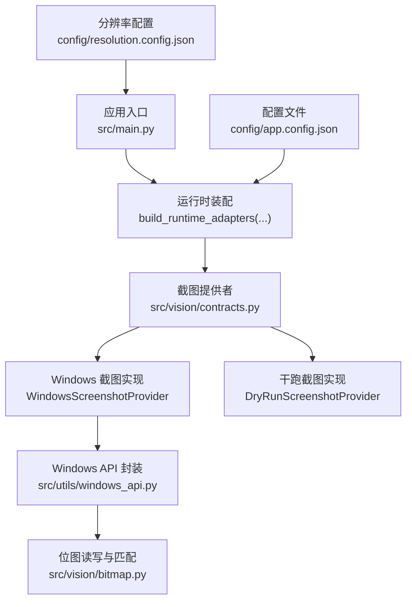
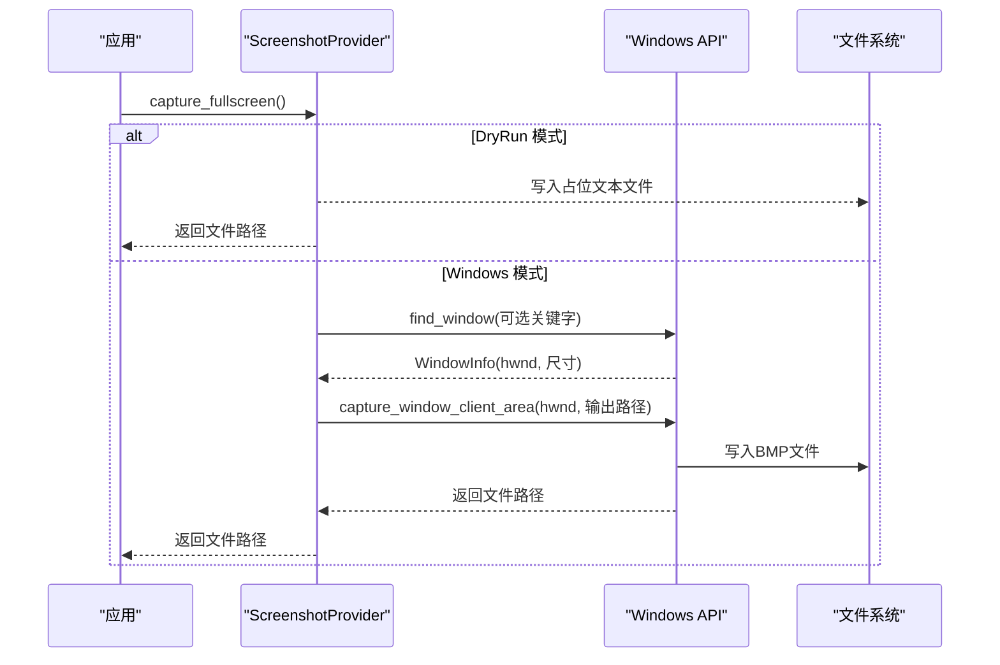
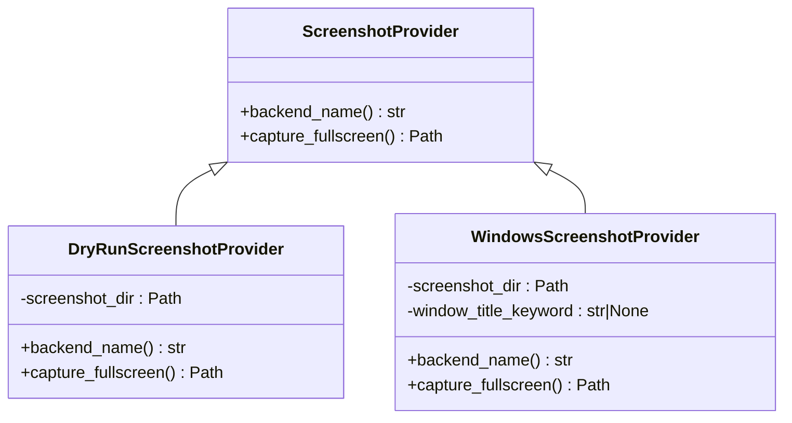
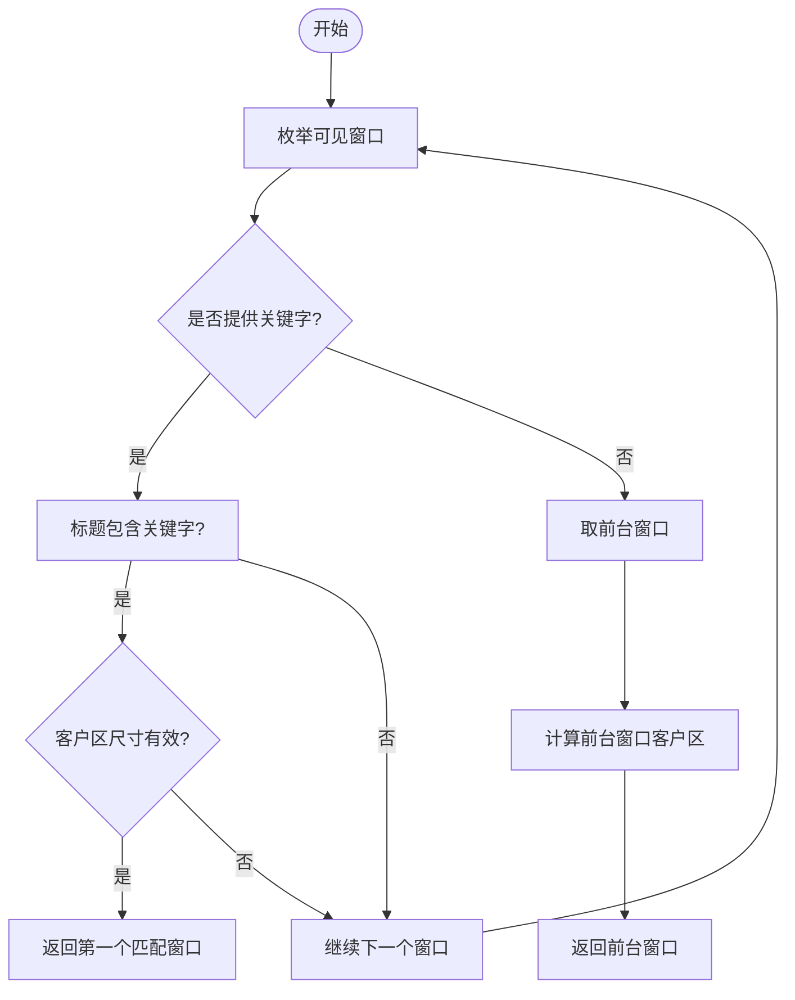
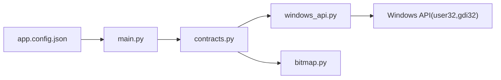

# 截图捕获机制

<cite>
**本文引用的文件**
- [src/vision/contracts.py](file://src/vision/contracts.py)
- [src/utils/windows_api.py](file://src/utils/windows_api.py)
- [src/vision/bitmap.py](file://src/vision/bitmap.py)
- [config/app.config.json](file://config/app.config.json)
- [config/resolution.config.json](file://config/resolution.config.json)
- [tools/capture_roi.py](file://tools/capture_roi.py)
- [src/main.py](file://src/main.py)
</cite>

## 目录
1. [简介](#简介)
2. [项目结构](#项目结构)
3. [核心组件](#核心组件)
4. [架构总览](#架构总览)
5. [详细组件分析](#详细组件分析)
6. [依赖关系分析](#依赖关系分析)
7. [性能考量](#性能考量)
8. [故障排查指南](#故障排查指南)
9. [结论](#结论)
10. [附录：配置与调试示例](#附录：配置与调试示例)

## 简介
本技术文档聚焦于“截图捕获机制”，围绕 ScreenshotProvider 抽象接口及其两种实现（DryRunScreenshotProvider、WindowsScreenshotProvider）展开，解释窗口句柄获取策略、屏幕区域截取算法、截图命名与存储路径管理，并提供配置示例、调试技巧、性能优化建议与最佳实践。目标是帮助开发者稳定、高效地捕获游戏窗口的客户区图像，避免标题栏和边框干扰，并顺利接入后续模板匹配与 OCR 流程。

## 项目结构
截图相关能力主要分布在以下模块：
- 抽象与实现：src/vision/contracts.py 定义了 ScreenshotProvider 抽象及 DryRun/Windows 两种实现
- Windows 底层 API：src/utils/windows_api.py 封装了窗口枚举、客户区坐标计算、位图捕获与写入
- 位图处理：src/vision/bitmap.py 提供 BMP 加载、裁剪、模板匹配等基础能力
- 配置：config/app.config.json 与 config/resolution.config.json 提供运行模式、截图目录、窗口关键字、分辨率等
- 工具：tools/capture_roi.py 用于从截图中按 ROI 裁切子图，辅助标定与调试
- 入口：src/main.py 负责装配运行时适配器，将 ScreenshotProvider 注入到平台校验器与调度器中

图表来源
- [src/main.py:22-50](file://src/main.py#L22-L50)
- [src/vision/contracts.py:25-116](file://src/vision/contracts.py#L25-L116)
- [src/utils/windows_api.py:121-289](file://src/utils/windows_api.py#L121-L289)
- [src/vision/bitmap.py:17-201](file://src/vision/bitmap.py#L17-L201)
- [config/app.config.json:1-23](file://config/app.config.json#L1-L23)
- [config/resolution.config.json:1-8](file://config/resolution.config.json#L1-L8)

章节来源
- [src/main.py:22-50](file://src/main.py#L22-L50)
- [config/app.config.json:1-23](file://config/app.config.json#L1-L23)
- [config/resolution.config.json:1-8](file://config/resolution.config.json#L1-L8)

## 核心组件
- ScreenshotProvider 抽象接口：统一截图能力，暴露 backend_name 与 capture_fullscreen
- DryRunScreenshotProvider：不真正抓取屏幕，仅生成占位文本文件，便于开发与联调
- WindowsScreenshotProvider：基于 Windows API 查找目标窗口并截取其客户区为 BMP 文件
- Windows API 封装：find_window、get_client_rect_on_screen、capture_window_client_area 等
- 位图处理：load_bitmap、save_bitmap、crop_bitmap、match_template

章节来源
- [src/vision/contracts.py:25-116](file://src/vision/contracts.py#L25-L116)
- [src/utils/windows_api.py:121-289](file://src/utils/windows_api.py#L121-L289)
- [src/vision/bitmap.py:17-201](file://src/vision/bitmap.py#L17-L201)

## 架构总览
截图捕获的整体流程如下：
- 应用启动时读取配置，构建运行时适配器，注入 ScreenshotProvider
- 调用 capture_fullscreen() 时：
  - DryRun 模式：创建占位文件并返回路径
  - Windows 模式：通过 find_window 定位窗口句柄，再调用 capture_window_client_area 截取客户区并保存为 BMP
- 生成的 BMP 可用于后续模板匹配或 OCR

图表来源
- [src/vision/contracts.py:58-116](file://src/vision/contracts.py#L58-L116)
- [src/utils/windows_api.py:121-289](file://src/utils/windows_api.py#L121-L289)

## 详细组件分析

### ScreenshotProvider 抽象与实现
- 设计原则
  - 通过抽象接口屏蔽平台差异，上层逻辑只依赖 capture_fullscreen()
  - 提供 dry_run 与 windows 两种后端，便于开发期快速验证与生产期真实抓取
- 关键行为
  - DryRunScreenshotProvider：创建截图目录，写入占位文本文件，返回路径
  - WindowsScreenshotProvider：根据 window_title_keyword 查找窗口，生成带时间戳的 BMP 文件名，调用底层 API 截取客户区

图表来源
- [src/vision/contracts.py:25-116](file://src/vision/contracts.py#L25-L116)

章节来源
- [src/vision/contracts.py:25-116](file://src/vision/contracts.py#L25-L116)

### 窗口句柄获取与关键字匹配
- 查找策略
  - 使用 EnumWindows 遍历所有可见窗口
  - 对每个窗口读取标题，若提供了 title_keyword，则进行大小写归一化后的子串匹配
  - 过滤掉没有有效客户区尺寸的窗口
  - 若找到匹配窗口，返回第一个；否则在指定关键字下抛出异常
  - 未指定关键字时，回退到前台窗口作为目标
- 坐标计算
  - get_client_rect_on_screen 通过 GetClientRect 与 ClientToScreen 计算客户区在屏幕上的左上角坐标与宽高

图表来源
- [src/utils/windows_api.py:121-196](file://src/utils/windows_api.py#L121-L196)

章节来源
- [src/utils/windows_api.py:121-196](file://src/utils/windows_api.py#L121-L196)

### 屏幕区域截取算法（客户区精确捕获）
- 目标
  - 仅截取窗口客户区，避免标题栏与边框进入截图，确保后续 ROI 与模板匹配坐标一致
- 步骤
  - 计算客户区屏幕坐标与尺寸
  - 获取屏幕 DC，创建兼容内存 DC 与位图
  - BitBlt 拷贝客户区像素到内存位图
  - 通过 GetDIBits 提取像素数据，构造标准 BMP 头并落盘
- 资源管理
  - 使用 try/finally 确保释放 DC、删除对象，避免资源泄漏

```mermaid
flowchart TD
Enter(["进入 capture_window_client_area"]) --> Calc["计算客户区 left,top,width,height"]
Calc --> Validate{"尺寸有效?"}
Validate --> |否| Error["抛出无效尺寸错误"]
Validate --> |是| DC["获取屏幕DC并创建内存DC"]
DC --> CreateBM["创建兼容位图并选入内存DC"]
CreateBM --> Copy["BitBlt拷贝客户区像素"]
Copy --> ReadBits["GetDIBits读取像素数据"]
ReadBits --> WriteBMP["写入BMP文件头与像素数据"]
WriteBMP --> Release["释放DC与对象"]
Release --> Exit(["返回输出路径"])
```

图表来源
- [src/utils/windows_api.py:228-289](file://src/utils/windows_api.py#L228-L289)

章节来源
- [src/utils/windows_api.py:228-289](file://src/utils/windows_api.py#L228-L289)

### 截图文件命名规范与存储路径管理
- 存储路径
  - 由配置 app.config.json 中的 screenshot_dir 决定，默认位于 runtime/screenshots
  - WindowsScreenshotProvider 会在 capture_fullscreen 前确保目录存在
- 命名规则
  - Windows 模式：windows_capture_{YYYYMMDD_HHMMSS_ffffff}.bmp
  - DryRun 模式：dry_run_capture.txt（占位文本）
- 时间戳
  - 使用当前时间的微秒级时间戳，保证文件名唯一性

章节来源
- [config/app.config.json:7-8](file://config/app.config.json#L7-L8)
- [src/vision/contracts.py:58-116](file://src/vision/contracts.py#L58-L116)

### 与模板匹配和 ROI 的关系
- 模板匹配
  - 使用 BitmapImage 与纯 Python 相似度计算，配合 ROI 裁剪减少全图扫描开销
- ROI 裁剪
  - tools/capture_roi.py 可从整张截图中按 ROI 配置裁切子图，便于标定与调试
- 坐标一致性
  - 由于截取的是客户区，ROI 与模板匹配均基于同一坐标系，避免标题栏与边框带来的偏移

章节来源
- [src/vision/bitmap.py:100-201](file://src/vision/bitmap.py#L100-L201)
- [tools/capture_roi.py:15-37](file://tools/capture_roi.py#L15-L37)

## 依赖关系分析
- 模块耦合
  - contracts.py 依赖 windows_api.py 的 find_window 与 capture_window_client_area
  - windows_api.py 直接调用 user32/gdi32 系统库完成窗口枚举与位图捕获
  - bitmap.py 提供 BMP 解析与模板匹配，被上层识别与 OCR 流程复用
- 外部依赖
  - Windows 系统 API（user32、gdi32）
  - Tesseract OCR（OCR 流程，非截图核心）

图表来源
- [src/vision/contracts.py:1-14](file://src/vision/contracts.py#L1-L14)
- [src/utils/windows_api.py:1-12](file://src/utils/windows_api.py#L1-L12)
- [src/main.py:22-50](file://src/main.py#L22-L50)
- [config/app.config.json:1-23](file://config/app.config.json#L1-L23)

章节来源
- [src/vision/contracts.py:1-14](file://src/vision/contracts.py#L1-L14)
- [src/utils/windows_api.py:1-12](file://src/utils/windows_api.py#L1-L12)
- [src/main.py:22-50](file://src/main.py#L22-L50)
- [config/app.config.json:1-23](file://config/app.config.json#L1-L23)

## 性能考量
- 窗口枚举与标题读取
  - 仅在必要时执行，且跳过无标题或不可见窗口，降低开销
- 客户区截取
  - 使用 BitBlt + GetDIBits 直接访问像素，避免中间格式转换
  - 严格释放 DC 与对象，防止内存泄漏
- 模板匹配
  - 结合 ROI 裁剪，显著减少搜索空间，提升匹配速度
- 分辨率与缩放
  - 通过 resolution.config.json 控制 UI 缩放与窗口模式，确保 ROI 与模板在不同分辨率下仍有效

[本节为通用性能指导，不直接分析具体代码行]

## 故障排查指南
- 找不到窗口
  - 检查 window_title_keyword 是否与游戏窗口标题完全匹配（大小写归一化后子串匹配）
  - 确认窗口可见且有有效客户区尺寸
  - 未指定关键字时会回退到前台窗口，若失败会抛出异常
- 截图质量差或内容不正确
  - 确认截取的是客户区而非整个窗口，避免标题栏与边框干扰
  - 检查分辨率与 UI 缩放设置，确保 ROI 与模板在当前分辨率下有效
  - 使用 tools/capture_roi.py 从截图中裁切 ROI 并保存，验证坐标是否正确
- 资源泄漏或崩溃
  - 确保 BitBlt/GetDIBits 成功后正确释放 DC 与对象
  - 关注异常日志与 last_error 信息，定位系统 API 调用失败原因

章节来源
- [src/utils/windows_api.py:121-196](file://src/utils/windows_api.py#L121-L196)
- [src/utils/windows_api.py:228-289](file://src/utils/windows_api.py#L228-L289)
- [tools/capture_roi.py:15-37](file://tools/capture_roi.py#L15-L37)

## 结论
该截图捕获机制通过抽象接口隔离平台差异，以 DryRun 与 Windows 两种实现满足开发与生产需求。Windows 实现利用系统 API 精确捕获窗口客户区，避免标题栏与边框干扰，并通过 ROI 与模板匹配形成稳定的视觉识别链路。合理的命名与路径管理、完善的异常处理与资源释放，以及可配置的分辨率与缩放，共同保障了截图流程的可靠性与可维护性。

[本节为总结性内容，不直接分析具体代码行]

## 附录：配置与调试示例
- 基本配置
  - 运行模式：runtime_mode 设置为 windows 启用真实截图
  - 截图目录：screenshot_dir 指向 runtime/screenshots
  - 窗口关键字：window_title_keyword 填写游戏窗口标题关键字
  - OCR 语言与参数：ocr_language、ocr_psm、ocr_tesseract_cmd
  - 模板与 ROI：template_root、template_config_path、roi_config_path
- 分辨率与窗口模式
  - width、height 设置目标分辨率
  - window_mode 设置为 windowed_fullscreen 或其他合适模式
  - ui_scale 控制 UI 缩放比例
- 调试技巧
  - 使用 tools/capture_roi.py 从截图中按 ROI 名称裁切子图，验证 ROI 坐标
  - 观察生成的 BMP 文件，确认截取区域与预期一致
  - 调整模板阈值与 OCR 置信度阈值，平衡召回与误报

章节来源
- [config/app.config.json:1-23](file://config/app.config.json#L1-L23)
- [config/resolution.config.json:1-8](file://config/resolution.config.json#L1-L8)
- [tools/capture_roi.py:15-37](file://tools/capture_roi.py#L15-L37)