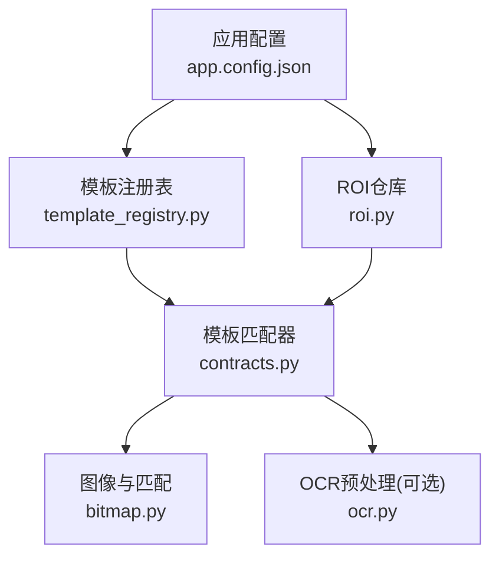
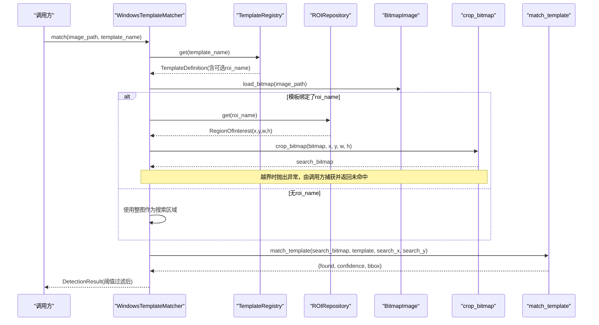
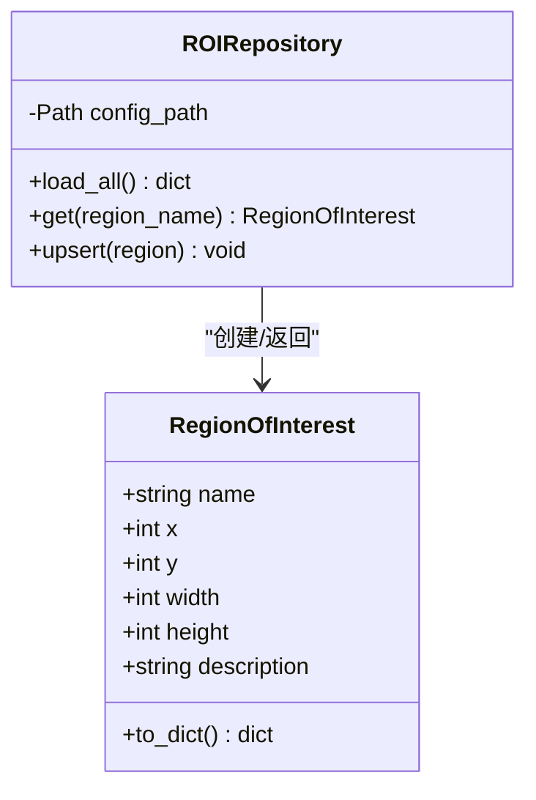
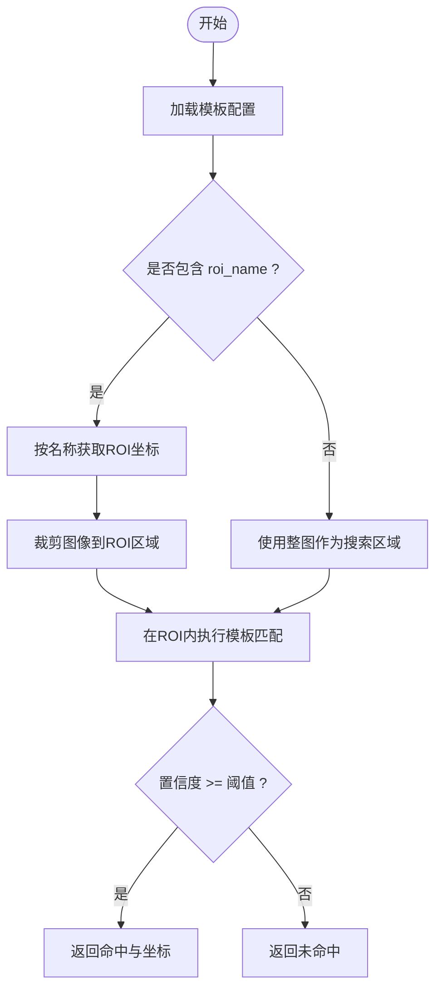
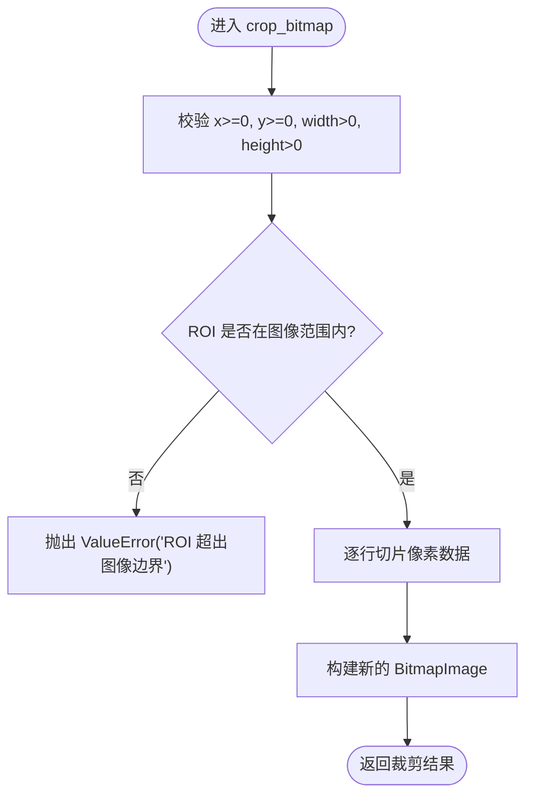
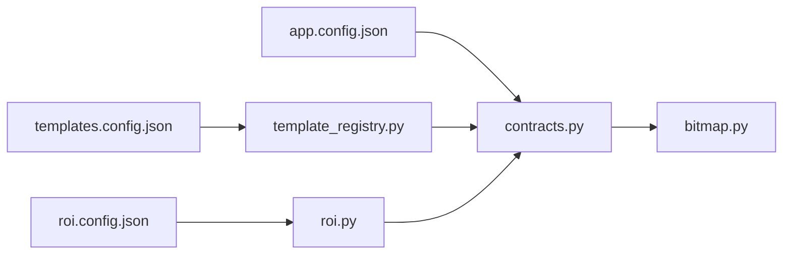

# ROI集成机制

<cite>
**本文引用的文件**
- [src/vision/roi.py](file://src/vision/roi.py)
- [config/roi.config.json](file://config/roi.config.json)
- [src/vision/template_registry.py](file://src/vision/template_registry.py)
- [config/templates.config.json](file://config/templates.config.json)
- [src/vision/bitmap.py](file://src/vision/bitmap.py)
- [src/vision/contracts.py](file://src/vision/contracts.py)
- [tools/calibrate_roi.py](file://tools/calibrate_roi.py)
- [tools/capture_roi.py](file://tools/capture_roi.py)
- [config/app.config.json](file://config/app.config.json)
</cite>

## 目录
1. [简介](#简介)
2. [项目结构](#项目结构)
3. [核心组件](#核心组件)
4. [架构总览](#架构总览)
5. [详细组件分析](#详细组件分析)
6. [依赖关系分析](#依赖关系分析)
7. [性能考量](#性能考量)
8. [故障排查指南](#故障排查指南)
9. [结论](#结论)
10. [附录](#附录)

## 简介
本技术文档聚焦于ROI（感兴趣区域）在模板匹配中的集成机制，解释其如何减少搜索范围、提升匹配性能并降低误识别率。文档涵盖：
- ROI在模板匹配中的作用与价值
- ROIRepository的加载、验证与持久化机制
- ROI与模板的绑定关系及运行时动态获取流程
- ROI坐标系统概念与分辨率适配策略
- ROI裁剪实现细节与边界检查
- ROI标定最佳实践、越界处理与调试方法
- 实际使用示例与排错建议

## 项目结构
本项目将ROI能力集中在vision模块中，并通过配置驱动的方式与模板注册表、截图与OCR等子系统协作。关键文件职责如下：
- ROI数据模型与仓库：定义RegionOfInterest数据类与ROIRepository，负责从JSON加载、查询与更新ROI配置
- 模板注册表：TemplateRegistry解析模板配置，支持可选的roi_name字段以绑定ROI
- 图像与匹配：bitmap提供BMP读写、裁剪与模板匹配；contracts将ROI与模板匹配串联为WindowsTemplateMatcher
- 工具脚本：calibrate_roi用于写入ROI配置；capture_roi用于按ROI裁切截图或模板样本
- 应用配置：app.config.json集中声明模板与ROI配置文件路径

图表来源
- [config/app.config.json:1-23](file://config/app.config.json#L1-L23)
- [src/vision/template_registry.py:1-44](file://src/vision/template_registry.py#L1-L44)
- [src/vision/roi.py:1-68](file://src/vision/roi.py#L1-L68)
- [src/vision/contracts.py:119-185](file://src/vision/contracts.py#L119-L185)
- [src/vision/bitmap.py:100-165](file://src/vision/bitmap.py#L100-L165)

章节来源
- [config/app.config.json:1-23](file://config/app.config.json#L1-L23)
- [src/vision/template_registry.py:1-44](file://src/vision/template_registry.py#L1-L44)
- [src/vision/roi.py:1-68](file://src/vision/roi.py#L1-L68)
- [src/vision/contracts.py:119-185](file://src/vision/contracts.py#L119-L185)
- [src/vision/bitmap.py:100-165](file://src/vision/bitmap.py#L100-L165)

## 核心组件
- RegionOfInterest：描述一个矩形区域（x, y, width, height），可附带描述信息
- ROIRepository：从JSON加载所有ROI，提供get/upsert接口，支持按名称检索与持久化更新
- TemplateRegistry：解析模板配置，返回包含可选roi_name的模板定义
- WindowsTemplateMatcher：将模板与ROI结合，在指定ROI内执行模板匹配，并将结果映射回原图坐标
- BitmapImage与crop_bitmap/match_template：提供BMP读写、ROI裁剪与基于灰度的相似度匹配

章节来源
- [src/vision/roi.py:8-68](file://src/vision/roi.py#L8-L68)
- [src/vision/template_registry.py:8-44](file://src/vision/template_registry.py#L8-L44)
- [src/vision/contracts.py:119-185](file://src/vision/contracts.py#L119-L185)
- [src/vision/bitmap.py:8-201](file://src/vision/bitmap.py#L8-L201)

## 架构总览
ROI在模板匹配中的工作流如下：
- 模板配置通过TemplateRegistry加载，若包含roi_name则绑定对应ROI
- 运行时根据模板绑定的ROI名称，从ROIRepository读取ROI坐标
- 使用crop_bitmap对原始截图进行裁剪，限制匹配范围
- 在裁剪后的图像上执行match_template，得到相对坐标与置信度
- 将相对坐标加上search_x/search_y偏移，还原为原图绝对坐标
- 若ROI越界，捕获异常并返回“未命中”，避免崩溃

图表来源
- [src/vision/contracts.py:119-185](file://src/vision/contracts.py#L119-L185)
- [src/vision/template_registry.py:17-44](file://src/vision/template_registry.py#L17-L44)
- [src/vision/roi.py:21-46](file://src/vision/roi.py#L21-L46)
- [src/vision/bitmap.py:100-165](file://src/vision/bitmap.py#L100-L165)

## 详细组件分析

### ROI数据模型与仓库
- RegionOfInterest：使用数据类存储名称、坐标与尺寸，并提供序列化方法
- ROIRepository：
  - 加载：从JSON读取所有ROI条目，构造RegionOfInterest对象字典
  - 查询：按名称检索，不存在时抛出KeyError
  - 更新：upsert将新ROI写入JSON，保持键排序与人类可读格式
  - 容错：若配置文件不存在，返回空字典，便于降级处理

图表来源
- [src/vision/roi.py:8-68](file://src/vision/roi.py#L8-L68)

章节来源
- [src/vision/roi.py:8-68](file://src/vision/roi.py#L8-L68)
- [config/roi.config.json:1-31](file://config/roi.config.json#L1-L31)

### 模板与ROI绑定
- 模板配置templates.config.json中每个模板可包含path、roi、threshold、description
- TemplateRegistry.get将解析配置，生成TemplateDefinition，其中roi_name可为空
- 当存在roi_name时，WindowsTemplateMatcher会在匹配前按该名称从ROIRepository获取ROI，并在裁剪区域内执行匹配

图表来源
- [config/templates.config.json:1-9](file://config/templates.config.json#L1-L9)
- [src/vision/template_registry.py:17-44](file://src/vision/template_registry.py#L17-L44)
- [src/vision/contracts.py:133-185](file://src/vision/contracts.py#L133-L185)

章节来源
- [config/templates.config.json:1-9](file://config/templates.config.json#L1-L9)
- [src/vision/template_registry.py:17-44](file://src/vision/template_registry.py#L17-L44)
- [src/vision/contracts.py:133-185](file://src/vision/contracts.py#L133-L185)

### 坐标系统与分辨率适配
- 坐标系统：
  - 绝对坐标：相对于整张截图的原点(0,0)，即最终bbox的坐标
  - 相对坐标：相对于裁剪后的ROI图像的起点(0,0)，即match_template内部计算的offset
- 适配策略：
  - 当前实现假设固定分辨率与窗口模式，ROI坐标为绝对像素值
  - 若分辨率变化导致ROI越界，裁剪会抛出异常，匹配器捕获后返回未命中，避免崩溃
  - 建议在多分辨率场景下增加缩放因子计算或自适应ROI策略（当前版本未实现）

章节来源
- [src/vision/bitmap.py:100-165](file://src/vision/bitmap.py#L100-L165)
- [src/vision/contracts.py:133-185](file://src/vision/contracts.py#L133-L185)

### ROI裁剪与边界检查
- crop_bitmap实现要点：
  - 参数校验：x/y非负，width/height为正
  - 边界检查：确保ROI不超出图像宽高
  - 行切片：按像素步长截取每行的ROI段，构建新的BitmapImage
- 越界处理：
  - 在WindowsTemplateMatcher中捕获ValueError，返回DetectionResult(found=False)，并记录错误原因roi_out_of_bounds
  - 这使系统在标定不一致时安全降级，不影响整体运行

图表来源
- [src/vision/bitmap.py:100-115](file://src/vision/bitmap.py#L100-L115)
- [src/vision/contracts.py:143-163](file://src/vision/contracts.py#L143-L163)

章节来源
- [src/vision/bitmap.py:100-115](file://src/vision/bitmap.py#L100-L115)
- [src/vision/contracts.py:143-163](file://src/vision/contracts.py#L143-L163)

### 模板匹配与ROI带来的性能收益
- 匹配算法：
  - 将图像与模板转为灰度行矩阵
  - 遍历ROI内的所有可能偏移位置，计算平均像素差并归一化为相似度分数
- ROI的价值：
  - 显著缩小搜索空间，避免全图暴力扫描，从而提升速度
  - 减少背景干扰，降低误识别率
  - 提高稳定性：固定UI元素在固定ROI内更易稳定识别

章节来源
- [src/vision/bitmap.py:118-201](file://src/vision/bitmap.py#L118-L201)
- [src/vision/contracts.py:133-185](file://src/vision/contracts.py#L133-L185)

### 工具与标定流程
- calibrate_roi：命令行工具，接收ROI名称、坐标与尺寸，写入ROI配置文件
- capture_roi：按ROI裁切截图或模板样本，输出BMP文件，便于后续采集与调试
- 典型流程：
  - 使用calibrate_roi标定UI锚点或面板区域
  - 使用capture_roi从截图中提取ROI区域，保存为模板或调试图
  - 在模板配置中为该模板指定roi_name，完成绑定

章节来源
- [tools/calibrate_roi.py:1-47](file://tools/calibrate_roi.py#L1-L47)
- [tools/capture_roi.py:1-42](file://tools/capture_roi.py#L1-L42)
- [config/roi.config.json:1-31](file://config/roi.config.json#L1-L31)

## 依赖关系分析
- 模块耦合：
  - contracts依赖template_registry与roi_repository，组合成WindowsTemplateMatcher
  - bitmap被contracts与工具脚本复用，提供基础图像操作
  - app.config.json集中声明模板与ROI配置路径，驱动初始化
- 外部依赖：
  - 当前实现仅依赖标准库与BMP格式，无第三方视觉库
  - OCR部分可接入Tesseract，但ROI机制独立于OCR后端

图表来源
- [config/app.config.json:1-23](file://config/app.config.json#L1-L23)
- [config/templates.config.json:1-9](file://config/templates.config.json#L1-L9)
- [config/roi.config.json:1-31](file://config/roi.config.json#L1-L31)
- [src/vision/contracts.py:119-185](file://src/vision/contracts.py#L119-L185)
- [src/vision/template_registry.py:17-44](file://src/vision/template_registry.py#L17-L44)
- [src/vision/roi.py:21-68](file://src/vision/roi.py#L21-L68)
- [src/vision/bitmap.py:100-165](file://src/vision/bitmap.py#L100-L165)

章节来源
- [config/app.config.json:1-23](file://config/app.config.json#L1-L23)
- [config/templates.config.json:1-9](file://config/templates.config.json#L1-L9)
- [config/roi.config.json:1-31](file://config/roi.config.json#L1-L31)
- [src/vision/contracts.py:119-185](file://src/vision/contracts.py#L119-L185)
- [src/vision/template_registry.py:17-44](file://src/vision/template_registry.py#L17-L44)
- [src/vision/roi.py:21-68](file://src/vision/roi.py#L21-L68)
- [src/vision/bitmap.py:100-165](file://src/vision/bitmap.py#L100-L165)

## 性能考量
- ROI裁剪显著减少匹配次数，避免全图扫描导致的性能瓶颈
- 纯Python实现的相似度计算简单可靠，但对大ROI仍有一定开销
- 建议：
  - 尽量将ROI控制在最小必要范围，减少像素比较量
  - 合理设置阈值，避免低置信度匹配造成误判
  - 在多分辨率环境下，考虑引入缩放因子或自适应ROI策略（当前版本未实现）

[本节为通用指导，不直接分析具体文件]

## 故障排查指南
- ROI越界：
  - 现象：匹配返回未命中，extra中包含match_error=roi_out_of_bounds
  - 原因：标定坐标与当前截图分辨率不一致
  - 处理：重新标定ROI或使用capture_roi验证裁剪结果
- 模板未找到或配置缺失：
  - 现象：抛出KeyError或FileNotFoundError
  - 处理：检查模板配置与路径是否正确
- 图像格式不支持：
  - 现象：仅支持未压缩BMP，位深24/32位
  - 处理：转换图像格式后再使用
- 调试建议：
  - 使用capture_roi输出裁剪后的BMP，确认ROI区域正确
  - 使用test_ocr或OCR调试输出查看灰度与二值化效果
  - 记录extra字段中的模板路径、阈值与ROI名称，辅助定位问题

章节来源
- [src/vision/contracts.py:143-163](file://src/vision/contracts.py#L143-L163)
- [src/vision/bitmap.py:17-39](file://src/vision/bitmap.py#L17-L39)
- [tools/capture_roi.py:26-37](file://tools/capture_roi.py#L26-L37)

## 结论
ROI集成机制在本项目中提供了高效、稳定的模板匹配能力。通过ROIRepository管理ROI配置，TemplateRegistry绑定模板与ROI，WindowsTemplateMatcher在运行时动态裁剪并匹配，实现了：
- 搜索范围可控，匹配速度快
- 误识别率低，稳定性强
- 越界与异常安全降级，不影响整体运行
配合标定工具与调试输出，可在固定分辨率环境下快速迭代与优化ROI策略。

[本节为总结性内容，不直接分析具体文件]

## 附录
- 使用示例
  - 标定ROI：使用calibrate_roi写入ROI配置，指定名称、坐标与尺寸
  - 裁切模板：使用capture_roi从截图中按ROI裁切模板样本
  - 绑定模板：在templates.config.json中为模板指定roi_name
  - 运行匹配：通过WindowsTemplateMatcher.match执行匹配，检查DetectionResult
- 配置参考
  - app.config.json：声明模板与ROI配置文件路径
  - templates.config.json：模板路径、阈值与ROI绑定
  - roi.config.json：ROI名称、坐标与描述

章节来源
- [tools/calibrate_roi.py:14-42](file://tools/calibrate_roi.py#L14-L42)
- [tools/capture_roi.py:15-37](file://tools/capture_roi.py#L15-L37)
- [config/app.config.json:1-23](file://config/app.config.json#L1-L23)
- [config/templates.config.json:1-9](file://config/templates.config.json#L1-L9)
- [config/roi.config.json:1-31](file://config/roi.config.json#L1-L31)