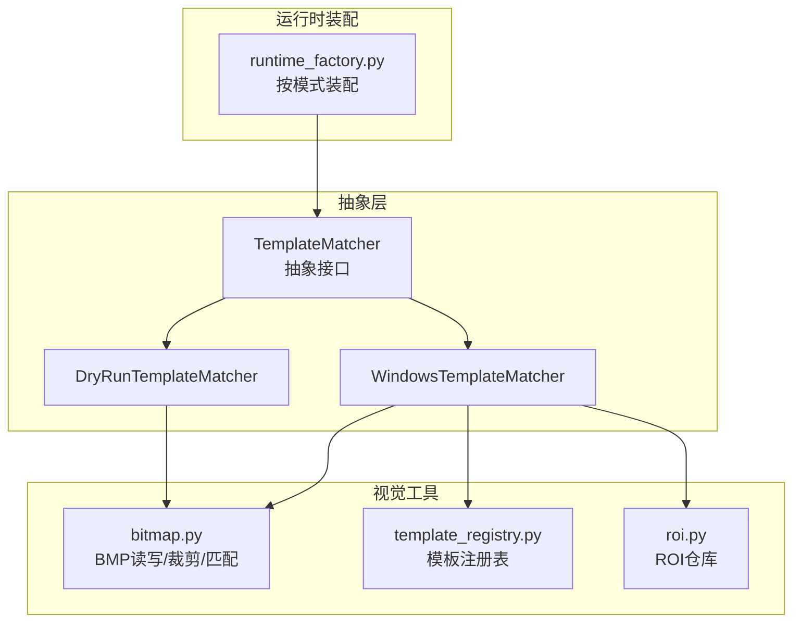
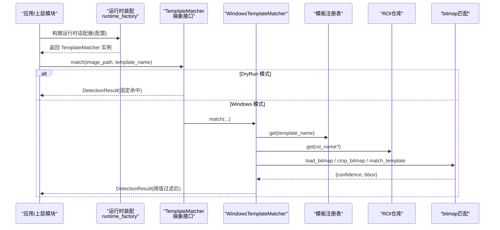
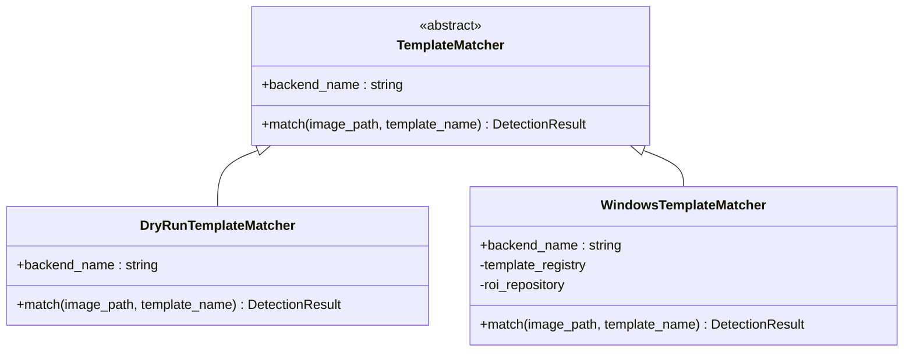
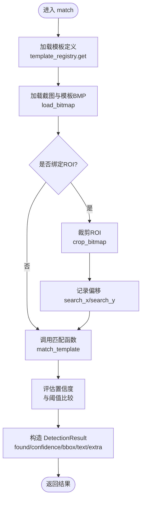
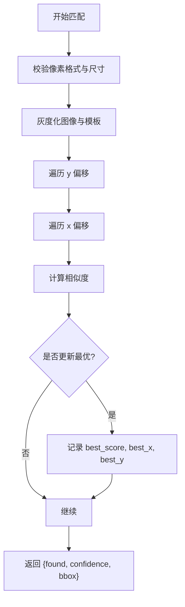
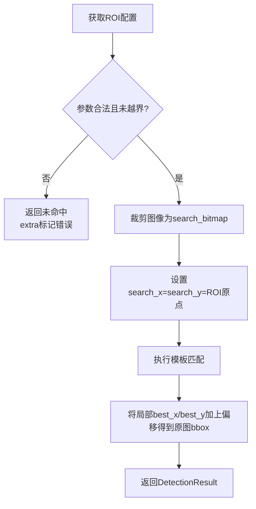
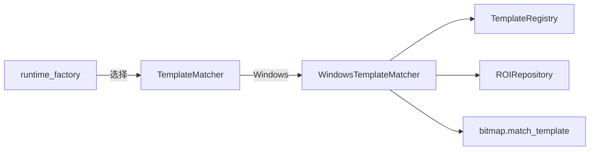

# 模板匹配核心算法

<cite>
**本文引用的文件**
- [src/vision/contracts.py](file://src/vision/contracts.py)
- [src/vision/bitmap.py](file://src/vision/bitmap.py)
- [src/vision/roi.py](file://src/vision/roi.py)
- [src/vision/template_registry.py](file://src/vision/template_registry.py)
- [src/core/runtime_factory.py](file://src/core/runtime_factory.py)
- [tools/collect_template.py](file://tools/collect_template.py)
</cite>

## 目录
1. [简介](#简介)
2. [项目结构](#项目结构)
3. [核心组件](#核心组件)
4. [架构总览](#架构总览)
5. [详细组件分析](#详细组件分析)
6. [依赖关系分析](#依赖关系分析)
7. [性能考虑](#性能考虑)
8. [故障排查指南](#故障排查指南)
9. [结论](#结论)
10. [附录：使用示例与最佳实践](#附录使用示例与最佳实践)

## 简介
本技术文档围绕模板匹配核心算法展开，重点解释 TemplateMatcher 抽象接口的设计原理，以及 DryRunTemplateMatcher 与 WindowsTemplateMatcher 两种实现模式的差异与适用场景。文档还深入说明 match 方法的执行流程（图像加载、ROI 裁剪、模板匹配计算、置信度评估、结果封装），并阐述 DetectionResult 数据结构的设计意图与字段含义。最后提供 ROI 裁剪机制与坐标映射逻辑的详细说明、性能优化建议与常见问题解决方案。

## 项目结构
本项目将视觉能力以“适配器 + 工具库”的方式组织：
- 抽象接口定义在 contracts 中，屏蔽后端差异；
- 具体实现包括 DryRun（调试/占位）和 Windows（真实截图与匹配）；
- 图像处理与模板匹配算法集中在 bitmap；
- ROI 配置与模板注册表分别由 roi 与 template_registry 管理；
- runtime_factory 根据运行模式装配不同后端。

图表来源
- [src/vision/contracts.py:36-44](file://src/vision/contracts.py#L36-L44)
- [src/vision/contracts.py:73-84](file://src/vision/contracts.py#L73-L84)
- [src/vision/contracts.py:119-185](file://src/vision/contracts.py#L119-L185)
- [src/vision/bitmap.py:118-165](file://src/vision/bitmap.py#L118-L165)
- [src/vision/template_registry.py:17-44](file://src/vision/template_registry.py#L17-L44)
- [src/vision/roi.py:21-46](file://src/vision/roi.py#L21-L46)
- [src/core/runtime_factory.py:30-77](file://src/core/runtime_factory.py#L30-L77)

章节来源
- [src/vision/contracts.py:36-44](file://src/vision/contracts.py#L36-L44)
- [src/vision/bitmap.py:118-165](file://src/vision/bitmap.py#L118-L165)
- [src/vision/template_registry.py:17-44](file://src/vision/template_registry.py#L17-L44)
- [src/vision/roi.py:21-46](file://src/vision/roi.py#L21-L46)
- [src/core/runtime_factory.py:30-77](file://src/core/runtime_factory.py#L30-L77)

## 核心组件
- TemplateMatcher 抽象接口：统一 match(image_path, template_name) -> DetectionResult 的调用契约，并提供 backend_name 标识后端类型。
- DryRunTemplateMatcher：无需真实截图与匹配，直接返回固定命中结果，用于开发联调与流程验证。
- WindowsTemplateMatcher：基于真实 BMP 截图、模板注册表与 ROI 配置进行模板匹配，支持阈值过滤与坐标映射。
- DetectionResult：标准化检测结果，包含是否命中、置信度、边界框、文本与扩展信息。
- 图像处理与匹配：BMP 读取/写入、ROI 裁剪、灰度化、相似度计算与全局最优位置搜索。
- 模板注册表与 ROI 仓库：JSON 配置驱动，解耦模板与 ROI 的定义与路径解析。

章节来源
- [src/vision/contracts.py:16-44](file://src/vision/contracts.py#L16-L44)
- [src/vision/contracts.py:73-84](file://src/vision/contracts.py#L73-L84)
- [src/vision/contracts.py:119-185](file://src/vision/contracts.py#L119-L185)
- [src/vision/bitmap.py:17-60](file://src/vision/bitmap.py#L17-L60)
- [src/vision/bitmap.py:100-115](file://src/vision/bitmap.py#L100-L115)
- [src/vision/bitmap.py:118-200](file://src/vision/bitmap.py#L118-L200)
- [src/vision/template_registry.py:8-44](file://src/vision/template_registry.py#L8-L44)
- [src/vision/roi.py:8-46](file://src/vision/roi.py#L8-L46)

## 架构总览
下图展示了从高层适配到具体实现的调用链：运行时根据模式选择后端，调用 TemplateMatcher.match，内部可能涉及模板注册表、ROI 仓库与底层图像匹配。

图表来源
- [src/core/runtime_factory.py:30-77](file://src/core/runtime_factory.py#L30-L77)
- [src/vision/contracts.py:36-44](file://src/vision/contracts.py#L36-L44)
- [src/vision/contracts.py:73-84](file://src/vision/contracts.py#L73-L84)
- [src/vision/contracts.py:119-185](file://src/vision/contracts.py#L119-L185)
- [src/vision/template_registry.py:17-44](file://src/vision/template_registry.py#L17-L44)
- [src/vision/roi.py:21-46](file://src/vision/roi.py#L21-L46)
- [src/vision/bitmap.py:118-165](file://src/vision/bitmap.py#L118-L165)

## 详细组件分析

### TemplateMatcher 抽象接口与两种实现
- 设计意图
  - 通过抽象接口屏蔽后端差异，使上层仅依赖 match(image_path, template_name) 的统一契约。
  - 提供 backend_name 便于日志、监控与策略路由。
- DryRunTemplateMatcher
  - 不加载图像、不进行匹配，直接返回高置信度命中结果，适合快速验证流程与集成测试。
- WindowsTemplateMatcher
  - 加载模板定义与图像，可选按 ROI 裁剪以减少匹配范围，调用底层匹配函数，结合阈值生成最终结果。

图表来源
- [src/vision/contracts.py:36-44](file://src/vision/contracts.py#L36-L44)
- [src/vision/contracts.py:73-84](file://src/vision/contracts.py#L73-L84)
- [src/vision/contracts.py:119-185](file://src/vision/contracts.py#L119-L185)

章节来源
- [src/vision/contracts.py:36-44](file://src/vision/contracts.py#L36-L44)
- [src/vision/contracts.py:73-84](file://src/vision/contracts.py#L73-L84)
- [src/vision/contracts.py:119-185](file://src/vision/contracts.py#L119-L185)

### match 方法执行流程（Windows 模式）
该流程涵盖图像加载、ROI 裁剪、模板匹配、置信度评估与结果封装。

图表来源
- [src/vision/contracts.py:133-185](file://src/vision/contracts.py#L133-L185)
- [src/vision/bitmap.py:118-165](file://src/vision/bitmap.py#L118-L165)
- [src/vision/bitmap.py:100-115](file://src/vision/bitmap.py#L100-L115)

章节来源
- [src/vision/contracts.py:133-185](file://src/vision/contracts.py#L133-L185)
- [src/vision/bitmap.py:118-165](file://src/vision/bitmap.py#L118-L165)

### 模板匹配算法细节（bitmap.py）
- 输入校验：像素格式一致性与模板尺寸合法性检查。
- 灰度化：将 BMP 行数据转换为灰度矩阵，避免引入额外依赖。
- 滑动窗口匹配：遍历所有可能的偏移位置，计算相似度并保留最高分。
- 相似度度量：基于平均绝对差归一化为 0~1 的置信度。
- 输出：包含 found、confidence、bbox（已叠加 search_x/y）。

图表来源
- [src/vision/bitmap.py:118-165](file://src/vision/bitmap.py#L118-L165)
- [src/vision/bitmap.py:168-200](file://src/vision/bitmap.py#L168-L200)

章节来源
- [src/vision/bitmap.py:118-165](file://src/vision/bitmap.py#L118-L165)
- [src/vision/bitmap.py:168-200](file://src/vision/bitmap.py#L168-L200)

### ROI 裁剪机制与坐标映射
- 裁剪过程：根据 ROI 的 x、y、width、height 对原始图像进行切片，得到 search_bitmap。
- 坐标映射：若进行了裁剪，则记录 search_x=roi.x、search_y=roi.y；匹配得到的局部坐标需加上该偏移，得到原图坐标系下的 bbox。
- 越界处理：当 ROI 超出图像边界时，捕获异常并返回未命中的 DetectionResult，同时在 extra 中标记错误原因，便于诊断。

图表来源
- [src/vision/contracts.py:142-163](file://src/vision/contracts.py#L142-L163)
- [src/vision/bitmap.py:100-115](file://src/vision/bitmap.py#L100-L115)
- [src/vision/bitmap.py:156-165](file://src/vision/bitmap.py#L156-L165)

章节来源
- [src/vision/contracts.py:142-163](file://src/vision/contracts.py#L142-L163)
- [src/vision/bitmap.py:100-115](file://src/vision/bitmap.py#L100-L115)
- [src/vision/bitmap.py:156-165](file://src/vision/bitmap.py#L156-L165)

### DetectionResult 数据结构设计
- found：布尔值，表示是否达到阈值判定为命中。
- confidence：浮点数，表示匹配相似度，取值范围 0~1。
- bbox：可选元组 (x, y, width, height)，仅在命中时有效，坐标为原图坐标系。
- text：可选字符串，通常填入模板名称或识别文本，便于上层展示与日志。
- extra：扩展字典，携带模板路径、阈值、描述、ROI 名称等上下文信息，便于调试与追踪。

章节来源
- [src/vision/contracts.py:16-22](file://src/vision/contracts.py#L16-L22)
- [src/vision/contracts.py:174-185](file://src/vision/contracts.py#L174-L185)

## 依赖关系分析
- 运行时装配：根据配置选择 DryRun 或 Windows 后端，注入模板匹配器、OCR 提供者与输入控制器。
- 模板注册表：从 JSON 配置解析模板名、文件路径、ROI 名称、阈值与描述。
- ROI 仓库：从 JSON 配置加载区域定义，提供按名称查询与持久化能力。
- 图像匹配：依赖 BMP 读写、ROI 裁剪与相似度计算。

图表来源
- [src/core/runtime_factory.py:30-77](file://src/core/runtime_factory.py#L30-L77)
- [src/vision/contracts.py:119-185](file://src/vision/contracts.py#L119-L185)
- [src/vision/template_registry.py:17-44](file://src/vision/template_registry.py#L17-L44)
- [src/vision/roi.py:21-46](file://src/vision/roi.py#L21-L46)
- [src/vision/bitmap.py:118-165](file://src/vision/bitmap.py#L118-L165)

章节来源
- [src/core/runtime_factory.py:30-77](file://src/core/runtime_factory.py#L30-L77)
- [src/vision/template_registry.py:17-44](file://src/vision/template_registry.py#L17-L44)
- [src/vision/roi.py:21-46](file://src/vision/roi.py#L21-L46)
- [src/vision/bitmap.py:118-165](file://src/vision/bitmap.py#L118-L165)

## 性能考虑
- ROI 裁剪优先：由于当前匹配为纯 Python 逐像素扫描，务必配合 ROI 缩小搜索范围，避免在大图上全图暴力扫描导致性能瓶颈。
- 阈值调优：合理设置模板阈值，减少误报与无效匹配。
- 图像格式与尺寸：确保模板与搜索图像像素格式一致，模板尺寸不得大于搜索图像。
- 缓存与复用：对于频繁使用的模板与 ROI，可考虑在应用层缓存解析结果，减少重复 I/O。
- 后续优化方向：可替换为更高效的匹配算法（如 FFT 或专用库），或在多分辨率下做金字塔匹配以降低复杂度。

[本节为通用性能建议，不直接分析具体文件]

## 故障排查指南
- ROI 越界
  - 现象：匹配返回未命中，extra 中包含错误标记。
  - 原因：标定 ROI 与当前截图分辨率不一致。
  - 处理：重新标定 ROI，或调整截图分辨率与 ROI 配置保持一致。
- 模板尺寸过大
  - 现象：抛出异常提示模板尺寸大于搜索图像。
  - 处理：检查模板与截图尺寸，必要时裁剪或缩放模板。
- 像素格式不一致
  - 现象：抛出异常提示像素格式不一致。
  - 处理：确保模板与截图均为支持的 BMP 格式（24/32 位，未压缩）。
- 模板配置缺失
  - 现象：抛出异常提示模板配置不存在或未找到模板定义。
  - 处理：检查模板配置文件路径与模板名称是否正确。

章节来源
- [src/vision/contracts.py:149-163](file://src/vision/contracts.py#L149-L163)
- [src/vision/bitmap.py:124-127](file://src/vision/bitmap.py#L124-L127)
- [src/vision/template_registry.py:22-35](file://src/vision/template_registry.py#L22-L35)

## 结论
本方案通过抽象接口统一模板匹配入口，结合 DryRun 与 Windows 两种实现满足开发与生产需求。Windows 模式在 ROI 约束下进行高效匹配，并通过 DetectionResult 标准化输出，便于上层业务处理与调试。配合模板注册表与 ROI 仓库的配置化管理，系统具备良好的可扩展性与可维护性。

[本节为总结性内容，不直接分析具体文件]

## 附录：使用示例与最佳实践

### 使用 DryRun 模式进行快速验证
- 目标：在不截屏的情况下验证业务流程与下游逻辑。
- 步骤要点：
  - 通过运行时装配选择 DryRun 后端。
  - 调用 TemplateMatcher.match，获得固定命中结果。
  - 依据 DetectionResult 的字段进行后续分支处理。
- 参考路径
  - [src/core/runtime_factory.py:66-77](file://src/core/runtime_factory.py#L66-L77)
  - [src/vision/contracts.py:73-84](file://src/vision/contracts.py#L73-L84)

### 使用 Windows 模式进行真实匹配
- 目标：对真实窗口截图进行模板匹配。
- 步骤要点：
  - 准备模板文件与模板配置文件（包含 path、roi、threshold、description）。
  - 准备 ROI 配置文件，定义感兴趣区域。
  - 通过运行时装配选择 Windows 后端。
  - 调用 TemplateMatcher.match，传入截图路径与模板名。
  - 根据 DetectionResult.found 与 confidence 判断是否命中，并使用 bbox 定位。
- 参考路径
  - [src/core/runtime_factory.py:42-64](file://src/core/runtime_factory.py#L42-L64)
  - [src/vision/contracts.py:119-185](file://src/vision/contracts.py#L119-L185)
  - [src/vision/template_registry.py:17-44](file://src/vision/template_registry.py#L17-L44)
  - [src/vision/roi.py:21-46](file://src/vision/roi.py#L21-L46)

### 采集模板与 ROI 的工具用法
- 目标：从截图中按 ROI 提取模板并保存。
- 步骤要点：
  - 使用 collect_template 工具，指定输入截图、ROI 配置、ROI 名称与输出路径。
  - 工具会加载 ROI，裁剪对应区域并保存为模板文件。
- 参考路径
  - [tools/collect_template.py:26-37](file://tools/collect_template.py#L26-L37)
  - [src/vision/bitmap.py:100-115](file://src/vision/bitmap.py#L100-L115)

### 最佳实践清单
- 始终为模板配置合理的 threshold，并结合业务反馈微调。
- 尽量为每个模板绑定 ROI，显著降低匹配耗时。
- 保持截图与模板的分辨率一致，避免缩放带来的误差。
- 在 extra 中记录关键上下文（模板路径、阈值、ROI 名称），便于问题定位。
- 定期清理与归档模板与 ROI 配置，保持配置整洁。

[本节为实践指导，不直接分析具体文件]