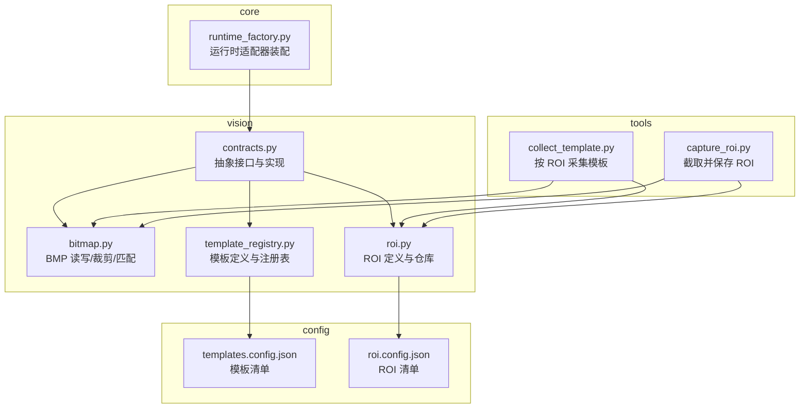
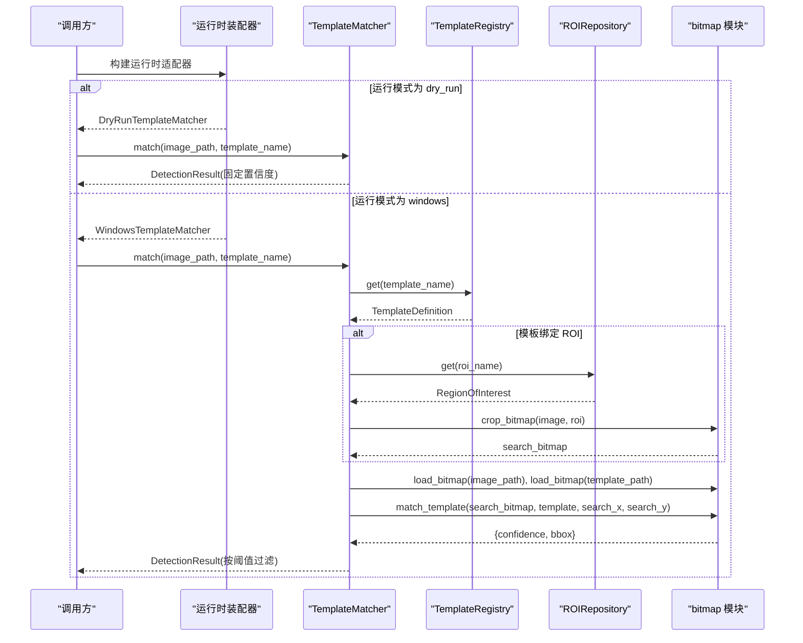
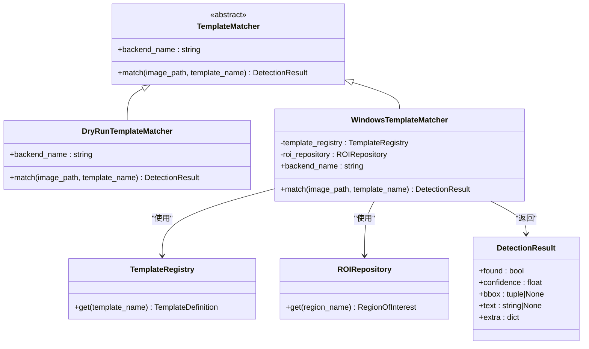
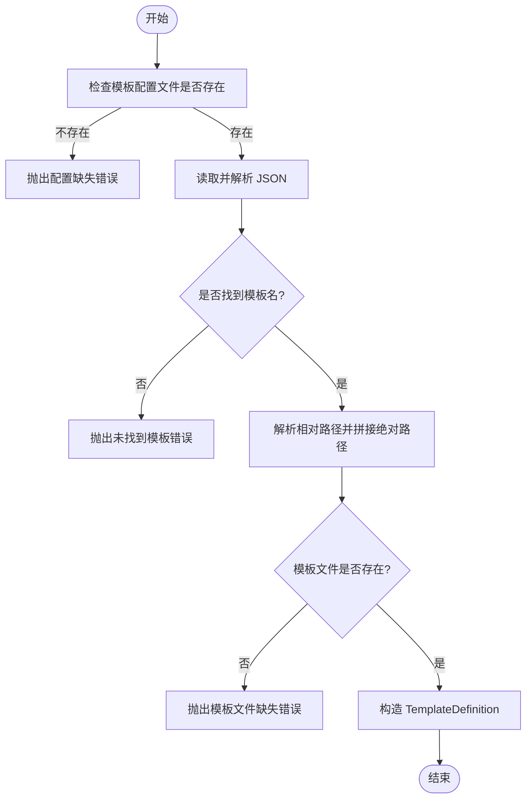
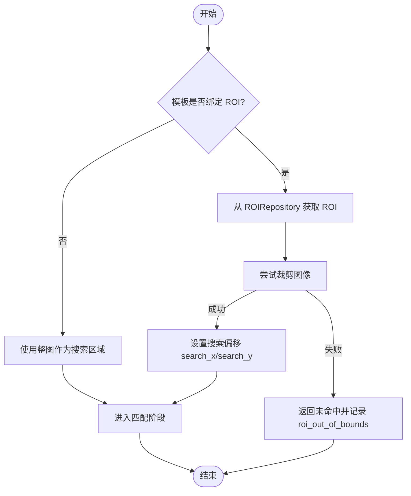
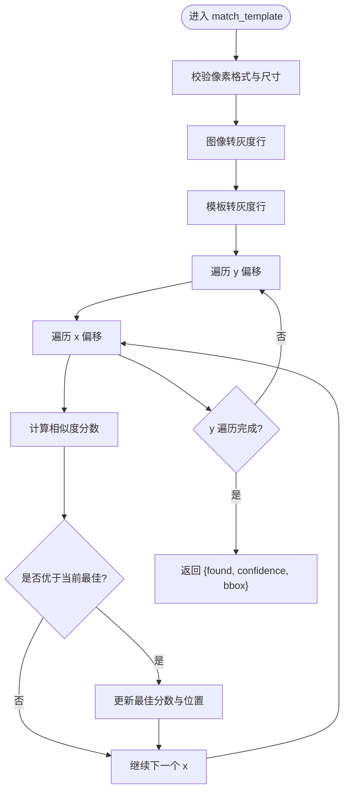
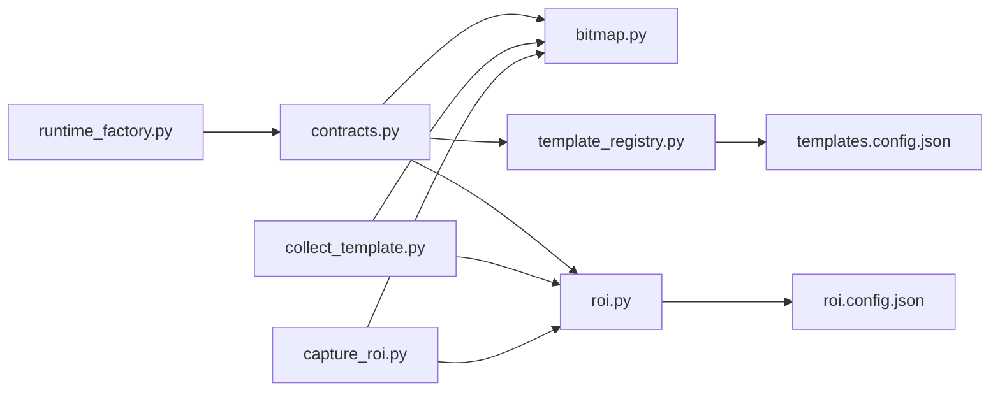

# 模板匹配算法

<cite>
**本文引用的文件**
- [src/vision/contracts.py](file://src/vision/contracts.py)
- [src/vision/bitmap.py](file://src/vision/bitmap.py)
- [src/vision/template_registry.py](file://src/vision/template_registry.py)
- [src/vision/roi.py](file://src/vision/roi.py)
- [src/core/runtime_factory.py](file://src/core/runtime_factory.py)
- [config/templates.config.json](file://config/templates.config.json)
- [config/roi.config.json](file://config/roi.config.json)
- [tools/collect_template.py](file://tools/collect_template.py)
- [tools/capture_roi.py](file://tools/capture_roi.py)
- [README.md](file://README.md)
</cite>

## 目录
1. [简介](#简介)
2. [项目结构](#项目结构)
3. [核心组件](#核心组件)
4. [架构总览](#架构总览)
5. [详细组件分析](#详细组件分析)
6. [依赖关系分析](#依赖关系分析)
7. [性能考虑](#性能考虑)
8. [故障排查指南](#故障排查指南)
9. [结论](#结论)
10. [附录](#附录)

## 简介
本技术文档围绕模板匹配子系统，系统化阐述抽象接口设计、两种实现差异、模板注册机制、ROI 的作用与坐标映射、相似度计算与阈值判断、结果过滤与数据结构设计，并提供配置示例、参数调优建议与常见问题解决方案。该子系统以纯 Python 实现，无第三方视觉库依赖，强调在固定分辨率和 ROI 约束下的高可维护性与可调试性。

## 项目结构
模板匹配相关代码主要分布在 vision 层（图像加载、裁剪、匹配、ROI、模板注册）与 core 层的运行时装配器中，并通过工具脚本完成 ROI 标定与模板采集。

图表来源
- [src/vision/contracts.py:36-185](file://src/vision/contracts.py#L36-L185)
- [src/vision/bitmap.py:17-200](file://src/vision/bitmap.py#L17-L200)
- [src/vision/template_registry.py:8-43](file://src/vision/template_registry.py#L8-L43)
- [src/vision/roi.py:8-68](file://src/vision/roi.py#L8-L68)
- [src/core/runtime_factory.py:30-77](file://src/core/runtime_factory.py#L30-L77)
- [config/templates.config.json:1-9](file://config/templates.config.json#L1-L9)
- [config/roi.config.json:1-31](file://config/roi.config.json#L1-L31)
- [tools/collect_template.py:15-37](file://tools/collect_template.py#L15-L37)
- [tools/capture_roi.py:15-37](file://tools/capture_roi.py#L15-L37)

章节来源
- [README.md:1-266](file://README.md#L1-L266)

## 核心组件
- 抽象接口与实现：TemplateMatcher、DryRunTemplateMatcher、WindowsTemplateMatcher
- 数据模型：DetectionResult、TemplateDefinition、RegionOfInterest
- 资源管理：TemplateRegistry、ROIRepository
- 图像处理：BitmapImage、load_bitmap、crop_bitmap、match_template
- 运行时装配：RuntimeAdapters、build_runtime_adapters

章节来源
- [src/vision/contracts.py:16-185](file://src/vision/contracts.py#L16-L185)
- [src/vision/template_registry.py:8-43](file://src/vision/template_registry.py#L8-L43)
- [src/vision/roi.py:8-68](file://src/vision/roi.py#L8-L68)
- [src/vision/bitmap.py:8-200](file://src/vision/bitmap.py#L8-L200)
- [src/core/runtime_factory.py:21-77](file://src/core/runtime_factory.py#L21-L77)

## 架构总览
下图展示了从调用方到具体实现的完整链路：运行时装配选择 DryRun 或 Windows 模式；Windows 模式下通过 TemplateRegistry 解析模板定义，结合 ROIRepository 进行区域裁剪，最终调用 bitmap.match_template 执行相似度扫描并返回 DetectionResult。

图表来源
- [src/core/runtime_factory.py:30-77](file://src/core/runtime_factory.py#L30-L77)
- [src/vision/contracts.py:119-185](file://src/vision/contracts.py#L119-L185)
- [src/vision/template_registry.py:17-43](file://src/vision/template_registry.py#L17-L43)
- [src/vision/roi.py:21-68](file://src/vision/roi.py#L21-L68)
- [src/vision/bitmap.py:17-200](file://src/vision/bitmap.py#L17-L200)

## 详细组件分析

### 抽象接口与实现差异：TemplateMatcher、DryRunTemplateMatcher、WindowsTemplateMatcher
- TemplateMatcher 定义了统一的后端名称与匹配方法签名，屏蔽平台差异。
- DryRunTemplateMatcher 用于开发调试，直接返回固定高置信度的检测结果，不访问真实图像。
- WindowsTemplateMatcher 负责真实环境下的匹配流程：
  - 通过 TemplateRegistry 获取模板定义（路径、阈值、描述、可选 ROI）。
  - 根据是否绑定 ROI 决定是否对截图进行裁剪，并记录搜索偏移以便后续坐标还原。
  - 调用底层 match_template 计算相似度，依据模板阈值生成 DetectionResult。

图表来源
- [src/vision/contracts.py:36-185](file://src/vision/contracts.py#L36-L185)
- [src/vision/template_registry.py:17-43](file://src/vision/template_registry.py#L17-L43)
- [src/vision/roi.py:21-68](file://src/vision/roi.py#L21-L68)

章节来源
- [src/vision/contracts.py:36-185](file://src/vision/contracts.py#L36-L185)

### 模板注册机制：TemplateRegistry 与模板配置
- TemplateDefinition 描述一个模板的名称、文件路径、关联的 ROI 名称、阈值与描述。
- TemplateRegistry 负责：
  - 校验配置文件存在与可读。
  - 按模板名查找定义，解析相对路径并拼接绝对路径。
  - 校验模板文件是否存在。
  - 将 JSON 配置转换为强类型对象，便于上层消费。
- 版本控制建议：
  - 将 templates.config.json 纳入版本管理，配合模板图片变更进行 diff。
  - 在 description 字段记录变更原因与版本号，便于追溯。
  - 对关键模板增加命名约定（如 v1_前缀），避免覆盖历史版本。

图表来源
- [src/vision/template_registry.py:17-43](file://src/vision/template_registry.py#L17-L43)

章节来源
- [src/vision/template_registry.py:8-43](file://src/vision/template_registry.py#L8-L43)
- [config/templates.config.json:1-9](file://config/templates.config.json#L1-L9)

### ROI 机制：区域裁剪、坐标映射与性能优化
- ROI 定义包含名称、左上角坐标、宽高与描述。
- ROIRepository 支持加载全部 ROI、按名称获取、以及持久化更新。
- 匹配流程中的 ROI 作用：
  - 仅对指定区域进行模板匹配，显著降低纯 Python 暴力扫描的计算量。
  - 若 ROI 越界，捕获异常并返回“未命中”的结果，附带错误信息，避免中断主流程。
  - 记录 search_x/search_y 偏移，使最终边界框坐标映射回原图坐标系。

图表来源
- [src/vision/roi.py:21-68](file://src/vision/roi.py#L21-L68)
- [src/vision/contracts.py:133-163](file://src/vision/contracts.py#L133-L163)
- [src/vision/bitmap.py:100-115](file://src/vision/bitmap.py#L100-L115)

章节来源
- [src/vision/roi.py:8-68](file://src/vision/roi.py#L8-L68)
- [src/vision/contracts.py:133-163](file://src/vision/contracts.py#L133-L163)
- [src/vision/bitmap.py:100-115](file://src/vision/bitmap.py#L100-L115)

### 核心算法：match_template 相似度计算、阈值判断与结果过滤
- 输入校验：像素格式必须一致；模板尺寸不得大于搜索图像。
- 灰度转换：将 BMP 行数据转为灰度矩阵，采用加权亮度近似，避免浮点开销。
- 滑动窗口匹配：遍历所有可能偏移位置，计算局部相似度，保留最高分。
- 相似度函数：基于平均像素差值归一化为 0~1 的分数，分数越高越相似。
- 结果过滤：由上层根据模板阈值决定 found 与 bbox 是否有效。

图表来源
- [src/vision/bitmap.py:118-200](file://src/vision/bitmap.py#L118-L200)

章节来源
- [src/vision/bitmap.py:118-200](file://src/vision/bitmap.py#L118-L200)

### DetectionResult 数据结构：置信度、边界框与额外信息
- found：是否命中，通常由 confidence 与模板阈值比较得出。
- confidence：相似度分数，范围 0~1，越大越相似。
- bbox：匹配到的矩形框 (x, y, w, h)，仅在命中时有效。
- text：文本标识，便于日志追踪。
- extra：扩展字段，存储模板路径、阈值、描述、ROI 名称及错误信息等，便于调试与审计。

章节来源
- [src/vision/contracts.py:16-23](file://src/vision/contracts.py#L16-L23)
- [src/vision/contracts.py:171-185](file://src/vision/contracts.py#L171-L185)

### 运行时装配：DryRun 与 Windows 模式的切换
- build_runtime_adapters 根据配置选择 DryRun 或 Windows 适配层。
- Windows 模式会注入 TemplateRegistry、ROIRepository、OCRProvider 等依赖。
- DryRun 模式提供占位实现，便于快速验证业务逻辑而不依赖真实截图与 OCR。

章节来源
- [src/core/runtime_factory.py:30-77](file://src/core/runtime_factory.py#L30-L77)

## 依赖关系分析
- contracts.py 依赖 bitmap、ocr、roi、template_registry、windows_api，形成视觉能力聚合层。
- runtime_factory.py 依赖 contracts 中的多种 Provider/Matcher，集中装配运行时。
- template_registry.py 与 roi.py 分别依赖 JSON 配置，解耦模板与 ROI 的定义与实现。
- tools 脚本复用 bitmap 与 roi 能力，形成“标定—采集—注册”的工具链闭环。

图表来源
- [src/core/runtime_factory.py:30-77](file://src/core/runtime_factory.py#L30-L77)
- [src/vision/contracts.py:1-185](file://src/vision/contracts.py#L1-L185)
- [src/vision/template_registry.py:17-43](file://src/vision/template_registry.py#L17-L43)
- [src/vision/roi.py:21-68](file://src/vision/roi.py#L21-L68)
- [config/templates.config.json:1-9](file://config/templates.config.json#L1-L9)
- [config/roi.config.json:1-31](file://config/roi.config.json#L1-L31)
- [tools/collect_template.py:15-37](file://tools/collect_template.py#L15-L37)
- [tools/capture_roi.py:15-37](file://tools/capture_roi.py#L15-L37)

章节来源
- [src/core/runtime_factory.py:30-77](file://src/core/runtime_factory.py#L30-L77)
- [src/vision/contracts.py:1-185](file://src/vision/contracts.py#L1-L185)

## 性能考虑
- ROI 优先：由于 match_template 为纯 Python 逐像素扫描，务必结合 ROI 缩小搜索区域，避免全图暴力匹配导致性能瓶颈。
- 模板尺寸控制：模板不宜过大，过大的模板会增加相似度计算次数。
- 灰度转换优化：已采用整数运算近似亮度，减少浮点开销。
- 批处理建议：如需批量匹配多个模板，可在同一张图上缓存灰度矩阵，减少重复转换。
- 超时与重试：上层应加入超时与重试策略，防止长时间卡死。

[本节为通用性能建议，不直接分析具体文件]

## 故障排查指南
- 配置缺失
  - 现象：模板配置不存在或未找到模板名。
  - 处理：检查 templates.config.json 路径与键名，确保模板文件存在。
  - 参考路径：[模板配置读取与校验:22-35](file://src/vision/template_registry.py#L22-L35)
- ROI 越界
  - 现象：ROI 超出图像边界，匹配直接返回未命中。
  - 处理：重新标定 ROI，确认分辨率与窗口缩放一致。
  - 参考路径：[ROI 越界处理:143-163](file://src/vision/contracts.py#L143-L163)
- 像素格式不一致
  - 现象：模板图与搜索图像像素格式不同。
  - 处理：统一使用 BMP 24/32 位未压缩格式，避免颜色通道差异。
  - 参考路径：[像素格式校验:124-127](file://src/vision/bitmap.py#L124-L127)
- 模板尺寸大于搜索图像
  - 现象：无法进行匹配。
  - 处理：调整模板尺寸或确保搜索图像足够大。
  - 参考路径：[尺寸校验:126-127](file://src/vision/bitmap.py#L126-L127)
- 低置信度误判
  - 现象：found 为真但实际未命中。
  - 处理：提高模板阈值，或引入多模板投票与二次校验。
  - 参考路径：[阈值判断与结果过滤:171-185](file://src/vision/contracts.py#L171-L185)

章节来源
- [src/vision/template_registry.py:22-35](file://src/vision/template_registry.py#L22-L35)
- [src/vision/contracts.py:143-185](file://src/vision/contracts.py#L143-L185)
- [src/vision/bitmap.py:124-127](file://src/vision/bitmap.py#L124-L127)

## 结论
该模板匹配子系统以清晰的抽象接口与模块化设计，实现了 DryRun 与 Windows 双模式的可插拔架构。通过 TemplateRegistry 与 ROIRepository 将模板与 ROI 的配置解耦，配合轻量化的纯 Python 匹配算法，满足固定环境下的高可维护性与可调试性需求。建议在工程实践中严格遵循 ROI 标定规范、模板版本管理与阈值调优流程，以确保识别稳定性与性能。

[本节为总结性内容，不直接分析具体文件]

## 附录

### 模板配置示例
- 模板清单：templates.config.json
  - 字段说明：path（模板相对路径）、roi（可选 ROI 名称）、threshold（匹配阈值）、description（描述）
  - 参考路径：[模板配置示例:1-9](file://config/templates.config.json#L1-L9)
- ROI 清单：roi.config.json
  - 字段说明：x、y、width、height、description
  - 参考路径：[ROI 配置示例:1-31](file://config/roi.config.json#L1-L31)

章节来源
- [config/templates.config.json:1-9](file://config/templates.config.json#L1-L9)
- [config/roi.config.json:1-31](file://config/roi.config.json#L1-L31)

### 匹配参数调优建议
- 阈值 threshold
  - 默认 0.95，可根据场景适当下调至 0.90~0.98，平衡召回与精度。
  - 建议通过离线样本集统计不同阈值的准确率与召回率曲线，选择拐点。
- ROI 大小与位置
  - ROI 应尽量覆盖稳定 UI 元素，避免动态特效区域。
  - 若出现频繁越界，需重新标定并确保分辨率与缩放一致。
- 模板质量
  - 模板应来自清晰、无噪点的截图，避免模糊或压缩失真。
  - 模板尺寸尽量小且特征明显，提升匹配速度与鲁棒性。

[本节为通用调优建议，不直接分析具体文件]

### 工具与调试方法
- 采集模板
  - 使用 collect_template.py 从截图中按 ROI 裁切并保存模板。
  - 参考路径：[模板采集工具:15-37](file://tools/collect_template.py#L15-L37)
- 截取 ROI
  - 使用 capture_roi.py 验证 ROI 裁剪效果，输出中间截图辅助定位问题。
  - 参考路径：[ROI 截取工具:15-37](file://tools/capture_roi.py#L15-L37)
- 运行时模式切换
  - 通过 runtime_factory 配置切换 DryRun 与 Windows 模式，便于逐步接入真实环境。
  - 参考路径：[运行时装配:30-77](file://src/core/runtime_factory.py#L30-L77)
- 日志与诊断
  - 利用 DetectionResult.extra 字段记录模板路径、阈值、ROI 名称与错误信息，便于回溯。
  - 参考路径：[结果扩展字段:171-185](file://src/vision/contracts.py#L171-L185)

章节来源
- [tools/collect_template.py:15-37](file://tools/collect_template.py#L15-L37)
- [tools/capture_roi.py:15-37](file://tools/capture_roi.py#L15-L37)
- [src/core/runtime_factory.py:30-77](file://src/core/runtime_factory.py#L30-L77)
- [src/vision/contracts.py:171-185](file://src/vision/contracts.py#L171-L185)