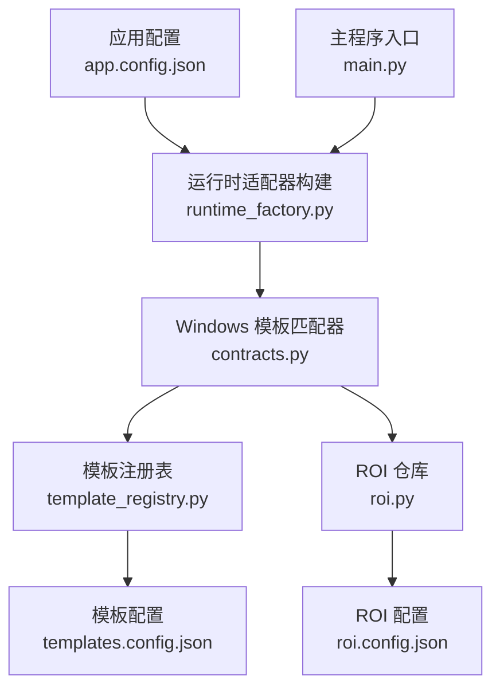
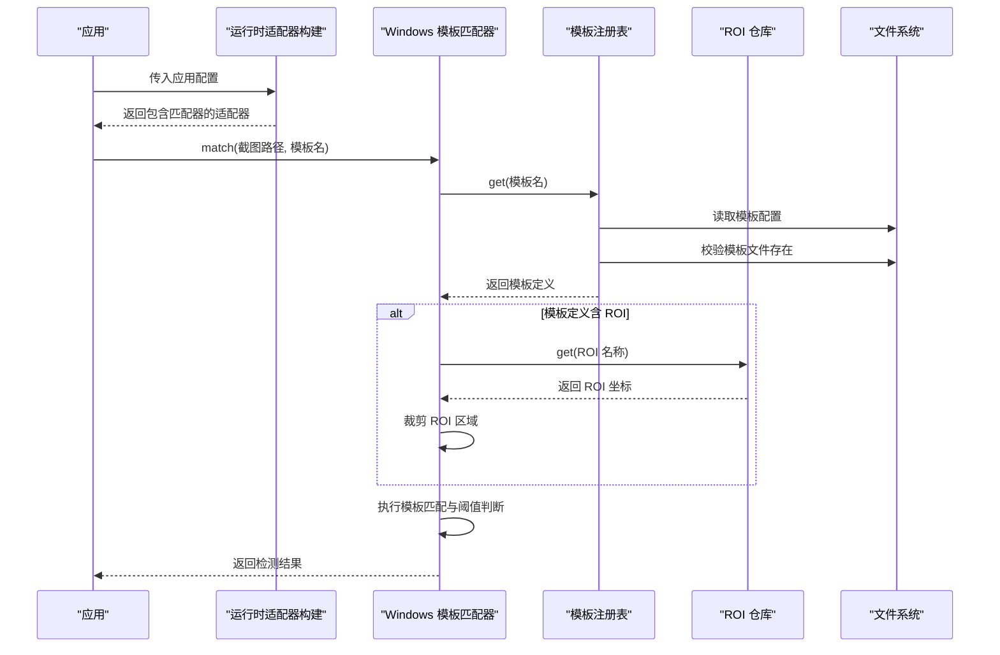
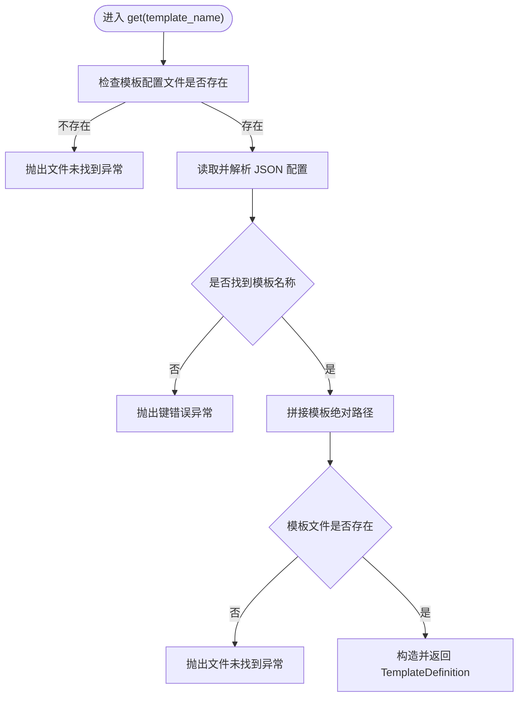
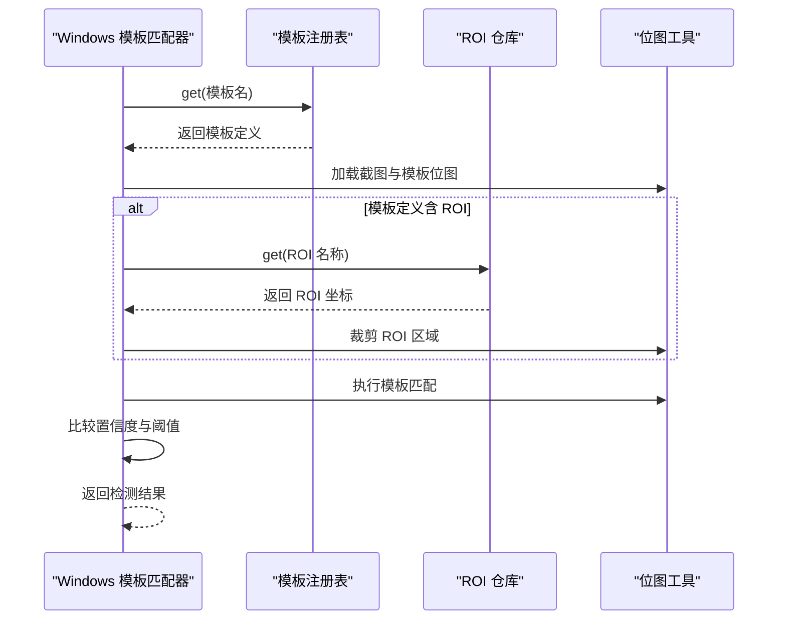
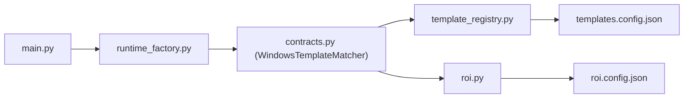

# 模板注册管理

<cite>
**本文引用的文件**
- [template_registry.py](file://src/vision/template_registry.py)
- [contracts.py](file://src/vision/contracts.py)
- [roi.py](file://src/vision/roi.py)
- [templates.config.json](file://config/templates.config.json)
- [roi.config.json](file://config/roi.config.json)
- [app.config.json](file://config/app.config.json)
- [runtime_factory.py](file://src/core/runtime_factory.py)
- [main.py](file://src/main.py)
</cite>

## 目录
1. [简介](#简介)
2. [项目结构](#项目结构)
3. [核心组件](#核心组件)
4. [架构总览](#架构总览)
5. [详细组件分析](#详细组件分析)
6. [依赖关系分析](#依赖关系分析)
7. [性能考量](#性能考量)
8. [故障排除指南](#故障排除指南)
9. [结论](#结论)
10. [附录：配置规范与最佳实践](#附录：配置规范与最佳实践)

## 简介
本技术文档聚焦于“模板注册管理系统”，围绕 TemplateRegistry 类的设计与使用，系统阐述模板文件的发现机制、配置解析流程、版本管理策略，以及模板定义结构 TemplateDefinition 的字段含义。同时说明模板加载的生命周期管理（缓存、热重载、错误处理），并提供模板配置的 JSON 格式规范、最佳实践示例、调试技巧与故障排除方法。

## 项目结构
本项目采用分层组织方式：
- 配置层：集中存放模板、ROI、应用运行参数等 JSON 配置。
- 视觉层：封装截图、模板匹配、OCR 及 ROI 管理。
- 核心层：运行时适配器的装配与调度。
- 入口：脚本启动与上下文初始化。

图表来源
- [app.config.json:1-23](file://config/app.config.json#L1-L23)
- [runtime_factory.py:30-64](file://src/core/runtime_factory.py#L30-L64)
- [contracts.py:119-185](file://src/vision/contracts.py#L119-L185)
- [template_registry.py:17-43](file://src/vision/template_registry.py#L17-L43)
- [roi.py:21-68](file://src/vision/roi.py#L21-L68)
- [templates.config.json:1-9](file://config/templates.config.json#L1-L9)
- [roi.config.json:1-31](file://config/roi.config.json#L1-L31)
- [main.py:22-50](file://src/main.py#L22-L50)

章节来源
- [app.config.json:1-23](file://config/app.config.json#L1-L23)
- [runtime_factory.py:30-64](file://src/core/runtime_factory.py#L30-L64)
- [main.py:22-50](file://src/main.py#L22-L50)

## 核心组件
- TemplateDefinition：描述单个模板的定义，包含名称、文件路径、阈值、描述和可选的 ROI 关联名。
- TemplateRegistry：负责根据模板名称从配置中解析并返回 TemplateDefinition，校验模板文件存在性。
- WindowsTemplateMatcher：基于 TemplateRegistry 与 ROIRepository 完成图像到模板的匹配，支持 ROI 裁剪与阈值判定。
- ROIRepository：加载、查询与持久化 ROI 区域配置。

章节来源
- [template_registry.py:8-43](file://src/vision/template_registry.py#L8-L43)
- [contracts.py:119-185](file://src/vision/contracts.py#L119-L185)
- [roi.py:8-68](file://src/vision/roi.py#L8-L68)

## 架构总览
模板匹配在运行时由适配器装配，调用模板注册表获取模板定义，再结合 ROI 配置进行裁剪匹配，最终返回检测结果。

图表来源
- [runtime_factory.py:30-64](file://src/core/runtime_factory.py#L30-L64)
- [contracts.py:119-185](file://src/vision/contracts.py#L119-L185)
- [template_registry.py:17-43](file://src/vision/template_registry.py#L17-L43)
- [roi.py:21-68](file://src/vision/roi.py#L21-L68)

## 详细组件分析

### TemplateDefinition 数据模型
- name：模板的唯一标识名称，用于配置键与匹配调用。
- file_path：模板图片的绝对路径，由模板根目录与配置中的相对路径拼接而成。
- roi_name：可选的 ROI 区域名称，若存在则仅在对应区域内匹配以提升性能与准确性。
- threshold：匹配阈值，只有置信度达到或超过该值才视为命中。
- description：模板描述信息，便于维护与排错。

章节来源
- [template_registry.py:8-14](file://src/vision/template_registry.py#L8-L14)

### TemplateRegistry 设计与实现
- 职责：根据模板名称从配置文件中解析模板定义，校验模板文件存在，并构造 TemplateDefinition。
- 配置解析流程：
  - 检查模板配置文件是否存在。
  - 读取并解析 JSON 配置。
  - 查找指定模板名称对应的条目。
  - 将配置中的相对路径与模板根目录拼接为绝对路径。
  - 校验模板文件是否存在。
  - 构造并返回 TemplateDefinition。
- 错误处理：
  - 配置文件缺失时抛出文件未找到异常。
  - 模板名称不存在时抛出键错误异常。
  - 模板文件不存在时抛出文件未找到异常。

图表来源
- [template_registry.py:17-43](file://src/vision/template_registry.py#L17-L43)

章节来源
- [template_registry.py:17-43](file://src/vision/template_registry.py#L17-L43)

### WindowsTemplateMatcher 匹配流程
- 职责：基于模板定义与 ROI 配置对截图进行模板匹配，返回检测结果。
- 关键步骤：
  - 通过 TemplateRegistry.get 获取模板定义。
  - 加载截图与模板位图。
  - 若模板定义包含 ROI，则通过 ROIRepository 获取坐标并裁剪搜索区域。
  - 执行模板匹配，计算置信度。
  - 依据模板定义的阈值决定是否命中，并返回 DetectionResult。
- 边界处理：
  - ROI 越界时返回不命中结果，附带错误信息以便诊断。

图表来源
- [contracts.py:119-185](file://src/vision/contracts.py#L119-L185)
- [template_registry.py:17-43](file://src/vision/template_registry.py#L17-L43)
- [roi.py:21-68](file://src/vision/roi.py#L21-L68)

章节来源
- [contracts.py:119-185](file://src/vision/contracts.py#L119-L185)

### ROIRepository 与 ROI 配置
- 职责：加载、查询与持久化 ROI 区域配置。
- 行为：
  - load_all：读取 ROI 配置并转换为 RegionOfInterest 对象集合。
  - get：按名称获取 ROI，不存在时抛出键错误。
  - upsert：更新或新增 ROI 并写回 JSON 文件，便于人工微调与版本比对。

章节来源
- [roi.py:8-68](file://src/vision/roi.py#L8-L68)

## 依赖关系分析
- 运行时装配：
  - main 启动后读取应用配置，调用运行时适配器构建函数。
  - 构建函数根据运行模式选择真实或干跑适配层，并在 Windows 模式下注入模板根目录、模板配置路径与 ROI 配置路径。
- 模块耦合：
  - WindowsTemplateMatcher 依赖 TemplateRegistry 与 ROIRepository。
  - TemplateRegistry 依赖模板配置文件与模板文件。
  - ROIRepository 依赖 ROI 配置文件。

图表来源
- [main.py:22-50](file://src/main.py#L22-L50)
- [runtime_factory.py:30-64](file://src/core/runtime_factory.py#L30-L64)
- [contracts.py:119-185](file://src/vision/contracts.py#L119-L185)
- [template_registry.py:17-43](file://src/vision/template_registry.py#L17-L43)
- [roi.py:21-68](file://src/vision/roi.py#L21-L68)

章节来源
- [main.py:22-50](file://src/main.py#L22-L50)
- [runtime_factory.py:30-64](file://src/core/runtime_factory.py#L30-L64)

## 性能考量
- ROI 裁剪提升匹配效率：当模板绑定 ROI 时，仅在该区域内进行匹配，避免在大图上全图扫描导致的性能问题。
- 阈值控制减少误报：通过模板定义的阈值过滤低置信度结果，提高稳定性。
- 配置与资源分离：模板根目录与配置文件分离，便于批量管理与版本控制。
- 建议优化方向：
  - 引入模板定义缓存以减少重复解析开销。
  - 对 ROI 配置变更进行增量更新与校验。
  - 对大尺寸截图进行预处理（如缩放、灰度化）以降低内存与计算压力。

[本节提供通用指导，无需特定文件引用]

## 故障排除指南
- 常见错误与定位：
  - 模板配置文件不存在：检查应用配置中的模板配置路径是否正确。
  - 模板名称未找到：确认模板配置中存在该名称的条目。
  - 模板文件不存在：检查模板根目录与相对路径拼接后的绝对路径是否正确。
  - ROI 越界：通常由于标定与当前分辨率不一致导致，需重新标定 ROI。
- 调试技巧：
  - 启用 OCR 调试输出，查看原始、灰度与二值化图像路径，辅助定位识别问题。
  - 记录匹配过程中的模板路径、阈值、描述与 ROI 名称，便于回溯。
  - 使用干跑模式验证链路，逐步替换为真实平台适配层。
- 恢复策略：
  - 遇到未知状态或连续失败时优先停机，避免无限重试与误操作。
  - 对 ROI 配置进行人工微调并持久化，确保后续运行稳定。

章节来源
- [template_registry.py:22-43](file://src/vision/template_registry.py#L22-L43)
- [contracts.py:133-185](file://src/vision/contracts.py#L133-L185)
- [roi.py:42-68](file://src/vision/roi.py#L42-L68)

## 结论
模板注册管理系统以 TemplateRegistry 为核心，配合 ROIRepository 与 WindowsTemplateMatcher，实现了可配置、可扩展且具备良好错误处理的模板匹配能力。通过清晰的配置结构与生命周期管理，系统在固定环境下具备较高的稳定性与可维护性。未来可通过缓存、热重载与更严格的配置校验进一步提升性能与健壮性。

[本节总结内容，无需特定文件引用]

## 附录：配置规范与最佳实践

### 模板配置 JSON 规范
- 必需字段：
  - path：模板图片相对路径，相对于模板根目录。
  - roi：可选的 ROI 名称，需在 ROI 配置中存在。
- 可选字段：
  - threshold：匹配阈值，默认值为 0.95。
  - description：模板描述信息，便于维护。
- 验证规则：
  - 模板配置文件必须存在且可解析。
  - 模板名称必须在配置中存在。
  - 模板文件路径拼接后必须存在。
  - ROI 名称若在模板配置中出现，必须在 ROI 配置中存在。

章节来源
- [templates.config.json:1-9](file://config/templates.config.json#L1-L9)
- [roi.config.json:1-31](file://config/roi.config.json#L1-L31)
- [template_registry.py:22-43](file://src/vision/template_registry.py#L22-L43)

### 命名约定与目录结构
- 命名约定：
  - 模板名称建议使用小写下划线分隔，语义清晰，例如 hideout_anchor。
  - ROI 名称应与模板名称或业务场景相关，便于理解与维护。
- 目录结构：
  - 模板根目录：assets/templates，可按 UI、地图等子目录组织。
  - 配置文件：config 目录下分别存放模板、ROI 与应用配置。
- 组织方式：
  - 每个模板一个独立图片文件，避免多模板混放。
  - ROI 配置集中管理，按区域功能分组。

章节来源
- [app.config.json:13-15](file://config/app.config.json#L13-L15)
- [templates.config.json:1-9](file://config/templates.config.json#L1-L9)
- [roi.config.json:1-31](file://config/roi.config.json#L1-L31)

### 模板加载生命周期管理
- 缓存机制：
  - 当前实现每次 get 都会读取并解析配置文件，建议在高频调用场景引入内存缓存。
- 热重载支持：
  - 可在配置变更时触发重新加载，注意并发安全与原子更新。
- 错误处理策略：
  - 配置文件缺失、模板名称不存在、模板文件不存在均抛出明确异常。
  - ROI 越界时返回不命中结果并附带错误信息，便于上层处理。

章节来源
- [template_registry.py:22-43](file://src/vision/template_registry.py#L22-L43)
- [contracts.py:133-185](file://src/vision/contracts.py#L133-L185)