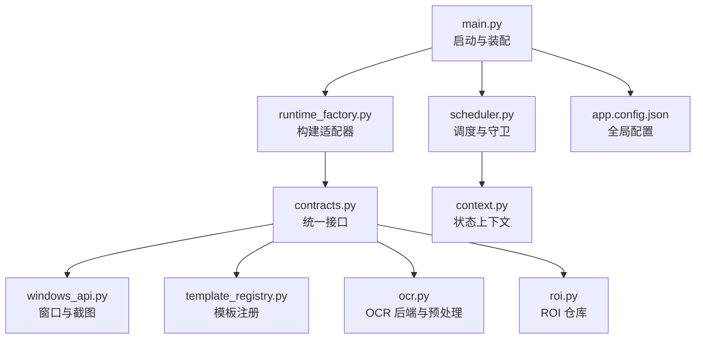
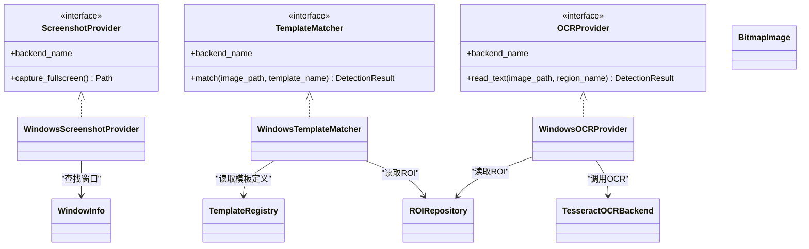
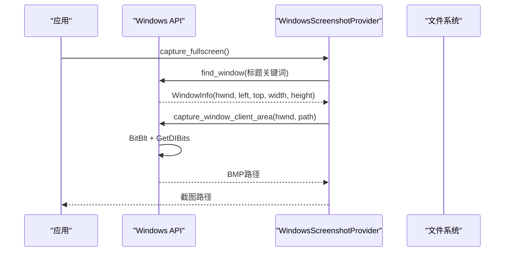
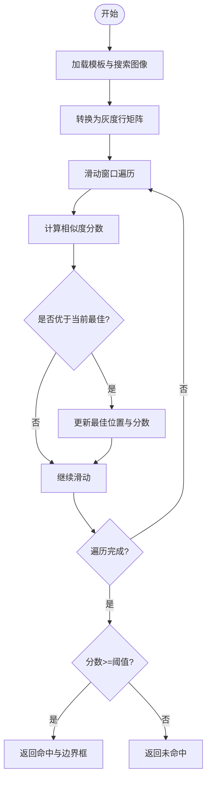
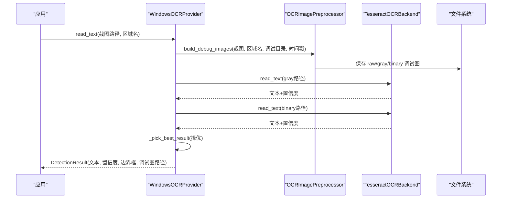
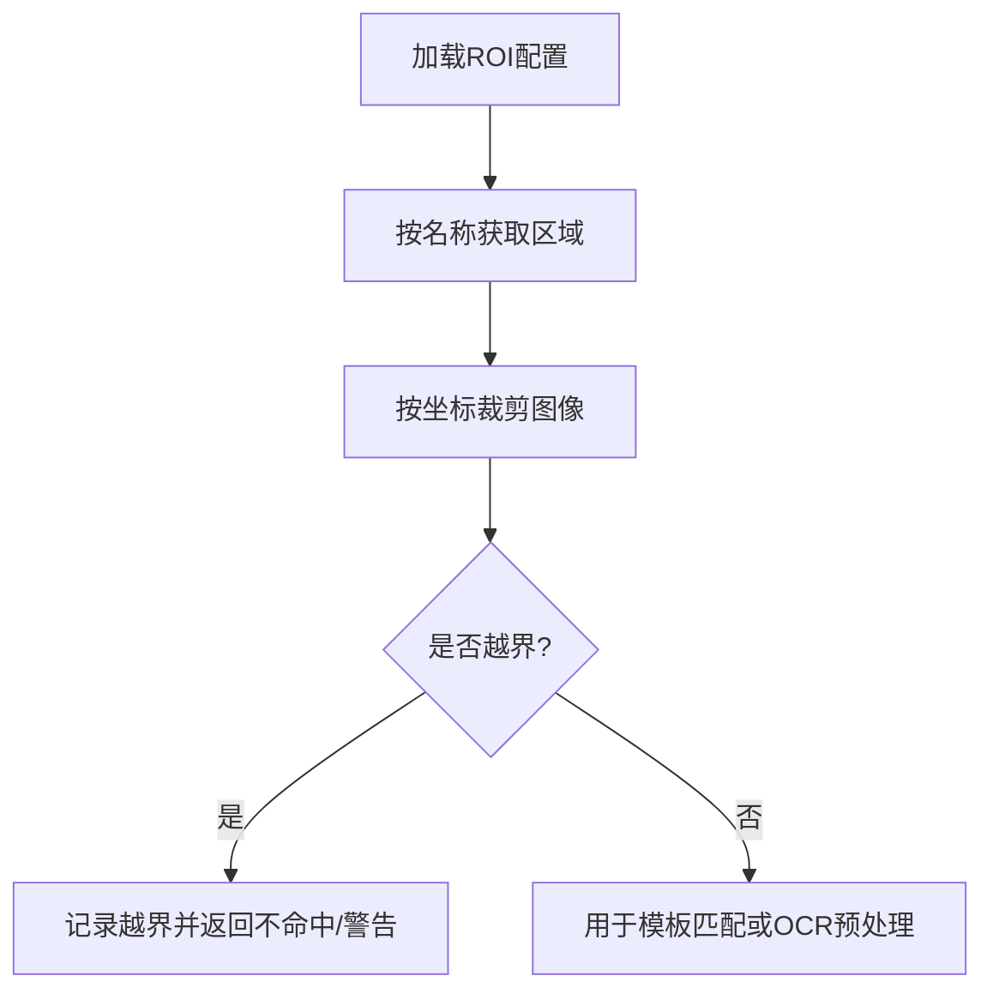
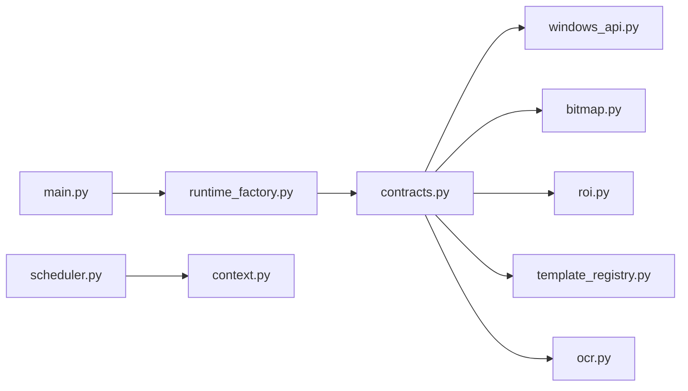

# 视觉处理系统

<cite>
**本文引用的文件**
- [src/main.py](file://src/main.py)
- [config/app.config.json](file://config/app.config.json)
- [config/resolution.config.json](file://config/resolution.config.json)
- [config/templates.config.json](file://config/templates.config.json)
- [config/roi.config.json](file://config/roi.config.json)
- [src/vision/bitmap.py](file://src/vision/bitmap.py)
- [src/vision/ocr.py](file://src/vision/ocr.py)
- [src/vision/roi.py](file://src/vision/roi.py)
- [src/vision/template_registry.py](file://src/vision/template_registry.py)
- [src/vision/contracts.py](file://src/vision/contracts.py)
- [src/utils/windows_api.py](file://src/utils/windows_api.py)
- [src/core/context.py](file://src/core/context.py)
- [src/core/runtime_factory.py](file://src/core/runtime_factory.py)
- [src/core/scheduler.py](file://src/core/scheduler.py)
- [tools/capture_roi.py](file://tools/capture_roi.py)
- [tools/collect_template.py](file://tools/collect_template.py)
- [tools/test_ocr.py](file://tools/test_ocr.py)
</cite>

## 目录
1. [简介](#简介)
2. [项目结构](#项目结构)
3. [核心组件](#核心组件)
4. [架构总览](#架构总览)
5. [详细组件分析](#详细组件分析)
6. [依赖关系分析](#依赖关系分析)
7. [性能考虑](#性能考虑)
8. [故障排查指南](#故障排查指南)
9. [结论](#结论)
10. [附录：配置与调试示例](#附录配置与调试示例)

## 简介
本技术文档面向视觉处理子系统，围绕截图捕获、模板匹配、OCR 文字识别、ROI（感兴趣区域）管理以及位图处理工具展开，给出从原理到实现、从配置到排错的完整说明。系统以 Windows 平台为主，通过窗口句柄获取客户区画面，结合 ROI 裁剪与模板匹配进行 UI 元素定位；同时集成 Tesseract OCR，对关键文本进行识别并输出置信度与调试图像。整体采用适配器模式将截图、模板匹配、OCR 和输入控制抽象为统一接口，便于在 DryRun 与真实 Windows 环境之间切换。

## 项目结构
- 入口与装配
  - 主程序负责加载应用配置、构建运行时适配层、创建调度器并启动主循环。
- 视觉能力
  - 位图读写与基础图像处理（灰度化、二值化、缩放、裁剪）。
  - 模板注册与匹配（基于 ROI 的局部搜索）。
  - OCR 预处理与 Tesseract 调用（灰度/二值双路识别择优）。
  - ROI 仓库（JSON 配置驱动的区域定义与持久化）。
- 平台适配
  - Windows API 封装：窗口枚举、客户区截图、鼠标键盘输入。
  - 契约与适配器：统一 ScreenshotProvider、TemplateMatcher、OCRProvider 接口，提供 DryRun 与 Windows 两套实现。
- 运行编排
  - 状态机与守卫：超时与重试保护，保障流程安全。
  - 工具脚本：ROI 标定、模板采集、OCR 测试等辅助工具。

图表来源
- [src/main.py:22-50](file://src/main.py#L22-L50)
- [src/core/runtime_factory.py:30-77](file://src/core/runtime_factory.py#L30-L77)
- [src/vision/contracts.py:25-55](file://src/vision/contracts.py#L25-L55)
- [src/utils/windows_api.py:121-196](file://src/utils/windows_api.py#L121-L196)
- [src/vision/template_registry.py:17-44](file://src/vision/template_registry.py#L17-L44)
- [src/vision/ocr.py:23-70](file://src/vision/ocr.py#L23-L70)
- [src/vision/roi.py:21-68](file://src/vision/roi.py#L21-L68)
- [src/core/scheduler.py:13-47](file://src/core/scheduler.py#L13-L47)
- [src/core/context.py:10-62](file://src/core/context.py#L10-L62)
- [config/app.config.json:1-23](file://config/app.config.json#L1-L23)

章节来源
- [src/main.py:22-50](file://src/main.py#L22-L50)
- [config/app.config.json:1-23](file://config/app.config.json#L1-L23)
- [config/resolution.config.json:1-8](file://config/resolution.config.json#L1-L8)

## 核心组件
- 截图捕获
  - 通过 Windows API 枚举可见窗口，按标题关键词匹配目标窗口，获取客户区坐标后使用 BitBlt + GetDIBits 抓取像素数据，写入 BMP。
- 模板匹配
  - 读取模板与搜索图像的 BMP，转换为灰度行矩阵，逐像素计算相似度，返回最佳位置与置信度；支持绑定 ROI 缩小搜索范围。
- OCR 识别
  - 基于 ROI 裁切原始截图，生成灰度图与二值图，分别调用 Tesseract 解析 TSV 输出，合并结果并选择最优文本与置信度。
- ROI 管理
  - JSON 配置文件维护区域名称、坐标与尺寸；提供加载、查询与更新能力，供模板匹配与 OCR 预处理复用。
- 位图工具
  - 提供 BMP 读写、ROI 裁剪、灰度化、二值化、缩放等基础操作，支撑上层视觉算法。

章节来源
- [src/utils/windows_api.py:228-313](file://src/utils/windows_api.py#L228-L313)
- [src/vision/bitmap.py:17-60](file://src/vision/bitmap.py#L17-L60)
- [src/vision/bitmap.py:118-165](file://src/vision/bitmap.py#L118-L165)
- [src/vision/ocr.py:73-107](file://src/vision/ocr.py#L73-L107)
- [src/vision/roi.py:21-68](file://src/vision/roi.py#L21-L68)
- [src/vision/bitmap.py:100-115](file://src/vision/bitmap.py#L100-L115)

## 架构总览
系统以适配器模式解耦平台细节，对外暴露统一的截图、模板匹配、OCR 接口；内部由位图与 ROI 提供通用图像处理能力，Windows API 提供底层截图与输入能力；调度器基于状态机驱动业务流程，并通过守卫机制保证超时与重试安全。

图表来源
- [src/vision/contracts.py:25-55](file://src/vision/contracts.py#L25-L55)
- [src/vision/contracts.py:101-185](file://src/vision/contracts.py#L101-L185)
- [src/vision/contracts.py:188-251](file://src/vision/contracts.py#L188-L251)
- [src/vision/template_registry.py:17-44](file://src/vision/template_registry.py#L17-L44)
- [src/vision/roi.py:21-68](file://src/vision/roi.py#L21-L68)
- [src/vision/ocr.py:23-70](file://src/vision/ocr.py#L23-L70)
- [src/utils/windows_api.py:107-196](file://src/utils/windows_api.py#L107-L196)

## 详细组件分析

### 截图捕获机制
- 窗口句柄获取
  - 遍历可见窗口，过滤标题包含关键词的窗口，若未命中则回退到前台窗口；失败时抛出明确错误信息。
- 屏幕区域截取
  - 获取窗口客户区矩形，使用 BitBlt 拷贝到内存 DC，再通过 GetDIBits 提取像素数据，最后写入 BMP。
- 图像格式转换
  - 截取的像素数据为 32 位位图，保存为标准 BMP 头与像素数据；后续位图模块统一按自顶向下顺序处理，避免坐标倒置问题。

图表来源
- [src/vision/contracts.py:101-117](file://src/vision/contracts.py#L101-L117)
- [src/utils/windows_api.py:121-196](file://src/utils/windows_api.py#L121-L196)
- [src/utils/windows_api.py:228-313](file://src/utils/windows_api.py#L228-L313)

章节来源
- [src/utils/windows_api.py:121-196](file://src/utils/windows_api.py#L121-L196)
- [src/utils/windows_api.py:228-313](file://src/utils/windows_api.py#L228-L313)
- [src/vision/contracts.py:101-117](file://src/vision/contracts.py#L101-L117)

### 模板匹配算法
- 模板注册
  - 通过模板配置文件声明模板名称、相对路径、绑定的 ROI 名称、阈值与描述；运行时根据根目录拼接绝对路径并校验存在性。
- 相似度计算
  - 将模板与搜索图像转为灰度行矩阵，滑动窗口逐像素计算平均差，归一化为 0~1 的相似度分数。
- 结果过滤
  - 仅当相似度达到模板配置的阈值时才认为匹配成功，否则返回不命中；ROI 越界时返回明确的错误标记而非抛异常。

图表来源
- [src/vision/bitmap.py:118-165](file://src/vision/bitmap.py#L118-L165)
- [src/vision/bitmap.py:168-201](file://src/vision/bitmap.py#L168-L201)
- [src/vision/template_registry.py:17-44](file://src/vision/template_registry.py#L17-L44)
- [src/vision/contracts.py:119-185](file://src/vision/contracts.py#L119-L185)

章节来源
- [src/vision/template_registry.py:17-44](file://src/vision/template_registry.py#L17-L44)
- [src/vision/bitmap.py:118-165](file://src/vision/bitmap.py#L118-L165)
- [src/vision/bitmap.py:168-201](file://src/vision/bitmap.py#L168-L201)
- [src/vision/contracts.py:119-185](file://src/vision/contracts.py#L119-L185)

### OCR 文字识别集成
- Tesseract 引擎配置
  - 可配置命令路径、语言与 PSM 模式；执行前检查可执行文件是否存在，失败时抛出明确错误。
- 预处理优化
  - 基于 ROI 裁切原始截图，生成灰度图与二值图；灰度图进行对比度归一化，二值图使用 Otsu 自动阈值并自适应反色策略。
- 结果后处理
  - 解析 TSV 输出，按页/块/段落/行组织文本，计算平均置信度；对灰度与二值两路结果择优选取。

图表来源
- [src/vision/ocr.py:73-107](file://src/vision/ocr.py#L73-L107)
- [src/vision/ocr.py:23-70](file://src/vision/ocr.py#L23-L70)
- [src/vision/ocr.py:110-141](file://src/vision/ocr.py#L110-L141)
- [src/vision/ocr.py:144-177](file://src/vision/ocr.py#L144-L177)
- [src/vision/ocr.py:179-201](file://src/vision/ocr.py#L179-L201)
- [src/vision/ocr.py:203-280](file://src/vision/ocr.py#L203-L280)
- [src/vision/contracts.py:188-251](file://src/vision/contracts.py#L188-L251)

章节来源
- [src/vision/ocr.py:23-70](file://src/vision/ocr.py#L23-L70)
- [src/vision/ocr.py:73-107](file://src/vision/ocr.py#L73-L107)
- [src/vision/ocr.py:110-141](file://src/vision/ocr.py#L110-L141)
- [src/vision/ocr.py:144-177](file://src/vision/ocr.py#L144-L177)
- [src/vision/ocr.py:179-201](file://src/vision/ocr.py#L179-L201)
- [src/vision/ocr.py:203-280](file://src/vision/ocr.py#L203-L280)
- [src/vision/contracts.py:188-251](file://src/vision/contracts.py#L188-L251)

### ROI（感兴趣区域）管理系统
- 区域定义
  - 通过 JSON 配置定义区域名称、左上角坐标、宽高与描述；支持单元测试与调试用的小区域。
- 坐标映射
  - 模板匹配与 OCR 均基于 ROI 坐标裁剪图像，确保搜索范围与识别区域一致；越界时返回不命中或警告。
- 性能优化
  - 模板匹配仅在 ROI 范围内滑动扫描，避免整图暴力匹配带来的性能问题；ROI 越小，匹配越快。

图表来源
- [src/vision/roi.py:21-68](file://src/vision/roi.py#L21-L68)
- [src/vision/bitmap.py:100-115](file://src/vision/bitmap.py#L100-L115)
- [src/vision/contracts.py:133-185](file://src/vision/contracts.py#L133-L185)

章节来源
- [config/roi.config.json:1-31](file://config/roi.config.json#L1-L31)
- [src/vision/roi.py:21-68](file://src/vision/roi.py#L21-L68)
- [src/vision/bitmap.py:100-115](file://src/vision/bitmap.py#L100-L115)
- [src/vision/contracts.py:133-185](file://src/vision/contracts.py#L133-L185)

### 位图处理工具
- 图像缩放
  - 按整数倍放大像素行列，提升 OCR 识别效果；默认放大倍数可调。
- 颜色调整
  - 灰度化使用加权公式近似亮度；二值化使用 Otsu 自动阈值并自适应反色策略。
- 格式转换
  - 支持 BMP 读写与 ROI 裁剪；所有位图统一为自顶向下的行序，避免坐标倒置。

章节来源
- [src/vision/bitmap.py:17-60](file://src/vision/bitmap.py#L17-L60)
- [src/vision/bitmap.py:100-115](file://src/vision/bitmap.py#L100-L115)
- [src/vision/ocr.py:144-177](file://src/vision/ocr.py#L144-L177)
- [src/vision/ocr.py:179-201](file://src/vision/ocr.py#L179-L201)
- [src/vision/ocr.py:203-280](file://src/vision/ocr.py#L203-L280)

## 依赖关系分析
- 模块耦合
  - contracts 层定义统一接口，具体实现依赖 windows_api、bitmap、roi、template_registry、ocr。
  - runtime_factory 根据配置装配具体实现，屏蔽平台差异。
  - scheduler 与 context 驱动业务流程，依赖 validator 与 recovery_manager。
- 外部依赖
  - Windows API（user32、gdi32）用于窗口枚举、截图与输入。
  - Tesseract 可执行文件用于 OCR 识别。

图表来源
- [src/vision/contracts.py:25-55](file://src/vision/contracts.py#L25-L55)
- [src/core/runtime_factory.py:30-77](file://src/core/runtime_factory.py#L30-L77)
- [src/main.py:22-50](file://src/main.py#L22-L50)
- [src/core/scheduler.py:13-47](file://src/core/scheduler.py#L13-L47)
- [src/core/context.py:10-62](file://src/core/context.py#L10-L62)

章节来源
- [src/vision/contracts.py:25-55](file://src/vision/contracts.py#L25-L55)
- [src/core/runtime_factory.py:30-77](file://src/core/runtime_factory.py#L30-L77)
- [src/main.py:22-50](file://src/main.py#L22-L50)
- [src/core/scheduler.py:13-47](file://src/core/scheduler.py#L13-L47)
- [src/core/context.py:10-62](file://src/core/context.py#L10-L62)

## 性能考虑
- 模板匹配复杂度
  - 纯 Python 逐像素比较，时间复杂度约为 O(W×H×w×h)，其中 W×H 为搜索图尺寸，w×h 为模板尺寸；务必配合 ROI 缩小搜索范围。
- 截图与 IO
  - 频繁截图会产生大量 IO 开销；建议批量处理或降低频率，并结合 ROI 减少后续处理量。
- OCR 预处理
  - 灰度归一化与 Otsu 阈值计算为线性复杂度；放大倍数过高会增加内存与计算压力，需权衡识别率与性能。
- 资源释放
  - Windows API 使用的 DC、对象需在 finally 中释放，避免内存泄漏。

[本节为通用性能指导，不直接分析具体文件]

## 故障排查指南
- 截图黑屏或错位
  - 检查窗口标题关键词是否正确，确认目标窗口可见且客户区尺寸有效；查看截图保存路径与分辨率配置是否一致。
- 模板匹配失败
  - 确认模板文件存在且与搜索图像像素格式一致；检查 ROI 配置是否与当前分辨率匹配；适当调低阈值或重新采集模板。
- OCR 识别率低
  - 检查 Tesseract 安装与语言包；调整 PSM 模式与语言；观察灰度与二值调试图，必要时调整 ROI 或放大倍数。
- ROI 越界
  - 打印图像尺寸与 ROI 坐标，确保 ROI 不超出图像边界；若分辨率变化，需重新标定 ROI。
- 输入失效
  - 确认窗口已激活且坐标已转换到屏幕坐标；检查按键映射是否支持。

章节来源
- [src/utils/windows_api.py:121-196](file://src/utils/windows_api.py#L121-L196)
- [src/utils/windows_api.py:228-313](file://src/utils/windows_api.py#L228-L313)
- [src/vision/contracts.py:133-185](file://src/vision/contracts.py#L133-L185)
- [src/vision/ocr.py:23-70](file://src/vision/ocr.py#L23-L70)
- [src/vision/ocr.py:110-141](file://src/vision/ocr.py#L110-L141)
- [src/vision/roi.py:21-68](file://src/vision/roi.py#L21-L68)

## 结论
该视觉处理系统以清晰的适配器分层与模块化设计，实现了稳定的截图捕获、高效的模板匹配与可靠的 OCR 识别。通过 ROI 管理与位图工具链，系统在固定环境下具备高可用性与易扩展性。建议在后续迭代中持续完善模板库与 ROI 标定流程，结合性能监控与日志分析，逐步提升识别成功率与运行稳定性。

[本节为总结性内容，不直接分析具体文件]

## 附录：配置与调试示例
- 应用配置要点
  - 运行模式、截图与调试目录、窗口标题关键词、OCR 语言与 PSM、模板根目录与配置文件路径、平台验证阈值等。
- 分辨率与环境
  - 固定分辨率、窗口模式、UI 缩放与语言，确保截图与 ROI 一致性。
- 模板配置
  - 为每个模板指定路径、绑定的 ROI、阈值与描述，便于统一管理。
- ROI 配置
  - 为不同场景定义 ROI，如调试标签、藏身处锚点、地图装置面板等，便于快速标定与复用。
- 工具脚本用法
  - 从截图裁切 ROI 并保存为新 BMP。
  - 从截图按 ROI 采集模板并保存到模板目录。
  - 独立 OCR 测试：截图 → ROI 裁切 → 预处理 → Tesseract 识别，输出文本、置信度与调试图路径。

章节来源
- [config/app.config.json:1-23](file://config/app.config.json#L1-L23)
- [config/resolution.config.json:1-8](file://config/resolution.config.json#L1-L8)
- [config/templates.config.json:1-9](file://config/templates.config.json#L1-L9)
- [config/roi.config.json:1-31](file://config/roi.config.json#L1-L31)
- [tools/capture_roi.py:15-37](file://tools/capture_roi.py#L15-L37)
- [tools/collect_template.py:15-37](file://tools/collect_template.py#L15-L37)
- [tools/test_ocr.py:26-181](file://tools/test_ocr.py#L26-L181)