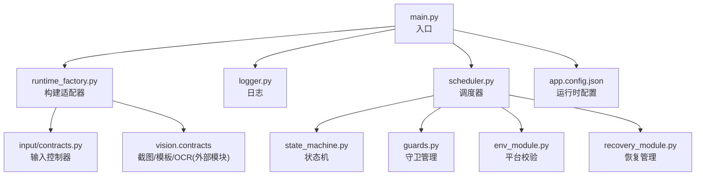
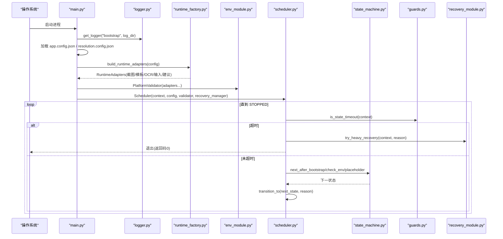
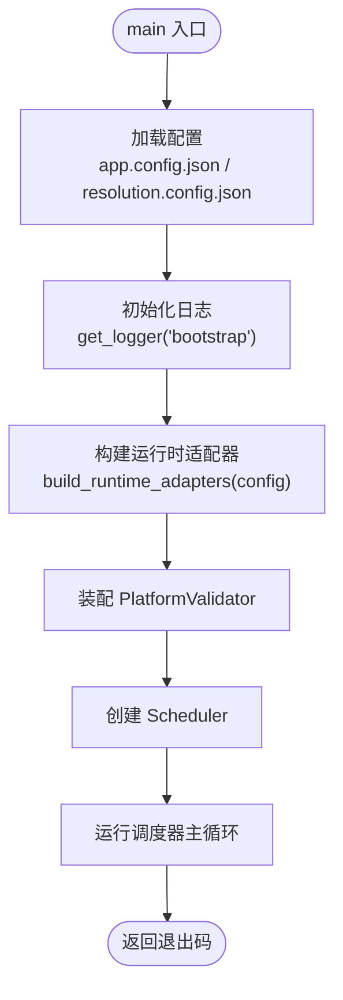
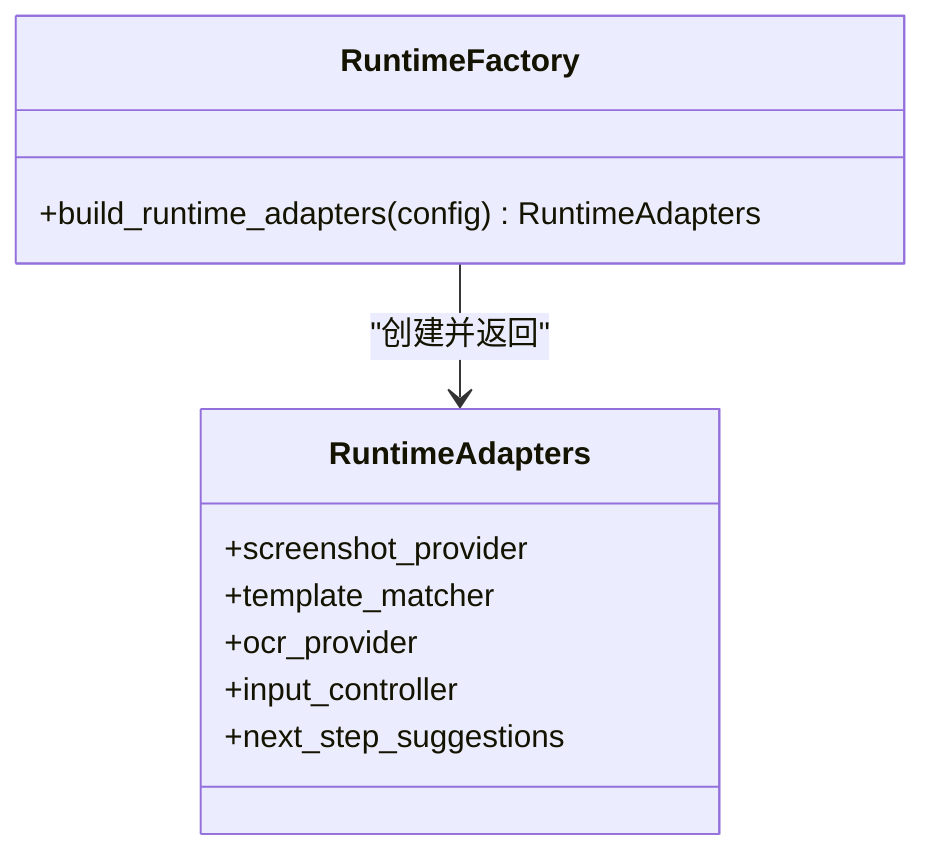
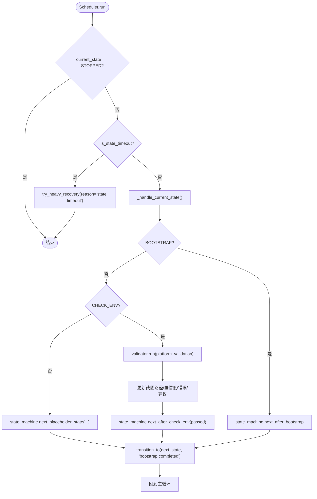
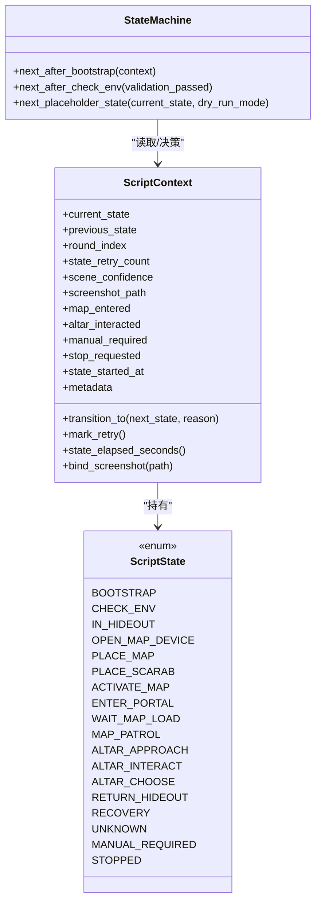
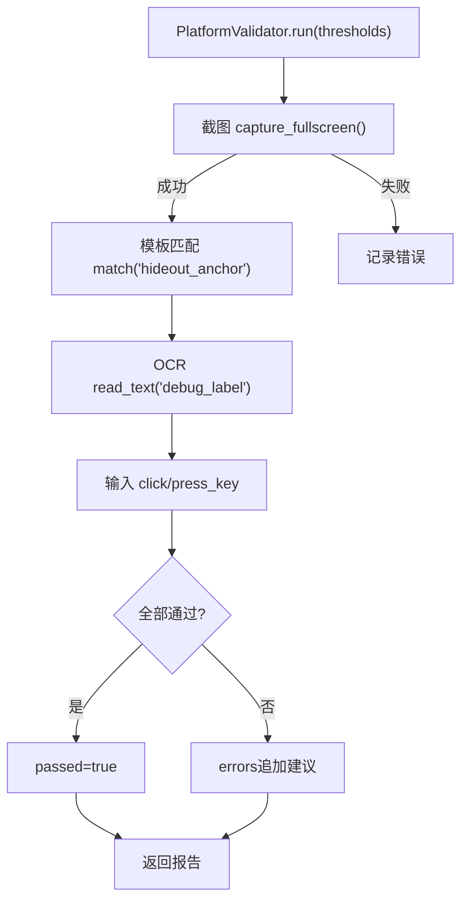
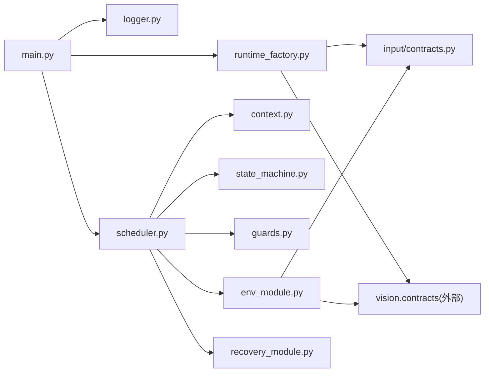

# 应用启动

<cite>
**本文引用的文件**
- [src/main.py](file://src/main.py)
- [src/core/runtime_factory.py](file://src/core/runtime_factory.py)
- [src/core/scheduler.py](file://src/core/scheduler.py)
- [src/utils/logger.py](file://src/utils/logger.py)
- [config/app.config.json](file://config/app.config.json)
- [src/core/context.py](file://src/core/context.py)
- [src/core/state_machine.py](file://src/core/state_machine.py)
- [src/core/guards.py](file://src/core/guards.py)
- [src/modules/env_module.py](file://src/modules/env_module.py)
- [src/modules/recovery_module.py](file://src/modules/recovery_module.py)
- [src/input/contracts.py](file://src/input/contracts.py)
- [config/templates.config.json](file://config/templates.config.json)
- [config/roi.config.json](file://config/roi.config.json)
</cite>

## 目录
1. [简介](#简介)
2. [项目结构](#项目结构)
3. [核心组件](#核心组件)
4. [架构总览](#架构总览)
5. [详细组件分析](#详细组件分析)
6. [依赖关系分析](#依赖关系分析)
7. [性能考虑](#性能考虑)
8. [故障排查指南](#故障排查指南)
9. [结论](#结论)
10. [附录：命令行与环境变量说明](#附录命令行与环境变量说明)

## 简介
本文件面向“应用启动”这一关键路径，提供从进程入口到调度器运行的完整操作文档。内容覆盖：
- main 函数的执行流程：配置加载、日志初始化、运行时适配器构建、校验与调度器装配。
- RuntimeFactory 如何根据配置动态创建不同平台适配器实例（Windows 与 DryRun）。
- Scheduler 的初始化与运行过程：状态机设置、守卫管理器配置、主循环与恢复机制。
- 启动参数与环境变量的使用说明（基于当前代码实现）。
- 错误处理与异常恢复机制。
- 调试启动方法：DryRun 模式启用与调试参数配置。

## 项目结构
启动相关的关键模块分布在以下位置：
- 入口与装配：src/main.py
- 运行时适配层：src/core/runtime_factory.py
- 调度器与状态机：src/core/scheduler.py、src/core/state_machine.py、src/core/context.py、src/core/guards.py
- 平台校验与恢复：src/modules/env_module.py、src/modules/recovery_module.py
- 日志：src/utils/logger.py
- 输入契约与 Windows 实现：src/input/contracts.py
- 配置：config/app.config.json、config/templates.config.json、config/roi.config.json

图表来源
- [src/main.py:22-50](file://src/main.py#L22-L50)
- [src/core/runtime_factory.py:30-77](file://src/core/runtime_factory.py#L30-L77)
- [src/core/scheduler.py:13-47](file://src/core/scheduler.py#L13-L47)
- [src/utils/logger.py:11-39](file://src/utils/logger.py#L11-L39)
- [config/app.config.json:1-23](file://config/app.config.json#L1-L23)

章节来源
- [src/main.py:22-50](file://src/main.py#L22-L50)
- [config/app.config.json:1-23](file://config/app.config.json#L1-L23)

## 核心组件
- 入口与装配：main 负责加载配置、初始化日志、构建运行时适配器、组装 PlatformValidator、创建并运行 Scheduler。
- 运行时适配器工厂：RuntimeFactory 根据 runtime_mode 选择 Windows 或 DryRun 的截图、模板匹配、OCR、输入控制器等实现。
- 调度器：Scheduler 维护 ScriptContext、StateMachine、GuardManager，驱动状态流转，并在超时或失败时触发恢复。
- 平台校验：PlatformValidator 串联截图、模板匹配、OCR、输入链路，输出通过/失败与建议。
- 恢复管理：RecoveryManager 提供轻/中/重恢复策略，重恢复会转入人工接管。
- 日志：统一日志获取与落盘，支持控制台与文件双输出。

章节来源
- [src/main.py:22-50](file://src/main.py#L22-L50)
- [src/core/runtime_factory.py:30-77](file://src/core/runtime_factory.py#L30-L77)
- [src/core/scheduler.py:13-83](file://src/core/scheduler.py#L13-L83)
- [src/modules/env_module.py:23-88](file://src/modules/env_module.py#L23-L88)
- [src/modules/recovery_module.py:6-20](file://src/modules/recovery_module.py#L6-L20)
- [src/utils/logger.py:11-39](file://src/utils/logger.py#L11-L39)

## 架构总览
下图展示从进程启动到调度器运行的整体调用链与数据流。

图表来源
- [src/main.py:22-50](file://src/main.py#L22-L50)
- [src/core/runtime_factory.py:30-77](file://src/core/runtime_factory.py#L30-L77)
- [src/core/scheduler.py:32-83](file://src/core/scheduler.py#L32-L83)
- [src/core/state_machine.py:6-42](file://src/core/state_machine.py#L6-L42)
- [src/core/guards.py:6-16](file://src/core/guards.py#L6-L16)
- [src/modules/recovery_module.py:6-20](file://src/modules/recovery_module.py#L6-L20)

## 详细组件分析

### 入口 main 函数执行流程
- 配置加载：读取 app.config.json 与分辨率配置，用于后续日志、运行时模式与校验阈值。
- 日志初始化：使用 bootstrap 命名空间记录启动信息，包括分辨率与运行模式。
- 运行时适配器构建：调用工厂方法，依据 runtime_mode 注入具体实现。
- 平台校验器装配：将截图、模板匹配、OCR、输入控制器与下一步建议注入 PlatformValidator。
- 调度器创建与运行：传入 ScriptContext、配置、校验器与恢复管理器，进入主循环。

图表来源
- [src/main.py:22-50](file://src/main.py#L22-L50)
- [src/utils/logger.py:11-39](file://src/utils/logger.py#L11-L39)
- [src/core/runtime_factory.py:30-77](file://src/core/runtime_factory.py#L30-L77)

章节来源
- [src/main.py:22-50](file://src/main.py#L22-L50)

### RuntimeFactory：动态平台适配器构建
- 解析配置项：runtime_mode、screenshot_dir、debug_dir、window_title_keyword、OCR 语言/PSM/命令、模板与 ROI 路径等。
- 分支逻辑：
  - windows：创建 Windows 截图、模板匹配、OCR、输入控制器，并提供下一步建议。
  - 其他（默认）：创建 DryRun 版本各组件，便于开发与验证。
- 返回值：统一的 RuntimeAdapters 数据结构，屏蔽底层差异。

图表来源
- [src/core/runtime_factory.py:21-77](file://src/core/runtime_factory.py#L21-L77)

章节来源
- [src/core/runtime_factory.py:30-77](file://src/core/runtime_factory.py#L30-L77)

### Scheduler：调度器初始化与运行
- 初始化：
  - 保存 context、config、validator、recovery_manager。
  - 创建 StateMachine 与 GuardManager（max_retry、state_timeout_sec）。
  - 初始化 scheduler 命名空间的日志。
- 运行主循环：
  - 检查状态是否已停止。
  - 检查状态超时：若超时则尝试重度恢复并终止。
  - 进入当前状态处理：
    - BOOTSTRAP：根据状态机决定下一状态（通常为 CHECK_ENV）。
    - CHECK_ENV：执行平台校验，记录截图路径、置信度、错误与建议；根据结果决定进入业务状态或人工接管。
    - 其他占位状态：在 dry_run_mode 下顺序推进，否则转入 MANUAL_REQUIRED。
  - 状态转换：更新上下文状态、重试计数与时间戳。

图表来源
- [src/core/scheduler.py:13-83](file://src/core/scheduler.py#L13-L83)
- [src/core/state_machine.py:6-42](file://src/core/state_machine.py#L6-L42)
- [src/core/guards.py:6-16](file://src/core/guards.py#L6-L16)
- [src/modules/recovery_module.py:6-20](file://src/modules/recovery_module.py#L6-L20)

章节来源
- [src/core/scheduler.py:13-83](file://src/core/scheduler.py#L13-L83)

### 状态机与上下文
- ScriptState：定义完整的业务流程状态集合，包含启动、环境检查、地图装置、祭坛交互、回城、恢复、人工接管与停止等。
- ScriptContext：维护当前/上一状态、轮次与重试计数、置信度、截图路径、标志位、状态开始时间与元数据；提供状态转换与重试标记方法。
- StateMachine：定义状态转移规则，包括引导后、环境检查后以及占位状态的顺序推进。

图表来源
- [src/core/context.py:10-62](file://src/core/context.py#L10-L62)
- [src/core/state_machine.py:6-42](file://src/core/state_machine.py#L6-L42)

章节来源
- [src/core/context.py:10-62](file://src/core/context.py#L10-L62)
- [src/core/state_machine.py:6-42](file://src/core/state_machine.py#L6-L42)

### 平台校验与恢复
- PlatformValidator：依次执行截图、模板匹配、OCR、输入测试，收集错误与建议，综合判断是否通过。
- RecoveryManager：提供轻/中/重恢复能力；重恢复会将上下文标记为需要人工接管并转入 MANUAL_REQUIRED。

图表来源
- [src/modules/env_module.py:38-88](file://src/modules/env_module.py#L38-L88)

章节来源
- [src/modules/env_module.py:38-88](file://src/modules/env_module.py#L38-L88)
- [src/modules/recovery_module.py:6-20](file://src/modules/recovery_module.py#L6-L20)

### 输入控制器（DryRun 与 Windows）
- DryRunInputController：模拟点击与按键，始终返回成功，便于无头开发。
- WindowsInputController：基于窗口句柄发送点击与按键，并写入调试日志。

章节来源
- [src/input/contracts.py:25-65](file://src/input/contracts.py#L25-L65)

## 依赖关系分析
- main 依赖 logger、runtime_factory、scheduler、env_module、recovery_module。
- runtime_factory 依赖 input contracts 与 vision contracts（截图/模板/OCR），并根据配置选择具体实现。
- scheduler 依赖 context、state_machine、guards、env_module、recovery_module。
- env_module 依赖 input contracts 与 vision contracts。
- 配置文件集中管理运行时行为与阈值。

图表来源
- [src/main.py:22-50](file://src/main.py#L22-L50)
- [src/core/runtime_factory.py:30-77](file://src/core/runtime_factory.py#L30-L77)
- [src/core/scheduler.py:13-83](file://src/core/scheduler.py#L13-L83)
- [src/modules/env_module.py:23-88](file://src/modules/env_module.py#L23-L88)

章节来源
- [src/main.py:22-50](file://src/main.py#L22-L50)
- [src/core/runtime_factory.py:30-77](file://src/core/runtime_factory.py#L30-L77)
- [src/core/scheduler.py:13-83](file://src/core/scheduler.py#L13-L83)

## 性能考虑
- 日志缓存：logger 使用模块级缓存避免重复初始化，减少 IO 开销。
- 状态超时：通过 GuardManager 限制单状态运行时长，防止卡死。
- 重试上限：通过 max_state_retry 控制重试次数，避免无限重试。
- 截图与识别：建议在真实模式下对截图频率与 OCR 区域进行优化，降低 CPU/GPU 占用。
- 调试输出：Windows 输入控制器会写入调试日志，注意磁盘 IO 与日志量。

[本节为通用指导，不直接分析具体文件]

## 故障排查指南
- 启动阶段
  - 检查 app.config.json 中的 log_dir、screenshot_dir、debug_dir 是否存在且可写。
  - 确认日志是否生成于 runtime/logs/automation.log。
- 运行时适配器
  - runtime_mode=windows 时，确保目标窗口标题关键词能命中游戏窗口。
  - OCR 相关：确认 tesseract 命令可用、语言与 PSM 设置合理。
- 平台校验
  - 若模板匹配或 OCR 失败，查看 errors 列表与截图路径，定位问题链路。
  - 输入链路失败时，检查窗口焦点与坐标体系。
- 调度器
  - 若频繁超时，调整 state_timeout_sec。
  - 若进入 MANUAL_REQUIRED，检查 recovery_metadata 中的 recovery_reason。
- 恢复机制
  - 重恢复会转入人工接管，需结合日志与截图定位原因。

章节来源
- [src/utils/logger.py:11-39](file://src/utils/logger.py#L11-L39)
- [src/core/runtime_factory.py:30-77](file://src/core/runtime_factory.py#L30-L77)
- [src/modules/env_module.py:38-88](file://src/modules/env_module.py#L38-L88)
- [src/core/scheduler.py:32-83](file://src/core/scheduler.py#L32-L83)
- [src/modules/recovery_module.py:6-20](file://src/modules/recovery_module.py#L6-L20)

## 结论
本项目的启动流程以 main 为入口，通过配置驱动的运行时适配器装配与调度器驱动的状态机，实现了可扩展的平台适配与稳健的流程控制。当前版本提供了 DryRun 与 Windows 两种模式，便于开发与验证。建议在完成前置可行性验证后，逐步接入真实业务逻辑，并持续完善监控与恢复策略。

[本节为总结性内容，不直接分析具体文件]

## 附录：命令行与环境变量说明
- 命令行参数：当前代码未解析任何命令行参数。程序通过配置文件与内置默认值运行。
- 环境变量：当前代码未读取任何环境变量。所有行为由配置文件控制。
- 推荐做法：如需扩展命令行与环境变量，可在 main 入口处增加参数解析与环境读取逻辑，并将关键参数映射到配置对象。

章节来源
- [src/main.py:22-50](file://src/main.py#L22-L50)