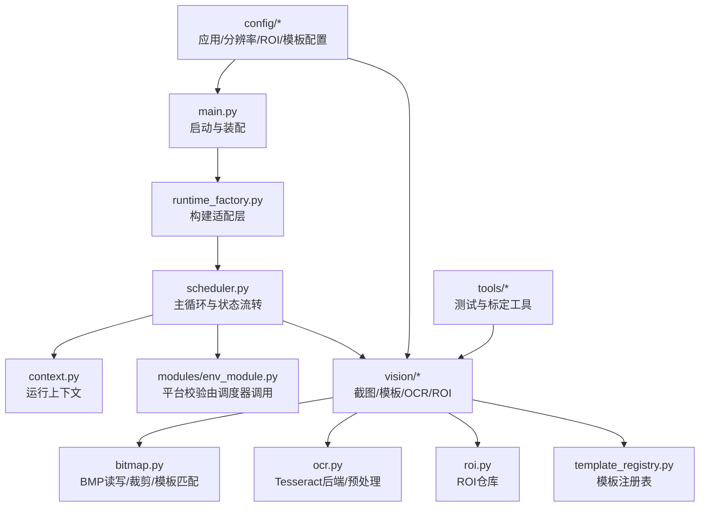
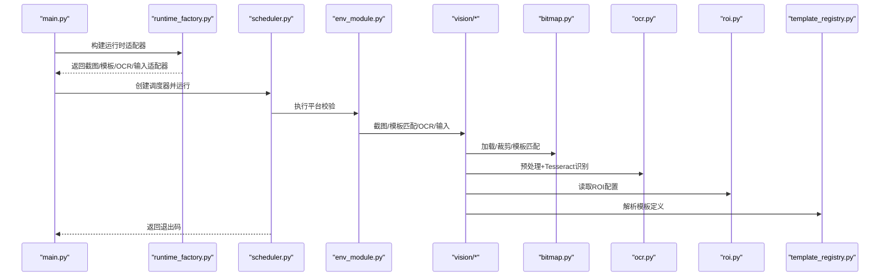
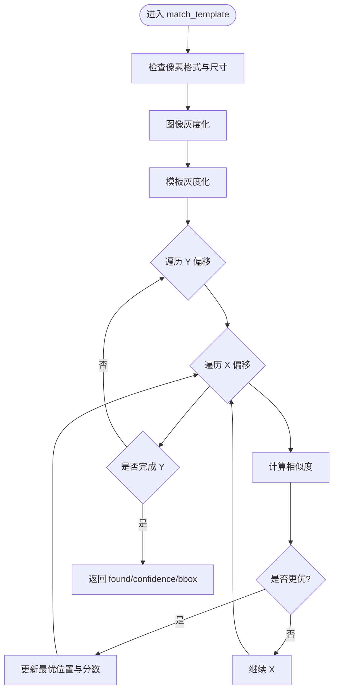
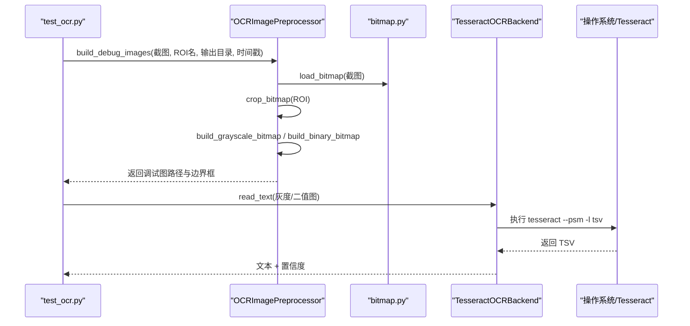
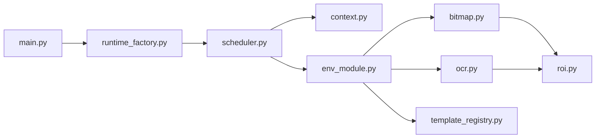

# 性能优化

<cite>
**本文引用的文件**
- [src/main.py](file://src/main.py)
- [config/app.config.json](file://config/app.config.json)
- [config/resolution.config.json](file://config/resolution.config.json)
- [config/roi.config.json](file://config/roi.config.json)
- [config/templates.config.json](file://config/templates.config.json)
- [src/vision/bitmap.py](file://src/vision/bitmap.py)
- [src/vision/ocr.py](file://src/vision/ocr.py)
- [src/vision/template_registry.py](file://src/vision/template_registry.py)
- [src/vision/roi.py](file://src/vision/roi.py)
- [src/core/scheduler.py](file://src/core/scheduler.py)
- [src/core/context.py](file://src/core/context.py)
- [src/core/runtime_factory.py](file://src/core/runtime_factory.py)
- [tools/test_ocr.py](file://tools/test_ocr.py)
- [tools/capture_roi.py](file://tools/capture_roi.py)
- [README.md](file://README.md)
</cite>

## 目录
1. [简介](#简介)
2. [项目结构](#项目结构)
3. [核心组件](#核心组件)
4. [架构总览](#架构总览)
5. [详细组件分析](#详细组件分析)
6. [依赖关系分析](#依赖关系分析)
7. [性能考量与调优策略](#性能考量与调优策略)
8. [故障排查指南](#故障排查指南)
9. [结论](#结论)
10. [附录](#附录)

## 简介
本指南面向系统性能优化，聚焦截图频率、模板匹配算法、OCR识别效率等关键因素，结合当前代码实现给出可操作的优化建议。内容涵盖位图缓存、ROI区域优化、模板预加载、阈值与参数调优、监控与基准测试方法、内存管理与资源释放最佳实践，以及不同硬件环境下的配置推荐。

## 项目结构
本项目采用分层与模块化组织：
- 入口与装配：main.py 负责读取配置、构建运行时适配器、启动调度器。
- 视觉处理：vision 模块提供位图读写裁剪、模板匹配、OCR预处理与识别、ROI管理、模板注册。
- 核心流程：core 模块包含状态机、上下文、调度器、守卫与恢复。
- 工具：tools 提供 OCR 测试、ROI 裁切等独立脚本。
- 配置：config 集中管理分辨率、ROI、模板定义与应用参数。

图表来源
- [src/main.py:22-50](file://src/main.py#L22-L50)
- [src/core/runtime_factory.py:30-77](file://src/core/runtime_factory.py#L30-L77)
- [src/core/scheduler.py:32-83](file://src/core/scheduler.py#L32-L83)
- [src/vision/bitmap.py:17-201](file://src/vision/bitmap.py#L17-L201)
- [src/vision/ocr.py:23-142](file://src/vision/ocr.py#L23-L142)
- [src/vision/roi.py:21-68](file://src/vision/roi.py#L21-L68)
- [src/vision/template_registry.py:17-44](file://src/vision/template_registry.py#L17-L44)
- [config/app.config.json:1-23](file://config/app.config.json#L1-L23)

章节来源
- [src/main.py:22-50](file://src/main.py#L22-L50)
- [config/app.config.json:1-23](file://config/app.config.json#L1-L23)
- [config/resolution.config.json:1-8](file://config/resolution.config.json#L1-L8)
- [config/roi.config.json:1-31](file://config/roi.config.json#L1-L31)
- [config/templates.config.json:1-9](file://config/templates.config.json#L1-L9)

## 核心组件
- 运行时装配：根据运行模式选择 Windows 或 DryRun 的截图、模板匹配、OCR、输入控制器，并注入 ROI、模板路径与 OCR 参数。
- 调度器：驱动状态机，执行环境检查，记录置信度与截图路径，超时触发恢复。
- 位图与模板匹配：纯 Python BMP 解析、灰度化、相似度计算；强调配合 ROI 降低扫描范围。
- OCR 后端：通过 Tesseract 子进程执行，支持语言、PSM 配置；内置灰度化、二值化、Otsu 阈值、缩放等预处理。
- ROI 仓库：从 JSON 加载区域定义，支持查询与持久化更新。
- 模板注册表：按名称解析模板路径、ROI、阈值等元数据。

章节来源
- [src/core/runtime_factory.py:30-77](file://src/core/runtime_factory.py#L30-L77)
- [src/core/scheduler.py:32-83](file://src/core/scheduler.py#L32-L83)
- [src/vision/bitmap.py:17-201](file://src/vision/bitmap.py#L17-L201)
- [src/vision/ocr.py:23-142](file://src/vision/ocr.py#L23-L142)
- [src/vision/roi.py:21-68](file://src/vision/roi.py#L21-L68)
- [src/vision/template_registry.py:17-44](file://src/vision/template_registry.py#L17-L44)

## 架构总览
下图展示从启动到视觉识别的关键调用链，体现配置、装配、调度与视觉模块的交互。

图表来源
- [src/main.py:22-50](file://src/main.py#L22-L50)
- [src/core/runtime_factory.py:30-77](file://src/core/runtime_factory.py#L30-L77)
- [src/core/scheduler.py:32-83](file://src/core/scheduler.py#L32-L83)
- [src/vision/bitmap.py:118-165](file://src/vision/bitmap.py#L118-L165)
- [src/vision/ocr.py:29-70](file://src/vision/ocr.py#L29-L70)
- [src/vision/roi.py:21-46](file://src/vision/roi.py#L21-L46)
- [src/vision/template_registry.py:17-44](file://src/vision/template_registry.py#L17-L44)

## 详细组件分析

### 位图与模板匹配（bitmap.py）
- 关键点
  - BMP 解析与保存：仅支持未压缩 24/32 位 BMP，行步长对齐，统一自上而下存储。
  - ROI 裁剪：严格边界检查，避免越界。
  - 模板匹配：逐像素灰度化后计算平均差异相似度，复杂度 O(W×H×T_w×T_h)，强烈依赖 ROI 缩小搜索空间。
- 性能影响
  - 全图匹配代价高，必须结合 ROI 与合理模板尺寸。
  - 灰度转换与相似度计算为纯 Python 循环，CPU 密集。
- 优化建议
  - 强制使用 ROI 限制搜索区域，减少 max_x/max_y。
  - 对大模板进行多级金字塔匹配或分块匹配以降低复杂度。
  - 将灰度矩阵转为紧凑数组或使用 NumPy 向量化（若允许引入第三方库）。
  - 缓存已加载模板的灰度矩阵，避免重复转换。

图表来源
- [src/vision/bitmap.py:118-201](file://src/vision/bitmap.py#L118-L201)

章节来源
- [src/vision/bitmap.py:17-201](file://src/vision/bitmap.py#L17-L201)

### OCR 后端与预处理（ocr.py）
- 关键点
  - Tesseract 子进程调用：支持自定义命令、语言、PSM；TSV 输出解析为文本与置信度。
  - 预处理：灰度化、归一化、Otsu 二值化、暗像素比例反转、可选放大。
  - 调试图生成：原始、灰度、二值图保存，便于定位问题。
- 性能影响
  - 子进程启动与 I/O 开销显著；图像预处理在 Python 中逐像素操作较慢。
  - PSM 与语言选择不当会导致识别失败或耗时增加。
- 优化建议
  - 复用子进程或批处理多张图以减少进程启动开销（需评估稳定性）。
  - 控制 scale 倍数，仅在必要时放大以提升识别率。
  - 调整 psm 与语言以匹配 UI 文本布局与字体。
  - 缓存 ROI 裁剪结果与预处理中间态，避免重复计算。

图表来源
- [tools/test_ocr.py:57-176](file://tools/test_ocr.py#L57-L176)
- [src/vision/ocr.py:73-107](file://src/vision/ocr.py#L73-L107)
- [src/vision/ocr.py:29-70](file://src/vision/ocr.py#L29-L70)
- [src/vision/bitmap.py:17-60](file://src/vision/bitmap.py#L17-L60)

章节来源
- [src/vision/ocr.py:23-280](file://src/vision/ocr.py#L23-L280)
- [tools/test_ocr.py:57-176](file://tools/test_ocr.py#L57-L176)

### ROI 仓库（roi.py）
- 关键点
  - 从 JSON 加载区域定义，支持 get/load_all/upsert。
  - upsert 会覆盖并重新写入配置文件，便于标定迭代。
- 性能影响
  - 每次 get 都会 load_all 再查找，频繁调用时存在重复 I/O。
- 优化建议
  - 启动时一次性加载所有 ROI 并缓存字典。
  - 高频场景下避免重复 upsert，批量合并后再写盘。

章节来源
- [src/vision/roi.py:21-68](file://src/vision/roi.py#L21-L68)

### 模板注册表（template_registry.py）
- 关键点
  - 按名称解析模板路径、ROI、阈值等元数据，校验文件存在性。
- 性能影响
  - 每次 get 都读取 JSON 并校验路径，适合低频访问；高频应缓存。
- 优化建议
  - 启动时加载全部模板定义并缓存。
  - 对模板灰度矩阵与 ROI 裁剪结果做缓存，减少重复计算。

章节来源
- [src/vision/template_registry.py:17-44](file://src/vision/template_registry.py#L17-L44)

### 调度器与上下文（scheduler.py, context.py）
- 关键点
  - 调度器维护状态机、守卫（重试次数与时限）、日志与恢复。
  - 上下文记录状态、截图路径、置信度、重试计数与时间戳。
- 性能影响
  - 状态切换与日志输出会影响整体吞吐；超时与恢复逻辑决定鲁棒性。
- 优化建议
  - 合理设置 state_timeout_sec 与 max_state_retry，避免过长等待或过多重试。
  - 在 CHECK_ENV 阶段记录 screenshot_path 与 scene_confidence，便于后续分析与调参。

章节来源
- [src/core/scheduler.py:13-83](file://src/core/scheduler.py#L13-L83)
- [src/core/context.py:10-62](file://src/core/context.py#L10-L62)

### 运行时装配（runtime_factory.py）
- 关键点
  - 根据 runtime_mode 选择 Windows 或 DryRun 的截图、模板匹配、OCR、输入控制器。
  - 注入模板根路径、模板配置路径、ROI 配置路径与 OCR 参数。
- 性能影响
  - 真实模式下涉及系统 API 调用与外部进程，延迟较高。
- 优化建议
  - 在 Windows 模式下优先启用 ROI 与模板缓存。
  - 将 OCR 语言与 PSM 固定为稳定值，减少运行时切换成本。

章节来源
- [src/core/runtime_factory.py:30-77](file://src/core/runtime_factory.py#L30-L77)

## 依赖关系分析
- 模块耦合
  - main.py 依赖 runtime_factory 装配各适配器，再交给 scheduler 驱动。
  - scheduler 依赖 context、state_machine、guard_manager、recovery_manager 与 validator。
  - vision 模块内部 bitmap、ocr、roi、template_registry 相互协作，形成“截图→ROI→模板/OCR”的处理管线。
- 外部依赖
  - Tesseract OCR 作为外部进程被调用，需确保可执行文件可用且参数正确。
  - 配置文件集中管理分辨率、ROI、模板与应用参数。

图表来源
- [src/main.py:22-50](file://src/main.py#L22-L50)
- [src/core/runtime_factory.py:30-77](file://src/core/runtime_factory.py#L30-L77)
- [src/core/scheduler.py:32-83](file://src/core/scheduler.py#L32-L83)
- [src/vision/bitmap.py:118-201](file://src/vision/bitmap.py#L118-L201)
- [src/vision/ocr.py:29-142](file://src/vision/ocr.py#L29-L142)
- [src/vision/roi.py:21-68](file://src/vision/roi.py#L21-L68)
- [src/vision/template_registry.py:17-44](file://src/vision/template_registry.py#L17-L44)

章节来源
- [src/main.py:22-50](file://src/main.py#L22-L50)
- [src/core/runtime_factory.py:30-77](file://src/core/runtime_factory.py#L30-L77)
- [src/core/scheduler.py:32-83](file://src/core/scheduler.py#L32-L83)

## 性能考量与调优策略

### 关键性能因素
- 截图频率
  - 高频截图带来高 CPU/IO 压力与进程间通信开销。建议结合业务节奏设定最小间隔，并在 CHECK_ENV 阶段复用同一张截图进行多项判断。
- 模板匹配算法
  - 当前为纯 Python 逐像素相似度计算，复杂度与 ROI 面积成正比。务必使用 ROI 限制搜索区域，并对大模板采用多级匹配或分块策略。
- OCR 识别效率
  - 子进程启动与 TSV 解析为主要瓶颈。建议固定语言与 PSM，减少无效预处理，必要时批量处理图像。

章节来源
- [src/vision/bitmap.py:118-201](file://src/vision/bitmap.py#L118-L201)
- [src/vision/ocr.py:29-142](file://src/vision/ocr.py#L29-L142)
- [config/app.config.json:10-21](file://config/app.config.json#L10-L21)

### 图像处理优化策略
- 位图缓存
  - 缓存模板灰度矩阵与 ROI 裁剪结果，避免重复计算。
  - 对频繁使用的 ROI 与模板建立本地缓存字典，生命周期与程序一致。
- ROI 区域优化
  - 精确标定 ROI，尽量缩小搜索区域；避免整图匹配。
  - 使用 tools/capture_roi.py 快速验证 ROI 裁剪效果。
- 模板预加载
  - 启动时加载模板定义与必要元数据，减少运行时 I/O。
  - 对模板灰度化结果进行缓存，提升匹配速度。

章节来源
- [src/vision/roi.py:21-68](file://src/vision/roi.py#L21-L68)
- [src/vision/template_registry.py:17-44](file://src/vision/template_registry.py#L17-L44)
- [tools/capture_roi.py:26-37](file://tools/capture_roi.py#L26-L37)

### 配置参数调优方法
- 模板匹配阈值
  - 在 app.config.json 的 platform_validation.template_match_threshold 中调整全局阈值；模板定义中的 threshold 可针对特定模板微调。
  - 建议先以 0.95 为起点，根据实际误识/漏识情况上下浮动 0.01–0.05。
- OCR 识别参数
  - ocr_language：根据游戏语言选择合适语言包。
  - ocr_psm：页面分割模式影响文本行识别；常用值为 6（单文本块）或 7（单行），可按 UI 布局调整。
  - ocr_tesseract_cmd：指定 Tesseract 可执行路径，确保系统 PATH 或绝对路径正确。
- 分辨率与窗口模式
  - resolution.config.json 中固定 width、height、window_mode、ui_scale 与 language，保证截图与 ROI 坐标稳定。

章节来源
- [config/app.config.json:10-21](file://config/app.config.json#L10-L21)
- [config/resolution.config.json:1-8](file://config/resolution.config.json#L1-L8)
- [config/templates.config.json:1-9](file://config/templates.config.json#L1-L9)

### 性能监控与基准测试
- 监控指标
  - 截图成功率、模板匹配成功率、OCR 识别成功率、单轮耗时、状态超时次数、恢复次数。
  - 在 scheduler 的 CHECK_ENV 阶段记录 screenshot_path 与 scene_confidence，用于离线分析。
- 基准测试方法
  - 使用 tools/test_ocr.py 对 ROI 截图进行灰度/二值预处理与 OCR 识别，记录耗时与置信度。
  - 对模板匹配进行批量测试：固定 ROI 与模板，统计匹配时间与准确率。
  - 对比不同 PSM、语言、scale 与阈值组合的效果，选择最优配置。

章节来源
- [src/core/scheduler.py:57-74](file://src/core/scheduler.py#L57-L74)
- [tools/test_ocr.py:57-176](file://tools/test_ocr.py#L57-L176)
- [README.md:229-243](file://README.md#L229-L243)

### 内存管理与资源释放
- 位图对象
  - BitmapImage 使用 dataclass slots，减少内存占用；避免持有不必要的中间图像引用。
- 预处理中间态
  - 灰度与二值图仅在需要时生成，及时释放临时变量。
- 子进程与 I/O
  - OCR 子进程结束后立即释放 stdout/stderr；避免长时间持有文件句柄。
- 缓存策略
  - 缓存大小受限于可用内存，建议按 ROI 与模板数量估算上限，超出则淘汰最久未用项。

章节来源
- [src/vision/bitmap.py:8-15](file://src/vision/bitmap.py#L8-L15)
- [src/vision/ocr.py:29-70](file://src/vision/ocr.py#L29-L70)

### 不同硬件环境的调优建议
- 低配 CPU
  - 缩小 ROI、减小模板尺寸、降低 scale；减少 OCR 预处理步骤。
  - 提高模板匹配阈值容忍度，减少误识重算。
- 高配 CPU
  - 可适当增大 ROI 与模板尺寸，提升匹配鲁棒性。
  - 并行化模板匹配（如分块多线程）需谨慎评估线程开销。
- GPU 加速（可选）
  - 若引入 OpenCV/Numpy 等库，可将灰度化与相似度计算迁移至 GPU；需权衡引入依赖与维护成本。

[本节为通用指导，不直接分析具体文件]

## 故障排查指南
- OCR 无法识别
  - 检查 Tesseract 可执行文件是否存在与路径是否正确。
  - 确认语言与 PSM 配置是否匹配 UI 文本布局。
  - 使用 tools/test_ocr.py 生成灰度与二值调试图，观察预处理效果。
- 模板匹配失败
  - 检查 ROI 是否越界或标定不准确。
  - 调整模板阈值与模板质量；确保模板与截图分辨率一致。
- 状态超时与恢复
  - 查看 scheduler 日志中的状态超时与错误信息。
  - 适当调整 state_timeout_sec 与 max_state_retry，避免过早恢复或无限重试。

章节来源
- [src/vision/ocr.py:29-70](file://src/vision/ocr.py#L29-L70)
- [tools/test_ocr.py:149-166](file://tools/test_ocr.py#L149-L166)
- [src/vision/bitmap.py:100-115](file://src/vision/bitmap.py#L100-L115)
- [src/core/scheduler.py:32-47](file://src/core/scheduler.py#L32-L47)

## 结论
本项目在当前实现下，性能优化的核心在于：严格控制 ROI 范围、缓存模板与预处理结果、合理配置 OCR 参数与阈值、并通过工具链进行基准测试与监控。建议在稳定环境下逐步引入缓存与并行化策略，持续跟踪关键指标，确保系统在长期运行中的鲁棒性与效率。

## 附录
- 验收指标参考：截图成功率、模板识别成功率、OCR 识别成功率、进图成功率、祭坛发现与交互成功率、平均单轮搜索时间、卡住恢复与安全停机成功率、连续运行轮数。
- 前置可行性验证：固定分辨率、窗口模式、UI 缩放、语言、地图类型、角色技能方案、背包布局、仓库页、过滤器规则。

章节来源
- [README.md:229-243](file://README.md#L229-L243)
- [README.md:63-77](file://README.md#L63-L77)