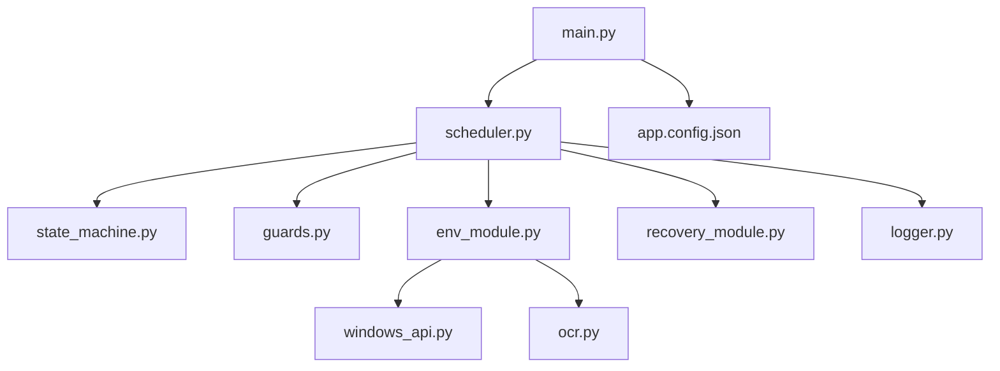
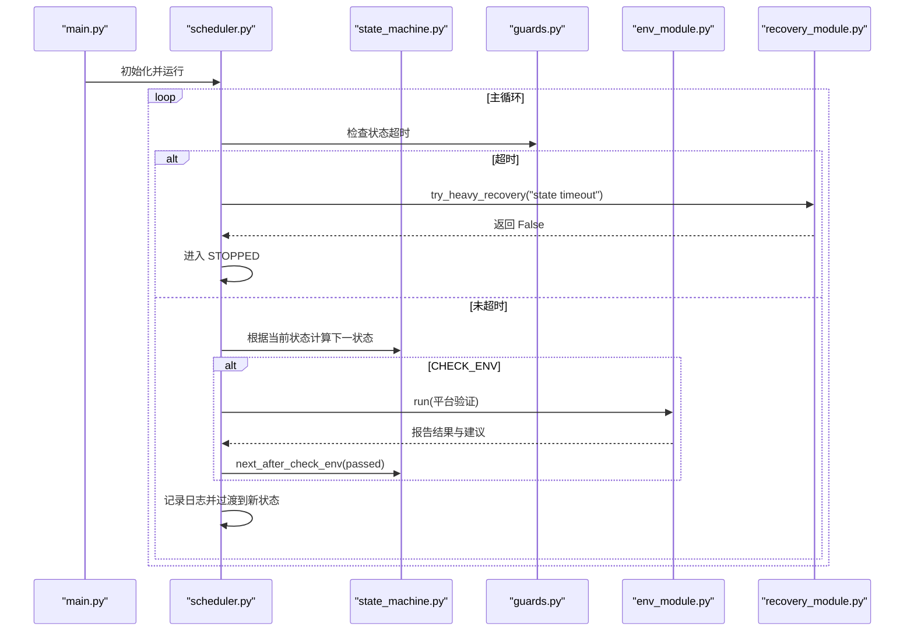
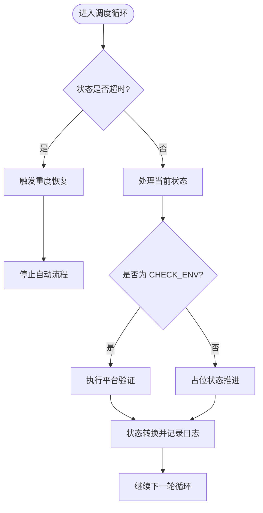
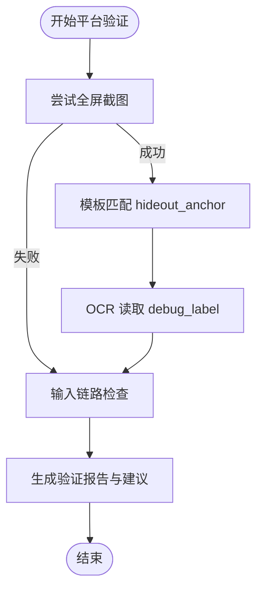
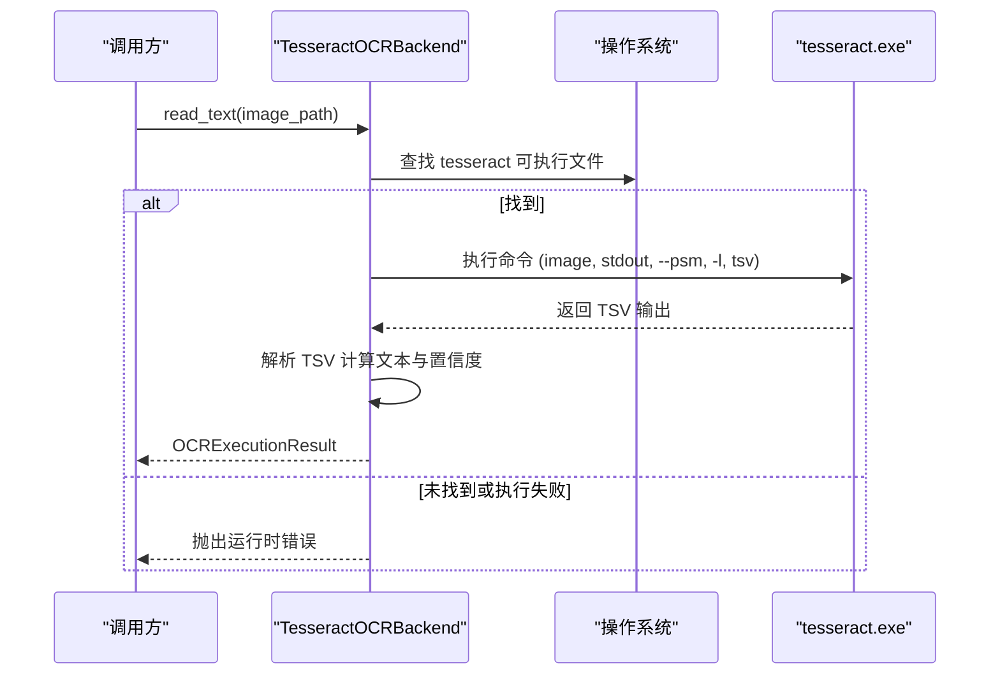
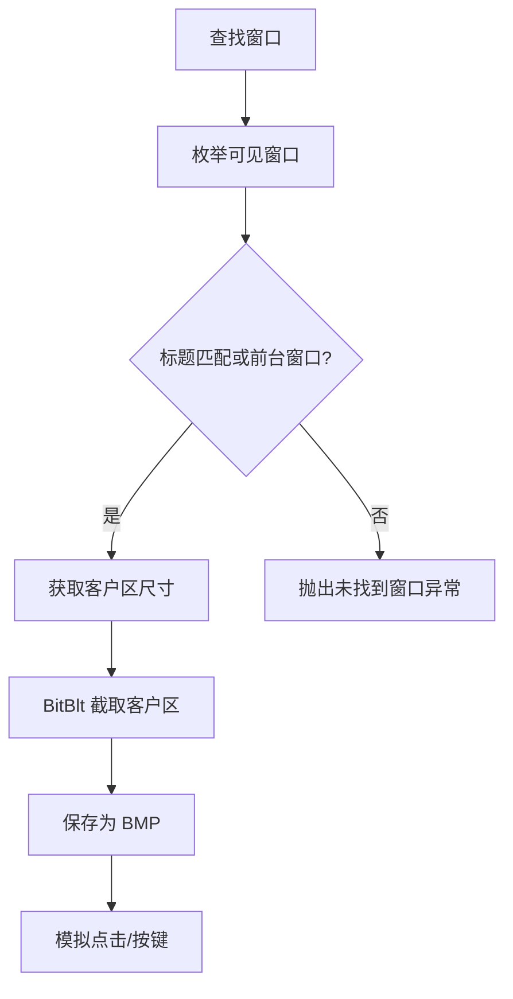
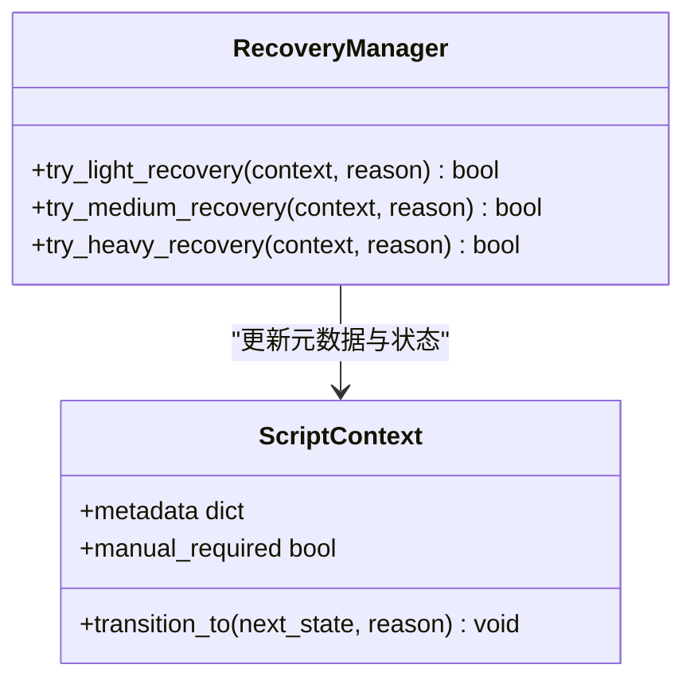
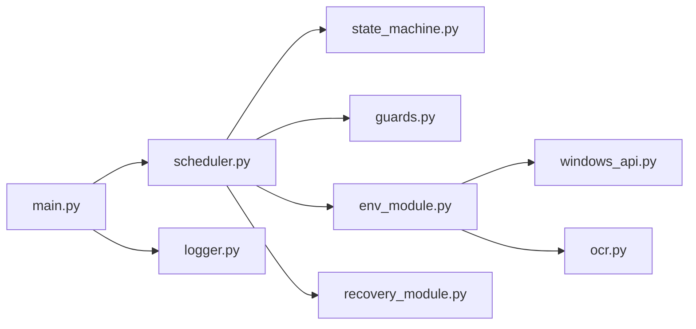
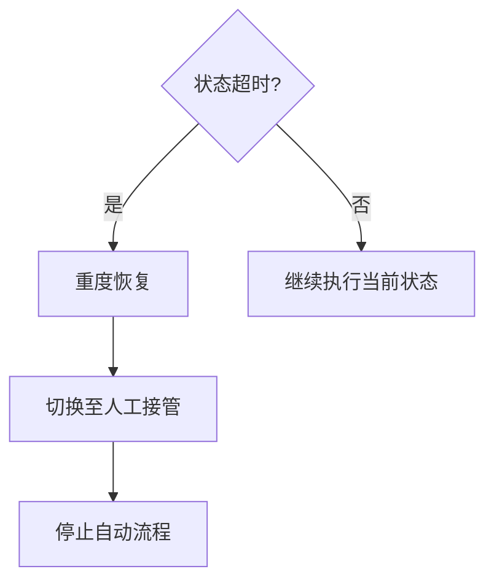

# 故障排查

<cite>
**本文引用的文件**
- [README.md](file://README.md)
- [main.py](file://src/main.py)
- [scheduler.py](file://src/core/scheduler.py)
- [state_machine.py](file://src/core/state_machine.py)
- [context.py](file://src/core/context.py)
- [guards.py](file://src/core/guards.py)
- [env_module.py](file://src/modules/env_module.py)
- [recovery_module.py](file://src/modules/recovery_module.py)
- [ocr.py](file://src/vision/ocr.py)
- [windows_api.py](file://src/utils/windows_api.py)
- [logger.py](file://src/utils/logger.py)
- [app.config.json](file://config/app.config.json)
- [templates.config.json](file://config/templates.config.json)
- [test_ocr.py](file://tools/test_ocr.py)
</cite>

## 目录
1. [简介](#简介)
2. [项目结构](#项目结构)
3. [核心组件](#核心组件)
4. [架构总览](#架构总览)
5. [详细组件分析](#详细组件分析)
6. [依赖关系分析](#依赖关系分析)
7. [性能注意事项](#性能注意事项)
8. [故障排查指南](#故障排查指南)
9. [结论](#结论)
10. [附录](#附录)

## 简介
本故障排查文档面向部署与运行阶段的常见问题，覆盖 Tesseract OCR 识别失败、屏幕捕获权限不足、模板匹配精度不够、Windows API 集成异常（窗口句柄获取失败、输入模拟异常）等。同时系统化说明 RecoveryManager 的恢复机制与重试策略，提供日志分析、状态检查、性能监控的诊断流程，以及 DryRun 模式调试、断点调试等技巧和问题上报最佳实践。

## 项目结构
本项目采用分层模块化设计：
- 入口与装配：main.py 负责加载配置、构建运行时适配器、组装调度器与恢复管理器。
- 调度与控制流：scheduler.py 驱动状态机，结合 guards.py 进行超时与重试控制。
- 上下文与状态：context.py 定义脚本状态枚举与上下文数据。
- 平台验证：env_module.py 对截图、模板匹配、OCR、输入链路进行前置校验。
- 视觉与OCR：vision/ocr.py 封装 Tesseract 调用、ROI 裁切与图像预处理。
- Windows API：utils/windows_api.py 封装窗口查找、截图、点击与按键发送。
- 日志：utils/logger.py 统一输出控制台与文件日志。
- 配置：config/app.config.json、config/templates.config.json 等。
- 工具：tools/test_ocr.py 用于独立测试 OCR 链路。

**图表来源**
- [main.py:22-50](file://src/main.py#L22-L50)
- [scheduler.py:13-47](file://src/core/scheduler.py#L13-L47)
- [env_module.py:23-88](file://src/modules/env_module.py#L23-L88)
- [ocr.py:23-70](file://src/vision/ocr.py#L23-L70)
- [windows_api.py:121-196](file://src/utils/windows_api.py#L121-L196)
- [logger.py:11-39](file://src/utils/logger.py#L11-L39)
- [app.config.json:1-23](file://config/app.config.json#L1-L23)

**章节来源**
- [main.py:22-50](file://src/main.py#L22-L50)
- [scheduler.py:13-47](file://src/core/scheduler.py#L13-L47)
- [env_module.py:23-88](file://src/modules/env_module.py#L23-L88)
- [ocr.py:23-70](file://src/vision/ocr.py#L23-L70)
- [windows_api.py:121-196](file://src/utils/windows_api.py#L121-L196)
- [logger.py:11-39](file://src/utils/logger.py#L11-L39)
- [app.config.json:1-23](file://config/app.config.json#L1-L23)

## 核心组件
- 调度器（Scheduler）：维护主循环、状态转换、超时检测、错误恢复触发。
- 状态机（StateMachine）：定义状态流转逻辑，支持占位状态顺序推进。
- 守卫（GuardManager）：提供重试耗尽与状态超时判断。
- 上下文（ScriptContext）：保存当前状态、重试计数、置信度、截图路径、元数据等。
- 平台验证（PlatformValidator）：执行截图、模板匹配、OCR、输入链路的可行性验证。
- 恢复管理（RecoveryManager）：提供轻量、中等、重度恢复策略，必要时转入人工接管。
- OCR 后端（TesseractOCRBackend）：调用外部 tesseract 可执行文件，解析 TSV 输出并计算置信度。
- Windows API：窗口查找、客户区截图、鼠标/键盘输入模拟。
- 日志（Logger）：统一格式输出到控制台与文件。

**章节来源**
- [scheduler.py:13-83](file://src/core/scheduler.py#L13-L83)
- [state_machine.py:6-42](file://src/core/state_machine.py#L6-L42)
- [guards.py:6-16](file://src/core/guards.py#L6-L16)
- [context.py:10-62](file://src/core/context.py#L10-L62)
- [env_module.py:23-88](file://src/modules/env_module.py#L23-L88)
- [recovery_module.py:6-19](file://src/modules/recovery_module.py#L6-L19)
- [ocr.py:23-70](file://src/vision/ocr.py#L23-L70)
- [windows_api.py:121-377](file://src/utils/windows_api.py#L121-L377)
- [logger.py:11-39](file://src/utils/logger.py#L11-L39)

## 架构总览
系统启动后，main.py 加载配置并构建运行时适配器，随后创建 PlatformValidator、Scheduler 与 RecoveryManager。Scheduler 进入主循环，依据 StateMachine 决定下一步状态，使用 GuardManager 控制超时与重试；若环境检查失败或状态超时，则触发 RecoveryManager 的恢复策略。

**图表来源**
- [main.py:22-50](file://src/main.py#L22-L50)
- [scheduler.py:32-83](file://src/core/scheduler.py#L32-L83)
- [state_machine.py:6-42](file://src/core/state_machine.py#L6-L42)
- [guards.py:6-16](file://src/core/guards.py#L6-L16)
- [env_module.py:38-88](file://src/modules/env_module.py#L38-L88)
- [recovery_module.py:6-19](file://src/modules/recovery_module.py#L6-L19)

## 详细组件分析

### 调度器与状态机
- 调度器在主循环中持续检查状态超时，若超时则触发重度恢复并终止自动流程。
- 在 CHECK_ENV 阶段，调度器调用平台验证器执行截图、模板匹配、OCR、输入链路检查，并将结果写入上下文与日志。
- 状态机提供占位状态的顺序推进，便于开发期逐步验证各阶段能力。

**图表来源**
- [scheduler.py:32-83](file://src/core/scheduler.py#L32-L83)
- [state_machine.py:6-42](file://src/core/state_machine.py#L6-L42)

**章节来源**
- [scheduler.py:32-83](file://src/core/scheduler.py#L32-L83)
- [state_machine.py:6-42](file://src/core/state_machine.py#L6-L42)

### 平台验证与环境检查
- 平台验证器依次尝试全屏截图、模板匹配、OCR 读取、输入点击与按键。
- 任何环节抛出异常都会被捕获并记录为错误信息，最终汇总为通过/失败报告与下一步建议。
- 阈值来自 app.config.json 的平台验证配置，如模板匹配阈值、OCR 置信度阈值、输入成功率阈值。

**图表来源**
- [env_module.py:38-88](file://src/modules/env_module.py#L38-L88)
- [app.config.json:16-21](file://config/app.config.json#L16-L21)

**章节来源**
- [env_module.py:38-88](file://src/modules/env_module.py#L38-L88)
- [app.config.json:16-21](file://config/app.config.json#L16-L21)

### OCR 与 Tesseract 集成
- TesseractOCRBackend 调用外部 tesseract 命令，传入图像路径、PSM 模式与语言参数，解析 TSV 输出得到文本与置信度。
- 若 tesseract 不可用或执行失败，会抛出运行时错误，包含错误消息以便定位。
- OCRImagePreprocessor 基于 ROI 配置裁剪区域，生成灰度图与二值图，辅助调试与优化识别效果。

**图表来源**
- [ocr.py:23-70](file://src/vision/ocr.py#L23-L70)
- [ocr.py:110-141](file://src/vision/ocr.py#L110-L141)

**章节来源**
- [ocr.py:23-70](file://src/vision/ocr.py#L23-L70)
- [ocr.py:110-141](file://src/vision/ocr.py#L110-L141)

### Windows API 集成
- find_window 枚举可见窗口，按标题关键词匹配，若未匹配则回退到前台窗口；尺寸无效时跳过该窗口。
- capture_window_client_area 使用 GDI 截取窗口客户区像素并保存为 BMP。
- send_left_click 与 send_key_press 通过 SendInput 模拟鼠标点击与键盘按键，需先激活窗口并转换坐标。

**图表来源**
- [windows_api.py:121-196](file://src/utils/windows_api.py#L121-L196)
- [windows_api.py:228-328](file://src/utils/windows_api.py#L228-L328)

**章节来源**
- [windows_api.py:121-196](file://src/utils/windows_api.py#L121-L196)
- [windows_api.py:228-328](file://src/utils/windows_api.py#L228-L328)

### 恢复管理与重试策略
- RecoveryManager 提供三种恢复级别：轻量、中等、重度。
- 轻度与中度恢复仅记录恢复原因并返回成功；重度恢复将标记需要人工接管并切换到 MANUAL_REQUIRED 状态。
- Scheduler 在状态超时时直接触发重度恢复并终止自动流程，避免无限重试。

**图表来源**
- [recovery_module.py:6-19](file://src/modules/recovery_module.py#L6-L19)
- [context.py:31-62](file://src/core/context.py#L31-L62)

**章节来源**
- [recovery_module.py:6-19](file://src/modules/recovery_module.py#L6-L19)
- [context.py:31-62](file://src/core/context.py#L31-L62)

## 依赖关系分析
- main.py 依赖 scheduler、validator、recovery_manager 与 logger。
- scheduler 依赖 state_machine、guards、env_module、recovery_manager。
- env_module 依赖 screenshot_provider、template_matcher、ocr_provider、input_controller（由运行时适配器注入）。
- ocr.py 依赖 bitmap、roi、subprocess、csv。
- windows_api.py 依赖 ctypes、user32、gdi32。

**图表来源**
- [main.py:22-50](file://src/main.py#L22-L50)
- [scheduler.py:13-47](file://src/core/scheduler.py#L13-L47)
- [env_module.py:23-88](file://src/modules/env_module.py#L23-L88)
- [ocr.py:23-70](file://src/vision/ocr.py#L23-L70)
- [windows_api.py:121-196](file://src/utils/windows_api.py#L121-L196)
- [logger.py:11-39](file://src/utils/logger.py#L11-L39)

**章节来源**
- [main.py:22-50](file://src/main.py#L22-L50)
- [scheduler.py:13-47](file://src/core/scheduler.py#L13-L47)
- [env_module.py:23-88](file://src/modules/env_module.py#L23-L88)
- [ocr.py:23-70](file://src/vision/ocr.py#L23-L70)
- [windows_api.py:121-196](file://src/utils/windows_api.py#L121-L196)
- [logger.py:11-39](file://src/utils/logger.py#L11-L39)

## 性能注意事项
- OCR 预处理中的灰度化与二值化涉及逐像素操作，建议在 ROI 尺寸合理范围内进行，避免过大图像导致耗时增加。
- 缩放函数会对图像进行倍数放大，过大的 scale 会增加内存与处理时间。
- Windows API 截图使用 BitBlt 与 GetDIBits，频繁调用可能带来系统开销，应控制频率并在必要时缓存结果。
- 日志输出默认 INFO 级别，生产环境可根据需要调整以减少 I/O 压力。

[本节为通用性能指导，不直接分析具体文件]

## 故障排查指南

### 常见部署与运行问题及解决方案
- Tesseract OCR 识别失败
  - 现象：OCR 链路报错，提示未找到 tesseract 或执行失败。
  - 排查要点：
    - 确认 tesseract 已安装且可通过命令行执行。
    - 检查 app.config.json 中的 ocr_tesseract_cmd、ocr_language、ocr_psm 配置是否正确。
    - 使用 tools/test_ocr.py 的 --dry-run 模式验证截图与预处理链路，再逐步启用真实 OCR。
    - 查看 runtime/logs/automation.log 中的错误信息与 Tesseract 输出。
  - 参考实现位置
    - [ocr.py:23-70](file://src/vision/ocr.py#L23-L70)
    - [app.config.json:10-12](file://config/app.config.json#L10-L12)
    - [test_ocr.py:57-181](file://tools/test_ocr.py#L57-L181)

- 屏幕捕获权限不足或黑屏
  - 现象：截图失败、返回空或黑屏，或窗口尺寸无效。
  - 排查要点：
    - 确认目标窗口可见且客户区尺寸有效。
    - 以管理员权限运行脚本，避免 UAC 或游戏反作弊限制。
    - 检查 find_window 与 capture_window_client_area 的错误日志。
  - 参考实现位置
    - [windows_api.py:121-196](file://src/utils/windows_api.py#L121-L196)
    - [windows_api.py:228-328](file://src/utils/windows_api.py#L228-L328)

- 模板匹配精度不够
  - 现象：模板匹配置信度低于阈值，环境检查失败。
  - 排查要点：
    - 核对 templates.config.json 中 hideout_anchor 的 ROI 与阈值设置。
    - 使用平台验证器的截图路径与模板匹配结果定位偏差。
    - 调整 app.config.json 中 template_match_threshold 与实际采集质量。
  - 参考实现位置
    - [env_module.py:50-57](file://src/modules/env_module.py#L50-L57)
    - [templates.config.json:1-9](file://config/templates.config.json#L1-L9)
    - [app.config.json:17-19](file://config/app.config.json#L17-L19)

- Windows API 集成异常
  - 窗口句柄获取失败：find_window 未匹配到目标窗口或前台窗口不可用。
  - 输入模拟异常：SetCursorPos 或 SendInput 返回失败，可能是窗口未激活或坐标转换错误。
  - 排查要点：
    - 打印窗口标题与尺寸，确认窗口存在且可见。
    - 使用 client_to_screen 转换坐标后再发送输入。
    - 检查 user32/gdi32 调用的 last_error 信息。
  - 参考实现位置
    - [windows_api.py:121-196](file://src/utils/windows_api.py#L121-L196)
    - [windows_api.py:221-328](file://src/utils/windows_api.py#L221-L328)

### RecoveryManager 的故障恢复机制与重试策略
- 轻量恢复：记录恢复原因，适用于可自愈的小问题。
- 中等恢复：记录恢复原因，适用于需要额外步骤但仍可自动恢复的场景。
- 重度恢复：标记需要人工接管，切换到 MANUAL_REQUIRED 并终止自动流程，防止误操作。
- 调度器在状态超时时直接触发重度恢复，避免无限重试。

**图表来源**
- [scheduler.py:32-47](file://src/core/scheduler.py#L32-L47)
- [recovery_module.py:6-19](file://src/modules/recovery_module.py#L6-L19)

**章节来源**
- [scheduler.py:32-47](file://src/core/scheduler.py#L32-L47)
- [recovery_module.py:6-19](file://src/modules/recovery_module.py#L6-L19)

### 系统化的问题诊断流程
- 日志分析
  - 查看 runtime/logs/automation.log，关注“环境检查结果”“状态超时”“平台验证错误”等关键日志。
  - 使用 get_logger 输出的统一格式快速定位时间与模块。
- 状态检查
  - 通过 ScriptContext 的 current_state、previous_state、state_retry_count、scene_confidence 等字段了解当前进展与置信度。
  - 使用 state_elapsed_seconds 判断是否接近超时。
- 性能监控
  - 统计单次 OCR 与截图耗时，评估预处理与缩放参数是否合理。
  - 观察连续运行时的状态漂移与失败率变化。

**章节来源**
- [logger.py:11-39](file://src/utils/logger.py#L11-L39)
- [context.py:31-62](file://src/core/context.py#L31-L62)
- [scheduler.py:32-83](file://src/core/scheduler.py#L32-L83)

### 调试工具与技巧
- DryRun 模式
  - 在 app.config.json 中设置 dry_run_mode=false 以启用真实执行；设置为 true 可在占位状态下逐步推进状态而不执行危险动作。
  - 使用 tools/test_ocr.py 的 --dry-run 仅验证截图与预处理链路，不调用 Tesseract。
- 断点调试
  - 在 scheduler._handle_current_state 与 env_module.run 处设置断点，观察平台验证报告与错误列表。
  - 在 windows_api.find_window 与 capture_window_client_area 处断点，检查窗口信息与截图路径。
- 可视化调试
  - 使用 test_ocr.py 输出 raw、gray、binary 调试图，对比 ROI 裁切与预处理效果。
  - 结合 screenshots 与 debug 目录中的中间产物定位问题。

**章节来源**
- [app.config.json:2-3](file://config/app.config.json#L2-L3)
- [test_ocr.py:57-181](file://tools/test_ocr.py#L57-L181)
- [scheduler.py:49-83](file://src/core/scheduler.py#L49-L83)
- [env_module.py:38-88](file://src/modules/env_module.py#L38-L88)
- [windows_api.py:121-196](file://src/utils/windows_api.py#L121-L196)

### 问题上报与求助最佳实践
- 收集必要信息
  - 日志文件：runtime/logs/automation.log。
  - 截图与调试图：runtime/screenshots 与 runtime/debug 目录下的中间产物。
  - 配置快照：app.config.json、templates.config.json、roi.config.json（如有）。
  - 环境信息：操作系统版本、分辨率、窗口标题、Tesseract 版本与 PSM 设置。
- 复现步骤
  - 描述触发条件（如特定地图、界面、网络状态）。
  - 提供最小复现代码片段或命令行（如 test_ocr.py 的参数）。
- 期望输出
  - 明确期望行为与实际行为差异。
  - 附上相关日志片段与错误堆栈。

[本节为通用实践指导，不直接分析具体文件]

## 结论
本项目的故障排查围绕“可观测、可恢复、可止损”的原则展开。通过平台验证确保基础链路可用，借助状态机与恢复管理器实现可控的流程推进与异常处理。针对 OCR、截图、输入等关键环节，提供了独立的调试工具与详细的日志输出，便于快速定位与修复问题。建议在开发与部署过程中严格遵循阈值与约束，优先保证稳定性与安全性。

[本节为总结性内容，不直接分析具体文件]

## 附录
- 关键配置文件说明
  - app.config.json：运行时模式、DryRun、重试次数、超时时间、日志与截图目录、窗口标题关键词、OCR 语言与 PSM、模板根目录与配置路径、平台验证阈值。
  - templates.config.json：模板名称、路径、ROI、阈值与描述。
- 工具使用示例
  - tools/test_ocr.py：支持从已有图像或实时窗口截图，输出 ROI、预处理图与 OCR 结果，支持 DryRun 模式。

**章节来源**
- [app.config.json:1-23](file://config/app.config.json#L1-L23)
- [templates.config.json:1-9](file://config/templates.config.json#L1-L9)
- [test_ocr.py:26-181](file://tools/test_ocr.py#L26-L181)