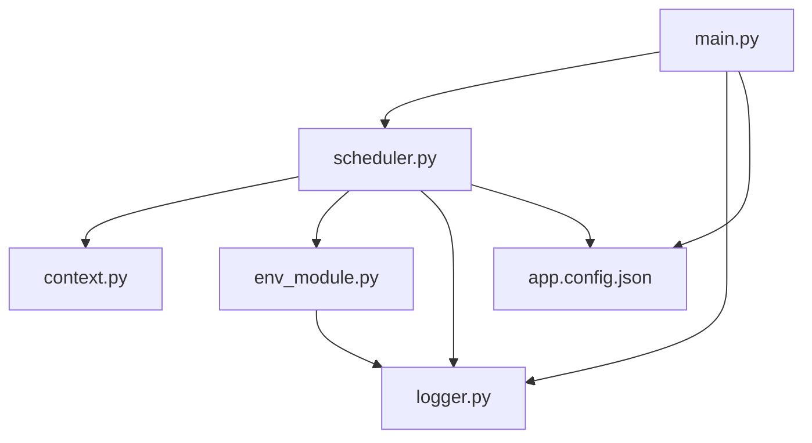
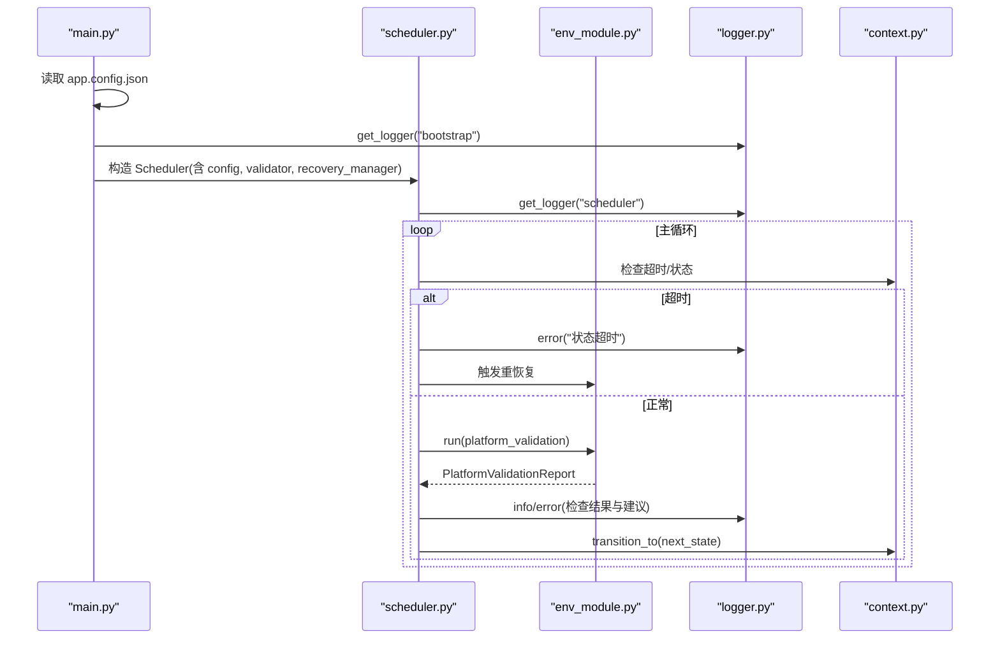
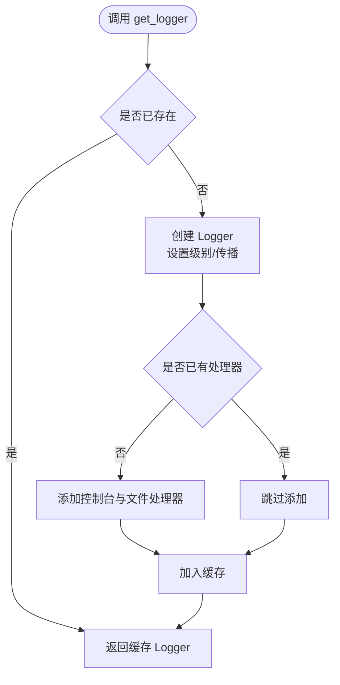
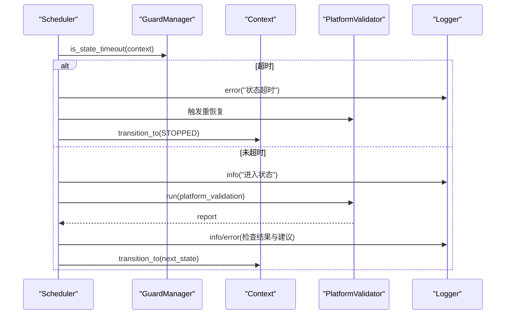
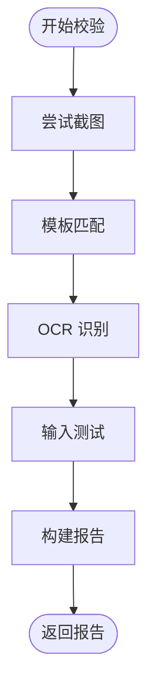
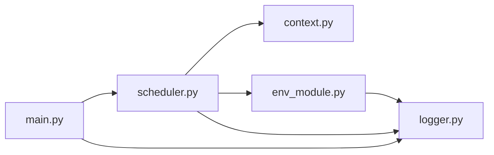

# 日志监控

<cite>
**本文引用的文件**
- [src/utils/logger.py](file://src/utils/logger.py)
- [src/main.py](file://src/main.py)
- [config/app.config.json](file://config/app.config.json)
- [src/core/scheduler.py](file://src/core/scheduler.py)
- [src/modules/env_module.py](file://src/modules/env_module.py)
- [src/core/context.py](file://src/core/context.py)
</cite>

## 目录
1. [简介](#简介)
2. [项目结构](#项目结构)
3. [核心组件](#核心组件)
4. [架构总览](#架构总览)
5. [详细组件分析](#详细组件分析)
6. [依赖关系分析](#依赖关系分析)
7. [性能考量](#性能考量)
8. [故障排查指南](#故障排查指南)
9. [结论](#结论)
10. [附录](#附录)

## 简介
本指南面向日志系统与监控功能的配置与使用，覆盖以下要点：
- logger 模块的配置选项与扩展建议（日志级别、输出格式、文件轮转策略）
- 各模块的日志输出规范与最佳实践
- 日志文件的组织结构与管理策略（归档、清理）
- 常用日志查询与分析方法，帮助快速定位问题
- 监控指标的定义与收集方法（性能指标、错误率统计等）
- 告警规则配置建议与异常通知机制实现方案

## 项目结构
本项目采用分层组织方式：
- 入口与装配：main.py 负责加载配置、初始化调度器与平台校验器，并启动主循环
- 核心流程：scheduler.py 驱动状态机运行，结合上下文 context.py 进行状态切换与计时
- 环境校验：env_module.py 提供平台能力自检（截图、模板匹配、OCR、输入），产出结构化报告
- 工具与基础设施：utils/logger.py 提供统一日志获取与基础输出；配置文件集中于 config/

图表来源
- [src/main.py:22-50](file://src/main.py#L22-L50)
- [src/core/scheduler.py:13-47](file://src/core/scheduler.py#L13-L47)
- [src/modules/env_module.py:23-88](file://src/modules/env_module.py#L23-L88)
- [src/utils/logger.py:11-39](file://src/utils/logger.py#L11-L39)
- [config/app.config.json:1-23](file://config/app.config.json#L1-L23)

章节来源
- [src/main.py:22-50](file://src/main.py#L22-L50)
- [src/core/scheduler.py:13-47](file://src/core/scheduler.py#L13-L47)
- [src/modules/env_module.py:23-88](file://src/modules/env_module.py#L23-L88)
- [src/utils/logger.py:11-39](file://src/utils/logger.py#L11-L39)
- [config/app.config.json:1-23](file://config/app.config.json#L1-L23)

## 核心组件
- 日志模块（logger.py）
  - 提供 get_logger(name, log_dir) 单例化 Logger，默认 INFO 级别，控制台与文件双输出
  - 固定输出格式包含时间、级别、模块名、消息
  - 文件输出路径为 log_dir/automation.log，自动创建目录
- 调度器（scheduler.py）
  - 基于状态机驱动流程，记录关键状态转换、超时与人工接管事件
  - 通过 get_logger("scheduler", ...) 获取专用日志实例
- 环境校验（env_module.py）
  - 对截图、模板匹配、OCR、输入链路逐一验证，收集错误与建议
  - 将结果以结构化报告返回，并在 scheduler 中按级别输出
- 上下文（context.py）
  - 维护当前状态、重试计数、耗时、截图路径等运行时信息
  - 提供状态切换与计时方法，便于度量与日志标注
- 应用配置（app.config.json）
  - 定义日志目录、运行模式、阈值、窗口标题关键字等
  - 其中 log_dir 用于指定日志输出根目录

章节来源
- [src/utils/logger.py:11-39](file://src/utils/logger.py#L11-L39)
- [src/core/scheduler.py:13-47](file://src/core/scheduler.py#L13-L47)
- [src/modules/env_module.py:23-88](file://src/modules/env_module.py#L23-L88)
- [src/core/context.py:31-62](file://src/core/context.py#L31-L62)
- [config/app.config.json:1-23](file://config/app.config.json#L1-L23)

## 架构总览
下图展示了从启动到运行期的日志与监控数据流。

图表来源
- [src/main.py:22-50](file://src/main.py#L22-L50)
- [src/core/scheduler.py:32-83](file://src/core/scheduler.py#L32-L83)
- [src/modules/env_module.py:38-88](file://src/modules/env_module.py#L38-L88)
- [src/utils/logger.py:11-39](file://src/utils/logger.py#L11-L39)
- [src/core/context.py:47-62](file://src/core/context.py#L47-L62)

## 详细组件分析

### 日志模块（logger.py）
- 功能要点
  - 单例缓存：同名 Logger 仅创建一次，避免重复 handler
  - 默认级别：INFO；可关闭向上传播，防止重复输出
  - 输出目标：控制台 + 文件（log_dir/automation.log）
  - 格式化：时间 | 级别 | 模块名 | 消息
- 可扩展点
  - 增加 RotatingFileHandler 或 TimedRotatingFileHandler 实现按大小/时间轮转
  - 增加 JSONFormatter 支持结构化日志
  - 根据运行模式动态调整级别（如 dry_run 时提高至 DEBUG）
  - 多文件输出：按模块或业务域拆分日志文件

图表来源
- [src/utils/logger.py:11-39](file://src/utils/logger.py#L11-L39)

章节来源
- [src/utils/logger.py:11-39](file://src/utils/logger.py#L11-L39)

### 调度器（scheduler.py）
- 职责
  - 驱动状态机，处理超时与人工接管
  - 在关键节点记录 info/error，便于追踪执行轨迹
- 监控相关
  - 通过 context.state_elapsed_seconds() 计算状态耗时
  - 结合 max_state_retry 与 state_timeout_sec 控制重试与超时
  - 将环境校验结果与建议写入日志，便于后续分析

图表来源
- [src/core/scheduler.py:32-83](file://src/core/scheduler.py#L32-L83)
- [src/modules/env_module.py:38-88](file://src/modules/env_module.py#L38-L88)
- [src/core/context.py:47-62](file://src/core/context.py#L47-L62)

章节来源
- [src/core/scheduler.py:32-83](file://src/core/scheduler.py#L32-L83)
- [src/core/context.py:47-62](file://src/core/context.py#L47-L62)

### 环境校验（env_module.py）
- 校验项
  - 截图链路：捕获全屏并判断文件是否存在
  - 模板匹配：对比锚点模板，置信度与阈值比较
  - OCR：识别文本，置信度与阈值比较
  - 输入链路：点击与按键操作成功性
- 输出
  - 结构化报告：passed、各子项布尔值、截图路径、错误列表、下一步建议
  - 在 scheduler 中以不同级别输出，便于区分正常信息与错误

图表来源
- [src/modules/env_module.py:38-88](file://src/modules/env_module.py#L38-L88)

章节来源
- [src/modules/env_module.py:38-88](file://src/modules/env_module.py#L38-L88)

### 上下文（context.py）
- 作用
  - 维护脚本运行时的状态、重试次数、耗时、截图路径等
  - 提供状态切换与计时方法，支撑监控指标采集
- 监控价值
  - state_elapsed_seconds() 可用于计算每个状态的停留时长
  - screenshot_path 可与日志关联，便于回溯现场

章节来源
- [src/core/context.py:31-62](file://src/core/context.py#L31-L62)

### 应用配置（app.config.json）
- 关键配置项
  - runtime_mode、dry_run_mode：控制运行模式
  - max_state_retry、state_timeout_sec：状态重试与超时阈值
  - log_dir：日志输出根目录
  - platform_validation.*：各链路的阈值与参数
- 使用方式
  - main.py 读取后注入 Scheduler 与 Validator，影响日志目录与校验行为

章节来源
- [config/app.config.json:1-23](file://config/app.config.json#L1-L23)
- [src/main.py:22-50](file://src/main.py#L22-L50)

## 依赖关系分析
- 模块耦合
  - main.py 依赖 scheduler、validator、recovery_manager，并通过 logger 输出启动信息
  - scheduler 依赖 context、guard_manager、state_machine、validator、recovery_manager 与 logger
  - env_module 依赖各类 provider（截图、模板、OCR、输入），产出报告供 scheduler 消费
- 外部依赖
  - Python 标准库 logging、pathlib、time.monotonic
  - 配置文件 app.config.json 作为运行时参数来源

图表来源
- [src/main.py:22-50](file://src/main.py#L22-L50)
- [src/core/scheduler.py:13-47](file://src/core/scheduler.py#L13-L47)
- [src/modules/env_module.py:23-88](file://src/modules/env_module.py#L23-L88)
- [src/utils/logger.py:11-39](file://src/utils/logger.py#L11-L39)

章节来源
- [src/main.py:22-50](file://src/main.py#L22-L50)
- [src/core/scheduler.py:13-47](file://src/core/scheduler.py#L13-L47)
- [src/modules/env_module.py:23-88](file://src/modules/env_module.py#L23-L88)
- [src/utils/logger.py:11-39](file://src/utils/logger.py#L11-L39)

## 性能考量
- 日志级别
  - 默认 INFO 适合生产；调试阶段可在启动时调整为 DEBUG
- I/O 开销
  - 文件写入集中在 automation.log；高频场景建议引入轮转以避免单文件过大
- 结构化日志
  - 未来可引入 JSON 格式，便于日志聚合与分析系统解析
- 阈值调优
  - 合理设置 template_match_threshold、ocr_confidence_threshold、input_success_threshold，减少误报与无效重试

[本节为通用指导，不直接分析具体文件]

## 故障排查指南
- 常见问题定位
  - 状态超时：查看 scheduler 的错误日志，确认当前状态与耗时
  - 环境校验失败：根据 report.errors 逐项排查截图、模板、OCR、输入链路
  - 人工接管：当进入 MANUAL_REQUIRED 时，停止自动流程并检查上下文元数据
- 日志查询技巧
  - 按级别过滤：grep 搜索 ERROR/WARNING 快速定位异常
  - 按模块过滤：通过 %(name)s 字段筛选 scheduler、bootstrap 等模块日志
  - 按时间范围：结合日期前缀定位特定运行时段
- 关联证据
  - 使用 context.screenshot_path 与日志中的时间戳关联截图，辅助复现问题
  - 结合 next_step_suggestions 提供的修复建议优先处理

章节来源
- [src/core/scheduler.py:32-83](file://src/core/scheduler.py#L32-L83)
- [src/modules/env_module.py:38-88](file://src/modules/env_module.py#L38-L88)
- [src/core/context.py:47-62](file://src/core/context.py#L47-L62)

## 结论
当前日志系统提供了稳定的基础能力：统一获取、双端输出、固定格式、目录管理。建议在现有基础上逐步增强：
- 引入文件轮转与归档策略，避免日志膨胀
- 采用结构化日志与指标埋点，提升可观测性
- 完善告警规则与通知机制，形成闭环运维

[本节为总结性内容，不直接分析具体文件]

## 附录

### 日志模块配置选项与扩展建议
- 日志级别
  - 默认 INFO；可通过修改 logger.setLevel 调整
- 输出格式
  - 默认包含时间、级别、模块名、消息；可替换为 JSON 格式以便机器解析
- 文件轮转策略
  - 建议引入 RotatingFileHandler（按大小）或 TimedRotatingFileHandler（按天/小时）
  - 配置保留份数与压缩策略，定期清理历史日志
- 多文件输出
  - 可按模块或业务域拆分日志文件，便于分治分析

章节来源
- [src/utils/logger.py:11-39](file://src/utils/logger.py#L11-L39)

### 各模块日志输出规范与最佳实践
- 统一使用 get_logger(name, log_dir) 获取 Logger
- 使用占位符传参，避免字符串拼接带来的性能损耗
- 关键路径记录 info，异常情况记录 error，附带必要上下文（状态、阈值、截图路径）
- 避免在热路径打印过多 debug 信息，必要时通过配置开关控制

章节来源
- [src/core/scheduler.py:32-83](file://src/core/scheduler.py#L32-L83)
- [src/modules/env_module.py:38-88](file://src/modules/env_module.py#L38-L88)
- [src/utils/logger.py:11-39](file://src/utils/logger.py#L11-L39)

### 日志文件组织结构与管理策略
- 目录
  - 日志根目录由 app.config.json 的 log_dir 指定，默认 runtime/logs
  - 当前实现将所有日志写入 automation.log
- 归档与清理
  - 建议按天轮转并保留 N 天；或使用大小限制与备份策略
  - 配合定时任务或操作系统级 cron 清理过期日志

章节来源
- [config/app.config.json:1-23](file://config/app.config.json#L1-L23)
- [src/utils/logger.py:11-39](file://src/utils/logger.py#L11-L39)

### 常用日志查询与分析方法
- 快速定位错误：grep 搜索 ERROR 关键字
- 按模块筛选：利用 %(name)s 字段过滤 scheduler、bootstrap 等
- 关联截图：结合 context.screenshot_path 与日志时间戳定位现场
- 趋势分析：统计错误率、状态超时次数、重试次数等指标

章节来源
- [src/core/context.py:47-62](file://src/core/context.py#L47-L62)
- [src/core/scheduler.py:32-83](file://src/core/scheduler.py#L32-L83)

### 监控指标定义与收集方法
- 性能指标
  - 状态停留时长：context.state_elapsed_seconds()
  - 重试次数：context.state_retry_count
  - 成功率：环境校验 passed 比例
- 错误率统计
  - 错误日志条数（ERROR/WARNING）
  - 各链路失败次数（截图、模板、OCR、输入）
- 采集方式
  - 在关键节点追加结构化日志（JSON），便于日志系统聚合
  - 在 scheduler 中汇总指标并输出摘要日志

章节来源
- [src/core/context.py:47-62](file://src/core/context.py#L47-L62)
- [src/core/scheduler.py:32-83](file://src/core/scheduler.py#L32-L83)
- [src/modules/env_module.py:38-88](file://src/modules/env_module.py#L38-L88)

### 告警规则配置建议与异常通知机制
- 告警规则建议
  - 连续 N 次状态超时触发告警
  - 环境校验失败率超过阈值（如 10%）触发告警
  - 人工接管次数突增触发告警
- 通知机制实现方案
  - 在 scheduler 中检测异常条件，调用通知接口（邮件、IM、Webhook）
  - 将告警内容与上下文（状态、截图路径、错误列表）一并发送

章节来源
- [src/core/scheduler.py:32-83](file://src/core/scheduler.py#L32-L83)
- [src/modules/env_module.py:38-88](file://src/modules/env_module.py#L38-L88)