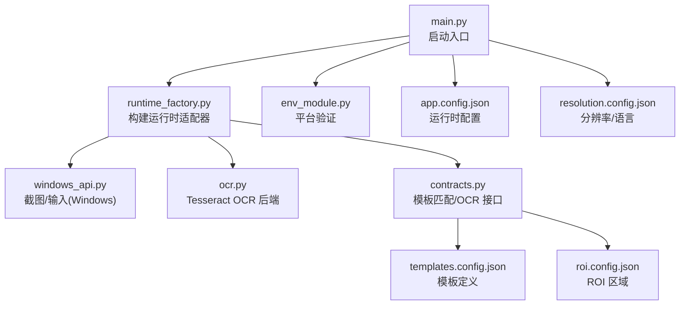
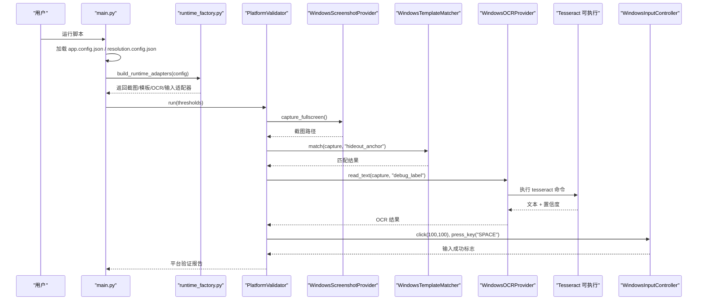

# 环境部署

<cite>
**本文引用的文件**
- [src/main.py](file://src/main.py)
- [config/app.config.json](file://config/app.config.json)
- [config/resolution.config.json](file://config/resolution.config.json)
- [config/roi.config.json](file://config/roi.config.json)
- [config/templates.config.json](file://config/templates.config.json)
- [src/core/runtime_factory.py](file://src/core/runtime_factory.py)
- [src/modules/env_module.py](file://src/modules/env_module.py)
- [src/utils/windows_api.py](file://src/utils/windows_api.py)
- [src/vision/ocr.py](file://src/vision/ocr.py)
- [tools/test_ocr.py](file://tools/test_ocr.py)
- [.gitignore](file://.gitignore)
</cite>

## 目录
1. [简介](#简介)
2. [项目结构](#项目结构)
3. [核心组件](#核心组件)
4. [架构总览](#架构总览)
5. [详细组件分析](#详细组件分析)
6. [依赖与安装](#依赖与安装)
7. [配置说明](#配置说明)
8. [不同环境的配置示例](#不同环境的配置示例)
9. [性能注意事项](#性能注意事项)
10. [故障排查指南](#故障排查指南)
11. [结论](#结论)

## 简介
本指南面向首次部署该项目的用户，目标是帮助你在 Windows 10/11 环境下完成 Python 运行环境、OCR 引擎 Tesseract 以及项目配置的完整搭建。脚本通过截图、模板匹配和 OCR 识别游戏界面元素，并执行输入操作。运行时模式支持“真实 Windows 模式”和“DryRun 调试模式”，便于开发与测试。

## 项目结构
本项目采用分层组织：
- 入口与装配：主程序加载配置、构建运行时适配器、启动调度器
- 平台适配层：Windows API 截图、输入控制；OCR 后端调用 Tesseract
- 视觉处理：BMP 位图裁剪、灰度化、二值化、模板匹配
- 配置中心：应用运行参数、分辨率、ROI、模板定义
- 工具集：OCR 测试、ROI 标定、模板采集等辅助脚本

图表来源
- [src/main.py:22-50](file://src/main.py#L22-L50)
- [src/core/runtime_factory.py:30-76](file://src/core/runtime_factory.py#L30-L76)
- [src/utils/windows_api.py:121-180](file://src/utils/windows_api.py#L121-L180)
- [src/vision/ocr.py:23-70](file://src/vision/ocr.py#L23-L70)
- [config/app.config.json:1-22](file://config/app.config.json#L1-L22)
- [config/resolution.config.json:1-8](file://config/resolution.config.json#L1-L8)
- [config/templates.config.json:1-9](file://config/templates.config.json#L1-L9)
- [config/roi.config.json:1-31](file://config/roi.config.json#L1-L31)

章节来源
- [src/main.py:22-50](file://src/main.py#L22-L50)
- [src/core/runtime_factory.py:30-76](file://src/core/runtime_factory.py#L30-L76)

## 核心组件
- 启动与装配：主程序读取应用与分辨率配置，初始化日志，构建运行时适配器（截图、模板匹配、OCR、输入），并启动调度器。
- 平台验证：提供一键验证截图、模板匹配、OCR、输入链路是否可用，并输出下一步建议。
- 运行时适配器：根据 app.config.json 的 runtime_mode 选择 Windows 真实适配或 DryRun 模拟适配。
- 视觉与 OCR：使用 BMP 位图进行裁剪、灰度化、二值化；OCR 通过 Tesseract 命令行执行，返回文本与置信度。
- Windows 交互：基于系统 API 枚举窗口、截取客户区、发送鼠标与键盘事件。

章节来源
- [src/main.py:22-50](file://src/main.py#L22-L50)
- [src/modules/env_module.py:23-88](file://src/modules/env_module.py#L23-L88)
- [src/core/runtime_factory.py:30-76](file://src/core/runtime_factory.py#L30-L76)
- [src/vision/ocr.py:23-70](file://src/vision/ocr.py#L23-L70)
- [src/utils/windows_api.py:121-180](file://src/utils/windows_api.py#L121-L180)

## 架构总览
下图展示了从启动到识别与输入的完整流程，包括配置加载、适配器装配、平台验证与 OCR/Tesseract 调用。

图表来源
- [src/main.py:22-50](file://src/main.py#L22-L50)
- [src/core/runtime_factory.py:30-76](file://src/core/runtime_factory.py#L30-L76)
- [src/modules/env_module.py:38-88](file://src/modules/env_module.py#L38-L88)
- [src/vision/ocr.py:23-70](file://src/vision/ocr.py#L23-L70)

## 详细组件分析

### 启动与装配流程
- 主程序读取配置并初始化日志目录。
- 根据 runtime_mode 装配 Windows 或 DryRun 适配器。
- 将截图、模板匹配、OCR、输入控制器注入平台验证器与调度器。

章节来源
- [src/main.py:22-50](file://src/main.py#L22-L50)
- [src/core/runtime_factory.py:30-76](file://src/core/runtime_factory.py#L30-L76)

### 平台验证器
- 依次验证截图、模板匹配、OCR、输入链路。
- 收集错误信息与下一步建议，输出通过与否的综合判断。

章节来源
- [src/modules/env_module.py:23-88](file://src/modules/env_module.py#L23-L88)

### OCR 后端与 Tesseract 集成
- 预处理：按 ROI 裁剪图像，生成灰度与二值图用于调试。
- 执行：调用 Tesseract 命令行，传入 PSM 与语言参数，解析 TSV 输出得到文本与置信度。
- 错误：当找不到 Tesseract 或执行失败时抛出明确异常。

章节来源
- [src/vision/ocr.py:23-70](file://src/vision/ocr.py#L23-L70)
- [tools/test_ocr.py:132-176](file://tools/test_ocr.py#L132-L176)

### Windows 截图与输入
- 截图：枚举可见窗口，获取客户端矩形，使用系统 API 捕获像素数据并保存为 BMP。
- 输入：激活目标窗口，移动光标并发送鼠标点击与键盘按键事件。

章节来源
- [src/utils/windows_api.py:121-180](file://src/utils/windows_api.py#L121-L180)
- [src/utils/windows_api.py:315-376](file://src/utils/windows_api.py#L315-L376)

## 依赖与安装

### Python 版本要求
- 建议使用 Python 3.8+。项目代码使用了类型注解与较新的标准库特性，Python 3.8+ 能确保兼容性与可读性。

### 操作系统与环境
- 目标平台：Windows 10/11。
- 需要管理员权限或至少具备对目标游戏窗口的访问权限，以便截图与输入。

### 外部依赖：Tesseract OCR
- 必须安装 Tesseract OCR 引擎，并确保其可执行文件在系统 PATH 中，或在配置中指定绝对路径。
- 若未找到 Tesseract，OCR 模块会抛出运行时错误，提示先安装或配置 ocr_tesseract_cmd。

章节来源
- [src/vision/ocr.py:23-70](file://src/vision/ocr.py#L23-L70)

### 图像处理依赖关系
- 本项目未引入 OpenCV 等第三方图像处理库，而是使用纯 Python 实现 BMP 位图处理（裁剪、灰度化、二值化）与模板匹配。
- 因此无需额外安装 OpenCV；如需扩展功能，可在后续按需引入并维护兼容性。

章节来源
- [src/vision/bitmap.py:95-200](file://src/vision/bitmap.py#L95-L200)

## 配置说明

### 应用配置 app.config.json
关键参数说明：
- runtime_mode：运行模式，推荐开发阶段使用 dry_run，生产环境使用 windows。
- dry_run_mode：是否启用 DryRun 模式。
- max_state_retry：状态重试次数上限。
- state_timeout_sec：状态等待超时秒数。
- log_dir：日志目录，默认 runtime/logs。
- screenshot_dir：截图目录，默认 runtime/screenshots。
- debug_dir：调试输出目录，默认 runtime/debug。
- window_title_keyword：目标窗口标题关键词，用于定位游戏窗口。
- ocr_language：OCR 语言，如 eng。
- ocr_psm：Tesseract PSM 模式，影响版面分析与识别策略。
- ocr_tesseract_cmd：Tesseract 可执行文件名或绝对路径。
- template_root：模板根目录，默认 assets/templates。
- template_config_path：模板配置文件路径，默认 config/templates.config.json。
- roi_config_path：ROI 配置文件路径，默认 config/roi.config.json。
- platform_validation：平台验证阈值，包含截图检查次数、模板匹配阈值、OCR 置信度阈值、输入成功阈值。

章节来源
- [config/app.config.json:1-22](file://config/app.config.json#L1-L22)
- [src/core/runtime_factory.py:30-76](file://src/core/runtime_factory.py#L30-L76)

### 分辨率配置 resolution.config.json
- width/height：固定分辨率，第一版要求严格固定。
- window_mode：窗口模式，如 windowed_fullscreen。
- ui_scale：UI 缩放比例。
- language：界面语言，如 zh-CN。

章节来源
- [config/resolution.config.json:1-8](file://config/resolution.config.json#L1-L8)

### ROI 配置 roi.config.json
- 定义多个 ROI 区域（名称、坐标、宽高、描述），供 OCR 与模板匹配使用。
- 例如 debug_label 用于平台验证与 OCR 调试；hideout_anchor 用于藏身处锚点。

章节来源
- [config/roi.config.json:1-31](file://config/roi.config.json#L1-L31)

### 模板配置 templates.config.json
- 定义模板名称、文件路径、关联 ROI、阈值与描述。
- 模板文件需位于 template_root 下，且路径相对 template_root。

章节来源
- [config/templates.config.json:1-9](file://config/templates.config.json#L1-L9)
- [src/vision/template_registry.py:17-43](file://src/vision/template_registry.py#L17-L43)

## 不同环境的配置示例

### 开发环境（DryRun）
- runtime_mode：dry_run
- dry_run_mode：true
- 目的：不实际截图与输入，仅验证配置与链路逻辑。
- 建议：优先确认配置路径正确、日志目录可写。

章节来源
- [src/core/runtime_factory.py:66-76](file://src/core/runtime_factory.py#L66-L76)

### 测试环境（Windows 真实模式）
- runtime_mode：windows
- window_title_keyword：设置为目标游戏窗口标题关键词
- ocr_language：根据游戏语言设置（如 eng 或对应语言）
- ocr_psm：根据界面布局调整（常用 6 或 7）
- ocr_tesseract_cmd：若未加入 PATH，填写 Tesseract 绝对路径
- 建议：先在 tools/test_ocr.py 中验证 OCR 效果与 ROI 标定。

章节来源
- [src/core/runtime_factory.py:42-64](file://src/core/runtime_factory.py#L42-L64)
- [tools/test_ocr.py:132-176](file://tools/test_ocr.py#L132-L176)

### 生产环境（稳定运行）
- runtime_mode：windows
- 固定分辨率与 UI 缩放，避免识别漂移
- 固定语言与地图类型，降低不确定性
- 合理设置 platform_validation 阈值，平衡误识与漏识
- 建议：开启日志与截图，定期巡检运行质量

章节来源
- [config/app.config.json:1-22](file://config/app.config.json#L1-L22)
- [config/resolution.config.json:1-8](file://config/resolution.config.json#L1-L8)

## 性能注意事项
- 截图频率与超时：合理设置 state_timeout_sec 与截图检查次数，避免频繁截图导致性能下降。
- OCR 预处理：使用 ROI 裁剪减少计算量；选择合适的 PSM 提升识别速度与准确率。
- 模板匹配阈值：根据界面稳定性调整 threshold，过高可能导致漏识，过低可能误识。
- 日志与调试：利用 debug_dir 中的 OCR 调试图（原始、灰度、二值）快速定位问题。

[本节为通用指导，不直接分析具体文件]

## 故障排查指南

### Tesseract 路径配置错误
- 现象：OCR 执行失败，提示未找到 tesseract 可执行文件。
- 排查：
  - 确认 Tesseract 已安装并在系统 PATH 中。
  - 或在 app.config.json 中配置 ocr_tesseract_cmd 为绝对路径。
  - 使用 tools/test_ocr.py 单独验证 OCR 链路。

章节来源
- [src/vision/ocr.py:23-70](file://src/vision/ocr.py#L23-L70)
- [tools/test_ocr.py:132-176](file://tools/test_ocr.py#L132-L176)

### 窗口标题关键词不匹配
- 现象：无法定位目标游戏窗口，截图为空或失败。
- 排查：
  - 检查 app.config.json 中 window_title_keyword 是否与游戏窗口标题一致（大小写不敏感）。
  - 确认游戏窗口可见且未被遮挡。

章节来源
- [src/utils/windows_api.py:121-180](file://src/utils/windows_api.py#L121-L180)

### 权限不足
- 现象：截图失败或输入无效。
- 排查：
  - 以管理员权限运行脚本。
  - 确保目标进程允许被枚举与输入。

章节来源
- [src/utils/windows_api.py:121-180](file://src/utils/windows_api.py#L121-L180)

### 模板或 ROI 路径错误
- 现象：模板匹配失败或 ROI 超出边界。
- 排查：
  - 检查 templates.config.json 中模板路径是否相对于 template_root。
  - 检查 roi.config.json 中 ROI 坐标与分辨率是否匹配。
  - 查看模板是否存在于 assets/templates 下。

章节来源
- [src/vision/template_registry.py:17-43](file://src/vision/template_registry.py#L17-L43)
- [config/templates.config.json:1-9](file://config/templates.config.json#L1-L9)
- [config/roi.config.json:1-31](file://config/roi.config.json#L1-L31)

### 分辨率与 UI 缩放不一致
- 现象：模板匹配与 OCR 识别率下降。
- 排查：
  - 固定 resolution.config.json 中的 width/height/window_mode/ui_scale。
  - 保持游戏内 UI 缩放与语言不变。

章节来源
- [config/resolution.config.json:1-8](file://config/resolution.config.json#L1-L8)

### 日志与调试输出
- 日志目录：由 app.config.json 的 log_dir 指定，默认 runtime/logs。
- 截图目录：screenshot_dir，默认 runtime/screenshots。
- 调试目录：debug_dir，默认 runtime/debug，包含 OCR 调试图。
- .gitignore 已忽略 runtime 目录，避免提交运行时数据。

章节来源
- [config/app.config.json:1-22](file://config/app.config.json#L1-L22)
- [.gitignore:1-12](file://.gitignore#L1-L12)

## 结论
本指南提供了在 Windows 10/11 上部署该项目的完整步骤，涵盖 Python 版本、Tesseract OCR 安装与配置、项目配置文件结构与参数说明，以及开发、测试、生产三种环境的差异化配置。通过平台验证与调试工具，可以快速定位常见问题并优化识别效果。建议在稳定运行后持续监控日志与截图，逐步完善模板与 ROI，提升整体成功率与鲁棒性。