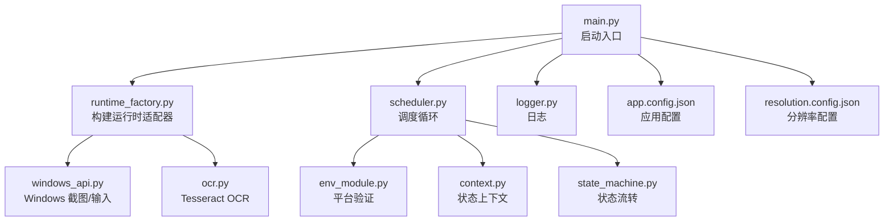
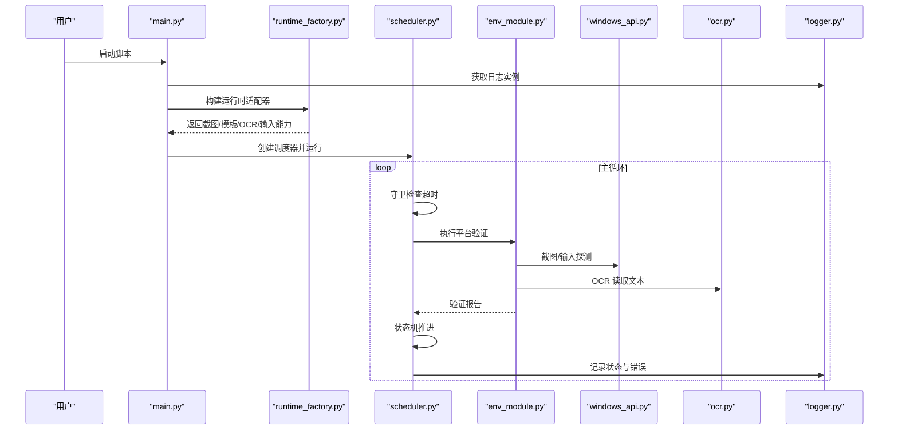
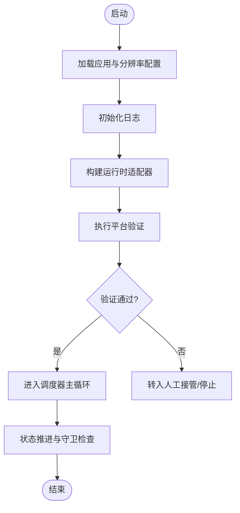
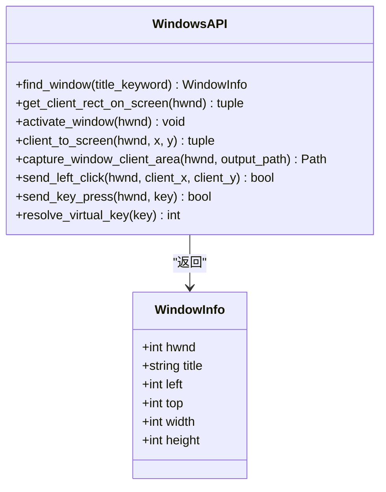
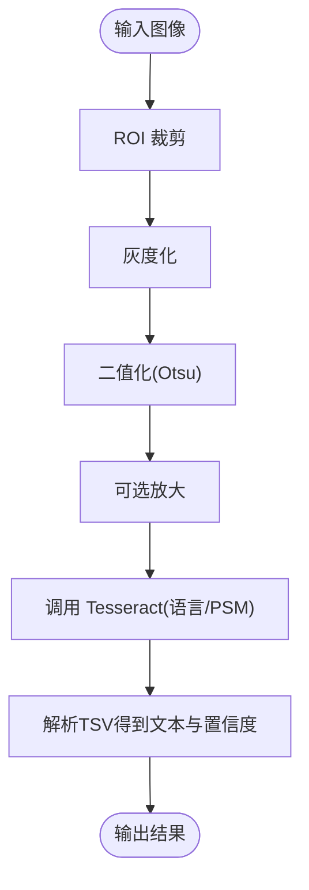
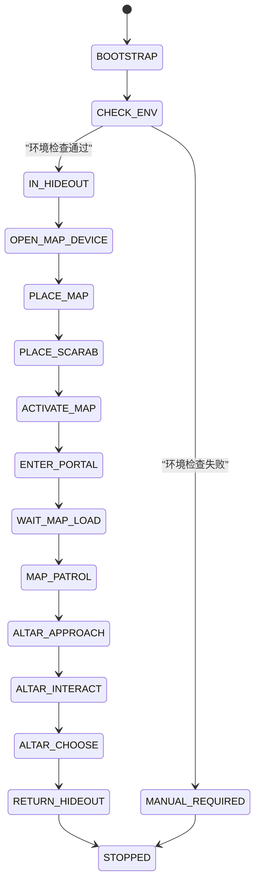
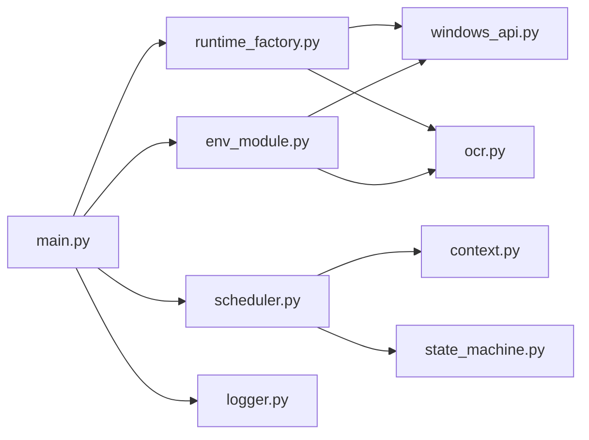

# 部署运维指南

<cite>
**本文引用的文件**
- [src/main.py](file://src/main.py)
- [config/app.config.json](file://config/app.config.json)
- [config/resolution.config.json](file://config/resolution.config.json)
- [config/templates.config.json](file://config/templates.config.json)
- [config/roi.config.json](file://config/roi.config.json)
- [src/utils/logger.py](file://src/utils/logger.py)
- [src/utils/windows_api.py](file://src/utils/windows_api.py)
- [src/vision/ocr.py](file://src/vision/ocr.py)
- [src/core/scheduler.py](file://src/core/scheduler.py)
- [src/core/context.py](file://src/core/context.py)
- [src/core/state_machine.py](file://src/core/state_machine.py)
- [src/core/runtime_factory.py](file://src/core/runtime_factory.py)
- [src/modules/env_module.py](file://src/modules/env_module.py)
</cite>

## 目录
1. [简介](#简介)
2. [项目结构](#项目结构)
3. [核心组件](#核心组件)
4. [架构总览](#架构总览)
5. [详细组件分析](#详细组件分析)
6. [依赖关系分析](#依赖关系分析)
7. [性能考虑](#性能考虑)
8. [故障排查指南](#故障排查指南)
9. [结论](#结论)
10. [附录](#附录)

## 简介
本指南面向生产环境部署与运维，覆盖前置条件、启动流程、日志系统、Windows API 集成注意事项、监控告警建议、故障排查与性能调优。项目基于 Python 实现，使用 Tesseract OCR 进行文本识别，并通过 Windows API 完成截图、输入等底层操作。应用以状态机驱动调度，具备平台验证、恢复机制与可配置的运行模式（DryRun/Windows）。

## 项目结构
- 入口与装配：主程序加载配置、创建日志、构建运行时适配器、初始化校验器与调度器并运行。
- 配置中心：应用运行参数、分辨率与窗口设置、模板与 ROI 区域定义。
- 视觉与OCR：截图、模板匹配、ROI裁剪、Tesseract OCR 调用与预处理。
- 平台适配：Windows 截图、输入控制、OCR 后端；以及 DryRun 模拟实现。
- 调度与控制：状态机、守卫（超时/重试）、上下文状态管理。
- 工具与诊断：ROI 标定、模板采集、OCR 测试脚本。

**图表来源**
- [src/main.py:22-50](file://src/main.py#L22-L50)
- [src/core/runtime_factory.py:30-77](file://src/core/runtime_factory.py#L30-L77)
- [src/utils/windows_api.py:121-377](file://src/utils/windows_api.py#L121-L377)
- [src/vision/ocr.py:23-70](file://src/vision/ocr.py#L23-L70)
- [src/core/scheduler.py:32-83](file://src/core/scheduler.py#L32-L83)
- [src/modules/env_module.py:23-88](file://src/modules/env_module.py#L23-L88)
- [src/core/context.py:10-62](file://src/core/context.py#L10-L62)
- [src/core/state_machine.py:6-42](file://src/core/state_machine.py#L6-L42)
- [config/app.config.json:1-23](file://config/app.config.json#L1-L23)
- [config/resolution.config.json:1-8](file://config/resolution.config.json#L1-L8)

**章节来源**
- [src/main.py:22-50](file://src/main.py#L22-L50)
- [config/app.config.json:1-23](file://config/app.config.json#L1-L23)
- [config/resolution.config.json:1-8](file://config/resolution.config.json#L1-L8)

## 核心组件
- 启动与装配：读取应用与分辨率配置，创建日志，构建运行时适配器（截图、模板匹配、OCR、输入），初始化平台校验器与调度器，进入主循环。
- 运行时适配器：根据运行模式选择 Windows 真实适配或 DryRun 模拟；解析模板根路径、模板配置、ROI 配置与 OCR 参数。
- 平台验证：执行截图、模板匹配、OCR、输入链路检查，输出通过/失败与建议项。
- 调度器：维护状态机、守卫（超时/重试）、上下文状态转换，处理 CHECK_ENV 与占位状态推进。
- 状态机：定义从引导到人工接管/停止的流转策略。
- 日志系统：统一格式、控制台与文件双输出，按模块命名空间隔离。
- Windows API：窗口枚举、客户区捕获、鼠标键盘输入、坐标转换。
- OCR：Tesseract 子进程调用、TSV 解析、图像预处理（灰度化、二值化、Otsu阈值、缩放）与调试图生成。

**章节来源**
- [src/core/runtime_factory.py:30-77](file://src/core/runtime_factory.py#L30-L77)
- [src/modules/env_module.py:23-88](file://src/modules/env_module.py#L23-L88)
- [src/core/scheduler.py:32-83](file://src/core/scheduler.py#L32-L83)
- [src/core/state_machine.py:6-42](file://src/core/state_machine.py#L6-L42)
- [src/utils/logger.py:11-39](file://src/utils/logger.py#L11-L39)
- [src/utils/windows_api.py:121-377](file://src/utils/windows_api.py#L121-L377)
- [src/vision/ocr.py:23-70](file://src/vision/ocr.py#L23-L70)

## 架构总览
应用采用“配置驱动 + 适配器抽象 + 状态机调度”的架构。启动时加载配置并装配运行时能力；调度器在守卫保护下推进状态；平台验证确保截图、模板、OCR、输入链路可用；Windows API 提供底层截图与输入；OCR 通过 Tesseract 子进程完成文本识别。

**图表来源**
- [src/main.py:22-50](file://src/main.py#L22-L50)
- [src/core/runtime_factory.py:30-77](file://src/core/runtime_factory.py#L30-L77)
- [src/core/scheduler.py:32-83](file://src/core/scheduler.py#L32-L83)
- [src/modules/env_module.py:38-88](file://src/modules/env_module.py#L38-L88)
- [src/utils/windows_api.py:121-377](file://src/utils/windows_api.py#L121-L377)
- [src/vision/ocr.py:23-70](file://src/vision/ocr.py#L23-L70)
- [src/utils/logger.py:11-39](file://src/utils/logger.py#L11-L39)

## 详细组件分析

### 启动流程与环境验证
- 配置加载：读取应用配置与分辨率配置，确定运行模式、日志目录、窗口标题关键词、OCR 语言与 PSM、模板与 ROI 路径。
- 日志初始化：为 bootstrap 模块创建日志实例，输出包含时间、级别、模块名与消息。
- 运行时装配：根据运行模式选择 Windows 或 DryRun 适配器，解析模板根路径与配置文件路径。
- 平台验证：执行截图、模板匹配、OCR、输入四项检查，汇总通过情况与错误信息，并给出下一步建议。
- 调度器运行：进入 CHECK_ENV 后根据验证结果决定是否继续或转入人工接管/停止。

**图表来源**
- [src/main.py:22-50](file://src/main.py#L22-L50)
- [src/core/runtime_factory.py:30-77](file://src/core/runtime_factory.py#L30-L77)
- [src/modules/env_module.py:38-88](file://src/modules/env_module.py#L38-L88)
- [src/core/scheduler.py:32-83](file://src/core/scheduler.py#L32-L83)

**章节来源**
- [src/main.py:22-50](file://src/main.py#L22-L50)
- [config/app.config.json:1-23](file://config/app.config.json#L1-L23)
- [config/resolution.config.json:1-8](file://config/resolution.config.json#L1-L8)
- [src/core/runtime_factory.py:30-77](file://src/core/runtime_factory.py#L30-L77)
- [src/modules/env_module.py:38-88](file://src/modules/env_module.py#L38-L88)
- [src/core/scheduler.py:32-83](file://src/core/scheduler.py#L32-L83)

### 日志系统配置与使用
- 日志获取：按名称缓存 Logger，避免重复创建；支持自定义日志目录。
- 输出格式：控制台与文件双输出，统一包含时间、级别、模块名与消息。
- 文件位置：默认写入应用配置的 log_dir 下的 automation.log。
- 使用建议：为不同模块分配独立 logger 名称，便于过滤与定位问题。

**章节来源**
- [src/utils/logger.py:11-39](file://src/utils/logger.py#L11-L39)
- [config/app.config.json:6-8](file://config/app.config.json#L6-L8)

### Windows API 集成注意事项
- 权限要求：需要能枚举可见窗口、获取客户区矩形、设置前台窗口、发送输入事件。建议在具有足够桌面交互权限的会话中运行。
- 兼容性：窗口标题关键词需稳定命中目标游戏窗口；多显示器环境下坐标转换需正确；某些全屏或独占模式可能影响截图与输入。
- 性能优化：减少频繁切换前台窗口；批量发送输入；合理设置截图区域与频率；避免阻塞式等待。
- 关键能力：
  - 窗口查找与激活：枚举可见窗口、获取客户区尺寸、设置前台窗口。
  - 截图：BitBlt 拷贝客户区像素至内存 DC，再导出 BMP。
  - 输入：鼠标点击与按键通过 SendInput 注入。

**图表来源**
- [src/utils/windows_api.py:107-196](file://src/utils/windows_api.py#L107-L196)
- [src/utils/windows_api.py:199-377](file://src/utils/windows_api.py#L199-L377)

**章节来源**
- [src/utils/windows_api.py:121-377](file://src/utils/windows_api.py#L121-L377)

### OCR 子系统与 Tesseract 配置
- 后端：通过子进程调用 Tesseract，支持自定义命令、语言与 PSM。
- 输入：图像路径必须存在；输出为 TSV，解析为文本与置信度。
- 预处理：ROI 裁剪、灰度化、二值化（Otsu 阈值）、可选放大以提升识别率；支持生成调试图（原始、灰度、二值）。
- 配置要点：
  - ocr_language：语言包需安装对应数据文件。
  - ocr_psm：页面分割模式，针对固定 UI 文本通常使用适合的模式。
  - ocr_tesseract_cmd：若不在 PATH，需配置完整路径。
  - roi_config：为 OCR 指定稳定区域，降低背景干扰。

**图表来源**
- [src/vision/ocr.py:73-107](file://src/vision/ocr.py#L73-L107)
- [src/vision/ocr.py:144-177](file://src/vision/ocr.py#L144-L177)
- [src/vision/ocr.py:179-200](file://src/vision/ocr.py#L179-L200)
- [src/vision/ocr.py:23-70](file://src/vision/ocr.py#L23-L70)
- [config/app.config.json:10-12](file://config/app.config.json#L10-L12)
- [config/roi.config.json:1-31](file://config/roi.config.json#L1-L31)

**章节来源**
- [src/vision/ocr.py:23-70](file://src/vision/ocr.py#L23-L70)
- [src/vision/ocr.py:73-107](file://src/vision/ocr.py#L73-L107)
- [src/vision/ocr.py:144-177](file://src/vision/ocr.py#L144-L177)
- [src/vision/ocr.py:179-200](file://src/vision/ocr.py#L179-L200)
- [config/app.config.json:10-12](file://config/app.config.json#L10-L12)
- [config/roi.config.json:1-31](file://config/roi.config.json#L1-L31)

### 状态机与调度
- 状态定义：包括引导、环境检查、地图相关阶段、祭坛交互、回城、恢复、未知、人工接管与停止。
- 流转策略：引导后进入环境检查；通过后进入业务阶段；遇到未知或异常转入人工接管或停止。
- 守卫机制：状态超时触发重恢复或终止；重试计数与状态计时用于诊断。
- 上下文：记录当前/上一状态、轮次、置信度、截图路径、标志位与元数据。

**图表来源**
- [src/core/context.py:10-29](file://src/core/context.py#L10-L29)
- [src/core/state_machine.py:6-42](file://src/core/state_machine.py#L6-L42)
- [src/core/scheduler.py:32-83](file://src/core/scheduler.py#L32-L83)

**章节来源**
- [src/core/context.py:10-62](file://src/core/context.py#L10-L62)
- [src/core/state_machine.py:6-42](file://src/core/state_machine.py#L6-L42)
- [src/core/scheduler.py:32-83](file://src/core/scheduler.py#L32-L83)

## 依赖关系分析
- 外部依赖：
  - Python 标准库：logging、subprocess、ctypes、wintypes、pathlib、json、csv、io、struct、shutil、time、enum、dataclasses、typing。
  - Tesseract OCR：命令行工具与语言数据包。
  - Windows 系统 DLL：user32、gdi32。
- 内部依赖：
  - main 依赖 runtime_factory、scheduler、env_module、logger。
  - runtime_factory 依赖 vision contracts、input contracts、pathing。
  - scheduler 依赖 context、guards、state_machine、env_module、recovery_module、logger。
  - env_module 依赖 screenshot/template/ocr/input 契约。
  - windows_api 被截图与输入适配器使用。
  - ocr 依赖 bitmap、roi 与 tesseract。

**图表来源**
- [src/main.py:22-50](file://src/main.py#L22-L50)
- [src/core/runtime_factory.py:30-77](file://src/core/runtime_factory.py#L30-L77)
- [src/core/scheduler.py:32-83](file://src/core/scheduler.py#L32-L83)
- [src/modules/env_module.py:23-88](file://src/modules/env_module.py#L23-L88)
- [src/utils/windows_api.py:121-377](file://src/utils/windows_api.py#L121-L377)
- [src/vision/ocr.py:23-70](file://src/vision/ocr.py#L23-L70)

**章节来源**
- [src/main.py:22-50](file://src/main.py#L22-L50)
- [src/core/runtime_factory.py:30-77](file://src/core/runtime_factory.py#L30-L77)
- [src/core/scheduler.py:32-83](file://src/core/scheduler.py#L32-L83)
- [src/modules/env_module.py:23-88](file://src/modules/env_module.py#L23-L88)
- [src/utils/windows_api.py:121-377](file://src/utils/windows_api.py#L121-L377)
- [src/vision/ocr.py:23-70](file://src/vision/ocr.py#L23-L70)

## 性能考虑
- 截图与输入：
  - 减少频繁切换前台窗口与重复坐标转换。
  - 批量发送输入事件，避免逐条阻塞。
  - 合理设置截图频率与 ROI，降低图像处理开销。
- OCR：
  - 使用稳定的 ROI 区域，减少噪声。
  - 选择合适的 PSM 与语言包，提高识别准确率与速度。
  - 对复杂场景启用二值化与适度放大，但注意计算成本。
- 状态与守卫：
  - 合理设置状态超时与最大重试次数，避免长时间卡死。
  - 利用上下文元数据记录关键指标（置信度、截图路径、错误信息）。
- 资源管理：
  - 及时释放句柄与对象，避免内存泄漏。
  - 日志滚动与清理，防止磁盘占用过高。

[本节为通用指导，不直接分析具体文件]

## 故障排查指南
- 启动失败：
  - 检查应用配置中的运行模式、日志目录、窗口标题关键词、OCR 参数是否正确。
  - 确认分辨率配置与游戏窗口模式一致。
- 平台验证失败：
  - 截图链路：确认目标窗口可见且可枚举；检查 DPI 与多显示器设置。
  - 模板匹配：核对模板路径与阈值；确认 ROI 标定准确。
  - OCR 链路：确认 Tesseract 可执行文件可达、语言包已安装；检查 PSM 与 ROI。
  - 输入链路：确认前台窗口切换成功；按键映射有效。
- 状态超时：
  - 查看调度器日志中的状态与错误；调整超时与重试策略。
  - 结合截图路径与调试图定位画面漂移或识别失败原因。
- Windows API 异常：
  - 检查 user32/gdi32 调用返回值与最后错误码。
  - 确认权限与窗口焦点；避免在受限会话中运行。
- 日志与诊断：
  - 使用模块化 logger 名称过滤日志。
  - 收集自动化日志、截图与调试图，复现问题。

**章节来源**
- [src/core/scheduler.py:32-83](file://src/core/scheduler.py#L32-L83)
- [src/modules/env_module.py:38-88](file://src/modules/env_module.py#L38-L88)
- [src/utils/windows_api.py:117-196](file://src/utils/windows_api.py#L117-L196)
- [src/utils/logger.py:11-39](file://src/utils/logger.py#L11-L39)
- [config/app.config.json:1-23](file://config/app.config.json#L1-L23)

## 结论
本项目以配置驱动与适配器抽象为核心，结合状态机调度与平台验证，形成可插拔、可扩展的自动化框架。生产部署需重点关注 Tesseract 配置、Windows API 权限与稳定性、日志与监控体系。通过合理的性能调优与故障排查流程，可在固定环境下实现稳定可靠的自动化流程。

[本节为总结性内容，不直接分析具体文件]

## 附录

### 生产环境部署要求
- Python 版本：建议使用现代稳定版本（如 3.9+），确保标准库与 ctypes/wintypes 兼容。
- 依赖库安装：
  - 仅使用 Python 标准库，无需额外第三方包。
  - 安装 Tesseract OCR 可执行文件与所需语言数据包（如 eng）。
- Tesseract 配置：
  - 在应用配置中设置 ocr_tesseract_cmd、ocr_language、ocr_psm。
  - 将 Tesseract 加入 PATH 或在配置中指定绝对路径。
- 运行模式：
  - 首次部署建议 DryRun 模式验证链路，再切换到 Windows 真实模式。
- 窗口与分辨率：
  - 固定分辨率与窗口模式；UI 缩放与语言保持一致。
  - 配置 window_title_keyword 以稳定命中目标窗口。

**章节来源**
- [config/app.config.json:1-23](file://config/app.config.json#L1-L23)
- [config/resolution.config.json:1-8](file://config/resolution.config.json#L1-L8)
- [src/core/runtime_factory.py:30-77](file://src/core/runtime_factory.py#L30-L77)

### 应用程序启动流程（步骤清单）
- 加载配置：读取 app.config.json 与 resolution.config.json。
- 初始化日志：创建 bootstrap 模块日志实例。
- 构建适配器：根据运行模式装配截图、模板匹配、OCR、输入能力。
- 平台验证：执行截图、模板、OCR、输入检查，输出报告与建议。
- 调度运行：进入 CHECK_ENV，通过后推进业务状态；失败则转入人工接管或停止。

**章节来源**
- [src/main.py:22-50](file://src/main.py#L22-L50)
- [src/core/scheduler.py:32-83](file://src/core/scheduler.py#L32-L83)
- [src/modules/env_module.py:38-88](file://src/modules/env_module.py#L38-L88)

### 监控与告警建议
- 关键指标：
  - 截图成功率、模板匹配成功率、OCR 识别成功率、输入成功率。
  - 状态超时次数、重试次数、人工接管次数。
  - 单轮耗时、连续运行轮数。
- 数据采集：
  - 在调度器与平台验证处记录指标到日志或外部监控系统。
  - 保存截图与调试图作为证据与回溯依据。
- 异常通知：
  - 当出现连续失败、状态超时、未知弹窗或截图/输入链路异常时，触发告警。
  - 结合日志级别与关键字过滤，快速定位问题。

**章节来源**
- [src/core/scheduler.py:32-83](file://src/core/scheduler.py#L32-L83)
- [src/modules/env_module.py:38-88](file://src/modules/env_module.py#L38-L88)
- [src/utils/logger.py:11-39](file://src/utils/logger.py#L11-L39)

### 性能调优最佳实践
- 稳定 ROI 与模板：减少误识别与重算。
- 合理 OCR 参数：语言包与 PSM 匹配场景，必要时启用二值化与放大。
- 输入节流与批量：避免高频切换与重复操作。
- 资源释放：及时关闭句柄与对象，防止内存增长。
- 日志与诊断：保留必要日志与截图，定期清理冗余数据。

[本节为通用指导，不直接分析具体文件]