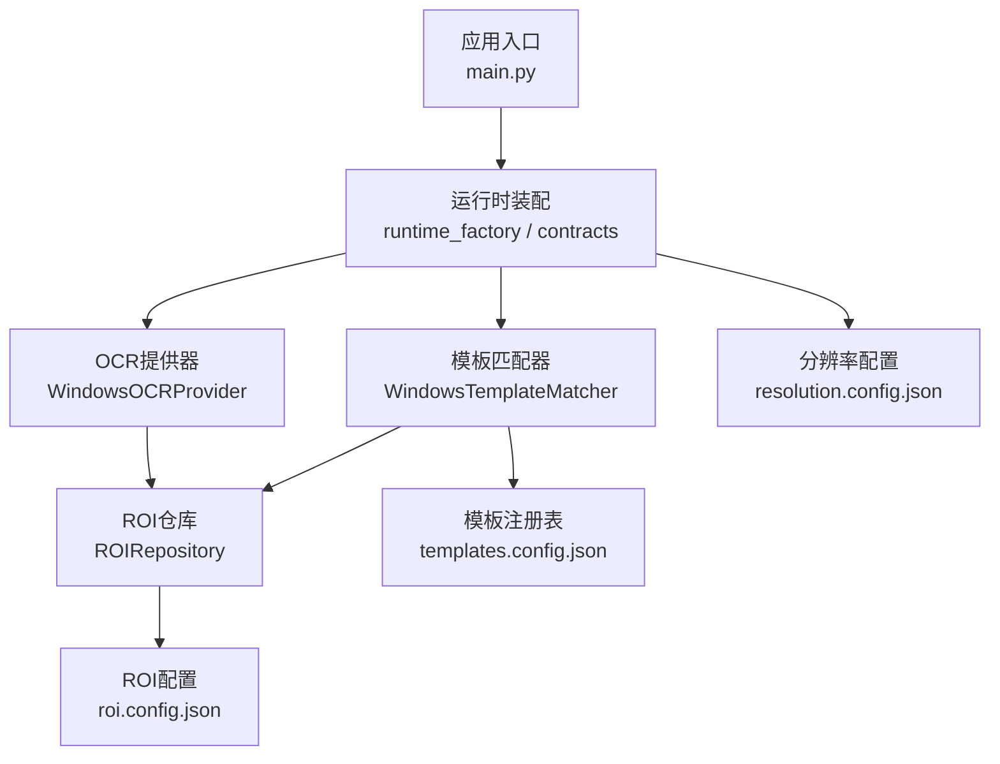
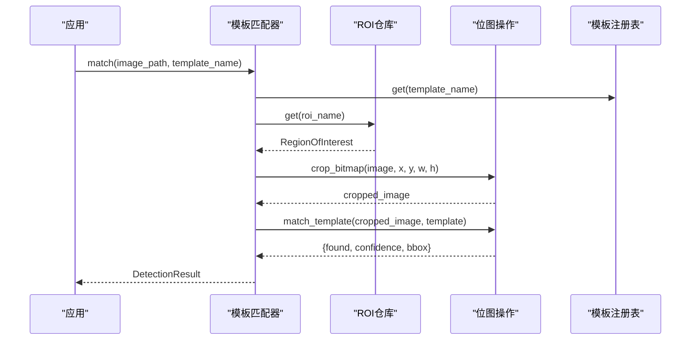
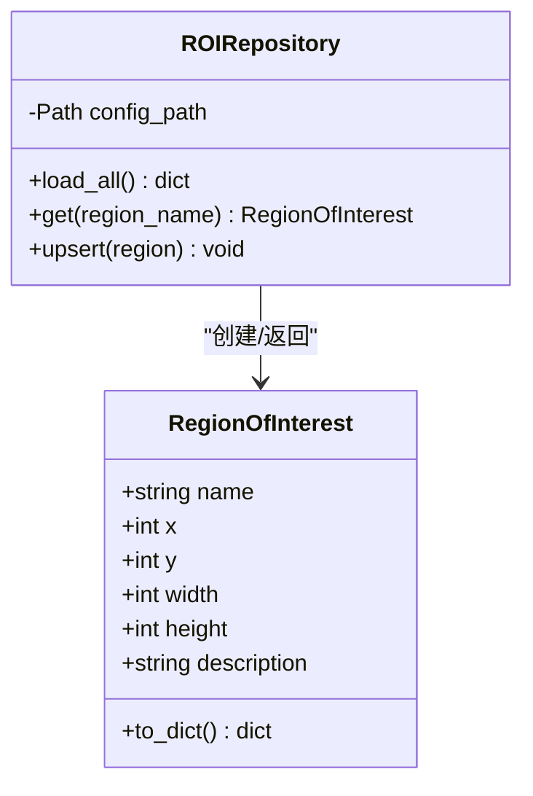
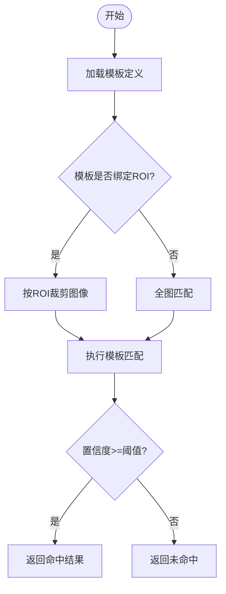
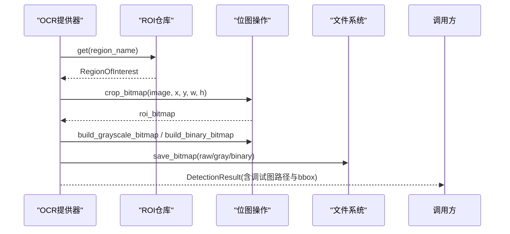
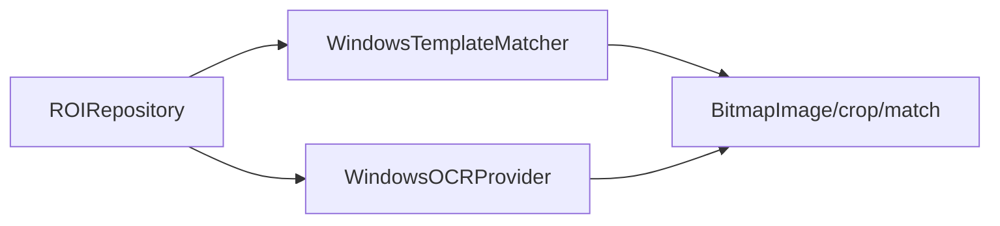
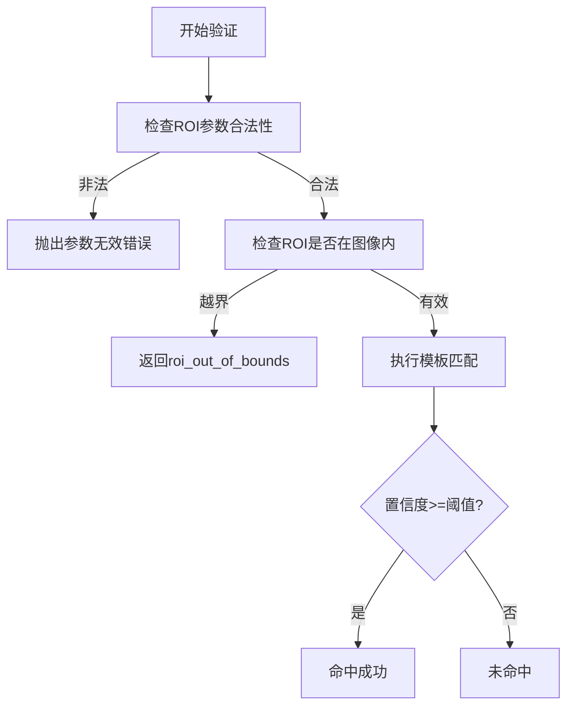

# ROI配置说明

<cite>
**本文引用的文件**
- [roi.config.json](file://config/roi.config.json)
- [resolution.config.json](file://config/resolution.config.json)
- [templates.config.json](file://config/templates.config.json)
- [app.config.json](file://config/app.config.json)
- [roi.py](file://src/vision/roi.py)
- [bitmap.py](file://src/vision/bitmap.py)
- [contracts.py](file://src/vision/contracts.py)
- [ocr.py](file://src/vision/ocr.py)
- [calibrate_roi.py](file://tools/calibrate_roi.py)
- [capture_roi.py](file://tools/capture_roi.py)
- [collect_template.py](file://tools/collect_template.py)
- [test_ocr.py](file://tools/test_ocr.py)
</cite>

## 目录
1. [简介](#简介)
2. [项目结构](#项目结构)
3. [核心组件](#核心组件)
4. [架构总览](#架构总览)
5. [详细组件分析](#详细组件分析)
6. [依赖关系分析](#依赖关系分析)
7. [性能与分辨率适配](#性能与分辨率适配)
8. [ROI标定工具使用指南](#roi标定工具使用指南)
9. [验证规则与调试方法](#验证规则与调试方法)
10. [常见布局的ROI配置示例](#常见布局的roi配置示例)
11. [结论](#结论)

## 简介
本文件面向开发者与维护者，系统化说明 ROI（感兴趣区域）在配置文件中的定义方式、坐标系统、基本属性、类型划分、与模板匹配的关联、不同分辨率下的适配策略、标定与调试流程，以及常见界面布局的配置参考。目标是帮助你在复杂界面中快速、准确地完成区域划分与定位问题排查。

## 项目结构
本项目将 ROI 相关能力集中在 vision 层，并通过 JSON 配置文件进行声明式管理：
- 配置文件位于 config 目录，包含 ROI、模板、分辨率与应用运行参数。
- 运行时通过 ROIRepository 加载 ROI 配置，供模板匹配、OCR 等模块裁剪图像或限定搜索范围。
- 工具脚本提供 ROI 标定、裁切、模板采集与 OCR 测试能力。

图表来源
- [contracts.py:119-185](file://src/vision/contracts.py#L119-L185)
- [ocr.py:73-107](file://src/vision/ocr.py#L73-L107)
- [roi.py:21-67](file://src/vision/roi.py#L21-L67)
- [app.config.json:1-23](file://config/app.config.json#L1-L23)

章节来源
- [app.config.json:1-23](file://config/app.config.json#L1-L23)
- [roi.py:21-67](file://src/vision/roi.py#L21-L67)
- [contracts.py:119-185](file://src/vision/contracts.py#L119-L185)
- [ocr.py:73-107](file://src/vision/ocr.py#L73-L107)

## 核心组件
- RegionOfInterest：表示一个 ROI 的基本数据模型，包含名称、左上角坐标(x, y)、宽高(width, height)和可选描述。
- ROIRepository：负责从 roi.config.json 加载、查询、更新 ROI 配置，并持久化到磁盘。
- WindowsTemplateMatcher：模板匹配时，若模板绑定了 ROI，则先按 ROI 裁剪截图再执行匹配，避免全图扫描的性能问题。
- WindowsOCRProvider：OCR 预处理阶段会按 ROI 裁剪图像，生成灰度与二值化调试图，便于识别与排错。
- BitmapImage 与 crop_bitmap/match_template：底层位图操作与模板匹配实现，提供边界校验与相似度计算。

章节来源
- [roi.py:8-67](file://src/vision/roi.py#L8-L67)
- [contracts.py:119-185](file://src/vision/contracts.py#L119-L185)
- [ocr.py:73-107](file://src/vision/ocr.py#L73-L107)
- [bitmap.py:100-165](file://src/vision/bitmap.py#L100-L165)

## 架构总览
ROI 在整个视觉链路中的作用是“缩小搜索空间”和“限定处理范围”。模板匹配与 OCR 都依赖 ROI 来裁剪图像，从而提升性能与稳定性。

图表来源
- [contracts.py:119-185](file://src/vision/contracts.py#L119-L185)
- [roi.py:21-67](file://src/vision/roi.py#L21-L67)
- [bitmap.py:100-165](file://src/vision/bitmap.py#L100-L165)

## 详细组件分析

### ROI数据模型与配置加载
- 数据模型：RegionOfInterest 以 name、x、y、width、height、description 构成最小可用单元。
- 配置加载：ROIRepository.load_all 读取 roi.config.json，将每个键值对转换为 RegionOfInterest 对象；get 支持按名称检索；upsert 支持新增或更新并写回 JSON。
- 坐标系统：采用屏幕像素坐标系，原点(0,0)位于左上角，x向右增加，y向下增加。所有裁剪与匹配均基于该坐标系。

图表来源
- [roi.py:8-67](file://src/vision/roi.py#L8-L67)

章节来源
- [roi.py:8-67](file://src/vision/roi.py#L8-L67)
- [roi.config.json:1-31](file://config/roi.config.json#L1-L31)

### ROI与模板匹配的关联
- 模板注册：templates.config.json 中每个模板可绑定一个 roi 名称，用于限定匹配区域。
- 匹配流程：WindowsTemplateMatcher 在匹配前根据模板绑定的 ROI 裁剪图像；若 ROI 越界，返回安全失败结果，并在 extra 中标记错误原因，便于诊断。
- 阈值控制：匹配结果是否命中由模板配置的 threshold 决定。

图表来源
- [contracts.py:119-185](file://src/vision/contracts.py#L119-L185)
- [templates.config.json:1-9](file://config/templates.config.json#L1-L9)
- [bitmap.py:118-165](file://src/vision/bitmap.py#L118-L165)

章节来源
- [contracts.py:119-185](file://src/vision/contracts.py#L119-L185)
- [templates.config.json:1-9](file://config/templates.config.json#L1-L9)
- [bitmap.py:118-165](file://src/vision/bitmap.py#L118-L165)

### ROI与OCR的关联
- OCR预处理：WindowsOCRProvider 使用 ROI 裁剪原始截图，生成 raw、gray、binary 三张调试图，并保存至 debug 目录，便于人工核对与调参。
- 输出信息：DetectionResult 中包含 region_name、各调试图路径、bbox 等，辅助定位问题。

图表来源
- [ocr.py:73-107](file://src/vision/ocr.py#L73-L107)
- [contracts.py:188-251](file://src/vision/contracts.py#L188-L251)

章节来源
- [ocr.py:73-107](file://src/vision/ocr.py#L73-L107)
- [contracts.py:188-251](file://src/vision/contracts.py#L188-L251)

### ROI类型与组合使用
当前代码库中 ROI 为“矩形区域”，没有内置“全屏”“局部”“动态”等类型字段。实际使用中可通过以下方式表达不同类型：
- 全屏区域：设置 x=0, y=0, width=屏幕宽度, height=屏幕高度。
- 局部区域：根据界面元素位置设置具体 x, y, width, height。
- 动态区域：通过外部逻辑计算新的 x, y, width, height 后调用 upsert 更新配置，或在运行时缓存计算结果并传入裁剪函数。
- 组合使用：多个 ROI 可分别对应不同 UI 模块；模板匹配与 OCR 各自绑定所需 ROI，互不干扰。

注意：当前 ROIRepository 不支持嵌套 ROI 或复合区域表达式；如需复杂组合，建议在业务层维护 ROI 集合并按需裁剪。

章节来源
- [roi.py:8-67](file://src/vision/roi.py#L8-L67)
- [roi.config.json:1-31](file://config/roi.config.json#L1-L31)

## 依赖关系分析
- ROIRepository 被模板匹配器与 OCR 提供器共同依赖，作为统一的 ROI 访问入口。
- 模板匹配器依赖模板注册表与 ROI 仓库，结合位图裁剪与匹配算法完成检测。
- OCR 提供器依赖 ROI 仓库进行图像预处理，并输出调试图路径以便回溯。
- 分辨率配置影响截图尺寸与 ROI 有效性，需在更换分辨率时重新标定 ROI。

图表来源
- [contracts.py:119-185](file://src/vision/contracts.py#L119-L185)
- [ocr.py:73-107](file://src/vision/ocr.py#L73-L107)
- [bitmap.py:100-165](file://src/vision/bitmap.py#L100-L165)

章节来源
- [contracts.py:119-185](file://src/vision/contracts.py#L119-L185)
- [ocr.py:73-107](file://src/vision/ocr.py#L73-L107)
- [bitmap.py:100-165](file://src/vision/bitmap.py#L100-L165)

## 性能与分辨率适配
- 性能特性：模板匹配为纯 Python 实现，复杂度与 ROI 面积成正比。因此务必配合 ROI 裁剪，避免全图暴力扫描。
- 分辨率适配：
  - 当分辨率变化时，ROI 坐标与尺寸可能失效。应在新分辨率下重新标定 ROI。
  - 若需缩放适配，可在业务层按分辨率比例计算新 ROI，再写入配置或运行时裁剪。
  - 当前代码未内置自动缩放逻辑，建议在上层封装缩放计算后再调用 ROI 与裁剪。
- 调试建议：使用 OCR 调试图与 ROI 裁切工具验证 ROI 是否正确覆盖目标区域。

章节来源
- [bitmap.py:118-165](file://src/vision/bitmap.py#L118-L165)
- [ocr.py:73-107](file://src/vision/ocr.py#L73-L107)
- [resolution.config.json:1-8](file://config/resolution.config.json#L1-L8)

## ROI标定工具使用指南
- 标定与更新：使用 calibrate_roi.py 写入或更新 ROI 配置。需提供 roi-config、name、x、y、width、height、description。
- 裁切验证：使用 capture_roi.py 从 BMP 截图中按 ROI 裁切并保存，验证 ROI 是否准确。
- 模板采集：使用 collect_template.py 从截图中按 ROI 采集模板文件，便于后续模板匹配。
- OCR 测试：使用 test_ocr.py 进行端到端测试，包括截图、ROI 裁切、预处理、OCR 识别，并输出调试图。

推荐工作流：
1. 截取目标窗口截图（BMP）。
2. 使用 calibrate_roi.py 标定 ROI。
3. 使用 capture_roi.py 验证裁切效果。
4. 使用 collect_template.py 采集模板。
5. 在 templates.config.json 中绑定模板与 ROI。
6. 运行 test_ocr.py 或主流程验证识别与匹配效果。

章节来源
- [calibrate_roi.py:14-42](file://tools/calibrate_roi.py#L14-L42)
- [capture_roi.py:15-37](file://tools/capture_roi.py#L15-L37)
- [collect_template.py:15-37](file://tools/collect_template.py#L15-L37)
- [test_ocr.py:26-41](file://tools/test_ocr.py#L26-L41)

## 验证规则与调试方法
- 验证规则：
  - ROI 参数必须满足 x>=0, y>=0, width>0, height>0，且 ROI 右下角不得超出图像边界。
  - 模板匹配要求模板像素格式与搜索图像一致，且模板尺寸不大于搜索图像。
  - 若 ROI 越界，模板匹配器返回安全失败结果，并在 extra 中标记错误原因。
- 调试方法：
  - 使用 OCR 调试图（raw/gray/binary）检查 ROI 裁剪是否正确。
  - 使用 capture_roi.py 输出 ROI 裁切图，直观核对区域。
  - 查看 DetectionResult.extra 中的模板路径、阈值、ROI 名称与错误信息，快速定位问题。
  - 调整模板阈值与 ROI 尺寸，确保稳定命中。

图表来源
- [bitmap.py:100-165](file://src/vision/bitmap.py#L100-L165)
- [contracts.py:119-185](file://src/vision/contracts.py#L119-L185)

章节来源
- [bitmap.py:100-165](file://src/vision/bitmap.py#L100-L165)
- [contracts.py:119-185](file://src/vision/contracts.py#L119-L185)

## 常见布局的ROI配置示例
以下为常见界面布局的 ROI 配置思路与参考模板，请根据实际分辨率与界面元素位置调整数值：
- 顶部状态栏：x=0, y=0, width=屏幕宽度, height=固定高度（如 40-60）。
- 左侧导航面板：x=0, y=导航起始Y, width=面板宽度, height=面板高度。
- 右侧信息面板：x=右侧起始X, y=面板起始Y, width=面板宽度, height=面板高度。
- 中央内容区：x=内容起始X, y=内容起始Y, width=内容宽度, height=内容高度。
- 底部工具栏：x=0, y=底部起始Y, width=屏幕宽度, height=固定高度。

参考模板（JSON 结构示意）：
- 顶部状态栏：{ "top_bar": { "x": 0, "y": 0, "width": 1920, "height": 40, "description": "顶部状态栏" } }
- 左侧导航：{ "left_nav": { "x": 0, "y": 40, "width": 200, "height": 1040, "description": "左侧导航面板" } }
- 右侧信息：{ "right_info": { "x": 1720, "y": 40, "width": 200, "height": 1040, "description": "右侧信息面板" } }
- 中央内容：{ "center_content": { "x": 200, "y": 40, "width": 1520, "height": 1040, "description": "中央内容区域" } }
- 底部工具栏：{ "bottom_toolbar": { "x": 0, "y": 1040, "width": 1920, "height": 40, "description": "底部工具栏" } }

说明：
- 上述数值仅为示例，实际使用时需根据 resolution.config.json 中的 width/height 与实际界面布局重新标定。
- 可使用 calibrate_roi.py 与 capture_roi.py 快速迭代与验证。

章节来源
- [resolution.config.json:1-8](file://config/resolution.config.json#L1-L8)
- [roi.config.json:1-31](file://config/roi.config.json#L1-L31)
- [calibrate_roi.py:14-42](file://tools/calibrate_roi.py#L14-L42)
- [capture_roi.py:15-37](file://tools/capture_roi.py#L15-L37)

## 结论
ROI 在本项目中承担“缩小搜索空间、提升性能与稳定性”的关键作用。通过 ROIRepository 统一管理 ROI 配置，模板匹配与 OCR 均可按需裁剪图像，减少误检与性能开销。对于多分辨率与复杂界面，建议：
- 在新分辨率下重新标定 ROI。
- 使用工具链（标定、裁切、模板采集、OCR测试）闭环验证。
- 借助调试图与错误信息快速定位问题。
- 在业务层封装分辨率缩放逻辑，统一输出 ROI 与裁剪参数。