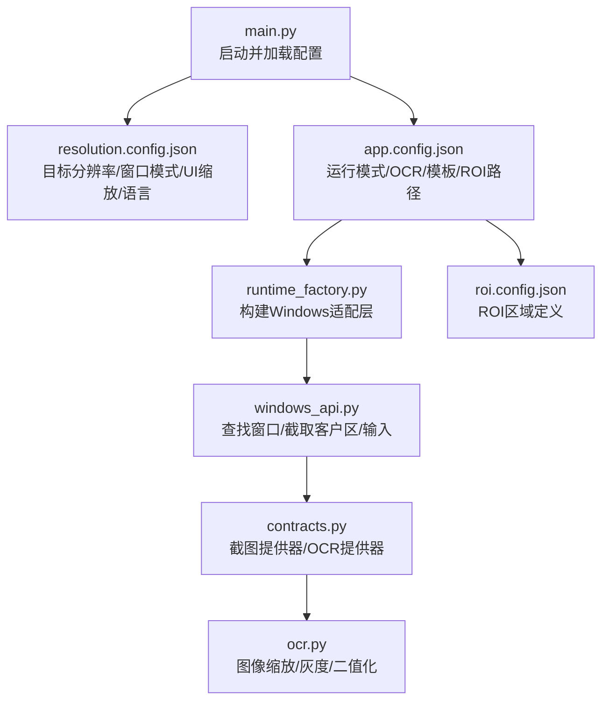
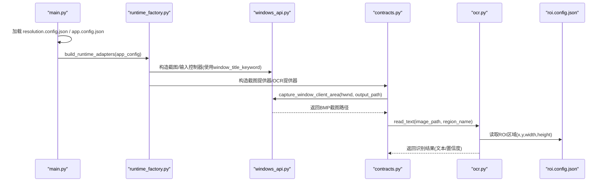
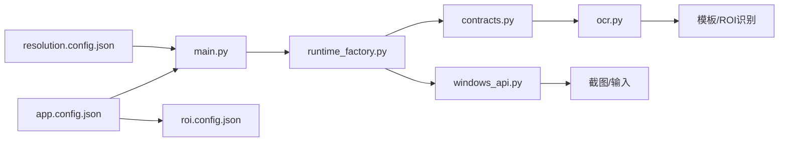

# 分辨率配置

<cite>
**本文引用的文件**
- [resolution.config.json](file://config/resolution.config.json)
- [app.config.json](file://config/app.config.json)
- [roi.config.json](file://config/roi.config.json)
- [main.py](file://src/main.py)
- [runtime_factory.py](file://src/core/runtime_factory.py)
- [windows_api.py](file://src/utils/windows_api.py)
- [contracts.py](file://src/vision/contracts.py)
- [ocr.py](file://src/vision/ocr.py)
- [calibrate_roi.py](file://tools/calibrate_roi.py)
- [capture_roi.py](file://tools/capture_roi.py)
- [README.md](file://README.md)
</cite>

## 目录
1. [简介](#简介)
2. [项目结构](#项目结构)
3. [核心组件](#核心组件)
4. [架构总览](#架构总览)
5. [详细组件分析](#详细组件分析)
6. [依赖关系分析](#依赖关系分析)
7. [性能考虑](#性能考虑)
8. [故障排查指南](#故障排查指南)
9. [结论](#结论)
10. [附录](#附录)

## 简介
本文件为“分辨率配置”的完整说明，围绕配置文件 resolution.config.json 的目标分辨率设置、显示模式与窗口模式、多显示器策略、UI 缩放与 DPI 感知、不同游戏分辨率下的配置示例与优化建议、自动适配检测的使用方式、分辨率变更后的重新校准流程，以及常见问题（黑边、模糊、错位等）的诊断与解决方案进行系统化阐述。文档同时结合当前代码库中的截图、OCR、ROI 标定与输入控制链路，给出可操作的实践指导。

## 项目结构
本项目将分辨率相关配置集中在 config/resolution.config.json，并在启动时由主程序加载；运行时通过 Windows API 获取目标窗口客户区尺寸进行截图，OCR 与模板匹配基于 ROI 配置在固定区域工作。整体结构如下：

图表来源
- [main.py:22-35](file://src/main.py#L22-L35)
- [runtime_factory.py:42-64](file://src/core/runtime_factory.py#L42-L64)
- [windows_api.py:228-283](file://src/utils/windows_api.py#L228-L283)
- [contracts.py:101-116](file://src/vision/contracts.py#L101-L116)
- [ocr.py:180-200](file://src/vision/ocr.py#L180-L200)

章节来源
- [main.py:22-35](file://src/main.py#L22-L35)
- [app.config.json:1-22](file://config/app.config.json#L1-L22)
- [resolution.config.json:1-7](file://config/resolution.config.json#L1-L7)

## 核心组件
- 分辨率配置文件 resolution.config.json
  - width：目标宽度（像素）
  - height：目标高度（像素）
  - window_mode：窗口模式标识（如 windowed_fullscreen）
  - ui_scale：UI 缩放比例
  - language：界面语言（如 zh-CN）
- 应用配置 app.config.json
  - runtime_mode：运行模式（windows/dry_run）
  - screenshot_dir/debug_dir/log_dir：输出目录
  - window_title_keyword：目标窗口标题关键词
  - ocr_language/ocr_psm/ocr_tesseract_cmd：OCR 后端参数
  - template_root/template_config_path/roi_config_path：模板与 ROI 配置路径
- ROI 配置 roi.config.json
  - 定义多个 ROI 区域的坐标与尺寸，用于 OCR 与模板匹配的稳定区域
- Windows 适配层
  - 通过 windows_api.py 查找目标窗口、截取客户区、发送输入事件
  - contracts.py 中封装截图提供器与 OCR 提供器
  - ocr.py 提供图像缩放、灰度转换、二值化等预处理能力

章节来源
- [resolution.config.json:1-7](file://config/resolution.config.json#L1-L7)
- [app.config.json:1-22](file://config/app.config.json#L1-L22)
- [roi.config.json:1-31](file://config/roi.config.json#L1-L31)
- [windows_api.py:228-283](file://src/utils/windows_api.py#L228-L283)
- [contracts.py:101-116](file://src/vision/contracts.py#L101-L116)
- [ocr.py:180-200](file://src/vision/ocr.py#L180-L200)

## 架构总览
下图展示从启动到截图、OCR、模板匹配的调用链，以及与分辨率配置的关联点。

图表来源
- [main.py:22-35](file://src/main.py#L22-L35)
- [runtime_factory.py:42-64](file://src/core/runtime_factory.py#L42-L64)
- [windows_api.py:228-283](file://src/utils/windows_api.py#L228-L283)
- [contracts.py:101-116](file://src/vision/contracts.py#L101-L116)
- [ocr.py:180-200](file://src/vision/ocr.py#L180-L200)
- [roi.config.json:1-31](file://config/roi.config.json#L1-L31)

## 详细组件分析

### 分辨率配置文件解析与使用
- 启动阶段 main.py 会加载 resolution.config.json 与 app.config.json，并记录当前分辨率与运行模式日志。
- 虽然当前实现主要依赖运行时通过 Windows API 获取窗口客户区尺寸进行截图，但 resolution.config.json 仍作为“期望目标分辨率”的配置入口，便于后续扩展（例如强制校验实际窗口尺寸是否与目标一致）。
- 建议将 resolution.config.json 与 ROI 配置保持一致的坐标系基准，确保 ROI 区域在目标分辨率下有效。

章节来源
- [main.py:22-35](file://src/main.py#L22-L35)
- [resolution.config.json:1-7](file://config/resolution.config.json#L1-L7)

### 目标分辨率设置方法
- width/height：设置目标分辨率（像素），应与游戏内显示设置一致，避免 UI 元素错位或识别失败。
- fps：当前配置文件中未包含刷新率字段；若需支持，可在后续版本扩展该字段，并结合系统显示驱动或游戏引擎接口进行刷新率校验。
- 建议：
  - 第一版采用固定分辨率策略，保证截图与识别稳定。
  - 在多显示器环境下，优先选择主显示器并以主显示器分辨率作为目标。

章节来源
- [resolution.config.json:1-7](file://config/resolution.config.json#L1-L7)
- [README.md:63-77](file://README.md#L63-L77)

### 显示模式与窗口模式配置
- window_mode：当前配置值为 windowed_fullscreen，表示无边框窗口模式（常见于现代游戏的“窗口化全屏”）。
- 其他模式建议：
  - 窗口模式：适合调试与多任务场景，便于定位窗口坐标与 ROI 标定。
  - 全屏独占：可能带来更高的渲染效率，但截图与输入需要更严格的窗口焦点管理。
  - 无边框窗口：兼顾沉浸感与窗口化操作便利性，推荐作为默认模式。
- 注意事项：
  - 切换模式后必须重新标定 ROI，因为边框、标题栏与缩放变化会影响坐标。
  - 保持游戏窗口置顶或固定位置，减少因窗口移动导致的识别漂移。

章节来源
- [resolution.config.json:1-7](file://config/resolution.config.json#L1-L7)
- [windows_api.py:228-283](file://src/utils/windows_api.py#L228-L283)

### 多显示器环境下的分辨率配置策略
- 主显示器选择：
  - 以主显示器为目标，确保窗口标题关键词能稳定命中目标游戏窗口。
  - 在 app.config.json 中设置 window_title_keyword，提高窗口查找稳定性。
- 副显示器处理：
  - 若游戏运行在副显示器，需调整窗口标题关键词或脚本运行环境，使 find_window 能正确定位。
  - 避免多显示器缩放不一致导致 ROI 偏移；建议在统一缩放比例下运行。
- 建议：
  - 固定显示器布局，避免热插拔或分辨率动态切换。
  - 在启动前验证目标窗口是否存在且可见，再执行截图与识别。

章节来源
- [app.config.json:1-22](file://config/app.config.json#L1-L22)
- [windows_api.py:121-158](file://src/utils/windows_api.py#L121-L158)

### UI 缩放与 DPI 感知
- ui_scale：当前配置项用于指示 UI 缩放比例；在 OCR 与模板匹配中，可通过图像缩放因子提升识别鲁棒性。
- 当前 OCR 模块支持按 scale 放大图像行与像素，有助于在高 DPI 或缩放下提升字符清晰度。
- 建议：
  - 在游戏内设置固定 UI 缩放（如 100%），并在 resolution.config.json 中记录对应 ui_scale。
  - 若 DPI 缩放导致 UI 模糊或识别失败，优先降低系统 DPI 或游戏内 UI 缩放，再重新标定 ROI。
  - 对 OCR 预处理使用灰度归一化与 Otsu 自适应二值化，提高文本对比度。

章节来源
- [resolution.config.json:1-7](file://config/resolution.config.json#L1-L7)
- [ocr.py:180-200](file://src/vision/ocr.py#L180-L200)
- [development.status.md:161-182](file://development.status.md#L161-L182)

### 不同游戏分辨率下的配置示例与优化建议
- 示例思路（不直接给出具体数值，仅描述配置要点）：
  - 1920x1080：推荐无边框窗口模式，UI 缩放 100%，ROI 区域在该分辨率下标定。
  - 2560x1440：若游戏支持原生高分辨率，需重新标定 ROI；OCR 可适当增大 scale 以提升识别率。
  - 低分辨率（如 1280x720）：谨慎使用，可能导致 UI 元素过小，模板匹配阈值需调高。
- 优化建议：
  - 固定分辨率与 UI 缩放，避免运行时动态切换。
  - 使用 ROI 裁剪减少噪声区域，提高模板匹配与 OCR 速度。
  - 对关键 UI 区域做多次采样，建立模板库并设置合理阈值。

章节来源
- [roi.config.json:1-31](file://config/roi.config.json#L1-L31)
- [development.status.md:141-160](file://development.status.md#L141-L160)

### 分辨率检测自动适配功能的配置与使用方法
- 当前实现通过 Windows API 获取目标窗口客户区尺寸进行截图，属于“运行时检测”而非“自动适配”。
- 使用方法：
  - 确保 window_title_keyword 能稳定命中目标游戏窗口。
  - 启动脚本后，检查截图目录是否生成 BMP 文件，确认窗口客户区尺寸有效。
  - 若发现黑屏或尺寸无效，检查窗口是否最小化、被遮挡或不可见。
- 未来扩展：
  - 可在 main.py 中增加对 resolution.config.json 中 width/height 的校验逻辑，当实际窗口尺寸与目标不一致时发出告警或提示用户调整。

章节来源
- [windows_api.py:228-283](file://src/utils/windows_api.py#L228-L283)
- [main.py:22-35](file://src/main.py#L22-L35)

### 分辨率变更时的重新校准流程与注意事项
- 重新标定 ROI：
  - 使用 tools/calibrate_roi.py 写入新的 ROI 名称与坐标。
  - 使用 tools/capture_roi.py 从截图中裁切 ROI 并保存为新 BMP，用于模板采集与验证。
- 注意事项：
  - 每次分辨率或窗口模式变更后，必须重新标定所有 ROI。
  - 保持截图质量一致（无压缩、无滤镜），避免模板匹配阈值波动。
  - 在变更前后分别记录日志与截图，便于对比与回溯。

章节来源
- [calibrate_roi.py:14-42](file://tools/calibrate_roi.py#L14-L42)
- [capture_roi.py:15-37](file://tools/capture_roi.py#L15-L37)
- [roi.config.json:1-31](file://config/roi.config.json#L1-L31)

### 常见分辨率问题的诊断与解决方案
- 黑边：
  - 原因：窗口边框或标题栏混入截图区域。
  - 解决：使用 capture_window_client_area 截取客户区，避免边框影响；检查窗口是否最大化或居中。
- 模糊：
  - 原因：DPI 缩放或 UI 缩放导致像素不清晰。
  - 解决：固定 UI 缩放为 100%；在 OCR 中使用适当 scale 放大图像；使用灰度归一化与二值化增强对比度。
- 错位：
  - 原因：ROI 坐标与当前分辨率不匹配。
  - 解决：重新标定 ROI；确保游戏窗口位置固定；在多显示器环境下统一缩放比例。
- 识别失败：
  - 原因：模板阈值过低或 ROI 越界。
  - 解决：提高模板匹配阈值；检查 ROI 是否在截图范围内；使用 debug 图辅助定位。

章节来源
- [windows_api.py:228-283](file://src/utils/windows_api.py#L228-L283)
- [ocr.py:180-200](file://src/vision/ocr.py#L180-L200)
- [development.status.md:141-160](file://development.status.md#L141-L160)

## 依赖关系分析
分辨率配置与运行时组件的依赖关系如下：

图表来源
- [main.py:22-35](file://src/main.py#L22-L35)
- [runtime_factory.py:42-64](file://src/core/runtime_factory.py#L42-L64)
- [windows_api.py:228-283](file://src/utils/windows_api.py#L228-L283)
- [contracts.py:101-116](file://src/vision/contracts.py#L101-L116)
- [ocr.py:180-200](file://src/vision/ocr.py#L180-L200)
- [app.config.json:1-22](file://config/app.config.json#L1-L22)
- [roi.config.json:1-31](file://config/roi.config.json#L1-L31)

章节来源
- [main.py:22-35](file://src/main.py#L22-L35)
- [runtime_factory.py:42-64](file://src/core/runtime_factory.py#L42-L64)
- [windows_api.py:228-283](file://src/utils/windows_api.py#L228-L283)
- [contracts.py:101-116](file://src/vision/contracts.py#L101-L116)
- [ocr.py:180-200](file://src/vision/ocr.py#L180-L200)
- [app.config.json:1-22](file://config/app.config.json#L1-L22)
- [roi.config.json:1-31](file://config/roi.config.json#L1-L31)

## 性能考虑
- 截图性能：
  - 使用 Windows API 直接截取客户区，避免额外缩放与裁剪开销。
  - 控制截图频率，避免频繁 IO 导致性能下降。
- OCR 性能：
  - 使用 ROI 裁剪减少处理区域；采用灰度归一化与 Otsu 二值化提升识别速度与准确率。
  - 根据 DPI 与 UI 缩放选择合适的 scale，平衡清晰度与计算量。
- 模板匹配：
  - 当前为纯 Python 暴力匹配，适合小 ROI 与小模板；未来可引入 OpenCV 或更高效算法。
  - 设置合理阈值与超时，避免长时间卡死。

章节来源
- [development.status.md:141-160](file://development.status.md#L141-L160)
- [development.status.md:161-182](file://development.status.md#L161-L182)
- [ocr.py:180-200](file://src/vision/ocr.py#L180-L200)

## 故障排查指南
- 启动日志检查：
  - 查看 main.py 记录的分辨率与运行模式日志，确认配置加载正确。
- 截图链路：
  - 检查截图目录是否生成 BMP；若为空或尺寸无效，检查窗口是否可见与可捕获。
- OCR 链路：
  - 查看 debug 目录中的原图、灰度图与二值图，确认预处理效果。
  - 调整 ocr_language、ocr_psm 与 tesseract_cmd，确保 OCR 后端可用。
- 输入链路：
  - 使用 send_left_click/send_key_press 测试输入是否生效；检查窗口焦点与坐标转换。
- ROI 标定：
  - 使用 calibrate_roi.py 与 capture_roi.py 重新标定与验证 ROI。

章节来源
- [main.py:22-35](file://src/main.py#L22-L35)
- [windows_api.py:315-338](file://src/utils/windows_api.py#L315-L338)
- [development.status.md:161-182](file://development.status.md#L161-L182)
- [calibrate_roi.py:14-42](file://tools/calibrate_roi.py#L14-L42)
- [capture_roi.py:15-37](file://tools/capture_roi.py#L15-L37)

## 结论
本项目在第一版采用固定分辨率与固定窗口模式的策略，确保截图、识别与输入的稳定性。resolution.config.json 作为目标分辨率与 UI 缩放的配置入口，配合 ROI 配置与 Windows API 的截图能力，形成稳定的视觉识别链路。未来可扩展刷新率校验、自动适配与多显示器智能选择等功能，进一步提升鲁棒性与易用性。

## 附录
- 配置项速查
  - resolution.config.json：width、height、window_mode、ui_scale、language
  - app.config.json：runtime_mode、screenshot_dir、debug_dir、log_dir、window_title_keyword、ocr_language、ocr_psm、ocr_tesseract_cmd、template_root、template_config_path、roi_config_path
  - roi.config.json：各 ROI 区域的 x、y、width、height、description
- 工具命令参考
  - calibrate_roi.py：写入或更新 ROI 标定配置
  - capture_roi.py：从截图中裁切 ROI 并保存为新 BMP

章节来源
- [resolution.config.json:1-7](file://config/resolution.config.json#L1-L7)
- [app.config.json:1-22](file://config/app.config.json#L1-L22)
- [roi.config.json:1-31](file://config/roi.config.json#L1-L31)
- [calibrate_roi.py:14-42](file://tools/calibrate_roi.py#L14-L42)
- [capture_roi.py:15-37](file://tools/capture_roi.py#L15-L37)