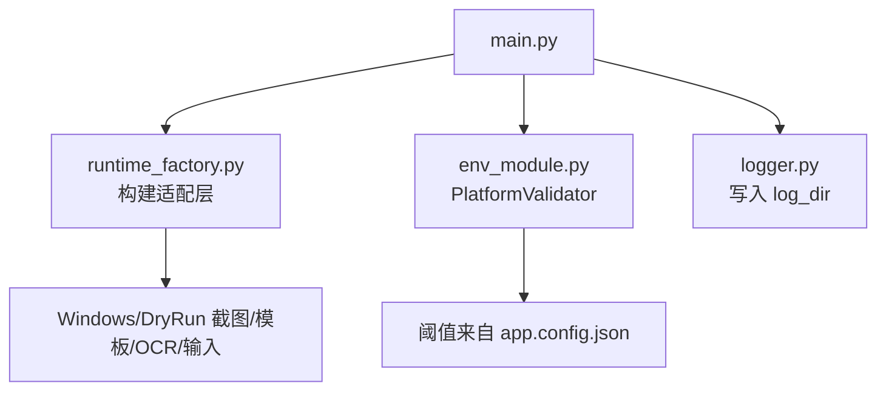
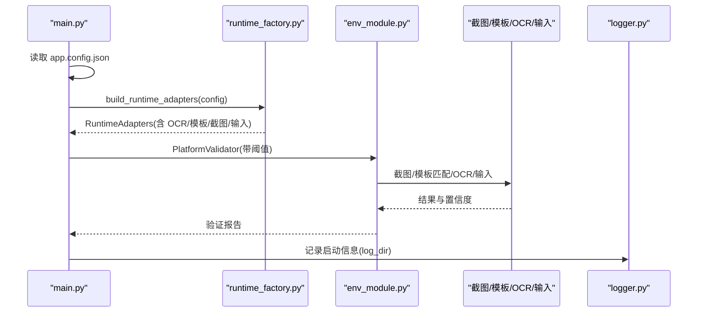
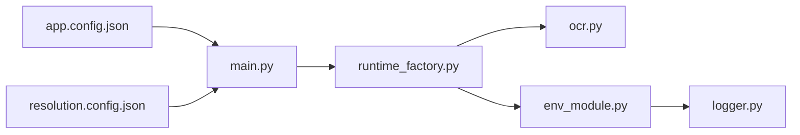

# 应用配置详解

<cite>
**本文引用的文件**
- [app.config.json](file://config/app.config.json)
- [main.py](file://src/main.py)
- [runtime_factory.py](file://src/core/runtime_factory.py)
- [env_module.py](file://src/modules/env_module.py)
- [ocr.py](file://src/vision/ocr.py)
- [logger.py](file://src/utils/logger.py)
- [templates.config.json](file://config/templates.config.json)
- [roi.config.json](file://config/roi.config.json)
- [resolution.config.json](file://config/resolution.config.json)
</cite>

## 目录
1. [简介](#简介)
2. [项目结构](#项目结构)
3. [核心组件](#核心组件)
4. [架构总览](#架构总览)
5. [详细组件分析](#详细组件分析)
6. [依赖关系分析](#依赖关系分析)
7. [性能与稳定性建议](#性能与稳定性建议)
8. [故障排查指南](#故障排查指南)
9. [结论](#结论)
10. [附录：配置项速查表](#附录配置项速查表)

## 简介
本文件面向应用主配置文件 app.config.json，系统性解释所有配置项的含义、用途、影响范围与调优建议。重点覆盖运行时模式、干运行模式、状态重试与超时、日志与截图路径、窗口标题关键字、OCR 相关参数、模板与 ROI 配置路径，以及平台验证阈值等。文档同时提供不同使用场景下的配置示例和常见问题排查方法，帮助快速定位并解决问题。

## 项目结构
应用启动时从 config/app.config.json 加载配置，随后通过工厂方法构建各平台适配层（截图、模板匹配、OCR、输入），并注入到平台校验器与调度器中。关键流程如下：
- main.py 读取 app.config.json 与分辨率配置，初始化日志与适配器，组装校验器与调度器后执行。
- runtime_factory.py 根据 runtime_mode 选择 Windows 或 DryRun 适配层，并将 OCR、ROI、模板路径等传入对应实现。
- env_module.py 中的 PlatformValidator 使用配置中的阈值对截图、模板匹配、OCR、输入链路进行验证。
- logger.py 依据 log_dir 创建日志目录并输出自动化日志。

图表来源
- [main.py:22-50](file://src/main.py#L22-L50)
- [runtime_factory.py:30-77](file://src/core/runtime_factory.py#L30-L77)
- [env_module.py:38-88](file://src/modules/env_module.py#L38-L88)
- [logger.py:11-39](file://src/utils/logger.py#L11-L39)

章节来源
- [main.py:22-50](file://src/main.py#L22-L50)
- [runtime_factory.py:30-77](file://src/core/runtime_factory.py#L30-L77)
- [env_module.py:38-88](file://src/modules/env_module.py#L38-L88)
- [logger.py:11-39](file://src/utils/logger.py#L11-L39)

## 核心组件
- 运行时装配：根据 runtime_mode 决定使用 Windows 真实适配层或 DryRun 模拟层，并注入 OCR、模板匹配、截图、输入控制器。
- 平台验证：按阈值检查截图、模板匹配、OCR、输入是否可用，生成报告与建议。
- 日志系统：按 log_dir 输出统一格式的自动化日志。
- OCR 后端：调用 Tesseract，支持语言、PSM、可执行命令配置，并提供预处理与调试图像输出。

章节来源
- [runtime_factory.py:30-77](file://src/core/runtime_factory.py#L30-L77)
- [env_module.py:38-88](file://src/modules/env_module.py#L38-L88)
- [ocr.py:23-70](file://src/vision/ocr.py#L23-L70)
- [logger.py:11-39](file://src/utils/logger.py#L11-L39)

## 架构总览
下图展示了配置如何驱动各模块协作，形成“截图—识别—输入—校验”的闭环。

图表来源
- [main.py:22-50](file://src/main.py#L22-L50)
- [runtime_factory.py:30-77](file://src/core/runtime_factory.py#L30-L77)
- [env_module.py:38-88](file://src/modules/env_module.py#L38-L88)
- [logger.py:11-39](file://src/utils/logger.py#L11-L39)

## 详细组件分析

### 运行时模式与干运行模式
- runtime_mode
  - 作用：决定使用 Windows 真实适配层还是 DryRun 模拟层。
  - 影响：切换截图、模板匹配、OCR、输入控制器的具体实现；在 Windows 模式下还会启用窗口标题关键字、Tesseract 调用、ROI 与模板路径解析。
  - 建议：开发调试阶段可使用 dry_run 快速验证流程；稳定后切换到 windows 以接入真实环境。
- dry_run_mode
  - 作用：用于标记当前是否为干运行模式，便于日志与行为提示。
  - 注意：当前代码在日志中会读取该字段用于提示运行模式，但实际适配层选择由 runtime_mode 决定。

章节来源
- [runtime_factory.py:30-77](file://src/core/runtime_factory.py#L30-L77)
- [main.py:22-50](file://src/main.py#L22-L50)

### 状态重试与超时
- max_state_retry
  - 作用：限制单个状态的最大重试次数，避免无限重试导致误操作。
  - 使用位置：状态机上下文维护 state_retry_count，结合此阈值判断是否继续重试或进入恢复/停机。
- state_timeout_sec
  - 作用：单状态等待超时时间（秒）。超过该时间未达成目标则视为失败，触发重试或恢复逻辑。
  - 建议：根据游戏响应速度与网络状况调整，过大可能拖慢整体流程，过小可能导致误判。

章节来源
- [context.py:31-62](file://src/core/context.py#L31-L62)

### 日志、截图与调试目录
- log_dir
  - 作用：指定自动化日志输出目录。程序会在该目录下生成统一的自动化日志文件。
  - 建议：确保进程对该目录有写权限；生产环境建议集中收集。
- screenshot_dir
  - 作用：截图保存目录。Windows 模式下用于保存全屏截图，供模板匹配与问题回溯。
  - 建议：定期清理历史截图，避免磁盘占用过高。
- debug_dir
  - 作用：调试输出目录。OCR 预处理时会在此输出原始、灰度、二值化图像，便于诊断识别效果。
  - 建议：开启后可结合 ROI 标定工具定位问题区域。

章节来源
- [logger.py:11-39](file://src/utils/logger.py#L11-L39)
- [ocr.py:73-107](file://src/vision/ocr.py#L73-L107)
- [runtime_factory.py:30-77](file://src/core/runtime_factory.py#L30-L77)

### 窗口标题关键字
- window_title_keyword
  - 作用：用于定位目标窗口（如游戏窗口）的关键字。Windows 模式下截图、输入等操作将基于该关键字锁定窗口。
  - 配置方法：设置为游戏窗口标题中包含的稳定片段，确保在不同会话中唯一且稳定。
  - 建议：若窗口标题变化频繁，可在启动前固定窗口标题或使用进程名辅助定位。

章节来源
- [runtime_factory.py:30-77](file://src/core/runtime_factory.py#L30-L77)

### OCR 相关配置
- ocr_language
  - 作用：设置 Tesseract 识别语言。需安装对应语言包。
  - 建议：根据游戏界面语言选择；中文界面使用 zh-CN，英文界面使用 eng。
- ocr_psm
  - 作用：页面分割模式（PSM），控制 Tesseract 如何切分文本行与块。
  - 常见选项：
    - 7：单行文本
    - 6：默认块
    - 其他模式适用于不同布局
  - 建议：根据 ROI 区域内容选择。UI 按钮或短文本常用 7；段落或多行用 6。
- ocr_tesseract_cmd
  - 作用：Tesseract 可执行文件名或完整路径。
  - 建议：若系统 PATH 未包含 tesseract，请配置为绝对路径；确保已安装对应语言包。

章节来源
- [ocr.py:23-70](file://src/vision/ocr.py#L23-L70)
- [runtime_factory.py:30-77](file://src/core/runtime_factory.py#L30-L77)

### 模板与 ROI 配置路径
- template_root
  - 作用：模板根目录。模板匹配器从此处加载模板资源。
  - 建议：按功能模块组织子目录，便于管理。
- template_config_path
  - 作用：模板清单配置文件路径，定义模板名称、路径、ROI、阈值等元数据。
  - 示例：hideout_anchor 模板指向 assets/templates/ui/hideout_anchor.bmp，并绑定 ROI 与阈值。
- roi_config_path
  - 作用：ROI 配置文件路径，定义截图裁剪区域坐标与尺寸，用于 OCR 与模板匹配聚焦关键区域。
  - 建议：使用采集工具标定 ROI，确保在不同分辨率下仍能准确裁剪。

章节来源
- [runtime_factory.py:30-77](file://src/core/runtime_factory.py#L30-L77)
- [templates.config.json:1-9](file://config/templates.config.json#L1-L9)
- [roi.config.json:1-31](file://config/roi.config.json#L1-L31)

### 平台验证阈值
- platform_validation.screenshot_check_count
  - 作用：截图检查次数。可用于多次采样以提高稳定性（例如连续截图若干次取平均或多数投票）。
  - 建议：根据环境抖动程度调整；数值越大越稳定但耗时增加。
- platform_validation.template_match_threshold
  - 作用：模板匹配阈值。高于该值认为匹配成功。
  - 建议：默认 0.95 较严格；若误匹配多可适当提高，若漏匹配多可适当降低。
- platform_validation.ocr_confidence_threshold
  - 作用：OCR 置信度阈值。低于该值认为识别不可信。
  - 建议：根据 ROI 内容与字体清晰度调整；复杂背景可降低阈值，清晰 UI 可提高阈值。
- platform_validation.input_success_threshold
  - 作用：输入成功阈值。用于评估点击/按键是否生效（例如通过后续截图对比或状态反馈）。
  - 建议：与业务动作风险挂钩；高风险动作应设置更高阈值。

章节来源
- [env_module.py:38-88](file://src/modules/env_module.py#L38-L88)
- [app.config.json:16-21](file://config/app.config.json#L16-L21)

## 依赖关系分析
- main.py 依赖 app.config.json 与 resolution.config.json，负责装配与启动。
- runtime_factory.py 依赖 app.config.json 中的路径与模式配置，构造各平台适配层。
- env_module.py 依赖阈值配置，串联截图、模板、OCR、输入链路进行验证。
- ocr.py 依赖 ROI 配置与 Tesseract 可执行文件，完成文本识别与调试图像输出。
- logger.py 依赖 log_dir，输出统一格式日志。

图表来源
- [main.py:22-50](file://src/main.py#L22-L50)
- [runtime_factory.py:30-77](file://src/core/runtime_factory.py#L30-L77)
- [ocr.py:23-70](file://src/vision/ocr.py#L23-L70)
- [env_module.py:38-88](file://src/modules/env_module.py#L38-L88)
- [logger.py:11-39](file://src/utils/logger.py#L11-L39)

章节来源
- [main.py:22-50](file://src/main.py#L22-L50)
- [runtime_factory.py:30-77](file://src/core/runtime_factory.py#L30-L77)
- [ocr.py:23-70](file://src/vision/ocr.py#L23-L70)
- [env_module.py:38-88](file://src/modules/env_module.py#L38-L88)
- [logger.py:11-39](file://src/utils/logger.py#L11-L39)

## 性能与稳定性建议
- 合理设置 state_timeout_sec 与 max_state_retry，避免过长等待与无限重试。
- 针对 OCR 与模板匹配，优先优化 ROI 与模板质量，再微调阈值。
- 使用 debug_dir 输出的预处理图像定位 OCR 问题（如二值化阈值不当、ROI 偏移）。
- 在生产环境关闭不必要的调试输出，减少 I/O 开销。
- 定期归档或清理 screenshot_dir 与 debug_dir，避免磁盘占满。

## 故障排查指南
- 无法找到 Tesseract
  - 现象：OCR 执行失败，提示未找到可执行文件。
  - 处理：确认已安装 Tesseract 并在 PATH 中；或在 ocr_tesseract_cmd 配置为绝对路径。
- OCR 识别率低
  - 现象：ocr_confidence_threshold 不达标。
  - 处理：调整 ocr_language 与 ocr_psm；检查 ROI 是否对准关键文本；查看 debug_dir 中的预处理图像。
- 模板匹配不稳定
  - 现象：template_match_threshold 不满足。
  - 处理：重新采集高质量模板；调整 ROI；必要时微调阈值。
- 窗口定位失败
  - 现象：window_title_keyword 无法命中目标窗口。
  - 处理：确认窗口标题包含该关键字；在多实例环境下确保唯一性。
- 日志目录无输出
  - 现象：log_dir 下无日志文件。
  - 处理：检查进程是否有写权限；确认 log_dir 路径正确。

章节来源
- [ocr.py:23-70](file://src/vision/ocr.py#L23-L70)
- [env_module.py:38-88](file://src/modules/env_module.py#L38-L88)
- [logger.py:11-39](file://src/utils/logger.py#L11-L39)
- [runtime_factory.py:30-77](file://src/core/runtime_factory.py#L30-L77)

## 结论
app.config.json 是应用运行的核心开关与参数中心。通过合理配置运行时模式、重试与超时、路径、OCR 参数与平台验证阈值，可以在不同环境与阶段快速切换，保证脚本在稳定前提下逐步扩展能力。建议先完成平台验证与基础链路打通，再逐步优化阈值与 ROI，最终实现稳定的自动化流程。

## 附录：配置项速查表
- runtime_mode
  - 类型：字符串
  - 说明：windows 或 dry_run，决定适配层实现。
- dry_run_mode
  - 类型：布尔
  - 说明：干运行模式标志，用于日志与提示。
- max_state_retry
  - 类型：整数
  - 说明：单状态最大重试次数。
- state_timeout_sec
  - 类型：整数
  - 说明：单状态超时秒数。
- log_dir
  - 类型：字符串
  - 说明：日志目录路径。
- screenshot_dir
  - 类型：字符串
  - 说明：截图保存目录。
- debug_dir
  - 类型：字符串
  - 说明：调试输出目录（OCR 预处理图像等）。
- window_title_keyword
  - 类型：字符串
  - 说明：目标窗口标题关键字。
- ocr_language
  - 类型：字符串
  - 说明：Tesseract 语言包标识。
- ocr_psm
  - 类型：整数
  - 说明：Tesseract 页面分割模式。
- ocr_tesseract_cmd
  - 类型：字符串
  - 说明：Tesseract 可执行文件或路径。
- template_root
  - 类型：字符串
  - 说明：模板根目录。
- template_config_path
  - 类型：字符串
  - 说明：模板清单配置文件路径。
- roi_config_path
  - 类型：字符串
  - 说明：ROI 配置文件路径。
- platform_validation
  - screenshot_check_count：截图检查次数
  - template_match_threshold：模板匹配阈值
  - ocr_confidence_threshold：OCR 置信度阈值
  - input_success_threshold：输入成功阈值

章节来源
- [app.config.json:1-22](file://config/app.config.json#L1-L22)
- [runtime_factory.py:30-77](file://src/core/runtime_factory.py#L30-L77)
- [env_module.py:38-88](file://src/modules/env_module.py#L38-L88)
- [ocr.py:23-70](file://src/vision/ocr.py#L23-L70)
- [logger.py:11-39](file://src/utils/logger.py#L11-L39)