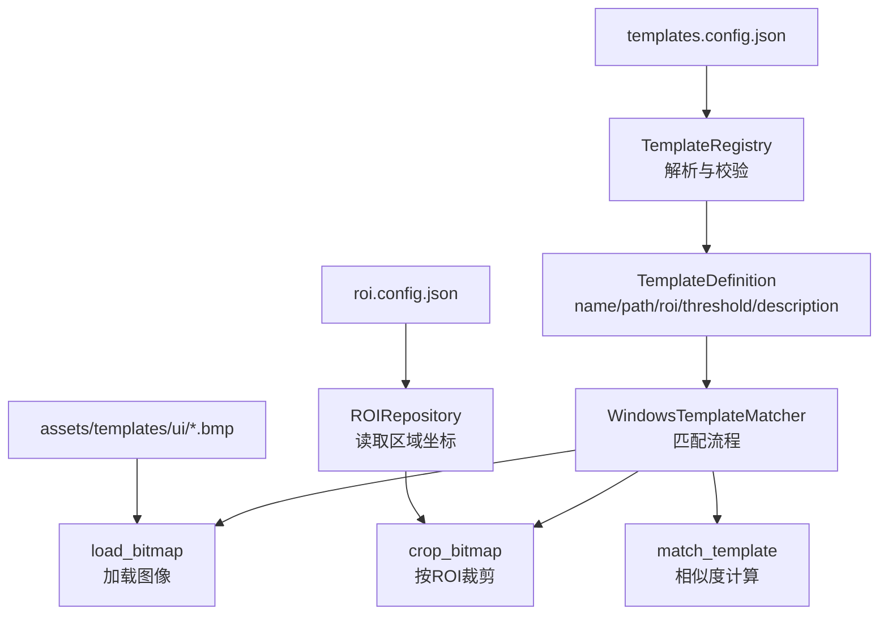
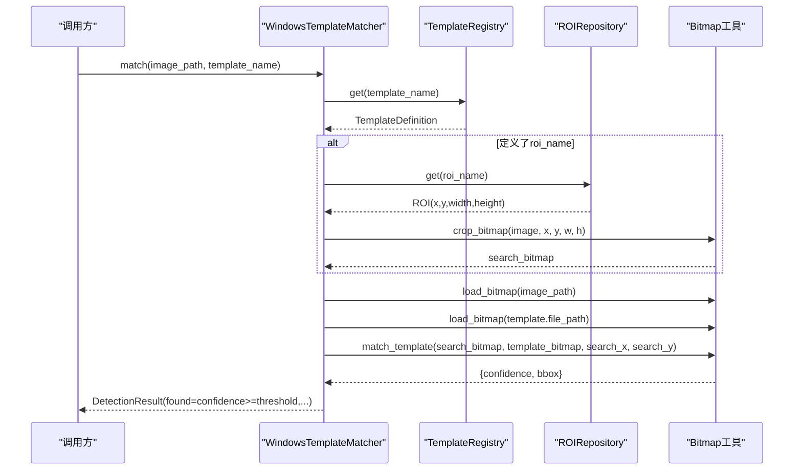
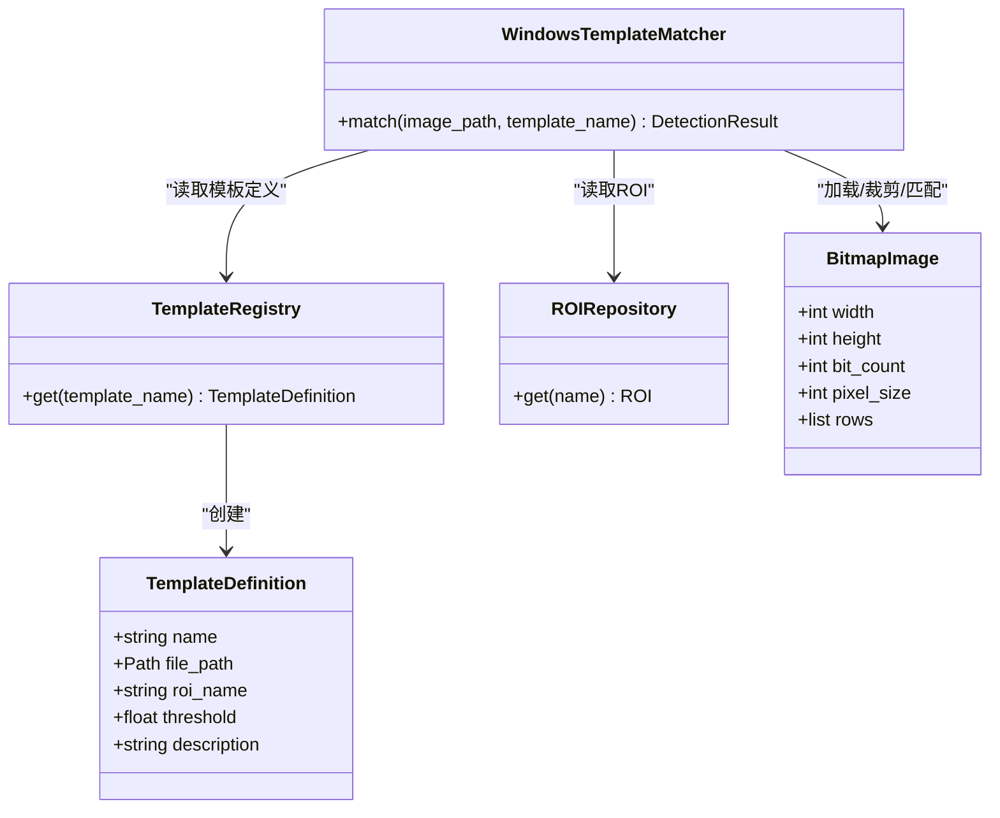

# 模板配置管理

<cite>
**本文引用的文件**
- [config/templates.config.json](file://config/templates.config.json)
- [src/vision/template_registry.py](file://src/vision/template_registry.py)
- [src/vision/contracts.py](file://src/vision/contracts.py)
- [src/vision/bitmap.py](file://src/vision/bitmap.py)
- [config/roi.config.json](file://config/roi.config.json)
- [tools/collect_template.py](file://tools/collect_template.py)
- [assets/templates/ui/hideout_anchor.bmp](file://assets/templates/ui/hideout_anchor.bmp)
</cite>

## 目录
1. [简介](#简介)
2. [项目结构](#项目结构)
3. [核心组件](#核心组件)
4. [架构总览](#架构总览)
5. [详细组件分析](#详细组件分析)
6. [依赖关系分析](#依赖关系分析)
7. [性能考虑](#性能考虑)
8. [故障排查指南](#故障排查指南)
9. [结论](#结论)
10. [附录](#附录)

## 简介
本文件面向模板配置文件 templates.config.json，系统性说明其结构、字段含义、与匹配算法的联动方式、最佳实践、维护策略、验证规则与常见错误处理，以及性能优化建议。目标是让使用者在不深入代码的前提下，也能正确编写、维护和排错模板配置。

## 项目结构
- 模板定义集中存放在 config/templates.config.json，以“模板名”为键组织多个模板条目。
- 模板图像文件统一放置在 assets/templates/ui 目录下（示例：hideout_anchor.bmp）。
- ROI（感兴趣区域）定义在 config/roi.config.json，用于限制模板匹配范围，提升性能与稳定性。
- 模板注册与加载逻辑位于 src/vision/template_registry.py，负责解析配置、校验路径并返回结构化定义。
- 模板匹配流程由 src/vision/contracts.py 中的 WindowsTemplateMatcher 驱动，结合 ROI 裁剪与相似度计算。
- 模板采集工具 tools/collect_template.py 可从截图按 ROI 截取模板并保存。

**图表来源**
- [src/vision/template_registry.py:17-43](file://src/vision/template_registry.py#L17-L43)
- [src/vision/contracts.py:119-185](file://src/vision/contracts.py#L119-L185)
- [src/vision/bitmap.py:100-165](file://src/vision/bitmap.py#L100-L165)
- [config/roi.config.json:1-31](file://config/roi.config.json#L1-L31)

**章节来源**
- [config/templates.config.json:1-9](file://config/templates.config.json#L1-L9)
- [src/vision/template_registry.py:17-43](file://src/vision/template_registry.py#L17-L43)
- [src/vision/contracts.py:119-185](file://src/vision/contracts.py#L119-L185)
- [src/vision/bitmap.py:100-165](file://src/vision/bitmap.py#L100-L165)
- [config/roi.config.json:1-31](file://config/roi.config.json#L1-L31)
- [tools/collect_template.py:15-37](file://tools/collect_template.py#L15-L37)

## 核心组件
- TemplateDefinition：模板的结构化定义，包含名称、文件路径、ROI 名称、阈值、描述等。
- TemplateRegistry：从配置文件中读取模板定义，校验路径存在性，返回 TemplateDefinition。
- WindowsTemplateMatcher：根据模板名加载模板与截图，按 ROI 裁剪后执行模板匹配，输出检测结果。
- Bitmap 工具：提供 BMP 图像的加载、裁剪、灰度转换与相似度计算。
- ROIRepository：读取 ROI 配置，提供区域坐标用于裁剪。

**章节来源**
- [src/vision/template_registry.py:8-43](file://src/vision/template_registry.py#L8-L43)
- [src/vision/contracts.py:119-185](file://src/vision/contracts.py#L119-L185)
- [src/vision/bitmap.py:17-60](file://src/vision/bitmap.py#L17-L60)
- [src/vision/bitmap.py:100-165](file://src/vision/bitmap.py#L100-L165)

## 架构总览
模板匹配的整体流程如下：
- 通过模板名从 templates.config.json 获取模板定义。
- 根据 ROI 名称从 roi.config.json 获取区域坐标，对截图进行裁剪。
- 将截图与模板图转换为灰度并进行逐像素相似度计算。
- 使用模板定义的 threshold 判断是否命中，返回置信度与边界框。

**图表来源**
- [src/vision/contracts.py:119-185](file://src/vision/contracts.py#L119-L185)
- [src/vision/template_registry.py:22-43](file://src/vision/template_registry.py#L22-L43)
- [src/vision/bitmap.py:118-165](file://src/vision/bitmap.py#L118-L165)

## 详细组件分析

### 模板配置文件结构与字段
- 顶层键为模板名，值是一个对象，包含以下字段：
  - path：模板图片相对路径（相对于模板根目录 assets/templates/ui）。
  - roi：可选，ROI 名称，用于限定匹配区域。
  - threshold：可选，匹配阈值，默认 0.95；高于该值视为命中。
  - description：可选，模板描述，便于维护与审计。
- 当前示例中 hideout_anchor 模板绑定了同名 ROI，阈值为 0.95。

**章节来源**
- [config/templates.config.json:1-9](file://config/templates.config.json#L1-L9)
- [src/vision/template_registry.py:30-43](file://src/vision/template_registry.py#L30-L43)

### 模板匹配算法相关配置
- 相似度阈值 threshold：决定判定命中的临界值，越高越严格。
- 搜索区域 ROI：通过 roi_name 绑定到具体 ROI，仅在该区域内扫描，显著降低计算量。
- 预处理选项：当前实现将图像与模板转为灰度后进行相似度计算；未引入额外滤镜或缩放。
- 匹配结果：返回 confidence 与 bbox；当 confidence < threshold 时，bbox 置空且 found=false。

**章节来源**
- [src/vision/contracts.py:133-185](file://src/vision/contracts.py#L133-L185)
- [src/vision/bitmap.py:118-201](file://src/vision/bitmap.py#L118-L201)

### 模板分类与命名规范建议
- 分类建议：
  - 界面元素类：按钮、文本框、图标、标签等。
  - 状态指示类：进度条、开关、提示框等。
  - 业务场景类：地图面板、祭坛、背包页等。
- 命名建议：
  - 使用小写下划线分隔，语义清晰，如 button_start_game、icon_map_device。
  - 避免使用通用词如 “btn”、“icon”，应体现具体用途。
  - 同一类别内保持前缀一致，便于批量管理与检索。
- 描述建议：
  - description 应说明用途、版本、适用场景，便于后续维护与回滚。

[本节为概念性指导，不直接分析具体文件]

### 不同类型 UI 元素的模板配置示例
- 按钮：
  - path：指向按钮截图的 BMP 文件。
  - roi：可绑定到按钮所在区域的 ROI，减少误识别。
  - threshold：建议 0.95~0.98，确保高置信度。
  - description：记录按钮功能与版本信息。
- 文本框：
  - path：文本框边框或占位符的截图。
  - roi：文本框区域，避免与其他控件混淆。
  - threshold：0.95 左右，视 UI 变化调整。
- 图标：
  - path：图标 BMP。
  - roi：图标所在区域，提高定位精度。
  - threshold：0.95+，必要时提高至 0.98。

[本节为概念性指导，不直接分析具体文件]

### 模板更新与维护策略
- 版本管理：
  - 每次游戏更新或 UI 变更，重新采集模板并更新 path。
  - 保留历史模板以便回滚，并在 description 中标注版本。
- 兼容性：
  - 若分辨率或 UI 缩放变化，需重新标定 ROI 并调整 threshold。
  - 对于多语言或多主题，建议分别建立模板集与对应 ROI。
- 自动化辅助：
  - 使用 collect_template.py 从截图按 ROI 截取模板，减少手工操作。
  - 建议在 CI 中加入模板有效性检查（路径存在、尺寸合理、阈值测试）。

**章节来源**
- [tools/collect_template.py:15-37](file://tools/collect_template.py#L15-L37)

### 模板配置的验证规则
- 必填字段：
  - path：必须存在且为 BMP 格式，支持 24/32 位未压缩。
  - name：模板名需在配置中存在且唯一。
- 可选字段：
  - roi：若指定，需在 ROI 配置中存在且与当前截图尺寸兼容。
  - threshold：若不指定，默认 0.95。
  - description：建议填写，便于维护。
- 运行时校验：
  - 配置不存在或模板名缺失会抛出异常。
  - 模板文件不存在会抛出异常。
  - ROI 越界会返回未命中并附带错误信息，便于诊断。

**章节来源**
- [src/vision/template_registry.py:22-43](file://src/vision/template_registry.py#L22-L43)
- [src/vision/bitmap.py:17-39](file://src/vision/bitmap.py#L17-L39)
- [src/vision/bitmap.py:100-105](file://src/vision/bitmap.py#L100-L105)
- [src/vision/contracts.py:143-163](file://src/vision/contracts.py#L143-L163)

### 常见错误处理方法
- 模板配置不存在：检查 config 路径与文件名是否正确。
- 模板文件不存在：确认 path 指向的 BMP 是否存在于模板根目录。
- ROI 越界：检查 ROI 坐标与截图分辨率是否一致；必要时重新标定。
- 像素格式不一致：确保模板与截图均为相同位深的 BMP。
- 模板尺寸大于搜索图：检查截图是否完整捕获目标区域。

**章节来源**
- [src/vision/template_registry.py:22-35](file://src/vision/template_registry.py#L22-L35)
- [src/vision/bitmap.py:17-39](file://src/vision/bitmap.py#L17-L39)
- [src/vision/bitmap.py:124-127](file://src/vision/bitmap.py#L124-L127)
- [src/vision/contracts.py:143-163](file://src/vision/contracts.py#L143-L163)

## 依赖关系分析
- TemplateRegistry 依赖 JSON 配置与文件系统。
- WindowsTemplateMatcher 依赖 TemplateRegistry、ROIRepository、Bitmap 工具。
- Bitmap 工具提供底层图像读写与相似度计算。
- ROIRepository 依赖 ROI 配置文件。

**图表来源**
- [src/vision/template_registry.py:8-43](file://src/vision/template_registry.py#L8-L43)
- [src/vision/contracts.py:119-185](file://src/vision/contracts.py#L119-L185)
- [src/vision/bitmap.py:8-60](file://src/vision/bitmap.py#L8-L60)

**章节来源**
- [src/vision/template_registry.py:8-43](file://src/vision/template_registry.py#L8-L43)
- [src/vision/contracts.py:119-185](file://src/vision/contracts.py#L119-L185)
- [src/vision/bitmap.py:8-60](file://src/vision/bitmap.py#L8-L60)

## 性能考虑
- 使用 ROI 裁剪：
  - 在整图上做全图匹配代价高，务必为每个模板绑定合适的 ROI，仅在局部区域扫描。
- 控制阈值：
  - 过低的阈值会增加误报与重复扫描次数；过高可能漏检。建议从 0.95 起步，逐步调优。
- 图像格式与尺寸：
  - 统一使用 24/32 位未压缩 BMP，避免解码开销与格式差异。
  - 保证截图分辨率固定，减少 ROI 漂移带来的重标定成本。
- 批量加载与缓存：
  - 当前实现按需加载模板与截图；可在上层对频繁使用的模板进行内存缓存，减少 IO 与解码开销。
- 预处理简化：
  - 当前仅灰度转换，无复杂滤镜；如需增强鲁棒性，可在 ROI 内增加对比度或二值化预处理，但需评估性能影响。

[本节为通用性能建议，不直接分析具体文件]

## 故障排查指南
- 配置问题：
  - 检查 templates.config.json 中模板名与字段拼写。
  - 确认 path 指向的 BMP 存在且可读。
- ROI 问题：
  - 若 ROI 越界，检查截图分辨率与 ROI 坐标是否匹配。
  - 使用 collect_template.py 重新采集模板，确保 ROI 准确。
- 匹配失败：
  - 提高或降低 threshold，观察命中率变化。
  - 检查模板与截图是否来自同一环境（分辨率、UI 缩放、语言）。
- 日志与调试：
  - 关注 DetectionResult.extra 中的 template_path、template_threshold、roi_name、match_error 等信息，快速定位问题。

**章节来源**
- [src/vision/contracts.py:143-185](file://src/vision/contracts.py#L143-L185)
- [tools/collect_template.py:15-37](file://tools/collect_template.py#L15-L37)

## 结论
templates.config.json 是模板匹配系统的核心配置入口，配合 ROI 与阈值可实现高效稳定的 UI 元素识别。遵循命名规范、版本管理与性能优化建议，可显著提升脚本的鲁棒性与可维护性。遇到问题时，优先检查配置完整性、ROI 准确性与阈值合理性，并结合运行时的 extra 信息进行诊断。

## 附录
- 模板采集工具用法：
  - 通过 collect_template.py 传入截图路径、ROI 配置与 ROI 名称，输出模板 BMP。
  - 适用于快速生成新模板或更新旧模板。

**章节来源**
- [tools/collect_template.py:15-37](file://tools/collect_template.py#L15-L37)