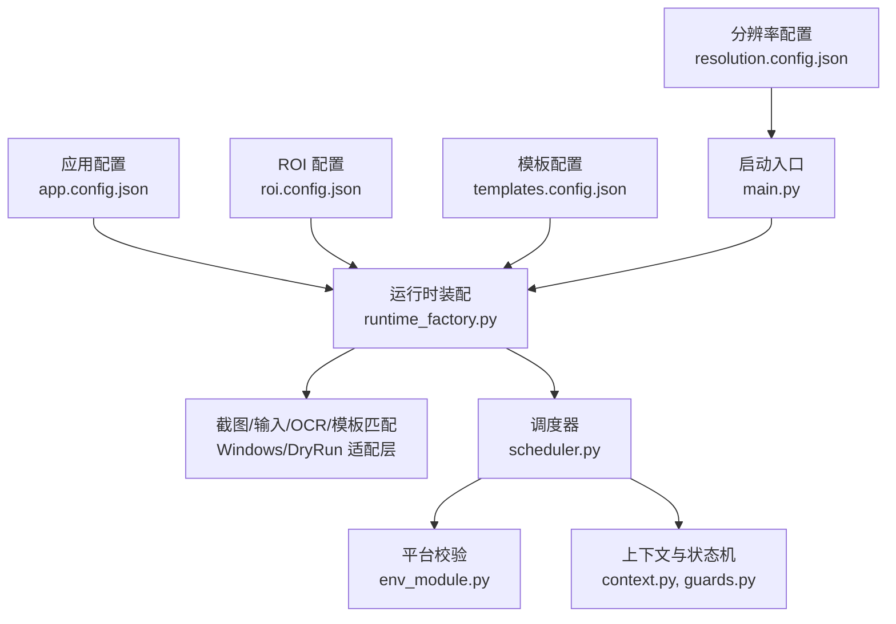
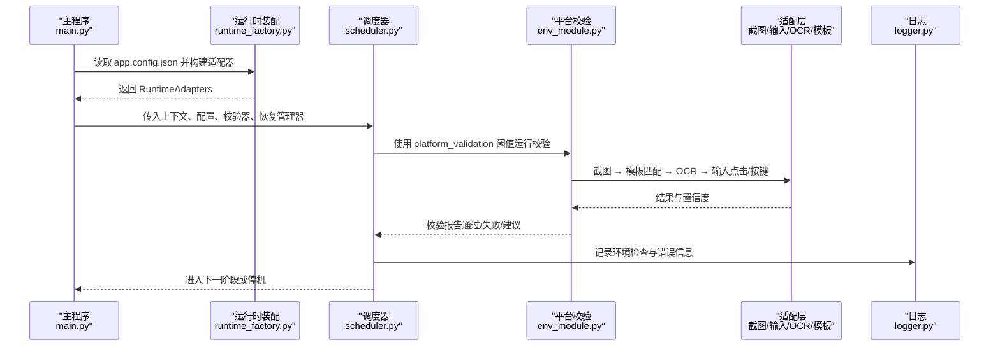
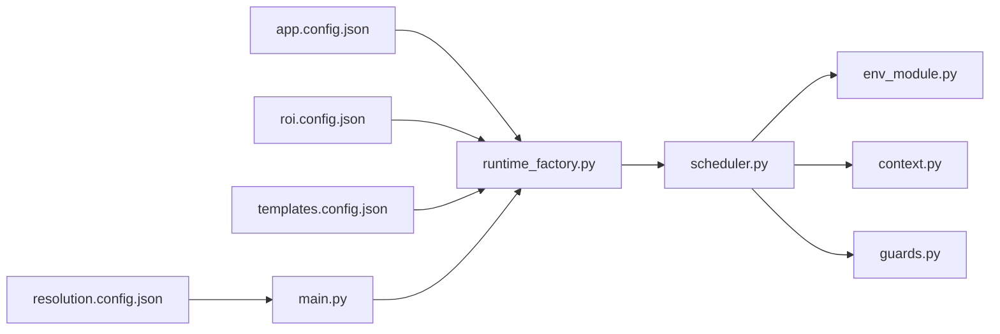

# 配置最佳实践

<cite>
**本文引用的文件**
- [config/app.config.json](file://config/app.config.json)
- [config/resolution.config.json](file://config/resolution.config.json)
- [config/roi.config.json](file://config/roi.config.json)
- [config/templates.config.json](file://config/templates.config.json)
- [src/main.py](file://src/main.py)
- [src/core/runtime_factory.py](file://src/core/runtime_factory.py)
- [src/core/context.py](file://src/core/context.py)
- [src/core/scheduler.py](file://src/core/scheduler.py)
- [src/core/guards.py](file://src/core/guards.py)
- [src/modules/env_module.py](file://src/modules/env_module.py)
- [src/utils/logger.py](file://src/utils/logger.py)
- [src/vision/template_registry.py](file://src/vision/template_registry.py)
- [src/vision/roi.py](file://src/vision/roi.py)
- [tools/calibrate_roi.py](file://tools/calibrate_roi.py)
- [tools/capture_roi.py](file://tools/capture_roi.py)
- [tools/collect_template.py](file://tools/collect_template.py)
- [tools/test_ocr.py](file://tools/test_ocr.py)
- [README.md](file://README.md)
</cite>

## 目录
1. [简介](#简介)
2. [项目结构](#项目结构)
3. [核心组件](#核心组件)
4. [架构总览](#架构总览)
5. [详细组件分析](#详细组件分析)
6. [依赖关系分析](#依赖关系分析)
7. [性能与稳定性调优](#性能与稳定性调优)
8. [配置验证与测试](#配置验证与测试)
9. [配置迁移与升级](#配置迁移与升级)
10. [常见问题诊断与排错](#常见问题诊断与排错)
11. [监控与日志最佳实践](#监控与日志最佳实践)
12. [结论](#结论)

## 简介
本指南面向配置系统，总结跨配置文件的通用原则、命名约定、组织结构与版本管理策略；提供开发、测试、生产环境的差异化模板建议；给出参数调优方法（性能、稳定性、资源控制）；说明配置验证与测试流程；提供迁移与升级指导；并汇总常见问题的诊断方法与运维监控、日志分析的最佳实践。

## 项目结构
本项目采用“配置文件集中 + 运行时装配”的方式：
- 应用级配置：运行模式、路径、阈值、OCR 等
- 分辨率与环境配置：分辨率、窗口模式、UI 缩放、语言
- ROI 区域配置：截图识别的固定区域定义
- 模板注册配置：模板文件路径、关联 ROI、匹配阈值
- 启动入口：加载配置并构建运行时适配器
- 工具链：ROI 标定、模板采集、OCR 测试

图表来源
- [src/main.py:22-50](file://src/main.py#L22-L50)
- [src/core/runtime_factory.py:30-77](file://src/core/runtime_factory.py#L30-L77)
- [src/core/scheduler.py:57-82](file://src/core/scheduler.py#L57-L82)
- [src/modules/env_module.py:23-88](file://src/modules/env_module.py#L23-L88)
- [src/core/context.py:31-62](file://src/core/context.py#L31-L62)
- [src/core/guards.py:6-15](file://src/core/guards.py#L6-L15)

章节来源
- [src/main.py:22-50](file://src/main.py#L22-L50)
- [src/core/runtime_factory.py:30-77](file://src/core/runtime_factory.py#L30-L77)
- [config/app.config.json:1-23](file://config/app.config.json#L1-L23)
- [config/resolution.config.json:1-8](file://config/resolution.config.json#L1-L8)
- [config/roi.config.json:1-31](file://config/roi.config.json#L1-L31)
- [config/templates.config.json:1-9](file://config/templates.config.json#L1-L9)

## 核心组件
- 应用配置中心：统一承载运行模式、路径、阈值、OCR 参数、平台校验阈值等
- 运行时装配器：根据配置选择 Windows 或 DryRun 适配层，注入截图、输入、OCR、模板匹配能力
- 平台校验器：对截图、模板匹配、OCR、输入链路进行端到端验证，输出通过/失败与建议
- 调度器与上下文：驱动状态机，结合守卫（重试、超时）保证稳定执行
- 模板与 ROI 仓库：以 JSON 描述模板与 ROI，支持查询、写入与更新
- 工具链：ROI 标定、模板采集、OCR 测试，形成可重复的配置工程化流程

章节来源
- [src/core/runtime_factory.py:30-77](file://src/core/runtime_factory.py#L30-L77)
- [src/modules/env_module.py:23-88](file://src/modules/env_module.py#L23-L88)
- [src/core/scheduler.py:57-82](file://src/core/scheduler.py#L57-L82)
- [src/vision/template_registry.py:17-43](file://src/vision/template_registry.py#L17-L43)
- [src/vision/roi.py:21-45](file://src/vision/roi.py#L21-L45)

## 架构总览
配置驱动的运行时装配与校验流程如下：

图表来源
- [src/main.py:22-50](file://src/main.py#L22-L50)
- [src/core/runtime_factory.py:30-77](file://src/core/runtime_factory.py#L30-L77)
- [src/core/scheduler.py:57-82](file://src/core/scheduler.py#L57-L82)
- [src/modules/env_module.py:38-88](file://src/modules/env_module.py#L38-L88)
- [src/utils/logger.py:11-39](file://src/utils/logger.py#L11-L39)

## 详细组件分析

### 应用配置（app.config.json）
- 作用域：全局运行模式、路径、OCR、平台校验阈值等
- 关键项：
  - 运行模式：windows/dry_run
  - 路径：log_dir、screenshot_dir、debug_dir、template_root
  - OCR：language、psm、tesseract_cmd
  - 平台校验：screenshot_check_count、template_match_threshold、ocr_confidence_threshold、input_success_threshold
- 最佳实践：
  - 将环境与业务强耦合的参数放在此文件，便于按环境切换
  - 所有路径使用相对项目根的路径，由运行时解析为绝对路径
  - 阈值需与平台能力匹配，避免过严导致误报或过松导致误操作

章节来源
- [config/app.config.json:1-23](file://config/app.config.json#L1-L23)
- [src/core/runtime_factory.py:30-77](file://src/core/runtime_factory.py#L30-L77)

### 分辨率与环境配置（resolution.config.json）
- 作用域：分辨率、窗口模式、UI 缩放、语言
- 最佳实践：
  - 第一版严格固定分辨率与 UI 设置，减少识别漂移
  - 多环境可通过不同配置文件实现隔离

章节来源
- [config/resolution.config.json:1-8](file://config/resolution.config.json#L1-L8)
- [src/main.py:22-32](file://src/main.py#L22-L32)

### ROI 配置（roi.config.json）
- 作用域：截图识别的区域定义，包含坐标、尺寸、描述
- 最佳实践：
  - 每个 ROI 名称唯一且语义清晰（如 hideout_anchor、map_device_panel）
  - 使用工具链标定并保存，避免手工编辑出错
  - 在模板配置中引用 ROI，确保模板与区域一致

章节来源
- [config/roi.config.json:1-31](file://config/roi.config.json#L1-L31)
- [src/vision/roi.py:21-45](file://src/vision/roi.py#L21-L45)
- [tools/calibrate_roi.py:14-42](file://tools/calibrate_roi.py#L14-L42)

### 模板配置（templates.config.json）
- 作用域：模板文件路径、关联 ROI、匹配阈值、描述
- 最佳实践：
  - 模板文件存放于 template_root 下，路径相对该根
  - 阈值与平台能力、图像质量匹配，必要时分场景配置
  - 模板变更后需回归校验

章节来源
- [config/templates.config.json:1-9](file://config/templates.config.json#L1-L9)
- [src/vision/template_registry.py:17-43](file://src/vision/template_registry.py#L17-L43)

### 运行时装配（runtime_factory.py）
- 作用域：根据配置选择 Windows 或 DryRun 适配层，注入截图、输入、OCR、模板匹配能力
- 关键点：
  - 从 app.config.json 读取运行模式、路径、OCR 参数
  - 解析模板与 ROI 配置路径，传递给相应模块
  - 提供下一步建议，辅助开发与排障

章节来源
- [src/core/runtime_factory.py:30-77](file://src/core/runtime_factory.py#L30-L77)

### 平台校验（env_module.py）
- 作用域：端到端验证截图、模板匹配、OCR、输入链路
- 关键点：
  - 使用 platform_validation 中的阈值判断是否通过
  - 收集错误与建议，供调度器记录与后续处理

章节来源
- [src/modules/env_module.py:23-88](file://src/modules/env_module.py#L23-L88)
- [config/app.config.json:16-21](file://config/app.config.json#L16-L21)

### 调度器与上下文（scheduler.py, context.py, guards.py）
- 作用域：驱动状态机、执行环境检查、管理重试与超时
- 关键点：
  - CHECK_ENV 阶段调用 PlatformValidator 并记录结果
  - 使用 Guards 判断重试耗尽与状态超时
  - Context 维护当前状态、重试次数、时间戳等

章节来源
- [src/core/scheduler.py:57-82](file://src/core/scheduler.py#L57-L82)
- [src/core/context.py:31-62](file://src/core/context.py#L31-L62)
- [src/core/guards.py:6-15](file://src/core/guards.py#L6-L15)

### 工具链（calibrate_roi.py, capture_roi.py, collect_template.py, test_ocr.py）
- 作用域：ROI 标定、模板采集、OCR 测试
- 关键点：
  - 标准化命令行参数，便于集成到自动化脚本
  - 输出结构化结果，方便后续处理与审计

章节来源
- [tools/calibrate_roi.py:14-42](file://tools/calibrate_roi.py#L14-L42)
- [tools/capture_roi.py:15-37](file://tools/capture_roi.py#L15-L37)
- [tools/collect_template.py:15-37](file://tools/collect_template.py#L15-L37)
- [tools/test_ocr.py:26-181](file://tools/test_ocr.py#L26-L181)

## 依赖关系分析
配置与代码之间的依赖关系如下：

图表来源
- [src/main.py:22-50](file://src/main.py#L22-L50)
- [src/core/runtime_factory.py:30-77](file://src/core/runtime_factory.py#L30-L77)
- [src/core/scheduler.py:57-82](file://src/core/scheduler.py#L57-L82)
- [src/modules/env_module.py:23-88](file://src/modules/env_module.py#L23-L88)
- [src/core/context.py:31-62](file://src/core/context.py#L31-L62)
- [src/core/guards.py:6-15](file://src/core/guards.py#L6-L15)

章节来源
- [src/main.py:22-50](file://src/main.py#L22-L50)
- [src/core/runtime_factory.py:30-77](file://src/core/runtime_factory.py#L30-L77)
- [src/core/scheduler.py:57-82](file://src/core/scheduler.py#L57-L82)

## 性能与稳定性调优
- 性能优化
  - 合理设置 OCR PSM 与语言，减少不必要的预处理开销
  - 限制截图数量与频率，避免频繁 IO 造成卡顿
  - 模板匹配阈值与 ROI 大小平衡，过大影响速度，过小降低鲁棒性
- 稳定性提升
  - 使用 Guards 的重试与超时机制，防止无限循环
  - 平台校验失败时优先停机，不继续危险操作
  - 低置信度识别不驱动危险动作，遵循需求约束
- 资源消耗控制
  - 日志级别与输出路径可控，避免磁盘写满
  - 调试图与截图目录定期清理，避免占用过多空间
  - DryRun 模式用于快速验证逻辑，减少真实系统调用

章节来源
- [src/core/guards.py:6-15](file://src/core/guards.py#L6-L15)
- [src/modules/env_module.py:38-88](file://src/modules/env_module.py#L38-L88)
- [src/utils/logger.py:11-39](file://src/utils/logger.py#L11-L39)
- [README.md:192-227](file://README.md#L192-L227)

## 配置验证与测试
- 自动化验证
  - 使用 PlatformValidator 对截图、模板匹配、OCR、输入链路进行端到端验证
  - 基于 app.config.json 中的 platform_validation 阈值判定通过与否
  - 工具链支持批量标定与采集，形成可重复的验证流程
- 手动测试流程
  - 使用 tools/test_ocr.py 进行 OCR 测试，支持 dry-run 模式仅验证预处理链路
  - 使用 tools/calibrate_roi.py 标定 ROI，确保区域准确
  - 使用 tools/collect_template.py 采集模板，配合 templates.config.json 注册
- 验收标准参考
  - 截图成功率、模板识别成功率、OCR 识别成功率、进图成功率、祭坛发现与交互成功率等指标需持续记录

章节来源
- [src/modules/env_module.py:38-88](file://src/modules/env_module.py#L38-L88)
- [tools/test_ocr.py:26-181](file://tools/test_ocr.py#L26-L181)
- [tools/calibrate_roi.py:14-42](file://tools/calibrate_roi.py#L14-L42)
- [tools/collect_template.py:15-37](file://tools/collect_template.py#L15-L37)
- [README.md:229-243](file://README.md#L229-L243)

## 配置迁移与升级
- 向后兼容
  - 新增配置项需提供默认值，避免旧配置缺失导致崩溃
  - 路径解析统一通过 resolve_project_path，保持相对路径兼容性
- 平滑过渡
  - 先在新环境启用 DryRun 模式验证逻辑，再切换到 Windows 真实模式
  - 逐步调整阈值与 ROI，观察平台校验报告与建议，避免一次性变更过多
- 版本管理
  - 模板与 ROI 配置变更需伴随回归测试，确保模板文件存在且有效
  - 保留历史配置备份，便于回滚

章节来源
- [src/core/runtime_factory.py:30-77](file://src/core/runtime_factory.py#L30-L77)
- [src/vision/template_registry.py:17-43](file://src/vision/template_registry.py#L17-L43)
- [src/vision/roi.py:21-45](file://src/vision/roi.py#L21-L45)

## 常见问题诊断与排错
- 性能瓶颈
  - 现象：单轮耗时过长、OCR 识别慢
  - 排查：检查 OCR 语言与 PSM 设置、ROI 大小、预处理步骤
  - 解决：优化预处理、缩小 ROI、调整阈值
- 识别失败
  - 现象：模板匹配或 OCR 置信度低于阈值
  - 排查：确认模板文件存在、ROI 坐标正确、截图无黑屏或错位
  - 解决：重新采集模板、校准 ROI、调整阈值
- 内存泄漏
  - 现象：长时间运行后内存持续增长
  - 排查：检查截图与调试图保存路径、是否及时释放对象
  - 解决：限制输出目录大小、优化图像处理流程
- 输入异常
  - 现象：点击或按键无效
  - 排查：确认窗口标题关键词命中目标窗口、输入链路正常
  - 解决：修正 window_title_keyword、检查输入控制器

章节来源
- [src/modules/env_module.py:38-88](file://src/modules/env_module.py#L38-L88)
- [tools/test_ocr.py:26-181](file://tools/test_ocr.py#L26-L181)
- [src/core/runtime_factory.py:30-77](file://src/core/runtime_factory.py#L30-L77)

## 监控与日志最佳实践
- 日志规范
  - 使用统一的 logger 获取器，输出控制台与文件日志
  - 记录环境检查结果、错误信息与下一步建议
- 监控指标
  - 截图成功率、模板识别成功率、OCR 识别成功率、进图成功率、祭坛发现与交互成功率、卡住恢复成功率、安全停机成功率、连续运行轮数
- 日志分析
  - 关注错误堆栈与建议信息，定位失败链路
  - 结合截图与调试图，分析 ROI 与模板匹配效果

章节来源
- [src/utils/logger.py:11-39](file://src/utils/logger.py#L11-L39)
- [src/core/scheduler.py:57-82](file://src/core/scheduler.py#L57-L82)
- [README.md:229-243](file://README.md#L229-L243)

## 结论
本指南围绕配置系统的组织、验证、调优与运维提供了系统化建议。通过统一的配置中心、严格的平台校验、完善的工具链与日志监控，可在保证稳定性的前提下持续提升识别准确率与运行效率。建议在多环境中采用差异化配置与渐进式升级策略，确保平滑过渡与向后兼容。